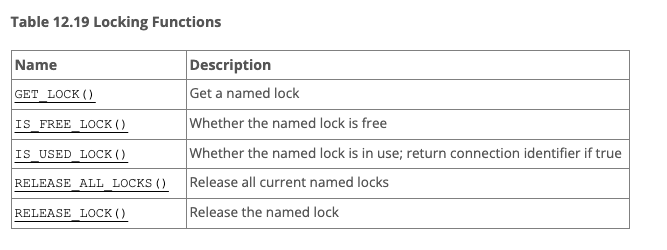

mysql named lock

- **mysql 5.7 기준**
- 
  - GET_LOCK(str, timeout)
    - str로 주어진 name을 사용해서 timeout초 만큼 lock을 얻기위해 시도함
      - minus timeout값이면 무한대로 기다림
      - 64글자로 제한
      - 한번에 여러 잠금 요청이 들어왔을때, 잠금획득 순서보장안됨
    - 응답값
      - Returns 1 if the lock was obtained successfully, 0 if the attempt timed out (for example, because another client has previously locked the name), or NULL if an error occurred (such as running out of memory or the thread was killed with mysqladmin kill).
    - 락은 배타락
      - 한 세션이 잡고있으면, 다른 세션이 가질 수 없음
    - 반드시 `RELEASE_LOCK` 을 통해 해제하거나, 세션이 종료될때 해제됨
      - 트랜잭션이 롤백되거나 커밋된다고 락이 해제되는게 아님
    - 특정 세션이 **같은 이름의 잠금**을 **여러 개 획득**가능
      - 획득한 세션이 해당 이름에 대한 모든 잠금을 해제할 때까지 다른 세션은 해당 이름의 잠금을 획득할 수 없다!
    - Performance Schema `metadata_locks` 테이블에서 확인가능
  - IS_FREE_LOCK(str)
    - 응답값
      - 1이면 lock 잡혀있는게 없는거
      - 0이면 lock 잡혀있는거
      - null이면 에러
  - IS_USED_LOCK(str)
    - 응답값
      - lock잡혀있다면, lock 잡고있는 connection 식별자 전달
      - null이면 lock 안잡혀잇는거
  - RELEASE_ALL_LOCKS()
    - 잡혀있는 모든 락을 해제
    - 응답값
      - 해제된 락의 갯수 반환
  - RELEASE_LOCK(str)
    - 응답값
      - 1이면 락 해제
      - 0이면 이 스레드에 의해 잠금이 설정되지 않은 경우 (잠금해제 안됨)
        - 락을 잡은 세션이 아닌 다른 세션이 수행하려하면 나는 듯
      - null이면 해당 named 락 존재안함 
  - 주의사항
    - ndb cluster 구조에서는 사용불가

- [출처](https://dev.mysql.com/doc/refman/5.7/en/locking-functions.html)

- [추가 참고하면 좋은 사이트](https://techblog.woowahan.com/2631/)