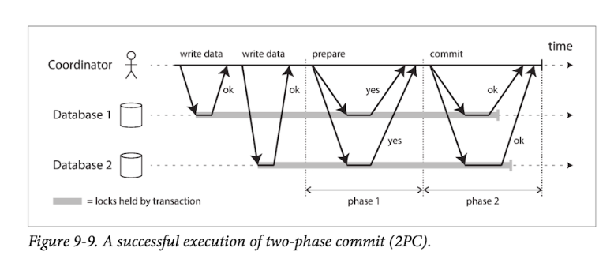

two phase commit

- 
- 2pc는 말 그대로 2단계로 커밋을 진행하는것으로, 모든 노드(여기서는 분산되어있는 DB)가 커밋되거나 모든 노드가 어보트되도록 보장하는 알고리즘
- 핵심은 
  - 이런 2pc를 처리하기위해서 코디네이터가 필요하고 (전역 트랜잭션ID를 부여)
  - 코디네이터가 분산 환경 db 작업의 원자적 작업이 끝나면
  - 코디네이터가 각 노드(데이터베이스)에게 준비단계를 요청하고, 모든 노드에게 이에대한 정상응답을 받으면 (phase 1)
    - 여기서 노드들은 abort 가능한데, 그렇게 되면 모두 abort 됨
    - 이 뒤부터 노드들은 어떠한 결정을 할 수 없다. 오직 코디네이터만 커밋할지 abort할지 결정할 수 있다. (노드들은 이제 커밋준비가 됐으니 코디네이터의 선택만 기다리는것)
  - 여기서 코디네이터는 최종적으로 커밋할지 abort할지 결정하고, 
    - 결정한 내용을 트랜잭션 로그(디스크)에 기록하는데, 여기가 **커밋포인트**라함
  - 코디네이터가 각 노드(데이터베이스)에게 커밋을 요청하고(커밋으로 결정됐다면), 모든 노드에게 이에대한 응답을 받으면 종료 (phase 2)
    - 여기서 코디네이터는 노드들이 커밋에 대한 응답이 없으면 계속 커밋요청을 날린다
  - => 이를 통해 분산 DB환경에서의 원자성을 보장한다