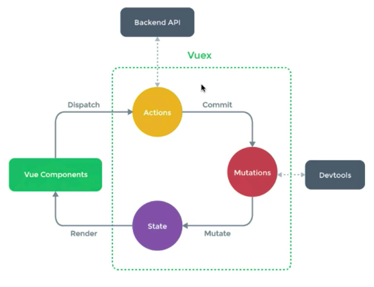

- vue js

  - javascript 기본 (출처 : https://poiemaweb.com/)
    - 결국 프로그래밍은 요구사항의 집합을 분석하여 적절한 자료구조와 함수의 집합으로 변환한 후, 그 흐름을 제어하는 것이다.
    - 넷스케이프 커뮤니케이션즈가 정적인 HTML을 동적으로 표현하기 위해 경량의 프로그래밍 언어를 도입한것이 자바스크립트의 시초
    - 자바스크립트의 표준화를 위해 넷스케이프 커뮤니케이션즈는 컴퓨터 시스템의 표준을 관리하는 비영리 표준화 기구인 ECMA 인터내셔널에 자바스크립트의 표준화를 요청
    - ajax
      - 1999년, 자바스크립트를 이용해서 비동기적(Asynchronous)으로 서버와 브라우저가 데이터를 교환할 수 있는 통신 기능인 Ajax(Asynchronous JavaScript and XML)가 XMLHttpRequest이라는 이름으로 등장했다.
      - 이전의 웹 페이지는 서버로부터 완전한 HTML을 전송 받아 웹 페이지 전체를 렌더링하는 방식으로 동작했다. 따라서 화면이 전환되면 서버로부터 새로운 HTML을 전송 받아 웹 페이지 전체를 처음부터 다시 렌더링하였다. 이는 변경이 없는 부분까지 포함된 HTML을 서버로부터 다시 전송 받기 때문에 불필요한 데이터 통신이 발생하고, 변경이 없는 부분까지 처음부터 다시 렌더링해야 하기 때문에 퍼포먼스 측면에서도 불리한 방식이다. 이로 인해 화면 전환이 일어나면 화면이 순간적으로 깜박이는 현상이 발생하고 이는 웹 애플리케이션의 한계로 받아들여 졌다.
      - Ajax의 등장은 이전의 패러다임을 획기적으로 전환했다. 즉, 웹 페이지의 변경이 필요 없는 부분은 다시 렌더링하지 않고, 서버로부터 필요한 데이터만을 전송 받아 변경이 필요한 부분만을 한정적으로 렌더링하는 방식이 가능해진 것이다. 이로 인해 웹 브라우저에서도 데스크톱 애플리케이션과 유사한 빠른 퍼포먼스와 부드러운 화면 전환이 가능케 되었다.
    - 자바스크립트는 일반적으로 프로그래밍 언어로서 기본 뼈대를 이루는 ECMAScript와 브라우저가 별도 지원하는 클라이언트 사이드 Web API를 아우르는 개념
      - 클라이언트 사이드 Web API는 w3c에서 별도의 명세로 관리
    - 자바스크립트 특징
      - 자바스크립트는 HTML, CSS와 함께 웹을 구성하는 요소 중 하나로 웹 브라우저에서 동작하는 유일한 프로그래밍 언어
      - 자바스크립트는 개발자가 별도의 컴파일 작업을 수행하지 않는 인터프리터 언어(Interpreter language)
        - 대부분의 모던 자바스크립트 엔진(Chrome의 V8, FireFox의 Spidermonkey, Safari의 JavaScriptCore, Microsoft Edge의 Chakra 등)은 인터프리터와 컴파일러의 장점을 결합하여 비교적 처리 속도가 느린 인터프리터의 단점을 해결
      - 비록 다른 객체지향 언어들과의 차이점에 대한 논쟁들이 있긴 하지만, 자바스크립트는 강력한 객체지향 프로그래밍 능력을 지니고 있다. 간혹 클래스(ES6에서 새롭게 도입되었다), 상속, 정보 은닉을 위한 키워드 private가 없어서 객체지향 언어가 아니라고 오해(자바스크립트는 가장 많은 오해를 받는 언어이다.)하는 경우도 있지만 자바스크립트는 클래스 기반 객체지향 언어보다 효율적이면서 강력한 프로토타입 기반의 객체지향 언어이다. (????)
    - 자바스크립트 개발환경과 실행방법
      - 모든 브라우저는 자바스크립트를 해석하고 실행할 수 있는 자바스크립트 엔진을 내장 (브라우저뿐만 아니라 Node.js도 자바스크립트 엔진을 내장.. 그래서 브라우저에서 동작하는코드는 Node.js환경에서 동작.. - 이해가게될 날이있겠지..)
        - 브라우저와 Node.js는 목적이다름
        - 브라우저는 HTML,CSS,자바스크립트를 실행하여 웹페이지를 화면에 렌더링하는게목적
        - Node.js는 서버환경을 제공하는것이 주된목적
        - 그냥 코어(ECMAScript)만 같은거라함..
          - 참고 : 예를 들어 브라우저는 HTML 요소를 선택하거나 조작하는 기능들의 집합인 DOM API를 기본적으로 제공한다. 하지만 서버 개발 환경을 제공하는 것이 주 목적인 Node.js는 클라이언트 사이드 Web API인 DOM API를 제공하지 않는다. 서버에서는 HTML 요소를 다룰 일이 없기 때문이다. 반대로 Node.js에서는 파일을 생성하고 수정할 수 있는 File 시스템을 기본 제공하지만 브라우저는 이를 지원하지 않는다. (Web API인 File API FileReader 객체를 사용해 사용자가 지정한 파일을 읽어 들이는 것은 가능하다.) 브라우저는 사용자 컴퓨터에서 동작한다. 만약 브라우저를 통해 사용자 컴퓨터에 파일을 생성하거나 기존 로컬 파일을 수정할 수 있다면 사용자 컴퓨터는 악성 코드에 노출되기 쉽기 때문에 보안 상 이유로 이를 금지하고 있다.
      - node.js?
        - 2009년 라이언 달(Ryan Dahl)이 발표한 Node.js는 Chrome V8 자바스크립트 엔진으로 빌드된 자바스크립트 런타임 환경(Runtime Environment)이다. 간단히 말해 브라우저에서만 동작하던 자바스크립트를 **_브라우저 이외의 환경_**에서 동작시킬 수 있는 자바스크립트 실행 환경이 Node.js이다.
        - Node.js는 백엔드 영역의 서버 애플리케이션 개발뿐만 아니라 프런트엔드 영역의 다양한 도구나 라이브러리도 Node.js 환경에서 동작한다. 따라서 Node.js는 프런트엔드 모던 자바스크립트 개발에 필수적인 환경이라고 할 수 있다.
        - npm(node package manager)은 자바스크립트 패키지 매니저이다. Node.js에서 사용할 수 있는 모듈들을 패키지화하여 모아둔 저장소 역할과 패키지 설치 및 관리를 위한 CLI(Command line interface)를 제공한다. 자신이 작성한 패키지를 공개할 수도 있고 필요한 패키지를 검색하여 재사용할 수도 있다.
      - 브라우저 동작원리
        - 
        - 브라우저는 동기(Synchronous)적으로 HTML, CSS, Javascript을 처리한다. 이것은 script 태그의 위치에 따라 블로킹이 발생하여 DOM의 생성이 지연될 수 있다는 것을 의미한다. 따라서 script 태그의 위치는 중요한 의미를 갖는다.
          - body 요소의 가장 아래에 자바스크립트를 위치시키는 것은 좋은 아이디어이다. 그 이유는 아래와 같다.
            - HTML 요소들이 스크립트 로딩 지연으로 인해 렌더링에 지장 받는 일이 발생하지 않아 페이지 로딩 시간이 단축된다.
            - DOM이 완성되지 않은 상태에서 자바스크립트가 DOM을 조작한다면 에러가 발생한다.
      - 데이터 타입과 변수
        - 변수란 값이 위치하고 있는 메모리 주소(Memory address)에 접근하기 위해 사람이 이해할 수 있는 언어로 명명한 식별자(identifier)
        - 자바스크립트는 동적 타입(Dynamic/Weak Type) 언어이다. 변수의 타입 지정(Type annotation)없이 값이 할당되는 과정에서 자동으로 변수의 타입이 결정(**_타입 추론_**, Type Inference)된다. 즉, 변수는 고정된 타입이 없다. 따라서 같은 변수에 여러 타입의 값을 자유롭게 할당할 수 있다.
        - 데이터 타입은 데이터를 메모리에 저장할 때 확보해야 하는 메모리 공간의 크기와 할당할 수 있는 유효한 값에 대한 정보, 그리고 메모리에 저장되어 있는 2진수 데이터를 어떻게 해석할 지에 대한 정보를 컴퓨터와 개발자에게 제공
        - 데이터 타입은 한정된 메모리 공간을 효율적으로 사용하기 위해서, 그리고 2진수 데이터로 메모리에 저장된 데이터를 다양한 형태로 사용하기 위해 존재한다.
        - 변수 호이스팅(Variable Hoisting)
          - 호이스팅이란 var 선언문이나 function 선언문 등 모든 선언문이 해당 Scope의 선두로 옮겨진 것처럼 동작하는 특성을 말한다. 즉, 자바스크립트는 모든 선언문(var, let, const, function, function\*, class)이 선언되기 이전에 참조 가능하다.
          - => 앞서 선언하지않은 변수를 console로 찍었을때 ReferenceError 가 아니라 undefined 뜸..(뒤에는 선언되어있어야함)
        - var 키워드로 선언된 변수의 문제점
          - 함수 레벨 스코프(Function-level scope)
            - 전역 변수의 남발
            - for loop 초기화식에서 사용한 변수를 for loop 외부 또는 전역에서 참조할 수 있다.
          - var 키워드 생략 허용
            - 의도하지 않은 변수의 전역화
          - 중복 선언 허용
            - 의도하지 않은 변수값 변경
          - 변수 호이스팅
            - 변수를 선언하기 전에 참조가 가능하다.
          - => 대부분의 문제는 전역 변수로 인해 발생한다. 전역 변수는 간단한 애플리케이션의 경우, 사용이 편리한 면이 있지만 불가피한 상황을 제외하고 사용을 억제해야 한다. 전역 변수는 유효 범위(scope)가 넓어서 어디에서 어떻게 사용될 지 파악하기 힘들다. 이는 의도치 않은 변수의 변경이 발생할 수 있는 가능성이 증가한다. 또한 여러 함수와 상호 의존하는 등 부수 효과(side effect)가 있을 수 있어서 복잡성이 증가한다.
          - => ES6는 이러한 var의 단점을 보완하기 위해 let과 const 키워드를 도입하였다.
      - 객채
        - 자바스크립트의 객체는 키(key)과 값(value)으로 구성된 프로퍼티(Property)들의 집합
        - `for–in` 문은 객체의 프로퍼티를 순회하기 위해 사용하고 `for–of` 문은 배열의 요소를 순회하기 위해 사용
      - 프로토타입
        - 자바스크립트는 프로토타입 기반 객체지향 프로그래밍 언어 (Not 클래스 기반 객체지향)
  - ES6

    - 모듈

      - 일반적으로 모듈은 파일 단위로 분리되어 있으며 애플리케이션은 필요에 따라 명시적으로 모듈을 로드하여 재사용한다. 즉, 모듈은 애플리케이션에 분리되어 개별적으로 존재하다가 애플리케이션의 로드에 의해 비로소 애플리케이션의 일원이 된다. 모듈은 기능별로 분리되어 작성되므로 코드의 단위를 명확히 분리하여 애플리케이션을 구성할 수 있으며 재사용성이 좋아서 개발 효율성과 유지보수성을 높일 수 있다.
      - 자바스크립트는 파일마다 독립적인 파일 스코프를 갖지않고 하나의 전역객체를 공유한다.. 즉, 자바스크립트 파일을 여러개의 파일로 분리하여 script 태그로 로드하여도 분리된 자바스크립트 파일들이 결국 하나의 자바스크립트 파일 내에 있는것처럼 하나의 전역객체를 공유한다.. 이로인해 전역변수가 중복되는 등의 문제가 발생..
      - script 태그에 type="module" 어트리뷰트를 추가하면 로드된 자바스크립트 파일은 모듈로서 동작한다. ES6 모듈의 파일 확장자는 모듈임을 명확히 하기 위해 mjs를 사용하도록 권장
      - ES6 모듈은 파일 자체의 스코프를 제공한다. 즉, ES6 모듈은 독자적인 모듈 스코프를 갖는다. 따라서, 모듈 내에서 var 키워드로 선언한 변수는 더 이상 전역 변수가 아니며 window 객체의 프로퍼티도 아니다.

        - 모듈 내에서 선언한 변수는 모듈 외부에서 참조할 수 없다. 스코프가 다르기 때문이다.
        - 만약 모듈 안에 선언한 식별자를 외부에 공개하여 다른 모듈들이 참조할 수 있게 하고 싶다면 `export` 키워드를 사용한다. 선언된 변수, 함수, 클래스 모두 export할 수 있다.
        - 모듈에서 공개(export)한 대상을 로드하려면 `import` 키워드를 사용한다.
        - 모듈에서 하나만을 export할 때는 `default` 키워드를 사용할 수 있다.

          - `export default` 를 사용하게되면, 개발자가 원하는 이름으로 import를 할 수 있다..! 대신, 이름을 개발자가 지정을 해주어야한다!
            - `import mutations from './mutations'`
          - 반대로 `export` 는 named export 라고하여 export시 사용된 이름을 써야한다! 하지만, import시에 당연 이름을 변경할 수 있다
            - `import * as getters from './getters.js'`
            - `import { pi, square, Person } from './lib.mjs';`
              - `lib.mjs` 파일에 `export { pi, square, Person };` 이렇게 사용중임
            - `import { pi as PI, square as sq, Person as P } from './lib.mjs';`

          ```javascript
            // 📄 index.js
            // 👇 default export
            export default getUserInfo =()=> {
              console.log('i am iron man');
            }
            // 👇 named export
            export deleteUser =() => {
              console.log('delete');
            }

            // 📄 main.js
            import UserInfo from './index'  // 👈 getUserInfo 함수가 import 됨. 이름 마음대로 변경해서 사용 가능.
            import getUserInfo from './index'  // 👈 getUserInfo함수가 import 됨. 이름 마음대로 변경해서 사용 가능.
            import requestDeleteUser from './index' // 👈 getUserInfo함수가 import 됨.
            import { deleteUser } from './index'  //👈 deleteUser 함수가 import 됨. named export는 선언된 메서드 이름 또는 변수 명으로만 import 받아야 한다.

            // ⭕ named와 defualt export를 둘 다 import 가능
            import {default as UserInfo, deletUser } from './index'

            // 해당 내용 출처 : https://pinokio0702.tistory.com/370
          ```

- 기타 팁

  - 자바스크립트가 싱글 쓰레드 기반이고 콜백 큐.. 싱글쓰레드이기 때문에 당연히 하나의 스레드에서 여러많은 처리가 일어나면 상당히 느려질수밖에 없다.. 이를 해결하기위해서 비동기 콜백은 필수적!
    - 콜백이 많아지면 콜백헬이 나타나기때문에 이를 개선한것이 Promise.. 이를 더 개선한것이 async, await 키워드를 사용하는것!
      - async, await 키워드를 사용하는것은 개발자가 비동기 처리를 프로그래밍관점으로 보기편하게해줌.. (비동기인데 그냥 위에서 아래로 쭉 읽을수있음.. )
      - 참고 : https://joshua1988.github.io/web-development/javascript/js-async-await/

- 기타 내용 파악해볼것
  - 콜백 함수는 클로저이므로 콜백 큐에 단독으로 존재하다가 호출되어도 콜백함수를 전달받은 함수의 변수에 접근할 수 있다. (https://poiemaweb.com/js-function)

---

- vue js 인강 (Age of Vue.js)

  - vue js 소개

    - MVVM 패턴의 뷰모델(ViewModel) 레이어에 해당하는 화면단 라이브러리
      - view <-> vue(viewModel) <-> model
        - view는 html같은 화면에서 보여지는것을 이야기함.. 여기에 DOM을 이용해서 javascript를 조작가능
        - vue에는 *DOM Listener*를 통해서 특정 이벤트를 전달받아 javascript의 데이터를 변경할수있도록 해준다.. 그리고 변경된 데이터를 vue의 Data Bindings를 통해서 View에 반영해준다 (변경될때마다 view에 계속해서 변경이 가능한데, 이를 반응성(reactivity)이라고 하며, 이 반응성이 vue의 핵심중하나이다!)
        - model은 Plain Javascript Objects로 볼수있다
        - 위의 순서에서 View는 HTML과 CSS로 이뤄진 코드이며 내용을 삽입하기 위해 Vue.js에서 제공하는 **디렉티브**라는 것을 사용한다. Model은 일반적으로 서버에서 전달된 값을 자바스크립트의 객체 형태롤 사용한다. 마지막으로 VM(ViewModel)은 Vue.js에서 제공하는 Vue 객체이다.
    - 기존 웹 개발방식(HTML, Javascript)

      - javascript의 역할은 해당 DOM의 내용을 조작하는것!

      ```javascript
        <div id="app"></div>

        <script>
            var div=document.querySelector('#app');
            console.log(div);
            var str ='hello world';
            div.innerHTML=str;

            str='hello world!!!';  // 기본 javascript, html로는 str이 이렇게 변경되었을때 바로 반영이 안되어 밑에 다시 div.innterHTML을 해주어야함! => 이를 vue를 사용하여 쉽게 핸들링할수있음
            div.innerHTML=str;
        </script>
      ```

    - 즉시실행함수

      - 전역 스코프에 불필요한 변수를 추가해서 오염시키는 것을 방지할 수 있을 뿐 아니라 IIFE(Immediately Invoked Function Expression) 내부안으로 다른 변수들이 접근하는 것을 막을 수 있는 방법
      - 즉시실행함수에 정의되어있는 변수는 외부로부터의 접근이 불가능
      - IIFE를 변수에 할당하면 IIFE 자체는 저장되지 않고, 함수가 실행된 결과만 저장된다.

      ```javascript
      (function () {
        statements;
      })();
      ```

    - vue를 생성자 함수로 사용하는것은 Vue라는 함수에 정의된 많은 기능들을 사용하기위함.. 그래서 Vue를 만들고 필요한 element들을 연결시켜주는것같음..

  - 컴포넌트

    - 화면의 영역을 구분하여 개발할수있는 뷰의 기능이고, 이를 쓰는핵심은 재사용성!
    - 종류

      - 전역컴포넌트
        - Vue.component('컴포넌트 이름', 컴포넌트 내용);
          - 보통 라이브러리, 플러그인같은 전역으로 사용해야할것들만 사용
          - 인스턴스 생성할때마다 새로이 등록할필요 없음
      - 지역컴포넌트

        ```javascript
        <div id="app">
          <app-header></app-header>
          <app-content></app-content>
          <app-footer></app-footer>
        </div>;

        new Vue({
          //인스턴스 만들면 root Component가 됨
          //el의 역할은 Vue로 만든 화면이 그려지는 인스턴스의 시작지점을 지정하는것임!
          el: "#app",
          // 지역컴포넌트 등록방식
          components: {
            // '컴포넌트 이름': 컴포넌트 내용
            // 실제 서비스 등록할때는 여기서 등록..
            // 새로이 다른 인스턴스를 만든다면, app-footer가 사용될때 해당 인스턴스 내부에서 새로 만들어주어야함.. (당연한이야기)
            "app-footer": {
              template: "<footer>footer</footer>",
            },
          },
        });
        ```

  - 컴포넌트 통신방식

    - 상위 컴포넌트와 하위컴포넌트로 구성되어있을때
    - 상위컴포넌트는 하위컴포넌트로 데이터를 내려줌(props 속성으로)
    - 하위컴포넌트는 상위컴포넌트로 이벤트를 올려줌
    - why 이런방식으로?
      - 위아래로 구분없이 전달받게되면 엮이는게 많아서 나중에 에러를 찾기가 너무어려움..
      - 그래서 데이터는 자식방향으로만, 이벤트는 상위의 방향으로만 전달될수있도록 정의..

  - axios
    - 뷰에서 권고하는 HTTP 통신라이브러리
    - Promise 기반 HTTP client
      - Promise : 자바스크립트의 비동기 처리 패턴
      - 자바스크립트의 비동기 처리패턴
        - callback
        - promise
        - promise + generator
        - async & await
  - 템플릿 문법

    - 디렉티브
      - `v-[문법]`
      - v가 붙으면 Vue인스턴스 내부에서 찾는다.. 즉, vue를 사용하겠다고 생각하면될듯
      - 종류
        - `v-show` vs `v-if`
          - `v-if`는 조건에 맞지않으면 dom에서 사라짐.. `v-show`는 dom에 남아있고 그냥 보여지지만 않는것!
        - `v-on`
          - 마우스나 키보드 입력시 사용할수 디렉티브
            - `v-on:keyup="메서드명"`, `v-on:onclick="메서드명"`
            - `v-on:keyup.enter="메서드명"`
              - 여기서 ".enter"라는 modifier를 사용가능.. 엔터를 쳤을때만 이벤트가 실행됨
    - 데이터바인뎅
      - `{{}}`
    - Vue 문법

      - computed 를 사용하여 특정변수 변화에따라 적용해야하는 부분을 정의할수있음.. (Computed라는 말이 계산된이니깐.. 그에 맞는 동작이 들어가있다고 생각하면될듯)
      - 요구사항이 있을때, 어떻게 접근하면될까?
        - 일단 vue [공식문서](https://vuejs.org/)에서 확인
          - 키워드가 중요..
        - 왠만한거는 다 찾을텐데, 그래도 못찾으면 그냥 기본적인 자바스크립트문법으로 접근..
      - watch
        - `function(newValue, oldValue)`
          - newValue는 새로이 변화된값
          - oldValue는 이전값
        - 데이터의 변화에따라서 특정 로직을 실행할수있는 뷰의속성..
      - watch vs computed

        - computed는 단순한 값에 대한 계산.. => validation
        - watch는 무거운로직들.. 매번 실행하는데부담스러운 로직.. (http 요청과같은..)
        - [공식문서 설명](https://vuejs.org/v2/guide/computed.html#Computed-vs-Watched-Property)
          - Vue does provide a more generic way to observe and react to data changes on a Vue instance: watch properties. When you have some data that needs to change based on some other data, it is tempting to overuse watch - especially if you are coming from an AngularJS background. However, it is often a better idea to use a computed property rather than an imperative watch callback.
        - computed를 활용하여 조건에따라 class로 특정 css 입힐때에도 사용하기좋음..

        ```javascript
          <div id="app">
            <p v-bind:class="errorTextColor">Hello</p>
          </div>

          <script src="https://cdn.jsdelivr.net/npm/vue/dist/vue.js"></script>
          <script>
            new Vue({
              el: '#app',
              data: {
                // cname: 'blue-text',
                isError: false
              },
              computed: {
                errorTextColor: function() {
                  // if (isError) {
                  //   return 'warning'
                  // } else {
                  //   return null;
                  // }
                  return this.isError ? 'warning' : null;
                }
              }
            });
          </script>
        ```

  - 기타팁
    - **_MDN에서 사용방법들 찾아보자!_**
    - npm : node package manager
      - `package.json` 에 있는 것들을 시랳ㅇ시켜줌
        - `npm run serve` 는 `package.json`의 scripts에 정의되어있음
          - 이를 통해 index.html 을 실행하면 src 내부에있는 파일들을 묶어서 주입됨.. 내부적으로 web pack이 들어가있음..
    - components 폴더에 component를 등록할때는 두단어 이상+파스칼 케이스 로 조합을 하는게 관례..
      - 두 단어 이상사용하는것은 컴포넌트태그인지 html표준태그인지 브라우저가 구분할수있게하기위함..
    - webpack 역할
      - 뷰 로더가 싱글파일 컴포넌트(~.vue 파일)를 찢어서 브라우저가 이해할수있도록해줌
    - 공식문서의 style guide를 잘보고 하자!
      - vue js 코어팀에서 작성해준.. 어떤형식으로 뷰를 개발할지를 알려주고있음..
      - cookbook 을 통해서 발생할수있는 문제상황에 대해서 어떻게 핸들링하는지 잘나오니 참고할것

---

- npm (node package manager - 여기서 package는 라이브러리라고 봐도 무방.. node.js 설치시 같이설치됨)
  - 전세계에 대중적으로 쓰이는 자바스크립트 라이브러리들 공개저장소..
  - 쓰는이유
    - package.json 파일을 통해 라이브러리 버전을 일괄적으로 관리가능
    - 특정라이브러리의 cdn주소를 알기위해 해당 페이지로가서 가져오지않아도됨! `npm install xxx` 로 바로 셋팅가능.. package.json에 추가된다!
      - 지우고싶으면 `npm uninstall xxx`
      - `npm install xxx --global` 로 설치도 가능한데, 이는 `/usr/local/lib/node_modules` 에 설치됨.. 시스템레벨에 전역으로 설치됨 (--global 대신 -g 써도됨)
        - 그럼 지역(그냥 install만 친것)과 글로벌의 차이는?
          - 지역은 설치한 폴더 내부의 `node_modules` 폴더 아래에 해당라이브러리가 생성됨
          - 글로벌은 시스템 레벨 경로에 들어가게됨 `/usr/local/lib/node_modules`
    - 지역설치에는 두 종류
      - `npm install xxx --save-prod`
        - `npm i xxx` 로 축약가능
        - package.json의 dependecies에 추가됨
        - 배포용 라이브러리.. 화면과 직접적으로 연관되는 라이브러리!
          - ex) react, vue ...
      - `npm install xxx --save-dev`
        - `npm i xxx -D` 로 축약가능
        - package.json의 devDependecies에 추가됨
        - 최종적으로 빌드하게될때 devDependency의 라이브러리는 배포가안됨
        - 개발보조 라이브러리
          - ex) webpack, js-compression..

---

- vue js 중급 (https://www.inflearn.com/course/vue-pwa-vue-js-%EC%A4%91%EA%B8%89/dashboard)

  - todo app 만들기 (하단 코드 참고)

    - App.vue

      - 컴포넌트 기반 설계!
      - 현재 App.vue는 모든 데이터를 조작하고 실제적인 비지니스 로직들이 일어나게된다.. 이를 "컨테이너"라고 부른다.
        TodoHeader, TodoInput.. 이런것들은 화면에서 보여주고 이벤트가 발생했다는사실만 app에게 전달해주게되는것! 그리고 이를 "프렌젠터 컴포넌트"라고 부른다.
        지금 구조의 핵심은.. 데이터를 조작하는것을 한곳에 모은다.. 그리고 프레젠터 컴포넌트들은 조작에 대한 요청만한다.. 이런 명확한 역할의 분리를 통해서 복잡한구조를 좀더 단순화 할 수 있겠다! 중복도 줄일수 있겠지..

      ```javascript
          <template>
            <div id="app">
              <TodoHeader></TodoHeader>
              <TodoInput v-on:addTodoItem="addTodoOneItem"></TodoInput>
              <TodoList v-bind:propsdata="todoItems" v-on:removeTodoItem="removeTodoOneItem" v-on:toggleTodoItem="toggleTodoOneItem"></TodoList>
              <TodoFooter v-on:clearAll="clearAllItems"></TodoFooter>
            </div>
          </template>

          <script>
          import TodoFooter from './components/TodoFooter.vue';
          import TodoHeader from './components/TodoHeader.vue';
          import TodoInput from './components/TodoInput.vue';
          import TodoList from './components/TodoList.vue';

          export default {
            components: {
              TodoHeader: TodoHeader,
              TodoFooter: TodoFooter,
              TodoInput: TodoInput,
              TodoList: TodoList
            },
            data:function(){
                  return {
                      todoItems:[]
                  }
            },
            created: function(){ //vue lifecycle 중 하나.. (created -> mounted -> update -> destory).. 좀더 엄밀히이야기하자면 Hook임.. create 라이프사이클을 타면 호출되는..
                  if(localStorage.length>0){
                      for(var i=0;i<localStorage.length;i++){
                          if(localStorage.key(i)!=='loglevel:webpack-dev-server'){
                              this.todoItems.push(JSON.parse(localStorage.getItem(localStorage.key(i))));
                          }

                      }
                  }
            },
            methods: {
              addTodoOneItem:function(todoItem){
                var obj={
                    completed: false,
                    item: todoItem
                }
                localStorage.setItem(todoItem, JSON.stringify(obj)); //JSON.stringify : javascript 객체를 json string 으로 변환.. 이렇게 사용하는 이유는 그냥 obj를 넣어버리면 Object object로 나타나기때문에 보기가 어려움.. 반대로 json string을 json object로 사용하기위해서는 JSON.parse() 하면됨
                this.todoItems.push(obj);
              },
              removeTodoOneItem:function(todoItem,index){
                localStorage.removeItem(todoItem.item);
                this.todoItems.splice(index,1); //해당 인덱스부터 하나 지우겠다..
              },
              toggleTodoOneItem:function(todoItem,index){
                // todoItem.completed = !todoItem.completed;  //이렇게 하위에서 전달받은 데이터의 속성을 건드는것은 안티패턴! 데이터의 직접적인 조작은 현재 컴포넌트의 todoItems로 하자..
                this.todoItems[index].completed=!this.todoItems[index].completed
                // localStorage에 데이터 갱신하는 API가 없기떄문에 아래와같이 사용..
                localStorage.removeItem(todoItem.item);
                localStorage.setItem(todoItem.item, JSON.stringify(todoItem));
              },
              clearAllItems:function(){
                localStorage.clear();
                this.todoItems=[];
              }
            }
          }
          </script>
      ```

  - ES6 for vue.js

    - ES6 는 최신의 자바스크립트 문법
    - ES6란?
      - ECMAScript 2015와 동일한 용어
      - react, angular, vue 에서 권고하는 언어 형식
      - ES5에 비해 문법이 간결.. => 빠르고 편리함
      - [Babel](https://babeljs.io/)
        - 구 버전 브라우저 중에서는 ES6의 기능을 지원하지않는 브라우저가 있으므로 transpiling이 필요
        - ES6의 문법을 각 브라우저의 호환 가능한 ES5로 변환하는 컴파일러(컴파일러보다 명확한것은 트랜스파일링)
    - const & let

      - 새로운 변수 선언 방식
        - 기존 자바스크립트 변수선언에 상당히 모호함이 단점..
      - 블록 단위 `{}`로 변수의 범위가 제한되었음
      - const : 한번 선언한 값에 대해서 변경할 수 없음 (상수 개념)
        - 객체로 선언되어있을때, 객체 내부값은 변경가능함.. 자바 final과 비슷한듯..
      - let : 한번 선언한 변수에 대해 다시 선언할 수 없음.. 해당 변수에 값은 변경가능

        - 블록 레벨 스코프를 따르는 변수를 선언하기위해서 사용!

        ```javascript
        let foo = 1;
        {
          console.log(foo); // 1 출력
        }

        let foo = 1;
        {
          console.log(foo); // Uncaught ReferenceError: Cannot access 'foo' before initialization
          let foo = 3;

          //여기서 에러발생하는것은, let foo는 블럭안에 foo라는 지역변수를 선언해준 것인데, console.log에서 foo를 참조하고자할때 foo는 해당 시점에 "일시적 사각지대" 상태여서 에러가 발생함.. 즉, ES6도 호이스팅은 여전히 발생한다!
          // 선언단계 -> 일시적 사각지대 -> 초기화단계(let foo===undefined) -> 할당단계 (foo===1)
          // 기존 ES5에는 일시적 사각지대가 없음
        }
        ```

      - 참고사항

        - ES5의 특징

          - 변수의 scope

            - `{}`에 상관없이 스코프가 설정

            ```javascript
            var sum = 0;
            for (var i = 1; i <= 5; i++) {
              //여기 i가 전역 scope 으로 잡힘..
              sum = sum + i;
            }

            console.log(sum); // 15
            console.log(i); //6

            ////////////////////////////////
            //ES6 let 사용
            let sum = 0;
            for (let i = 1; i <= 5; i++) {
              sum = sum + i;
            }

            console.log(sum); // 15
            console.log(i); // Uncaught ReferenceError: i is not defined
            ```

          - Hoisting (Hoist : 끌어올리다)

            - Hoisting 이란 선언한 함수와 변수를 해석기가 가장 상단에 있는것처럼 인식
            - js 해석기는 코드의 라인순서와 관계없이 함수선언식과 변수를 위한 메모리 공간을 먼저 확보
            - 함수 표현식은 이에 해당이 안됨

              ```javascript
              var sum = function () {
                //익명함수.. 요게 함수 표현식
                return 10 + 20;
              };

              function abc() {
                //이건 함수 선언문
                return 10 + 20;
              }
              ```

            - [호이스팅관련 참고하면 좋은 곳](https://poiemaweb.com/js-data-type-variable#24-%EB%B3%80%EC%88%98-%ED%98%B8%EC%9D%B4%EC%8A%A4%ED%8C%85variable-hoisting)

    - Arrow Function (화살표함수)

      ```javascript
      //ES5
      var sum = function (a, b) {
        return a + b;
      };
      //ES6
      var sum = (a, b) => {
        return a + b;
      };
      // => var sum=(a,b) => a+b;  이렇게도 축약가능

      var arr = ["a", "b", "c"];
      //ES5
      arr.forEach(function (value) {
        console.log(value);
      });
      //ES6
      arr.foreach * ((value) => console.log(value));
      ```

    - 향상된 객체 리터럴

      ```javascript
      var dictionary = {
        //ES5
        lookup: function () {
          console.log("a");
        },
        //ES6
        lookup2() {
          //이런식으로 ":function" 생략가능
          console.log("b");
        },
      };

      var figures = 10;
      var dictionary = {
        // figures: figures,  //ES5
        figures, // ES6,, 객체의 속성명과 값 명이 동일할 때 이렇게 축약가능..
      };
      ```

    - `...`

      - object spread operator (객체를 흩뿌려주는 오퍼레이터)
      - 객체의 내용을 그대로 가져와준다..

      ```javascript
      let josh = {
        field: "web",
        language: "js",
      };

      let developer = {
        nation: "korea",
        ...josh, //이는 위에 선언한 josh 객체를 그대로 여기에 가져다 쓰는것이다. depth가 생기는것이아니라, 속성을 그대로 가져오게됨.. field:'web', language: 'js' 요거 추가됨
      };
      ```

    - <span style="color:red">모듈관련 정리필요..</span>

---

- Vuex

  - Vuex 란?

    - 무수히 많은 컴포넌트들의 데이터를 관리하기 위한 상태관리 패턴이자 라이브러리
      - 복잡한 애플리케이션의 컴포넌트들을 효율적으로 관리하는 라이브러리
      - 컴포넌트가 많아졌을때 어떻게 관리할까? 에 대한 해결책을 제시
      - 상태관리 도구로 생각하면됨
    - React의 Flux 패턴에서 기인..
      - Flux란?
        - Unidirectional data flow
        - 데이터의 흐름이 한 방향으로 움직인다!
        - action -> dispatcher -> model -> view
          - action: 화면에서 발생하는 이벤트 또는 사용자의 입력
          - dispatcher: 데이터를 변경하는 방법, 메서드
          - model: 화면에 표시할 데이터
          - view: 사용자에게 비춰지는 화면 (action을 다시 호출함)
        - 왜 Flux가 나오게됏나?
          - MVC 패턴의 문제점
          - 기능추가 및 변경에 따라 생기는 문제점을 예측하기가 어려워짐.. ex) 페이스북 채팅화면
          - 앱이 복잡해지면서 생기는 업데이트 루프
          - `controller` -> `model*N` <-> `View*N`
          - <span style="color:red">스프링의 MVC와는 조금 다른듯함..? 맞나..? 정확하게 이해안감.. 추후확인 필요..</span>
    - vuex 왜 필요?
      - 복잡한 애플리케이션에서 컴포넌트 갯수 많아지면 컴포넌트간에 데이터 전달이 어려워짐..
        - props, emit을 사용한다하지만, 컴포넌트간에 자식들이 많아지거나한다면 어디서부터 시작된 이벤트인지 다 알고있기가 어렵다..
    - vuex 컨셉
      - State
        - 컴포넌트 간에 공유하는 데이터 `data()`
      - View
        - 데이터를 표시하는 화면 `template`
      - Action
        - 사용자의 입력에 따라 데이터를 변경하는 `methods`
      - => state -> view -> action -> state -> view .... (단방향)
      - => 화면에서 버튼 클릭하면, 클릭에 해당하는 어떤 메서드가 실행될것이고, 해당 메서드는 데이터를 변경할것이다.. 그리고 그것이 다시 화면에 나타나게된다..
    - vuex 구조
      - 컴포넌트 -> 비동기로직 -> 동기로직 -> 상태
      - 
      - actions는 비동기 처리로직..
      - mutations는 state값을 변경하는곳! 즉, actions에서 state를 변경하는것이아니다..!
    - vuex 기술요소
      - state : 여러 컴포넌트에 공유되는 데이터 `data`
      - getters : 연산된 state 값을 접근하는 속성 `computed`
      - mutations : state 값을 변경하는 이벤트 로직 & 메서드 `methods`
        - state의 값을 변경할 수 잇는 유일한 방법이자 메서드
        - 뮤테이션은 `commit()`으로 동작시킨다
        - 왜 state를 바로 접근해서 변경하지않고 mutations를 사용하는가?
          - state는 여러 컴포넌트에서 공유하고있기때문에 어느 컴포넌트에서 해당 state를 변경했는지 추적하기가 어려움..
          - 뮤테이션을 거치면 vuex에서 제공해주는 디버깅이 용이..
      - actions : 비동기 처리로직을 선언하는 메서드 `async methods`
        - 엄밀히 이야기하면 비동기 로직을 담당하는 mutations
        - 데이터 요청, Promise, ES6 async와 같은 비동기 처리는 모두 actions에 선언
        - 왜 비동기 처리로직은 actions에 선언?
          - 비동기를 수행하게되면 수행결과가 언제 날라올지 알수 있는것은 비동기의 결과를 받을때인데, 그렇게 결과를 받아서 mutations를 호출하여 state를 적절하게 변경하게되면 비동기 처리에 대한 순서를 파악하거나 디버깅이 용이하다..
          - 그래서 mutations에는 동기 처리 로직만 넣어주어야한다!
          - actions에서 바로 state로 접근하면 안되는듯함! <span style="color:red">확인필요!!</span>

    ```javascript
    export const store = new Vuex.Store({
      //export를 사용하면 외부에서 store를 사용할수있음
      state: {
        //이 state는 틀리면안됨...
        num: 10, //이를 호출하는것은 this.$store.state.num
      },
      mutations: {
        printNumbers(state) {
          //항상 첫번째인자로 state를 넘겨받을수있음
          return state.num;
        },
        setNumber(state, anotherNum) {
          //이를 호출하는것은 this.$store.commit('setNumbers',20) 요렇게
          return state.num + anotherNum;
        },
      },
      actions: {
        delayDoubleNumber(context) {
          //context로 store의 메서드와 속성 접근가능.. 이를 호출하는것은 this.$store.dispatch('delayDoubleNumber') 요롷게
          context.commit("printNumber");
        },
      },
    });
    ```

    - vuex 헬퍼

      - state -> mapState
      - getters -> mapGetters
      - mutations -> mapMutations
      - actions -> mapActions
      - 헬퍼 어떻게 쓰나?

        ```javascript
          import { mapState } from 'vuex'
          import { mapState } from 'vuex'
          import { mapState } from 'vuex'
          import { mapState } from 'vuex'

          export default{
            computed(){
                ...mapState(['num']), ...mapGetters(['countedNum'])
                // ...mapState(['num']) 은 num(){return this.$store.state.num; } 을 줄인것..
            },
            methods: {
                ...mapMutations(['clickBtn']), ...mapActions(['asyncClickBtn'])
            }
          }
        ```

    - 앱이 비대해져서 1개의 store로는 관리하기가 힘들때 `modules` 속성을 사용한다!

      ```javascript
      import Vue from "vue";
      import Vuex from "vuex";
      import todo from "moduls/todo.js";
      import todo2 from "moduls/todo2.js";

      export const store = new Vuex.store({
        modules: {
          moduleA: todo, //물론, todo: todo 이렇게 사용할수도 있음.. 그러면 축약도 되겟지..
          moduleB: todo2,
        },
      });

      // todo.js
      const state = {};
      const getters = {};
      const mutations = {};
      const actions = {};
      export default {
        state,
        getters,
        mutations,
        actions,
      };
      ```

---

- 기타 팁
  - 린터(Linter)란 코딩 컨벤션(Coding convention)과 관련된 에러(Error)를 체크해주는 작은 프로그램이다. 코딩 컨벤션이란 읽기 쉽고 관리하기 쉬운 코드를 작성하기 위한 일종의 코딩 스타일에 대한 약속이라고 할 수 있다.
    - 자바스크립트에서는 eslinter 사용
    - eslint
      - 문법검사기
      - 최대한 오류를 줄이기위해서 없어도되는것들을 사용하게함
  - vetur
    - Vetur 플러그인은 Vue.js를 개발하는 데 도움을 주는 유용한 플러그인 중 하나다. Linting, Syntax-highlighting, Formatting 등을 지원해준다.
  - 모바일,PC,테블릿 등 웹사이트 로딩시에 해당 기기에 최적화된 형태로 나타나는 디자인기법이 반응협웹
  - localStorage vs sessionStorage
    - https://ko.javascript.info/localstorage
  - 동등비교 / 일치비교 연산자
    - 동등비교 : `==`
      - 타입이 달라도 암묵적 타입 변환을 통해 타입을 일치시켜서 같은 값이면 true를 반환해준다..
      - 편리할수 있지만 예상치못한 side effect을 일으킬수 있으므로 사용 자제.. (타입변환을 어떻게 할지 항상 정확하게 파악하지못하면 당연 부작용생수있음..)
    - 일치비교 : `===`
      - 타입과 값 모두 같아야함!
  - slice vs splice
    - slice는 begin부터 end 전까지의 복사본을 새로운 배열 객체로 반환.. 원본배열 수정 x
    - splice는 원본배열을 수정
    - https://im-developer.tistory.com/103
  - `<meta name="viewport" content="width=device-width, initial-scale=1">`
    - 반응형 웹이라는것을 알려줌.. 모바일,PC,테블릿 등 웹사이트 로딩시에 해당 기기에 최적화된 형태로 나타나는 디자인기법이 반응협웹
  - `slot` 을 사용하여 특정 부분들은 재정의 할 수 있다! 즉, slot을 활용하여 재사용할수있도록해줌! 여기서보면 header, body, footer를 재정의할수있다!
    - 모달에서 사용되었음..
  - `<input type="text" v-model="newTodoItem" v-on:keyup.enter="addTodo">`
    - `v-model`을 이용하면 동기화가 가능하다
    - 즉, newTodoItem이라는 데이터에 input태그의 text가 수정될때마다 반영된다.. 물론, vue 도구를 통해서 newTodoItem을 변경하면 그에 맞게 input에 나타난다.. 즉, v-model을 사용함으로써 input에 있는 텍스트와 newTodoItem의 값은 언제나 일치시켜준다
  - `<span v-bind:class="{textCompleted: todoItem.completed}">{{todoItem.item}}</span>`
    - `v-bind:class` 를 사용한다는것은 동적으로 class를 변경할때 사용한다고 보면된다..
  - `v-for`
    - 배열로 넘어오는 데이터를 처리할 수 있음
    - 아래 소스 참고
    ```javascript
        <li v-for="(todoItem, index) in propsdata" v-bind:key="todoItem.item" class="shadow"> //v-for 로 받은 하위 태그들에서 자유롭게 쓸 수 있음..! v-bind:key는 여기서 딱히 의미없음.. vscode validation때문에 맞춰준것..
            <i class="checkBtn fas fa-check" v-bind:class="{checkBtrnCompleted: todoItem.completed}" v-on:click="toggleComplete(todoItem,index)"></i>
            <span v-bind:class="{textCompleted: todoItem.completed}">{{todoItem.item}}</span>
            <span class="removeBtn" v-on:click="removeTodo(todoItem,index)">
                <i class="fas fa-trash-alt"></i>
            </span>
        </li>
    ```
  - `v-on:keyup.enter`는 한글입력시 두번 이벤트가 발생함.. 이를 해결하기위해서는 `v-on:keypress.enter` 로..
  - [심플한 설명 매우 굿](https://goodteacher.tistory.com/195)

---

---

- vue js 완벽가이드

  - vscode 추천 extension
    - vetur
    - tslint
    - eslint
    - auto close tag
    - material icon theme
    - night owl
    - live server
      - html 동적으로 변경해줌..
  - 이벤트버스

    - 컴포넌트간에 통신을 위해서 상위로 emit 하고 하위로 prop을 하게되는데, 컴포넌트가 너무 많아질경우 이렇게 하기가 복잡하니 vue 인스턴스하나를 만들어서 이를 import하여 사용..

      ```javascript
        //bus.js
        export default new Vue();

        //bus에 이벤트를 발생시키는 컴포넌트
        <script>
          import bus from 'bus.js 경로'

          export default{
            created(){
              bus.$emit('이벤트이름')
            }
          }
        </script>

        //bus로부터 이벤트 받는 컴포넌트
        <script>
          import bus from 'bus.js 경로'

          export default{
            created(){
              bus.$on('이벤트이름',()=>{이벤트 전달받으면 처리할작업..}) // 이는 addEventListener와 같이 이벤트를 등록하는개념.. 그래서 아래와같이 이벤트 해지또한 해당 컴포넌트 종료시점에 해주어야함.. 그래서 해당 컴포넌트의 라이프사이클과 관련된곳에서 등록과 해지가 이루어짐!
            },
            beforeDestory(){
              bus.$off('이벤트이름',()=>{이벤트 전달받으면 처리할작업..})
            }
          }
        </script>

      ```

  - 하이오더컴포넌트

    - 컴포넌트의 코드마저 재사용하는것!
    - 컴포넌트들의 동일한 기능들을 빼서 해당 컴포넌트들에서 한단계 위로 올리는것.. (그래서 이름이 하이 오더 컴포넌트인듯..)
    - 동일한 모습을 지닌 컴포넌트들을 따로따로 만들지말고 만들어주는놈을 만들자!

      - 만들어주는놈은 함수가될것이고, 해당 함수에는 render 메서드가 있어야한다
      - 또한 만들어주는 함수에 컴포넌트이름(name)이나, 라이프사이클훅(ex. created()) 을 정의할 수도 잇는데, 이를 정의하여 하나로 관리한다!

      ```javascript
      //createListView.js
      import ListView from "./ListView.vue"; //뿌릴곳 => 이 부분으로인해 depth가 생기게되므로 HOC를 많이 사용하게되면 depth가 많아지는 단점이있음..
      import { mapActions } from "vuex";

      export default function createListView(name) {
        //요게 라우터에서 연결할 컴포넌트가 됨 => 하이오더컴포넌트
        return {
          name: name, //컴포넌트 이름 만들어주기위함.. 로직상 큰 의미는 없는듯함..
          created() {
            const name = this.$route.name;
            this.FETCH_LIST(name);
          },
          render(createElement) {
            return createElement(ListView);
          },
          methods: {
            ...mapActions(["FETCH_LIST"]),
          },
        };
      }
      ```

  - 기타팁

    - javascript에서 `this`

      - 자바스크립트의 경우 Java와 같이 this에 바인딩되는 객체는 한가지가 아니라 해당 함수 호출 방식에 따라 this에 바인딩되는 객체가 달라진다.
      - 자바스크립트의 경우 함수 호출 방식에 의해 this에 바인딩할 어떤 객체가 동적으로 결정
      - 함수호출 방법

        1. 함수호출

           - 기본적으로 this는 전역객체에 바인딩.. 내부함수의 경우 this는 외부함수가아닌 전역객체에 바인딩..
             - 전역객체(Global Object)는 모든 객체의 유일한 최상위 객체를 의미하며 일반적으로 Browser-side에서는 window, Server-side(Node.js)에서는 global 객체를 의미한다.
           - 심지어 메소드의 내부함수에도 this는 전역객체에 바인딩..

             ```javascript
             var value = 1;

             var obj = {
               value: 100,
               foo: function () {
                 console.log("foo's this: ", this); // obj
                 console.log("foo's this.value: ", this.value); // 100
                 function bar() {
                   console.log("bar's this: ", this); // window
                   console.log("bar's this.value: ", this.value); // 1
                 }
                 bar();
               },
             };
             ```

           - 콜백함수의 경우에도 this는 전역객체에 바인딩된다.

        2. 생성자 함수
           - 생성자 함수 호출되면 해당 인스턴스 내부에 this가 생기게되는데, 여기서 this는 인스턴스 자신을 가리킨다.
        3. apply/call/bind 호출

           - apply는 자바의 reflection과 비슷한듯..
           - call은 apply와 동일한 역할을 하나, 인자를 어떻게 넘겨주느냐만다름..

             - 배열로 넘기면 apply
             - 그냥 인수로 계속해서 넘겨주면 call

             ```javascript
             Person.apply(foo, [1, 2, 3]);

             Person.call(foo, 1, 2, 3);
             ```

      - 화살표 함수를 쓴 body의 this는 호출한 함수를 가리킨다.. global object가 아니다!!!
        - 화살표 함수는 함수를 선언할 때 this에 바인딩할 객체가 정적으로 결정된다. 동적으로 결정되는 일반 함수와는 달리 화살표 함수의 this 언제나 상위 스코프의 this를 가리킨다
        - 화살표함수 관련 내용 : https://poiemaweb.com/es6-arrow-function
        - 화살표(`=>`)도 동일하게 function(){} 을 나타내는데, 화살표함수를 쓰게되면 this는 왜 다르게 나타날까..
          - 리터럴로 객체를 만들때 내부에 함수를 화살표로 사용하게될때 this쓰면 window를 가리키니깐 지양하라는데.. 헷갈리네..ㅡㅡ;
      - 생성자 함수와 객체의 메소드를 제외한 모든 함수(내부 함수, 콜백 함수 포함) 내부의 this는 전역 객체를 가리킨다...
      - 레벨쌓고 더 보자 : https://poiemaweb.com/js-this
      - 프로토타입 관련 내용 정리필요..
        - https://poiemaweb.com/js-prototype

    - [라이프사이클 다이아그램](https://kr.vuejs.org/v2/guide/instance.html#%EB%9D%BC%EC%9D%B4%ED%94%84%EC%82%AC%EC%9D%B4%ED%81%B4-%EB%8B%A4%EC%9D%B4%EC%96%B4%EA%B7%B8%EB%9E%A8)

    - DOM에 접근하도록 해주는 vue의 ref

      - https://devriver.tistory.com/31
      - 컴포넌트에 직접 access 할수도있음
        - https://kr.vuejs.org/v2/guide/components.html#%EC%9E%90%EC%8B%9D-%EC%BB%B4%ED%8F%AC%EB%84%8C%ED%8A%B8-%EC%B0%B8%EC%A1%B0

    - 축약
      - `:` : v-bind
      - `@` : v-on

- 자바의 Stream과 같은 자바스크립트 문법정리 : https://niceman.tistory.com/79?category=969412
- 아래 값들은 제어문의 조건식과 같이 불리언 값으로 평가되어야 할 컨텍스트에서 false로 평가되는 Falsy 값이다.
  - false
  - undefined
  - null
  - 0, -0
  - NaN
  - '' (빈문자열)