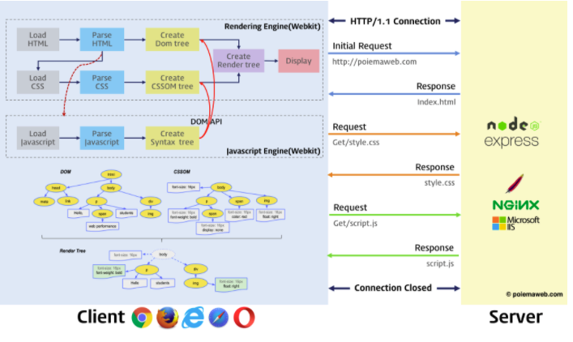

- vue js
  - javascript 기본 (출처 : https://poiemaweb.com/)
    - 결국 프로그래밍은 요구사항의 집합을 분석하여 적절한 자료구조와 함수의 집합으로 변환한 후, 그 흐름을 제어하는 것이다.
    - 넷스케이프 커뮤니케이션즈가 정적인 HTML을 동적으로 표현하기 위해 경량의 프로그래밍 언어를 도입한것이 자바스크립트의 시초
    - 자바스크립트의 표준화를 위해 넷스케이프 커뮤니케이션즈는 컴퓨터 시스템의 표준을 관리하는 비영리 표준화 기구인 ECMA 인터내셔널에 자바스크립트의 표준화를 요청
    - ajax
      - 1999년, 자바스크립트를 이용해서 비동기적(Asynchronous)으로 서버와 브라우저가 데이터를 교환할 수 있는 통신 기능인 Ajax(Asynchronous JavaScript and XML)가 XMLHttpRequest이라는 이름으로 등장했다.
      - 이전의 웹 페이지는 서버로부터 완전한 HTML을 전송 받아 웹 페이지 전체를 렌더링하는 방식으로 동작했다. 따라서 화면이 전환되면 서버로부터 새로운 HTML을 전송 받아 웹 페이지 전체를 처음부터 다시 렌더링하였다. 이는 변경이 없는 부분까지 포함된 HTML을 서버로부터 다시 전송 받기 때문에 불필요한 데이터 통신이 발생하고, 변경이 없는 부분까지 처음부터 다시 렌더링해야 하기 때문에 퍼포먼스 측면에서도 불리한 방식이다. 이로 인해 화면 전환이 일어나면 화면이 순간적으로 깜박이는 현상이 발생하고 이는 웹 애플리케이션의 한계로 받아들여 졌다.
      - Ajax의 등장은 이전의 패러다임을 획기적으로 전환했다. 즉, 웹 페이지의 변경이 필요 없는 부분은 다시 렌더링하지 않고, 서버로부터 필요한 데이터만을 전송 받아 변경이 필요한 부분만을 한정적으로 렌더링하는 방식이 가능해진 것이다. 이로 인해 웹 브라우저에서도 데스크톱 애플리케이션과 유사한 빠른 퍼포먼스와 부드러운 화면 전환이 가능케 되었다.
    - 자바스크립트는 일반적으로 프로그래밍 언어로서 기본 뼈대를 이루는 ECMAScript와 브라우저가 별도 지원하는 클라이언트 사이드 Web API를 아우르는 개념
      - 클라이언트 사이드 Web API는 w3c에서 별도의 명세로 관리
    - 자바스크립트 특징
      - 자바스크립트는 HTML, CSS와 함께 웹을 구성하는 요소 중 하나로 웹 브라우저에서 동작하는 유일한 프로그래밍 언어
      - 자바스크립트는 개발자가 별도의 컴파일 작업을 수행하지 않는 인터프리터 언어(Interpreter language)
        - 대부분의 모던 자바스크립트 엔진(Chrome의 V8, FireFox의 Spidermonkey, Safari의 JavaScriptCore, Microsoft Edge의 Chakra 등)은 인터프리터와 컴파일러의 장점을 결합하여 비교적 처리 속도가 느린 인터프리터의 단점을 해결
      - 비록 다른 객체지향 언어들과의 차이점에 대한 논쟁들이 있긴 하지만, 자바스크립트는 강력한 객체지향 프로그래밍 능력을 지니고 있다. 간혹 클래스(ES6에서 새롭게 도입되었다), 상속, 정보 은닉을 위한 키워드 private가 없어서 객체지향 언어가 아니라고 오해(자바스크립트는 가장 많은 오해를 받는 언어이다.)하는 경우도 있지만 자바스크립트는 클래스 기반 객체지향 언어보다 효율적이면서 강력한 프로토타입 기반의 객체지향 언어이다. (????)
    - 자바스크립트 개발환경과 실행방법
      - 모든 브라우저는 자바스크립트를 해석하고 실행할 수 있는 자바스크립트 엔진을 내장 (브라우저뿐만 아니라 Node.js도 자바스크립트 엔진을 내장.. 그래서 브라우저에서 동작하는코드는 Node.js환경에서 동작.. - 이해가게될 날이있겠지..)
        - 브라우저와 Node.js는 목적이다름
        - 브라우저는 HTML,CSS,자바스크립트를 실행하여 웹페이지를 화면에 렌더링하는게목적
        - Node.js는 서버환경을 제공하는것이 주된목적
        - 그냥 코어(ECMAScript)만 같은거라함.. 
          - 참고 : 예를 들어 브라우저는 HTML 요소를 선택하거나 조작하는 기능들의 집합인 DOM API를 기본적으로 제공한다. 하지만 서버 개발 환경을 제공하는 것이 주 목적인 Node.js는 클라이언트 사이드 Web API인 DOM API를 제공하지 않는다. 서버에서는 HTML 요소를 다룰 일이 없기 때문이다. 반대로 Node.js에서는 파일을 생성하고 수정할 수 있는 File 시스템을 기본 제공하지만 브라우저는 이를 지원하지 않는다. (Web API인 File API FileReader 객체를 사용해 사용자가 지정한 파일을 읽어 들이는 것은 가능하다.) 브라우저는 사용자 컴퓨터에서 동작한다. 만약 브라우저를 통해 사용자 컴퓨터에 파일을 생성하거나 기존 로컬 파일을 수정할 수 있다면 사용자 컴퓨터는 악성 코드에 노출되기 쉽기 때문에 보안 상 이유로 이를 금지하고 있다.
      - node.js?
        - 2009년 라이언 달(Ryan Dahl)이 발표한 Node.js는 Chrome V8 자바스크립트 엔진으로 빌드된 자바스크립트 런타임 환경(Runtime Environment)이다. 간단히 말해 브라우저에서만 동작하던 자바스크립트를 ***브라우저 이외의 환경***에서 동작시킬 수 있는 자바스크립트 실행 환경이 Node.js이다.
        - Node.js는 백엔드 영역의 서버 애플리케이션 개발뿐만 아니라 프런트엔드 영역의 다양한 도구나 라이브러리도 Node.js 환경에서 동작한다. 따라서 Node.js는 프런트엔드 모던 자바스크립트 개발에 필수적인 환경이라고 할 수 있다.
        - npm(node package manager)은 자바스크립트 패키지 매니저이다. Node.js에서 사용할 수 있는 모듈들을 패키지화하여 모아둔 저장소 역할과 패키지 설치 및 관리를 위한 CLI(Command line interface)를 제공한다. 자신이 작성한 패키지를 공개할 수도 있고 필요한 패키지를 검색하여 재사용할 수도 있다.
      - 브라우저 동작원리
        - 
        - 브라우저는 동기(Synchronous)적으로 HTML, CSS, Javascript을 처리한다. 이것은 script 태그의 위치에 따라 블로킹이 발생하여 DOM의 생성이 지연될 수 있다는 것을 의미한다. 따라서 script 태그의 위치는 중요한 의미를 갖는다.
          - body 요소의 가장 아래에 자바스크립트를 위치시키는 것은 좋은 아이디어이다. 그 이유는 아래와 같다.
            - HTML 요소들이 스크립트 로딩 지연으로 인해 렌더링에 지장 받는 일이 발생하지 않아 페이지 로딩 시간이 단축된다.
            - DOM이 완성되지 않은 상태에서 자바스크립트가 DOM을 조작한다면 에러가 발생한다.
      - 데이터 타입과 변수
        - 변수란 값이 위치하고 있는 메모리 주소(Memory address)에 접근하기 위해 사람이 이해할 수 있는 언어로 명명한 식별자(identifier) 
        - 자바스크립트는 동적 타입(Dynamic/Weak Type) 언어이다. 변수의 타입 지정(Type annotation)없이 값이 할당되는 과정에서 자동으로 변수의 타입이 결정(***타입 추론***, Type Inference)된다. 즉, 변수는 고정된 타입이 없다. 따라서 같은 변수에 여러 타입의 값을 자유롭게 할당할 수 있다.
        - 데이터 타입은 데이터를 메모리에 저장할 때 확보해야 하는 메모리 공간의 크기와 할당할 수 있는 유효한 값에 대한 정보, 그리고 메모리에 저장되어 있는 2진수 데이터를 어떻게 해석할 지에 대한 정보를 컴퓨터와 개발자에게 제공
        - 데이터 타입은 한정된 메모리 공간을 효율적으로 사용하기 위해서, 그리고 2진수 데이터로 메모리에 저장된 데이터를 다양한 형태로 사용하기 위해 존재한다.
        - 변수 호이스팅(Variable Hoisting)
          - 호이스팅이란 var 선언문이나 function 선언문 등 모든 선언문이 해당 Scope의 선두로 옮겨진 것처럼 동작하는 특성을 말한다. 즉, 자바스크립트는 모든 선언문(var, let, const, function, function*, class)이 선언되기 이전에 참조 가능하다.
          - => 앞서 선언하지않은 변수를 console로 찍었을때  ReferenceError 가 아니라 undefined 뜸..(뒤에는 선언되어있어야함)
        - var 키워드로 선언된 변수의 문제점
          - 함수 레벨 스코프(Function-level scope)
            - 전역 변수의 남발
            - for loop 초기화식에서 사용한 변수를 for loop 외부 또는 전역에서 참조할 수 있다.
          - var 키워드 생략 허용
            - 의도하지 않은 변수의 전역화
          - 중복 선언 허용
            - 의도하지 않은 변수값 변경
          - 변수 호이스팅
            - 변수를 선언하기 전에 참조가 가능하다.
          - => 대부분의 문제는 전역 변수로 인해 발생한다. 전역 변수는 간단한 애플리케이션의 경우, 사용이 편리한 면이 있지만 불가피한 상황을 제외하고 사용을 억제해야 한다. 전역 변수는 유효 범위(scope)가 넓어서 어디에서 어떻게 사용될 지 파악하기 힘들다. 이는 의도치 않은 변수의 변경이 발생할 수 있는 가능성이 증가한다. 또한 여러 함수와 상호 의존하는 등 부수 효과(side effect)가 있을 수 있어서 복잡성이 증가한다.
          - => ES6는 이러한 var의 단점을 보완하기 위해 let과 const 키워드를 도입하였다.
      - 객채
        - 자바스크립트의 객체는 키(key)과 값(value)으로 구성된 프로퍼티(Property)들의 집합
        - `for–in` 문은 객체의 프로퍼티를 순회하기 위해 사용하고 `for–of` 문은 배열의 요소를 순회하기 위해 사용
      - 프로토타입
        - 자바스크립트는 프로토타입 기반 객체지향 프로그래밍 언어 (Not 클래스 기반 객체지향)

- 기타 팁
  - 자바스크립트가 싱글 쓰레드 기반이고 콜백 큐.. 싱글쓰레드이기 때문에 당연히 하나의 스레드에서 여러많은 처리가 일어나면 상당히 느려질수밖에 없다.. 이를 해결하기위해서 비동기 콜백은 필수적!
    - 콜백이 많아지면 콜백헬이 나타나기때문에 이를 개선한것이 Promise.. 이를 더 개선한것이 async, await 키워드를 사용하는것!
      - async, await 키워드를 사용하는것은 개발자가 비동기 처리를 프로그래밍관점으로 보기편하게해줌.. (비동기인데 그냥 위에서 아래로 쭉 읽을수있음.. )
      - 참고 : https://joshua1988.github.io/web-development/javascript/js-async-await/

- 기타 내용 파악해볼것
  - 콜백 함수는 클로저이므로 콜백 큐에 단독으로 존재하다가 호출되어도 콜백함수를 전달받은 함수의 변수에 접근할 수 있다. (https://poiemaweb.com/js-function)


---

- vue js 인강 (Age of Vue.js)
  - vue js 소개
    - MVVM 패턴의 뷰모델(ViewModel) 레이어에 해당하는 화면단 라이브러리
      - view <-> vue <-> model
        - view는 html같은 화면에서 보여지는것을 이야기함.. 여기에 DOM을 이용해서 javascript를 조작가능
        - vue에는 *DOM Listener*를 통해서 특정 이벤트를 전달받아 javascript의 데이터를 변경할수있도록 해준다.. 그리고 변경된 데이터를 vue의 Data Bindings를 통해서 View에 반영해준다 (변경될때마다 view에 계속해서 변경이 가능한데, 이를 반응성(reactivity)이라고 하며, 이 반응성이 vue의 핵심중하나이다!)
        - model은 Plain Javascript Objects로 볼수있다
        
    - 기존 웹 개발방식(HTML, Javascript)
      - javascript의 역할은 해당 DOM의 내용을 조작하는것!
      ```javascript
        <div id="app"></div>

        <script>
            var div=document.querySelector('#app');
            console.log(div);
            var str ='hello world';
            div.innerHTML=str;

            str='hello world!!!';  // 기본 javascript, html로는 str이 이렇게 변경되었을때 바로 반영이 안되어 밑에 다시 div.innterHTML을 해주어야함! => 이를 vue를 사용하여 쉽게 핸들링할수있음
            div.innerHTML=str;
        </script>
      ```
    - 즉시실행함수
      - 전역 스코프에 불필요한 변수를 추가해서 오염시키는 것을 방지할 수 있을 뿐 아니라 IIFE(Immediately Invoked Function Expression) 내부안으로 다른 변수들이 접근하는 것을 막을 수 있는 방법
      - 즉시실행함수에 정의되어있는 변수는 외부로부터의 접근이 불가능
      - IIFE를 변수에 할당하면 IIFE 자체는 저장되지 않고, 함수가 실행된 결과만 저장된다.

      ```javascript
        (function () {
            statements
        })();
      ```
    
    - vue를 생성자 함수로 사용하는것은 Vue라는 함수에 정의된 많은 기능들을 사용하기위함.. 그래서 Vue를 만들고 필요한 element들을 연결시켜주는것같음..

  - 컴포넌트
    - 화면의 영역을 구분하여 개발할수있는 뷰의 기능이고, 이를 쓰는핵심은 재사용성!
    - 종류
      - 전역컴포넌트
        - Vue.component('컴포넌트 이름', 컴포넌트 내용);
          - 보통 라이브러리, 플러그인같은 전역으로 사용해야할것들만 사용
          - 인스턴스 생성할때마다 새로이 등록할필요 없음
      - 지역컴포넌트
        ```javascript
           <div id="app">
              <app-header></app-header>
              <app-content></app-content>
              <app-footer></app-footer>
          </div>

          new Vue({ //인스턴스 만들면 root Component가 됨
              el: '#app',
              // 지역컴포넌트 등록방식
              components: {
                  // '컴포넌트 이름': 컴포넌트 내용
                  // 실제 서비스 등록할때는 여기서 등록.. 
                  // 새로이 다른 인스턴스를 만든다면, app-footer가 사용될때 해당 인스턴스 내부에서 새로 만들어주어야함.. (당연한이야기)
                  'app-footer':{
                      template: '<footer>footer</footer>'
                  }
              }
          })
        ```
  - 컴포넌트 통신방식
    - 상위 컴포넌트와 하위컴포넌트로 구성되어있을때
    - 상위컴포넌트는 하위컴포넌트로 데이터를 내려줌(props 속성으로)
    - 하위컴포넌트는 상위컴포넌트로 이벤트를 올려줌
    - why 이런방식으로?
      - 위아래로 구분없이 전달받게되면 엮이는게 많아서 나중에 에러를 찾기가 너무어려움..
      - 그래서 데이터는 자식방향으로만, 이벤트는 상위의 방향으로만 전달될수있도록 정의..

  - axios
    - 뷰에서 권고하는 HTTP 통신라이브러리
    - Promise 기반 HTTP client
      - Promise : 자바스크립트의 비동기 처리 패턴
      - 자바스크립트의 비동기 처리패턴
        - callback
        - promise
        - promise + generator
        - async & await
  - 템플릿 문법
    - 디렉티브
      - `v-[문법]`
      - v가 붙으면 Vue인스턴스 내부에서 찾는다.. 즉, vue를 사용하겠다고 생각하면될듯
      - 종류
        - `v-show` vs `v-if`
          - `v-if`는 조건에 맞지않으면 dom에서 사라짐.. `v-show`는 dom에 남아있고 그냥 보여지지만 않는것!
        - `v-on`
          - 마우스나 키보드 입력시 사용할수 디렉티브
            - `v-on:keyup="메서드명"`, `v-on:onclick="메서드명"`
            - `v-on:keyup.enter="메서드명"`
              - 여기서 ".enter"라는 modifier를 사용가능.. 엔터를 쳤을때만 이벤트가 실행됨
    - 데이터바인뎅
      - `{{}}`
    - Vue 문법
      - computed 를 사용하여 특정변수 변화에따라 적용해야하는 부분을 정의할수있음.. (Computed라는 말이 계산된이니깐.. 그에 맞는 동작이 들어가있다고 생각하면될듯)
      - 요구사항이 있을때, 어떻게 접근하면될까?
        - 일단 vue [공식문서](https://vuejs.org/)에서 확인
          - 키워드가 중요..
        - 왠만한거는 다 찾을텐데, 그래도 못찾으면 그냥 기본적인 자바스크립트문법으로 접근..
      - watch
        - `function(newValue, oldValue)`
          - newValue는 새로이 변화된값
          - oldValue는 이전값
        - 데이터의 변화에따라서 특정 로직을 실행할수있는 뷰의속성..
      - watch vs computed
        - computed는 단순한 값에 대한 계산.. => validation
        - watch는 무거운로직들.. 매번 실행하는데부담스러운 로직.. (http 요청과같은..)
        - [공식문서 설명](https://vuejs.org/v2/guide/computed.html#Computed-vs-Watched-Property)
          - Vue does provide a more generic way to observe and react to data changes on a Vue instance: watch properties. When you have some data that needs to change based on some other data, it is tempting to overuse watch - especially if you are coming from an AngularJS background. However, it is often a better idea to use a computed property rather than an imperative watch callback. 
        - computed를 활용하여 조건에따라 class로 특정 css 입힐때에도 사용하기좋음..
        ```javascript
          <div id="app">
            <p v-bind:class="errorTextColor">Hello</p>
          </div>
          
          <script src="https://cdn.jsdelivr.net/npm/vue/dist/vue.js"></script>
          <script>
            new Vue({
              el: '#app',
              data: {
                // cname: 'blue-text',
                isError: false
              },
              computed: {
                errorTextColor: function() {
                  // if (isError) {
                  //   return 'warning'
                  // } else {
                  //   return null;
                  // }
                  return this.isError ? 'warning' : null;
                }
              }
            });
          </script>
        ```
  - 기타팁
    - ***MDN에서 사용방법들 찾아보자!***
    - npm : node package manager
      - `package.json` 에 있는 것들을 시랳ㅇ시켜줌
        - `npm run serve` 는 `package.json`의 scripts에 정의되어있음
          - 이를 통해 index.html 을 실행하면 src 내부에있는 파일들을 묶어서 주입됨.. 내부적으로 web pack이 들어가있음..
    - components 폴더에 component를 등록할때는 두단어 이상+파스칼 케이스 로 조합을 하는게 관례.. 
      - 두 단어 이상사용하는것은 컴포넌트태그인지 html표준태그인지 브라우저가 구분할수있게하기위함..
    - webpack 역할
      - 뷰 로더가 싱글파일 컴포넌트(~.vue 파일)를 찢어서 브라우저가 이해할수있도록해줌
    - 공식문서의 style guide를 잘보고 하자!
      - vue js 코어팀에서 작성해준.. 어떤형식으로 뷰를 개발할지를 알려주고있음..
      - cookbook 을 통해서 발생할수있는 문제상황에 대해서 어떻게 핸들링하는지 잘나오니 참고할것 

---

- npm (node package manager - 여기서 package는 라이브러리라고 봐도 무방.. node.js 설치시 같이설치됨)
  - 전세계에 대중적으로 쓰이는 자바스크립트 라이브러리들 공개저장소..
  - 쓰는이유
    - package.json 파일을 통해 라이브러리 버전을 일괄적으로 관리가능
    - 특정라이브러리의 cdn주소를 알기위해 해당 페이지로가서 가져오지않아도됨! `npm install xxx` 로 바로 셋팅가능.. package.json에 추가된다!
      - 지우고싶으면 `npm uninstall xxx`
      - `npm install xxx --global` 로 설치도 가능한데, 이는 `/usr/local/lib/node_modules` 에 설치됨.. 시스템레벨에 전역으로 설치됨 (--global 대신 -g 써도됨)
        - 그럼 지역(그냥 install만 친것)과 글로벌의 차이는?
          - 지역은 설치한 폴더 내부의 `node_modules` 폴더 아래에 해당라이브러리가 생성됨
          - 글로벌은 시스템 레벨 경로에 들어가게됨 `/usr/local/lib/node_modules`
    - 지역설치에는 두 종류
      - `npm install xxx --save-prod`
        - `npm i xxx` 로 축약가능
        - package.json의 dependecies에 추가됨
        - 배포용 라이브러리.. 화면과 직접적으로 연관되는 라이브러리!
          - ex) react, vue ...
      - `npm install xxx --save-dev`
        - `npm i xxx -D` 로 축약가능
        - package.json의 devDependecies에 추가됨
        - 최종적으로 빌드하게될때 devDependency의 라이브러리는 배포가안됨
        - 개발보조 라이브러리
          - ex) webpack, js-compression..