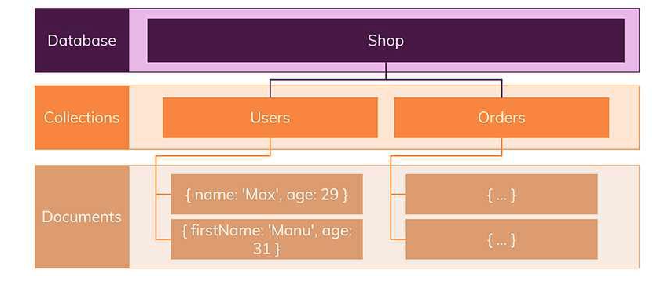
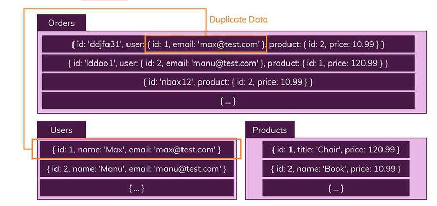

- nosql
  - 데이터와 트래픽이 급증함으로써, 기존 RDBMS는 성능적인 부분도 그렇고, 이에 대응하기위한 scale out과 같은 확장이 쉽지않았다.. 이를위해 nosql이 필요..
  - 분산의 측면에서 상당히 유리함.. 그러나, 관계형DB와 같은 관계설정은 어려움
  - nosql의 저장기술
    - key - value database
      - ex. redis
    - Document database
      - key value와 유사하나 value가 계층적인 형태의 도큐먼트로 저장..
      - 객체와 유사.. 하나의 객체를 그대로 저장할수있다함
      - ex. mongo db
    - Wide Column database (나중에 좀더 찾아볼것)
      - Column-family Model 기반의 Database이며 이전의 모델들이 Key-Value 값을 이용해 필드를 결정했다면, 특이하게도 이 모델은 키에서 필드를 결정한다. 키는 Row(키 값)와 Column-family, Column-name을 가진다. 연관된 데이터들은 같은 Column-family 안에 속해 있으며, 각자의 Column-name을 가진다. 관계형 모델로 설명하자면 어트리뷰트가 계층적인 구조를 가지고 있는 셈이다. 이렇게 저장된 데이터는 하나의 커다란 테이블로 표현이 가능하며, 질의는 Row, Column-family, Column-name을 통해 수행된다. 
      - 대표적인 NoSQL Column-family Model로는 HBase,  Hypertable 등이 있다.
    - Graph database 
      - Graph Model Model에서는 데이터를 Node와 Edge, Property와 함께 그래프 구조를 사용하여 데이터를 표현하고 저장하는 Database입니다. 개체와 관계를 그래프 형태로 표현한 것이므로 관계형 모델이라고 할 수 있으며, 데이터 간의 관계가 탐색의 키일 경우에 적합하다. 페이스북이나 트위터 같은 소셜 네트워크에서(내 친구의 친구를 찾는 질의 등) 적합하고, 연관된 데이터를 추천해주는 추천 엔진이나 패턴 인식 등의 데이터베이스로도 적합하다.
      - 대표적인 NoSQL Graph Model로는 Neo4J가 있다.

  - RDBMS
    - 특징
      - 데이터는 정해진 데이터 스키마를 따라 DB 테이블에 저장
      - 데이터는 관계를 통해서 연결된 여러개의 테이블에 분산
        - 이러한 구조는 하나의 테이블에서 중복없이 하나의 데이터만을 관리하기때문에, 다른 테이블에서 부정확한 데이터를 다룰 위험이 없음.. (중복을 최소화..)
      - 관계맺고있는 데이터 변경이 자주일어난다면 이를 사용하는것이좋음(중복을 이미 처리하였기때문에)
      - 변경될 여지가 없고 명확한 스키마가 사용자와 데이터에게 중요한경우
    - 장점
      - 정해진 스키마가 있기때문에, 명확한 데이터 구조보장
      - 데이터 중복을 막을수있음
    - 단점
      - 데이터 구조 변경시 고려해야할 사항들이 많음
      - 테이블간에 관계를 맺고있어서 복잡해질수록 join이 많아짐.. 이에따라 성능도 고려
    
  - nosql
    - 특징
      - 스키마없음
      - 관계없음
      - NoSQL세상에서는 레코드를 문서(documents)라고 부릅니다.
        - SQL 세상에서는 정해진 스키마를 따르지 않는다면 데이터를 추가 할 수 없지만, NoSQL에서는 다른 구조의 데이터를 같은 컬렉션(= SQL에서의 테이블)에 추가할 수 있습니다.
        - 그리고 보통 orders에 users와 product를 저장해야할때, users에 있는 데이터를 복사해서 orders에 저장하게됨.. 그렇기때문에 join이 필요없음.. 하지만 중복이 발생!
          - 
          - 
          - *중복데이터들은 Users가 변경이 반영되지못한채 Orders에 copy를 진행했다면 (혹은 Users는 변경되었는데 Orders에는 반영안되어있음..) 무결성에 문제가있을수있음..
          - 그래서 자주 변경되지않을때 사용하는게 좋음
      - 읽기 처리는 자주하지만, 데이터를 자주 변경(update) 하지 않는경우(한번 변경할때마다 컬렉션을 찾아다니며 다큐먼트 변경을 자주해야한다면 당연 안좋겟지!)
    - 장점
      - 스키마가 없기때문에 유연하고 자유로운 데이터 구조를 가질수있음..
      - 데이터 분산이 용이!(scale out!)
      - NoSQL은 정확한 데이터 구조를 알 수 없고 데이터가 변경/확장이 될 수 있는 경우에 사용하는 것이 좋음
    - 단점
      - 데이터 중복 발생할수있음..
      - 데이터 구조가 명확하지않으니 또한 그에 따른 단점..

  - 결론 : SQL과 NoSQL은 모두 훌륭한 솔루션입니다. 두 가지 중 하나의 솔류션을 선택해야 되는 문제에서는 어떤 데이터를 다루는지, 어떤 애플리케이션에서 사용되는지 고려해야합니다. 

- 출처 
  - https://khj93.tistory.com/entry/Database-RDBMS%EC%99%80-NOSQL-%EC%B0%A8%EC%9D%B4%EC%A0%90
  - https://siyoon210.tistory.com/130