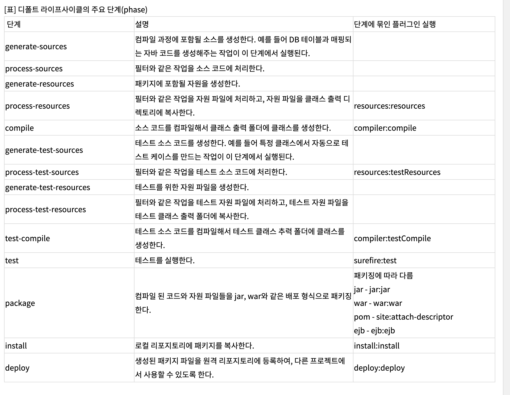

maven
- maven dependency 매커니즘
  - 상당히 많은 dependency를 통해서 라이브러리들을 불러오게되는데, 이에따라 transitive(이행성) dependency가 생긴다.
    - 이행성?
      - 어떤 이항관계에서 갑이 을에 관계되고 을이 병에 관계되는 경우 반드시 갑이 병에 관계되는 것을 요구하는 조건.
      - 즉 A->B 를 의존하고, B->C를 의존할떄, A->C를 의존하는 관계.. 
  - 이때에, 여러 dependency간에 어떻게 사용할것인지를 정의하는 정책들이 있는데, 아래와 같음
    - Dependency mediation
      - "nearest definition" 정책을따른다.
        - depth가 똑같으면 먼저 선언된게 win
        - depth가 덜 깊은쪽이 win (dependency tree에서 가까운쪽!)
        - 만약 모듈을 통해서 의존하게된 라이브러리 버전이 있을때, 루트에서 직접 지정한 라이브러리가 있다면, 당연 루트에서 지정한 라이브러리 버전이 win
        ```java
            A
            ├── B
            │   └── C
            │       └── D 2.0
            └── E
                └── D 1.0
                "여기서 D 1.0이 win"
        ```
    - Dependency management
      - 이 섹션을 통해서 transitive dependency를 만났을때 버전을 지정할수있고, 같은 pom내에서 버전을 지정하지않았다면, 해당 섹션에서 지정한 버전을 사용한다
    - Dependency scope
      - dependency의 scope를 지정할수있음
        - compile
        - provided
          - compile과 매우 유사하나, runtime시에 가져오지않음.. 말 그대로 (다른곳에서) 이미 제공되었으니, 해당 dependency는 런타임시엔 추가하지말라는뜻
        - runtime
        - test
        - system
        - import
  - 프로젝트가 부모pom에 dependencyManagement를 사용하여 그곳에 정의된 A모듈의 버전과, 해당 프로젝트에서 의존하고있는 특정 프로젝트에서 가지고있는 A모듈의 버전중 무얼가져올까?
    - maven dependencyManagement가 있으면, 의존하고 있는 프로젝트에 명시된 버전을 가져오는게 아닌, dependencyManagement에 지정한 버전을 가져온다. 다른 버전이 필요하다면, 직접 관련 프로젝트에 명시해주어야한다.
      - > Dependency management - this allows project authors to directly specify the versions of artifacts to be used when they are encountered in transitive dependencies or in dependencies where no version has been specified.
        - 전이된 종속성의 버전은 dependencyManagment에서 지정한 버전으로 적용된다는 이야기


  - 참고 사이트
    - [Maven – Introduction to the Dependency Mechanism](https://maven.apache.org/guides/introduction/introduction-to-dependency-mechanism.html)
    - [Maven의 Transitive Dependency 길들이기 | The Sapzil](https://blog.sapzil.org/2018/01/21/taming-maven-transitive-dependencies/)
- `pom.xml`에서 모듈간 혹은 모듈 Import시 루트 프로젝트와 겹치는 라이브러리가 있다면?
  1. 프로젝트 실행시 maven에 exclusion 해놓으면 다른 모듈에 있어도 읽어오지않는다
  2. 모듈로 가져오는 버전보다 당연 로드되는 프로젝트 버전이 우선
  3. 만약 모듈끼리 겹치면..?
      - `mvn dependency:tree` pom.xml 선언되어있는 라이브러리 트리구조 확인가능
        - `maven helper` 플러그인 다운받아서 하는게 깔끔..
          - 루트 프로젝트에 있는 동일한 라이브러리 모듈에 있다면, 이는 충돌로 나타나진않는다.. 그냥 무조건 루트 프로젝트에 있는 라이브러리 모듈 적용 (ex. spring-boot-starter-undertow:1.5.13.RELEASE 를 로드하는 프로젝트에서 spring-boot-starter-undertow:2.7.3 을 사용하는 모듈을 import할때, 충돌이 아닌 무조건 1.5.13 버전으로.. )
            - 그래서 참고로 `spring-boot-autoconfigure`에서 `spring.factories` 가 충돌날수없다.. 어차피 한 버전만 실행되므로..
      - 충돌 라이브러리를 포함한 라이브러리를 확인하여 별도로 해당 라이브러리를 Exclude하고 충돌일으키는 라이브러리는 원하는 버전을 명시하는 식으로 관리하면 좋을듯
      
      - https://lng1982.tistory.com/309

   - gradle 충돌인데, 나중에 필요하면 사용해보자..
     - https://velog.io/@mu1616/spring-dependency-management%EB%A1%9C-%EC%9D%B8%ED%95%9C-gradle-%EB%B2%84%EC%A0%84-%EC%B6%A9%EB%8F%8C%EB%AC%B8%EC%A0%9C

- [scope](https://maven.apache.org/guides/introduction/introduction-to-dependency-mechanism.html#dependency-scope)

- [parent를 통한 boot 의존성관리 설명](https://recordsoflife.tistory.com/393)
- [모듈구성시참고](https://eblo.tistory.com/144)
- [maven 간단정리](https://thalals.tistory.com/345)
- [dependencyManagement와 dependecies 차이점](https://darkstart.tistory.com/238)
  - dependencyManagement를 쓰면 그냥 dependencies에서 의존성을 추가할때 dependencyManagement에 정의된 의존성이라면, 버전명시를 안해도 dependencyManagement에 있는 버전을 가져옴.. dependencyManagement 여기에 있는 모든 의존성을 가져오진않음

- [maven 기초내용](https://javacan.tistory.com/129)
  - Maven은 clean, build (default), site의 세 가지 라이프사이클을 제공하고 있다. 각 라이프사이클은 순서를 갖는 단계(phase)로 구성된다. 또한, 각 단계별로 기본적으로 실행되는 플러그인(plugin) 골(goal)이 정의되어 있어서 각 단계마다 알맞은 작업이 실행된다. 
  - 
  - 기본적으로 라이프사이클의 특정 단계를 실행하면 그 단계의 앞에 위치한 모든 단계가 실행된다. 예를 들어 test 단계를 실행하면 test 단계를 실행하기에 앞서 'generate-sources' 단계부터 'test-compile' 단계까지 각 단계를 순서대로 실행한다. 각 단계가 실행될 때는 각 단계에 묶인 골(goal)이 실행된다.
    - 플러그인 골을 직접 명시한 경우에는 해당 플러그인만 실행되기 때문에 라이프사이클의 단계가 실행되지는 않는다.
      - ex. `mvn surefire:test` 라고 명령하면, 위 표의 test phase이전의 모든 단계가 실행되지않고, 딱 해당 단계의 플러그인말 실행. 
      - 플러그인 골(Plugin Goal)
        - Maven에서 플러그인을 실행할 때에는 '플러그인이름:플러그인지원골'의 형식으로 실행할 기능을 선택한다. 예를 들어 compiler:compile은 'compiler'는 플러그인에서 'compile' 기능(goal)을 실행한다는 것을 뜻한다.
- [Maven 관련 알고 있음 좋은 내용들](https://m.blog.naver.com/naverdev/120113627296)