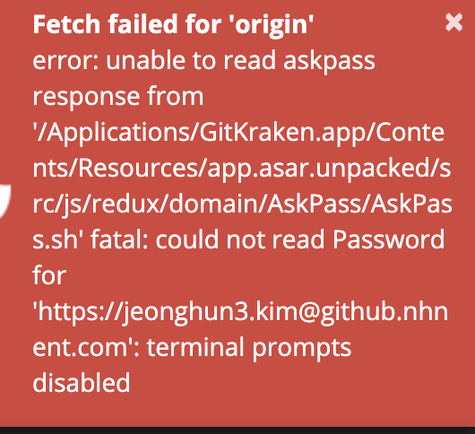

git pull 안될때

- gitkraken에서 아래와 같은 이슈 발생
  - 
- 해결
  - `git config -e`
  - `remote.origin.url` 값을 아래와 같은 형식으로 변경
    - 변경전
      - `remote.origin.url=https://jeonghun3.kim@github.nhnent.com/~~`
    - 변경후
      - `remote.origin.url=https://github.nhnent.com/~~`

- [참고사이트](https://stackoverflow.com/questions/32232655/go-get-results-in-terminal-prompts-disabled-error-for-github-private-repo)