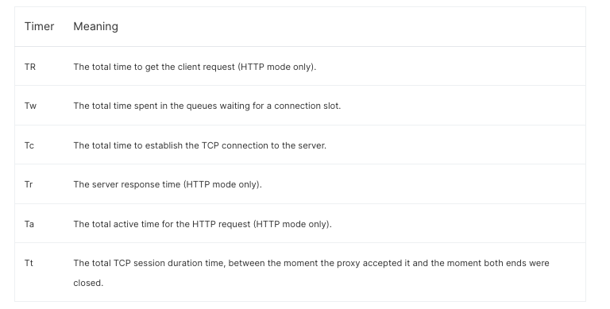

haproxy 정리

- Haproxy logging
  - https://www.haproxy.com/blog/introduction-to-haproxy-logging
  - Hproxy 로깅 셋팅 절차
    - /etc/rsyslog.d/haproxy.conf 생성
      ```conf
          # Collect log with UDP
          $ModLoad imudp
          $UDPServerAddress 127.0.0.1
          $UDPServerRun 514

          # Creating separate log files based on the severity
          :msg, contains, "GET /resources/" stop # resource 거르는 작업..

          local0.* -/var/log/haproxy-traffic.log
          local0.notice -/var/log/haproxy-admin.log
      ```
    - /etc/rsyslog.conf에 아래 내용 확인
      - `$IncludeConfig /etc/rsyslog.d/`
    - /etc/haproxy/haproxy.cfg 에 로깅 셋팅
      ```cfg
        global
            log 127.0.0.1:514   local0  info

        ...

        frontend pcweb-front
          ...
          option httplog
          ...
      ```
      - httplog 기본은 아래와 같음
      ```
        Feb  6 12:14:14 localhost haproxy[14389]: 10.0.1.2:33317 [06/Feb/2009:12:14:14.655] http-in static/srv1 10/0/30/69/109 200 2750 - - ---- 1/1/1/1/0 0/0 {1wt.eu} {} "GET /index.html HTTP/1.1"

          Field   Format                                Extract from the example above
          1   process_name '[' pid ']:'                            haproxy[14389]:
          2   client_ip ':' client_port                             10.0.1.2:33317
          3   '[' request_date ']'                      [06/Feb/2009:12:14:14.655]
          4   frontend_name                                                http-in
          5   backend_name '/' server_name                             static/srv1
          6   TR '/' Tw '/' Tc '/' Tr '/' Ta*                       10/0/30/69/109
          7   status_code                                                      200
          8   bytes_read*                                                     2750
          9   captured_request_cookie                                            -
          10   captured_response_cookie                                           -
          11   termination_state                                               ----
          12   actconn '/' feconn '/' beconn '/' srv_conn '/' retries*    1/1/1/1/0
          13   srv_queue '/' backend_queue                                      0/0
          14   '{' captured_request_headers* '}'                   {haproxy.1wt.eu}
          15   '{' captured_response_headers* '}'                                {}
          16   '"' http_request '"'                      "GET /index.html HTTP/1.1"

      ```
      - 
      - 
      - 
      - 
        - 출처: https://serverfault.com/questions/650588/haproxy-timing-connection-diagram

    - rsyslog restart


---

1. sudo cp /etc/cron.daily/logrotate /etc/cron.hourly/
2. logrotate 생성
   1. sudo vi /etc/logrotate.d/haproxy
   2. 아래 내용 추가
    ```
      /var/log/haproxy-traffic.log {
      rotate 20
      create
      hourly
      missingok
      dateext
      maxage 14
      size 1G
      }
    ```

---

Jul  4 03:59:50 localhost haproxy[26166]: 3.35.80.2:58006 [04/Jul/2023:03:59:50.872] pcweb-front~ pcweb-back/tklw-pcweb-wb923 0/0/2/-1/4 -1 0 - - SD-- 1928/1928/1270/159/0 0/0 "GET /reserve/schedule/1570706372?partnerNo=Yy7sivMZ9v4lwhHcOq4%2Faw%3D%3D&isCharlotte=false&isCoupang=true HTTP/1.1"

- 0/0/2/-1/4 
  - 첫 바이트를 수신한 시간과 프록시가 http header의 끝을 표시하는 빈 줄을 수신한 시간까지의 경과 시간: 0
    - body는 카운팅하지않음
    - -1이면 완성된 http request를 받기전 취소(aborted)되거나, bad request를 받았을 경우
    - 여기 request는 싱글 패킷으로 맞춰들어오기때문에, 보통 매우 작다. 그렇기에 긴 시간이 찍혀있다면 client <-> haproxy간 네트워크 이슈를 살펴야한다
  - connection slot을 기다리는 queue에서 보낸 총 시간: 0
    - backend queue와 server queue, 그리고 서버가 이전 요청을 완료하는데 걸리는 시간까지를 계산된다함
    - -1이면 queue에 도달하기전에 죽은걸 의미 (보통 요청이 거부되거나(ex. http-request deny) invalid일때)
  - 3 way handshake로 TCP connection 이 생성되는 시간: 2
    - TCP SYN 패킷과 SYN/ACK 패킷을 전달받는데까지 걸린 시간
    - -1이면 커넥션이 생성되지않은것
  - 서버로 부터 응답받은시간: 알수없음 (에러)
    - TCP Connection이 서버로 부터 만들어지는 순간부터 서버가 완전한 응답 헤더를 보낸 순간까지의 시간
    - -1이면 응답헤더의 마지막(empty line)을 받지못한것.. 보통 서버가 이를 처리하는데 오래걸려서 타임아웃 났을때 그럴수 있음
  - http requeset에 대해 총 활성화된 시간. 즉, 프록시가 request 헤더의 첫 바이트를 받은 순간 부터 응답데이터의 마지막 바이트를 방출한 시간 응답받은 데이터를 방출한 시간: 4
    - 데이터 전송시간(Td)을 추정할 수 있음
      - body 데이터 전송하는 시간("timer내용 도식화" 참고)
      - `Td = Ta - (TR + Tw + Tc + Tr)`
- -1 
  - 상태코드: 알수없음
- 0
  - client로부터 전달받은 총 바이트 : 0
- - 
  - captured_request_cookie
- - 
  - captured_response_cookie
- SD--
  - termination_state
  - 세션이 종료되었을대 세션의 상태 및 쿠키에 대한 persistence operations에 대한 정보를 알 수 있음
    - 세션이 종료된 이유에 대해서 알 수 있음
    - ex. SD--
      - 데이터 전송 중 오류로 서버에 대한 연결이 끊어짐. 보통 일반적으로 haproxy가 서버로부터 RST를 수신했을때 나타남. 이는 서버 충돌로 인해 발생할 수 있음. 또는 중간 장비의 네트워크 문제로 인해 발생할 수 있음
    - [세부 상태코드 확인 가능](https://cbonte.github.io/haproxy-dconv/1.8/configuration.html#8.5)
  
- 1928/1928/1270/159/0
  - actconn: 1928
    - Haproxy 프로세스의 총 동시 connection 수
    - 해당 수치가 더이상 올라가지못하고 다량의 connection error가 발견된다면, 해당 프로세스의 file descriptor 생성 가능 갯수가 충분한지 확인해야한다 
      - `$ pid=$(ps -ef | grep haproxy | awk '/nobody/ { print $2 }'); cat "/proc/${pid}/limits" | grep open`
  - feconn: 1928
    - frontend 를 통해 라우팅된 총 동시 connection 수
  - beconn: 1270
    - backend 를 통해 라우팅된 총 동시 connection 수
  - srv_conn: 159
    - 서버에서 활성상태인 총 동시 connection 수
    - 서버의 "maxconn" 파라미터를 초과할수 없다
    - 특정 서버의 srv_conn 수치가 높다면, 해당 서버는 요청을 처리하는데 현재 문제상태에 있음을 추정할 수 있음
  - retries: 0
    - 서버로 연결시에 경험된 connection 재시도 수
      - 서버가 새로운 Connection을 생성하는데 막고있는 상태 (TCP 핸드쉐이크 레벨)
    - 보통은 0이어야하고, 그렇지않으면 haproxy<->서버간 네트워크에 문제가 있다고 판단할수있음

- 0/0    
  - srv_queue: 0
    - 해당 server 큐에 대기하고있는 connection의 수
  - backend_queue: 0
    - backend에 대기하고있는 connection의 수

