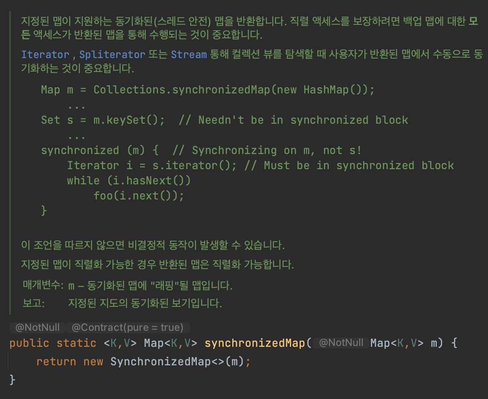

effective_java_동시성

- 아이템78_공유 중인 가변 데이터는 동기화해 사용하라
  - 동기화에는 두가지 중요한 기능이 있음
    - 베타적 실행
      - 한 스레드가 변경하는 중이라서 상태가 일관되지 않은 순간의 객체를 다른 스레드가 보지 못하게 막는 용도 (간단하게말하면, 락을 획득한놈만 상태를 변경가능하기에, 내가 변경하고 있는 와중에 다른놈이 변경 못하는것)
    - 가시성 확보
      - 동기화된 메서드나 블록에 들어간 스레드가 같은 락의 보호하에 수행된 모든 이전 수정의 최종결과를 보게해줌
        - long이나 double외의 변수는 언제라도 변경된 값을 한번에 읽고 쓸 수 있다.(원자적) 즉, 동기화 없이 수정하는 중이라도 항상 어떤 스레드가 정상적으로 저장한 값을 온전히 읽어온다(잘리거나 하지않는다!)
        - 하지만, 스레드가 저장한 값이 다른 스레드에게 "보이는가"를 반드시 보장하지않는다! (자바언어명세)
          - 쉽게 이야기하면, 특정 스레드가 변수의 값을 변경했을때, 다른 스레드가 그 변경한 값을 못 읽을 수 있다는것..
          - 한 스레드가 만든 변화가 다른 스레드에게 언제 어떻게 보이는지를 규정한 자바의 메모리 모델때문이라함 
            - <span style="color:red">뭔소리인지 좀더 찾아봐야할듯<span>
          - ex. 무한 루프를 돌고 있는 스레드가, boolean을 활용하여 스레드를 멈출때 
            - 예제코드넣기
            
      - 가시성 확보를 위해 쓰기와 읽기 모두 sychronized 키워드를 사용는것보다 좋은 성능을 발휘하는게 volatile!
        - volatile은 배타적 수행과 관계없다!
          - 멀티스레드 환경에서 값을 순차적으로 증가시켜야 한다면, 반드시 배타적 수행을 위해 synchronized 키워드를 사용해야한다
            - 물론, 이런 synchonrized 키워드에 대한 개선으로 AtomicInteger가 있다
              - java.util.concurrent.atomic 패키지참고 (락 없이도 스레드 안전한 프로그래밍 지원해주는 클래스들이 있음)
        - 하지만, 항상 가장 최근에 기록된 값을 읽게 됨을 보장한다
          - cpu 캐시가 아닌 메모리에서 가져온다!
          - JVM이 최적화를 통해 변수의 읽기와 쓰기를 재정렬하는 경우, volatile 키워드는 이러한 재정렬을 방지하여 변수에 대한 읽기와 쓰기의 순서를 보장
        - 스레드간 통신용도로만 사용된다면 적극 사용할것! (ex. 위의 스레드 멈출때 사용하는 boolean 같은 경우 )
  - 위에서 이야기한 동시성 문제를 피하려면?
    - 가변데이터 공유하지않는것!
      - 불변 데이터만 공유하거나 아무것도 공유 노
      - 가변 데이터는 단일 스레드에서만쓰도록..
        - 만약, 해당 정책이 있다면 꼭 문서에 남길것!!
  - 한 스레드가 데이터를 다 수정한 후 다른 스레드에 공유할 때는, 해당 객체에서 공유하는 부분만 동기화하자
    - 객체를 다시 수정할 일이 생기기전까지 다른 스레드들은 동기화 없이 자유롭게 값을 읽을 수 있음
    - 이런 객체는 외부에서 변경이 불가하고, 요청은 외부에서 들어와도 실질적으로 해당 객체의 내부에서만 상태 변경을 수행한다. 그래서 **모든 필드가 final이 아닌(모든 필드가 final로 된 객체는 그냥 immutable 객체), 가변 객체가 있고, 이를 외부에서 직접 변경 못하도록 방지하여(+가변 객체를 리턴할때는 보통 복제를 해주겟지) 사실상 불변과 같이 만들어놓을것을 사실상불변(effectively immutable)**이라한다.
      - 그리고 다른 스레드에 이러한 객체를 건네는 행위를 안전 발행(safe publication)이라한다
        - 즉, 안전발행이란, 객체를 여러 스레드에서 안전하게 공유할 수 있도록 보장하는 메커니즘이며, 다른 스레드가 객체를 변경되지 않은 상태로 올바르게 보게 함을 보장
        - 안전발행 방법?
          - 클래스 초기화 과정에서 객체를 정적 필드, volatile 필드, final 필드, 혹은 보통의 락을 통해 접근하는 필드에 저장
            - 정적필드예시
              - `public static Holder holder = new Holder(42);`
                - 이렇게 되었을때, 어떤 스레드가 holder에 접근해도 중간에 변경되지않음
                  - 즉, holder 객체를 생성중에 다른 스레드가 접근하지않는다는것!
              - [출처](https://stackoverflow.com/questions/4376457/static-initializers-and-safe-publication)
          - 동시성 컬렉션에 저장.. 
            - ex. ConcurrentHashMap?
              ```java
                // ConcurrentHashMap 내부

                // 값을 저장할때는 synchronized 사용
                final V putVal(K key, V value, boolean onlyIfAbsent) {
                    if (key == null || value == null) throw new NullPointerException();
                    int hash = spread(key.hashCode());
                    int binCount = 0;
                    for (Node<K,V>[] tab = table;;) {
                        Node<K,V> f; int n, i, fh; K fk; V fv;
                        if (tab == null || (n = tab.length) == 0)
                            tab = initTable();
                        else if ((f = tabAt(tab, i = (n - 1) & hash)) == null) {
                            if (casTabAt(tab, i, null, new Node<K,V>(hash, key, value)))
                                break;                   // no lock when adding to empty bin
                        }
                        else if ((fh = f.hash) == MOVED)
                            tab = helpTransfer(tab, f);
                        else if (onlyIfAbsent // check first node without acquiring lock
                                && fh == hash
                                && ((fk = f.key) == key || (fk != null && key.equals(fk)))
                                && (fv = f.val) != null)
                            return fv;
                        else {
                            V oldVal = null;
                            synchronized (f) {      // 동일한 Node에 데이터를 put하는 경우만 동기화 되도록
                                if (tabAt(tab, i) == f) {
                                    if (fh >= 0) {
                                        binCount = 1;
                                        for (Node<K,V> e = f;; ++binCount) {
                                            K ek;
                                            if (e.hash == hash &&
                                                ((ek = e.key) == key ||
                                                (ek != null && key.equals(ek)))) {

                            // ...
                }

                // 값을 읽어올때는 volatile을 사용
                static class Node<K,V> implements Map.Entry<K,V> {
                    final int hash;
                    final K key;
                    volatile V val;             // key는 동일하나 해당 값이 변경될 수 있고, 그 값을 가져올때 동기화가 필요하니 volatile 사용
                    volatile Node<K,V> next;    // HashMap 특성상, Hash값 같으면, 연결List로 구성되니, 해당 부분또한 값을 읽어올때 동기화가 필요하여 volatile 사용
                    // ...
                }
              ```

  - 기타 팁
    - long, double 외의 변수를 읽고 쓰는 동작은 원자적(atomic)임
    - AtomicInteger는 어떻게 동작할까?
      - CAS (Compare And Swap) 방식을 사용

      - compareAndSwap관련 내용 chatGPT 답변
        ```
          비교-교환(compare-and-swap, CAS) 연산은 동시성 제어를 위한 중요한 원자적 연산입니다. CAS는 원자적으로 값을 읽고, 비교하고, 그 값이 기대하는 값과 일치하는 경우에만 새로운 값으로 업데이트하는 연산을 제공합니다.
          ### CAS의 작동 원리:
          CAS 연산은 대상 메모리 위치의 현재 값을 가져와 그 값이 예상 값과 같은지 확인합니다. 만약 값이 일치하면, 새로운 값으로 업데이트를 시도합니다. 이 모든 과정은 원자적으로 이루어져, 이 연산을 수행하는 동안 다른 스레드가 해당 메모리 위치를 변경할 수 없습니다.

          ### CAS의 장점:
          1. **비-블로킹:** CAS는 락(lock)을 사용하지 않으므로, 한 스레드가 연산을 수행하는 동안 다른 스레드가 블로킹되지 않습니다. 이는 높은 동시성을 필요로 하는 시스템에서 중요한 이점입니다.
          2. **스핀-잠금 해결:** 한 스레드가 연산을 수행하려 할 때, 다른 스레드가 락을 소유하고 있지 않더라도 스핀-잠금이 발생할 수 있습니다. CAS를 사용하면 이 문제를 해결할 수 있습니다.

          ### CAS의 단점:
          3. **ABA 문제:** 값 A를 가진 메모리 위치가 먼저 값 B로 변경되었다가 다시 값 A로 변경되는 경우, CAS 연산은 값이 변경되지 않았다고 판단할 수 있습니다. 이를 ABA 문제라고 합니다. 이 문제는 '버전 번호'나 '보조 태그' 등을 사용하여 해결할 수 있습니다.
          4. **일관성 실패:** CAS 연산이 성공하기 위해서는 여러 스레드가 동시에 같은 메모리 위치를 업데이트하지 않아야 합니다. 그러나 여러 스레드가 동시에 같은 메모리 위치를 업데이트하려고 시도하면, 한 스레드의 CAS 연산이 성공할 때까지 다른 모든 스레드의 CAS 연산이 실패합니다. 이는 '라이브-락' 문제를 일으킬 수 있습니다.

          따라서, CAS는 동시성 제어에 있어 중요한 도구이지만, 그 사용은 신중해야 합니다. 이러한 원자적 연산은 성능과 데드락 문제를 효과적으로 관리할 수 있지만, 위에서 언급한 단점을 고려해야 합니다.  
        ```
        - => AtomicInteger에서 incremetAndGet과 같은 증가만하는 경우는 ABA가 일어나지않는다.. 다시 A로 돌아갈일이없으니..
        - => 라이브락은 프로세스나 스레드가 다른 스레드의 작입이 끝나기를 기다리면서 영원히 대기 상태에 머무는 현상..
          - 데드락은은 스레드나 프로세스가 서로 자원을 얻지못해 영원히 대기상태인데, 라이브락은 스레드나 프로세스가 실행상태에 있지만, 유용한 작업을 수행하지 못하고 계속해서 상태를 변경하는것.. (CAS에서는 계속 CAS연산이 실패하면서 루프를 타는..)
        - => 백오프 알고리즘은 라이브락을 완화하기위한 방법으로, 재시도전에 일정시간 기다리는 방식
        - => 스핀-잠금이란, 동시성 제어를 위한 한가지 기법으로, 특정 자원에 대한 접근이 가능해질때까지(즉, 락이 해제될떄까지) 계속해서 시도(회전)하는 방식. 이를 바쁜대기(busy-wait)이라고도 함.
          - 잠금해제까지 CPU시간을 계속 소비하기때문에 다른 작업을 수행못함. 그래서 보통 잠금이 매우 짧은 시간만 유지되는 경우 사용하는 방법..
          
    - volatile 관련 궁금내용 ChatGPT 문답내용
      ```
        chatGPT 를 통한 volatile 관련 궁금내용 정리
        Q. volatile 키워드와 시스템메모리, cpu간의 관계
        => volatile 키워드의 역할을 이해하려면 CPU 캐시와 메인 메모리 간의 동작 방식에 대해 이해해야 합니다.
        오늘날의 대부분의 컴퓨터 아키텍처에서 CPU는 자체 캐시 메모리를 가지고 있습니다. 이 캐시 메모리는 CPU가 필요로 하는 데이터를 빠르게 제공하기 위한 것입니다. CPU가 데이터를 읽거나 쓸 때, 이 작업은 캐시 메모리에서 수행되며, 이 캐시는 주기적으로 메인 메모리와 동기화됩니다. 이러한 방식은 CPU의 성능을 크게 향상시키지만, 멀티스레드 환경에서는 문제가 될 수 있습니다.
        멀티스레드 환경에서, 각 스레드는 일반적으로 자신만의 CPU 캐시를 가집니다. 따라서, 하나의 스레드가 변수를 변경하면 이 변경 사항은 해당 스레드의 CPU 캐시에만 반영되고, 이는 즉시 다른 스레드의 CPU 캐시에는 반영되지 않습니다. 그 결과, 다른 스레드는 해당 변수의 최신 값을 보지 못하게 됩니다.
        이런 문제를 해결하기 위해 Java는 volatile 키워드를 제공합니다. 변수가 volatile로 선언되면, 해당 변수에 대한 모든 읽기와 쓰기 작업은 CPU 캐시를 거치지 않고 직접 메인 메모리를 통해 수행됩니다. 이를 통해, 하나의 스레드가 volatile 변수를 변경하면, 이 변경 사항은 즉시 모든 스레드에게 보이게 됩니다. 이는 모든 스레드가 항상 해당 변수의 최신 값을 볼 수 있음을 보장합니다.
        그러나, volatile 키워드는 이러한 가시성 문제만 해결하며, 복합 연산에 대한 원자성은 보장하지 않습니다. 즉, 여러 단계로 이루어진 연산이 중간에 다른 스레드에 의해 방해받지 않도록 하려면 추가적인 동기화 메커니즘(예: synchronized)이 필요합니다.

        Q. cpu가 싱글코어일때는?
        => 싱글 코어 CPU에서는 한 번에 하나의 스레드만이 실행될 수 있으므로, 일반적으로 volatile 키워드가 필요 없을 수 있습니다. 싱글 코어 CPU에서 여러 스레드가 '동시에' 실행되는 것은 운영 체제의 컨텍스트 스위칭(Context Switching) 덕분입니다. 이는 실제로는 스레드들이 빠르게 전환되며 실행되는 것이지, 동시에 실행되는 것이 아닙니다.
        그러나 이것은 스레드 스케줄링, JVM 구현, 그리고 Java 메모리 모델과 같은 여러 요소에 따라 달라질 수 있습니다. 특히, Java 메모리 모델은 volatile 변수에 대한 동작을 명확히 정의하고 있으며, 이는 싱글 코어 또는 멀티 코어 CPU에 관계없이 동일하게 적용됩니다.
        따라서, 실제로는 싱글 코어 CPU에서도 volatile 키워드가 필요한 경우가 있을 수 있습니다. 예를 들어, JVM이 최적화를 통해 변수의 읽기와 쓰기를 재정렬하는 경우, volatile 키워드는 이러한 재정렬을 방지하여 변수에 대한 읽기와 쓰기의 순서를 보장합니다.
        또한, Java 프로그램이 여러 코어를 가진 시스템에서 실행될 가능성이 있는 경우, volatile 키워드를 사용하여 프로그램이 올바르게 동작하도록 만드는 것이 좋습니다. 이는 코드의 이식성을 보장하는 중요한 방법입니다.

        Q. volatile키워드를 사용하는것과 JVM 최적화를 위한 재정렬에 대해서 좀더 알려줘
        => Java의 volatile 키워드는 Java 메모리 모델에 의해 정의되며, 이는 스레드 간의 통신에 대한 세부 사항을 정의합니다. 특히, volatile 키워드는 변수에 대한 읽기와 쓰기가 원자적(atomic)으로 발생하며, 이 작업이 항상 메인 메모리에서 수행된다는 것을 보장합니다. 또한 volatile 변수에 대한 읽기와 쓰기는 항상 순차적으로 수행되며, 이는 JVM이 이러한 작업을 재정렬하지 못하게 합니다.
        JVM 최적화 중 하나인 '재정렬'에 대해 설명하면, JVM은 실행 성능을 향상시키기 위해 다양한 최적화 기법을 사용합니다. 그 중 하나가 명령어 재정렬입니다. 이는 코드의 순서를 변경하여 CPU 파이프라이닝 등의 기법을 더 효과적으로 활용하고, CPU 캐시 히트율을 향상시키는 등의 이점을 제공합니다.
        그러나, 이러한 최적화가 멀티스레드 프로그램에서는 문제를 일으킬 수 있습니다. 예를 들어, 한 스레드가 변수 a와 b를 순차적으로 작성하고, 다른 스레드가 그 변수들을 순차적으로 읽는다고 가정해봅시다. JVM이 명령어 재정렬 최적화를 적용하여 변수 b의 쓰기가 a의 쓰기보다 먼저 발생하도록 변경하면, 읽는 스레드는 a와 b의 값을 예상치 못한 순서로 볼 수 있습니다.
        volatile 키워드는 이러한 문제를 해결합니다. volatile로 선언된 변수는 JVM이 해당 변수에 대한 읽기와 쓰기 작업의 순서를 변경할 수 없습니다. 따라서, 한 스레드가 volatile 변수를 순차적으로 작성하면, 다른 스레드는 그 변수들을 작성된 순서대로 보게 됩니다. 이는 멀티스레드 프로그램에서 변수의 일관성을 유지하는 데 중요합니다.
      ```

    
---

- 아이템79_과도한 동기화는 피하라
  - 과도한 동기화는 성능을 떨으뜨리고, 교착상태에 빠뜨리고, 심지어 예측할수 없는 동작을 낳기도한다
  - 동기화 메서드나 동기화 블록 안에서는 제어를 절대로 클라이언트에게 양도해주면 안된다!
    - 즉, 클라이언트가 오버라이딩 혹은 람다(함수객체)로 넘겨줄 수 있는 부분을 동기화 메서드나 동기화 블럭 안에서 사용하지마라!
    - 만약, 동기화 메서드나 동기화 블록안에서 클라이언트 제어권을 넘겨주면, 응답 불가와 안전실패가 날 수 있다
    - 코드로 보자
      ```java
      public static void main(String[] args) {

          SetObserver<Integer> 문제없음 = (s, e) -> System.out.println(e);
          SetObserver<Integer> 에러유발_안전실패 = new SetObserver<>() {
              @Override
              public void added(ObservableSet<Integer> set, Integer element) {
                  System.out.println(element);
                  if (element == 23) {
                      set.removeObserver(this); // removeObserver 메서드에는 synchronized가 있어서 락을 획득해야하는데, 현재 added 메서드 호출하기전에도 동일한 객체에서의 락을 획득한 상태로 진입하였기에, 더이상 추가적으로 락을 획득하지않고 진입이 가능하다..(자바는 재진입가능) 그래서 loop돌고 있던 list를 제거하여 ConcurrentModificationException 발생(여기서는 예외가 발생하여 다행이지만, 예외발생안하게되면 데이터가 훼손되어 원인 찾기가 매우 어려워질 수 있다..)
                  }
              }
          };

          SetObserver<Integer> 에러유발_응답불가_교착상태 = new SetObserver<>() {
              @Override
              public void added(ObservableSet<Integer> set, Integer element) {
                  System.out.println(element);
                  if (element == 23) {
                      ExecutorService executorService = Executors.newSingleThreadExecutor();
                      try {
                          executorService.submit(() -> set.removeObserver(this)).get(); // 안전실패예시와는 달리, 새로운 스레드가 락을 획득하려하는데, 현재 added 메서드를 호출하기전에 이미 락이 잡혀있는 객체이기에, 데드락 상태가되어, 응답불가 상태가 된다 (당연, get()메서드를 사용하지않았다면 데드락은 안되겠지..) 
                      } catch (InterruptedException | ExecutionException e) {
                          throw new AssertionError(e);
                      } finally {
                          executorService.shutdown();
                      }
                  }
              }
          };


          ObservableSet<Integer> set = new ObservableSet<>(new HashSet());

          // set.addObserver(문제없음);
          set.addObserver(에러유발_안전실패);
          // set.addObserver(에러유발_응답불가_교착상태);
          for (int i = 0; i < 100; i++) {
              set.add(i);
          }
      }

      static class ObservableSet<E> extends Composition.ForwardingSet<E> {

          public ObservableSet(Set set) {
              super(set);
          }

          private final List<SetObserver<E>> observers = new ArrayList<>();

          public void addObserver(SetObserver<E> observer) {
              synchronized (observers) {
                  observers.add(observer);
              }
          }

          public void removeObserver(SetObserver<E> observer) {
              synchronized (observers) {
                  observers.remove(observer);
              }
          }

          private void notifyElementAdded(E element) {
              synchronized (observers) {
                  for (SetObserver<E> observer : observers) {
                      observer.added(this, element);
                  }
              }
          }

          @Override
          public boolean add(E element) {
              boolean added = super.add(element);

              if (added) {
                  notifyElementAdded(element);
              }
              return added;
          }

          @Override
          public boolean addAll(Collection<? extends E> c) {
              boolean result = false;

              for (E element : c) {
                  result |= add(element);
              }
              return result;
          }
      }

      @FunctionalInterface
      interface SetObserver<E> {
          void added(ObservableSet<E> set, E element);
      }
      ```

  - 구체적으로 위 예에서의 안전실패가 왜 일어났는지 살펴보자
    - 자바 언어의 락은 재진입을 허용하기때문 (동일한 스레드라면 한번 락을 소유하고있으면, 다음에 동일한 락에 대해서 재진입을 허용)
      - 재진입 가능락은 객체 지향 멀티스레드 프로그램을 쉽게 구현할 수 있도록 해주지만, 응답불가(교착상태)가 될 상황을 안전 실패로 변모시킬 수 있다 
        - 위의 예에서도 원래 재진입이 안되었다면, 교착상태로 있게 되는 로직.. ("에러유발_응답불가_교착상태"에서 로직은 동일하나, 새로운 스레드를 생성해서 교착상태를 만든것이다..)
    - 이를 어떻게 해결할 수 있을까?
      - added 호출하는 메서드를 동기화 블록 바깥으로 뺀다! (이러한 방식으로 added를 호출하는것을 열린호출(open call) 이라 한다)
        - 위 예에서는 아래처럼 observers를 복사해서 사용하면 가능
          ```java
            private void notifyElementAdded(E element) {
                List<SetObserver<E>> snapshot = null;

                synchronized (observers) {
                    snapshot = new ArrayList<>(observers);
                }

                for (SetObserver<E> observer : snapshot) {
                    observer.added(this, element);
                }
                
            }
          ```
        - 한걸음 더 나아가서 위와 같은 상황을 위해 자바의 동시성 컬렉션에서 제공해주는 **CopyOnWirteArrayList**가 있다
          - 내부를 변경하는 작업은 항상 꺠끗한 복사본을 만들어 수행
          - **수정할 일이 드물고, 순회만 빈번히 일어나는 관찰자 리스트 용도로 매우 좋음**
          - 아래와같이 변경가능
            - 아래 동기화 로직이 다 사라졌다
            ```java
            private final List<SetObserver<E>> observers = new CopyOnWriteArrayList<>(); 

            public void addObserver(SetObserver<E> observer) {
                observers.add(observer);
            }

            public void removeObserver(SetObserver<E> observer) {
                observers.remove(observer);
            }

            private void notifyElementAdded(E element) {
                for (SetObserver<E> observer : observers) { // CopyOnWriteArrayList의 iterator는 호출시 배열을 복사하기에 중간에 add나 remove를 다른 스레드가 호출해도 안전하다
                    observer.added(this, element);
                }
            }
            ```
    - 이렇게 클라이언트의 제어권을 가진 통제할수 없는 메서드를 동기화 영역 바깥에서 호출하는것은, 추가로 동시성 효율도 개선해준다
      - 통제할 수 없는 메서드가 동기화 블록안에서 오랜시간 수행된다면, 동기화 영역에 진입하고자 하는 다른 스레드는 한 없이 기다려야 하기때문이다..
        - **기본적으로 동기화 영역에서는 가능한 한 일을 적게 해야한다. 이것이 기본규칙이다**
  - 동기화를 하면 성능적으로 어떤 비용이 발생할까?
    - 과도한 동기화가 초래하는 진짜 비용을 락을 얻는데 드는 CPU시간이 아니다
    - 병렬로 실행할 기회를 잃고, 모든 코어가 메모리를 일관되게 보기 위한 지연시간이 진짜 비용
    - 추가로, 가상머신의 코드 최적화를 제한한다는 점도 과도한 동기화의 또다른 숨은 비용
      - 동기화하면 재정렬을 하지않는다
  - 가변 클래스를 작성할때 동기화 관련해서는 아래 두가지중 하나를 선택하자
    - 동기화를 전혀 사용하지않고, 이 클래스를 사용하는 클래스가 알아서 동기화하도록
    - 동기화를 내부에서 수행하여 스레드 안전한 클래스로..
      - 클라이언트가 외부에서 객체 전체를 락을 거는것보다 동시성을 월등히 개선할 수 있을때만 이 방법을 고려
    - => 선택하기 애매하다면, 동기화하지말고 문서에 "스레드 안전하지 않다" 라고 명시하자
  - 기타 팁
    - 동시성을 높여주는 동기화 기법
      - 락 분할 (lock splitting)
      - 락 스트라이핑 (lock striping)
      - 비차단 동시성 제어 (nonbolocking concurrency control)

---

- 아이템80_스레드보다는 실행자, 태스크, 스트림을 애용하라
  - 클라이언트가 요청한 작업을 백그라운드 스레드에 위임해 비동기적으로 처리해주는 방법을 손쉽게 할 수 있도록 java.util.concurrent 패키지의 실행자 프레임워크(Executor Framework)를 제공
  - 그냥 하나의 별도 스레드를 만들어 특정 작업을 수행하고 싶다면 아래와 같이 사용
    ```java
      ExecutorService exec = Executors.newSingleThreadExecutor();
      exec.execute(runnable); // 실행자에 실행시킬 태스크를 넘김
      exec.shutdown(); // 실행자를 우아하게 종료시킴 (이거 호출안하면 VM 종료안됨.)
    ```
  - 큐를 둘 이상의 스레드가 처리하게 하고 싶으면, 정적 팩터리(java.util.concurrent.Executors)를 이용해 실행자 서비스(스레드 풀)를 생성하면된다
    - 특별한 실행자를 원한다면, ThreadPoolExecutor 클래스를 직접사용해서 스레드풀 동작을 직접 셋팅해도됨
    - Executors.newCachedThreadPool
      - 작은 프로그램이나 가벼운 서버라면 좋음
      - CachedThreadPool 에서는 요청받은 태스크들이 큐에 쌓이지 않고, 즉시 스레드에 위임돼 실행된다. 가용스레드가 없으면, 새로 하나를 생성
        - 무거운 프로덕션 서버에는 좋지 못하다
    - Executors.newFixedThreadPool
      - 스레드 갯수를 고정하여 사용
      - 무거운 프로덕션 서버에서 사용하기 적절
  - 작업 큐를 직접 만들거나, Thread를 직접 다루는것도 일반적으로 삼가자
    - 스레드를 직접다루면 작업단위와 수행메커니즘 역할을 모두 수행하게된다
  - **실행자 프레임워크를 사용하면, 작업단위와 실행 메커니즘이 분리된다!**
    - 작업단위: 태스크 
      - ex. Runnable, Callbale
    - 실행 메커니즘: 작업(태스크)을 수행하는 역할
      - ExecutorService
    - => 이런 분리를 통해 태스크는 동일하나, CachedThreadPool 에서 FixedThreadPool로 변경하기위해 ExecutorService를 생성하는부분만 교체하면 끝~
    - => 자바 7이 되면서 실행자 프레임워크는 포크-조인(fork-join) 태스크를 지원하도록 **확장**!
      - ForkJoinTask의 인스턴스는 작은 하위 태스크로 나뉠 수 있고, ForkJoinPool을 구성하는 스레드들이 이 태스크들을 처리하며, 일을 먼저 끝낸 스레드는 다른 스레드의 남은 태스크를 가져와 대신 처리할 수도 있다.
        - CPU를 최대한 활용하면서 높은 처리량과 낮은 지연시간을 달성!
        - 작업형태가 fork-join에 적합한지가 또한 중요!

---

- 아이템81_wait와 notify보다는 동시성 유틸리티를 애용하라
  - wait와 notify는 올바르게 사용하기가 아주 까다로우니 고수준 동시성 유틸리티를 사용하자
  - java.util.concurrent는 고수준 유틸리티를 제공
    - 실행자 프레임워크
    - 동시성 컬렉션 (concurrent collection)
      - List, Queue, Map 같은 표준컬렉션 인터페이스에 동시성을 가미해 구현한 고성능 컬렉션
      - 동기화를 내부에서 수행
      - 동시성 컬렉션은 내부에 동기화를 수행하기에 동시성을 무력화하지못함
        - 여러 메서드를 원자적으로 묶어 호출하는 일 불가능
        - 이에 대한 대안으로 여러 기본동작을 하나의 원자적 동작으로 묶는 "상태 의존적 수정" 메서드들이 추가
          - ex. Map.putIfAbsent
            - Map의 디폴트 메서드
              - ConcurrentHashMap은 해당 메서드를 다시 오버라이딩
            - 주어진 키에 매핑된 값이 아직 없을때만 새 값을 집어넣는다..
              - 내부 상태를 보고 수정이 필요하면 수정하는..
            - 주어진 키에 매핑된 값이 있다면 바로 리턴해주고, 없다면 값을 넣고 null을 리턴
      - => Collections.synchronizedMap보다는 ConcurrentHashMap을 사용하자
      - LinkedBlockingDeque 의 wait, notify 사용방법
        ```java
            // LinkedBlockdingDeque 내부

            final ReentrantLock lock = new ReentrantLock();
            private final Condition notEmpty = lock.newCondition();

             public E takeFirst() throws InterruptedException {
                final ReentrantLock lock = this.lock;
                lock.lock();
                try {
                    E x;
                    while ( (x = unlinkFirst()) == null) // 1. unlinkFirst 메서드를 통해서 데이터가 없는게 확인되면    6. 데이터 가져옴
                        notEmpty.await();                // 2. 스레드 Waiting 상태로 변경                        5. 깨운 스레드가 일어나고
                    return x;
                } finally {
                    lock.unlock();
                }
            }

            private boolean linkLast(Node<E> node) {     // 3. queue에 add하면 요 메서드 호출됨
                // assert lock.isHeldByCurrentThread();
                if (count >= capacity)
                    return false;
                Node<E> l = last;
                node.prev = l;
                last = node;
                if (first == null)
                    first = node;
                else
                    l.next = node;
                ++count;
                notEmpty.signal();                       // 4. wait 상태의 스레드 깨움 (notify)
                return true;
            }

            // => 이를 통해 CPU가 할일 없는 스레드를 붙잡고 있지 않도록 해줌
        ```
    - 동기화 장치 (synchronizer)
      - 스레드가 다른 스레드를 기다릴 수 있게 하여, 서로 작업을 조율할 수 있게 해준다
      - CountDownLatch, Semaphore, CyclicBarrier, Exchanger, Phaser
        - CountDownLatch
          - 하나 이상의 스레드가 또 다른 하나 이상의 스레드 작업이 끝날 때까지 기다리게한다
          - CountDownLatch 유일한 생성자는 int인데, 이 값이 래치의 countDown 메서드를 몇번 호출해야 대기중인 스레드들을 깨우는지 결정
          - 코드로 보자
            - 동시에 시작하여 모두 완료하는데 걸리는 시간 구하는 프로그램
            ```java
                // 코드넣을것

                // 시간을 잴때는 System.currentTimeMillis가 아닌, System.nanoTime을 사용할것! (더 정확하고 정밀하며, 시스템의 실시간 시계의 시간보정에 영향받지 않는다함)
                
            ```
  - 동시성 유틸리티를 사용못한, 레거시의 wait과 notify 다루기
    - wait
      - 스레드가 어떤 조건이 충족되기를 기다리게 할때 사용
      - 동기화 영역 안에서 호출해야함!
      - 객체마다 waiting pool이 있는데, wait 호출시 해당 pool로 들어가게됨
        - 자세한 내용은 "자바의정석_THREAD.md" 참고
      - wait 메서드를 사용할때는 반드시 대기 반복문 (wait loop) 관용구를 사용!! 반복문 밖에서는 절대로 호출마라!
        - 조건 충족여부확인을 위한 반복문!!
        - 대기전에 조건을 검사하여 wait을 건너뛰게 하는것은 **응답 불가 상태를 예방**하기위함
          - 조건이 이미 충족되어서 스레드가 notify를 메서드를 먼저 호출한 후에 wait을 수행하게되면, 해당 스레드가 언제 깨어날지 알 수 없음..
        - 대기 후에 조건을 검사하여 조건이 충족되지 않으면 다시 대기하게 하는것은 **안전실패를 막는 조치**
        ```java
            synchronized (obj) {
                while (<조건이 충족되지 않았다>) {
                    obj.wait(); // 락을 놓게됨. 깨어나면 다시 락을 잡는다
                }

                // 조건 충족시 동작수행
            }
        ```
      - 반드시 위와같이 조건체크를 해야하는 이유
        - 스레드가 notify를 호출한 다음 대기 중이던 스레드가 깨어나는 사이에 다른 스레드가 락을 얻어 그 락이 보호하는 상태를 변경
        - 조건이 만족되지 않았음에도 다른 스레드가 실수로 혹은 악의적으로 notify를 호출. 공개된 객체를 락으로 사용해 대기하는 클래스는 이런 위험에 노출된다. 외부에 노출된 객체의 동기화된 메서드 안에서 호출하는 wait는 모두 이 문제에 영향을 받는다
        - 깨우는 스레드는 지나치게 관대해서, 대기 중인 스레드 중 일부만 조건이 충족되어도 notifyAll을 호출해 모든 스레드를 깨울 수 있다
          - <span style="color:red"> 정확히 무슨말인지 모르겠음 </span>
        - 대기중인 스레드가 notify 없이도 깨어나는 경우가 있다. 허위 각성(spurious wakeup)이라는 현상
    - notify, notifyAll은 대기하는 스레드를 깨울때 사용 (notify는 하나의 스레드만 깨우고, notifyAll은 모든 스레드를 꺠운다) 
      - wait과 동일하게 동기화 영역 안에서 호출해야함!
      - 둘중 무얼 선택하는게 좋나?
        - 모든 스레드가 같은 조건을 기다리고, 조건이 한번 충족될떄마다 단 하나의 스레드만 혜택을 받을 수 있따면 notifyAll대신 notify를 사용하여 최적화
          - LinkedBlockingDeque 가 notify 사용
        - 일반적으로는 notifyAll을 사용하는게 합리적이고 안전
          - 관련 없는 스레드가 실수로 혹은 악의적으로 wait를 호출하는 공격으로부터 보호가능
          - 즉, 조건충족여부를 잘 셋팅해놓는다면, notifyAll로 wait된 스레드가 깨어났어도 조건에 맞지않으면 다시 대기를 탈거기때문에, 아예 스레드가 깨지않아 응답불능상태의 경우는 없을것!
            - 참고로 notifyAll로 모든 스레드가 꺠어났을때, 동기화블럭안에서 자신이 락을 소유하기위해 경쟁을 수행하게된다! 그래서 그 락을 소유한 하나의 스레드만 작업이 수행되고 나머지는 락을 기다리는 상태(BLOCKED)가된다

---

- 아이템82_스레드 안전성 수준을 문서화하라
  - API 문서에 스레드 안전성 수준을 명시하지않으면 클라이언트는
    - 동기화를 충분히 하지못하거나
    - 동기화를 지나치게할 수 있다
  - synchronized 키워드에 대한 오해
    - synchronized가 보이는 메서드는 스레드 안전?
      - NO
      - 메서드 선언에 synchronized 한정자를 선언할지는 구현 이슈일뿐, API에 속하지 않는다
      - ex. sychronized 선언된 메서드안에서 synchronized 선언안된 메서드를 호출하고 있을때, 해당 메서드가 상태를 변경하고 public 이라면, synchronized 선언된 메서드는 스레드에 안전한것을 보장할 수 없다
  - 스레드 안전성 수준 (높은순 나열)
    - 불변(immutable)
      - `@Immutable`
      - 이 클래스의 인스턴스는 상수와 같기때문에 외부 동기화 필요없음
      - ex. String, Long, BigInteger
    - 무조건적 스레드 안전(unconditionally thread-safe)
      - `@ThreadSafe`
      - 해당 클래스의 인스턴스는 수정될 수 있으나, 내부에서 충실히 동기화되었기때문에, 별도의 외부동기화 없이 사용가능
      - ex. AtomicLong, ConcurrentHashMap
    - 조건적 스레드 안전(conditionally thread-safe)
      - `@ThreadSafe`
      - 무조건적 스레드 안전 + 일부 메서드는 외부동기화필요
      - 문서화할때 주의필요
        - 어떤순서로 호출할때 외부동기화가 필요한지, 그리고 그 순서로 호출하려면 어떤 락 혹은 락들을 얻어야 하는지 알려줘야한다
        - 보통은 인스턴스 자체를 락으로..
        - 
      - ex. Collections.sychronized 래퍼 메서드가 반환한 컬렉션
        - 해당 컬렉션이 반환한 반복자는 외부에서 동기화필요
        ```java
        // Collections 내부
        // 반복자 쪽은 반드시 동기화해야함을 주석으로 명시해놓았음

        static class SynchronizedList<E> extends SynchronizedCollection<E> implements List<E> {
            @SuppressWarnings("serial") // Conditionally serializable
            final List<E> list;

            SynchronizedList(List<E> list) {
                super(list);
                this.list = list;
            }
            SynchronizedList(List<E> list, Object mutex) {
                super(list, mutex);
                this.list = list;
            }

            //...

            public ListIterator<E> listIterator() {
                return list.listIterator(); // Must be manually synched by user
            }

            public ListIterator<E> listIterator(int index) {
                return list.listIterator(index); // Must be manually synched by user
            }
        }
        ```
    - 스레드 안전하지 않음 (not thread-safe)
      - `@NotThreadSafe`
      - 해당 클래스의 인스턴스는 수정될 수 있고, 동기에 사용하려면 각각의 메서드 호출시 외부동기화 필요
      - ex. ArrayList, HashMap
    - 스레드 적대적(thread-hostile)
      - 해당 클래스는 모든 메서드 호출을 외부 동기화로 감싸더라도 멀티스레드 환경에서 안전하지않음
  - 클래스가 외부에서 사용할 수 있는 락을 제공하면, 클라이언트에서 일련의 메서드 호출을 원자적으로 수행가능
    - 내부에서 락을 사용하는, 고성능 동시성 제어 메커니즘과 혼용 불가
    - 클라이언트가 공개된 락을 오래 쥐고 놓지 않는 서비스 거부 공격을 수행가능
      - 이를 막기위해서는, synchronized와 같이 공개된 락 대신에, 비공개 락 객체를 사용해야한다
        - 비공개 락 관용구
          ```java
            private fianl Object lock = new Object(); // final로 선언된 이유는 락 교체되는 것을 막기위함. **락 필드는 항상 final로 선언!! 이런것뿐만아닌, concurrent.locks 패키지에서 가져온 클래스 모두!**

            public void foo() { // 메서드 자체에 synchronized로 선언된 것은 내부에서 통제할수 없게되기때문에, 클라이언트가 개수작을 부리면 막을 방도가 없다..
                synchronized(lock) {
                    //...
                }
            }
          ```
          - 무조건적 스레드 안전 클래스에서만 사용가능
          - 조건적 스레드 안전 클래스는 외부에서 락을 잡아야하기에, 해당 관용구를 사용할 수 없다 
    - ex. synchronized 메서드
  - 상속용 클래스에서 자신의 인스턴스를 락으로 사용한다면, 하위클래스에서는 아주 쉽게, 그리고 의도치않게 기반 클래스의 동작을 방해할 수 있다
    - 상속용클래스에서 synchronized를 사용한 경우를 이야기하는듯
    - 같은 락을 다른 목적으로 사용하게 되어 하위 클래스와 기반 클래스는 '서로가 서로를 훼방놓는' 상태에 빠진다.. Thread 클래스 그런 현상이 나타난다..
      - <span style="color:red">어떤 경우를 이야기하는걸까???<span>

---

- 아이템83_지연 초기화는 신중히 사용하라
  - 지연초기화(lazy initialization)는 필드의 초기화 시점을 그 값이 처음 필요한 때까지 늦추는 기법
    - 값이 전혀 안쓰이면 초기화도 일어나지 않는다
    - 정적 필드, 인스턴스 필드 모두 사용
    - 주로 최적화용도
    - 초기화 순환성을 해결하는데도 사용
  - 지연초기화는 "필요할 때까지 하지마라"
    - 클래스 혹은 인스턴스 생성시 초기화 비용은 줄지만, 지연 초기화 대상 필드에 대한 접근은 커짐
    - 결국 성능측정 필수..
    - 멀티스레드 환경에서 지연초기화 사용시에에는 반드시 동기화 필요!
      - 초기화 순환문제를 해결하기위해 지연초기화를 사용하려거든, synchronized 키워드를 사용하여, 초기화 중복을 막자!
      ```java
        private FieldType field;

        private synchronized FieldType getField() {
            if (field == null)
                field = computeFieldValue();
            return field;
        }
      ```
    - **대부분의 상황에서 일반적인 초기화가 지연 초기화 보다 낫다**
  - 정적 필드 지연초기화
    - 지연초기화 홀더 클래스(lazy initialization holder class) 관용구 사용
      ```java
        private static class FieldHolder {
            static final FieldType field = computeFieldValue();
        }

        private static FieldType getField() { // getField가 처음 호출되는 순간, FieldHolder 클래스가 초기화되면서 field를 초기화
            return FieldHolder.field;
        }
      ```
      - 일반적인 VM은 오직 클래스를 초기화할때만 필드접근을 동기화
      - 클래스 초기화가 끝난 후에는 VM이 동기화 코드를 제거하여 동기화 없이 바로 필드에 접근
      - 즉, 명시적인 동기화 없이, 다시말해 지속적인 동기화가 필요없어지기에 성능에 지장없음!
  - 인스턴스 필드 지연 초기화
    - 이중검사(double-check) 관용구 사용
      ```java
        private volatile FieldType field;

        public FieldType getField() {
            FieldType result = field; // (1)
            if (result != null) { 
                return result;
            }

            synchronized (this) {
                if (field == null) {
                    field = new FieldType();
                }

                return field;
            }
        }

      ``` 
      - 필드의 값을 두번 검사하는 방식으로, 한번은 동기화 없이 검사하고, (필드가 아직 초기화 되지 않았다면)두번째는 동기화하여 검사
      - 두번째 검사에서도 필드가 초기화되지 않았을 때만 초기화 진행
      - 필드가 초기화 된 후로는 동기화하지 않으므로, 해당 필드는 반드시 volatile로 선언
      - (1) 에서 지역변수 쓰는이유
        - 필드가 이미 초기화된 상황에서는 그 필드를 딱 한번만 읽도록 보장해준다
        - 필드는 인스턴스 필드이기때문에, 반복적으로 접근할때에 지역변수로 접근하는것보다 비용이 많이든다.
          - 같은 참조값을 바라보고있으나, 이 참조값에 대한 접근이 인스턴스 필드로 접근하는것이냐, 지역변수로 접근하는것이냐의 차이로 성능차이가남
          - 자세한 성능 테스트 보기위해선 "LocalVariableAnalysis.java" 참고
        - 그로인해 성능을 높여주고, 저수준 동시성 프로그래밍에 표준적으로 적용되는 우아한 방법
    - 단일검사(single-check) 관용구
      - **반복해서 초기화 해도 상관없는** 인스턴스 필드를 지연 초기화 해야할때, 두번째 검사 생략한 관용구
      ```java
        private volatile FieldType field;

        public FieldType getField() {
            FieldType result = field; 
            if (result == null) { 
                field = result = computeFieldValue();
            }

            return result;
        }
      ```
    - 짜릿한 단일검사(racy single-check) 관용구 
      - 단일검사 사용가능 상태 + 기본타입 (long, double제외)
      - 필드 선언에서 volatile 한정자 제거 가능
      - 거의 안씀

---

- 아이템84_프로그램의 동작을 스레드 스케줄러에 기대지말라
  - 여러 스레드가 실행중이면, 운영체제의 스레드 스케줄러가 어떤 스레드를 얼마나 오래 실행할지 정한다
  - 정확성이나 성능이 운영체제의 스레드 스케줄러에 따라 달라지는 프로그램을 지양하자 (다른 플랫폼 이식하기가 어려워진다..)
  - 어떻게 해야 스레드 스케줄러에 의존적이지 않을 수 있나?
    - **실행 가능한 스레드의 평균적인 수를 프로세서 수보다 지나치게 많아지지 않도록!**
      - 스레드 스케줄러가 고민할 거리가 줄어든다..
      - "실행 가능한 스레드의 수"와 "전체 스레드 수"는 다른것!
        - "전체 스레드 수"는 매우 많을 수 있고, 대기중인 스레드는 "실행가능한 스레드의 수"에 포함하지 않는다
        - "실행 가능한 스레드의 수"는 Netty의 EventLoop를 생각하면될듯?
    - 실행 가능한 스레드 수를 적게 유지하는 주요 기법은 각 스레드가 작업완료하면, 다음 일거리가 생길때까지 대기하도록 하는것
      - **스레드는 당장 처리해야할 작업이 없다면 실행되면 안된다!**
    - 스레드는 바쁜 대기 상태가 되면 안된다
      - 공유 객체의 상태가 바뀔때까지 쉬지않고 검사해서는 안된다는뜻!
      - ex. 잠금해제 확인을 위해 계속 확인하는것.. 이때 스레드는 계속 돌고있는 상태이다
      - 프로세서에게 큰 부담을 주어 다른 작업이 실행될 기회를 박탈함..
    - Thread.yield 사용하지마라!
      - 특정 스레드가 다른 스레드들과 비교해서 CPU시간을 충분히 얻지못한다고 생각해서 Thread.yield를 쓰면안된다!!
      - 모든 JVM이 이를 사용한다해서 개선된다는 보장없음
      - 어플리케이션 구조를 바꿔서 동시 실행 가능한 스레드 수 자체가 적어지도록 개선하라!!
      - 스레드 우선순위 셋팅도 동일!
      - 이런것들은 단순히 스레드 스케줄러에 제공하는 힌트일뿐!!
    
