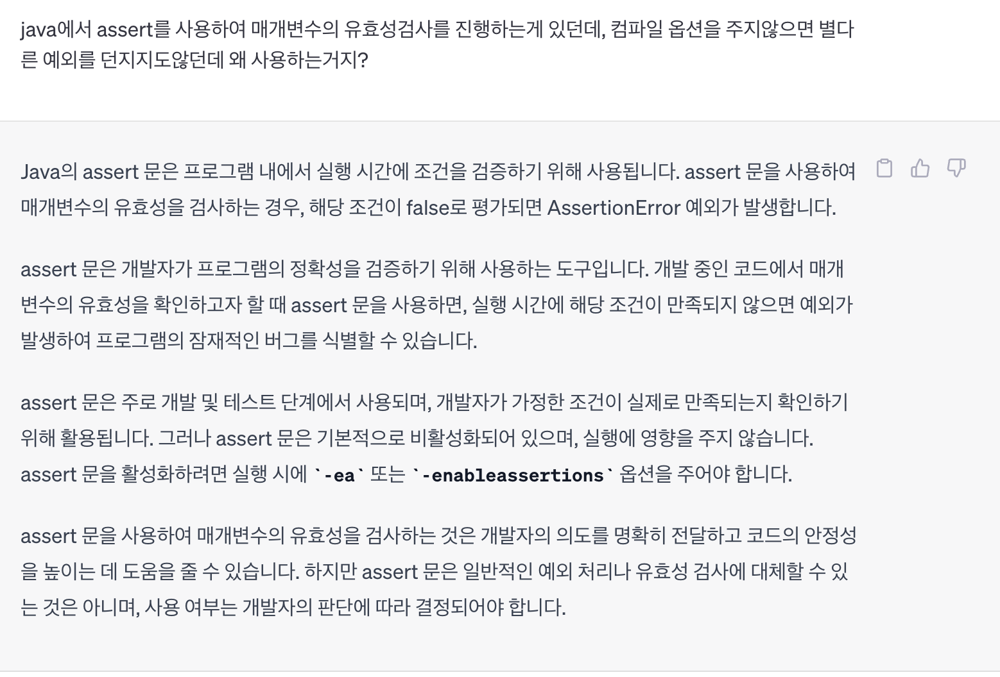
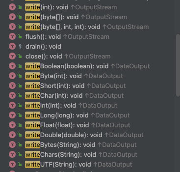
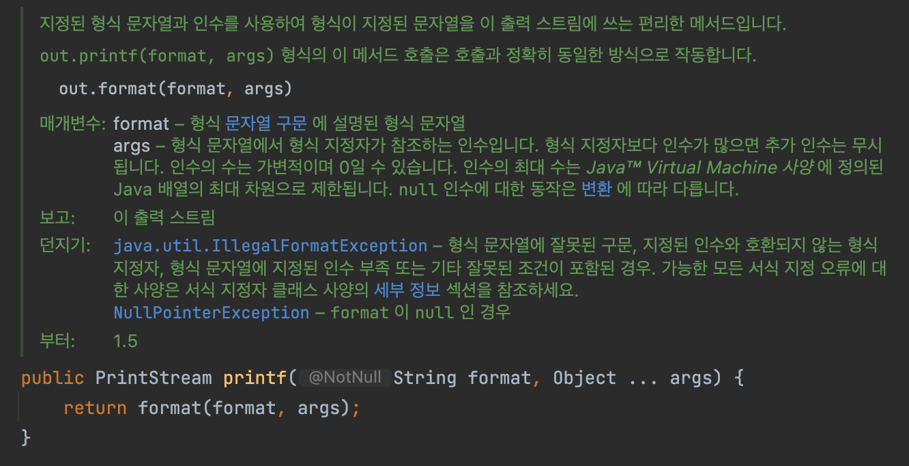
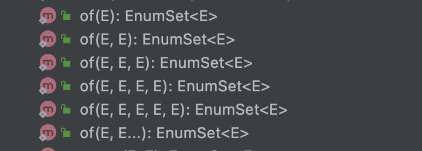

effective_java_메서드

- 아이템49_매개변수가 유효한지 검사하라
  - 매개변수의 값이 특정 조건을 만족하도록 **제약**이 필요하다면, 문서화하고 메서드 몸체가 본격적으로 특정 작업을 수행하기전에 검사를 해야한다!
    - 메서드 몸체 실행전 매개변수검사를 제대로 수행하지못하면 생길수있는 side effect?
      - 메서드가 수행되는 중간에 모호한 예외를 던질수있음
      - 메서드가 잘 수행되지만 잘못된 결과 반환
      - 메서드는 문제없이 수행됐지만, 어떤 객체를 이상한 상태로 만들어놓아서 미래의 알수 없는 시점에 이 메서드와는 관련 없는 오류를 뱉음 (최악)
  - public과 protected 메서드는 매개변수 값이 잘못됐을 때 던지는 예외를 문서화하자 (@throws 자바독 태그를 사용)
    - 보통은 IllegalArgumentException, IndexOutOfBoundsException, NullPointerException 중 하나가 될것
    - 클래스 레벨에서 공통으로 사용되는 예외는 클래스 레벨에 정의해놓자
  - 자바7의 java.util.Objects.requireNonNull 메서드를 활용하여 null 검사를 하자~
  - 공개되지 않은 메서드라면, assert(단언문)를 사용해서 매개변수 유효성을 검증하자
    - 사용방법
      ```java
        static void methodWithAssert(int i) {
        // if(1==1) throw new AssertionError("test"); // 이렇게쓰면 바로 예외던짐. 즉, AssertionError를 명시적으로 선언하면 정상적으로 예외던진다..

            assert i > 0; // assert뒤에가 false이면 AssertionError를 던지는데, VM option으로 -ea를 붙여주어야만 AssertionError를 던진다.

            System.out.println("메서드 수행");
        }

        public static void main(String[] args) {
            methodWithAssert(-3);
        }
      ```
    - 굳이 jvm 옵션을 넣어주어야 assert 에서 예외를 던지는데 왜쓰나?
      - 챗GPT 답변
        - 
        - 개발자의 의도를 명확히 전달하고 코드의 안정성을 높이는 데 도움을 줌으로써 개발자가 개발하는 과정에서 실수를 줄일수 있다. 하지만 assert문으로 일반적인 예외처리나 유효성 검사를 대체할수 있는것은 아니다!! 즉, 개발시에 개발의 버그를 빨리 발견할 수 있도록 도와주는 정도라고 생각하면될듯?
  - 생성자 매개변수의 유효성 검사도 꼭 잘 실행하자!
    - 클래스 불변식을 어기는 객체가 만들어지지않게 하는데 꼭 필요하다! 
  - 매개변수 유효성 검사해야 한다는 규칙의 **예외**
    - 유효성 검사 비용이 지나치게 높거나 실용적이지 않을때
    - 계산 과정에서 암묵적으로 검사가 수행될 때
      - ex. Collections.sort(List) 에서 매개변수 List의 대상들이 비교가능한놈들인지 유효성 검사를 하지않는데, 이는 실제 객체간 비교하는 계산과정에서 타입이 맞지않으면 예외를 던지기때문
  - 결론
    - 메서드가 건네받은 값으로 메서드가 수행하고자하는 바를 행할수 있도록 하는 (최소한의)제약을 사용하자. 메서드는 최대한 범용적으로 설계되어야한다!
  - 기타 팁
    - @Nullable 애너테이션은 표준은 아님

---

- 아이템50_적시에 방어적 복사본을 만들라
  - 프로그래밍은 항상 클라이언트가 내가 만든 클래스의 불변식을 깨뜨리려 혈안이 되어있다고 가정하고 방어적으로 만들어야한다
    - 의도적으로 보안을 뚫으려나 시도도 있지만, 평범한 프로그래머의 실수로 클래스 오작동을 할 수 있기때문
    - 그래서 적절하지않은 클라이언트로부터 클래스를 보호하는데 시간을 투자하는게 좋다
  - 어떻게 방어적으로 만드나?
    - 클래스의 구성을 불변으로! (이렇게 만들면 방어적 복사를 할 일이 거의 없어진다~)
      - ex. Period 클래스 내부에 startDate와 endDate를 `Instant`를 사용해서만든다(혹은 `ZonedDateTime`이나 `LocalDateTime`도 괜춘)
    - 어쩔수 없이 가변으로 구성되어있는 클래스는?
      - 방어적 복사(defensive copy)를 수행하자!
        - 생성자에서 받은 가변 매개변수 각각을 복사
          - 참고로 방어적 복사본을 만들기전에 유효성 검사를 수행하는것이아닌, **방어적 복사본을 만든 이후 유효성 검사를 수행하여야한다!**
            - 복사본을 만드는 찰나의 취약한 순간에 다른 스레드가 원본 객체를 수정할 위험이 있기때문
          - 또한, 매개변수가 제3자에 의해 확장될 수 있는 타입이라면(ex. final 선언안되어있는 클래스) 방어적 복사본을 만들때 clone사용하지마라
          - ex. 
            ```java
                public Period(Date start, Date end) {
                    this.start = new Date(start.getTime()); // Date의 clone을 사용하지않았다. 이는 Date가 final이 아니기에 클라이언트가 악의적으로 하위클래스에 clone을 오버라이딩하여 기존 Date를 참조하도록 만든걸 넘길수 있기때문..
                    this.end = new Date(end.getTime());

                    if(this.start.compareTo(this.end) > 0) // 방어적 복사본을 먼저만들고 유효성 검사
                        throw new IllegalArgumentException("start가 end보다 늦음");
                }
            ```
        - 클래스에서 가변 필드를 반환해야할때에도 방어적 복사본을 만들어주자
          - 생성자에서 가변 매개변수를 방어적으로 복사했다면, 가변필드 반환해줄때 clone을 사용해도 괜춘
            - but!! 인스턴스를 복사하는데는 일반적으로 생성자나 정적팩터리를 써라! 훨씬 이점이 많다!(아이템13 참고)
          - ex.
            ```java
                public Date start() {
                    return new Date(start.getTime());
                }

                public Date end() {
                    return end.clone(); // 생성자에서 new Date로 생성을 하기때문에, clone을 사용해도 안전!
                }
            ```
      - 단순 불변 객체를 만들기 위해서뿐 아니라, 클라이언트가 제공한 객체의 참조를 내부의 자료구조에 보관해야할때면 내부 자료구조의 불변식 유지를 위해서 전달받은 객체를 복사해야할 수 있다
        - ex. 건네받은 객체를 Map의 key로 저장하거나 Set에 저장했을때, 외부에서 해당 객체를 변경하게되면 Map의 key나 Set의 불변식이 중복된 값으로 인해 깨어질 수 있다
        - 내부 객체를 클라이언트에 건네주기 전에 방어적 복사본 만드는것도 마찬가지이유..
          - ex. 배열을 넘겨줘야한다면 clone을 호출하여 방어적 복사를 수행하던지, 불변 뷰(`Collections.unmodifiableList(Arrays.asList(배열))`)를 반환
      - 그럼 방어적 복사는 단점이 없나?
        - 방어적 복사는 성능저하가 따른다
          - 그렇기때문에 복사비용이 너무 크거나 클라이언트가 그 요소를 잘못 수정할 일이 없다고 신뢰한다면 **문서화를 통해서** 방어적 복사를 안되어있으니 어떻게 사용해야하는지, 그리고 해당 요소를 클라이언트가 수정했을시 책임이 클라이언트에 있음을 반드시 남겨놓아야한다!
          - 방어적 복사 생략해도 되는 상황?
            - 같은 패키지에 속하는 등의 이유로 호출자가 컴포넌트 내부를 수정하지 않으리라 확신할때
            - 메서드나 생성자의 매개변수로 넘기는 행위가 그 객체의 통제권을 명백히 이전함을 뜻할때
              - 하지만, 통제권을 넘긴것을 결국 취약점이 발생할수 있는 구간이기때문에, 클래스와 클라이언트가 상호 신뢰할수잇을때
              - 불변식이 깨지더라도 그 영향이 오직 호출한 클라이언트로 국한될때만 사용하자
                - ex. 래퍼 클래스 특성상 클라이언트는 래퍼에 넘긴 객체에 여전히 직접 접근할 수 있게되어, 래퍼의 불변식을 파괴할 수 있긴하지만 그 영향을 오직 클라이언트 자신만 받게 된다. (BufferedInputStream 같은 경우 데코레이터 패턴을 사용한 래퍼 클래스의 대표적인 예시인데, 말 그대로 InputStream에 성능을 위해 만들어진 래퍼 클래스이기때문에 InputStream에 직접접근하여 BufferedInputStream의 불변식을 파괴한다할지라도 영향가는건 클라이언트 자신뿐.. )
            - => 물론 이 생략의 전제는 문서화를 해야한다는 것!!!
  - 기타 팁
    - Date는 낡은 API 이다.. 가변이기도하고 날짜 표현하는데 Zone 지정도 없는것 등 부족한부분이 많음.. 날짜관련 개발을 진행한다면 Date 사용하지말자

---

- 아이템51_메서드 시그니처를 신중히 설계하라
  - 메서드 이름을 신중히 짓자!
    - 표준명명규칙을 따르자
    - 같은 패키지에 속한 다른 이름들과 일관되게 짓는게 최우선
    - 그리고 개발자사이에서 널리 받아들여지는 이름을 사용
      - 애매하면 자바라이브러리의 API 가이드를 참고하자
  - 편의 메서드를 너무 많이 만들지마라
    - 메서드가 너무 많은 클래스는 익히고, 사용하고, 문서화하고, 테스트하고, 유지보수하기 어려움
    - 인터페이스도 너무 많은 메서드가있으면 사용하거나 구현하기가 참 어렵..
    - API의 public 메서드로 빼는것은 애매하면 일단 만들자가 아니라, 만들지마라
  - 매개변수 목록은 잛게 유지하자
    - 4개이하!
    - 특히나 같은 타입 매개변수 여러개 연달아 나오는것은 더욱 안좋음 (헷갈리고 컴파일에러도 내기어려움..)
    - 긴 매개변수 목록을 짧게 줄여주는기술
      1. 여러 메서드로 쪼갠다
         - 잘못하면 메서드가 너무 많아질 수 있으나, 직교성을 높여 오히려 메서드 수를 줄여주는 효과도 있다
         - ex. List 에서 부분List의 인덱스를 찾을때, `indexOfSublist(부분List의 시작, 부분List의 끝, 찾을 원소)` 이런 메서드를 제시하지않고, subList를 반환하는 메서드(`List.subList(부분List의시작, 부분List의 끝)`)를 통해서 subList를 제공하는데, 이를 통해서 부분List(List)의 indexOf메서드를 활용해서 구할 수 있다
      2. 매개변수 여러개를 묶어주는 도우미 클래스를 만들자
         - 매개변수 몇개를 독립된 하나의 개념으로 볼수 있을때 적절 (ex. 카드게임을 클래스를 만들때 메서도 호출시 카드의 숫자와 무늬를 각각의 매개변수로 전달하는게 아닌, 하나의 클래스로 전달하는게 좋다)
         - 정적 멤버 클래스(정적 중첩 클래스)로 이런 도우미 클래스를 보통 만든다~
      3. 앞서 두 기법을 혼용
         - 객체 생성에 사용한 빌더 패턴을 응용한것
         - 매개변수가 많을때, 일부는 생략해도 괜찮을때 사용하면 유용
         - HOW?
           - 모든 매개변수를 하나로 추상화한 객체를 정의하고 클라이언트에서 이 객체의 setter를 통해 필요한 값을 설정
           - 클라이언트가 execute 메서드를 호출해 앞서 설정한 매개변수들의 유효성을 검사 
             - <span style="color:red">클라이언트가 execute를 실행하는게 맞나???<span>
           - 설정 완료된 객체를 넘겨 원하는 계산을 수행
  - 매개변수의 타입으로는 클래스보다 인터페이스가 더 낫다
    - 인터페이스를 사용하면, 여러 구현체를 받을 수 있다
    - 또한, 특정 구현체로 한정하였을때 혹시라도 입력 데이터가 다른 형태였다면 해당 구현체로 복사해야하는 비용을 줄일 수도 있다
  - boolean 보다는 원소 2개짜리 열거 타입이 낫다
    - 단, 메서드 이름상 boolean을 받아야 의미가 더 명확할때는 예외
    - 열거 타입을 사용하면 코드 읽기도 더 좋고, 나중에 확장하기도 좋다
    - 또한 각 상수마다 동작을 정의할수도 있으니 더좋음~
  - 기타 팁
    - 직교성이란?
      - 직교는 수학에서 온 용어로 서로 직각을 이루어 교차하는것을 의미
      - 이를 소프트웨어에서 가져와, "직교성이 높다"는것은 "공통점이 없는 기능들이 잘 분리되어있다" 혹은 "기능을 원자적으로 쪼개 제공한다" 로 해석할 수 있음
        - ex. List의 "부분List 얻는것"과 "원소의 인덱스 구하는것"은 서로 관련이 없다. 그렇기에 두 기능을 개별 메서드로 제공해야 직교성이 높다고 할 수 있다
      - 직교성은 어쨌든 상호 관련이 없는 기능을 메서드로 쪼개는것이라면, 메서드 수를 줄여주는 효과가 있을거라는 것은 어떤의미?
        - 기능 3개로 조합할 수 있는 기능은 총 일곱가지인데, 편의 성을 높인다는 생각에 고수준의 복잡한 기능을 하나씩 추가하다보면 갑작스레 커진 API가 만들어 질 수 있다.
        - 즉, 독립적으로 다른 기능들을 쪼개어 재사용을 할 수 있게된다면(List예제 처럼) 기능의 조합이 필요할때마다 새로 만드는게 아닌 재사용을 하여 오히려 메서드 수를 줄여줄 수 있다
      - 그렇다고 무한정 작게 나누는게 꼭 능사는 아님
        - 사용자가 다루는 개념의 추상화 수준에 맞게 조절해야하고,
        - 특정 조합의 패턴이 상당히 자주 사용되거나 최적화하여 성능을 크게 개선할 수 있다면 직교성이 낮아지더라도 편의기능으로 제공필요
      - => 직교성을 절대적인 가치라기보다는, 철학과 원칙을 가지고 일관되게 적용하는게 중요!

---

- 아이템52_다중정의는 신중히 사용하라
  - **어느 메서드를 호출할지는 컴파일타임에 결정된다!** (컴파일 타임에 결정된다는것은 실제 생성된 인스턴스의 타입이 무엇이냐는 상관없다는 말.. 반대로 런타임에 결정된다는것은 실제 생성된 인스턴스의 타입을 신경쓴다는 말..)
    - 그래서 다중정의시 부모자식간의 관계에 있는 매개변수타입이라면, 오버라이딩때 기대하던대로 동작하지 않을 수 있다
      - 오버라이딩은 하위타입 인스턴스를 생성하고 상위타입으로 선언되어있더라도, 런타임시에 알아서 오버라이딩된 하위타입의 메서드를 호출해준다..
        - **오버라이딩 메서드는 동적으로 선택된다** (**오버로딩한 메서드는 정적으로 선택**)
      - 이에 대한 해결책..
        - 가장 상위타입을 매개변수타입으로 놓고, `instanceof` 를 활용하여 분기를 태워 적절한 동작을 수행
  - 그래서 다중정의는 혼동을 일으킬 수 있기때문에, 피할 수 있으면 피해야한다
    - 특히, 가변인수를 사용하는 메서드라면, 다중정의를 아예하지 말아야한다
    - 대안
      - 메서드 이름을 아예 다르게 만들자!
      - 좋은예: 
        - ObjectOutputStream
          - 다중정의보다, 메서드에 이름을 다르게 지음(write)
          - 
  - 그럼 생성자는 어떻게?
    - 생성자는 이름을 다르게 지을수는 없으니, 정적 팩터리를 활용하자
    - 무튼 그래도 여러 생성자가 같은 수의 매개변수를 받을 경우 어떡하나?
      - 매개변수 중 하나 이상이 "근본적으로 다르다(radically different)" 면 문제될게 없음
        - 근본적으로 다르다는것은 두 타입의 (null이 아닌)값을 서로 어느 쪽으로든 **형변환 할 수 없다**는 것!
        - 참고
          - Object 외의 클래스 타입과 배열타입은 근본적으로 다르다
          - Serializable과 Cloneable 외의 인터페이스 타입과 배열타입도 근본적으로 다르다
          - => 배열은 Object의 하위타입이고, Serialiable과 Cloneable 의 구현체인듯
      - 형변환 할 수 없으면, 기대와다른 메서드로 갈 일이 없다..
      
  - 다중정의로 인한 혼란 예시
    - java5의 오토박싱으로인한 다중정의시 혼란
      - ex. List.remove(Object), List.remove(int)로 인한 혼란
        ```java
            Set<Integer> set = new TreeSet<>();
            List<Integer> list = new ArrayList<>();

            for (int i = -3; i < 3; i++) {
                set.add(i);
                list.add(i);
            }

            //  for (int i = 0; i < 3; i++) { // 이렇게하면 list는 -2,0,2 남음
            //      set.remove(i);
            //      list.remove(i);
            //  }

            for (Integer i = 0; i < 3; i++) { // 이렇게해야 -3, -2, -1 남는다..
                set.remove(i);
                list.remove(i);
            }

            System.out.println("set: "+set);
            System.out.println("list: "+list);

            // List의 remove가 int를 받는것과 Object를 받는것으로 다중정의되어있기때문에 혼란스러움.....
        ```
    - 자바 8에서 도입한 람다와 메서드참조로 인한 다중정의시 혼란
      - 참조된 메서드와 호출한 메서드 양쪽 다 다중정의시 컴파일 에러..
        - 참고로 다중정의해소(resolution: 적절한 다중정의 메서드를 찾는 알고리즘) 라는 복잡한 동작이 다중정의된 메서드를 찾을때 수행된다함..
        ```java
          new Thread(System.out::println).start(); // 문제없음
          // Thread에는 Runnable밖에 없기때문에 문제없음
          
          // Executors.newCachedThreadPool().submit(System.out::println); // 컴파일 에러
          // submit(호출한 메서드)도 다중정의되어있고, println(참조한메서드)도 다중정의되어있기때문에 컴파일러가 제대로 못찾음..(다중정의 메서드 찾는 알고리즘수행한다함..)

          Runnable r = System.out::println;
          Executors.newCachedThreadPool().submit(r); // 이건 가능. 아마 정확하게 Runnable로 명시하기때문에 문제없는듯함 
        ```
      - **메서드를 다중정의할때, 서로 다른 함수형 인터페이스도 같은 위치의 인수로 받아서는 안된다!!**
        - 즉, 서로 다른 함수형 인터페이스라도 서로 근본적으로 다르지않다는것! (연관이 있으니, 컴파일러가 제대로 못찾겠지..)
        - ex. submit(Callable), submit(Runnable)
    - 그래도 다중정의를 써야겠다면?
      - 어떤 다중정의 메서드가 불리는지 몰라도, 기능이 똑같다면 신경쓸게 없음!
        - 이렇게하는 가장 일반적인 방법은 상대적으로 더 특수한 다중정의 메서드에서 덜 특수한(더 일반적인) 다중정의 메서드로 일을 넘겨버리는것(forward)
      - 좋은예
        - String.contentEquals
        ```java
          // String class 내부
          public boolean contentEquals(StringBuffer sb) {
              return contentEquals((CharSequence)sb); // 더 일반적인 오버로딩 메서드를 호출
          }

          public boolean contentEquals(CharSequence cs) {
             // ...
          }
        ```
      - 안좋은예
        - String.valueOf(char[]) 와 String.valueOf(Object)
        ```java
          // 아래 두개는 다르게 동작한다.. 다중정의 사용의 혼란으로 인한 예..
          Object obj = null;
          String s1 = String.valueOf(obj);
          System.out.println(s1); // null

          char[] chars = null;
          String s2 = String.valueOf(chars); // NullPointerException
          System.out.println(s2);

          /////////////////////////////////////
          // String class 내부를 보면, 하는일도 다름..
          public static String valueOf(Object obj) {
              return (obj == null) ? "null" : obj.toString();
          }

          public static String valueOf(char data[]) {
              return new String(data);
          }
        ```
  
  - 결론
    - 매개변수의 갯수가 같을때, 다중정의는 될 수 있으면 피하라 (메서드 이름달리해~)
    - 생성자는 이를 따르기 쉽지않을 수 있으니..
      - 형변환을해서 정확한 메서드(혹은 필요에 맞는 동작)를 선택할 수 있도록 해야한다
      - 또는 같은 객체를 입력받는 다중 정의 메서드들이 모두 동일하게 동작하도록 만들어야한다!(위의 `String.contentEquals` 참고)

---

- 아이템53_가변인수는 신중히 사용하라
  - 가변인수(varargs)메서드는 명시한 타입의 인수를 0개 이상 받을 수 있다
  - 가변인수 메서드를 호출하면, 인수의 개수와 길이가 같은 **배열을 만들고**, **인수들을 이 배열에 저장**하여 가변인수 메서드에 건네준다
  - 예제
    ```java
      static int sum(int... args) {
          int sum = 0;
          for (int arg : args) {
              sum += arg;
          }
          
          return sum;
      }
    ```
  - 인수가 필수적으로 1개 이상일때는 어떻게?
    - 매개변수2개 받도록 하면됨
      - 첫번째로는 평범한 매개변수, 두번째는 가변인수를 받으면된다
      ```java
        static int min(int firstArg, int... remainingArgs) {
            int min = firstArg;
            for (int remainingArg : remainingArgs) {
                if (min > remainingArg) {
                    min = remainingArg;
                }
            }
            
            return min;
        }
      ```
  - 자바에서 가변인수를 활용한 대표적인 예
    - printf
      - 
    - 리플렉션
  - 성능에 민감한 상황이라면?
    - 가변인수 호출시에는 배열을 계속 새롭게 만들기때문에 성능에 좋지않다
    - 이때 최적화를 위해서 다중정의를 이용한다
      ```java
        public void foo() {}
        public void foo(int a1) {}
        public void foo(int a1, int a2) {}
        public void foo(int a1, int a2, int a3) {}
        public void foo(int a1, int a2, int a3, int... rest) {}
      ```
    - 예시
      - EnumSet.of
        - 

---

- 아이템54_null이 아닌, 빈 컬렉션이나 배열을 반환하라
  - 컬렉션이나 배열같은 컨테이너가 비었을때, null을 반환하는 메서드를 사용할 떄면 항시 클라이언트는 null체크와같은 방어코드를 넣어주어야한다
  - 일반적으로 빈 컬렉션을 리턴하는방법
    - ex. list 컨테이너를 요소로 가졌을때 List 반환 예
      ```java
        public List<Cheese> getCheeses() {
          return new ArrayList<>(cheeseInStock); // cheeseInStock은 List<Cheese>. cheeseInStock이 empty이면 ArrayList가 새로이 생성은되나, 내부적으로 비어잇는 배열을 가지고있는다(이 배열은 static으로 가지고있음. 아래 arrayList와 arrayList2 참고)
        }

        // ArrayList를 새로 생성하긴하니.. 성능 최적화를 위해서는 아래와같이 Collections에서 제공하는 "불변 컬렉션"을 반환
        public List<Cheese> getCheeses_성능최적화() {
          return cheeseInStock.isEmpty() ? Collections.emptyList() : new ArrayList<>(cheeseInStock); 
        }

        ////////////////////////
        // Collections.emptyList는 불변컬렉션이자 항상 동일한 빈 List를 반환
        List<String> emptyList = Collections.emptyList();
        List<String> emptyList2 = Collections.emptyList();
        System.out.println(emptyList == emptyList2); // true

        // ArrayList에 빈 list를 매개변수로 전달하면, 항상 동일한 elementData를 가진다
        ArrayList<String> arrayList = new ArrayList<>(emptyList);
        ArrayList<String> arrayList2 = new ArrayList<>(emptyList);
        // arrayList.elementData와 arrayList2.elementData는 동일한 배열을 가리킨다
      ```
  - 배열은 null대신 길이가 0인 배열을 반환하라~
    - 보통은 단순히 정확한 길이의 배열을 반환하면 되는데, 요소가 없을때는 길이가 0인 배열을 반환하면 되는것뿐..
    - ex. list 컨테이너를 요소로 가졌을때 배열 반환 예
      ```java
        static class ListWrapper {
            List<String> list = new ArrayList<>();
            private static final String[] EMPTY_ARRAY = new String[0];

            public String[] toArray일반() {
                return list.toArray(new String[0]); // 이렇게 되면 항상 내부적으로 전달받은 배열을 사용하는게 아닌, 새로운 배열을 생성하게됨. 즉, 저기서 길이 0짜리 배열을 전달해주는것은 우리가 원하는 반환 타입을 알려주는 역할정도라고 생각하면됨 (만약 list size가 0이면 매개변수로 전달한 new String[0] 그대로 전달해줌).
            }

            public String[] toArray최적화() {
                return list.toArray(EMPTY_ARRAY); // 성능 최적화를 위해 new String[0]을 계속 만들지않고 정적변수로 관리..
            }

            public String[] toArray최적화아님() {
                return list.toArray(new String[list.size()]); // 최적화가 안된다함.. 그냥 new String[0]을 파라미터로 넘겨주어 새로 배열만드는게 더 성능상 좋은듯..
            }
        }

        ///////////////////////
        // ArrayList.toArray 테스트
        List<String> list = new ArrayList<>() {{
            add("a");
            add("b");
        }};

        String[] emptyStringArr = new String[0];
        String[] array = list.toArray(emptyStringArr);
        System.out.println(array == emptyStringArr); // false => list의 요소 수보다 배열의 크기가 더 작기때문에 새로운 array 만들어서 반환

        String[] emptyStringArr2 = new String[10];
        String[] array2 = list.toArray(emptyStringArr2);
        System.out.println(array2 == emptyStringArr2); // true => list의 요소 수보다 배열의 크기가 더 크기때문에 전달받은 배열 사용 (이게 성능이 별로라함..)


        /////////////////////////
        // ArrayList 내부
        public <T> T[] toArray(T[] a) {
            if (a.length < size)
                // Make a new array of a's runtime type, but my contents:
                return (T[]) Arrays.copyOf(elementData, size, a.getClass());
            System.arraycopy(elementData, 0, a, 0, size);
            if (a.length > size)
                a[size] = null;
            return a;
        }
        ////////////////////////

      ```
  - 결론
    - null을 반환하지마라. 빈 배열이나 빈 컬렉션을 반환해라.. null을 반환하면 사용자는 이를 처리해야하는 코드를 별도로 만들어야하고, 성능이 좋은것도 아니다..
  - 기타 팁 
    - **최적화가 필요하다고 판단되면, 수정전과 후의 성능을 반드시 측정하고 실제로 성능이 개선되는지 확인하자!!**