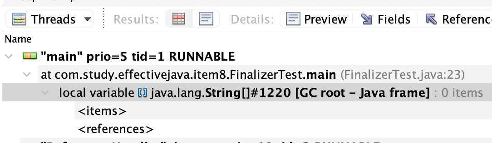
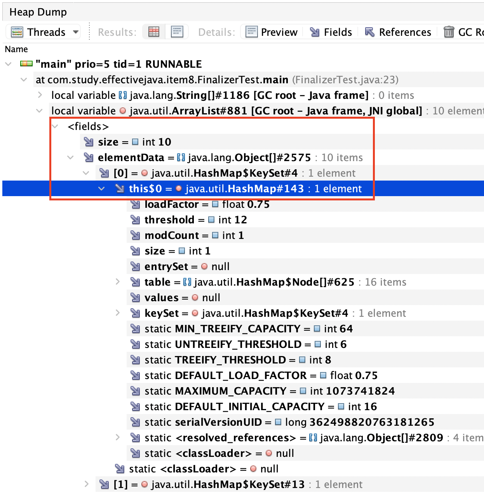

effective_java_객체생성과파괴

- 아이템1_생성자대신 정적 팩토리 메서드를 고려하라
  - 정적 팩토리 메서드 : 클래스의 인스턴스를 반환하는 단순한 정적 메서드
    - 장점
      - 이름을 가질수 있다
        - 이를 통해 반환될 객체의 특성을 설명하기좋음 (그냥 생성자는 어렵..)
        - 시그니처가 같은 생성자가 여러개 만들어질 것 같으면, 정적팩토리 메서드로 바꾸고 각각의 차이를 잘 드러내줄 이름을 사용하자
      - 호출될 때마다 인스턴스를 새로 생성하지는 않도록 할 수 있다
        - 인스턴스를 미리만들어놓거나, 새로 생성한 인스턴스를 캐싱하여 사용하도록 구성가능
        - 인스턴스 통제 클래스로 만들수 잇음
          - 인스턴스 통제 클래스 : 언제 어느 인스턴스를 살아 있게 할지를 통제가능한 클래스
          - 활용
            - 싱글턴
            - 인스턴스화 불가 (Ex. util성 클래스)
            - 플라이웨이트패턴의 근간
            - 열거타입(enum)
              - *열거타입은 인스턴스가 하나만 만들어짐을 보장!*
      - 반환 타입의 하위 타입 객체를 반환 할 수 있음
        - Collections의 유틸클래스 하나로, 수정불가나 동기화 등의 기능을 덧붙인 총 45개의 유틸리티 구현체를 제공해줄수 있도록 활용
        - 명시한 인터페이스대로 동작하는 개체를 얻을 것임을 알기에 굳이 별도 문서를 찾아가며 실제 구현체가 어떻게 되는지 찾을 필요없다! (사용자는 인터페이스로만 다루게 된다)
        - 자바 8부터는 인터페이스로 정적팩토리를 만들수있기에 인터페이스에서 설계하자!
          - 그러나 인터페이스에 정의된 정적메서드는 package-private을 허용하지않기때문에, 접근범위가 package-private이라면 여전히 동반클래스(ex. Collections 클래스)에 두어야할수도 있다 
      - 입력 매개변수에 따라 매번 다른 클래스의 객체를 반환 가능
        - EmumSet과 같은경우 생성자 없이 정적 팩터리 메서드만 제공하는데, 원소갯수에따라 다른 구현체를 반환한다.. 사용자는 EnumSet을 사용하는데 있어서 이런 내용을 알지도못하고 알 필요도 없다. 
        - 그에 따라 다음 개선된 릴리즈때에는 또 다른 EnumSet의 구현체를 제공할 수 있다.
      - 정적 팩터리 메서드를 작성하는 시점에는 반환할 객체의 클래스가 존재하지 않아도 된다
        - 이 유연함은 서비스 제공자 프레임워크 (service provider framework) 를 만드는 근간이됨
          - 클라이언트에게 필요한 구현체를 전달해주는데, 프레임워크가 이를 통제하여서 구현체로부터 분리할수 있게해준다
          - 핵심 컴포넌트
            - 서비스 인터페이스: 구현체의 동작을 정의하는 인터페이스 (팩토리 메서드 통해서 받은 리턴타입)
            - 제공자 등록 API: 제공자가 구현체를 등록할때 사용하는 api
            - 서비스 접근 API: 클라이언트가 서비스의 인스턴스를 얻을때 사용하는 api (팩토리 메서드)
            - 서비스 제공자 인터페이스: 서비스 인터페이스의 인스턴스를 생성하는 팩터리 객체를 설명
              - => 서비스 인터페이스를 생성하는 로직들이 있기때문에 이렇게 이야기하는듯!
          - 서비스 제공자 프레임워크의 여러 변형들
            - 브릿지 패턴
            - 의존 객체 주입 프레임워크
            - ServiceLoader
          - ex. JDBC(Java Database Conectivity)
          ```java
                    Class.forName("com.mysql.cj.jdbc.Driver"); // 클래스 로드
                    /*
                    // 로드시 아래와 같은 초기화 진행

                    com.mysql.cj.jdbc.Driver 소스중 일부

                    static {
                        try {
                            java.sql.DriverManager.registerDriver(new Driver()); // 1
                        } catch (SQLException E) {
                            throw new RuntimeException("Can't register driver!");
                        }
                    }

                    ...

                    1. 여기서 DriverManager.registerDriver는 "제공자 등록 API"
                        그리고 자기자신의 인스턴스를 파라미터로 제공해주는데, 이 Driver가 "서비스 제공자 인터페이스"이며, 이때 만들어지는 Driver 구현체가 벤더사마다 만들어지게된다
                        그리고 Driver를 통해서 실질적인 Connection이 만들어지나, 사용자는 이 Driver를 직접 접근하거나 알 필요가없다.
                    */

                    Connection connection = DriverManager.getConnection("url", "user", "password");
                    /*
                    DriverManager.getConnection "서비스 접근 API".
                    Connection은 "서비스 인터페이스" 이다. Connection을 만들기위해서는 위의 Driver 구현체를 통해서 만들어지기때문에 각 벤더사의 Driver가 필수적이며,
                    여러 Driver들이 등록될 수 있기때문에 url에 따라 적절한 driver의 Connection을 전달해준다.
                    driver.connect() 를 통해서 Connection을 리턴해주는데, 인터페이스를 리턴해주기때문에, 내부적으로 하나의 Connection의 구현체들(SINGLE_CONNECTION 용, FAILOVER_CONNECTION 용, REPLICATION_CONNECTION 용)을 용도에 맞게 커넥션 구현체들을 리턴해준다

                    벤더사가 바로 Connection을 만들어서 등록할 수도 있겠지만(확장은 프록시 적절하게 사용하여..), Driver 라는 서비스 제공자 인터페이스를 둠으로써 서비스 제공자 프레임워크에서 필수적으로 필요로 하는 정보들을 정의하도록 할 수 있다. 프레임워크로써 동작하기수월하도록..
                    */

                    Statement statement = connection.createStatement();
                    ResultSet resultSet = statement.executeQuery("select~~");

          ```
    - 단점
      - 정적 팩터리 메서드만 제공하면 하위클래스 생성불가 (생성자가 public이나 protected가 아니니깐..)
      - 정적 팩터리 메서드는 프로그래머가 찾기 어려움 (근데 이건 IDE 자동완성으로 커버가능할듯한데..)
        - 정적 팩터리 메서드에 흔히 사용하는 명명방식
          - `from` : 매개변수 하나 받아서 해당타입의 인스턴스 반환
          - `of` : 여러 매개변수를 받아 적합한 타입의 인스턴스를 반환
          - `valueOf` : `from`과 `of`의 더 자세한버전
          - `instance` 혹은 `getInstance` : 매개변수가 있다면 매개변수를 적절하게 사용한 인스턴스를 반환. 하지만 항상 같은 인스턴스임을 보장하지않는다 (같을수도 다를수도)
          - `create` 혹은 `newInstance` : 위와 같지만 항상 새로운 인스턴스 반환함을 보장
          - `get[Type]` : `getInstance` 와 같으나 생성할 클래스가 아닌 다른 클래스에 팩터리 메서드를 정의할 때 사용
            - `[Type]`은 팩터리 메서드가 반환할 객체의 타입
          - `new[Type]` : `newInstance` 와 같으나 생성할 클래스가 아닌 다른 클래스에 팩터리 메서드를 정의할 때 사용
          - `[Type]` : `get[Type]` 과 `new[Type]` 의 간결한 버전
      
  - 기타 팁
    - 메서드 시그니처
      - 메서드이름 + 파라미터
        - 리턴타입은 시그니처에 포함하지않는다!!
      - 메서드 시그니처를 기준으로 오버로딩이 된다
    - 플라이 웨이트 패턴?
      - 캐싱과 동일개념
      - 팩토리에서 인스턴스를 반환해줄때 팩토리에 저장되어있는 객체면 새로 생성하지않고, 기존에 저장되어있는것 반환. 그렇지않으면 새로생성하여 내부에 저장한뒤 반환
      - 참고사이트
        - https://velog.io/@hoit_98/%EB%94%94%EC%9E%90%EC%9D%B8-%ED%8C%A8%ED%84%B4-Flyweight-%ED%8C%A8%ED%84%B4
        - https://refactoring.guru/ko/design-patterns/flyweight
    - ServiceLoader?
      - https://velog.io/@adduci/Java-%EC%84%9C%EB%B9%84%EC%8A%A4-%EB%A1%9C%EB%8D%94ServiceLoader
    - 정적 팩터리를 사용하는게 유리한 경우가 많으므로 무작정 public 생성자를 제공하진말자!

---

- 아이템2_생성자에 매개변수가 많다면 빌더를 고려하라
  - 생성자 매개변수가 많아지면 클라이언트 코드를 작성하거나 읽기 어렵다
    - 값의 의미가 헷갈리고, 매개변수도 몇개인지 주의해서 세어보아야.. 타입도 많으면 헷갈려서 버그유발쉬움
  - 자바 빈즈 패턴
    - setter로 넣는것
    - 읽기는 쉬움..
    - but 객체 하나를 만들기 위해서는 메서드를 여러개 호출해야하고, 객체가 완전히 생성되기 전까지 일관성이 무너진상태가됨..
    - 또한 setter가 있기때문에 불변으로 만들수 없음.. 그래서 스레드 안전성을 얻으려면 프로그래머가 추가작업필요..
  - 빌더 패턴
    - 안전성 + 가독성
    - 빌더로 생성 과정
      1. 필수 매개변수만으로 생성자(혹은 정적 팩터리 - 보통 이렇게 쓰이는듯)를 호출해 빌더 객체 얻음
      2. 빌더 객체가 제공하는 일종의 세터 메서드들로 원하는 선택 매개변수들을 설정 (보통 메서드체이닝방식)
      3. 매개변수가 없는 build 메서드를 호출해 필요한 객체를 얻는다
    - 유효성검사?
      - 잘못된 매개변수를 빨리 발견할 수 있도록 빌더의 생성자와 메서드에서 입력 매개변수를 검사
      - build 메서드가 호출하는 생성자에서는 여러 매개변수에 걸친 불변식을 검사
        - ex. startDate 와 endDate의 유효성검사 (startDate <= endDate)
    - 활용
      - 계층적으로 설계된 클래스에 좋음
      - 추상클래스엔 추상빌더, 구체 클래스에는 구체빌더
      - 빌더 하나로 여러 객테를 순회하면서 만들수있고, 빌더에 넘기는 매개변수에 따라서 다른 객체를 만들도록가능. 
    - 매개변수가 4개 이상은 되어야 활용하는게 좋음!
  - 생성자나 정적 팩터리가 처리해야할 매개변수가 많다면, 빌더 패턴을 선택하자! 특히 매개변수중 다수가 필수가 아니거나 같은 타입이라면 특히나!
  - 기타 팁
    - 불변과 불변식
      - 불변: 어떠한 변경도 허용하지않는다는 뜻
        - ex. String 객체
      - 불변식: 프로그램이 실행되는 동안, 혹은 정해진 기간동안 반드시 만족해야하는 조건
        - 변경을 허용할 수는 있으나, 주어진 조건 내에서만 허용
        - ex. Period 클래스에서 start 필드의 값은 반드시 end 필드의 값보다 앞서야하는것..
      - => 가변객체에도 불변식은 존재할 수 있다! 크게보면 불변은 불변식의 극단적 예
    - 공변반환 타이핑 (covariant return typing)
      - 하위 클래스의 메서드가 상위 클래스의 메서드가 정의한 반환 타입이 아닌, 그 하위 타입을 반환하는 기능
        - 아래 시뮬레이트한 셀프타입 관용구와 맥락을 같이하는듯함
      - 이를 통해서 클라이언트가 형변환에 신경쓰지않고도 빌더 사용가능 
    - self 타입이 없는 자바를 위한 우회방법을 `시뮬레이트한 셀프타입 관용구`라고함 (simulated self-type)
       
---

- 아이템3_private 생성자나 열거 타입으로 싱글턴임을 보증하라
  - 싱글턴: 인스턴스를 오직 하나만 생성할 수 있는 클래스
    - 함수와 같은 무상태 객체
      - ex?
        - 람다?
    - 설계상 유일해야하는 시스템 컴포넌트
      - ex?
    - 클래스가 싱글턴으로 만들어지면 테스트가 어려워진다.. (mock으로 만들기가 여러우므로..)
    - 만드는방식?
      - `public static final` 필드 방식의 싱글턴 (정적 멤버가 필드)
      ```java
      class Elvis {
          public static final Elvis INSTANCE = new Elvis();
          private Elvis() {}
          public void doSomething() {
            //...
          }
      }
      ```
        - 간결하다! 
        - 싱글턴임이 명확하게 API에서 보여진다
      - 정적 팩토리 방식 (정적 멤버가 메서드)
      ```java
      class Tom { // 정적 팩토리 메서드를 제공
          private static final Tom INSTANCE = new Tom();
          private Tom() {}

          public static Tom getInstance() { return INSTANCE; }

          public void doSomething() {
              //...
          }
      }
      ```
        - 마음 바뀌면 코드 안바꾸고 싱글턴이 아니게 만들 수 있음
        - 정적 팩터리를 제네릭 싱글턴 팩토리로 만들수 있다는점
        - 정적 팩터리의 메서드 참조를 공급자로 사용가능
          - ex. `Supplier<Tom> = Tom::getInstance`
        - => 굳이 이런 장점이 필요하지않다면 첫번째로하라!
      - 열거타입 방식
      ```java
      enum Jeremy {
          INSTANCE;

          public void doSomething() {
              // ...
          }
      }
      ```
        - 매우 간결. 추가 노력없이 직렬화 가능
        - 리플렉션 공격에서도 제2의 인스턴스가 생기는 일을 완벽히 막아준다함..
        - ***대부분 상황에서는 원소가 하나뿐인 열거타입이 싱글턴을 만드는 가장 좋은방법이라함!***
        - Mock은 어떤식으로 만드는게좋을까?
  - 기타 팁 
    - 만드는 방식 1번과 2번은 직렬화시에 아래와 같이 진행해야함..
      ```java
      class TomSerialization implements Serializable {
          private static final TomSerialization INSTANCE = new TomSerialization();
          private transient String instanceField; // 1
          private TomSerialization() {}

          public static TomSerialization getInstance() { return INSTANCE; }

          public void doSomething() {
              //...
          }

          private Object readResolve() { // 2
              return INSTANCE;
          }
      }

      1. transient필요.. 직렬화시에 제외해야할 변수에는 transient 사용
      2. 역직렬화할때 새로운 인스턴스가 계속 만들어진다 (readObject 가 내부적으로 역직렬화시에 계속 새로운 인스턴스를 만들어준다.    
        이를 해결하기위해서 readResolve 가 필요한데, 해당 메서드가 있으면 여기서 리턴해주는 값을 사용하게된다.     
        readObject를 통해서 만들어진 객체는 GC에 의해서 사라지게되고 결국 readResolve가 전달해준 인스턴스만 남게된다!
      ```
    - [객체 직렬화시 readResolve와 readObject](https://madplay.github.io/post/what-is-readresolve-method-and-writereplace-method)
    - 리플렉션 공격??

---

- 아이템4_인스턴스화를 막으려거든 private 생성자를 사용하라
  - 정적메서드와 정적 필드만을 담은 클래스를 만드는경우
    - 특정 인터페이스를 구현하는 객체를 생성해주는 정적 메서드(혹은 팩터리)를 모아놓기도함
      - ex. Collections
      - 자바 8부터는 인터페이스에 정적메서드를 활용하여 사용가능 (default와 다름.. default는 그냥 해당 인터페이스 기반 사용가능한 구현된 메서드)
    - final 클래스와 관련한 메서드들을 모아놓을때도 사용 
      - final 클래스는 상속불가하고 이에따라 클래스를 확장하는것이 어렵기때문에, 이를 우회하기위해서 유틸리티 클래스를 만들어 final로 정의된 클래스를 사용 (클래스를 Wrapping하여 확장하기 좋을것 같다..!)
      
  - **유틸성 클래스** 같은 경우 생성자를 private으로 두어, 인스턴스화를 막자!
    - 생성자 private이면 상속도 어려움~

---

- 아이템5_자원을 직접 명시하지 말고 의존 객체 주입을 사용하라
  - 클래스가 내부적으로 하나 이상의 자원에 의존하고, 그 자원이 클래스 동작에 영향을 준다면, 싱글턴과 정적 유틸리티 클래스는 사용하지 않는 것이 좋다.
    - 해당 자원은 변경될 가능성이 있을수있고, 이에대해 의존객체주입(DI)는 클래스의 유연성, 재사용성, 테스트 용이성을 개선시켜준다!

---

- 아이템6_불필요한 객체 생성을 피하라
  - String을 생성할때 new 키워드를 사용하지말자 (리터럴을 사용해서 이미 만든적이있던 String이라면, string constant pool에서 가져오도록하자)
  - 생성자 대신 정적팩터리 메서드를 제공하는 불변 클래스에서는 내부적으로 캐싱을 사용해서 불필요한 객체 생성을 피하기도한다 (생성자는 호출할때마다 새로운 객체를 만들지만, 팩터리메서드는 그렇지않을수 있다!)
    - ex. `Boolean.valueOf(String)`
  - `String.matches` 메서드는 성능이 중요한 상황에서 반복해 사용하기엔 적합하지않다
    - 내부적으로 생성비용이 비싼 `Pattern` 인스턴스가 한번쓰고 버려지게됨..
    - `Pattern`은 클래스 초기화 과정에 캐싱해두어서 해당 인스턴스를 재사용하는것이 좋다!
  - 어뎁터와 같은 제2의 인터페이스 역할을 하는 객체는 뒷단 객체만 관리하면 되므로 접근시 굳이 계속해서 새로이 만들어줄 필요가 없다
    - 예를들어, `Map.keySet` 메서드를 호출할때, Map안의 모든 Key를 Set으로 반환해주는데, 여기서 만들어진 Set은 항상 새로이 만들어지는 인스턴스가 아니다. 여기의 Set은 어뎁터와 동일한데, Map의 Key들을 담아서 전달만 해준다. 만약, 해당 Key 객체를 변경한다면, 이를 사용하고잇는 모든 사용자는 영향을 받게된다.(모두 변경된다..) 그렇기때문에 굳이 Set을 새로이 인스턴스를 만들어서 다시 전달해주는게 의미가 없다
  - 오토박싱은 불필요하게 객체를 생성하는꼴이 될 수 있다
    - 오토박싱은 기본타입과 그에 대응하는 박싱된 기본타입의 구분을 흐려주지만, 완전히 없애주는것은 아니다
    - 박싱된 기본타입보다는, 기본타입을 사용하고, 의도치않은 오토박싱이 숨어들지 않도록주의!
      ```java
        private static long sum() {
          Long sum = 0L;

          for (long i = 0; i <= Integer.MAX_VALUE; i++>) {
            sum += i; // 계속 오토박싱.. 여기서로인해 Long 인스턴스가 2^31 개 생성됨..
          }

          return sum;
        }
      ```
  - 주의할점
    - ***프로그램의 명확성, 간결성, 기능을 위해서 객체를 추가로 생성하는것이라면 일반적으로 좋은일!!*** (controller -> service 단으로 넘어갈때 service단에서만 사용하는 커맨드 객체는 좋다고생각함..)
    - 방어적 복사를 통해서 필요한 상황에서 객체를 재사용했을때의 피해가 필요없는 객체를 반복 생성했을때의 피해보다 훨씬 클수있따!
      - 방어적 복사에 실패하면 언제 터져 나올지 모르는 버그와 보안구멍으로 이어지나, 불필요한 객체 생성은 그저 코드형태와 성능에만 영향..
  - 기타 팁
    - 불변객체는 언제든 재사용가능! 굳이 안만들어도되면 만들지말고 이미 만든거 사용하자

---

- 아이템7_다 쓴 객체 참조를 해제하라
  - 해당참조를 다 썼을떄 필요한 경우 null 처리를 하자! (null 처리를 하지않았을경우 메모리 누수가 날수있다면..)
  - 참조를 담은 변수를 유효범위 밖으로 밀어내어 알아서 GC가 회수해가도록 하는것이 제일 깔끔! 
    - 변수의 범위를 최소가되게 정의한다면, 이런일은 자연스럽게 이루어진다
    - ex. `for(int i = 0;i <5; i++)` 과 같은 루프에서 int i 는 변수의 범위가 매우 좁다. 즉, 참조가 없으니 알아서 잘 회수해간다
  - 자기 메모리를 직접 관리하는 클래스는 항상 메모리 누수 주의!!
    - `Stack` 에서 요소의 데이터들을 포함하고 있는 배열은 사용하지않으먄(ex. pop 호출되어 마지막 원소 필요없어짐) null처리는 필수적이다!
  - 캐시도 조심하자!
    - `WeakHashMap` 활용하자
      - 외부에서 키를 참조하고 있는 동안에만(값 아님) 엔트리가 살아있는 캐시로 사용가능
    - 엔트리의 가치를 떨어뜨리는 방식 활용하여 주기적으로 체크하여 오랫동안 사용안하는 엔트리는 제거하도록
      - 스케줄러활용 (`ScheduledThreadPoolExecutor`)
      - 새 엔트리를 추가할때 부수작업으로 수행하는 방법 
        ```java
            public class LinkedHashMap<K,V> extends HashMap<K,V> implements Map<K,V> {
                protected boolean removeEldestEntry(Map.Entry<K,V> eldest) { // 1
                    return false;
                }
            }

            /*
            1. 해당 메서드를 오버라이딩해서 true를 리턴해주면, 가장 오래된 엔트리부터 지운다. 
            예를들어, 해당 메서드에 size() == 6 ? true : false 로 리턴해주면,
            가장 map의 size가 6이되면 가장 오래된 엔트리를 하나 지운다

            */
        ````
         
          
  - 리스너, 콜백 주의!
    - 클라이언트가 콜백만 등록하고, 명확하게 해지안해주면 콜백 계속 쌓임..
    - 약한 참조로 저장하자! ex. `WeakHashMap`의 key로 저장
      - ??? 잘 이해안감.. 결국 key를 null로 셋팅은 해주어야하는게 맞는건가??
      - => 테스트해봣더니, Map 내부가아닌, 외부에 참조가 없다면 GC가 일어난 뒤 모두 사라지기된다..!

  - 기타 팁
    - 힙 프로파일러를 활용해서 메모리 누수를 잠 감지하자!
    - [java reference와 GC](https://d2.naver.com/helloworld/329631)
      - 정리하자!
    - weakHashMap
      - JVM GC는 reference라는 참조방식에 따라 GC 하는 시점이 달라진다
        - strong refernce
        - soft reference
        - weak reference
          - weakHashMap
      - [내용설명 굿](https://blog.breakingthat.com/2018/08/26/java-collection-map-weakhashmap/)
      - [내용설명 굿](https://jake-seo-dev.tistory.com/11)
      - [baeldung 글 해석](https://meaownworld.tistory.com/77)

---

- 아이템8_finalizer와 cleaner 사용을 피하라
  - finalizer와 cleaner는 객체 소멸자를 제공
    - 하지만, 언제 실행될지 알 수 없다 (GC 알고리즘에 따라 다르다..! - GC에 의해 수행됨)
      - 제때 실행되어야하는 작업에 매우 부적합(파일 닫는작업.. - 이를 이런 객체 소멸자로 동작시키면 언제 동작할지 알수없기에 너무 많은 파일이 열러 있어서 파일 못열수도있음)
  - finalizer
    - 예측 안됨, 상황에 따라 위험할 수 있기에 일반적으로 불필요
    - deprecated.. 그러나, 자바 라이브러리에서 사용하고 있긴함..
    - finalizer 메서드에서 예외발생시 스택추적 내역도 출력안됨 
    - finalizer를 사용하게되면, 가바지 컬렉터의 효율을 떨어뜨린다..
    - finalizer 공격에 노출되어, 보안문제 야기
      - finalizer 공격원리?  <span style="color:red">(테스트해보자!!)</span>
        - 생성자나 직렬화과정에서 예외가 발생
        - 생성되다만 객체에서 하위클래스의 finalizer 수행
        - finalizer는 정적필드에 자신의 참조를 할당하여 GC가 수집못하도록 셋팅
        - 이렇게 만들어진 일그러진 객체로 작업수행
        - => 이를 막기위해서는 아무일도 안하는 finalizer를 만들고, final 로 선언하면된다 (혹은 클래스를 final 클래스로..)
    - 그럼 언제쓰나?
      - 자원의 소유자가 close 메서드를 호출하지않는것을 대비한 안정망..
        - `FileInputStream`, `FileOutputStream`, `ThreadPoolExecutor`    
          - 나중에라도 반드시 닫아주어야 할것들..
          - 그런데 `FileInputStream` close 메서드에서도 최대한 try-with-resources를 사용하라고 권함.. finalization에 의존하도록 하지말고, Cleaner를 통해 native 자원을 청소하라고함
          ```java
          // FileInputStream 생성시에 FileChannelImpl.open()을 통해서 fileChannel을 셋팅해주는데, fileChannel에서 사용하는 FileDescriptor에 아래와 같이 처리

          public class FileChannelImpl extends FileChannel {

            ...

             // Cleanable with an action which closes this channel's file descriptor
            private final Cleanable closer;

            private static class Closer implements Runnable {
                private final FileDescriptor fd;

                Closer(FileDescriptor fd) {
                    this.fd = fd;
                }

                public void run() {
                    try {
                        fdAccess.close(fd); // 여기서 내부적으로 native 메서드 호출을 통해 file 관련 자원에 대한 연결을 해제한다. 내부로 따라들어가다보면 "private native void close0() throws IOException;" 이거 호출
                    } catch (IOException ioe) {
                        // Rethrow as unchecked so the exception can be propagated as needed
                        throw new UncheckedIOException("close", ioe);
                    }
                }
            }

            private FileChannelImpl(FileDescriptor fd, String path, boolean readable,
                                    boolean writable, boolean direct, Object parent)
            {
                ...

                // Register a cleaning action if and only if there is no parent
                // as the parent will take care of closing the file descriptor.
                // FileChannel is used by the LambdaMetaFactory so a lambda cannot
                // be used here hence we use a nested class instead.
                this.closer = parent != null ? null :
                    CleanerFactory.cleaner().register(this, new Closer(fd)); // 혹여 클라이언트가 직접 close를 통해 자원해제를 하지않았을 경우를 대비하기위한 cleaner 처리..
            }
          }


          ```
      - 네이티브 피어(native peer)와 *연결된* 객체
        - 네이티브 피어: 일반 자바 객체가 네이티브 메서드 호출을 위해 만들어진 객체. 
        - 네이티브 피어는 자바 객체가 아니기때문에 GC가 수거못한다
          - 네이티브 피어를 사용하는 자바객체를 통해서(얘는 GC 대상이되므로..) 네이티브 피어에대한 자원해제 처리를 해줘야한다. 즉, 네이티브 피어를 사용하는 자바객체에 finalize나 Cleaner를 활용하여 혹여나 클라이언트가 직접적으로 자원해제 호출을 하지 못하였을때 GC가 해당 자바객체를 수거해가며 finalize를 호출 해주길 바라며(근데 GC가 반드시 호출하진않을수 있음.. ) 안전망으로 사용하는것.. (위 `FileChannelImpl` 확인)
            - https://www.geeksforgeeks.org/finalize-method-in-java-and-how-to-override-it/
        - 하지만 객체 소멸자는 결국 성능저하를 유발하기때문에 이를 감당할 수 있고, 네이티브 피어가 심각한 자원을 가지고 있지 않을때만 사용..
          - <span style="color:red">심각한 자원은 뭐지..?</span>
            - => 그냥 중요하지않은 자원을 이야기하는듯..? 
        - 성능저하감당이 어렵거나, 사용 후 바로 회수해야하는 자원이라면 close 메서드 사용해야함(결국 그냥 try-with-resources 호출하는게 제일좋은듯..)
        
          
  - cleaner
    - finalizer보다 덜 위험하지만, 여전히 예측안됨, 느림, 일반적으로 불필요
    - cleaner를 사용하게되면, 가바지 컬렉터의 효율을 떨어뜨린다..

  - 결론
    - finalizer와 cleaner는 안전망 역할이나, *중요하지않은* native 자원회수용정도로만 써야함.. 반드시 호출된다는 보장도 없고 성능저하도 유발시키기때문에 되도록이면 쓰지말자..

  - 기타 팁
    - 자바에서는 비메모리자원을 회수하는데, try-with-resources와 try-finally를 사용하여 해결한다
    - 파일이나 스레드 등 종료해야할 자원을 가지는 인스턴스는 자신이 닫혔는지를 추적할수있도록 하는게 좋다
      - close 호출시 필드에 기록하고, 다른 메서드는 이 필드를 검사해서 객체가 닫힌 후에 불렸다면, IllegalStateException을 던지는것!
    - 정적 중첩 클래스가 아닌, 그냥 중첩 클래스는 자동으로 바깥 객체의 참조를 갖게된다
      - 람다 역시 바깥 객체의 참조를 갖기 쉬우니 조심!
    - non-static inner class는 메모리 릭을 반드시 발생시키는것은 아니다..!
      - outer class가 바깥에서 참조하는게 없음에도, outer class와 Inner 서로간의 참조로 인해서 아예 GC가 자원해제를 못한다고 생각할 수 있으나, GC가 찾는데 시간이 더 걸릴뿐 수거가 안되지 않는다 (참조하는게 아예 없으면 당연 더 빨리 찾아서 수거가능.. 하지만 상호간에 참조가 진행된다해도, 루트부터 쭉쭉 연결되어있는 참조대상들에서 끊어져있다면 시간문제일뿐 다 수거해감)
      - non-static inner class는 항상 자신을 containing하는 클래스를 참조하고있다. (반면, static nested class 는 containing 클래스를 참조하지않는다 - 디컴파일시 바로 확인 가능)
        - 그에따라 non-static inner class가 문제가 되는것은, inner class를 가지고있는 containing 클래스가 inner class보다 더 오래 살게되지않고, inner class가 더 오래 살때 문제가된다. 왜냐하면, 더이상 containing 클래스는 사용하지않고, 어디서 사용하는지도 알수 없는 상태인데, inner class가 계속 살아 있다면(참조되고있다면) containing 클래스를 계속 참조하고있기떄문에, GC가 수거해가지않는다. 이렇게 되었을때, 생각지도 못한 메모리 누수가 유발될 수 있다. 그래서 항상 inner class를 사용한다면, containing 클래스는 inner class보다 더 오래 살 수 있도록(즉, 최소한 containing 클래스가 제거될때 inner class도 같이 제거 될수있도록)
      
      - non-static inner class는 언제 메모리 릭을 유발할 수 있는지? (코드로 설명?)
        - `HashMap` 테스트
          - `HashMap`은 내부에 `KeySet`을 inner class 로 정의하여 `HashMap.keySet()` 호출시 Map의 key값들을 Set 형태로 return 해준다
          - 이를 기반으로 10번의 루프 동안 HashMap에는 계속 새로운 객체를 할당하고 루프를 빠져나올때, 디버깅을 포인트를 잡아서 visualVm으로 힙덤프해보았다
            - 첫번째 테스트: inner class의 참조변수를 가져오는 keySet 호출시 아무런 작업 없음 
              - 코드 
                ```java
                  for (int i=0;i<10;i++){
                      HashMap<String, String> map = new HashMap<>();

                      map.put(i+"",i+"");

                      Set<String> strings = map.keySet();
                  }
                  System.out.println("hi"); // 단순 디버깅 포인트 잡기위함.  
                ``` 
              - 힙덤프 (디버깅 포인트가 System.out.println("hi"); 있는 지점에서 힙덤프 뜸)
                - 
                - GC가 모두 수거해갔기에 남아있는것 없음
            - 두번째 테스트: inner class의 참조변수를 가져오는 keySet 호출시 반환된 참조값을 List에 담음
              - 코드
                ```java
                  List<Set<String>> list = new ArrayList<>();
                  for (int i=0;i<10;i++){
                      HashMap<String, String> map = new HashMap<>();

                      map.put(i+"",i+"");

                      Set<String> strings = map.keySet();
                      list.add(strings);
                  }
                  System.out.println("hi"); // 단순 디버깅 포인트 잡기위함. 
                ``` 

              - 힙덤프 (디버깅 포인트가 System.out.println("hi"); 있는 지점에서 힙덤프 뜸)
                - 
                - GC가 수거해가지 못하고, 루프에 지정한 갯수 대로(10개) 그대로 살아있다. 또한, HashMap은 루프 돌떄마다 새로 계속해서 할당을 해줌에도 불구하고 GC가 수거해가지 않고있다(inner class인 keySet이 자신의 Containing 클래스인 HashMap을 계속 참조하고있다.)
            - 결론
              - 두번째 테스트에서 보면, HashMap에 계속 새로운 객체를 할당했으나, inner class인 keySet은 containing 클래스인 HashMap을 계속 참조하기떄문에 HashMap은 GC가 수거해가지않았다. 즉, keySet의 inner class가 List에 담게되면서, HashMap보다 더 긴 시간 살아있게되었고, 그러다보니 HashMap은 그에 따라 같이 참조되어 GC가 수거하지않는다. 이런 부분이 containing 클래스가 GC될 것을 기대할수있으나, 정상동작하지않고 예상치못한 메모리 릭을 유발할 수 있는 구간이 될 수 있다.

      - https://azza.tistory.com/entry/Java-nonstatic-inner-class-%EB%8A%94-%EB%A9%94%EB%AA%A8%EB%A6%AC-%EB%A6%AD%EC%9D%84-%EB%B0%9C%EC%83%9D%EC%8B%9C%ED%82%A4%EB%8A%94%EA%B0%80
      - https://fsd-jinss.tistory.com/142
      - https://stackoverflow.com/questions/20380600/gc-performance-hit-for-inner-class-vs-static-nested-class
      - https://stackoverflow.com/questions/10864853/when-exactly-is-it-leak-safe-to-use-anonymous-inner-classes

- 아이템9_try-finally보다는 try-with-resources를 사용하라
  ```java
        // .java
        try (FileInputStream fIn = new FileInputStream("");
             FileOutputStream fOut = new FileOutputStream("")) {
            System.out.println("작업");
        }

        // .class
        FileInputStream fIn = new FileInputStream(""); // 1

        try {
            FileOutputStream fOut = new FileOutputStream("");

            try {
                System.out.println("작업");
            } catch (Throwable var7) {
                try {
                    fOut.close();
                } catch (Throwable var6) {
                    var7.addSuppressed(var6); // 2
                }

                throw var7;
            }

            fOut.close();
        } catch (Throwable var8) {
            try {
                fIn.close();
            } catch (Throwable var5) {
                var8.addSuppressed(var5);
            }

            throw var8;
        }

        fIn.close();

        // 1. try-with-resources 를 사용하기 위해선 AutoCloseable 인터페이스를 구현해야한다. (FileInputStream은 AutoCloseable의 구현체다)
        // 2. 여러개의 자원을 해제해야하는 상황에서, 예외처리를 addSuppressed를 사용하여 예외를 숨겨서 전달해준다. 자바7에서 Throwable에 추가된 getSuppressed 메서드를 이용하면 프로그램 코드에서 가져올 수 있다
  ```