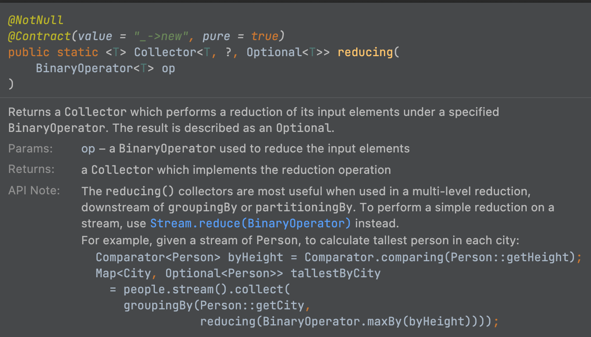

effective_java_람다와_스트림

- 아이템42_익명 클래스보다는 람다를 사용하라
  - 예전 자바에서는 함수타입을 표현할때 추상메서드 하나있는 인터페이스를 사용
    - 이런 인터페이스의 인스턴스를 함수 객체라고하고, 특정 함수나 동작을 나타내는데 사용
    - jdk1.1 에서는 익명 클래스로 사용
    - 요런건 전략 패턴에서 활용
      - ex. Comparator 인터페이스가 추상전략, Comparator를 구현한게 구체적인 전략(이를 익명클래스로 구현)
  - 익명클래스는 너무길다.. 함수형 프로그래밍에 부적합..
  - 이에, 자바 8부터 **추상 메서드하나** + **인터페이스** 는 함수형 인터페이스라 부르고, 이 인터페이스의 인스턴스를 람다식(람다)을 통해 만드는 방식이 나오게됨
    - 코드 간결 + 어떤 동작하는지 잘 나타남
    - 컴파일러가 타입을 추론해주기 때문에, 타입을 명시하지않아도 된다
      - 타입을 명시해야 코드가 더 명확할때 혹은 컴파일러가 타입을 추론하지못할때를 제외하고는, 람다의 모든 매개변수 타입은 생략하자!
      - 컴파일러가 타입추론할때 필요한 타입정보의 대부분은 제네릭에서 얻는다
    - 람다를 활용해서 열거 타입의 인스턴스 필드에 함수형 인터페이스를 정의하면, 상수별로 다르게 동작하는 코드를 구현가능
        ```java
            public enum OperationWithLambda {
                PLUS("+", (a,b) -> a+b),
                MINUS("-", (a,b) -> a-b);

                private final String symbol;
                private final DoubleBinaryOperator doubleBinaryOperator;

                OperationWithLambda(String symbol, DoubleBinaryOperator doubleBinaryOperator) {
                    this.symbol = symbol;
                    this.doubleBinaryOperator = doubleBinaryOperator;
                }

                // ...
            }
        ```
      - 그렇다면, 기존 상수별 몸체를 만드는것(enum에 추상메서드 선언한거)은 의미가 없을까?
        - NO!
        - 메서드나 클래스와 달리 람다는 이름이 없고, 문서화 어려움.. 따라서 코드 자체로 동작이 명확하게 보이지않거나 코드 줄 수가 많아지면 람다를 쓰면안된다!
          - 람다는 한줄일때 가장좋고 길어야 세줄 안에 끝내야한다!
        - 람다식에서 enum의 인스턴스 필드나 메서드를 사용불가! 이를 사용하기위해서는 몸체로 만들어야함
  - 그렇다면, 익명 클래스는 이제 필요없나?
    - NO!
    - 추상 클래스의 인스턴스를 만들때 람다를 못쓰니 익명클래스를 써야한다 (인터페이스만 람다사용가능)
    - 추상 메서드가 2개 이상일때는 익명 클래스 써야한다
    - 람다는 자신을 참조할수 없기때문에 함수객체가 자신을 참조해야하는 경우가 있다면 익명클래스로 사용해야한다
      - 람다에서 this 사용시 바깥 인스턴스를 가리킨다. 익명 클래스는 인스턴스 자신을 가리킴
      - 이런 경우가 언제있을까나..?
  - 람다 주의점
    - 람다를 직렬화하는 일은 삼가자
    - 직렬화해야만 하는 함수 객체가 있다면, private 저적 중첩 클래스의 인스턴스를 사용하자
      - 무슨말?

---

- 아이템43_람다보다는 메서드 참조를 사용하라
  - 메서드참조를 사용하는 편이 보통은 더 짧고 간결하므로, 람다를 구현했을때 너무 길거나 복잡해지면 메서드참조를 사용하는게 좋다
  - 메서드 참조는 기능을 잘 드러내는 이름을 지어줄 수 있고, 메서드로되어있으니 문서로 남길수도있다
  - 메서드 참조의 유형
    
메서드 참조 유형 | 예 | 같은 기능을 하는 람다
---------|----------|---------
 정적 | Integer::parseInt | str -> Integer.parseInt(str)
 한정적(인스턴스) | Instant.now()::isAfter | Instant then = Instant.now(); <br> t -> then.isAfter(t)
 비한정적(인스턴스) | String::toLowerCase | str -> str.toLowerCase()
 클래스 생성자 | TreeMap<K,V>::new | () -> new TreeMap<K,V>()
 배열 생성자 | int[]::new | len -> new int[len]

---

- 아이템44_표준 함수형 인터페이스를 사용하라
  - 람다를 지원하게되면서, 템플릿메서드 패턴대신, 함수 객체를 받는 정적 팩터리나 생성자를 제공할수 있게됨
    - 이렇게되면, 함수객체를 매개변수로 받는 생성자나 메서드를 만들어야할것이고, 그에따라 함수형 매개변수 타입을 올바르게 선택할 수 있어야한다 (즉, 메서드나 생성자에 넘겨받는 파라미터를 어떤걸 선택할것인가? 기본적으로 java api가 제공하는 함수형인터페이스냐? 아니면 직접 만들거냐?)
    - 템플릿메서드 패턴을 사용하는 `LinkedHashMap.removeEldestEntry` 함수형 인터페이스를 활용해서 변경해보자
    ```java
      public static void main(String[] args) {
          Map<String, String> map = new LinkedHashMap<>() { 
              @Override
              protected boolean removeEldestEntry(Map.Entry<String, String> eldest) { // 템플릿에서 변경이 필요한 부분을 하위 클래스에서 재정의하여 사용하도록 하는 템플릿 메서드 패턴
                  return size() > 100; 
              }
          };

          // 위의 내용을 NewLinkedHashMap(함수형 인터페이스)으로 새롭게 만든다면..
          NewLinkedHashMap<String, String> newLinkedHashMap = new NewLinkedHashMap<>((EldestEntryRemovalFunction<String, String>) (m, eldest) -> m.size() > 100);

          // 위의 내용을 표준함수형 인터페이스로 변경하면..
          NewLinkedHashMap<String, String> newLinkedHashMap_표쥰함수버전 = new NewLinkedHashMap<>((BiPredicate<Map<String, String>, Map.Entry<String, String>>) (m, eldest) -> m.size() > 100); // 표준함수형으로 만들었을때는 컴파일러가 타입추론이 어려워, 캐스팅을 통해 제네릭으로 정보를 알려줘야함.. 이게 단점이라면 단점이겠네..

      }

      static class NewLinkedHashMap<K, V> extends LinkedHashMap<K, V> {

          private EldestEntryRemovalFunction<K, V> eldestEntryRemovalFunction;
          private BiPredicate<Map<K, V>, Map.Entry<K, V>> eldestEntryRemovalFunction_표준함수버전;

          public NewLinkedHashMap(EldestEntryRemovalFunction<K, V> eldestEntryRemovalFunction) {
              this.eldestEntryRemovalFunction = eldestEntryRemovalFunction;
          }

          public NewLinkedHashMap(BiPredicate<Map<K, V>, Map.Entry<K, V>> eldestEntryRemovalFunction_표준함수버전) { // 되도록이면 기존에 있는 표준함수형을 사용하자!
              this.eldestEntryRemovalFunction_표준함수버전 = eldestEntryRemovalFunction_표준함수버전;
          }

          /*
          void afterNodeInsertion(boolean evict) { // possibly remove eldest
              LinkedHashMap.Entry<K,V> first;
              if (evict && (first = head) != null && eldestEntryRemovalFunction.remove(this, first)) { // (1)
                  K key = first.key;
                  removeNode(hash(key), key, null, false, true);
              }
          }

          (1) removeEldestEntry.remove(first) => eldestEntryRemovalFunction.remove(this, first) 로 변경
              **removeEldestEntry는 인스턴스 메서드 이므로 size() 메서드를 사용가능하나, 함수객체인 eldestEntryRemovalFunction은 생성시에 해당 Map의 인스턴스를 알수 없으니, Map을 넘겨줄수 있도록 해야한다** => 요런 센스중요!!
          */
      }

      @FunctionalInterface
      interface EldestEntryRemovalFunction<K, V> {
          boolean remove(Map<K, V> map, Map.Entry<K, V> eldest);
      }
    ```
  - java.tuil.function 패키지를 보면 다양한 용도의 표준 함수형 인터페이스가 담겨있는데, 필요한 용도에 맞는게 있다면, 직접 구현하지 말고 표준 함수형 인터페이스를 활용하자!
    - 총 43개가있음.. 상당히 범용적으로 사용할수있도록 이미 만들어놓았으니 최대한 사용하자
    - 생각보다 필요할때 찾아 쓸 수 있을 만큼 범용적인 이름을 사용
    - 성능 지대한 악영향을 미치니.. 기본타입이 지원되는 함수형 인터페이스(ex. LongToIntFunction)에 박싱된 기본 타입을 넣어 사용하지는 말자.. 굳이 그럴필요도없고, 그래야만 한다면 박싱된걸 받을수 있도록 새로 만들어야할듯..
      ```java
        @FunctionalInterface
        public interface LongToIntFunction {
            int applyAsInt(long value);
        }
      ```
  - 하지만, 직접 함수형 인터페이스를 만들어야할때도 있는데, 어떤경우가 그럴까?
    - 표준 인터페이스 중 필요한 용도에 맞는게 없을때 (당연..)
      - ex. 매개변수 3개 받는 Predicate, checked Exception을 던져야하는경우 등
    - 다음 3가지중 하나 이상을 만족한다면,, (`Comparator<T>`가 `ToIntFunction<T,U>`로 만들지 않은 이유와 동일)
      - 자주 쓰이며, 이름 자체가 용도를 명확히 설명
      - 반드시 따라야 하는 규칙이 있을때
      - 유용한 디폴트 메서드를 제공할 수 있을때
  - 주의점
    - 함수형 인터페이스를 만들때 @FunctionalInterface를 붙여주자~
      - 해당 클래스를 읽을때, 람다용으로 설계된것임을 알려줄수있음
      - 해당 인터페이스가 추상메서드를 오직 하나만 가지고 있어야 컴파일이 됨
      - 그로인해 개발자의 실수 줄일수 있음
    - 서로 다른 함수형 인터페이스를 같은 위치의 인수로 받는 메서드들을 다중정의해서는 안된다
      - 코드로보자
        ```java
            public static void main(String[] args) {
                // 함수형 인터페이스를 인수로 받을때, 다중정의의 모호함
                ExecutorService executorService = null;
                executorService.submit(() -> setString("hi")); // ExecutorService.submit은 인수가 없는 람다식을 사용하는 Callable과 Runnable을 받을수있도록 오버로딩 되어있는데, 당연 컴파일러가 에러를 내진않지만, 이런식으로 사용하면 클라이언트 입장에서 Callable을 써서 결과값을 받을수있는것인지, Runnable을 써서 결과값을 받을수 없는지가 코드로 딱 보아서 파악하기 애매할듯..
                executorService.submit(() -> setObject("hi"));
                executorService.submit(() -> "hi");

                // 또한, 함수형 인터페이스의 이름만 다르고 동일한 람다형식을 받는 메서드가 오버로딩되어 있을 경우, 클라이언트가 별도의 형변환을 명시해주어야 사용가능한데, 해당 예시는 위의 newLinkedHashMap을 보자
            }

            static Object setString(String str) {
                return new Object();
            }

            static void setObject(Object obj) {

            }
        ```

---

- 아이템45_스트림은 주의해서 사용하라
  - 스트림 API의 목적
    - 다량의 데이터 처리작업(순차 or 병렬)을 돕고자 자바8 에서 추가
  - 스트림 API가 제공하는 추상개념
    - 스트림
      - 데이터 원소의 유한 혹은 무한 시퀀스를 뜻함
      - 스트림의 원소들은 배열, 컬렉션, 파일, 정규표현시 패턴매처, 난수 생성기, 다른 스트림 등으로 올 수 있다
        - 스트림안의 데이터 원소들은 객체참조나 기본 타입값
          - 기본 타입값으로는 int, long, double 3개 지원
    - 스트림 파이프라인
      - 데이터의 연산단계를 표현하는 개념
      - 스트림 파이프라인은 소스 스트림에서 시작하여 종단연산으로 끝나며, 그 사이에 하나 이상의 중간연산이 있을 수 있다
        - 소스 스트림 -> 중간연산(여러개 가능) -> 종단연산  
        - 중간연산은 스트림을 어떠한 방식으로 "변환" 하는것
      - 스트림 파이프라인은 지연평가(lazy evaluation) 된다
        - 종단연산 호출시 이루어지기때문
        - 종단연산에 쓰이지않는 데이터 원소는 계산에 쓰이지않는다
          - => 종단연산의 계산을 이야기하는듯...? 중간연산에서 계산되다가 걸리질수도있으니..?
          - => 종단연산이 호출되어야 데이터 처리가 시작되니깐.. 종단연산이 호출되지않으면(= 종단연산에 쓰이지않으면)데이터 원소는 계산에 쓰이지않는다고 하는것인듯..?
        - 이러한 종단연산이 무한 스트림을 다룰수 있게해주는 열쇠
  - 스트림 API는 메서드 연쇄(체이닝)를 지원하는 플루언트(fluent) API
    - 파이프라인 하나를 구성하는 모든 호출을 연결하여 하나의 표현식으로 완성가능
  - 무조건 스트림으로 변경하려하지마라~
    - 스트림으로 변경시에 코드 가독성과 유지보수 측면에서 손해볼 수 있다 (적절하게 반복문과 스트림을 조합하는것도 좋음)
  - 함수객체(람다, 메서드참조) vs for-loop의 코드블록
    - 코드 블록에서는 지역변수를 읽고 수정 가능
      - 람다에서는 final 이거나 사실상 final인 변수(람다캡처링)만 읽을 수 있고, 바깥 지역변수 수정불가능
    - 코드 블록에서는 return을 사용해 메서드에서 빠져나가거나 , break, continue 등으로 블록 바깥의 반복문을 종료하거나 반복을 건너띌수 있다
    - 코드 블록에서는 메서드 선언에 명시된 검사 예외(checked exception)를 던질 수 있다
    - 람다는 위 코드블록이 가능한것을 다 못한다. 즉, 위와 같은 작업이 필요하다면, 스트림에서 쓰기가 어렵기때문에 for-loop를 사용해야한다
    - 람다 객체를 사용한 스트림을 쓰기 좋은 상황은?
      - 원소들의 시퀀스를 일관되게 변환
      - 원소들의 시퀀스 필터링
      - 원소들의 시퀀스를 하나의 연산을 사용해 결합 (더하기, 연결하기, 최솟값구하기 등)
      - 원소들의 시퀀스를 컬렉션에 모은다 (공통된 속성을 기준으로 묶어가며?)
      - 원소들의 시퀀스에서 특정 조건을 만족하는 원소를 찾는다
  - 스트림으로 처리가 어려운 일
    - 한 데이터가 파이프라인에서 여러 단계(중간연산)를 통과할때, 각 단계에서의 값들을 접근하기가 어려움
    - 스트림 파이프라인은 일단 한 값을 다른 값에 매핑하고 나면 원래의 값은 잃는구조..
    - 원래 값과 새로운 값의 쌍을 저장하는 객체를 사용해 우회할수도있지만.. 코드가 지저분해진다..
    - 앞단계의 값이 필요하면, 매핑을 거꾸로 수행하라!
  - 결론
    - 스트림과 for-loop 방식중 무조건 어느것이 정답은 없음
    - 둘 조합이 짱인듯
    - 애매하면 둘다 해보고 더 나은쪽 선택

  - 기타 팁
    - 람다에서는 타입이름이 자주 생략되기때문에, 매개변수 이름을 잘 지어야한다! 그래야 스트림 파이프라인의 가독성이 유지
    - 도우미 메서드를 활용하는것이 스트림 파이프라인에서 가독성도 높여주고 타입 정보(람다에서는 타입정보가 자주생략..)를 유추하기도 쉽다
    - 스트림을 반환하는 메서드 이름은 원소의 정체를 알려주는 **복수 명사**로 쓰자

---

- 아이템46_스트림에서는 부작용 없는 함수를 사용하라
  - 스트림이 제공해주는 표현력, 속도, 병렬성을 얻기위해서는 스트림 API에 대한 숙지와 더불어 함수형 프로그래밍에 기초한 패러다임을 받아들여야한다
    - 이 패러다임은 계산을 일련의 **변환**으로 재구성하는게 핵심인데, 각 변환 단계는 이전 단계의 결과를 받아 처리하는 **순수함수**여야한다
      - 순수함수란 오직 입력만이 결과에 영향을 주는 함수를 말한다 (즉, 입력이 같으면 결과는 항상 같은 것)
        - => 다른 가변상태를 참조하지도않고, 함수 스스로도 상태를 변경하지않는 함수 (외부 가변객체 참조 안함 + 넘겨받는 파라미터 객체의 상태변경안함)
    - 패러다임을 잘 이해하지 못한 채 API만 사용한코드
    - 코드로 보자
      ```java
        void 바람직하지않은_stream사용() throws FileNotFoundException { // 패러다임을 잘 이해하지 못한 채 API만 사용한코드
            File file = null;
            Map<String, Long> freq = new HashMap<>();

            try(Stream<String> words = new Scanner(file).tokens()) {
                words.forEach(word -> {
                    freq.merge(word, 1L, Long::sum); // 상태를 수정하고 있음. 즉, 순수함수가 아니다!
                });
            }
        }

        void 바람직한_stream사용() throws FileNotFoundException {
            File file = null;
            Map<String, Long> freq;

            try(Stream<String> words = new Scanner(file).tokens()) {
                freq = words.collect(groupingBy(String::toLowerCase, counting()));
            }

            //  try(Stream<String> words = StreamUtils.asStream(new Scanner(file))) { // java 8 일때..
            //      freq = words.collect(groupingBy(String::toLowerCase, Collectors.counting()));
            //  }
        }

        static class StreamUtils {
            public static <T> Stream<T> asStream(Iterator<T> sourceIterator) {
                return asStream(sourceIterator, false);
            }

            public static <T> Stream<T> asStream(Iterator<T> sourceIterator, boolean parallel) {
                Iterable<T> iterable = () -> sourceIterator;
                return StreamSupport.stream(iterable.spliterator(), parallel);
            }
        }
      ```
  - 수집기(Collector)
    - 스트림을 사용하는데 꼭 필요한 개념
    - Collectors 클래스는 축소(reduction)전략을 캡슐화한 블랙박스 객체라고 볼 수 있음
      - 블랙박스 객체란 객체의 내부동작을 외부에서(사용자) 알 필요없이 인터페이스만을 제공하는 객체
        - Collectors를 통해서 (이쁘게 만들어진)Collector 인터페이스를 제공해주기때문~ 
      - 축소란 스트림의 원소들을 객체 하나에 취합한다는뜻 (보통 수집기가 생성하는 객체는 Collection)
      - Collectors의 메서드는 39개 (자바 10에서는 4개가 더늘어 총 43개)
        - **toList**, **toSet**, toCollection
          ```java
            List<String> 가장흔한단어10개뽑아내기(Map<String, Long> freq) {
                return freq.keySet().stream()
                        .sorted(comparing(freq::get).reversed()) // 한정적 메서드 참조
                        .limit(10)
                        .collect(toList());
            }
          ```
        - **toMap**
          - 스트림의 각 원소가 고유한 키에 매핑되어있을때 사용
          - 스트림의 원소가 같은 키로 매핑하려한다해도, 적절한 merge 함수만 사용한다면 문제없음 (만약 merge함수 사용안하면 예외던져짐)
            ```java
                void toMap_예제_앨범들중에서_음악가의_베스트앨범() {
                    List<Album> albums = null;

                    Map<Artist, Album> collect = albums.stream()
                            .collect(Collectors.toMap(Album::getArtist, v -> v, maxBy(comparingInt(Album::getSales)))); // albums에 동일한 artist는 여럿 있을수 있다. 즉, 같은 key로 매핑이 될텐데, maxBy라는 병합함수를 통해서 key가 중복될때 무엇을 선택할지 명시해주고있다. maxBy는 BinaryOperator의 디폴트 메서드. 최대값인 대상으로 병합하라고 알려주는것
                    
                }
            ```
        - **groupingBy**
          - 입력으로 분류 함수(classifier)를 받고, 출력으로는 원소들을 카테고리별로 모아 놓은 맵을 담은 수집기(Collector)를 반환해준다
          - 인자로 분류함수 하나만 받는 경우에는, Map의 value는 toList가 된다. 즉, toMap은 원소하나에 value 하나가 mapping 되는데, groupingBy는 이름처럼 지정한 분류함수대로 N개의 값이 나올 수 있기에 default가 List
          - List외의 값을 갖도록(ex. Set) 하기위해서는 다운스트림 수집기도 명시해야한다 (인자로 두개 받는 메서드)
            - `public static <T, K, A, D> Collector<T, ?, Map<K, D>> groupingBy(Function<? super T, ? extends K> classifier, Collector<? super T, A, D> downstream) { ... }`
            - Collectors.counting()을 downstream 수집기에 지정하면, 분류함수로 지정한 카테고리(key)에 속하는 원소의 갯수를 값(value)으로하는 Map을 얻을수 잇다
        - partitioningBy
          - 분류 함수자리에 predicate를 받고 키가 Boolean인 맵을 반환
        - counting
          - 다운스트림 수집기 전용으로 보면됨
          - Stream에 count가 있기때문에, `collect(Collectors.counting())` 이런식으로 쓸일은 없다
        - summing, averaging, summarizing
          - 위 각각이 int, long, double 스트림용으로 하나씩 존재
        - reducing, filtering, mapping, flatMapping, collectingAntThen
          - 대부분 프로그래머는 이들의 존재를 몰라도 상관없음
          - 설계 관점에서 보면, 이 수집기들은 스트림 기능의 일부를 복제하여 다운스트림 수집기를 작은 스트림처럼 동작하게 한것
            - 주로 Collectors 내부적으로 사용하기위한것으로 보임..
            - 
              - reducing 관련 Doc 설명에 따르면, groupingBy나 partitioningBy의 downstream 수집기에서 사용하는 용도라고함. 그냥 단순 reduction할꺼면 Stream.reduce 사용하라함
              - => 그냥 downstream Collector 사용하는곳에서 쓰고자 만든것으로보임..
        - minBy, maxBy
          - Collectors에 정의되어있지만, "수집"과는 별 관련없음
          - Stream 인터페이스의 min과 max 메서드를 살짝 일반화한것. BinaryOperator의 minBy나 maxBy의 수집기 버전으로 이해하자 (위와 유사한듯.. downstream 수집기에서 사용하기위함인듯..)
        - **joining**
          - Collectors에 정의되어있지만, "수집"과는 별 관련없음
          - 원소들을 연결하는 수집기를 반환
          - CharSequence 인스턴스(ex. String)의 스트림에만 적용가능
  - 기타 팁
    - forEach 연산은 스트림 계산 결과를 보고할 때만 사용하고, 계산하는데는 쓰지말자! (출력이나 로깅에서나 사용하자!!)
      - 가끔은 스트림 계산 결과를 기존 컬렉션에 추가하는 등의 다른 용도로 사용하기도한다함
    