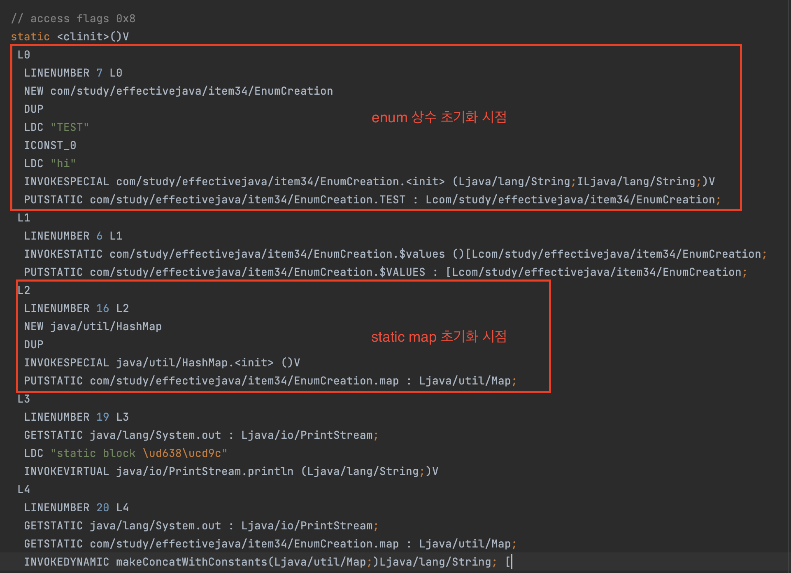
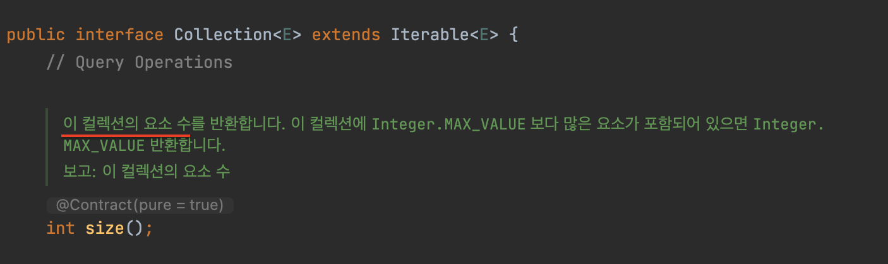
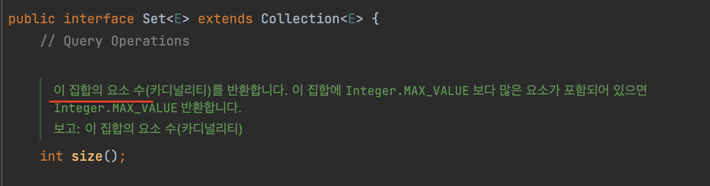

effective_java_열거타입과_에너테이션

- item34_int 상수 대신 열거 타입을 사용하라
  - 열거타입?
    - 일정 개수의 상수값을 정의한 다음, 그 외의 값은 허용하지 않는 타입
    - 완전한 형태의 **클래스**!
      - enum에 선언된 상수는, 상수 하나당 자신의 인스턴스를 하나씩 만들어 `public static final` 필드로 공개하는것!
      - 외부에서 접근할 수 있는 생성자 제공x (사실상 final 클래스)
      - => 열거 타입 선언으로 만들어진 인스턴스들은 오직 딱 한개만존재!
        - 싱글턴은 원소가 하나뿐인 열거타입
          ```java
            enum Singleton {
                INSTANCE, // 원소가 하나뿐인 열거타입은 싱글턴이다.
            }
          ```
  - 열거타입의 이점
    - 컴파일 타임에 타입안정성 제공
      - 해당 열거타입이 아닌 다른 열거타입과 비교하면 바로 컴파일에러
    - 다른 enum 클래스라면 상수이름 당연 같을 수 있음
    - 새로운 상수를 추가하거나 순서를 바꿔도 다시 컴파일 하지 않아도됨
      - 공개되는것은 오직 필드의 이름뿐이기에, 이름이 변경되지않는 이상은 기존 사용하던 클라이언트 이상무
    - toString 메서드는 출력하기에 적합한 문자열 보여줌
      - 정수상수는 의미없는숫자.. 하지만, enum은 상수이름을 보여준다.. 물론, toString 재정의가능
    - 클래스이기때문에 임의의 메서드나 필드(상수가 가질 데이터)를 추가할 수 있고, 임의의 인터페이스를 구현하게 할 수도 있다.
      - ex. Comparable도 구현되어있음(상수 선언 순서대로 비교.. 의미있으려나..?)
      - 참고로 Object에 정의된 메서드들을 override하도록 허용한건 toString 밖에없다..
  - 열거타입에 메서드나 필드는 언제 필요할까?
    - 상수와 연관된 데이터가 있다면, 필드를 통해서 상수 자체에 내재시키자 
      - 생성자에서 데이터 받아 인스턴스 필드에 저장하면됨
      - 열거 타입은 근본적으로 불변이라 모든 필드는 final!!
      ```java
        enum Operation {
            PLUS("+");

            private final String buho;
            Operation(String buho) {
                this.buho = buho;
            }
        }
      ```
    - 상수마다 동작이 달라져야할때는 상수별 메서드 구현(constant-specific method implementation)을 사용하라
      - switch문 NO!
        - 상수 추가시 switch문도 같이 변경을 해주어야하는데, 놓치기 쉬움..  
      - 열거 타입에 추상메서드를 선언하고, 상수별 클래스 몸체를 상수에서 자신에 맞게 재정의(추상 메서드의 구체화..)
        ```java
            enum Operation {
                PLUS("+") {
                    @Override
                    public double apply(double x, double y) { return x+y;}
                },
                MINUS("-") {
                    @Override
                    public double apply(double x, double y) { return x-y;}
                },
                // ...

                private final String symbol;
                Operation(String symbol) {
                    this.symbol = symbol;
                }

                public abstract double apply(double x, double y); // 상수별 메서드 구현활용을 위한 추상 메서드 선언

                @Override
                public String toString() { // 재정의가능. 하지만 toString을 재정의 하였다면, 이 반환하는 문자열을 기반으로 열거타입 상수로 반환해주는 메서드를 만들자
                    return symbol;
                }

                static Map<String, Operation> symbolToOperation = Stream.of(Operation.values())
                        .collect(Collectors.toMap(Operation::toString, Function.identity())); 

                public static Optional<Operation> fromString(String symbol) { // 인자로 받은 symbol이 없을수도 있으니, 센스있게 Optional로 처리하자 (Optional을 사용하여 클라이언트에게 없을수도 있음을 알리고 이를 처리하라고 알려줌)
                    return Optional.ofNullable(symbolToOperation.get(symbol));
                }
            }
        ```
    - 상수별 메서드 구현시 공용으로 쓰고싶은게 있을때에는 어떻게?
      - 되도록이면 switch문을 사용하지마라~ (갱신 제대로 못하면 오동작.. 실수 유발가능성 높다..)
        - <span style="color:red">예외적으로 switch문이 좋은선택?</span>
          - 기존 열거 타입에 상수별 동작을 혼합해 넣을때..
            - ex. 위 Operation 열거타입의 반대 연산을 반환하는 메서드..
          - 추가하려는 메서드가 의미상 열거 타입에 속하지 않는다면 직접만든 열거 타입이라도 이 방식을 적용하는게좋다..?
          - => 위 두개 뭔말인지 잘 이해가안간다..
      - 전략 열거 타입을 사용하자!
        ```java
            public enum PayrollDay {
                MONDAY(WEEKEND), TUESDAY(WEEKDAY), WEDNESDAY(WEEKEND);
                // ...

                private final PayType payType; // 이 부분을 함수형 인터페이스를 활용해도 나쁘지않을듯..?
                PayrollDay(PayType payType) {
                    this.payType = payType;
                }
                
                public int pay(int minutesWorked, int payRate) {
                    return payType.pay(minutesWorked, payRate);
                }

                // 전략 열거 타입
                enum PayType { // 내부적으로만 사용하니 package-private
                    WEEKDAY {
                        @Override
                        int overtimePay(int mins, int payRate) {
                            return 0;
                        }
                    }, 
                    WEEKEND {
                        @Override
                        int overtimePay(int mins, int payRate) {
                            return 0;
                        }
                    };
                    
                    abstract int overtimePay(int mins, int payRate);
                    
                    int pay(int minsWorked, int payRate) {
                        int basePay = minsWorked + payRate;
                        return basePay + overtimePay(minsWorked, payRate);
                    }
                }
            }
        ```
      
  - 열거 타입을 어떤식으로 만들까?
    - 일반 클래스처럼, 기능을 클라이언트에 노출해야 할 합당한 이유가 없다면, private이나 package-private으로 선언하자~
  - 열거 타입의 제약
    - 열거 타입의 정적 필드 중 열거 타입의 생성자에서 접근할 수 있는것은 상수변수만 가능!
      - 열거 타입 생성자가 실행되는 시점은 다른 정적 필드들이 초기화되기전이라, 정적 필드에 접근하는게 제한된다 (ex. 정적 필드로 hashMap을 정의해놨을때, enum 생성자에서 hashMap 접근하려하면 컴파일에러남)
        - 열거 타입의 상수는 상당히 이른 시점에 생성됨 (map 보다 더 빠르게..)
          - 참고로 map을 TEST 상수 위에 위치시키면 컴파일에러남..
        ```java
            public enum EnumCreation {
                TEST("hi");

                private final String s;

                EnumCreation(String s) {
                    System.out.println("TEST 초기화");
                    this.s = s;
                }

                static Map<String, String> map = new HashMap<>();

                static {
                    System.out.println("static block 호출");
                    System.out.println("static map 호출 : "+map);
                    System.out.println("EnumCreation.TEST 호출 : "+EnumCreation.TEST);
                }
            }
        ``` 
          - 위 소스의 바이트 코드
            - 
      - 또한 동일한 제약으로인해 생성자에서 같은 열겨타입의 다른 상수에도 접근할 수 없음!
        - 열거타입의 상수는 public static final 이므로 즉, static인 정적필드이므로 접근제한되는게 당연
      
  - 결론
    - 컴파일 타임에 정의가능한 상수집합이면 열거타입을 사용하자!!!
      - 태양계행성, 한 주의 요일, 메뉴아이템, 연산 코드 등 고정된 값이나, 컴파일 타임에 허용하는 값 모두를 알고있는것들!
  - 기타 팁
    - 열거타입은 values라는 정적메서드를 통해서 자신안에 정의된 상수들을 배열로 반환해준다  
      - 값들은 선언된 순서대로 저장
    
---

- 아이템35_ordinal 메서드 대신 인스턴스 필드를 사용하라
  - 모든 열거 타입은 해당 상수가 그 열거 타입에서 몇번째 위치인지를 반환하는 ordinal 메서드를 제공
  - ordinal을 활용해서 뭔가를 만들지마라!!
    - 상수의 순서가 변경되면 예상치 못한 오동작이 발생할 수 있을 뿐만아니라, 기대하는 정수의 값을 만들기위해 불필요한 수고를 해야한다..
    - API 문서에서도 프로그래머가 사용할게아닌, EnumSet과 EnumMap같은 열거타입 기반의 범용자료구조에 쓸 목적으로 설계되었다고 나와있다!

---

- 아이템36_비트 필드 대신 EnumSet을 사용하라
  - 집합 개념을 활용하기 위해서는 비트 필드를 사용하기도한다
    ```java
        static class Text { // 구닥다리 기법
            public static final int STYLE_BOLD = 1 << 0;
            public static final int STYLE_ITALIC = 1 << 1;
            public static final int STYLE_UNDERLINE = 1 << 2;
            public static final int STYLE_STRIKETHROUGH = 1 << 3;
            private String str;

            public void applyStyles(int styles) { 
                if ((styles & STYLE_BOLD) != 0) { // STYLE_BOLD 면
                    applyBold();
                }

                if ((styles & STYLE_ITALIC) != 0) { // STYLE_BOLD 면
                    applyItalic();
                }

                // ...

            }

            private void applyItalic() {
                System.out.println("italic 적용");
            }

            private void applyBold() {
                System.out.println("bold 적용");
            }

        }

        public static void main(String[] args) {
            Text text = new Text();
            text.applyStyles(Text.STYLE_BOLD | Text.STYLE_ITALIC); // 이런식으로 집합개념 사용가능. 위의 applyItalic 메서드, applyBold 메서드 호출
        }
    ```
  - 하지만, EnumSet을 활용하여 집합을 더욱 효율적으로 다룰 수 있다
    - EnumSet의 내부는 비트 벡터로 되어있으니 성능상에서도 불리할게 없다
    - enum의 원소가 64개 이하면, EnumSet 전체를 long 변수하나로 표현(long은 64비트까지 표현가능하니..)하여 비트 필드에 비견되는 성능을 보여줌
      - enum의 ordinal을 활용
    - 코드로 확인
    ```java

        // RegularEnumSet 내부 (해당 enum의 상수 갯수가 64개 이하일 경우)

            // ...

            public boolean add(E e) {
                typeCheck(e);

                long oldElements = elements;
                elements |= (1L << ((Enum<?>)e).ordinal()); // enum의 ordinal을 사용하여 element와 OR 비트연산을 하여 enum의 상수를 저장한다 (long을 사용하니 64비트까지만..)
                return elements != oldElements;
            }

            // ...

            public boolean retainAll(Collection<?> c) {
                if (!(c instanceof RegularEnumSet<?> es))       // RegularEnumSet 즉, 64개 이하의 EnumSet이 아니라면~
                    return super.retainAll(c);

                if (es.elementType != elementType) {            // element는 Class<T> 인데, 위의 예에서는 Style.class로 보면됨. 즉, 다른 타입이면~
                    boolean changed = (elements != 0);
                    elements = 0;
                    return changed;
                }

                long oldElements = elements;
                elements &= es.elements;                        // AND(&) 비트 연산을 사용하여 파라미터로받은 c의 elements들과 같은것들만 남기도록.. 만약 중복된게 없으면 빈값이됨..
                return elements != oldElements;
            }
         
        /////////////////////////////

        @Test
        void testEnumSet() {
            EnumSet<EnumSetAnalysis.Style> enumSet = EnumSet.of(BOLD, ITALIC);
            System.out.println(enumSet);

            enumSet.retainAll(EnumSet.of(BOLD)); // 중복된 BOLD만 남음
            assertThat(enumSet)
                    .hasSize(1)
                    .containsOnly(BOLD);


            enumSet.retainAll(EnumSet.of(UNDERLINE, ITALIC));
            assertThat(enumSet)
                    .isEmpty(); // 중복되는게 없으니, 암것도없음
        }

    ```
  - 결론
    - 집합개념을 사용하기위해서 EnumSet이 아닌, 비트필드를 사용하는 어리석은 짓을 하지말자..

---

- 아이템37_ordinal 인덱싱 대신 EnumMap을 사용하라
  
  - 열거 타입을 키로 사용하도록 설계한 아주 빠른 Map 구현체가 EnumMap
    - ordinal 왜 직접 사용안하는게 좋나?
      - 클라이언트가 ordinal을 직접 사용하여, 배열의 인덱스와같은 구조로 사용하게된다면, 컴파일러는 ordinal과 배열 인덱스의 관계를 알 수 없으니, 실수를 유발할 가능성이 매우 높아진다(유지보수시에 ordinal 사용하는 곳을 잘 살펴야한다.. - "해당 ordinal의 정수값이 원래 계획한대로 잘 쓰이고있는가?" 를 확인해야함)
    - EnumMap 내부적으로 ordinal을 배열의 인덱스로 활용하고 있어서 성능 좋음
      ```java
        // enumMap 내부
        public V put(K key, V value) {
            typeCheck(key);

            int index = key.ordinal(); // vals(Object 배열)의 index로 ordinal을 사용
            Object oldValue = vals[index];
            vals[index] = maskNull(value);
            if (oldValue == null)
                size++;
            return unmaskNull(oldValue);
        }
      ```
    - 유지보수에 용이
      - Map을 사용하여 타입안전(제네릭)
    - EnumMap 내부 좀더 살펴보자
      ```java
        public class EnumMap<K extends Enum<K>, V> extends AbstractMap<K, V> implements java.io.Serializable, Cloneable {
            // ...
            public EnumMap(Class<K> keyType) { // 한정적 타입토큰 (Enum만 받도록..)을 사용하여 런타임시에 제네릭 타입에 대한 정보를 알 수 있음
                this.keyType = keyType;
                keyUniverse = getKeyUniverse(keyType);  // keyUniverse가 해당 Enum의 모든 상수정보를 참조하고있음... 이를통해 Entry의 key에 대한 정보를 알 수 있음
                vals = new Object[keyUniverse.length];
            }

            // ...
        }
      ```
  - 다차원관계 표현에 유리 (중첩맵으로!)
    - ex. 액체(LIQUID)에서 고체(SOLID)로의 전이는 응고(FREEZE)가되고, 액체(LIQUID)에서 기체(GAS)로의 전이는 기화(BOIL)
      ```java
         // 상전이 맵
          public enum Phase {
              SOLID, LIQUID, GAS;

              public enum Transition {
                  MELT(SOLID, LIQUID),
                  FREEZE(LIQUID, SOLID),
                  BOIL(LIQUID, GAS),
                  CONDENSE(GAS, LIQUID),
                  SUBLIME(SOLID, GAS),
                  DEPOSIT(GAS, SOLID);

                  private final Phase from;
                  private final Phase to;

                  Transition(Phase from, Phase to) {
                      this.from = from;
                      this.to = to;
                  }

                  private static final Map<Phase, Map<Phase, Transition>> transitionMap // 다차원관계를 위한 중첩 Map
                          = Arrays.stream(values())
                          .collect(groupingBy(
                                          t -> t.from
                                          , () -> new EnumMap<>(Phase.class)
                                          , toMap(t -> t.to, Function.identity(), (v1, v2) -> v2, () -> new EnumMap<>(Phase.class))
                                  )
                          );

                  public static Transition from(Phase from, Phase to) {
                      return transitionMap.get(from).get(to);
                  }
              }
          }
      ```

---

- 아이템38_확장할 수 있는 열거 타입이 필요하면 인터페이스를 사용하라
  - 열거타입은 확장 불가..
    - 사실 대부분 상황에서 열거 타입을 확장하는건 좋지않은 생각
    - but 연산코드와같은 기본 연산외 사용자 확장 연산을 추가할 수 있도록 확장을 열여주어야하는 경우가 있는데, 이때는 **인터페이스**를 사용하자!
  - 열거타입끼리 구현 상속 불가 (상호간에 extends 가 안되므로..)
    - 그에 따라 필연적으로 발생할 수 있는 중복코드는 어떻게 처리?
      - 아무상태에도 의존하지않는다면, 인터페이스의 디폴트 메서드 구현을 통해 공통으로 사용할 메서드를 정의가능
      - 상태에 의존하는 경우(symbol(String)에 따라 enum 상수를 리턴해줘야하는.. - 이미 만들어진 map 또는 상수에 의존)에는, 중복코드제거를 위해 별도의 도우미 클래스나 정적 도우미 메서드로 분리하자
        - ex. BasicOperation과 ExtendedOperation에 fromString 메서드를 통해서 enum 상수를 리턴해주는 메서드는 중복이 발생.. 그때 공통으로 사용하는 Operation 인터페이스에 아래와 같은 정적 도우미 메서드를 사용할 수도 있겠다..
          ```java
             interface Operation {
                Map<String, Operation> map =
                        Stream.of(BasicOperation.values(), ExtendedOperation.values())
                                .flatMap(arr -> Arrays.asList(arr).stream())
                                .collect(Collectors.toMap(op -> op.toString(), Function.identity())); // 정적 도우미 메서드를 사용하기위한 정적 멤버변수.. Operation이 추가되면, 여기를 신경써야하긴함..

                double apply(double x, double y);
                static Optional<Operation> fromString(String symbol) { // Operation을 구현하는 enum들에 중복을 막기위한 정적 도우미 메서드
                    return Optional.ofNullable(map.get(symbol));
                }
            }
          ```
  - 인터페이스 활용하여 확장가능하도록 만든 열거타입을 코드로보자
    ```java
      enum BasicOperation implements Operation {
          PLUS("+") {
              @Override
              public double apply(double x, double y) {
                  return x + y;
              }
          },
          MINUS("-") {
              @Override
              public double apply(double x, double y) {
                  return x - y;
              }
          };

          private final String symbol;

          BasicOperation(String symbol) {

              this.symbol = symbol;
          }

          @Override
          public String toString() {
              return symbol;
          }

          //        public abstract double apply(double x, double y); // 인터페이스에 선언되어있기때문에 별도의 추상메서드 필요없음
      }

      enum ExtendedOperation implements Operation {
          REMAINDER("%") {
              @Override
              public double apply(double x, double y) {
                  return x % y;
              }
          };

          private final String symbol;

          ExtendedOperation(String symbol) {

              this.symbol = symbol;
          }

          @Override
          public String toString() {
              return symbol;
          }

      }

      public static void main(String[] args) {
          double x = 10;
          double y = 3;

          test(ExtendedOperation.class, x, y);
          test(BasicOperation.class, x, y);
          test2(Arrays.asList(ExtendedOperation.values()), x, y);

      }

      private static <T extends Enum<T> & Operation> void test(Class<T> opEnumType, double x, double y) { // class 리터럴은 한정적 타입토큰역할.. 이를 활용하여 코드의 변경없이 어떤 enum을 넘겨주느냐에따라 BasicOperation을 사용할수도, ExtendedOperation을 사용할수도있다
          for (Operation o : opEnumType.getEnumConstants()) {
              System.out.printf("%f %s %f = %f%n",
                      x, o, y, o.apply(x, y));
          }
      }

      private static void test2(Collection<? extends Operation> opSet, double x, double y) { // 좀더 유연한 버전
          for (Operation o : opSet) {
              System.out.printf("%f %s %f = %f%n",
                      x, o, y, o.apply(x, y));
          }
      }
    ```
  - 결론
    - 열거 타입인데 인터페이스를 구현하고있고, API가 기본열거타입을 직접 명시한게아닌 인터페이스 기반으로 작성되었다면, 이는 확장가능하다는 의미이며, 확장한 열거타입의 인스턴스로 대체해 사용할수있다는뜻!

---

- 아이템39_명명 패턴보다 애너테이션을 사용하라
  - 명명패턴
    - ex. junit3에서는 테스트 메서드 이름을 test로 시작해야한다
    - 단점
      - 오타나면안됨
      - 올바른 프로그램 요소에서만 사용되리라 보증x
        - ex. 메서드에서만 사용하길 의도했으나, 사용자가 클래스에서 사용해버림.
      - 프로그램 요소를 매개변수로 전달할 마땅한 방법이 없음
        - ex. 테스트코드에 특정 예외를 던져야 통과할때, 명명규칙으로는 특정클래스를 어떻게 지정할 것인가?
    - => 애너테이션은 이 모든 문제를 해결해준다
  - 애너테이션 사용의 의미
    - 대상 코드의 의미는 그대로 둔 채 그 애너테이션에 관심 있는 도구에서 특별한 처리를 할 기회를 주는것
      - 그렇기때문에 대상코드에 이런저런 지저분한 코드가 붙지않고 명확하게 핵심로직을 볼 수 있다!
      - 애너테이션이 있다는것은 해당 애너테이션을 기반으로 그 의미에 맞게 수행하는 로직이 반드시 있게된다!
  - 애너테이션을 활용한 단순 junit 만들어보기
    ```java
          /***
         * 테스트 메서드임을 선언하는 애너테이션
        * 매개변수 없는 정적 메서드 전용이다. // (컴파일 타임에 정적메세드가 아닌곳에 선언하는걸 잡으려면 애너테이션 처리기를 구현하여야함)
        */
        @Retention(RetentionPolicy.RUNTIME) // 메타어노테이션. Runtime시에도 유지되는 어노테이션. 이렇게 선언해야 Runtime시에 @Test를 인식할수있다..
        @Target(ElementType.METHOD) // 메타어노테이션. Method에만 달수있는 어노테이션이라는뜻
        public @interface Test { // 단순히 대상에 마킹만 하는 마커 어노테이션

        }

        @Retention(RetentionPolicy.RUNTIME)
        @Target(ElementType.METHOD)
        public @interface ExceptionTest {
            Class<? extends Throwable>[] value(); // 한정적 타입 토큰 활용. Throwable 포함 하위클래스로 제한.. 즉, 모든 예외(와 오류) 타입을 수용하는것
            // 여러개 사용할때는 제네릭 배열을 사용할 수 있다!
        }

        static class Sample {
            @Test
            public static void m1() {
            }

            @Test
            @ExceptionTest(RuntimeException.class)
            public static void m2() { // 실패. 예외를 던지지않음
            }

            @Test
            @ExceptionTest(RuntimeException.class)
            public static void m3() {
                throw new RuntimeException("성공");
            }

            @Test
            public static void m4() {
                throw new RuntimeException("실패");
            }

            @Test
            public void m5() { // 실패
            } // 잘못사용.. 정적메서드아님

            public static void m6() {
            }

            @Test
            @ExceptionTest(value = {ArithmeticException.class, IllegalArgumentException.class})
            public static void m7() {
                throw new IllegalArgumentException("성공");
            }

            public static void m8() {
            }
        }

        public static void main(String[] args) throws ClassNotFoundException {
            int tests = 0;
            int passed = 0;

            Class<?> testClass = Class.forName(Sample.class.getName());

            for (Method m : testClass.getDeclaredMethods()) {
                if (m.isAnnotationPresent(Test.class)) {
                    tests++;

                    try {
                        m.invoke(null);
                        if (m.isAnnotationPresent(ExceptionTest.class)) {
                            System.out.println(m + " 실패 : 예외를 던지지않음");
                            continue;
                        }
                        passed++;
                    } catch (InvocationTargetException wrappedEx) { // (1)
                        Throwable realEx = wrappedEx.getCause();
                        if (m.isAnnotationPresent(ExceptionTest.class)) {
                            int oldPass = passed;

                            Class<? extends Throwable>[] exs = m.getAnnotation(ExceptionTest.class).value();
                            for (Class<? extends Throwable> ex : exs) {
                                if (ex.isInstance(realEx)) {
                                    passed++;
                                    break;
                                }
                            }

                            if (oldPass == passed) {
                                System.out.println(m + " 실패 : " + realEx);
                            }
                        } else {
                            System.out.println(m + " 실패 : " + realEx);
                        }

                    } catch (Exception e) { // (2)
                        e.printStackTrace();
                        System.out.println("잘못 사용한 @Test: " + m);
                    }
                }
            }

            System.out.printf("성공: %d, 실패: %d%n", passed, tests - passed);
        }

        /*
            (1) - @Test 선언한 메서드가 예외를 던지면 리플렉션 메커니즘이 InvocationTargetException으로 감싸서 다시 던진다.. 그래서 getCause 메서드를 통해 메서드 호출시 발생한 진짜 에러를 꺼내와야한
                - 여기를 탔다는것은 @Test를 사용한것 자체는 이상 없다는것! 즉, @Test 선언한 메서드 내부에서 발생한 예외!

            (2) - 여기를 타게되는것은 @Test 애너테이션을 잘못사용했을때인데, 인스턴스 메서드, 매개변수가 있는 메서드, 호출할 수 없는 메서드 등에 달았을때 나타날 수 있다
        */

    ```
    - @Repeatable 메타애너테이션
      - java8 에서는 배열매개변수를 사용하는대신(위의 @ExceptionTest 에서 여러개의 value를 받을 수 있도록 하는것) 애너테이션에 @Repeatable 애너테이션으로 사용가능
      - 주의점
        - @Repeatable을 단 애너테이션을 반환하는 "컨테이너 애너테이션"을 하나 더 정의하고, @Repeatable에 이 컨테이너 애너테이션의 class 객체를 매개변수로 전달
        - 컨테이너 애너테이션은 내부 애너테이션(@Repeatable을 단 애너테이션) 타입의 배열을 반환하는 value 메서드를 정의
        - 컨테이너 애너테이션 타입에는 적절한 보존정책(@Retention)과 적용대상(@Target)을 명시해야한다
        - => 위 3개 안지키면 컴파일 안됨
      - 가독성이 개선될 수 있으나, 코드 양이 늘어나고, 특히 처리 코드가 복잡해져 오류 유발가능성 높아짐
        - 그냥 @ExceptionTest 처럼 배열로 받는게 더 직관적일듯..
      - 사용시 p244, p245 참고
  - 결론
    - 애너테이션으로 할 수 있는일을 명명패턴으로 처리할 이유는 없다!!!
  - 기타 팁
    - 메타애너테이션(meta-annotation): 애너테이션 선언에 다는 애너테이션
      - ex. `@Retention`, `@Target`
    - 마커(marker) 애너테이션: 아무 매개변수 없이 단순히 대상에 마킹(marking) 한다
    - TypeNotPresentException: 클래스가 컴파일 타임에는 존재했으나, 런타임에는 존재하지않을때 (unchecked Exception)
      - ClassNotFoundException: TypeNotPresentException과 유사하나, checked Exception..
      - ClassNotFoundException vs NoClassDefFoundError
        - ClassNotFoundException: classpath에 해당 클래스 없을때
        - NoClassDefFoundError: 클래스는 있으나, 클래스 생성시 오류날때 ex. static 초기화시 에러발생한 클래스를 또 new 키워드로 생성하려할때
        - [참고사이트](https://parkadd.tistory.com/111)
    
---

- 아이템40_@Override 애너테이션을 일관되게 사용하라
  - 상위 클래스의 메서드를 재정의하려는 모든 메서드에 @Override 를 달자
    - 메서드 시그니처가 잘못되었을 경우 컴파일 타임에 오류를 뱉어주니, 실수를 방지할수 있음
  - 예외가 있는데, 구체클래스에서 상위클래스의 추상 메서드를 재정의할때는 굳이 @Override를 달지 않아도된다
    - 구체 클래스인데, 아직 구현하지 않은 추상메서드가 있다면, 컴파일러가 알려주기때문!
    - 그래도 되도록 일관되게 달아주자!
  - 기타 팁
    - 인터페이스에 선언된 메서드를 하위 인터페이스가 Override 할 수 있다.(물론, 구현부는 없다..)
      - Collection.size
        - 
      - Set.size
        - 
      - => 인터페이스의 주석을 세부적으로 변경하는데에도 Override가 쓰이는듯함..

---

- 아이템41_정의하려는 것이 타입이라면 마커 인터페이스를 사용하라
  - 마커 인터페이스(marker interface): 아무 메서드도 담고 있지않고, 단지 자신을 구현하는 클래스가 특정 속성을 가짐을 표시해주는 인터페이스
    - ex. Serializable
      - ObjectOutputStream을 통해 write 할 수 있음을 알려줌
      - 하지만, 해당 클래스에서는 온전히 마커인터페이스의 장점을 살리지못함.. (ObjectOutputStream.writeObject에서 파라미터가 Serializable 타입이 아니라 단순 Object라 컴파일 타임에 에러를 잡지 못함..)
  - 마커 애너테이션 vs 마커 인터페이스
    - 마커 인터페이스의 장점
      - 마커 인터페이스는 구현한 클래스의 인스턴스들을 구분하는 타입으로 사용가능
        - 이를 활용하여, 컴파일 타임에 에러를 잡을 수 있음
      - 마커 인터페이스는 적용 대상을 더 정밀하게 지정할 수 있음
        - 애너테이션같은 경우 적용대상을 `@Target(ElementType.TYPE)`으로 선언하였다면, 모든 타입(클래스, 인터페이스, 열거타입, 애너테이션)에 달 수 있다. 즉, 각 타입을 세밀하게는 제한하기가 어려움..
        - 하지만 마커 인터페이스는 타입에 한해서는 원하는 타입에만 구현하면되기떄문에, 정밀하게 지정 가능
      - 마커 인터페이스는 객체의 특정 부분을 불변식으로 규정하거나, 그 타입의 인스턴스는 다른 클래스의 특정 메서드가 처리할 수 있다는 사실을 명시하는 용도로 사용할 수 있다 (ex. Serializable)
    - 언제 마커 애너테이션을 쓰고 혹은 마커 인터페이스를 쓰나?
      - 클래스와 인터페이스 외에(모듈, 패키지, 필드, 지역변수)는 마커 애너테이션
      - 클래스나 인터페이스일때, 마킹된 객체를 매개변수로 받는 경우가 있다면, 마커 인터페이스. 아니라면, 마커 에너테이션
        - 이런 선택을 하는것은 결국 컴파일타임에 오류를 잡기위함!
        - 근데 에너테이션을 활발히 활용하는 프레임워크에서 사용하려는 마커라면, 마커 애너테이션을 사용하여 일관성을 유지하는게 좋다
