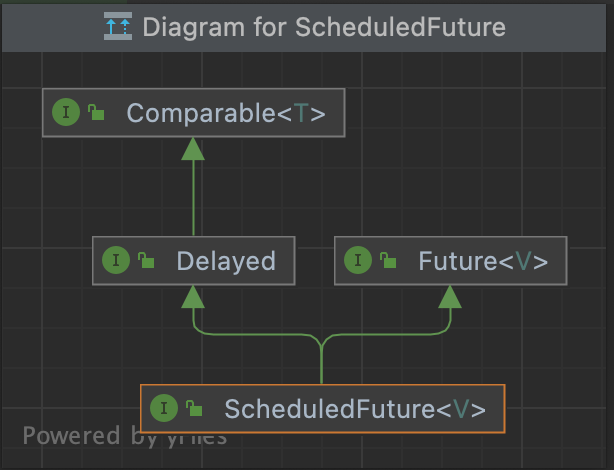

effective_java_제네릭
- 자바 5부터 시작
- 제네릭 지원전에는 컬렉션에서 객체를 꺼낼떄마다 형변환을 해야했고, 형변환 관련해서 실수가 있을시에 런타임에서나 알수 있었다
- 그러나, 제네릭을 사용하면서 컴파일러가 적절하게 알아서 형변환 코드를 추가 할 수 있을 뿐아니라, 컴파일타임에 엉뚱한 타입이 들어오면 에러를 뱉어준다

---

- 아이템26_로 타입은 사용하지 말라
  - 로 타입은 제네릭이 도래하기 전 코드와 호환되도록 하기위해 만든것이다. 
    - 추가로 호환성을 위해 제네릭 구현에는 소거(erasure) 방식을 사용
  - 로 타입을 쓰면 제네릭이 안겨주는 안전성과 표현력 모두 잃게된다 (로 타입을 쓰면 런타임에 예상치못한 예외를 마주할 수 있다. - 안전성 안좋음..)
    - `List` 와 `List<Object> 차이`
      - 타입파라미터를 사용하면 실제 타입파라미터가 Object라 할지라도 타입 안전성을 잡아줄 수 있다
        - 로 타입인 `List`의 하위 타입으로 `List<String>`이 될 수 있지만, `List<String>`과 `List<Object>` 와는 아무런 상관없는 관계!!
          - => ***제네릭의 하위타입 규칙***
      ```java
        public static void main(String[] args) {
            List rawTypeList = null;
            List<Object> parameterizedTypeList = new ArrayList<>();

            List<String> stringList = null;

            rawTypeList = stringList;
            // parameterizedTypeList = stringList; // 컴파일에러.. List<String>은 List의 하위 타입이지만, List<Object>의 하위타입은 아니기에.. 엄연히 둘은 다르다! 이런 부분이 제네릭을 사용하면 타입에 대한 안정성을 높여주는것!

            parameterizedTypeList.add(new ArrayList<String>()); // 물론 add로 집어넣는것은 문제없지..

            /////////////////////////////////////

            // 다른 예제
            List<String> strings = new ArrayList<>();

            unsafeAdd(strings,Integer.valueOf(30));
            
            String s = strings.get(0); // unsafeAdd에는 에러가 없지만 여기서 class cast exception 발생.. 결국 런타임시에 알 수 있는 예외가됨..

            // safeAdd(strings, Integer.valueOf(30)); // 컴파일 에러.. 이유는 위와 동일
        }

        private static void unsafeAdd(List list, Object val) {
            list.add(val);
        }

        private static void safeAdd(List<Object> list, Object val) {
            list.add(val);
        }
        
      ```
    - `List` 와 `List<?>`(비한정적 와일드카드 타입)의 차이
      - 로 타입 컬렉션에서는 아무거나 넣을 수 있으나, 와일드카드 타입에서는 null외에는 어떤 원소도 넣을 수 없다
        ```java
            List<?> wildcard = null;
            // wildcard.add("abc"); // 컴파일 에러.. 
            wildcard.add(null);
        ```
        - 
      - 또한 꺼낼수 있는 객체의 타입도 알 수 없다
      - 즉, 타입 불변식을 훼손하지 못하게 막았다.
      - 이런 제약이 불편하다면, 제네릭 메서드나 한정적 와일드카드 타입을 고려해볼 수 있다

  - 로 타입을 쓰는 예외
    - class 리터럴은 로 타입을 사용한다
      - class 리터럴은 `String.class`와 같이 xxx.class 형식으로 나타내는데, 매개변수화 타입(parameterized type)을 허용하지 못하게 했다 (배열과 기본 타입은 허용)
      - ex. `List.class`, `String[].class`, `int.class` 는 허용하나, `List<String>.class` 이렇게는 허용하지않는다
    - instanceof 연산자는 비한정적 와일드카드 타입 이외의 매개변수화 타입에는 적용 할 수 없다.
      - 런타임에 제네릭 타입 정보가 지워지므로 의미가 없음..
      - 비한정적 와일드카드를 사용할수 있긴하나, 로 타입과 완전 똑같이 진행되기때문에, 굳이 `<?>`를 집어넣지 말자..
      - 제네릭 타입에 instanceof를 사용하는 올바른 예
        ```java
            if (o instanceof Set) {
                Set<?> s = (Set<?>) o; // 이렇게 형변환해야 로 타입으로 사용안할 수 있다
                ...
            }

            // if( obj instanceof List<String> ) {} // 컴파일 에러남
        ```
  - 기타 팁
    - 용어정리
      - 제네릭 타입: 제네릭 클래스와 제네릭 인터페이스를 총칭
      - 제네릭 클래스 (혹은 제네릭 인터페이스): 클래스와 인터페이스 선언에 타입 매개변수가 쓰인것
        - 타입 매개변수(type parameter): `List<E>`의 E를 타입 매개변수라고함 (또한 E를 정규(formal)타입 매개변수라고도 함)
      - 매개변수화 타입 (parametered type): 타입 매개변수를 실제 타입으로 대체한 타입
        - ex. `List<String>` 은 원소의 타입이 String인 리스트를 뜻하는 매개변수화 타입이다
          - 여기서 String은 실제(actual) 타입 매개변수라고함 (정규 타입 매개변수가 구체화된 것)
      - 로 타입(raw type): 제네릭 타입에서 타입 매개변수를 전혀 사용하지 않을때를 말함 (다 로 타입이 아니라, 제네릭이 가능한것들이 전제인듯..)
      - 비한정적 와일드카드 타입(unbounded wildcard type): 제네릭 타입을 쓰고 싶지만, 실제 타입 매개변수가 무엇인지 신경쓰고 싶지 않을때 "?" 를 넣어서 사용
        - ex. `List<?>`
      - 한정적 와일드카드 타입(bounded wildcard type)
        - `List<E extends Number>`
      - 한정적 타입 매개변수 (bounded type parameter)
        - `<E extends Number>`
      - 재귀적 타입 한정 (recursive type bound)
        - `<T extends Comparable<T>>`
      - 타입토큰 
        - `String.class`, `Class<String>`
          - 타입 토큰과 클래스 리터럴과의 관계?
            - String.class가 String 클래스 리터럴인데, 이를 타입토큰으로 사용한다고 이해하면될듯..
            - 타입토큰은 런타임시에 타입정보를 알 수 없는 제네릭에 도움을 주기 위함이다
              - 이 타입 토큰은 `Class<T>` 객체를 활용..
                ```java
                  static class MyClass<T> {
                      Class<T> tClass; // 타입토큰.. 런타임시에 <T>는 소거되지만, tClass에 클래스에 대한 정보를 가지고 있기때문에, 아래 get 메서드에서 cast 해줄수 있다. 즉 타입토큰을 통해서 런타임시에도 안정적으로 캐스팅 가능!

                      public MyClass(Class<T> tClass) {
                          this.tClass = tClass;
                      }

                      public T get(Object obj){
                          return tClass.cast(obj);
                      }
                  }
                ```
      
    - 오류는 언제나 가능한 한 발생 즉시, 이상적으로는 컴파일 타임에 발견하는게 좋다!


---

- 아이템27_비검사 경고를 제거하라
  - **제네릭을 사용하게되면** 여러 비검사 경고를 볼 수 있다
    - 비검사 형변환 경고
    - 비검사 메서드 호출 경고
    - 비검사 매개변수화 가변인수 타입 경고
    - 비검사 변환 경고
    - 등..
  - 할 수 있는한 모든 비검사 경고를 제거하자!!
    - 그렇게 되었을때 타입 안정성이 보장!
      - 즉, 런타임에 ClassCastException이 발생할 일이 없다는것!
  - 만약 경고를 제거할 수는 없지만 타입 안전하다고 확신할 수 있다면 `@SuppressWarings("unchecked")` 에너테이션을 달아 경고를 숨기자
    - 타입 안전한 부분인데 이런 경고를 내버려두면, 나중에 진짜 경고를 놓치기 쉽다..
    - `@SuppressWarings("unchecked")`은 항상 가능한 한 좁은 범위에 적용하자
      - 이는 개별 지역변수부터 클래스 전체에 선언할 수 있는데(선언부에), 클래스 전체에 선언하게되면 심각한 경고를 놓칠수 있으니 범위는 최소한으로..
    - 그리고 이를 사용할때에는 비검사 경고를 무시해도 안전한 이유를 항상 주석으로 남겨야한다!

    - 예제에서는 ArrayList.toArray 를 소개해주고, 메서드레벨에 위의 어노테이션을 선언하지말고 지역변수로 선언하라고 하였는데, 실제 그렇게 구현되어있진않음.. 그리고 경고를 무시해도 안전한 이유가 별도로 적혀있지도않음..
      - 


---

- 아이템28_배열보다는 리스트를 사용하라
  - 배열과 리스트의 차이
    - 배열은 공변(함께변한다라는 뜻)이고 제네릭을 불공변이다
      - Sub가 Super의 하위타입일떄, `Sub[]`는 `Super[]`의 하위타입이다
      - Sub가 Super의 하위타입일떄, `List<Sub>` 과 `List<Super>` 는 아무런 관계가 없다
      - => 이에 따라 배열과 같은 공변은 타입캐스팅 관련하여 컴파일타임에는 인지하지못하고, 런타임에 에러가 유발될수있다..
        ```java
          Object[] objectArray = new Long[1];
          objectArray[0] = "이건 컴파일 타임에 안잡힌다"; // 런타임에 오류
        ```
    - 배열은 실체화(reify)되나, 제네릭은 타입정보가 런타임에 소거
      - 배열은 런타임에도 자신이 담기로 한 원소의 타입을 인지하고 확인한다
        - 그래서 런타임에 타입을 체크하기에 잘못된 타입이면 예외를 던진다..!
      - 제네릭은 타입정보가 런타임에 소거되는데, 즉, 타입을 컴파일타임에만 검사하며 런타임에는 알 수 없다
        - 이런 소거정책은 자바5가 제네릭으로의 전환을 순조롭게 하기위함..
    - => 이로인해 배열과 제네릭은 잘 어우러지지못함
      - ex. 배열은 제네릭 타입, 매개변수화 타입, 타입 매개변수로 사용불가. (`new List<E>[]`, `new List<String>[]`, `new E[]`)
        - <span style="color:red">근데 (T[]) 이런식으로 캐스팅은 가능.. List의 toArray 참고</span>
          - 그럼 결국 T는 소거되니깐, 컴파일 타임에만 보장해주는 그런건가..
        - 왜 그렇게 막았나?
          - 타입에 안전하지않기떄문..! 즉, 런타임에 ClassCastException이 발생! 이를 컴파일 타임에 막아보자로 제네릭을 만들었는데, 아래와 같은 상황이 생기면 런타임에 ClassCastException 예외발생할수 있음..! 그래서 아예 생성부터 안되게 막은것!!
            ```java
              List[] listArr = new List<String>[1];   // new List<String>이 가능해지면, 배열의 공변성질로 인해 이렇게 받을 수 있게되고..
              List<Integer> intList = Arrays.asList(1); // 사용자의 실수시작..
              listArr[0] = intList;              // 이게 될것이고.. 
              List<String> strList = (List<String>)listArr[0];  // 이렇게 캐스팅해도 문제가 없다고 생각할수 있을것이며
              String s = strList.get(0);                // 런타임시에 클래스 ClassCastException 예외 발생..! 

              // 아래는 이펙티브 책 예제 (위 내용과 비슷)
              List<String>[] stringLists = new List<String>[1];
              List<Integer> intList = List.of(42);
              Object[] objects = stringLists; // 배열의 공변성질로 가능
              objects[0] = intList;   // 컴파일타임에는 당연 에러없을것이고, 런타임에는 List<String>은 List가 되고, List<Integer>도 List가 되기떄문에 문제안생김
              String s = stringList[0].get(0); // ClassCastException 발생!
            ```
        - 제네릭 타입, 매개변수화 타입, 타입 매개변수은 실체화 불가 타입이라하는데, 실체화가 안되기때문에 런타임에는 컴파일타임보다 타입 정보를 적게 가지는 타입이된다 (런타임시에 타입이 소거되므로..!)
          - 예외가 있는데, 비한정적 와일드카드일 경우에는 매개변수화 타입가운데 실체화될 수 있다
            - 어차피 비한정적 와일드카드 타입은 타입을 알아야 할 수 있는동작(ex. List의 add)은 불가하고, 런타임시에 타입이 소거되어도 원래부터가 어떤 타입이던 상관없는 것이기에(컴파일 타임과 런타임에 타입 정보가 동일) 실체화 되었다고 표현한건가??
            - <span style="color:red"> 좀더 찾아보고 정리해보자</span>
          - 또한 그렇기에 배열을 비한정적 와일드카드 타입으로 만들수 있다 
            - `List<?>[] lists = new List<?>[3];`
  - 제네릭 배열 불가로 인해 나타나는 상황
    - 제네릭 컬렉션에서 자신의 원소타입을 담은 배열을 반환하는것은 보통 불가..
      - 하지만 이를 가능하게 할 수 있는데, 아이템 33에서 소개해준다함 (타입토큰 사용인듯)
    - 제네릭 타입과 가변인수 메서드를 함께 사용하는 경우 경고메세지 발생..
      - 가변인수 메서드를 호출하면, 가변인수 매개변수를 담을 배열이 하나 만들어지는데, 그 배열의 원소가 실체화불가 타입이라면 경고 발생
      - `@SafeVarargs` 선언하면 가능
  - 배열로 형변환할때 제네릭 배열 생성 오류나 비검사 형변환 경고가 뜨면, 배열인 `E[]` 대신 `List<E>` 를 사용해보자
    - 코드가 조금 복잡해지고, 성능이 살짝 나빠질 수도 있지만, 타입안정성과 상호운용성이 좋아짐
    ```java
      static class ChooserWithoutGeneric {
          private final Object[] choiceArray;

          public ChooserWithoutGeneric(Collection choices) {
              this.choiceArray = choices.toArray();
          }

          public Object choose() { // 이를 호출하면 클라이언트가 형변환을 계속 해주어야함.. 잠재적 형변환 오류 발생구역.. => 제네릭을 사용하자!!
              ThreadLocalRandom rnd = ThreadLocalRandom.current();
              return choiceArray[rnd.nextInt(choiceArray.length)];
          }
      }

      static class ChooserApplyGeneric_1<T> {
          private final T[] choiceArray;

          public ChooserApplyGeneric_1(Collection<T> choices) {
              this.choiceArray = (T[])choices.toArray(); // 컴파일에러는 없지만, unchecked cast 경고가 있음(런타임에 잠재적으로 ClassCastException 만날수있다는뜻) -> 즉, 컴파일러가 안전을 보장못한다는뜻.. 안전한게 확실하면 @SuppressWarnings("unchecked")를 달면되지만, 되도록 근본적인 해결로 경고를 없애자.
          }

          public T choose() {
              ThreadLocalRandom rnd = ThreadLocalRandom.current();
              return choiceArray[rnd.nextInt(choiceArray.length)];
          }
      }

      static class ChooserApplyGeneric_complete<T> {
          private final List<T> choiceArray;

          public ChooserApplyGeneric_complete(Collection<T> choices) {
              this.choiceArray = new ArrayList<>(choices); // 비검사형 경고를 완전히 제거하기위해 배열대신 아예 리스트로! 조금 더 느릴 수 있지만 런타임에 ClassCastException 만날리 없다~~
          }

          public T choose() {
              ThreadLocalRandom rnd = ThreadLocalRandom.current();
              return choiceArray.get(rnd.nextInt(choiceArray.size()));
          }
      }
    ```
  - 결론
    - 배열(공변, 실체화)은 런타임에 안전하고, 제네릭(불공변, 타입소거)은 컴파일 타임에 안전하다. 그래서 둘을 섞어쓰기는 쉽지않다. 하지만 둘을 섞어쓰다가 컴파일 오류나 경고를 만나면, 배열을 리스트로 대체하는 방법을 적용해보자
      - 컴파일 타임에 안전한거를 택하라는 뜻인듯..
  
  - 기타 팁
    - intellij에서 -Xlint:unchecked 옵션 적용하는방법?
      - 질문하자

---

- 아이템29_이왕이면 제네릭 타입으로 만들라
  - 클라이언트가 직접 형변환을 해야하는 일반 클래스가 있다면, 제네릭으로 전환하여 클라이언트가 직접 형변환을 할 필요없도록 하자!
  - 어떻게 하면되나?
    - 클래스 선언에 타입 매개변수 추가 (보통 E를 사용) 
    - 컴파일오류 나면 적절하게 처리하자
      - 특히, 실체화 불가타입은 배열을 만들수 없으니, 필요한곳에 적절한 형변환 필요
        - 파라미터 타입을 사용한 형변환시에 비검사예외가 발생할 수 있는데(런타임시에 파라미터 타입은 Object가 되므로) 그럴때 여러 테스트를 통해서 확실하게 캐스팅 가능한곳에 @SuppressWarnings("unchecked")를 선언해주자
      - 실체화 불가 타입으로 배열만들때 해결책
        - 제네릭 배열 생성을 금지하는 제약을 대놓고 우회
          - Object 배열을 생성한 다음 제네릭 배열로 형변환 (초기 배열을 생성할때 제네릭 배열로 캐스팅하므로, 멤버필드에 `Object[]`가 아닌, `E[]` 이렇게..)
          - ex. `elements = (E[]) new Object()[DEFAULT_INITIAL_CAPACITY] // 멤버변수에 "E[] elements" 로 선언`
          - 장점
            - 배열의 타입이 E[]로 선언되기때문에, E타입 인스턴스만 받는다는걸 확실히 보여줄 수 있음
            - 아예 배열을 생성할때 캐스팅을 해버리기떄문에 아래방법보다 코드가 짧다 
          - 단점
            - 배열의 런타임 타입이 컴파일 타임 타입과 달라 힙 오염을 일으킨다
              - Runtime시에 타입파라미터(E)는 모두 Object로 변환될텐데, E를 Object로 선언한게 아닌이상 런타임과 컴파일타임에 타입이 달라진다.
        - elements 필드의 타입을 E[]에서 Object[]로 놓고, 캐스팅 필요한곳에 적절히 형변환 할것
          - ex. stack구조
          ```java
            // Stack 내부
            class Stack<E> extends Vector<E> { // Vector를 상속한다..
                public synchronized E pop() {
                    E       obj;
                    int     len = size();

                    obj = peek();
                    removeElementAt(len - 1);

                    return obj;
                }

                public synchronized E peek() {
                    int     len = size();

                    if (len == 0)
                        throw new EmptyStackException();
                    return elementAt(len - 1);
                }
            }

            // Vector 내부
            public synchronized E elementAt(int index) {
                if (index >= elementCount) {
                    throw new ArrayIndexOutOfBoundsException(index + " >= " + elementCount);
                }

                return elementData(index);
            }

            @SuppressWarnings("unchecked") // ClassCastException이 일어날곳이 아니기에, 어노테이션을 선언해서 컴파일 경고메세지를 제거
            E elementData(int index) {
                return (E) elementData[index]; // elementData는 Object[] 이다.. 필요한곳에 elementData를 E로 캐스팅하고있다..
            }
          ```
          - 장점
            - 위의 단점과 반대로 Object배열을 멤버변수에 받으므로 런타임과 컴파일 타임에 타입이 다르지않다(힙오염을 일으키지않는다).
          - 단점
            - 배열에서 원소를 읽을때마다 형변환을 해주어야한다
  - 제네릭 타입은 타입 매개변수에 아무런 제약을 두지 않는다 (단, 기본타입은 사용할 수 없다)
    - `Stack<Object>, Stack<int[]>, Stack<List<String>>, Stack`
    - 기본타입 못쓰는거는 박싱된 기본타입으로~
    - 매개변수에 제약을 두는것도 가능
      - `class DelayQueue<E extends Delayed> implements BlockingQueue<E>`
        - E를 한정적 타입매개변수라고함
        - Delayed의 하위타입만 받음(Delayed 도 포함)

---

- 아이템30_이왕이면 제네릭 메서드로 만들라
  - 제네릭 메서드 어디서 많이보이나?
    - 매개변수화 타입(ex.`List<String>`)을 받는 정적 유틸리티 메서드
      - ex. Collections.binarySearch, sort
        ```java
          // Collections 내부
          public static <T extends Comparable<? super T>> void sort(List<T> list) {
              list.sort(null);
          }
        ```
  - 어떻게만드나?
    - 타입 매개변수 목록을 선언해주어야함
      - 메서드의 제한자와 반환 타입 사이에 온다
    - 위 sort 제네릭 메서드 참고 (`<T extends Comparable<? super T>>` 이게 타입 매개변수 목록)
  - 제네릭 싱글턴 팩터리?
    - 제네릭은 소거 정책으로 인해, 런타임시에 타입이 유지되지않는다. 달리말하면, 하나의 객체를 어떤 타입으로든 매개변수화 할 수 있다.(제네릭은 실체화가 되지않으니 가능한것..) 이를 위해 타입 매개변수에 맞게 매번 그 객체의 타입을 바꿔주는게 정적 팩터리가 필요한데, 이를 제네릭 싱글턴 팩토리 라고 한다
    ```java
      // Collections 내부
      @SuppressWarnings("unchecked") // (1)
      public static <T> Comparator<T> reverseOrder() { // 제네릭 싱글턴 팩토리
          return (Comparator<T>) ReverseComparator.REVERSE_ORDER; // (2)
      }

      private static class ReverseComparator implements Comparator<Comparable<Object>>, Serializable { // (3)
          // ...

          static final ReverseComparator REVERSE_ORDER = new ReverseComparator(); // 이건 여러번 생성될 필요가 없으니.. 싱글턴으로..

          public int compare(Comparable<Object> c1, Comparable<Object> c2) { // Comparator(Functional Interface) 구현부
              return c2.compareTo(c1);
          }

          // ...
      }

      (1) (Comparator<T>) 로인해 비검사 경고가 뜨나, 캐스팅해도 문제가되지않으므로 해당 어노테이션을 사용하여 비검사 형변환 경고를 없애자
      (2) 타입 매개변수에 맞게 매번 해당 객체의 타입으로 캐스팅해준다. 하지만 이를 사용하는 클라이언트가 Comparable를 구현한 구현체가 아닌걸 넣어도 여기서는 확인할 방법이없음.. 만약 Comparable 구현체가 아닌게 들어가서 비교하기 시작하면, 런타임에 compare 메서드를 호출할때 ClassCastException 떨어짐.
      => 이는 재귀적 타입한정을 사용했으면 해결되었을듯.. ex. <T extends Comparable<T>>
      (3) 여기 Comparator를 해석하면, Comparable을 구현한 Object를 비교하는 Comparator라고 읽을 수 있겠다.. 하지만, 런타임시에 <Comparable<Object>> 는 소거되고, 오직 Comparator만 남게된다. 컴파일러도 신경쓰는것은 Compartor일뿐, 소거되는 타입 파라미터인 Comparable<Object>는 구현부(ReverseComparator.compare)에서만 신경쓸뿐이다. 그래서 Comparator에 어떤 객체의 타입도 받아 줄 수 있게되었지만, 해당 객체가 Comparable의 구현체 인지까지는 확인못하여, 런타임시에 위에서 이야기한 ClassCastException이 나타날 수 있는것이다..


      ///////////////////////////////////
      // 위 사용 예시
      public static void main(String[] args) {
          Comparator<Temp> objectComparator = Collections.reverseOrder(); // Temp는 Comparable를 구현하게 아닌데도, 에러 안남
          Temp temp1 = new Temp();
          Temp temp2 = new Temp();

          int compare = objectComparator.compare(temp1, temp2); // 런타임시에 temp1, temp2는 Comparable이 아니기때문에 ClassCastException이 떨어짐
          System.out.println(compare);

          // 위의 문제를 아래로 개선가능..
          // Comparator<Temp> comparator = GenericMethod.reverseOrder(); // 컴파일에러.. Temp는 Comparable을 구현하지않았다..
          Comparator<ComparableTemp> comparator2 = GenericMethod.reverseOrder();
      }

      static class Temp { }

      static class ComparableTemp implements Comparable<ComparableTemp> {
          @Override
          public int compareTo(ComparableTemp o) {
              return 0;
          }
      }

      public static <T extends Comparable<T>> Comparator<T> reverseOrder() { // 재귀적 타입한정을 통해서 컴파일 타임에 타입파라미터에 제한을 둘 수 있다
          return (Comparator<T>) ReverseComparator.REVERSE_ORDER;
      }

      private static class ReverseComparator
              implements Comparator<Comparable<Object>>, Serializable { 

          static final ReverseComparator REVERSE_ORDER
                  = new ReverseComparator();

          public int compare(Comparable<Object> c1, Comparable<Object> c2) {
              return c2.compareTo(c1);
          }

          @Override
          public Comparator<Comparable<Object>> reversed() {
              return Comparator.naturalOrder();
          }
      }
    ```
    - 이렇게 쓰는이점?
      - 제네릭을 사용하여 타입선언만 하면, 적어도 컴파일타임에 타입을 지켜준다.. (추가적인 확장없이도..!)
      - 컴파일 타임에 타입정보를 계속 지켜낼 수 있다.. 중간중간에 사용자가 직접 캐스팅해서 실수를 범할 필요없이!
      - 팩토리 메서드에서 제네릭을 사용하는건데, 클라이언트는 타입선언만 해줌으로써 컴파일 타임에 리턴받은 인스턴스에 타입에 대한 안전성을 보장할 수 있다. 그래서 보통 제네릭 싱글턴 팩토리 내부에는 선언된 타입에 맞춰 캐스팅하는 로직이 있을것이며(이게 하나의 인스턴스를 가지고 캐스팅하여 사용함으로써, 선언한 파라미터 타입들을 컴파일 타임에 지켜주도록해줌), 매개변수화 타입은 Object로 선언되어있을 것이다.
  - 재귀적 타입한정
    - 자기 자신이 들어간 표현식을 사용하여, 타입 매개변수의 허용 범위를 한정가능
    - 주로 타입의 자연적 순서를 정하는 Comparable 인터페이스와 함께쓰이는 경우가 많음
      ```java
        // 러프하게 보는 Collections.max
        public static <E extends Comparable<E>> E max(Collection<E> c) { // 타입파라미터인 E는 비교할수있는 대상(Comparable을 구현한놈들)으로 한정한다고 해석가능. (타입 파라미터를 Comparable 구현체로 한정한다)
          //...
        }

        // Collections 실제 내부
        public static <T extends Object & Comparable<? super T>> T max(Collection<? extends T> coll) { 
            Iterator<? extends T> i = coll.iterator();
            T candidate = i.next();

            while (i.hasNext()) {
                T next = i.next();
                if (next.compareTo(candidate) > 0)
                    candidate = next;
            }
            return candidate;
        }

        // 내용 확인
        public static void main(String[] args) {
            // Collections.max 또한 재귀적 타입한정을 사용하여 타입 파라미터에 Comparable을 구현한 구현체가 아니면 타입파라미터에 못들어 오게하였다. 
            List<Integer> integers = Arrays.asList(3, 1, 5, 2, 10);
            Integer max = Collections.max(integers);

            List<Temp> temps = Arrays.asList(new Temp(), new Temp(), new Temp());
            // Temp max1 = Collections.max(temps); // 컴파일에러.. Temp는 Comparable을 구현하지않았기때문..
        }
      ```
    - 재귀적 타입한정을 또 사용하는 예
      - 와일드 카드를 사용한 번형 (아이템31)
      - <span style="color:red">시뮬레이트한 셀프 타입 관용구 (아이템2)</span>

---

- 아이템31_한정적 와일드카드를 사용해 API 유연성을 높여라
  - 파라미터화 타입은 불공변이니, 이를 유연하게 사용할 수 있도록 하기위해 한정적 와일드카드를 사용한다
    ```java
      // Stack 클래스에 
      class Stack<E> {
        // ...
        public void pushAll(Iterable<E> src) { // Iterable<E> "E의 Iterable" 이라는 뜻
          for (E e : src) {
            push(e);
          }
        }

        public void pushAll_비한정적와일드카드사용(Iterable<? extends E> src) { // Iterable<? extends E>은 "E의 하위타입의 Iterable" 이라는 뜻 (E 포함)
          for (E e : src) {
            push(e);
          }
        }

        public void popAll(Collection<E> dst) { // Collection<E> "E의 Collection" 이라는 뜻
          while (!isEmpty()) {
            dst.add(pop());
          }
        }

        public void popAll_비한정적와일드카드사용(Collection<? super E> dst) { // Collection<? super E>은 "E의 상위타입의 Collection" 이라는 뜻 (E 포함)
          while (!isEmpty()) {
            dst.add(pop());
          }
        }
        // ...
      }

      public static void main() {
        Stack<Number> stack;
        List<Integer> intList;
        stack.pushAll(intList); // 컴파일에러 Number는 Integer보다 상위 타입이므로 논리적으로는 가능해야할것 같지만, 제네릭은 불공변이기에 안된다!
        stack.pushAll_비한정적와일드카드사용(intList); // 가능! Number의 하위타입인 Integer의 Iterable이므로 가능!

        List<Object> objectList;
        stack.popAll(objectList); // 컴파일에러. Object는 Number보다 상위타입이므로 논리적으로는 가능해야할 것 같지만, 제네릭은 불공변이기에 안된다!
        stack.pushAll_비한정적와일드카드사용(objectList); // 가능! Number의 상위타입인 Object의 Collection 이므로 가능!

      }
      
    ```
  - 유연성을 극대화하기위해서는 원소의 생산자나 소비자용 입력 매개변수에 와일드 카드 타입을 사용하자!
    - 하지만 입력매개변수가 생산자와 소비자 역할을 동시에 한다면 와일드카드 타입을 써도 좋을게없다.. 타입을 정확히 지정해야하는 상황이다!
      - <span style="color:red">예시가 뭐가있을까?</span>
    - PECS로 외우자!
      - Producer - Extends (`<? extends T>`)
        - 파라미터화 타입 T가 생산자(제공자) 역할을 할때 (ex. Stack의 pushAll 메서드 - 인자로 넘겨주는 파라미터화 타입이 Stack에게 E인스턴스를 제공해준다, 생산해준다)
      - Consumer - Super (`<? super T>`)
        - 파라미터화 타입 T가 소비자 역할을 할때 (ex. Stack의 popAll 메서드 - 인자로 넘겨주는 파라미터화타입이 Stack으로부터 E인스턴스를 모조리 가져온다, 소비한다)
      - 사용하는 메서드 혹은 클래스의 주체로 부터 생산자인지 소비자인자를 파악하자..!
    - **반환타입에는 한정적와일드카드를 쓰면안된다!!**
      - 클라이언트코드에서 와일드카드 타입을 써야하기때문!
    - 클라이언트코드에서는 와일드카드 타입이 쓰였다는 사실조차 의식못하는게 베스트~
      - 클래스 사용자가 와일드카드 타입을 신경써야한다면 해당 API에 문제가 있을 가능성이 크다
    - PECS 두번 사용한 사례..
      - ex. 직접 구현한 다른 타입을 확장한 타입이 있을때, 이를 지원하기위해 와일드카드를 아래와 같이 사용가능..
        - Delay : `Comparable<T>`를 직접구현
        - ScheduledFuture : Delay를 확장
        - 
          ```java
              public static void main(String[] args) {
                  // 타입 파라미터 E 가 생산자(producer - 제공자) 역할이면 extend ( PE )
                  // 타입 파라미터 E 가 소비자(consumer) 역할이면 super ( CS )

                  List<ScheduledFuture<?>> list = null;

          //        E e = max_PECS적용안함(list); // 컴파일에러.. ScheduledFuture가 Comparable인데, ScheduledFuture에 직접 Comparable을 구현한게아닌, 이를 구현한 Delayed를 상속받아서 Comparable이 된다.. 그러나 제네릭에서는 PECS를 적용안하게되면 ScheduledFuture가 직접 Comparable을 구현해야만 컴파일 에러가 나지않는다(제네릭 특성인 불공변때문..)
                  ScheduledFuture<?> scheduledFuture = max_PECS적용(list); // Comparable<? super E> 이기때문에 가능.

                  List rawtypeList = new ArrayList();

                  swap(rawtypeList,1,2);
              }

              static <E extends Comparable<E>> E max_PECS적용안함(List<E> list) {
                  return null;
              }

              static <E extends Comparable<? super E>> E max_PECS적용(List<? extends E> list) {
                  // 파라머터로 넘겨받는 list는 E를 제공해주는 생산자 역할이므로 extends
                  // Comparable<E>는 E를 소비하는 역할이므로 super를 사용하여, Comparable<? super E>
                  // <E extends Comparable<? super E>> 라는 것은 E 라는 타입은 Comparable 타입으로 한정하는데, 이 Comparable은 E 포함해서 상위 타입이면 된다는 뜻. 즉, E포함 상위타입중 Comparable 타입이 있으면 된다는것!
                    // ~~컴파일러가 super 키워드가 있으면, 재귀로 상위를 찾을듯..~~
                  return null;
              }

              /* max_PECS적용 static 메서드 바이트코드
                static <E extends java.lang.Comparable<? super E>> E max_PECS적용(java.util.List<? extends E>);
                  descriptor: (Ljava/util/List;)Ljava/lang/Comparable;
                  flags: ACC_STATIC
                  Code:
                    stack=1, locals=1, args_size=1
                      0: aconst_null
                      1: areturn
                    LineNumberTable:
                      line 29: 0
                    LocalVariableTable:
                      Start  Length  Slot  Name   Signature
                          0       2     0  list   Ljava/util/List;
                    LocalVariableTypeTable:
                      Start  Length  Slot  Name   Signature
                          0       2     0  list   Ljava/util/List<+TE;>;
                  Signature: #35                          // <E::Ljava/lang/Comparable<-TE;>;>(Ljava/util/List<+TE;>;)TE;


                  // 마지막 Signature 부분의 chatGPT 설명
                  설명하자면:
                      1. <E::Ljava/lang/Comparable<-TE;>;>: 타입 매개변수 E를 정의하는 부분입니다. 여기서 E는 Comparable 인터페이스를 구현한 타입으로 제한되어 있습니다. Comparable 인터페이스는 -TE를 통해 하한 와일드카드(? super E)를 사용하여 표현되어 있습니다. 이는 E 타입 또는 그 하위 타입이 Comparable 인터페이스를 구현해야 함을 나타냅니다. // 하위타입이 아니라 상위타입인듯..
                      2. (Ljava/util/List<+TE;>;): 메서드의 매개변수를 나타냅니다. 이 경우 List를 매개변수로 받는데, 리스트의 요소 타입은 +TE로 표현됩니다. 이는 상한 와일드카드(? extends E)를 사용하여 E 타입 또는 그 상위 타입으로 지정됩니다. // 상위타입이 아니라 하위타입인듯..
                      3. TE;: 메서드의 리턴 타입입니다. 여기서는 E 타입을 반환한다는 것을 나타냅니다.
                      // T는 그냥 컴파일러가 붙여주는거 같은데, 리턴타입이 E가 아닌 TE라고 기록하는지 모르겠음.. 챗gpt가 이상하게 설명해준건지도 확인해봐야할듯.. (공식문서보자..)Signature

              */
          ```
  - 메서드 선언에 **타입 매개변수가 한번만 나오면** 와일드 카드로 대체하자
    - 신경써야할 타입 매개변수가 없다!
    - 비한정적 타입 파라미터면 비한정적 와일드카드로 교체하고, 한정적 타입 파라미터라면 한정적 와일드카드로 교체하자
    - 코드로 보자
      ```java
        public static <E> void swap_별로임(List<E> list, int i, int j) {
            list.set(i, list.set(j, list.get(i)));
        }

        public static void swap_wildcard사용(List<?> list, int i, int j) { // public api를 사용한다면 이렇게 작성하자
        //  list.set(i, list.set(j, list.get(i))); // 컴파일에러.. 와일드카드 타입일때 null 이외에는 set 불가. 이를 위해 swap_별로임 메서드를 private 도우미 메서드를 활용
            swap_별로임(list, i, j); // 추후 실제로 만들게되면 이 도우미 메서드는 private으로 변경되어야한다
        }

        public static void main(String[] args) {
            List<String> list = new ArrayList<>();
            ChangingToWildcard.<String>swap_별로임(list, 1, 3);
            // ChangingToWildcard.swap_별로임(list, 1, 3); 이것도 가능
            ChangingToWildcard.swap_wildcard사용(list, 1, 3);
        }
      ```
    - 이건 그렇게 이점이 있는지 모르겠음.. 자바8부터는 명시적 타입인수가 필요한것도 아니기에 "swap_별로임" 메서드와 "swap_wildcard사용" 메서드를 클라이언트 입장에서 큰 차이가 있는것 같지않음..
      - 물론, "swap_별로임" 메서드를 자동완성으로 볼때 `List<Object>`로 타입이 보이긴함..
  - 기타 팁
    - 명시적 타입 인수
      - ex. `Collections.<Integer>max(integers) // 제네릭 메서드에서 타입을 명시함`
    - 매개변수(parameter) vs 인수(argument)
      - 매개변수는 메서드 선언에 정의한 변수
      - 인수는 메서드 호출시 넘기는 실제값
      ```java
        class Set<T> {...} // T는 타입 매개변수(타입 파라미터)
        Set<Integer> s= ...; // Integer는 타입인수
      ```
    - **Comparable과 Comparator는 언제나 소비자다**
      - 즉, `Comparable<? super T>`, `Comparator<? super T>`로 사용하자!

---

- 아이템32_제네릭과 가변인수(varagrs)를 함께 쓸 때는 신중하라
  - 가변인수 메서드를 호출하면 가변인수를 담기 위한 배열이 자동으로 만들어지는데, 이때에 제네릭이나 매개변수화 타입이 포함되면 컴파일 경고가 나타나게된다
    - 즉, 실체화불가타입(제네릭 타입, 매개변수화 타입, 타입파라미터)으로 가변인수 매개변수를 선언하면 경고가나타난다
    - varagrs 매개변수로 실체화 불가타입을 선언했을때 나타나는 컴파일 경고와 위험성
      ```java
        static void dangerous(List<String> ... stringLists) { // Possible heap pollution from parameterized vararg type java.util.List<java.lang.String>
            Object[] objects = stringLists; // 배열은 공변이니 가능
            List<Integer> integers = Arrays.asList(1, 2);
            objects[0] = integers; // 힙 오염

            String s = stringLists[0].get(0); // ClassCastException 발생 (컴파일러가 String으로 자동 타입캐스팅이 이루어짐..)
        }

        public static void main(String[] args) {
            dangerous(Arrays.asList("hi")); // 컴파일러가 제네릭 가변인수 메서드를 호출하는 쪽에서도 경고를 준다. => java: unchecked generic array creation for varargs parameter of type java.util.List<java.lang.String>[]
        }
      ```
  - 제네릭 배열을 직접 생성하지는 못하는데, 제네릭 varargs 매개변수를 받는 메서드를 선언 할 수 있도록 하는 이유?
    - 제네릭이나 매개변수화 타입의 varargs 매개변수를 받는 메서드가 실무에서 유용하기때문에 이 모순을 수용하기로..
    - ex. `Arrays.asList(T... a), Collections.addAll(Collection<? super T> c, T... elements), Enumset.of(E first, E... rest)`
    - `@SafeVarargs` 추가 (이건 주요이유는 아니고, 이를 통해서 좀 더 사용하기가 좋아졌다 정도로 이해하면될듯)
      - 제네릭 가변인수를 가진 메서드에서 경고가 나타는것뿐아니라, 사용하는 사용자에게도 항상 경고를 보여주었는데, 해당 어노테이션을 통해서 클라이언트에게 컴파일러의 경고를 숨길 수 있게됨
      - 그렇기에 더욱 확실히 문제없을때만 사용하도록..
  - 제네릭 배열을 만드는 제네릭 varargs 매개변수를 가진 메서드를 어떻게 안전하게 사용할 수 있을까?
    - 해당 메서드가 제네릭 배열에 아무것도 저장하지않고 (그 매개변수들을 덮어 쓰지않고 - 위의 dangerous 메서드 예처럼쓰면안됨..)
    - 그 배열의 참조가 밖으로 노출되지 않는다면 안전
    - 즉, varargs 매개변수 배열이 **인수들을 전달하는 역할**만 한다면 문제없다!
    - 위험한 코드..
      - 제네릭 varargs 매개변수 배열에 다른 메서드가 접근하도록 허용하면 안전하지않다
      ```java

        static <T> T[] toArray(T ... args) { // T가 Object이면 Object 배열로 생성된 args가 오고, T가 String이면 String 배열로 생성된 args가 넘어온다. 물론 런타임에 T는 Object이나 args는 나 자신의 구체적인 배열타입을 알고 있다
            return args; // 제네릭 배열의 참조가 밖으로 노출..
        }

        static <T> T[] pickTwo(T a, T b, T c) {
            switch(ThreadLocalRandom.current().nextInt(3)) {
                case 0: return toArray(a, b); // 여기서 toArray는 T라는 타입을 알 수 없으니 모두 받을 수 있또록 varargs는 Object[] 을 생성하게된다.. 즉, pickTwo는 항상 Object[]를 반환.. 그렇게되니, T가 String이라면 picktwo를 호출하는 코드에 String[]로 캐스팅하도록 컴파일러가 만들어줄텐데, 그때에 Object[]을 String[]로 캐스팅할 수 없으므로 캐스팅 에러가나게되는것!
                case 1: return toArray(a, c);
                case 2: return toArray(b, c);
            }

            throw new AssertionError();
        }

        public static void main(String[] args) {
            String[] strings = pickTwo("a", "b", "c"); // 런타임에러.. cast 할 수 없다고함..
        }
      ```
      - 하지만, 아래 상황에서는 또 안전하다
        - `@SafeVarargs`로 제대로 애노테이트된 또 다른 varargs 메서드에 넘기는것은 안전
        - 그저 이 배열 내용의 일부함수를 호출만 하는(varargs를 통짜로 받지않는) 일반 메서드에 넘기는 것도 안전
        - 안전하게쓴 예제 코드
          ```java
             @SafeVarargs
              static <T> List<T> flatten(List<? extends T>... lists) { // 제네릭 varargs 매개변수를 안전하게 사용하는 메서드
                  List<T> result = new ArrayList<>();
                  for (List<? extends T> list : lists) {
                      result.addAll(list);
                  }
                  
                  return result;
              }

              static <T> List<T> flatten_list반환버전(List<List<? extends T>> lists) { // List로 변환하였기때문에 직접 @SafeVarargs를 선언할 필요없다. 물론, 타입 안전하다~. 다만 클라이언트 코드가 약간 지저분해질수있고(List.of()와 같은걸로 한번 묶어줘야..) 속도가 조금 느려질 수 있다
                  List<T> result = new ArrayList<>();
                  for (List<? extends T> list : lists) {
                      result.addAll(list);
                  }

                  return result;
              }
          ```
  - 기타 팁
    - 힙 오염 (heap pollution) : 매개변수화 타입의 변수가 타입이 다른 객체를 참조하는것
    - 가변인수는 자신이 알 수 있는 가장 구체 타입의 배열을 만들어 주는듯..
      - ex. `Serializable[] serializables = toArray("a", "b", 1); // int와 문자열이 동시에 있으니, 이들의 공통중에 가장 구체타입인 Serializable로 배열을 만들어준다`
    - 배열간의 형변환
      ```java
          Object obj1 = "a";
          Object obj2 = "a";
          Object obj3 = "a";
          Object[] objects = toArray(obj1, obj2, obj3);

          // obj1의 class String이 맞으나, obj1,obj2,obj3을 기반으로 Object배열을 생성햇을때, 이를 String 배열로 캐스팅은 안된다! 
          // (String[]) new Object[]{obj1, obj2, obj3} - 런타임에러
          // 어찌보면 당연히 안되는것.. 배열또한 하나의 클래스로 생성된것인데, 배열안에 담긴 내용물이 같다고해서 캐스팅이 되어야하는건 말이안됨.. (헷갈리지말자;)

          // String[] strings = (String[]) objects; // 런타임에러
          System.out.println((String) objects[0]); // 이렇게 캐스팅은 당연 문제없음
          String[] strings = toArray("a","b","c");
          Object[] o = strings;  // 배열은 공변이기에 이것도 문제없음

      ```

---

- 아이템33_타입 안전 이종 컨테이너(type safe heterogeneous container)를 고려하라
  - 컬렉션 API로 대표되는 일반적인 제네릭 형태에서는 한 컨테이너가 다룰 수 있는 타입 매개변수의 수가 고정되어있는데(ex. `Set<T>`은 하나의 타입 매개변수, `Map<K,V>`은 두개의 타입 매개변수 사용), 여러 타입을 넣는 유연성을 가져가게 하기위해서 타입 안전 이종 컨테이너 패턴을 사용한다.
    - 키를 매개변수화하여, 컨테이너에 값을 넣거나 뺄때 매개변수화한 키를 함께 제공
      - 여기서 키는 각 타입의 Class객체를 활용. 이 Class 객체는 class 리터럴(ex. String.class)을 사용해서 얻을수 있으며 `Class<T>` 인 제네릭 타입으로 선언된다. 
      - 반드시 Class 객체를 사용하는것은 아니고, 직접 구현할 수도 있다함.
  - 코드로 보자
    ```java
        static class Favorites {
            private Map<Class<?>, Object> favorites = new HashMap<>(); // (1)
            // private Map<?, Object> favorites = new HashMap<>(); // (2)

            public <T> void putFavorite(Class<T> type, T instance) { // (4)
                favorites.put(type, instance);
    //            favorites.put(type, type.cast(instance)); // (3)
            }

            public <T> T getFavorite(Class<T> type) {
                return type.cast(favorites.get(type));
            }

            /*
            (1) Map이 아니라, Key(Class)에 와일드카드타입이 있는것! => 키가 서로다른 매개변수화 타입이므로 여러 타입을 받을 수 있게됐다!
            (2) 이렇게되면 Map이 와일드카드타입이기때문에 key에 null외에는 못들어간다..
            (3) Favorites가 타입불변식을 어기는 일이 없도록 보장하려면 value에 cast를 사용하면된다!
              - cast는 형변환 연산자의 동적 버전.. (즉, 런타임시에 가능한..)
              - 로타입 혼용해서 쓰다가 타입 잘못 넣는것 방지가능. 즉, 런타임에 타입 안정성 확보
              - 이게 가능한것은 결국 런타임에도 타입토큰을 통해서 정보를 알고있기때문에, 컴파일타임과 런타임에 타입정보를 동일하게 가지는 즉, 실체화가 가능하기때문이다
            (4) 실체화 불가타입은 클래스 리터럴 사용불가한 제약이 있음 List<String>.class 나 List<Integer>.class는 모두 불가..
              - 슈퍼타입 토큰으로 어느정도해결.. (완벽히는 해결못한다는데, 한계점은 찾아보자..)


            */
        }

        public static void main(String[] args) {
            Favorites favorites = new Favorites();
            favorites.putFavorite((Class) Integer.class, "hi"); // 컴파일 경고뜸

            /////////////
            Set<String> strings = Collections.checkedSet(new HashSet<>(), String.class);

            /*
            // CheckedCollection 내부
            static class CheckedCollection<E> implements Collection<E>, Serializable {
                // ...
                @SuppressWarnings("serial") // Conditionally serializable
                final Class<E> type;

                // ...

                public boolean add(E e)          { return c.add(typeCheck(e)); }

                @SuppressWarnings("unchecked")
                E typeCheck(Object o) {
                    if (o != null && !type.isInstance(o))       // 실체화 하는곳.. 이를 통해서 클라이언트가 제네릭과 로타입을 섞어쓸때에 잘못된 타입의 원소를 넣지 못하게 추적하는데 도움을 준다
                        throw new ClassCastException(badElementMsg(o));
                    return (E) o;           // type.cast 를 사용하진않음..
                }

                // ...
            }

            */
        }
    ```
  - 한정적 타입토큰(class 리터럴사용)을 받는데, 비한정적 타입토큰은 어떻게 넘겨줄수 있을까? 
    ```java 
    static Annotation getAnnotation(AnnotationElement element, String annotationTypeName) {
        Class<?> annotationType = null;
        try {
            annotationType = Class.forName(annotationTypeName);
        } catch (ClassNotFoundException e) {
            throw new RuntimeException(e);
        }

      // return element.getAnnotation(annotationType); // (1)
        return element.getAnnotation(annotationType.asSubclass(Annotation.class)); // (2)

        /*
        (1) element.getAnnotation은 매개변수로 한정적 타입토큰(Class<? extends Annotation>)을 사용하기때문에, Class<?> 타입이 인자로들어오려하면 컴파일 에러가 난다
        (2) Class 클래스는 asSubclass 메서드를 통해서 인자로 들어오는 타입의 클래스로 동적 형변환(Class<? extends U>)을 해준다 (여기서 형변환 된다는것은 annotationType 클래스가 Annotation 클래스의 하위클래스라는뜻)
         */
    }
    ```
  - 기타 팁
    - 이종: 여러 다른 종류
    - 타입토큰: 컴파일타임 타입정보와 런타임 타입 정보를 알아내기 위해 메서드들이 주고받는 class 리터럴을 타입토큰이라 한다.
    - 한정적 타입토큰: 한정적 타입 파라미터나 한정적 와일드카드를 사용하여 표현 가능한 타입을 제한하는 타입토큰
      - 어노테이션 API에서 적극 사용 (ex. AnnotationElement)
    - System.out.printf에서 %n을 사용하면, 플랫폼에 맞는 줄바꿈 문자로 알아서 전환된다 (물론, \n을 써도됨)