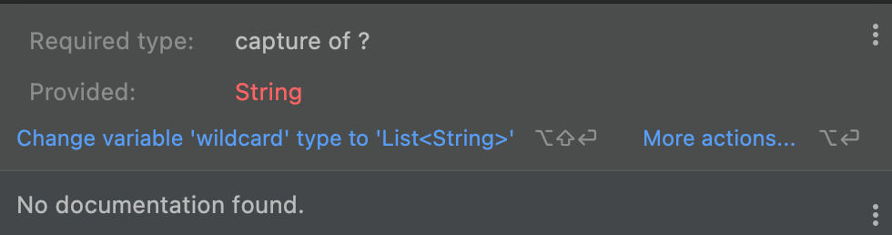
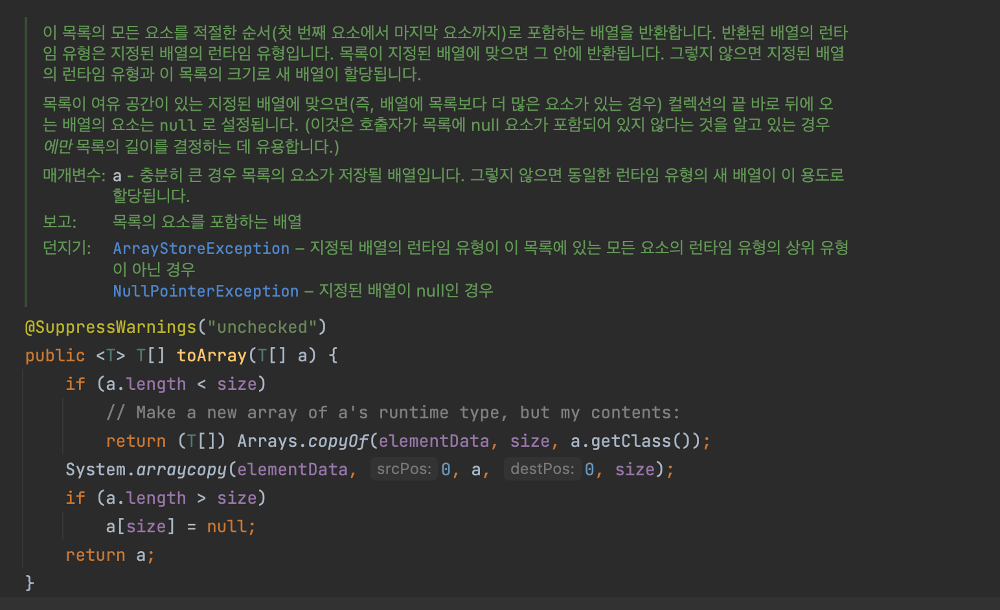

effective_java_제네릭
- 자바 5부터 시작
- 제네릭 지원전에는 컬렉션에서 객체를 꺼낼떄마다 형변환을 해야했고, 형변환 관련해서 실수가 있을시에 런타임에서나 알수 있었다
- 그러나, 제네릭을 사용하면서 컴파일러가 적절하게 알아서 형변환 코드를 추가 할 수 있을 뿐아니라, 컴파일타임에 엉뚱한 타입이 들어오면 에러를 뱉어준다

---

- 아이템26_로 타입은 사용하지 말라
  - 로 타입은 제네릭이 도래하기 전 코드와 호환되도록 하기위해 만든것이다. 
    - 추가로 호환성을 위해 제네릭 구현에는 소거(erasure) 방식을 사용
  - 로 타입을 쓰면 제네릭이 안겨주는 안전성과 표현력 모두 잃게된다 (로 타입을 쓰면 런타임에 예상치못한 예외를 마주할 수 있다. - 안전성 안좋음..)
    - `List` 와 `List<Object> 차이`
      - 타입파라미터를 사용하면 실제 타입파라미터가 Object라 할지라도 타입 안전성을 잡아줄 수 있다
        - 로 타입인 `List`의 하위 타입으로 `List<String>`이 될 수 있지만, `List<String>`과 `List<Object>` 와는 아무런 상관없는 관계!!
          - => ***제네릭의 하위타입 규칙***
      ```java
        public static void main(String[] args) {
            List rawTypeList = null;
            List<Object> parameterizedTypeList = new ArrayList<>();

            List<String> stringList = null;

            rawTypeList = stringList;
            // parameterizedTypeList = stringList; // 컴파일에러.. List<String>은 List의 하위 타입이지만, List<Object>의 하위타입은 아니기에.. 엄연히 둘은 다르다! 이런 부분이 제네릭을 사용하면 타입에 대한 안정성을 높여주는것!

            parameterizedTypeList.add(new ArrayList<String>()); // 물론 add로 집어넣는것은 문제없지..

            /////////////////////////////////////

            // 다른 예제
            List<String> strings = new ArrayList<>();

            unsafeAdd(strings,Integer.valueOf(30));
            
            String s = strings.get(0); // unsafeAdd에는 에러가 없지만 여기서 class cast exception 발생.. 결국 런타임시에 알 수 있는 예외가됨..

            // safeAdd(strings, Integer.valueOf(30)); // 컴파일 에러.. 이유는 위와 동일
        }

        private static void unsafeAdd(List list, Object val) {
            list.add(val);
        }

        private static void safeAdd(List<Object> list, Object val) {
            list.add(val);
        }
        
      ```
    - `List` 와 `List<?>`(비한정적 와일드카드 타입)의 차이
      - 로 타입 컬렉션에서는 아무거나 넣을 수 있으나, 와일드카드 타입에서는 null외에는 어떤 원소도 넣을 수 없다
        ```java
            List<?> wildcard = null;
            // wildcard.add("abc"); // 컴파일 에러.. 
            wildcard.add(null);
        ```
        - 
      - 또한 꺼낼수 있는 객체의 타입도 알 수 없다
      - 즉, 타입 불변식을 훼손하지 못하게 막았다.
      - 이런 제약이 불편하다면, 제네릭 메서드나 한정적 와일드카드 타입을 고려해볼 수 있다

  - 로 타입을 쓰는 예외
    - class 리터럴은 로 타입을 사용한다
      - class 리터럴은 `String.class`와 같이 xxx.class 형식으로 나타내는데, 매개변수화 타입(parameterized type)을 허용하지 못하게 했다 (배열과 기본 타입은 허용)
      - ex. `List.class`, `String[].class`, `int.class` 는 허용하나, `List<String>.class` 이렇게는 허용하지않는다
    - instanceof 연산자는 비한정적 와일드카드 타입 이외의 매개변수화 타입에는 적용 할 수 없다.
      - 런타임에 제네릭 타입 정보가 지워지므로 의미가 없음..
      - 비한정적 와일드카드를 사용할수 있긴하나, 로 타입과 완전 똑같이 진행되기때문에, 굳이 `<?>`를 집어넣지 말자..
      - 제네릭 타입에 instanceof를 사용하는 올바른 예
        ```java
            if (o instanceof Set) {
                Set<?> s = (Set<?>) o; // 이렇게 형변환해야 로 타입으로 사용안할 수 있다
                ...
            }

            // if( obj instanceof List<String> ) {} // 컴파일 에러남
        ```
  - 기타 팁
    - 용어정리
      - 제네릭 타입: 제네릭 클래스와 제네릭 인터페이스를 총칭
      - 제네릭 클래스 (혹은 제네릭 인터페이스): 클래스와 인터페이스 선언에 타입 매개변수가 쓰인것
        - 타입 매개변수(type parameter): `List<E>`의 E를 타입 매개변수라고함 (또한 E를 정규(formal)타입 매개변수라고도 함)
      - 매개변수화 타입 (parametered type): 타입 매개변수를 실제 타입으로 대체한 타입
        - ex. `List<String>` 은 원소의 타입이 String인 리스트를 뜻하는 매개변수화 타입이다
          - 여기서 String은 실제(actual) 타입 매개변수라고함 (정규 타입 매개변수가 구체화된 것)
      - 로 타입(raw type): 제네릭 타입에서 타입 매개변수를 전혀 사용하지 않을때를 말함 (다 로 타입이 아니라, 제네릭이 가능한것들이 전제인듯..)
      - 비한정적 와일드카드 타입(unbounded wildcard type): 제네릭 타입을 쓰고 싶지만, 실제 타입 매개변수가 무엇인지 신경쓰고 싶지 않을때 "?" 를 넣어서 사용
        - ex. `List<?>`
      - 한정적 와일드카드 타입(bounded wildcard type)
        - `List<E extends Number>`
      - 한정적 타입 매개변수 (bounded type parameter)
        - `<E extends Number>`
      - 재귀적 타입 한정 (recursive type bound)
        - `<T extends Comparable<T>`
      - 타입토큰 
        - `String.class`, `Class<String>`
          - 타입 토큰과 클래스 리터럴과의 관계?
            - String.class가 String 클래스 리터럴인데, 이를 타입토큰으로 사용한다고 이해하면될듯..
      
    - 오류는 언제나 가능한 한 발생 즉시, 이상적으로는 컴파일 타임에 발견하는게 좋다!


  ---

  - 아이템27_비검사 경고를 제거하라
    - **제네릭을 사용하게되면** 여러 비검사 경고를 볼 수 있다
      - 비검사 형변환 경고
      - 비검사 메서드 호출 경고
      - 비검사 매개변수화 가변인수 타입 경고
      - 비검사 변환 경고
      - 등..
    - 할 수 있는한 모든 비검사 경고를 제거하자!!
      - 그렇게 되었을때 타입 안정성이 보장!
        - 즉, 런타임에 ClassCastException이 발생할 일이 없다는것!
    - 만약 경고를 제거할 수는 없지만 타입 안전하다고 확신할 수 있다면 `@SuppressWarings("unchecked")` 에너테이션을 달아 경고를 숨기자
      - 타입 안전한 부분인데 이런 경고를 내버려두면, 나중에 진짜 경고를 놓치기 쉽다..
      - `@SuppressWarings("unchecked")`은 항상 가능한 한 좁은 범위에 적용하자
        - 이는 개별 지역변수부터 클래스 전체에 선언할 수 있는데(선언부에), 클래스 전체에 선언하게되면 심각한 경고를 놓칠수 있으니 범위는 최소한으로..
      - 그리고 이를 사용할때에는 비검사 경고를 무시해도 안전한 이유를 항상 주석으로 남겨야한다!

      - 예제에서는 ArrayList.toArray 를 소개해주고, 메서드레벨에 위의 어노테이션을 선언하지말고 지역변수로 선언하라고 하였는데, 실제 그렇게 구현되어있진않음.. 그리고 경고를 무시해도 안전한 이유가 별도로 적혀있지도않음..
        - 
