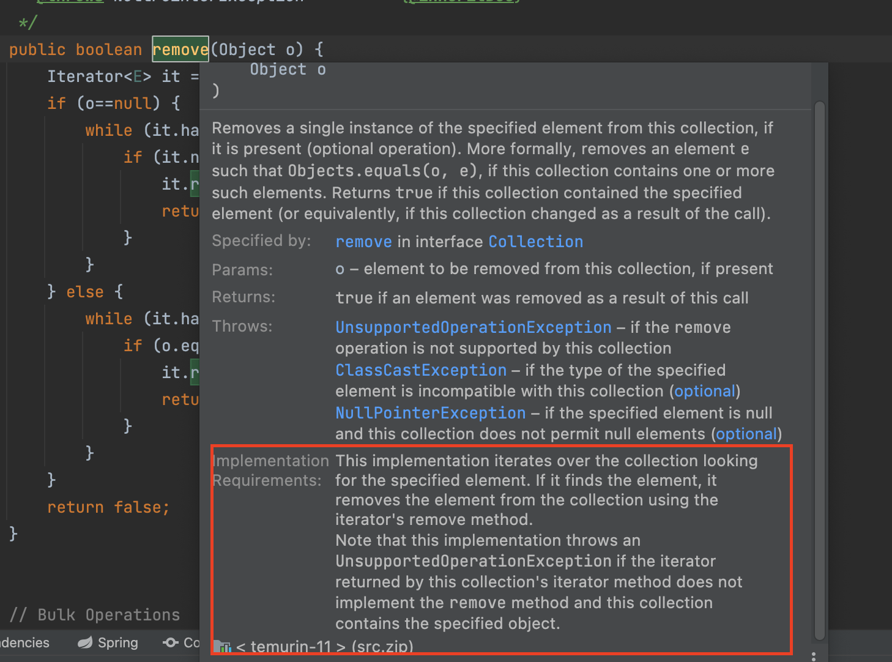

effective_java_클래스와_인터페이스

- 아이템15_클래스와 멤버의 접근 권한을 최소화하라
  - 잘 설계된 컴포넌트는 모든 내부구현을 완벽히 숨긴다. 오직 API를 통해서만 다른 컴포넌트와 소통하고 서로의 내부동작엔 전혀 개의치 않는다
    - 이를 정보은닉 혹은 캡슐화라고 한다
  - 정보은닉의 장점
    - 시스템 개발 속도 높인다. 여러 컴포넌트 병렬로 개발가능
      - 상호간 영향이 없기때문! 있어도 API(인터페이스)만 호출하면되니깐
    - 시스템 관리 비용 낮출수있음. 각 컴포넌트에 대한 디버깅이 용이하고 다른 컴포넌트로의 교체하는 부담도 적기때문
    - 성능 최적화 도움됨. 완성된 시스템 프로파일링한 후 최적화할 컴포넌트 찾아서, 해당 컴포넌트만 최적화 할 수 있기때문
    - 소프트웨어 재사용성 높임. 독자적으로 동작할 수 있는 컴포넌트라면, 컴포넌트를 가지고 어느곳에서든지 쉽게 활용 가능
    - 큰 시스템을 제작하는 난이도 낮춤. 시스템 전체가 아직 완성 안되었어도 개별 컴포넌트의 동작을 검증가능
      - 테스트 용이
    - => 정보은닉이 잘 되어잇다는것은 컴포넌트들을 서로 독립시켜서 개발, 테스트, 최적화, 적용, 분석, 수정을 개별적으로 할 수 있다는 뜻이다
  - 자바는 정보은닉을 위해 그 요소가 **선언된 위치** + **접근제한자** 를 활용하여 접근 제어를 하게되는데, 그중 접근제한자를 제대로 활용하는게 중요!
    - 기본원칙
      - ***모든 클래스와 멤버위 접근성을 가능한 한 좁혀야한다***
        - 소프트웨어가 올바로 동작하는 한 항상 가장 낮은 접근 수준을 부여!
    - top level class(가장 바깥의 클래스), 인터페이스에 부여할 수 있는 접근 수준: public, package-private 
      - top level class(가장 바깥의 클래스) 또는 인터페이스에서는 패키지를 외부에서 쓸 이유가 없다면 package-private으로 선언하자
        - 그래야 클라이언트들에게 아무런 피해없이 자유롭게 내부 구현을 수정 가능하다
        - public으로 하면 API가 되므로 하위호환을 위해 계속 관리필요..
    - 멤버(필드, 메서드, 중첩클래스, 중첩 인터페이스)에 부여할 수 있는 접근 수준: private, package-private, protected, public
      - package-private은 아무것도 명시하지않았을때 적용되는수준인데, 인터페이스의 멤버같은 경우는 명시하지않아도 항상 public이다
      - 공개 api를 세심하게 설계후, 그 외의 모든 멤버는 private으로!
        - 권한을 계속해서 풀어주는(즉, public 쪽으로 넓혀지는) 일이 반복된다면, 컴포넌트를 더 분해해야하는지 고민할것
      - private과 package-private은 공개 API에 영향을 주지않는다
        - 그러나 Serializable을 구현한 클래스에서는 private 필드더라도, 공개 API와 같이 여겨질수 있는데, 이는 역직렬화를 사용하고있는 곳이 있다면 해당 클래스를 변경하면 안되기때문이다..
      - protected 또한 공개 API이므로 영원히 지원필요
        - 그렇기에 적을수록 좋다..
      - 상위클래스의 메서드를 재정의할때 그 접근수준을 상위클래스에서보다 좁게 설정불가
        - 리스코프 치환원칙때문
          - 상위클래스의 인스턴스는 하위 클래스의 인스턴스로 사용가능 (상위 클래스에서 정의한게 하위클래스에서 사용못하면안된다..) => 아이템10
      - 테스트를위해 private 멤버를 package-private까지 허용하는것은 괜춘
      - public 클래스의 인스턴스 필드는 public 으로 선언 NO
        - 불변식보장안됨
        - 스레드에 안전하지않음
        - 혹여 final에 불변객체다 할지라도, 이미 공개api가 되어버렸기때문에 public 필드를 없애는 리팩토링 불가
        - 예외  
          - 상수는 괜춘(대문자 알파벳, 단어사이에 _)
          - 반드시 기본 타입 값 이거나 불변객체여야함
      - 클래스에서 *public* static final 배열 필드를 두거나 이 *필드를 반환하는 접근자 메서드*를 제공해서는 안된다
        ```java
            // 좋지 않은 예
            public static final Thing[] VALUES = {...};

            // 좋은 예1
            private static final Thing[] PRIVATE_VALUES = {...};
            public static final List<Thing> VALUES = Collections.unmodifialbeList(Arrays.asList(PRIVATE_VALUES));

            // 좋은 예2
            private static final Thing[] PRIVATE_VALUES = {...};
            public static final Thing[] values() {
                return PRIVATE_VALUES.clone();
            } 
        ```
      - 자바 9에서는 모듈이라는 개념이 추가되면서 2가지 암묵적 접근 수준이 추가
        - 모듈은 자신이 가지고 있는 패키지를 외부에 공개(export)할 것인지를 정의할 수 있는데, export하지 않으면, protected나 public으로 선언했을지라도 모듈 외부에서는 접근 할 수 없다
        - 여기서 외부에 공개되지않은 protected, public 이 두가지가 암묵적 접근 수준

---

- 아이템16_public 클래스에서는 public 필드가 아닌 접근자 메서드를 사용하라
  - public 클래스에서 public 필드를 사용하면 아래와 같은 단점이 있다 (캡슐화의 이점을 다 잃어버림)
    1. API를 수정하지 않고는 내부 표현을 바꿀수 없다
    2. 불변식 보장 불가
    3. 외부에서 필드 접근시 부수작업 수행 불가 
       - 이로인해 부수작업에 대한 동일한 코드가 여기저기 중복될수 있음..
  - 패키지 바깥에서 접근할 수있는 클래스(public 클래스)라면 접근자를 제공함으로써 클래스 내부 표현 방식을 언제든 바꿀수 있는 유연성을 가져갈 수 있다
    - 그러나, public 클래스가 필드도 public으로 공개하면, 이를 사용하는 클라이언트가 생겨나기때문에 내부 표현 방식을 마음대로 바꿀 수 없게된다..
  - package-private 클래스 혹은 private 중첩클래스면 데이터 필드를 노출한다 해도 문제가 없다
    - package-private 클래스는 어차피 같은 패키지 내부에서만 노출되므로.. 클라이언트 또한 같은 패키지 내에서만 있게되므로 문제가 없음
  - 그럼 불변이면 public 필드로 둬도 괜찮나?
    - 위의 1번과 3번에 대한 단점은 여전히 존재..

---

- 아이템17_변경 가능성을 최소화하라
  - 불변 클래스: 인스턴스의 내부 값을 수정할 수 없는 클래스
    - ex
      - String, 기본 타입의 박싱된 클래스들, BigInteger, BigDecimal
    - 왜 쓰나?
      - 불변 클래스는 가변 클래스보다 설계하고 구현하고 사용하기 쉬우며, 오류가 생길 여지도 적고 훨씬 안전!!
    - 불변으로 만들려면?
      - 객체의 상태를 변경하는 메서드(변경자)를 제공하지 않는다
      - 클래스를 확장할 수 없도록 한다
        - 상속못하도록..
        - final class..
        - 생성자를 private이나 protected로 놓고 정적팩터리 제공
      - 모든 필드를 final로 선언한다
        - 설계자의 의도를 명확히 드러내는 방법
        - 멀티스레드에 안전!
      - 모든 필드를 private으로 선언한다
        - 클라이언트가 직접 필드로 접근 못하도록..
        - 만약 불변객체나 기본타입필드를 public final로 제공해도 불변이되지만, 다음 릴리즈에서 내부 표현을 변경할수없으므로 권하지않음
      - 자신 외에는 내부의 가변 컴포넌트에 접근할 수 없도록 한다
        - 클라이언트는 내부 가변 객체에 참조를 얻을수 없도록해야한다 (가변 객체를 그대로 getter로 반환해주면안된다..)
        - 반대로 클라이언트가 제공한 객체 참조를 가리키게 해서도 안된다
        - 생성자, 접근자, readObject 메서드 모두에서 방어적 복사를 수행해야한다!
  - 불변 클래스 특징 및 추가로 고려하면좋은점?
    - 함수형 프로그래밍이여서 자신의 상태값이 변화되는것이 아닌, 새로운 불변객체를 반환해준다
      - 명령형이나 절차형 프로그래밍은 자신의 상태값을 변경한다
    - 전치사를 활용!
      - ex. add 대신 plus
        - BigInteger나 BigDecimal은 add를 제공해주고있는데, 이는 명명 규칙을 따르지않은 잘못된 예
    - 불변객체는 생성된 시점부터 파괴되는 시점까지 동일한 모습이다
    - 불변 클래스는 안심하고 공유할 수 잇으니, 한번 만들면 바로 버리는것보다 재사용할것을 고려하자
      - 자주쓰이는 값들을 상수(public static final)로 제공
      - 정적팩토리 활용하여 캐싱하자
        - 박싱된 기본 타입클래스 전부와 BigInteger는 이를 제공
        - 이렇게 인스턴스를 공유하게되면 메모리 사용량과 GC 비용이 줄어든다
        - 추가로 정적팩터리를 사용하면 언제라도 캐시기능을 덧붙일수 있는 장점도 있다
          - ex
            ```java
            @Test
            void Integer클래스는_마이너스127_에서_128까지는_캐싱된다() {
                Integer integer = Integer.valueOf(10);
                Integer integer2 = Integer.valueOf(10);
                Integer integer3 = new Integer(10);

                assertTrue(integer == integer2);
                assertFalse(integer == integer3);

                Integer integer4 = Integer.valueOf(128);
                Integer integer5 = Integer.valueOf(128);

                assertFalse(integer4 == integer5);
            }
            ```
    - 불변객체를 자유롭게 공유할 수 있기에 방어적 복사도 필요없음
      - clone메서드나 복사생성자를 제공할 필요 없음
        - String 클래스는 복사생성자를 제공하는데 이는 잘못된 예
    - 불변 객체끼리 내부데이터 공유가능
      - 내부 데이터 공유를 위한 생성자는 접근제한자를 package-private이나 private으로 둠
        ```java
           // BigInteger 클래스 내부
          public BigInteger negate() {
              return new BigInteger(this.mag, -this.signum); // mag는 int[] 을 가리킴. 즉, int[]는 지금 새로만드는 BigInteger에서 공유해서 사용. 이렇게 공유할수있는 BigInteger를 생성할때는 아래와 같이 package-private 생성자를 사용
          }

          BigInteger(int[] magnitude, int signum) { // package-private 생성자
              this.signum = (magnitude.length == 0 ? 0 : signum);
              this.mag = magnitude;
              if (mag.length >= MAX_MAG_LENGTH) {
                  checkRange();
              }
          }
        ```
      - 무튼 이렇게 쓸 수 있는것은 외부에서 내부 필드를 변경할 수 없기때문..
    - Map이나 Set과 같이 내부에 데이터를 담고있는 상황에서 불변객체를 사용하면, 불변식이 허물어지지않는다
      - 내부의 데이터가 변경될때마다 Map이나 Set은 구성이 달라지게되는데, 불변객체는 바뀔수가 없으니까..!
        - <span style="color:red">이렇게 해석하는게 맞나?</span>
    - 불변객체는 실패 원자성을 제공
      - 실패 원자성: '메서드에서 예외가 발생한 후에도 그 객체는 여전히 (메서드 호출전과 똑같은) 유효한 상태여야한다' 는 성질.
        - 불변객체는 내부 상태를 바꾸지않으니 가능
  - 불변객체의 단점?
    - 값이 다르면 다 독립된 객체로 만들어야한다. (재사용이 안되니깐..)
      - 값이 가짓수가 많으면 그만큼 많이 만들어야함
      - 원하는 객체를 완성하기까지의 단계가 많고, 그 중간 단계에서 만들어진 객체들이 모두 버려진다면 성능문제는 더 커질수밖에..
    - 이 단점에 대한 해결책?
      - 다단계 연산들을 예측하여 기본 기능으로 제공
        - 가변동반 클래스를 활용하여 다단계 연산을 하자
          - 가변동반 클래스?
            - 말 그대로 가변 클래스(상태를 바꾼다)이며 불변객체와 동행(companion) 해주는 클래스
            - ex. MutableBigInteger
              - 이런 BigInteger의 가변 동반클래스인 MutableBigInteger는 package-private으로 되어있어서 외부 client가 접근할수 없는데, 이는 MutableBigInteger 같은 경우는 클라이언트들이 원하는 복잡한 연산들을 예측할 수 있기때문에 그런듯 (sqrt, multiply, divide 등의 메서드가 있음)
                - 여기서 client는 BigInteger가 될 수 있겠지.. 이런 BigInteger가 원하는 복잡한 연산은 정해져있다.. sqrt, multiply, divide 등등..
              ```java
                // BigInteger 클래스 내부

                public BigInteger sqrt() {
                    if (this.signum < 0) {
                        throw new ArithmeticException("Negative BigInteger");
                    }

                    return new MutableBigInteger(this.mag).sqrt().toBigInteger(); // 이런식으로 mag 값을 가지고 MutableBigInteger 클래스를 생성한뒤 sqrt를 호출하면 내부 상태값이 변경이 되는데(연산에 여러 단계가 있으면 MutalbeBigInteger를 더 많이 사용하며 메서드를 호출하여 상태 변경하는부분이 더 많다), 이를 BigInteger로 마지막에 생성해서 반환해준다
                }
              ```
      - 예측하지 못할 경우는 public으로 client에게 제공
        - ex. StringBuilder
  - 불변객체가 확장가능하다면(상속가능하다면) 주의해야할 사항
    - 이런 인스턴스를 인수로 받는다면 방어적 복사를 사용하자
    - 불변객체라고 만들었지만 확장 가능하도록 설계해놓았다면, 다른 누군가가 이를 확장(상속)하면서 내부속성을 변경가능하도록 만들어 놨을수 있기에, 이를 방어하기위한 **방어적복사**를 사용해야한다
      - BigInteger나 BigDecimal은 불변객체이나 확장 가능하도록 설계해놓았다. 그래서 아래와 같은 방어적 복사를 사용하자
        ```java
          public static BigInteger safeInstance(BigInteger val) {
            return val.getClass() == BigInteger.class ? val : new BigInteger(val.toByteArray());
          }
        ```
  - 성능을 위한 규칙 완화..
    - `모든 필드를 final로 선언한다` => `어떤 메서드도 객체의 상태 중 외부에 비치는 값을 변경할 수 없어야한다`
      - 즉, 성능을 위해 특정 필드는 계산 비용이 큰 값을 계산해 놓는 필드(캐싱)로 사용될수도 있는데, 이런 필드를 위해 final만 필드에 있어야한다는 제약을 완화하자
        - 이게 가능한것은 상태값이 기본적으로 변하지않기떄문에 가능한것이다..!
        - 또한 생성시점에 계산해놓는 필드를 셋팅할수도잇긴하지만, 여기서는 처음 사용될때 셋팅하도록한다는걸 전제
  - 결론
    - 클래스는 일단 불변을 디폴트로 해서 만들자
      - 잠재적 성능저하라는 단점하나 외에 장점이 너무나 많다..
      - 성능이 치명적이라면, 가변 동반 클래스를 같이 제공하자
    - 불변으로 만들수 없는 클래스는 변경을 최소화 하자
      - 기본적으로 private final로 필드를 선언하는게 디폴트로 생각하자 
      - 가변클래스를 잘 만든예: CountDownLatch
        - <span style="color:red">CountDownLatch 여기좀더 보자<span>
  - 기타 팁
    - 피연산자에 함수를 적용해 그 결과를 반환하지만, 피연산자 자체는 그대로인 프로그래밍 패턴을 함수형 프로그래밍이라한다
      ```java
        public class Point { 
          final int x;
          final int y;
        
          public Point(int x, int y) {
            this.x = x;
            this.y = y;
          }

          public Point plus(Point p) { // 피연산자는 Point. 새로운 불변 객체를 생성해주고, 전달받은 Point나 this의 Point 모두 변하지않는다
            return new Point(this.x+p.x, this.y+p.y);
          }
        }
      ```

---

- item18_상속보다는 컴포지션을 사용하라
  - 상속은 최선이아니다!
    - (같은 프로그래머가 통제하는 패키지 안에서라면 상속도 괜찮긴함..)
  - 상속은 캡슐화를 깨뜨린다.
    - 상위 클래스가 어떻게 구현되느냐에 따라 하위 클래스의 동작에 이상이 생길 수 있다
    - 상위클래스의 새로운 릴리즈로 인해 하위클래스는 변한게 하나없음에도 오동작 할 수 있다
      - 그래서 상속을 해도되는 클래스라는 문서화가 중요..!
    - ex. HashSet 상속시 add와 addAll.. (HashSet의 addAll 호출시에 내부적으로 add를 호출한다.)
      - addAll이 자신의 메서드인 add를 사용하는것을 "자기사용(self-use)" 라고 부른다
      - 이러한 정책(자기사용)은 언제라도 변경될 수 있기에, 하위클래스를 만들때 해당 정책을 잘 반영해서 만들었을지라도 언제 오동작할지 알 수 없다
    - 상위클래스에 메서드가 새로추가된다면?
      - 이에 맞추어 하위클래스에서 재정의가 계속 필요하다..
    - 하위 클래스에 그냥 재정의 대신 새로운 메서드를 추가해서 기존 기능을 활용하는것이라면?
      - 이 방식이 좀더 안전하긴하지만, 상위클래스에서 새로 추가된 메서드와 시그니처가 같고 반환 타입이 다르다면.. 컴파일 조차 되지않는다 (아예 반환타입이 같기라도했으면..오버라이딩이 돼서 컴파일에 문제는 없음.. 하지만 상위클래스의 내용을 그 의미에 맞추어 재정의한게 아니니.. 이 또한 문제)
  - 이런 상속의 문제점을 어떻게해결?
    - 구성(Composition)을 사용하자
      - 새로운 클래스를 만들고 private 필드로 기존 클래스의 인스턴스를 참조하게 하는 방식
      - 기존 클래스가 새로운 클래스의 구성요소로 쓰인다는 뜻에서 구성!
        - 기존 클래스를 새로운 클래스가 감싸고 있기때문에 래퍼(Wrapper) 클래스 라고 부름
        - 또한 대개 기존클래스의 기능을 추가하는 부분이 있기에 데코레이터 패턴이라고 부름
        - 또한 기존클래스를 대신해서 계속 호출해주는 구조이기에 넓은 의미로 위임(delegation) 이라고도 부름
          - 원래 엄밀히 따지면 래퍼 객체가 내부객체에 자기자신의 참조를 넘기는 경우에만 위임 이라고 한다함..
      - 새로운 클래스는 기존 클래스의 메서드를 대신 호출에서 그 결과를 반환해주는데, 이러한 방식을 전달(forwarding) 이라하며, 새 클래스의 메서드들을 전달 메서드(forwarding method) 라고 부른다
        - 전달 메서드로만 이루어진 클래스를 전달 클래스 라고 부른다. (이런 클래스는 새로운 클래스를 만들때 재사용이 가능하다!)
          ```java
            // 래퍼 클래스(데코레이터 패턴)
            public class InstrumentedSet<E> extends ForwardingSet {
                private int addCount = 0;

                public InstrumentedSet(Set<E> set) {
                    super(set);
                }

                @Override
                public boolean add(Object o) {
                    addCount++;
                    return super.add(o);
                }

                @Override
                public boolean addAll(Collection c) {
                    addCount += c.size();
                    return super.addAll(c);
                }
            }

            // 전달클래스
            public class ForwardingSet<E> implements Set<E> {

                private final Set<E> s;
                
                public ForwardingSet(Set<E> set) {
                    this.s = set;
                }

                @Override
                public int size() {
                    return s.size();
                }

                @Override
                public boolean isEmpty() {
                    return s.isEmpty();
                }

                //...    
            }
          ```
      - 그로 인해서 새로운 클래스는 기존 클래스의 구현방식에서 얽매여있지 않을 수 있게되고, 기존 클래스가 다음릴리즈때 새로운 메서드를 추가해도 전혀 영향을 받지 않게된다!
  - Wrapper 클래스는 단점이 거의 없으나, 래퍼 클래스가 콜백(callback) 프레임워크와는 어울리지 않는다는 점을 주의해야한다
    - 보통 콜백 프레임워크에서 자기자신의 참조를 다른 객체에 넘겨서 콜백으로 자신을 호출할 수 있도록 하는데, 자기 자신을 넘길때 당연히 해당 내부객체는 래퍼 클래스인지 알 길이 없다.. 그래서 래퍼클래스로 감싸여져있다하더라도, 결국 그냥 내부객체를 호출하게되는데, 이를 SELF 문제라고한다
      - https://stackoverflow.com/questions/28254116/wrapper-classes-are-not-suited-for-callback-frameworks
  - 전달 클래스를 만드는게 귀찮을 수는 있지만, 인터페이스당 하나씩만 만들어두면 데코레이터패턴을 통해 추가 기능의 클래스들을 잘 만들수 있다
    - "구아바"는 모드 컬렉션 인터페이스용 전달 메서드를 구현해두었다함
  - 그럼 상속은 언제 써야하나?
    - 클래스B가 클래스A와 is-a 관계일 때만 클래스A를 상속해야한다
      - "B가 정말 A인가?" 꼭 물어보자
    - 컴포지션대신 상속시에 꼭 자문할것
      - 확장하려는 클래스의 API에 아무런 결함없나?
      - 결함이 있다면 이 결함이 내가 확장해서 만들려는 클래스의 API까지 전파되도 상관없나?
        - 컴포지션은 결함을 숨기는 새로운 API 개발가능
        - 상위 클래스의 API를 그대로 가져오기때문에 결함또한 그대로 가져옴
    - 잘못된 예
      - `class Stack<E> extends Vector<E>`
        - => stack은 vector가 맞나? => 아니다
      - `class Properties extends Hashtable<Object,Object>`
        ```java
            @Test
            void testProperties() {
                Properties p = new Properties();
                p.setProperty("hi","jh");

                assertTrue("jh".equals(p.getProperty("hi")));

                p.put("hi",new PropAbnormalValue("shit")); // Properteis 클래스의 불변식을 깨뜨리는 포인트.. Properties가 HashTable<Object,Object>를 상속하여서, HashTable의 메서드들이 노출되고있다. 즉, 원래 String 값만 들어가야하는데 Object가 들어가도록 허용이 되는게 문제..
                
                assertNull(p.getProperty("hi")); // 정상적이지 않은게 들어왔으니.. null을 반환함..
            }
        ```
  - 컴포지션을 써야하는 상황에서 상속을쓰면..
    - 내부 구현을 불필요하게 노출하는꼴..
      - API가 내부 구현에 묶인다
        - 기존 상위클래스의 만든 기능에 묶인다는뜻?
      - 클래스의 성능도 영원히 제한 
        - 상위클래스에 묶여있어서 그런듯..?
      - 클라이언트가 노출된 내부에 직접 접근 가능
        - 기존 상위클래스의 메서드 접근가능.. 
          - 상위클래스의 메서드를 직접 접근하기때문에 하위클래스의 특정 메서드를 통해서만 상위클래스의 메서드를 호출하고자한것이었다면 망한것..
            - 원래 제공하고자한 하위클래스의 불변식을 해칠수 있다

---

- item19_상속을 고려해 설계하고 문서화하라. 그러지 않았다면 상속을 금지하라
  - 상속을 고려한 설계와 문서화?
    - 상속용 클래스는 재정의할 수 있는 메서드들을 내부적으로 어떻게 이용하는지(자기사용) 문서로 남겨야한다.
      - HashSet은 상속용 클래스가 아니지만, 이를 만약 상속용 클래스로 만든다면, addAll메서드를 호출시 add(자기사용)를 호출한다는걸 남겨야한다는뜻
    - API 맨 하단에 "Implementataion Requirements" 으로 시작하는곳에 메서드 내부 동작 방식을 설명해준다
      - 
      - remove 쓸때 주의해야할점을 설명(iterator의 remove메서드를 활용한다함..)
  - 상속용 클래스 잘 만드는방법
    - 클래스의 내부 동작 과정 중간에 끼어들 수 있는 훅(hook)을 잘 선별하여 protected 메서드 형태로 공개
      - AbstractList.removeRange
        ```java
          // AbstractList 내부
          public void clear() {
              removeRange(0, size());
          }

          protected void removeRange(int fromIndex, int toIndex) {
              ListIterator<E> it = listIterator(fromIndex); // listIterator를 구하고,
              for (int i=0, n=toIndex-fromIndex; i<n; i++) {  // 계속 fromIndex와 toIndex까지 계속 지우게됨
                  it.next();
                  it.remove();                  // ListIterator의 remove 시간복잡도가 O(N)이면, 루프안에 루프가 되므로 시간복잡도는 O(N^2)
              }
          }

          => 결국 removeRange는 clear 메서드 호출시 성능향상을 위해서 만들어놓은것.. 즉, 성능개선이 필요하다면 removeRange를 적절하게 하위클래스에서 오버라이딩 하라!
          그에 대한 예시가 아래 ArrayList 내부의 removeRange
          간략하게 설명하면, ArrayList에서 SubList를 반환하였을때, 해당 Sublist로 clear를 호출하면 오버라이딩된 removeRange가 수행된다(참고로 subList를 clear 수행하면 원본 ArrayList에도 데이터 날아감)
          만약 subList.claer 호출시 SubList에 removeRange를 별도로 오버라이딩하지않았다면, ListIterator의 remove가 호출될것인데, 이렇게되면 계속해서 root(원본 ArrayList)의 remove가 수행될것이다. 그렇게되면 배열을 제거하고 계속 빈 공간을 없애기위해 계속 배열을 새로 생성하는구조가 된다. 하지만, 아예 removeRange를 오버라이딩하여, 아래와같이 shiftTailOverGap 메서드를 호출하게되면 단 한번의 배열 복사만 이루어진다..!

          // ArrayList 내부
          protected void removeRange(int fromIndex, int toIndex) {
              if (fromIndex > toIndex) {
                  throw new IndexOutOfBoundsException(
                          outOfBoundsMsg(fromIndex, toIndex));
              }
              modCount++;
              shiftTailOverGap(elementData, fromIndex, toIndex);
          }

          private void shiftTailOverGap(Object[] es, int lo, int hi) {
              System.arraycopy(es, hi, es, lo, size - hi);
              for (int to = size, i = (size -= hi - lo); i < to; i++)
                  es[i] = null;
          }

          // ArrayList.Sublist 내부
          private static class SubList<E> extends AbstractList<E> implements RandomAccess {
            private final ArrayList<E> root;
            //...

            protected void removeRange(int fromIndex, int toIndex) {  // 위의 removeRange를 재정의.. 물론 it.re
                checkForComodification();
                root.removeRange(offset + fromIndex, offset + toIndex);
                updateSizeAndModCount(fromIndex - toIndex);
            }

            public E remove(int index) {
                Objects.checkIndex(index, size);
                checkForComodification();
                E result = root.remove(offset + index);
                updateSizeAndModCount(-1);
                return result;
            }

             public ListIterator<E> listIterator(int index) {
                checkForComodification();
                rangeCheckForAdd(index);

                return new ListIterator<E>() {
                    int cursor = index;
                    int lastRet = -1;
                    int expectedModCount = SubList.this.modCount;

                    public boolean hasNext() {
                        return cursor != SubList.this.size;
                    }

                    @SuppressWarnings("unchecked")
                    public E next() {
                        checkForComodification();
                        int i = cursor;
                        if (i >= SubList.this.size)
                            throw new NoSuchElementException();
                        Object[] elementData = root.elementData;
                        if (offset + i >= elementData.length)
                            throw new ConcurrentModificationException();
                        cursor = i + 1;
                        return (E) elementData[offset + (lastRet = i)];
                    }

                    public void remove() {
                        if (lastRet < 0)
                            throw new IllegalStateException();
                        checkForComodification();

                        try {
                            SubList.this.remove(lastRet);
                            cursor = lastRet;
                            lastRet = -1;
                            expectedModCount = SubList.this.modCount;
                        } catch (IndexOutOfBoundsException ex) {
                            throw new ConcurrentModificationException();
                        }
                    }

                };
            }
          }
        ```
    - protected로 노출할지는 뭐로 결정?
      - 하위 클래스 **직접 만들어**보면서.. 심사숙고해서 결정해라..
      - protected로 노출되면 영원히 책임져야하니까.. 더욱 심사숙고해라
    - 상속용 클래스의 생성자는 재정의 가능메서드(protected로 제공될놈)를 호출해서는 안된다
      - 하위클래스에 재정의한 메서드를 생성자에서 호출하게되면, 하위클래스 생성자가 호출되기 전에 먼저 호출되어서 예상치 못한 오류를 유발시킬수있음
        - 하위클래스에서 재정의한 메서드가 하위클래스 생성자에 셋팅한 값을 기반으로 움직인다면.. 에러
        ```java
          class Super {
              public Super() {
                  overrideMe();
              }

              protected void overrideMe() {
              }
          }

          class Sub extends Super {
              private final LocalDateTime now;
              public Sub() {
                  now = LocalDateTime.now();
              }

              @Override
              protected void overrideMe() {
                  System.out.println(now); // final이니 null이 생길수 없어야하는데, 상위클래스에서 하위 클래스 생성자가 호출되기 전에 먼저 호출하게되니 null
              }
          }
        ```
    - Cloneable이나 Serializable 를 구현한 클래스는 되도록 상속할 수 있도록 하지말자
      - 하지만 그럼에도 이를 구현한 클래스를 상속해야한다면, 재정의 가능한 메서드는 clone과 readObject에 넣지말아라 (위의 이유와 동일)
    - Serializable을 구현한 상속용 클래스가 readResolve나 writeReplace 메서드를 갖는다면 이 메서드들은 private이 아닌 protected로 선언해야한다..
      - 이를 private으로 놓으면 하위클래스에서 무시됨.. 이로인해 공개하지말아야할 내부 구현을 클래스 API로 공개하게됨..(바람직 하지않음..)
  - 결론
    - 상속용 클래스로 설계되지않은 클래스는 상속하지말아라!!    
    - 그래도 정말 굳이 써야한다면?
      - 재정의 가능 메서드를 호출하는 자기 사용코드를 제거해라!
      - 세부방법?
        - 재정의 가능 메서드는 자신의 본문 코드를 private 도우미 메서드로 옮기고, 이 도우미 메서드를 호출하도록!
        - 예를들면, HashSet의 addAll 메서드를 호출할때 add가 아닌, add의 기능과 동일한 코드를 private 도우미 메서드로 옮기고 그걸 호출하도록..

  - 기타 팁
    - 좋은 API문서란 '어떻게' 가 아닌 '무엇'을 하는지 설명해야한다
      - 그러나 상속용 클래스는 무엇을 하는지 설명해주어야함..
    - private, final, static 메서드는 재정의가 불가능하니 생성자에서 안심하고 호출해도된다
    - 상속을 금지하는방법
      - 클래스를 final로 선언
      - 모든 생성자를 private이나 package-private으로 선언하고 정적 팩터리를 public으로 제공

---

- item20_추상 클래스보다는 인터페이스를 우선하라
  - 다중 구현 메커니즘은 인터페이스와 추상 클래스
    - 둘의 가장 큰 차이는 추상 클래스가 정의한 타입을 구현하는 클래스는 추상 클래스의 하위 클래스가 되어야 한다는것
      - 그로인해 추상 클래스는 새로운 타입 정의가 어렵..
  - 인터페이스 장점?
    - 기존 클래스에 손쉽게 새로운 인터페이스를 구현해 넣을 수 있다
    - 믹스인(mixin)정의에 좋음
      - 믹스인: 대상 타입의 주된 기능에 선택적 기능을 혼합(mixed in)한다고 해서 믹스인
      - 클래스는 두 부모를 가질 수 없는데, 인터페이스는 가능. 즉, 선택적 기능을 계속 넣어줄 수 있음
      - ex. Comparable
    - 계층구조가 없는 타입 프레임워크를 만들 수 있다
      - 계층을 정의하기 애매한 내용들은(그냥 타입이 혼합되어잇는것일뿐인..) 인터페이스로 굿
        - ex. Singer, Songwriter가 잇을때, 이 둘을 모두 가능한 SingerSongwriter
        ```java
            interface Singer {
                AudioClip sing(Song s);
                void dance();
            }

            interface Songwriter {
                Song compose(int chartPosition);
            }

            interface SingerSongwriter extends Singer, Songwriter {
                void actSensitive();
            }
        ```
      - 위와 같은 구조를 클래스로 만들면 조합 폭발(combinatorial explosion)을 경험..
        - 속성 n개라면 지원해야할 조합의 수는 2^n 가 된다함
          - SingerSongwriter를 클래스로 만들려면 Singer의 2개, Songwriter의 1개인 토탈3개 이므로, 2^3 개 조합의 수가 만들어진다는 의미인가?
            - 이 조합의 수는 SingerSongwriter가 만들어질 수 있는 클래스의 갯수를 의미하는걸까?
            - ***질문하자***
        - 또한 공통 기능을 정의해놓은 타입이 없으니, 매개변수 타입만 다른 메서드들을 수없이 많이 가진 거대 클래스가 생성가능..
          - 상속이 안되니 중복이 많아진다는 의미인듯
    - 래퍼클래스(인터페이스 구성)로 기능추가가 상속으로 기능 추가하는 것보다 훨씬 수월
      - 상속으로 기능 추가하려면 하위클래스에서 확장해야함..
    - 구현방법이 명확하다면 디폴트 메서드로 제공해주자
      - 이 메서드를 제공할때는 확장하는 사람(재정의하는사람)이 있을 수 있으니 동작방식을 제공해주어야한다 (Implementataion Requirements)
      - equals와 hashCode같은 Object의 메서드를 디폴트 메서드로 제공해서는 안됨 (인터페이스에서 선언을 해줄수있음. ex. Comparator)
    - 인터페이스와 추상 골격구현 클래스의 조합
      - 인터페이스로는 타입제공 + 필요하면 디폴트 메서드도 제공
      - 골격 구현 클래스는 나머지 메서드들까지 구현
      - 이렇게 셋팅하면, 골격구현을 확장하는 것으로 인터페이스를 구현하는데 있어서 필요한 일이 대부분 완료..
        - => 이러한 구조를 템플릿 메서드 패턴이라고함
      - 관례상 이름은 `Abstract[인터페이스 이름]` 으로 만든다
      - 골격 구현을 확장하지 못하는 처지라면? (ex. 이미 하위클래스..)
        - 인터페이스만이라도 가져오는방법(여기서 디폴트메서드의 이점을 누릴수도있음)
        - 골격구현을 private inner class로 확장하여, 각 메서드 호출을 내부 클래스의 인스턴스에 전달(래퍼 클래스와 유사하게~)
          - 이를 simulated multiple inheritance (시뮬레이트한 다중상속) 라고 부른다함
      - 골격 구현은 반드시 동작 방식을 잘 정리해 문서로 남겨야한다.. (상속해서 사용하는걸 가정하므로..)
      - 복잡한 인터페이스라면 수고를 덜어주는 골격 구현을 함께 제공하자!!!
        - 되도록 인터페이스에서 디폴트 메서드로 제공해주면 좋지만(인터페이스 구현은 하위클래스도 자유롭게 사용할 수 있으니~), 인터페이스에서는 제약이 따르기때문에 많은 경우 골격 구현 클래스로 제공된다
          - ex. Object의 메서드들..
      - ex
        - AbstractCollection, AbstractMap, AbstractList, AbstractSet 등
        ```java
            // AbstractCollection 내부 구조
            public abstract class AbstractCollection<E> implements Collection<E> {
                // ...
                public boolean contains(Object o) { // Collection 인터페이스에서 정의한 내용을 여기서(골격구현 클래스) 구현해줌
                    Iterator<E> it = iterator();
                    if (o==null) {
                        while (it.hasNext())
                            if (it.next()==null)
                                return true;
                    } else {
                        while (it.hasNext())
                            if (o.equals(it.next()))
                                return true;
                    }
                    return false;
                }
                // 위의 contains는 미리 구현되어있고(template), iterator만 하위클래스에서 구현해주면되는데, 이렇게 알고리즘의 골격을 정의하며, 알고리즘의 여러단계중 일부는 서브클래스에서 구현하도록 만드는 패턴이 템플릿 메서드 패턴이라 부른다

                // ...

                public abstract Iterator<E> iterator(); // Iterable 인터페이스에서 정의한 메서드는 AbstractCollection을 사용하는 client가 반드시 구현하도록 만들어놓음. 이렇게 재정의가 필요한 몇몇 부분만 클라이언트가 만들게되면, AbstractCollection에서 제공해주는 여러 기능들을 빠르게 사용가능

                // ...

                public String toString() { // 골격 구현 클래스에서 toString을 재정의해야한다.. 인터페이스에서 default 메서드로 Object의 메서드를 재정의해서는 안된다
                    Iterator<E> it = iterator();
                    if (! it.hasNext())
                        return "[]";

                    StringBuilder sb = new StringBuilder();
                    sb.append('[');
                    for (;;) {
                        E e = it.next();
                        sb.append(e == this ? "(this Collection)" : e);
                        if (! it.hasNext())
                            return sb.append(']').toString();
                        sb.append(',').append(' ');
                    }
                }
            }

            // Collection
            public interface Collection<E> extends Iterable<E> {
                // ...
                boolean contains(Object o);

                // ...
            }
            
            // Iterable
            public interface Iterable<T> { 
                // ...
                Iterator<T> iterator(); // 기반 메서드.. (골격구현 클래스인 AbstractCollection의 추상메서드)

                // ...
            }


        ```
  - 기타 팁
    - 인터페이스 제약사항
      ```java
        interface A {
            public static String a = null; // protected, private 컴파일에러, 인스턴스 필드 가질 수 없음
            String b = null; // 없으면 public static 붙은거와 동일

            public void pubInstanceMethod();
        //    public static void pubStaticMethod(); 컴파일에러.. static은 항상 body 필요

            public static void aab() {
                privateStaticMethod();

        //        privateInstanceMethod(); 컴파일 에러
            }

            default void defaultMethod() {
                privateStaticMethod();
                privateInstanceMethod();
            }

        //        default boolean equals(Object o) { // 컴파일에러
        //            return true;
        //        }

            private static void privateStaticMethod() {}

            private void privateInstanceMethod() {}

        //    protected void protectedInstanceMethod() {} 컴파일에러.. protected 불가
        }
      ```
        
---

- item21_인터페이스는 구현하는 쪽을 생각해 설계하라
  - 자바 8부터 디폴트 메서드를 사용할 수 있게 되었는데, 이를 활용하여 코드 품질이 높고 범용적으로 잘 적용하는 메서드를 만들 수 있지만, 기존의 불변식을 해칠 수 있는 위험이 내재되어있다
    - Collection 인터페이스의 removeIf라는 디폴트 메서드는 동기화 작업을 수행하는게 없다. 그렇기때문에 이전에 만들어져있던 *아파치의 SynchronizedCollection*은 java8 이상에서 사용하게되면 removeIf라는 메서드를 호출할 수 있지만, 이를 동기화되어있진않다. 즉, 기존의 불변식을 해치게된다..
    - 자바 플랫폼 라이브러리도 이런 문제를 해결하기 위해 아래와 같이 작업을 수행(재정의)
        ```java
            
            // Collections.SynchronizedCollection
            static class SynchronizedCollection<E> implements Collection<E>, Serializable {
                @SuppressWarnings("serial") // Conditionally serializable
                final Collection<E> c;  // Backing Collection
                @SuppressWarnings("serial") // Conditionally serializable
                final Object mutex;     // Object on which to synchronize

                SynchronizedCollection(Collection<E> c) {
                    this.c = Objects.requireNonNull(c);
                    mutex = this;
                }
                
                // ...

                @Override
                public boolean removeIf(Predicate<? super E> filter) {
                    synchronized (mutex) {return c.removeIf(filter);} // 동기화가 필요하기때문에 래퍼 클래스로 감싸고 동기화 작업을 수행하도록 removeIf를 재정의
                }

                // ...
            }

            // Collection 인터페이스
            public interface Collection<E> extends Iterable<E> {

                // ...
                default boolean removeIf(Predicate<? super E> filter) {
                    Objects.requireNonNull(filter);
                    boolean removed = false;
                    final Iterator<E> each = iterator();
                    while (each.hasNext()) {
                        if (filter.test(each.next())) {
                            each.remove();
                            removed = true;
                        }
                    }
                    return removed;
                }
                // ...
            }
        ```
  
  - 기존 인터페이스에 디폴트 메서드로 새 메서드를 추가하는 일은 꼭 필요한 경우가 아니면 피하도록..
    - 추가하려는 디폴트 메서드가 기존 구현체들과 충돌하지는 않을지 심사숙고..
    - 새로 만드는 인터페이스라면 적극 디폴트 메서드를 활용하자
  - 디폴트 메서드는 인터페이스로부터 메서드를 제거하거나, 기존 메서드의 시그니처를 수정하고자 하는 용도로 사용하면 안된다!!
    - 이렇게 변경하게되면 기존 클라이언트를 망가뜨린다..
  - 결론은.. 디폴트 메서드라는 좋은 도구가 있더라도, 인터페이스 만들때 세심한 주의를 기울이자..