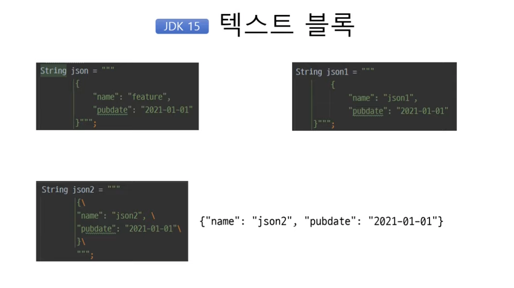
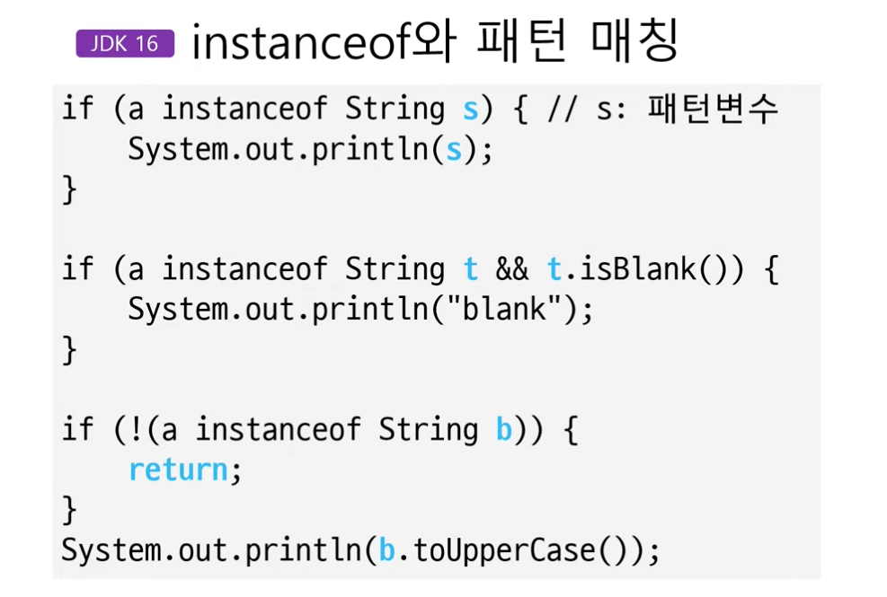
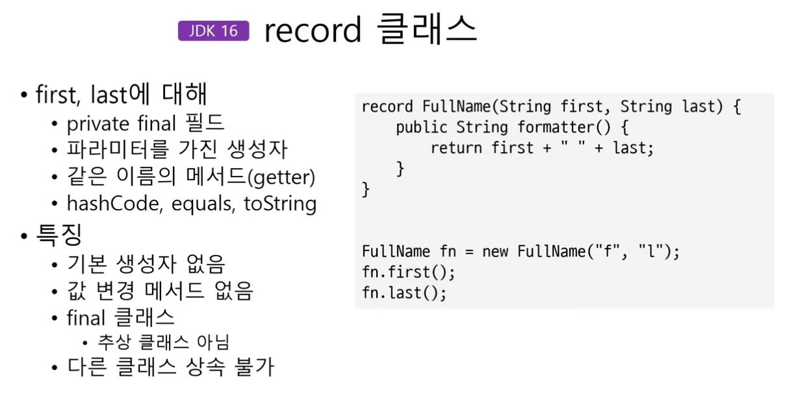

jdk 버전별 정리 (9~16)

- jdk9
  - interface에 private 메서드 추가가능
  - try-with-resource 구문에 변수를 직접생성하거나 final로 직접 선언할 필요없음
    ```java
        FileInputStream fIn = new FileInputStream("");
        try (fIn) { // 이게 원래 컴파일 에러였으나 가능하게됨
            System.out.println("작업");
        } catch (Exception e) {

        }
    ```
  - 콜렉션 팩토리 메서드
    ```java
        List<Integer> list = List.of(1, 2, 3);
        Map<String,Integer> map = Map.of("k1", 1, "k2", 2);
        Set<Integer> set = Set.of(1, 2, 3);
    ```
  - Arrays
    - `int comp = Arrays.compare(a,b);`
      - 배열비교
    - `int firstIdx = Arrays.mismatch(a,b);`
      - 미스매치되는 인덱스 리턴해주는데, 첫 발견되는 인덱스

- jdk10
  - var
    - 로컬 변수 타입추론
      - 로컬변수이니 필드, 파라미터는 못씀
      
- jdk11
  - String
    - `isBlank()`: 공백문자만 포함했는지 여부
    - `lines()`
      - new line 기준으로 쪼개져서 스트림 형태로 제공
    - `repeat()`
      - 문자열 지정한 숫자만큼 반복해서 더해줌
    - `strip()`, `stripLeading()`, `stripTrailing()`
      - `trim()`과의 차이?
        - `trim()`은 '\u0020' 이하의 공백들만 제거 (스페이스, 탭 등)
        - `strip()` 은 유니코드의 공백들을 모두 제거. 즉, `trim()` 을 포함하는 개념
  - Files
    - writeString()
      - 문자열을 특정 파일로 저장
    - readString()
      - 특정 파일을 바로 문자열로 읽어옴

- jdk14
  - switch 식
    - switch 사용시 값을 리턴해줄수 있게됨 ("->" 이거 사용)
    
- jdk 15
  - 
    - """ (큰따옴표 3개) 사용
  - NPE 메세지 개선
    - 어디로 인해서 NPE가 발생했는지 좀더 상세하게 알려줌

- jdk 16
  - Stream
    - `toList()`
      - `collect(Collectors.toList())`  이거 축약..
    - `mapMulti()`
      - map 에 여러개 넣어줄수있음 (넘겨주는 파라미터 consumer 에 여러번 accept 호출하면됨)
  - instanceof와 패턴매칭
    - 
  - record 클래스
    - 