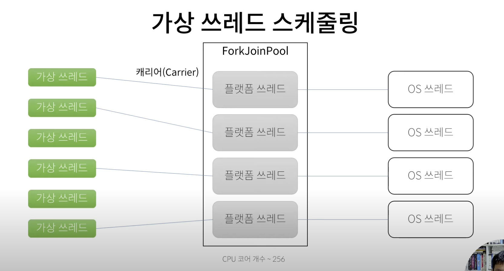

jdk21

- SequencedCollection, SequencedMap 이 추가되어, 마지막 원소에 대한 접근이 용이한 메서드가 생겼으며 역순을 제공주는 메서드(뷰를 리턴해주기때문에, 내부값이 바뀌면 뷰도 영향미침)도 추가됨
- 패턴매칭
  - switch case문에 type을 기반으로 매칭이 가능
  - 추가로 조건(when)도 사용가능
  ```java
    
  ```

- 가상스레드
  - 목적
    - 요청당 스레드 구조의 서버 어플리케이션에 매우 적합
    - 최소변경으로 가상스레드 사용가능
  - 구조
    - 
    - OS스레드: OS에서 할당하는 스레드
    - 플랫폼스레드: 가상스레드 생기기(jdk21) 이전, java에서 사용하는 스레드 (OS스레드와 1:1로 매칭)
    - 캐리어(carrier)스레드: 가상 스레드를 실제로 실행하고있는 플랫폼 스레드
    - 가상스레드와 플랫폼스레드는 N:M의 관계
      - 가상스레드가 IO와 같은 block을 만나게되면 플랫폼 스레드는 해당 가상스레드를 잠시 멈추고 다른 가상스레드를 실행
      - 하지만, 멈춘 가상스레드가 이전에 실행했었던 동일한 플랫폼 스레드에게로 할당되는 보장은 없음
  - 코드자체는 동기인데, 실제 내부는 비동기 처럼 동작하게됨
  - DB IO 대기시 개꿀
  - 주의할점
    - pinned
      - 가상스레드와 플랫폼 스레드가 고정되는것
      - ex. synchronized 블록에서 IO 블로킹
        - 가상스레드가 끝날때까지 플랫폼스레드(케리어스레드)도 같이 블로킹.. (가상스레드가 IO 블록 만나면 정상적으로 사용한 경우라면 플랫폼스레드가 해당 가상스레드) 
      - 언제발생?
        - synchronized 블록/메서드 -> concurrent패키지의 Lock 사용해서 회피 
          - jdbc mysql 드라이버...에서도 발생
        - 네이티브메서드 or foreign 함수
          
    - ThreadLocal 지원
      - 하지만, 가상스레드가 몇백만개를 사용가능하도록 만들어진 구조이기에.. 많이 사용하면 그만큼 메모리를 먹게되는것이니 사용을 줄이자..
    - 가상스레드는 풀링하지말고 필요할때마다 그냥 생성해라~
