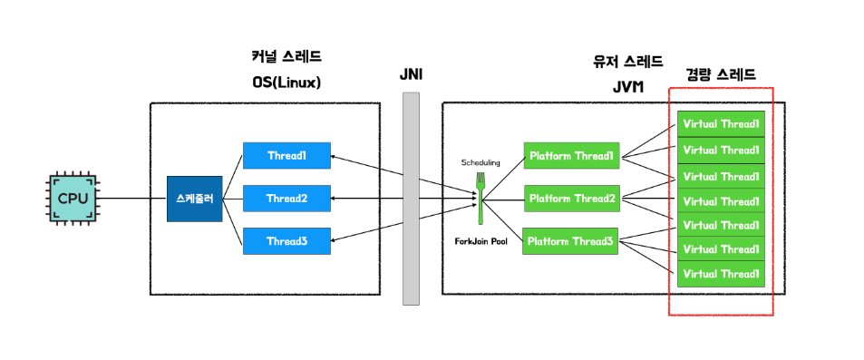

virtual thread

- jdk 21부터 시작
- forkjoinpool 기반으로 platformThread(자바의 스레드)가 virtual thread의 (작은 단위의) 작업을 수행하는 구조
  - 
  - 이를 쓰는 이유는 컨텍스트 스위칭 비용이 매우 저렴
    - 스택 사이즈가 적기때문에 컨텍스트 스위칭 비용이 저렴
    - 시스템 콜 사용도 적음
      - virtual thread 내부의 park / unpark 를 사용하여 시스템콜을 줄임 (이거 좀더 확인필요.. native method라 정확하게 확인이 어려움..)
- cpu 작업량이 많은것보다, IO 작업량이 빈번할때(sleep이나 wait과 같은.. 컨텍스트 스위칭이 많을때) 유리
- 코루틴 보다 성능 좋음.
- 웹플럭스보다 성능 좋음
  - 웹플럭스랑 비교한 이유는 좀더 살펴봐야할듯..
- [참고사이트](https://techblog.woowahan.com/15398/)

- jdk17에서 제공해주는 스레드 모델의 park/unpark ?
  - 챗gpt 답변
    - JDK 17에서의 스레드 `park`/`unpark` 개념은 스레드의 실행을 제어하는 데 사용됩니다. `park` 메소드는 특정 스레드를 일시 중지(blocking) 상태로 만들며, 이 스레드는 `unpark` 메소드가 호출될 때까지 대기합니다. `unpark`는 해당 스레드를 다시 실행 가능한 상태로 만듭니다. 이 기능은 `java.util.concurrent.locks.LockSupport` 클래스에 구현되어 있으며, 스레드 간 동기화나 대기/알림 메커니즘을 구현할 때 유용합니다. 이러한 방식은 전통적인 `wait`/`notify` 메커니즘보다 더 유연하고 사용하기 쉬운 대안을 제공합니다.
  - 참고로 virtual thread의 park/unpark 와는 다른것!