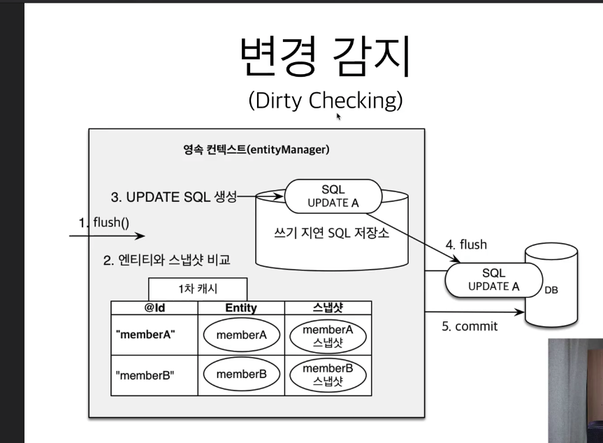
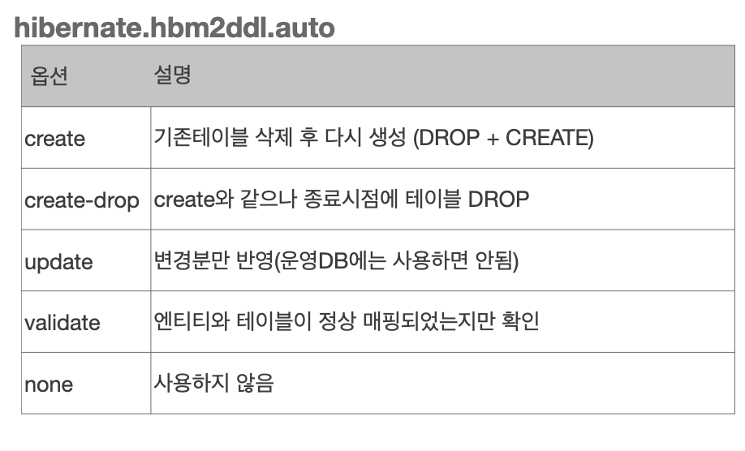

- jpa 간략정리
  - Springboot가 jpa 설정 셋팅을 기반으로 EntityManager라는 놈을 만들고 이를 Repository에서 주입받아서 사용..
  - JPA는 테스트시에 `@Transactional` 반드시필요! 트랜잭션이 항상있어야한다함..
    - 물론 `@Transactional` 이거 테스트에서 사용하면 자동롤백
  - 다대다 쓰지마라 (manyToMany)
```yml
spring:
  datasource:
    url: jdbc:h2:tcp://localhost/~/test;MVCC=TRUE
    username: sa
    password:
    driver-class-name: org.h2.Driver
  jpa:
    hibernate:
      ddl-auto: create
    properties:
      hibernate:
#        show_sql: true
        format_sql: true
```

  - 영속성관리
    - 영속성 컨텍스트
      - 엔티티매니저 팩토리와 엔티티매니저 관계
        - 요청이 들어오면 요청에 따라 팩토리가 엔티티 매니저를 생성해준다
        - 그리고 엔티티매니저는 DB 커넥션풀에있는 커넥션을 사용하여 DB와 연결하고 데이터를 주고받는다
        - 팩토리는 여러 스레드가 접근해도 안전하게 엔티티 매니저를 하나씩 생성할수있지만, 엔티티매니저는 동시에 여러 스레드가 접근하면 동시성문제가 발생하므로 조심해야한다!!
      - 영속성 컨텍스트란 엔티티를 영구 저장하는 환경(문맥)
        - 그래서 persist는 엄밀히이야기하면 DB에 저장되는게아니라, 영속성 컨텍스트에 저장하는것
      - 영속성컨텍스트와 엔티티매니저는 그럼 무슨관계?
        - 엔티티매니저 하나에 영속성컨텍스트가 내부적으로 있게됨..
          - 스프링에서는 여러 엔티티매니저가 하나의 영속성컨텍스트를 공유한다함..
            - 그렇다면 스레드안전은 어떻게보장?
      - 엔티티의 생명주기
        - 비영속
          - 아직 영속성 컨텍스트와 관련없는상태
          - 그냥 객체만 생성한상태.. 그냥 new 키워드 사용해서만든것.. JPA랑 전혀 노상관
        - 영속
          - 영속성 컨텍스트와 관련있는상태
          - persist함수를 호출하여 객체가 영속성컨텍스트에 등록되었을때
          - 또는 find했을때 영속성컨텍스트에 등록되어있지않으면 알아서 등록해주어서 영속상태가됨
          - 영속상태가 되었다고 쿼리가 날라가진않음
            - commit이 일어나야함..
        - 준영속
          - 영속성 컨텍스트에 저장되었다가 분리된상태
            - 당연히 이후에 커밋하면 변경되었어도 반영안됨
          - 방법
            - `em.detach()`
            - `em.clear()`
              - 영속성 컨텍스트를 완전 초기화.. 안에있는 내용 다지움
            - `em.close()`
        - 삭제 
          - 삭제된상태
          - remove
        - 왜 이런 생명주기가있나?
          - 어플리케이션과 DB사이에 영속성컨텍스트가 중간에서 관리를해주는개념인데..
          - 버퍼링이나 캐싱을 할 수 있는 이점이 있음
          - 이점 상세
            - 엔티티 조회, 1차 캐시
              - key가 @id, value가 엔티티객체로 구성된 map이 내부적으로 등록되어 1차캐시가 됨
                - 그래서 하나의 트랜잭션에서 동일한 키로 여러번 조회를 수행할때, 반환되는 엔티티객체는 완전 same (== true)! value꺼를 반환해주니깐 당연하것지..?
              - find할때 DB먼저 뒤지기전에 1차캐시를 조회.. 
                - ***1차 캐시는 글로벌하지 않다. 해당 스레드 하나가 시작할때 부터 끝날때 까지 잠깐 쓰는거다. 공유하지 않는 캐시다***
                - 100명 한테 요청 100개 오면, 엔티티 매니저 100개 생기고 1차캐시도 100개 생긴다. 스레드 종료되면, 그때 다 사라진다. 
                  
              - 1차캐시에 없으면 DB에서 직접조회해서 1차캐시에 등록하고 반환해줌(그렇기떄문에 한 트랜잭션내에서 다시 동일한 데이터 검색 요청이들어오면 1차캐시에서 바로 전달해줄수있음 )
              - 근데 이는 아주 큰 이점은아님,, ***엔티티매니저 생명주기가 한 트랜잭션***.. 상당히 짧음
                - 그래서 jpa(hibernate)에서 어플리케이션 전체에서 공유하는걸 2차캐시라고함
                
            - 쓰기지연
              - 커밋하기전까지 db에 쓰지않고있다가 commit하면 한꺼번에 씀(1차캐시에는 바로바로 등록되면서, 쓰기 지연 SQL 저장소에 넣어놓음)
                - 예를들어 persist(a), persist(b) 이렇게 두번 호출할때, 쓰기지연 SQL 저장소에 쿼리를 넣어놨다가 commit호출하면(flush) 한번에 쿼리문들을 날림 
              - 배치쿼리를 이를 통해서 잘 활용할수 있음 (설정에 batch size 셋팅할수있음)
            - 변경감지 (dirty checking)
            - 동일성보장
              - 위 1차캐시에서 설명
            - 지연로딩
    - 플러시
      - 영속성 컨텍스트의 변경내용을 데이터베이스에 반영 
        - 영속성 컨텍스트의 변경내용을 DB에 동기화한다고 생각하면됨!(근데 commit하기 전이니깐.. 그건 잘 고려하자.. 아주 간단하게 이야기하자면, 그냥 jdbc가지고 트랜잭션 시작하고 쿼리문들 중간에 계속 실행시키고 트랜잭션 종료할때, jpa에서 이와 동일한 효과를 내려면 쿼리날릴때마다 flush 호출해주면됨)
      - 플러시 발생시
        - 변경감지(dirty checking) => 수정된 엔티티 쓰기 지연 SQL 저장소에 등록 => 쓰기지연 SQL 저장소의 쿼리를 DB에 전송
        - ***중요한것은 아직 db에 commit이 수행되는것은아니다!!***
          - 플러시한다고해서 ***1차캐시가 지워지는것은 아님***
      - 플러시하는방법
        - `em.flush()` : 직접호출
        - 트랜잭션 커밋 : 자동호출
        - ***JPQL 쿼리실행*** : 자동호출
    
  - 엔티티맵핑
    - 객체와테이블맵핑 : `@Entity`, `@Table`
      - `@Entity`
        - 요게 붙어있어야 JPA가 관리
      - 주의점
        - 기본생성자필수(public, protected 생성자)
        - final클랫, enum, interface, inner클래스 사용x
        - 저장할필드 final 사용 x
    - 필드와 컬럼맵핑 : `@Column`
      - 사진참고1
      - 사진참고2
      - 사진참고3
    - 기본키 맵핑 : `@Id`
      - 직접 할당 (`@Id`)
      - 자동 생성 (`@Id` + `@GeneratedValue`)
        - 옵션
          - `strategy=GenerationType.AUTO`
            - 디폴트값.. 디비 방언에 맞춰줌..
            - 예를들어 mysql이면 GenerationType.IDENTITY.. oracle이면 GenerationType.SEQUENCE
          - `strategy=GenerationType.IDENTITY`
            - db에게 기본키 셋팅을 위임
            - db에 insert를 해봐야 id의 값을 알 수 있음..
              - 그렇기때문에 persist 하는 시점에 db로 쿼리가날아감(commit호출시점이아님..)
              - 참고로 select을 다시 날리지않음.. jdbc 라이브러리에 insert하면서 pk값 가져올수있는 api가 있음..
          - `strategy=GenerationType.SEQUENCE`
            - 시퀀스 오브젝트를 만듦..
            - 엔티티별로 시퀀스를 만들고싶으면 `@SequnceGenerator`를 사용하면됨 (클래스레벨에 선언)
            - `@Id`를 알아야하는데, 시퀀스 관리는 DB가 하게되니깐, 시퀀스를 얻어오기위해서 persist호출시 DB에 한번 접근해서 가져온뒤에, commit호출할때 insert쿼리가 나가게됨 
              - 무튼 시퀀스값을 가져와야하니깐, 최적화를 위해서 `@SequnceGenerator`의 옵션에 allocationSize를 조절함
                - allocationSize만큼씩 증가를하는데, allocationSize를 50(default)으로 셋팅되어있으면, 영속성 컨텍스트에서 1~50까지 미리 가지고있음.. 그래서 seq가 하나씩 증가할때 db에 가지않고 영속성 컨텍스트가 바로 전달해줌.. 50이 넘어가면 그때 다시 DB에 연결해서 50개를 더 호출함.. 
          - `strategy=GenerationType.TABLE`
            - 키 생성 전용 테이블을 하나 만들어서 DB 시퀀스를 흉내내는전략..
            - mysql,oracle이런거에 제약없이 모든 DB에 적용가능하나, 성능떨어짐..
      - 권장식별자 전략?
        - 비지니스는 키로 되도록 끌고오지마라.. (real mysql과는 좀 다르네)
        - Long형 or 대체키(ex. uuid) or 키 생성전략 을 추천
  - 연관관계 맵핑 : `@ManyToOne`,`@JoinColumn`
    - 객체의 참조와 테이블의 외래키를 맵핑하는게 중요
    - 단방향 연관관계
      - `@ManyToOne`을 사용하게되면, 이를 사용하는 엔티티가 Many이고, 연결된 컬럼이 One이라는뜻.. 즉, Member 엔티티 클래스에 Team이라는 필드에 `@ManyToOne`을 선언하였다면, Member 엔티티가 N이고 Team 필드가 1 의 관계라는뜻임!
    - 양방향 연관관계와 연관관계의 주인
      - 양방향 연관관계?
        - 한쪽방향으로만 참조되는것이아닌, 반대로도 가능한것..
          - 예를들면, Member에서 Team 엔티티로 갈수있는것뿐아니라, 반대로 Team에서도 Member를 참조해서 갈수있는것..(Team엔티티에서 team 하나에 Member는 여러개될수있으므로 List형태가되겠지..)
        - 중요한것은 반대로 참조할수있도록 해줘도 테이블에는 전혀 영향이 가지않는것! (당연히 테이블의 foreign Key로 조인하면 양측모두를 알수있으니..!)
          - 쉽게 생각하면, 객체는 양방향이 되기위해서는 단방향 연관관계가 두번 일어나는것..  
            - Member -> Team
            - Team -> Member
          - 반면, 테이블은 foreign key하나로 단번에 양방향의 모든 정보를 알 수 있음.. 그냥 한번에 다 가져올수있따(엄밀히 이야기하면 굳이 양방향이란 개념이 없겠지..)
        - 객체의 양방향은 단방향 두번이니.. 두 엔티티중에 하나로 외래키를 관리해야함.. (<span style="color:red">영속성 컨텍스트에서 관리해주니깐(참조를통해..) 어디서든 변경이 일어나도 상관없을줄알았는데.. 아니네.. 암튼 좀더 확인이필요..</span>)
          - 예를들면, Member의 Team을 변경하고싶을때, Member Entity의 Team을 변경할것인지.. 아니면 Team에 `List<Member>` 를 수정할것인지.. 
          - 요런 딜레마속에서 한쪽에서만 외래키를 변경하도록 하였고, 그 변경하는 주체를 ***연관관계의 주인*** 이라함 
            - 연관관계 주인
              - 엔티티의 두 관계중 하나만 연관관계의 주인임..
              - 연관관계의 주인만이 외래키를 관리(등록, 수정)
              - 주인이 아닌쪽은 읽기만가능
                - 그렇기때문에 나름 set함수를 사용해서 맵핑을 해도 전혀 적용이안됨..(가짜매핑)
              - 주인은 mappedBy 속성을 사용x (mapped by는 수동형이므로.. 종속되어있는놈..)
              - 주인이 아니면 mappedBy 속성으로 주인지정
              - 읽기만 할 수 있는(mappedby) 쪽은 1쪽으로해라!
                - 만약 Team에있는 List Members 가 주인이라면, Member 테이블의 team 컬럼을 Update하기 위해서는 Team 엔티티를 통해서 변경해야한다.. Team엔티티변경을 하면 Team 테이블만 변경된다고 일반적으로 생각할테니.. 좀더 상식적으로 다가가는게 Member엔티티의 Team이 주인이되는게맞음
                - 쉽게 생각해서 외래키가 있는곳 즉, 하나의 값으로 연결되어잇는부분(Many쪽)이 주인이되는쪽으로!  
      - `@OneToMany(mappedBy="변수명")`
        - mappedBy에서 사용한 변수명은 @ManyToOne에서 사용한.. 즉, 반대편쪽의 변수명을 가져와야함
          - Team엔티티입장에서 하나(One)이고, Member는 N(Many)임.. 
          - Member 엔티티에서 Team을 사용할때 변수명이 team이었으면, mappedBy="team" 이 된다!
      - 양방향 매핑시 주의해야할점
        - 연관관계의 주인쪽에 매핑을 해줘야 DB에 반영된다..!
          - 그래서 연관관계의 주인쪽에만 셋팅을 하면끝이냐?
            - => 그렇지않다! 꼭 반드시 가짜매핑도 해주어야한다.. 영속성 컨텍스트가 비워져있는 상태라면 주인이 아닌쪽의 엔티티를 읽어올때 문제가 안되지만, 비워져있지않은 상태에서 데이터를 읽어오게되면 1차캐시에서 가져오게되는데, 이때 주인쪽에만 셋팅해주었다면 주인쪽 셋팅된 변경점을 가져오지못하게된다..
              - => 이러한 문제를 해결하기위해서 연간관계 주인 엔티티에서 주인이 아닌 객체를 셋팅하는 메서드에 자신을 추가하는 로직을 만들자..
              ```java
                class Member{
                  ...
                  private Team team;

                  ...

                  public void setTeam(Team team){
                    this.team=team;
                    team.getMembers().add(this);  //요거를 추가! 물론, 내부 중복을 확인해야한다면 좀더 로직을 추가하면됨.. 아마도 팀쪽에 메서드를 만들면될듯?  
                  }
                }
                
              ```
        - 양방향 매핑시에 무한루프를 조심!
          - `toString()` 을 롬복이나 인텔리제이에서 제공해주는 편의기능을 그냥 사용하면 무한루프일어날수있음
            - Member toString -> Team toString -> (Team에 정의되어있는 Members) Member toString -> Team toString .....
            - => 쓰지말거나 무한루프안돌게 재정의해라..
          - json 생성라이브러리..
            - entity를 고대로 reponse로 넘겨버리면 문제생긴다..
            - => 컨트롤러에서 엔티티를 절대 그냥 반환하지마라! DTO로 변환해서 반환하자
        - 양방향 매핑정리
          - 일단 단방향 매핑(ManyToOne or OneToOne)으로 이미 완료를 해야하고 양방향은 반대쪽을 참조해야할때 추가하자! 설계할때부터 양방향으로 생각하진말자..
            - 즉, 양방향은 필요할때 추가하자.. 테이블에 영향을 주진않으니..
          - 외래키의 위치를 기준으로 연관관계 주인을 정하자
          - JPQL 사용할때 종종 쓰일수도 있다함..
  - 다양한 연관관계매핑 
    - 매핑시 고려할점
      - 다중성
        - 다대일: `@ManyToOne`
        - 일대다: `@OneToMany`
          - 일대다 단방향도 가능하긴하나.. 위에 이야기한것처럼 Team에 뭔가 데이터를 저장했는데 Member 테이블이 update되는.. 헷갈릴여지가 많아지기떄문에 비추..
            - 엔티티가 관리하는 외래키가 다른테이블에..
            - 참고로 update 쿼리도 한번 더 나가야함..
              - ex. Member table insert -> Team table insert -> Member table update(Member의 team컬럼)
          - => 그냥 다대일 양방향 매핑을 사용하자..
        - 일대일: `@OneToOne`
          - 외래키를 어디다 넣어도 상관없음 
            - 주테이블 : 주로 많이 가져다쓰는 테이블에 외래키존재 ex. Member와 Locker가 1:1일때, Member table이 주로 많이쓰이므로 Member가 주테이블이고, Member에 Locker의 외래키를 둔다.. 
              - 객체지향 개발자들선호
              - 대상테이블에 값이 없으면 외래키가 null..
            - 대상테이블 : 대상테이블에 외래키가 존재.. ex. 위와반대..
              - 전통적인 DB 개발자 선호
              - 주 테이블과 대상 테이블을 일대일에서 일대다 관계로 변경할떄 테이블 구조 유지가능 (ex. Member한명이 Locker 여러개쓸때.. Locker 테이블에서 Member 외래키에 uk를 제거하면끝..심플하게 처리가능)
              - 개발간에 Member에서 Locker를 참조한다면, Locker에 대한 값을 가져오기위해서는 무조건 DB를 갔따와야하기때문에 지연로딩불가.. <span style="color:red"> 이거 무슨말인지.. 아직정확하게 이해안댐..</span>
          - 외래키에 유니크 제약조건이있어야함..
            - 그래야 외래키를 딱 하나만쓴다는 보장이되니..
          - DB에서 외래키로 등록되어있는놈이 연관관계 주인이 되면됨.. 
            - 연관관계 주인 관련내용은 동일하게 적용됨!
              - 즉, 연관관계 주인쪽에서 데이터 수정이 가능하고, 반대쪽(`@OneToOne(mappedBy="변수명")`)에서는 read만 가능
        - 다대다: `@ManyToMany`
          - 실무에서 안쓴다.. 
          - 
      - 단방향? 양방향?
      - 연관관계 주인
  - 고급매핑
    - 상속관계 매핑
      - DB에서 논리적으로는 만들때는 객체지향과 비슷한데 이를 물리적으로 표현하기위해서는 아래의 전략들을 사용
      - 조인전략을 사용하는경우 (대략 이게 정석이라고 보면됨..)
        - 조인전략?
          - 상당히 정규화된 방법으로, 아래와 같이 DB를 설계
          - DTYPE을 통해 어떤 테이블을 join할것인지 알 수 있음
        - JPA에서는 부모엔티티의 클래스레벨에 `@Inheritance(strategy=InheritnaceType.JOINED)` 로 하면됨..(default는 싱글테이블.. 하나의 테이블에 다 때려밖음) + 부모엔티티클래스가 굳이 따로 필요하지않다면 추상으로..
        - 이를 사용할때 DTYPE을 위해 추가적으로 `@DiscriminatorColumn`을 같이 선언해주는데, 이를 사용하면 부모테이블에 알아서 DTYPE컬럼이 추가되고, 자식 테이블의 이름이 들어감..(컬럼명이 DTYPE이나, 해당 컬럼 값에 자식테이블 이름이 들어가는거는 당연 바꿀수있음.. 자식테이블의 이름말고 다른걸 넣기위해서는 자식엔티티에 `@DiscriminatorValue`로 선언해주면됨)
        - 장점 
          - 테이블정규화 굿
          - 저장공간 효율화
          - 외래키 제약조건 활용가능
        - 단점
          - 조회시 조인을 많이사용..
          - 쿼리복잡
          - 데이터 저장시 insert 쿼리두번호출.. 근데 이건뭐 괜춘하지..
          - 관리복잡..
      - 단일테이블전략을 사용하는경우
        - 단일테이블전략?
          - 한 테이블에 모든 컬럼 다 때려넣고, 또한 DTYPE과 같은 구분컬럼도 넣어줌
          - join할 필요없음.. 성능상 이점..
        - JPA에서는 부모엔티티의 클래스레벨에 `@Inheritance(strategy=InheritnaceType.SINGLE_TABLE)` 로 하면됨..(디폴트임..) + 부모엔티티클래스가 굳이 따로 필요하지않다면 추상으로..
        - DTYPE관련해서는 위와동일하나, 단일테이블전략에서는 굳이 `@DiscriminatorColumn` 선언안해줘도 생성이자동으로된다.. 구분이안되니깐!
        - 장점
          - 조인필요없으니 성능괜춘
          - 조회쿼리심플
        - 단점
          - 자식 엔티티가 매핑한 컬럼 모두 null 허용해야함..
          - 하나의 테이블에 다 때려박으니 테이블이 커질수있고 상황에 따라서 조회성능이 느려질수도..(데이터가 많아지니깐..?)
      - 구현클래스마다 테이블전략 사용하는경우 
        - 구현클래스마다 테이블전략?
          - 부모테이블을 만들지않고 부모테이블의 내용을 각 자식테이블에게 적용시킴(중복허용)
        - JPA에서는 부모엔티티의 클래스레벨에 `@Inheritance(strategy=InheritnaceType.TABLE_PER_CLASS)` 로 하면됨.. + 부모엔티티클래스를 추상클래스로 만들어줘야함
        - `@DiscriminatorColumn`이 의미없음
        - 이거의 가장 큰 단점은 데이터를 조회해야할때, 타입을 부모클래스타입(추상클래스겠지?) 으로 받으면, 각 테이블마다 쿼리를 날리고 union을함.. 
        - 장점
          - 서브 타입을 명확하게 구분해서 처리할떄좋음
          - not null 제약조건 자유로이사용 (근데 이건 조인전략도마찬가지..)
        - 단점
          - 여러 자식 테이블을 함께 조회할때 성능이느림(union..)
          - 자식테이블을 통합해서 쿼리가 어렵다..
          - 그래서 ***이건안쓴다.. 잘 묶여지지가 않음.. 통합관리가 어렵다.. 또한 변경이 일어나면, 모든 각 테이블을 변경해야함..***
          
      - => 위의 내용을 보면 테이블 전략이 바뀌었는데, 소스상에서는 `@Inheritance` 옵션만 바꾸면됨~ 개꿀
    - `@MappedSuperclass`
      - 반복되는 속성을 넣어야할때..!
      - 부모클래스에 반복되는 속성을 정의하고, 클래스레벨에 선언하면됨 (당연 상속받아야겠지)
      - 당연히 엔티티가아니다! 단지 속성만 내려줌.. em.find같은거 안된다~
      - 직접 생성해서 할일이 없으니깐 추상클래스로 사용하자!
    - *참고로 `@Entity` 클래스는 `@Entity`를 사용한 클래스나 `@MappedSuperclass`로 지정한 클래스만 상속가능하다!!!
  - 프록시와 연관관계 관리 
    - JPA에서 프록시는?
      - 엔티티에서 데이터를 가져오는방법은 두가지
        - `em.find()`
          - 직접 DB에서 조회하여 엔티티를 반환함
        - `em.getReference()`
          - 요놈이 프록시 객체를 반환해준다
            - HibernateProxy라는놈으로 감싸져있는 엔티티를 반환함(일종의 가짜 객체.. 껍데기만반환)
            - 만약 Member 엔티티를 em.getReference로 가져왔다면, 일단 Member 클래스 형태지만 JPA가 내부적으로 만든 프록시객체인것이고, target에는 아직 진짜 엔티티가 null인 상태이다.. 그러나, member.getName()과 같은 메서드를 호출하면, 프록시 객체 내부에서 이제 db에서 데이터를 가져와서(이때, 영속성컨텍스트에 db에서 조회한 데이터로 member entity가 등록됨) target에 진짜 Member entity를 할당하고 그 값을 반환해준다!
            - 프록시를 사용하게되니깐, 타입체크시 `instanceof` 를 사용해야한다!
          - 이를 통해서 db에 조회가 필요할때가됐을때, DB에 조회하여 진짜엔티티를 가져옴
          - 만약 `em.find()` 를 호출하여 엔티티객체를 가져왔을때, 동일한 파라미터로 `em.getReference()` 를 호출하면 이 둘은 같은 클래스일까?
            - 정답은 같은 클래스! (프록시클래스아님..)
            - ***JPA의 정책으로써, 영속성 컨텍스트 내부에는 일단 어떻게든 등록이 되면 그것을 불러올때는 갑작스레 다시 프록시로 만들고 뭐 이런거안하고 고대로 가져온다..!***
              - 즉, JPA에서는 영속성 컨텍스트 내부에 등록이되면 이를 어떻게 가져오든 완전동일한 객체이다!!!(==비교시 true)
            - 반대로 `em.getReference()` 를 먼저호출해서 이게 영속성 컨텍스트에 등록이되었따면(프록시클래스), 한 영속성컨텍스트내에서 `em.find()`를 호출한다해도 프록시 클래스를 가져온다!
          - 프록시로 객체를 가져온뒤에 `em.detach()`나 `em.clear()`를 호출해서 해당 엔티티의 준영속상태가 된 뒤에 해당 객체의 메서드를 호출하면 당연 에러떨어진다..(LazyInitializationException)
            - 물론, 프록시가 아니라면 에러 안떨어지겠지..
    - 프록시 확인
      - `PersistenceUnitUtil.isLoaded(Object entity)` 로 인스턴스의 초기화 여부 확인가능
      - 해당 객체.getClass()로 프록시 클래스인지 확인가능..
      - `Hibernate.initialize(entity)` 로 프록시 강제 초기화가능
        - JPA표쥰에는 강제 초기화는 없음!
    - 지연로딩과 즉시로딩
      - 지연로딩
        - `@ManyToOne(fetch=FetchType.LAZY)`를 필드레벨에 선언하게되면 해당 객체는 프록시로 생성됨
        - 지연로딩으로 셋팅한 객체를 가져올때에 쿼리가 나가는게안니라, 해당 객체를 사용하게될때 초기화된다
          - ex) `member.getTeam()` 은 쿼리안나감.. 그냥 프록시객체리턴.. `member.getTeam().getName()` 이렇게 Team객체를 사용할때 쿼리가나가고 초기화됨
      - 즉시로딩
        - `@ManyToOne(fetch=FetchType.EAGER)`
        - join해서 한번에 다 가져옴
      - 주의할점
        - 실무에서 가급적 지연로딩을 사용하라
          - 실무에서 수많은 테이블이 얽혀있는 상황에서는 즉시로딩을 통한 join문은 성능저하를 가져온다.. 예상치못하게..
        - 즉시로딩은 **JPQL**에서 N+1 문제를 일으킨다
          ```java
            //조건 : Member가 Team을 FK로 가지고있는 상황.. 

            List<Member> members=em.createQuery("select m from Member m",Member.class).getResultList();
            //위의 동작순서는
            // 1. "select m from Member m" 을 SQL로 변환 => select * from member
            // 2. 쿼리 실행하여 member data 가져오고 셋팅
            // 3. member 데이터 하나씩 보니, Team이 없네? 해당 member의 Team 쿼리 수행(만약 영속성컨텍스트에 찾는 Team 데이터가 있으면 그거사용) => select * from team where team_id=? 
            // 4. member의 Team이 셋팅될떄까지 3번 쿼리가 반복적으로 수행.. (데이터 갯수 N 만큼..)

            // 반대도 마찬가지.. (select t from Team t, Team.class)
            // N+1 이슈 관련 설명 매우 좋음 : https://velog.io/@jinyoungchoi95/JPA-%EB%AA%A8%EB%93%A0-N1-%EB%B0%9C%EC%83%9D-%EC%BC%80%EC%9D%B4%EC%8A%A4%EA%B3%BC-%ED%95%B4%EA%B2%B0%EC%B1%85
          ```
          - JPQL에서는 이런 문제를 해결하기위해서 fetch join을 사용하여 필요할때만 join해서 가져옴 (FetchType을 Lazy로 해도 fetch join을 사용하면 한방에 가져올수있음)
        - `@ManyToOne`, `@OneToOne`  의 디폴트는 FetchType.EAGER
        - `@OneToMany`, `@ManyToMany` 의 디폴트는 FetchType.LAZY
    - 영속성전이 (cascade)
      - 특정 엔티티를 영속상태로 만들때 연관된 엔티티도 함께 영속 상태로 만들고 싶을때 사용
        - ex) 부모 엔티티 저장할때 자식 엔티티도 함께 저장.. 부모가 자식을 List로 가지고있고, 자식이 부모를 참조로 가지고있을때, 자식이랑 부모랑 각각 persist하기 번거로우니 부모를 중심으로 개발하고있다면 부모를 persist할때 자식들도 알아서 persist되도록해줌
      - 엔티티를 영속화할때 연관된 엔티티를 함께 영속화하는, 단지 편리함을 제공해주는것일뿐 연관관계맵핑하는거랑은 상관없음!
      - 옵션
        - ALL : 모두적용
        - PERSIST : 영속(저장할때만)
        - REMOVE : 삭제만
      - 주의할점
        - 소유자가 하나면 사용(단일 엔티티에 매우 종속되어있는상태)
        - 부모와 자식간에 라이프사이클이 동일할때 사용할것
    - 고아객체
      - 고아객체제거 : 부모 엔티티와 연관관계가 끊어진 자식 엔티티를 자동으로 삭제
        - `orphanRemoval=true`
        - 부모에서 자식을 가지고있는 list에서 지우면 영속성 컨텍스트에서 제거됨
          - 위의 영속성전이에서 REMOVE는 영속성 컨텍스트에서 remove하는 것.. 그니까 부모쪽 list에서 자식을 지워봤자 `orphanRemoval=true`로 셋팅안하면 아무런 일이 일어나지않는다..
        - <span style="color:red">근데.. 부모쪽에는 mappedby가 되어 연관관계의 주인이 아닌쪽인데, 이렇게되면 주인이 아닌쪽에서 핸들링하게되는것인데.. 상관없나..? 그것만 편의상 가능하도록 해주는 기능인건가?</span>
        - 주의할점
          - 영속성전이와 유사함..
          - 예를들어 게시판에서 오직 해당 게시판에 종속된 첨부파일일때는 사용하기 적절.. 그러나, 첨부파일을 다른곳에서도 사용한다고하면 절대 노
        - CASCADE 옵션을 ALL이나 REMOVE로 셋팅했을때 부모 객체를 영속성 컨텍스트에서 remove하게되면 `orphanRemoval=false`로 놓아도 자식객체들은 다 지워짐
      - 고아객체제거옵션과 Cascade remove 옵션차이설명 굿
        - https://stackoverflow.com/questions/18813341/what-is-the-difference-between-cascadetype-remove-and-orphanremoval-in-jpa
        - 설명 매우 좋음 : https://tecoble.techcourse.co.kr/post/2021-08-15-jpa-cascadetype-remove-vs-orphanremoval-true/
    - 영속성전이와 고아객체제거 옵션을 모두 활성화하면?
      - 부모 엔티티를 통해서 자식의 생명주기를 관리가능
      - 언제씀?
        - DDD의 Aggregate Root 개념을 구현할때 유용..
          - repository에서는 Aggregate Root만 관리한다라는 내용에 적합하다함.. <span style="color:red">뭔소리..</span>
  - 값 타입
    - JPA 데이터 타입분류
      - 엔티티타입
        - `@Entity`로 정의하는 객체
        - 데이터가 변해도 식별자로 지속해서 추적가능
      - 값 타입
        - int, String, Integer 처럼 단순히 값으로 사용하는 자바 기본타입이나 객체
        - 식별자가 없고 값만 있으므로 변경시 당연 추적불가
        - 종류  
          - 기본값 타입
            - 생명주기를 엔티티에 의존
              - ex) 회원을 삭제하면 이름, 나이 필드도 함께삭제
            - 값 타입은 공유하면 x
              - 자바는 원시타입 공유x
              - 래퍼클래스와 같은 클래스는 공유가능하지만 값 변경이 불가하게 만들어져서 괜춘..    
          - ***임베디드 타입***
            - 값 타입을 직접 지정가능 
            - `@Embeddable` : 값 타입을 정의하는곳에 표시
              - 기본생성자 필수..
            - `@Embedded` : 값 타입을 사용하는곳에 표시 (생략가능.. 그래도 명시하자)
            - 장점
              - 재사용
              - 높은응집도
              - 해당 값 타입만 사용하는 의미있는 메소드 사용가능
                - ex) 시작일, 근무일을 셋팅한 Period 객체에 Period.isWork() 처럼 일하는기간인지를 메서드로 만들어낼수있음 => 객체지향
              - 임베드디 타입을 포함한 모든 값 타입은, 값 타입을 소유한 엔티티에 생명주기를 의존
              - *요거 잘 사용해보자!*
            - 임베디드 타입 사용하기 전과 후의 매핑하는 테이블은 같다..(그니까 묶을수있는거 임베디드 타입으로 묶어서 의미있게 사용하면좋다!)
              - => 잘 설계한 ORM 애플리케이션은 매핑한 테이블의 수보다 클래스의 수가 더 많음
            - 한 엔티티에서 같은 임베디드 타입을 사용하면? ex) Address를 두개 사용해야한다면..
              - `@AttributeOverride` 를 사용해서 재정의할수있음
          - 컬렉션 값 타입
            - 특정 엔티티가 컬렉션으로 값 타입을 가지고있다면, 해당 엔티티의 식별값을 FK로하여, 값타입에 적절한 테이블이 생성되어야한다
              - ex) Member에서 `Set<String> favoriteFoods`, `List<Address> addressHistory` 이렇게 있따면, DB에는 FAVORITE_FOOD라는 테이블에 MEMBER_ID(PK,FK), FOOD_NAME(PK) 로 있어야한다.. ADDRESS 테이블에는 MEMBER_ID(PK,FK), CITY(PK), STREET(PK), ZIPCODE(PK)
                - 여기서 별도의 시퀀스를 두어서 PK로 잡게되면 그냥 엔티티가되어버림..
            - 아래와 같이 사용하면됨
              ```java
                @ElementCollection
                @CollecitonTable(name = "FAVORITE_FOOD", joinColumns=@JoinColumn(name="MEMBER_ID"))
                @Column(name = "FOOD_NAME") //String으로 들어가는 컬럼 이름을 직접 지정해준것임
                private Set<String> favoriteFoods=new HashSet<>();

                @ElementCollection
                @CollecitonTable(name = "ADDRESS", joinColumns=@JoinColumn(name="MEMBER_ID"))
                private List<Address> addressHistory=new ArrayList<>(); //여기서 Address는 Embeddable로 정의되어있기때문에 가능
              ```
            - 값 타입이기때문에 자동으로 영속성 전이 + 고아객체 제거기능이 셋팅된것과 같음.. 즉, persist로 member를 넣으면 member 엔티티에있는 컬렉션 값 타입들이 자동으로 들어감.. 수정해도 바로 update됨
            - 또한 컬렉션은 조회하게되면, 다 지연로딩방식으로 가져오게됨
            - 값 타입 컬렉션은 변경 사항이 발생하면, 주인 엔티티와 연관된 모든 데이터를 삭제하고, 값 타입 컬렉션에 있는 현재값을 모두 다시 저장한다..
              - 즉, 특정 Member의 `List<Address>` 안에 데이터 하나만 지우게되면, 테이블에서는 memberId에 맞는 Address테이블 데이터를 모두 지우고 변경된사항을 반영하여 모든 데이터를 다시 insert 한다
              - => 그렇기때문에 이런식으로 쓰면안된다....
                - 대안은?
                  - 그냥 일대다 관계로 바꾸자.. (또는 다대일관계)
                  - 그리고 Member는 `@OneToMany`로..
                  - ***값 타입 컬렉션은 추적할 필요 없는 단순한 값을 사용할때만 써라..*** 
                    - ***식별자가 필요하고, 지속해서 값을 추적, 변경해야한다면 그것은 값 타입이 아닌 엔티티!!!!***
    - 값 타입과 불변객체
      - 값 타입은 안전해야한다..!
        - => ***불변객체로 값타입을 만들어라!!***
      - 임베디드 타입 같은 값 타입을 여러 엔티티에서 공유하면 위험하다! => 부작용발생!
        - 공유하고싶으면 엔티티로 만들어야한다..! 
      - 불변객체란
        - 생성 시점 이후 절대 값을 변경할 수 없는 객체
        - 생성자로만 값을 설정하고 수정자(setXXX)를 만들지않으면됨
        - ex) Integer, String
      - 값 타입은 수정시 주의해야한다!
        - ***지우고 새로이 만들어줘야함! immutable!!!!!***
  - 객체지향쿼리언어 - 기본문법
    - JPQL
      - 배경
        - JPA를 사용하면 엔티티 객체를 중심으로 개발
        - 문제는 검색쿼리
        - 검색을 할 때도 테이블이 아닌 엔티티 객체를 대상으로 검색
        - 모든 DB 데이터를 객체로 변환해서 검색하는것은 불가능
        - 애플리케이션이 필요한 데이터만 DB에서 불러오려면 결국 검색조건이 포함된 SQL이 필요 
        - 그래서 JPA는 SQL을 추상화한 JPQL이라는 객체지향쿼리언어 제공
      - 특징
        - JPQL은 엔티티 객체를 대상으로 쿼리 => 객체지향쿼리
          - SQL은 DB 테이블을 대상으로 쿼리
        - SQL을 추상화해서 특정DB SQL에 의존x
        - String으로 넘겨주기때문에 동적쿼리 만들기 상당히 지저분해지고 어려움..
      - 기본문법
        - 엔티티와 속성은 대소문자 구분 O (Member, age)
        - JPQL 키워드는 대소문자 구분 X
        - 엔티티이름 사용! 테이블이름이 아니다!!!
        - 집합, 정렬 모두 가능
          - count()
          - sum()
          - avg()
          - max()
          - min()
          - group by, having
        - TypeQuery 와 Query
          - TypeQuery : 반환 타입 명확할때 사용
            - 클래스타입을 파라미터로 넘겨주어야함
          - Query : 반환 타입이 명확히지 않을때 사용
          - 결과조회
            - `query.getResultList()`
              - 결과가 하나 이상일때 사용
              - 결과가 없으면 빈 리스트 반환 (NPE 걱정없음)
            - `query.getSingleResult()`
              - 결과가 정확히 하나 일때
              - 결과 없으면, NoResultException
              - 둘 이상이면, NonUniqueResultException
          - 파라미터 바인딩
            - 이름기준
              ```java
                TypeQuery<Member> query=em.createQuery("select m from Member m where m.username = :username", Member.class);
                query.setParameter("username","member"); // 위에 선언한 ":" 이후의 값인 username을 key로 넣어주어야함 
                List<Member> list=query.getResultList();

                //위는 보통 메서드 체이닝으로 푼다~
              ```
            - 위치기준
              - 가능은 한데 사용하지말자~
          - 프로젝션
            - select 절에 조회할 대상을 지정하는것
            - 프로젝션 대상 : 엔티티, 임베디드타입, 스칼라 타입(숫자, 문자 등 기본데이터 타입)
              ```sql
                SELECT m FROM Member m -- 엔티티 프로젝션
                SELECT m.team FROM Member m -- 엔티티 프로젝션.. 여기서 team은 Team 엔티티.. 이럴때는 join해서 가져오게되는데, join을 명시해서 가져오는게 좋음.. 이게 조인한건지 명시적으로 알려주는게 좋음!
                SELECT m.address FROM Member m -- 임베디드 타입 프로젝션.. 여기서 address는 임베디드 타입임
                SELECT m.username, m.age FROM Member m -- 스칼라 타입 프로젝션

                -- 요롷게 해서 가져온 모든것들은 영속성 컨텍스트에서 모두 관리하게됨
              ```
            - 여러값 조회
              - `SELECT m.username, m.age FROM Member m`
                - Query 타입으로 조회 (Object[]로 타입캐스팅필요...)
                - QueryType에 Object[]를 지정하여 조회
                - new 명령어로 조회
                  - 단순값을 DTO로 바로조회가능
                  - 패키지 명을 포함한 전체 클래스명 입력
                  - 순서와 타입이 일치하는 생성자 필요
                  ```java
                    em.createQuery("select new 패키지명.MemberDTO(m.username, m.age) from Member m", MemberDTO.class).getResultList();
                    
                    @AllArgsConstructor
                    class MemberDTO{
                      private String username;
                      private int age;
                      ...
                    }
                  ```
        - 페이징API
          - JPA는 페이징을 다음 두 API로 추상화
            - setFirstResult(int startPosition) : 조회시작위치
              - 0부터 시작
            - setMaxResults(int maxResult) : 조회할 데이터 수
        - 조인
          - 내부조인
            - `SELECT m FROM Member m JOIN m.team t`
          - 외부조인
            - `SELECT m FROM Member m LEFT JOIN m.team t`
          - 세타조인 (완전 상관없는 조인..)
            - `SELECT count(m) FROM Member m, Team t where m.username=t.name`
          - on절
            - 조인 대상 필터링
              - Member에서 Team 이름이 A인 놈만 가져와
                - `SELECT m FROM Member m LEFT JOIN m.team t on t.name='A'`
                - 아래 쿼리와 같음
                  ```sql
                    select m.*, t.* 
                    from Member m
                      join Team t
                        on m.TEAM_ID=t.id and t.name='A'
                  ```
            - 연관관계 없는 엔티티 외부조인
        - 서브쿼리
        - JPQL 타입표현과 기타식
          - 타입표현
            - 문자 가능
            - 숫자 가능
            - Boolean 가능
            - ENUM
              - 패키지명 포함해줘야함..
              - `SELECT m FROM Member m WHERE m.type=패키지명.MemberType.ADMIN`
              - setParameter 하면 당연 패키지 쓸필요없지
            - 엔티티 타입
              - Item이 부모 엔티티이고, 자식엔티티로 Book, Movie 등이 있을때..
              - TYPE(i)=Book 
              - `SELECT i FROM Item i WHERE TYPE(i)=Book`
                - 조건문에 DType='Book' 넣어준것과 같음
          - 기타식
            - is not null
            - between 숫자 and 숫자
            - 등..
        - 조건식
          - case 식
          - coalesce
            - 하나씩 조회해서 null 아니면 반환
          - nullif
            - 두 값이 같으면 null 반환, 다르면 첫번째 값 반환
        - JPQL 함수
          - 기본함수
            - concat, substring, trim, lower, upper, length, locate, abs, sqrt, mod, size, ~~~index~~~
          - 사용자정의함수
            - 사용하는 DB 방언에 추가해야 사용가능
            - 방언클래스마다 기본적으로 DB 종속적인 함수들이 미리 등록이 되어있긴함..
    - Criteria
      - 문자가 아닌 자바코드로 JPQL을 작성할수있음
      - JPQL에서 동적으로 쿼리생성용이
      - JPA표준스펙이긴하나, 너무 보기가 어려움..
      - => QueryDSL 추천 
    - QueryDSL
      - 문자가 아닌 자바코드로 JPQL을 작성할 수 있음
      - JPQL 빌더역할
      - 컴파일 시점에 문법오류 찾을수있음
      - 동적쿼리 작성 편리
      - 단순하고 쉬움
      - 하지만 중요한것은 결국 JPQL을 알고 써야한다! QueryDSL이 JPQL을 만들어주는거니깐!
    - 네이티브 SQL
      - JPA가 제공하는 SQL을 직접 사용하는기능
      - JPQL로 해결할 수 없는 특정 DB에 의존적인 기능
    - JDBC 직접사용, SpringJdbcTemplate
      - 이를 사용할때는, JPA와 상관이 없기때문에, 영속성 컨텍스트 flush를 해주어야 기대한값이 나올수있다!
        - 네이티브 SQL도 JPA에서 관리해주니깐 네이티브 SQL 실행전에 flush 되고(DB반영) 수행된다
  - 객체지향 쿼리언어2 - 중급문법
    - 경로표현식
      - .(점)을 찍어 객체 그래프를 탐색하는것
      ```sql
        select m.username -- -> 상태필드
        from Membmer m
          join m.team t -- -> 단일 값 연관 필드 (team이라는 엔티티.. ManyToOne)
          join m.orders o -- -> 컬렉션 값 연관필드
        where t.name='팀A'
      ```
      - 상태필드 : 단순히 값 저장하기 위한필드
      - 연관필드 : 연관관계를 위한 필드
        - 단일 값 연관필드
          - `@ManyToOne, @OneToOne`
        - 컬렉션 값 연관필드
          - `@OneToMany, @ManyToMany`.. 대상이컬렉션..
      - 경로표현식특징
        - 상태필드 : 경로탐색의 끝.. 탐색x.. (m.username하고 더이상 점 찍을수 없으니.. 당연)
        - 단일값 연관 경로 : 묵시적 내부조인(inner join) 발생.. 탐색가능 (점 더 찍을수 있다!)
          - 실무에서는 묵시적 내부조인이 발생하도록 짜는걸 지양하도록!
        - 컬렉션값 연관경로 : 묵시적 내부조인발생, 탐색x
          - 탐색을 사용하고싶다면, 명시적 조인을 통해 별칭을 얻으면 별칭을 통해 탐색가능
        - => ***명시적 조인을 사용해라!!! 그래야 실무에서 튜닝이나 쿼리 확인하기가 좋다..! 명시적조인을 통해 이 쿼리가 어떻게 돌아가는지 이해할 수 있어야한다..!***
    - 페치 조인(fetch join)
      - sql 조인 종류X
      - jpql에서 성능 최적화를 위해 제공하느 ㄴ기능
      - 연관된 엔티티나 컬렉션을 SQL 한번에 함께 조회하는 기능
      - join fetch 명령어 사용
        - 만약 join만 사용하게되면 쿼리 실행시 join은 수행하지만, 영속성컨텍스트에 join한 대상의 데이터가 들어가지않게된다..(프로젝션 안된다고 하면되려나..?) 그래서 만약, join한 대상의 데이터를 이후에 가져오려한다면 지연로딩으로인해 다시 쿼리가 나가게된다...
          - JPQL은 결과를 반환할때 연관관계 고려를 하지않는다
          - 그냥 select 절에서 지정한 엔티티만 조회!
          - 페치 조인을 사용할때만 연관된 엔티티도 함께 조회(즉시로딩!)
            - 페치조인은 객체그래프를 SQL한번에 조회하는개념
      ```sql
        --아래 두개는 같은 내용

        --jpql
        select m from Member m join fetch m.team

        --sql
        select M.*, T.* 
        from member M
          inner join team T
            on M.team_id=T.id

        /**
          이를 사용하는것은 N+1 쿼리문제를 막기위함..
          만약 지연된 로딩을 사용하고있을때, Member의 Team을 사용하게된다면 Team이 다른만큼 사용할때마다 쿼리가 나갈것이다.. Member의 Team이 모두 다르다면, 처음 실행을 위한 요청쿼리1개 + Member로 가져온 갯수 N만큼 쿼리가 나갈것이다.. 이러한 문제를 해결하기위해서 페치조인을 사용하여 한방쿼리로 한번에 영속성 컨텍스트에 셋팅하는것이다! 
          (그렇기때문에 fetch를 사용하게되면 Member엔티티에서 Team을 지연된 로딩으로 셋팅하였어도 프록시로 되어있는것이아니라, 실제 데이터가 들어있게된다! )

        */
        
      ```
      - 컬렉션 페치 조인 사용 (일대다일때만 해당)
      ```java
        String jpql = "select t from Team t join fetch t.members where t.name = '팀A'" List<Team> teams = em.createQuery(jpql, Team.class).getResultList();
        for(Team team : teams) {
          System.out.println("teamname = " + team.getName() + ", team = " + team); for (Member member : team.getMembers()) {
          //페치 조인으로 팀과 회원을 함께 조회해서 지연 로딩 발생 안함
          System.out.println(“-> username = " + member.getUsername()+ ", member = " + member); }
        }

        /**
        teamname = 팀A, team = Team@0x100
          -> username = 회원1, member = Member@0x200 
          -> username = 회원2, member = Member@0x300 
        teamname = 팀A, team = Team@0x100
          -> username = 회원1, member = Member@0x200 
          -> username = 회원2, member = Member@0x300

        이렇게 같은 값이 두개가져옴.. db 입장에서 보면 당연..
        만약 Team이 A,B가 있고, Member1(A), Member2(A), Member3(B) 이라면
        DB에서는 위와같은 조인을 날렸을때 데이터를 3개 가져오게된다.. 즉, Team이 두개라고 두개만 가져오는게 아니라는것! 그렇기때문에 jpa에서는 Team이 두개이니깐 두개의 row만 기대할수있지만 3개가찍히게된다.. 
        => 이러한 중복을 막기위해서 JPQL에서는 DISTINCT를 제공하는데, 이는 그냥 SQL에서 distinct쓰는것 이상으로 두가지 기능을 제공해준다
          1. SQL에 DISTINCT를 추가
          2. 애플리케이션에서 엔티티 중복제거 (위의 Team@0x100이 중복이므로 하나만제공해주는것!)

        =>참고로 다대일일때는 당연 이런거 신경안써도됨..
      
        */
      ```
      - 페치조인의 특징과 한계
        - 페치조인 대상에는 별칭을 줄 수 없다
          - 아예 안되는것은 아니지만, jpa의 추구하는 방향은 아님.. 가급적 사용x
          - Team을 불러올때 fetch써서 Member들을 모두 가져온다하였을때, Member에 별칭을 두어서 특정 조건을 넣을수는있지만, 기본적으로 Team을 조회한다고하였다면 이 Team에 해당하는 Member에 모두 접근가능한게 jpa가 설계된 방향과 맞음.. (Member에 조건을 걸어서 일부만 가져올수있는게 관례라면.. 언제나 Member에 어떤 조건을 넣어주었는지 확인해야할것이고 복잡할것같음.. 오히려 Member를 특정 조건에 맞춰서 가져오고싶다면 Team으로 접근하지말고 그냥 처음부터 Member로 조회해라!)
        - 둘 이상의 컬렉션은 페치 조인 할 수 없다 (하나만!)
        - 컬렉션을 페치조인하면 페이징 api(`setFirstResult`,`setMaxResults`)를 사용할수없다
          - `@ManyToOne`, `@OneToOne`은 문제없음..
          - `@OneToMany` 는 하이버네이트는 경고 로그 남기고 메모리에서 페이징(즉, 데이터가 백만개있으면 백만개 다 가져와서 메모리에 올려놓고 페이징함.. db 쿼리를 날릴때 페이징조건이 붙지않음..)
          - 해결책은?
            - Team 기준으로가져오지말고, 반대로 Member기준으로 가져온다
            - `@BatchSize(size=100)` 를 지정하여 Member 접근시 발생하는 지연로딩에 대해 한번에 size만큼 불러올수있다.. 쿼리보면 `where team_id in (?,?)` 이런식으로 조건에 날아감 ( 물음표는 team으로 가져온 갯수만큼..)
            ```java
              @BatchSize(size=100) 
              @OneToMany(mappedBy="team") 
              List<Member> members=new ArrayList<>();
            ```
        - 연관된 엔티티들을 SQL 한번으로 조회 - 성능최적화
        - 엔티티에 직접 적용하는 글로벌 로딩 전략보다 우선함
          - `@OneToMany(fetch=FetchType.LAZY)` => 글로벌로딩전략
        - 실무에서 글로벌 로딩 전략은 모두 지연로딩
      - 페치조인 정리
        - 모든것을 페치 조인으로 해결 할 수 없음
        - 페치 조인은 객체 그래프를 유지할때 사용하면 효과적
        - 여러테이블을 조인해서 엔티티가 가진 모양이 아닌 전혀 다른 결과를 내야하면, 페치 조인보다는 일반 조인을 사용하고 필요한 데이터들만 조회해서 DTO로 반환하는것이 효과적
    - JPQL에서 엔티티를 직접 사용하면 SQL에서 해당 엔티티의 기본 키 값을 사용
      - 어찌보면 당연한게, 엔티티를 구분하기위해서는 엔티티의 기본키를 사용하기때문
      ```sql
        -- [JPQL]
        select count(m.id) from Member m -- 엔티티 아이디를 사용
        select count(m) from Member m -- 엔티티 직접사용

        -- [SQL]
        select count(m.id) as cnt from Member m; -- 위 두개는 해당 쿼리와 동일하게나옴
      ```
      - 이는 파라미터로 넘길때도 동일하다! 파라미터로 엔티티를 고대로 넘기면 엔티티의 기본키를 사용하는것과 같음
      - 외래키 값에도 동일하게 적용된다
        ```sql
          -- [JPQL]
          String qlStr="select m from Member m where m.team = :team";
          List resultList=em.createQuery(qlString)
                            .setParameter("team",team) -- team은 Team 엔티티 객체
                            .getResultList();

          -- [SQL]
          select m.* from Member m where m.team_id=?
        ```
    - named 쿼리
      - 미리 정의해서 이름을 부여해두고 사용하는 JPQL
      - 정적 쿼리
      - 어노테이션, XML 정의
        - 엔티티 클래스에 어노테이션 선언
      - 어플리케이션 로딩 시점에 초기화 후 재사용
        - db에서 쿼리 파싱하는 비용을 줄일수 잇음
      - 애플리케이션 로딩 시점에 쿼리를 검증가능
        - 컴파일 타임에 나는 에러가 제일 잡기는 쉽지만, 이와같이 로딩시점에 확인할수있는 에러도 바로 발견할수잇으니 좋음!
      - `[엔티티명].[이름]` 으로 많이씀
      - spring data jpa에서는 `@Query` 라는걸 인터페이스의 메서드마다 정의해서 사용할수있는데, 이게 결국 named쿼리를 사용하기 쉽게 추상화한것으로 보면됨!
    - 벌크연산
      - JPA 변경감지 기능으로 실행하려면 너무 많은 SQL 실행
        - ex. 재고 10개 미만인 모든 상품의 가격을 10%상승하려면
          1. 재고가 10개 미만인 상품을 리스트로 조회
          2. 상품 엔티티의 가격을 10% 증가
          3. 트랜잭션 커밋 시점에 변경감지가 동작
          - 이렇게 되었을때 변경된 데이터가 100건이라면 100번의 Update sql이 실행됨..
      - `executeUpdate()`를 호출하여 쿼리한번으로 여러 테이블 로우변경
        - update, delete 지원
        - insert(insert into ..select, 하이버네이트 지원)
        - spring data jpa에서는 `@Modifying`을 선언하여가능! (`@Query` 있는곳에 같이쓰면되겠지)
      - 주의할점
        - 벌커연산은 영속성 컨텍스트를 무시하고 데이터베이스에 직접 쿼리 (그렇기때문에 영속성켄텍스트의 내용과 실제 DB와 다를수있다.. 즉 데이터 꼬이기쉬움..)
          - 어떻게해결?
            - 영속성컨텍스트로 뭔가 하기전에 벌크연산을 먼저실행
            - 만약 영속성컨텍스트에 값이 있는것 같다면, 벌크연산 수행 후 영속성 컨텍스트를 직접 초기화 (clear 호출하자!)
            
        - 벌크연산 수행하면 자동으로 flush 된다~ 그렇기때문에 영속성컨텍스트에만 변경된 데이터들은 모두 반영이되기에 문제가없다! 다만 DB에서 벌크연산하여 반영된 데이터와 영속성 컨텍스트에 있는 데이터와 정합성이 안맞을수있으니(바로 위 내용) 주의할것~~
- 기타팁
  - 도메인 분석 설계
    - 요구사항분석
    - 도메인 모델과 테이블설계
    - 엔티티 클래스 개발
    - 엔티티 설계시 주의점
  - @DynamicUpdate
    - 기본적으로 jpa는 update시에 특정 변경된 필드만이아니라, 모든 필드를 update 하게됨
      - 전송량이 증가하지만, DB내부적으로 값만 달라지지, 파싱된 쿼리를 사용할수있기때문에 성능증가
    - 그러나 필드가 너무 많거나 저장되는 내용이크면 해당필드만 변경시키도록 동적으로 해야하는게 나을수 있는데, 이때 @DynamicUpdate를 사용한다
      - 대략 컬럼이 30개이상이라고하는데,, 직접 테스트해보는게 좋다함..
  - [자동생성 옵션인 GenerationType.AUTO, IDENTITY 차이](https://lion-king.tistory.com/entry/JPA-JPA-Id-GenerationTypeAUTO-IDENTITY)
  - jpa는 어떻게 변경점을 감지(dirty checking)해서 commit을 하면 update가 되는것일까?
    - 커밋(jpa상)이 수행되면 영속성 컨텍스트 내부에는 아래와같은 순서가 진행된다
      1. flush()
         - jpa내부의 flush
      2. 엔티티와 스냅샷 비교 (1차 캐시에 등록되어있음)
         - 여기서 스냅샷은 영속성 컨텍스트에 맨 처음 등록됐을때임
      3. update sql 생성
      4. flush
         - db에 flush 하는것임
      5. commit
         - db에 커밋하는것
     -  
 - JPA는 스키마 자동생성을 해주어서 DDL문을 만들어서 실행까지하는데, 이는 ***운영에서는 절대 사용하지말것***!! 그냥 개발시점에만 테스트용으로 사용! 무튼 이렇게 DDL문을 만들어주기위해서 `@Table`, `@Column` 등에 옵션을 넣어서 제약조건들을 넘겨주거나, 데이터타입을 알려주거나 할 수있음 (DDL 생성기능중하나.. 런타임에 영향미치는게아님.. 그냥 DDL할때만! 즉, 자동생성 옵션이 켜져있을때만!)
   - 자동생성 옵션
     - 
     - create, create-drop, update는 절대 운영에서 사용말아라!
 - spring data jpa 관련 내용 정리 굿 : https://joont92.github.io/jpa/Spring-Data-JPA/
   - 나중에 doc은 꼭 한번 살펴봐야할듯..
 - jpa 테스트할때 중간에 db insert후에 1차쿼리로 가져오고싶지않은경우..
    ```java
      //insert 쿼리수행 1
      //insert 쿼리수행 2
      em.flush(); //위 두 쿼리 반영됨
      em.clear(); //영속성 컨텍스트에 들어있는 내용을 clear해주기때문에 아래 select를 수행하기위해서는 db에서 가져와야함..

      //select 쿼리 -- 여기서 1차쿼리로 가져오지않고 db에서 가져옴      
    ```
 - 영속성 컨텍스트에 올라가있지않으면 JPA는 작업수행을못한다..
   - Team이 등록이 되어있어야, Member가 등록될수있다..(Member 엔티티에는 Team을 `@ManyToOne`으로 가지고있음)
 - `@Column` 옵션
   - insertable : 해당컬럼을 insert가능하게 할것인지 말것인지
   - updateable : 해당컬럼을 update가능하게 할것인지 말것인지..
 - `@JoinColumn`
   - name은 FK가 될 컬럼의 이름 (그냥 컬럼이름 셋팅하는게 name이다... 다만, FK로 사용된다라는걸 명시하는것..)
   - 조인을 하려면 FK가 조인할 대상 테이블의 컬럼이 있어야하는데, 이게 바로 referencedColumnName
     - 굳이 직접적으로 표기하지않는이유는 referencedColumnName을 생략하면 대상 테이블의 PK로 자동 지정되기떄문
 - hibernate는 flush를 날릴때 쿼리들의 순서를 재조정한다.. 
   - Execute all SQL (and second-level cache updates) in a special order so that foreign-key constraints cannot be violated:
      1. Inserts, in the order they were performed
      2. Updates
      3. Deletion of collection elements
      4. Insertion of collection elements
      5. Deletes, in the order they were performed
   - [레퍼런스](https://docs.jboss.org/hibernate/orm/4.2/javadocs/org/hibernate/event/internal/AbstractFlushingEventListener.html#performExecutions(org.hibernate.event.spi.EventSource)) 
   - <span style="color:red">왜 외래키 위반을 막기위해서 순서를 재조정한다고했을까?</span>
 - <span style="color:red">2차캐시란?</span>


- jpa, hibernate 차이..
  - jpa는 기술명세.. 즉 인터페이스.. 객체에 종속성을 주기위함..
    - jpa 구현체중 하나가 hibernate
  - https://suhwan.dev/2019/02/24/jpa-vs-hibernate-vs-spring-data-jpa/


- 복합키 serializable 사용하는 이유
  - https://www.inflearn.com/questions/16570/%EB%B2%84%EA%B7%B8-%EB%AC%B8%EC%9D%98%EB%93%9C%EB%A0%A4%EB%B4%85%EB%8B%88%EB%8B%A4

- 초기화 스키마 및 데이터 사용방법
  - https://velog.io/@wlsh44/Spring-%EB%8D%B0%EC%9D%B4%ED%84%B0%EB%B2%A0%EC%9D%B4%EC%8A%A4-%EC%B4%88%EA%B8%B0%ED%99%94