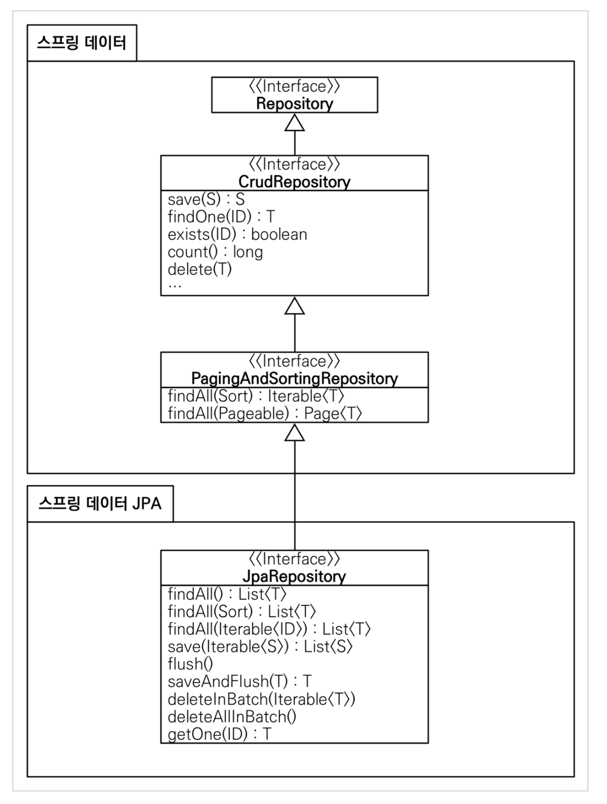

spring data jpa

- `JpaRepositry<T,ID>` 인터페이스를 상속하는 인터페이스를 만들면 준비끝 
  - `T` : 엔티티
  - `ID` : 기본키 타입
  - 스프링부트가 기동시 JpaRepository인터페이스를 구현하고있는 놈들을 알아서 찾고 인스턴스를 생성함.. (별도의 어노테이션필요없음.. 최상의 JpaRepository의 최상위 인터페이스를 찾아가보면 Repository라는 인터페이스가있는데, 요게 마커역할을해서 스프링부트가 알아서 찾아준다)
    - 구현체는 `SimpleJpaReposity`
  - 공통 인터페이스 구성
    - 
  - 주요 메서드
    - `save(S)` : 새로운 엔티티는 저장하고 이미 있는 엔티티는 병합한다.
    - `delete(T)` : 엔티티 하나를 삭제한다. 내부에서 EntityManager.remove() 호출
    - `findById(ID)` : 엔티티 하나를 조회한다. 내부에서 EntityManager.find() 호출
    - `getOne(ID)` : 엔티티를 프록시로 조회한다. 내부에서 EntityManager.getReference() 호출 
      - `EntityManager.getReference()` 요거는 실제 해당 엔티티를 사용하기전까지는 가짜객체(프록시)로 가지고있는것..(자세한것은 `jpa정리.md` 참고)
    - `findAll(...)` : 모든 엔티티를 조회한다. 정렬( Sort )이나 페이징( Pageable ) 조건을 파라미터로 제공할 수 있다.
    - > 참고: JpaRepository 는 대부분의 공통 메서드를 제공한다.
      - 그렇다면 공통외의 기능이 필요하다면..?
        - 이를 spring-data-jpa는 해결했다.. (쿼리메소드기능)
- 쿼리 메소드 기능
  - 메소드이름으로 쿼리 생성
    - intelliJ 플러그인에서 "JPA Buddy"를 설치하면 "JPA Palette"를 사용할수 있는데, 이를 통해서 쉽게 생성 가능
    - 만드는 방법이나 종류는 [reference](https://docs.spring.io/spring-data/jpa/docs/current/reference/html/#jpa.query-methods) 참고
      - by뒤에 아무것도 안넣으면 조건없이 전체조회
    - 조건이 두개정도까지는 이걸쓰는게 괜춘.. 넘어가거나 쿼리가 복잡해지면 너무 길어지고 알아보기힘드니 직접만들던지..할것
    - 이 기능에 또한 큰 장점은 엔티티의 컬럼명을 변경했을때, 해당 컬럼명을 가진 메서드 이름을 변경하지않았다면 애플리케이션 로드시에 에러를 잡아준다..
  - JPA NamedQuery
    ```java
      @Query(name="Member.findByUsername") //해당 name은 @NamedQuery로 Member 엔티티위에 선언되어있어야..
      List<Member> findByUsername(@Param("username") String username); //@Param은 NamedQuery에서 지정한 Param명과 동일해야함

      //여기서 @Query부분을 생략해도되는데, 이는 spring datra jpa가 실행시 아래와 같은 순서로 찾아감
      1. "[엔티티명].[메소드명]" 으로 @NamedQuery를 찾음
      2.  메서드이름으로 쿼리 생성
      3.  ...

      근데 이는 실무에서 잘 사용안한다.. 그냥 @Query 어노테이션을 사용해서 메소드명위에 바로 선언할수있는 기능이 있기때문! 굳이.. 엔티티에 @NamedQuery 안해도되니..

    ```

  - `@Query`, 리포지토리 메소드에 쿼리 정의하기
    ```java
      @Query("select m from Member m where m.username=:username and m.age=:age")
      Member findMember(@Param("username") String username, @Param("age") int age);
    ```
    - 해당 기능을 수행하게되면 메소드이름으로 쿼리생성하는것처럼 메소드 이름이 길어지지않는 장점이 있다
    - 뿐만아니라, 만약 쿼리내부의 컬럼명이 오류가났을때, 어플리케이션 로드시에 위의 JPQL문을 파싱해서 정상적으로 작동하는지 확인하기때문에 컬럼명 오류를 잡아줄수있다! 요게 매우큰장점!!!
    - 동적쿼리는.. ***QueryDSL***로...
  - `@Query`, 값, DTO 조회하기
    ```java
      @Query("select m.username from Member m") //이렇게 string 여러개 가져오게되면 List<String> 쓰면끝
      List<String> findUsernameList(); 

      @Query("select new study.datajpa.dto.MemberDto(m.id,m.username,t.name) from Member m join m.team t") //MemberDto의 패키지명을 다 적어줘야함.. => QueryDSL이 해결책..
      List<MemberDto> findMemberDto();
    ```
  - 파라미터 바인딩
    - 위치기반
      - 사용하지말자.. 위치바뀌면 모두 바꿔줘야하니깐..
    - 이름기반
      - 위의 `@Param` 이 이름기반 바인딩..
    - `Collection` 타입으로 in절 지원
      ```java
        @Query("select m from Member m where m.username in :names")
        List<Member> findByNames(@Param("names") Collection<String> names);
      ```
  - 반환타입
    - 컬렉션
      - 만약 데이터없으면 null이 아니라 빈 컬렉션을 리턴함
    - 단건(엔티티타입)
      - jpa는 기본적으로 데이터 없으면 NoResultException 예외를 던지는데, spring data jpa는 이를 잡아서 그냥 null 반환해준다
      - 두건 이상이 조회되면 에러터짐..
        - 여기서 중요한것은 그냥 jpa 에러를 반환해주는게 아니라, 내부적으로 spring 예외로 변환해서 던져준다! 그래야 기술에 종속되지않을수 있으니!
    - Optional
    - [Reference](https://docs.spring.io/spring-data/jpa/docs/current/reference/html/#repository-query-return-types)
  - 페이징과 정렬
    - 순수 JPA
    - spring data
      - 페이징처리를 표준화해놓음 (spring data jpa가 아니라 data 패키지에서 공통화해놨다..!! data기술이면 모두 사용가능..ㄷㄷ)
        - 페이징과 정렬 파라미터
          - `org.springframework.data.domain.Sort` : 정렬 기능 
          - `org.springframework.data.domain.Pageable` : 페이징 기능 (내부에 Sort 포함)
        - 특별한 반환타입
          - `org.springframework.data.domain.Page` : 추가 count 쿼리 결과를 포함하는 페이징 
          - `org.springframework.data.domain.Slice` : 추가 count 쿼리 없이 다음 페이지만 확인 가능 (내부적으로 limit + 1조회)
            - 이는 모바일에서 내려보다보면 더보기로 데이터 가져오게되는거.. 이는 TotalCount가 필요없음
            - +1을 더 조회하는것은 이를 통해서 더보기를 할지말지 정하는것.. 어찌보면 눈속임..? 즉, 10개씩 보여준다면 11개 가져와서 마지막 1개는 더보기 버튼기능이고, 더보기 클릭시 11~21 가져옴.. 이런식으로 반복... +1이 안되면 더보기 버튼이 안나오겠지
          - `List` (자바 컬렉션): 추가 count 쿼리 없이 결과만 반환
        ```java
          Page<Member> findByUsername(String name, Pageable pageable); //count 쿼리 사용 
          Slice<Member> findByUsername(String name, Pageable pageable); //count 쿼리 사용 안함
          List<Member> findByUsername(String name, Pageable pageable); //count 쿼리 사용 안함
          List<Member> findByUsername(String name, Sort sort);

          //사용방법
          PageRequest.of(pageNumber, size, Sort.by(Sort.Direction.[ASC|DESC]), ...properties);
          //PageRequest는 Pageable의 구현체
          //pageNumber는 0부터 시작함!
          //size는 한 페이지에 몇개씩 보여줄것인지..
          //Sort.by이후 파라미터는 옵션
          

          //Page를 통해서 사용할수있는 페이징처리
          Page<Member> page = memberRepository.findByAge(10, pageRequest);
          List<Member> content = page.getContent(); //조회된 데이터 
          assertThat(content.size()).isEqualTo(3); //조회된 데이터 수 
          assertThat(page.getTotalElements()).isEqualTo(5); //전체 데이터 수 
          assertThat(page.getNumber()).isEqualTo(0); //페이지 번호 
          assertThat(page.getTotalPages()).isEqualTo(2); //전체 페이지 번호 
          assertThat(page.isFirst()).isTrue(); //첫번째 항목인가? 
          assertThat(page.hasNext()).isTrue(); //다음 페이지가 있는가?

        ```

        스프링 데이터 Jpa 페이징과 정렬 14분부터 보기
        
- 기타팁
  - gradle 의존관계보기
    - `./gradlew dependencies --configuration compileClasspath`
  - AssertJ 는 chaining 방식으로 테스트를 손쉽게, 직관적으로 할수있다~
  - 로깅 SLF4J & LogBack
    - SLF4J : 인터페이스
    - LogBack : 구현체중 하나