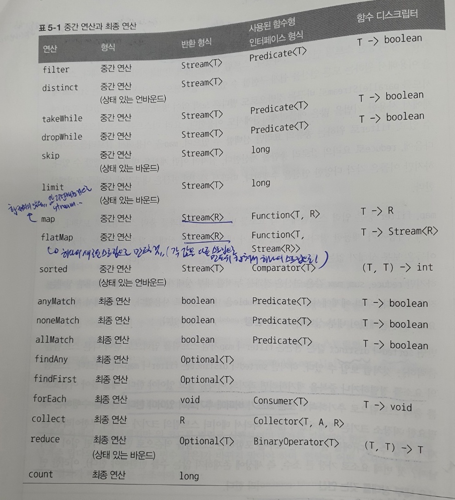
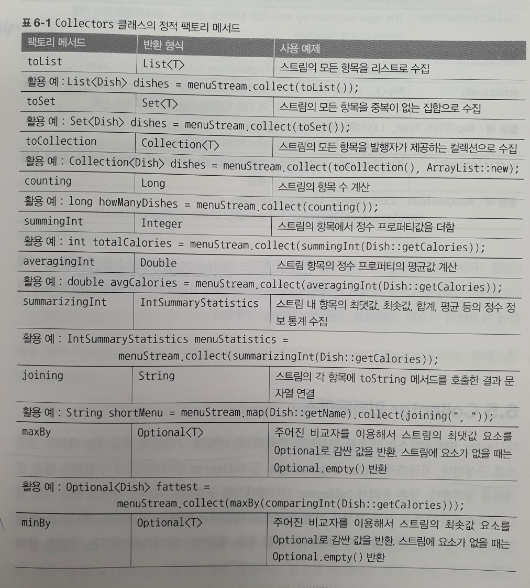
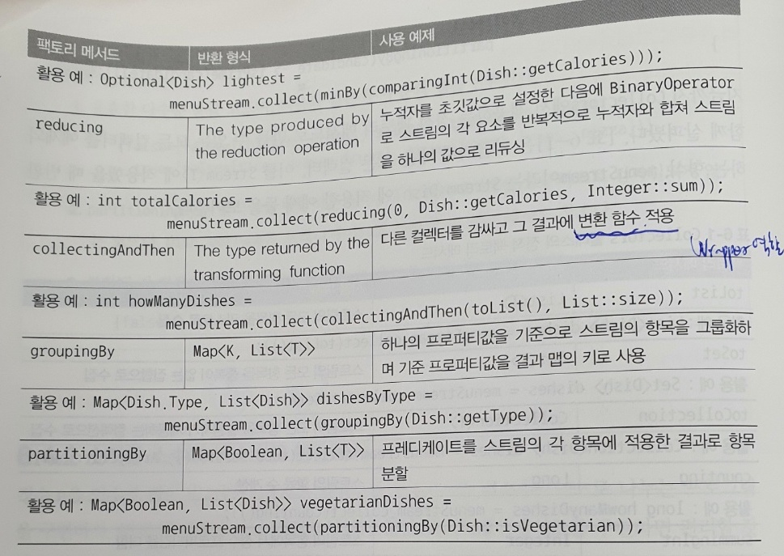
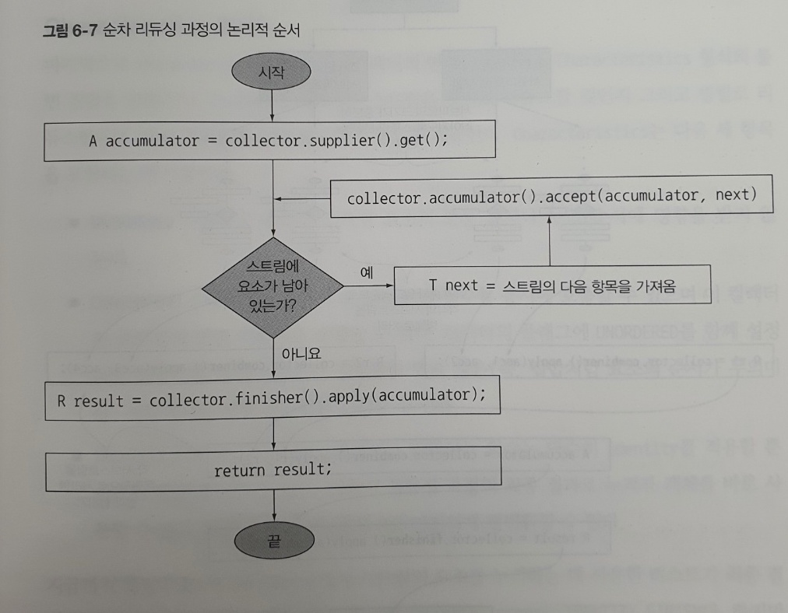

모던자바인액션
- Part 1 - 기초
  - 1장 - 자바 8,9,10,11 : 무슨일이 일어나고있는가?
    - 멀티 코어에 따른 더욱 빠른 데이터 처리가 가능하여졌는데, 자바는 코어 하나만을 기존에 사용하였다.. 이에 따라 멀티코어 이상을 잘 활용할수있도록 병렬처리가 필요해졌고, 이에 대한 대응을 위해 자바 8이상부터 대폭 개선됨(+ 간결함)
    - Java 8에서 제공하는 새로운기술
      - 스트림 API
        - DB의 질의 언어처럼 고수준의 언어로 표현하면, 스트림 라이브러리가 최적의 저수준 실행방법을 선택하여 값을 리턴해준다(forkAndJoin 활용하여 병렬연산같은..)
          - 또한 스트림 파이프라인을 이용해서 입력부분을 여러 CPU 코어에 쉽게 할당할수있다는 부가적인 이득도있음! 즉, 복잡한 병렬작업을 직접처리하지않아도된다!
        - 스트림
          - 한번에 한개씩 만들어지는 연속적인 데이터 항목들의 모임
        - 스트림 메서드로 전달하기위해서는 안전하게 실행할수 잇는 메서드를 만들어야하는데, 이러한 함수를 순수(pure)함수, 부작용없는(side-effect-free) 함수, 상태없는(stateless)함수라 부른다
        - 컬렉션을 처리하면서 발생하는 모호함과 반복적인 코드 문제(루프를 이용하여 각 요소를 반복하면서 작업을 수행 - 외부반복), 멀티코어 활용의 어려움을 해결
          - ***컬렉션은 어떻게 데이터를 저장하고 접근할지에 중점을 두는 반면, 스트림은 데이터에 어떤 계산을 할것인지 묘사하는것에 중점을 둔다!***
        - 필터링, 추출, 그룹핑, 병렬화!
      - 메서드에 코드를 전달하는 기법
        - 동작파라미터화
          - 동작(행위)을 넘겨줄수있도록 하는것!
          - 메서드를 값처럼 전달가능!(이급시민 -> 일급시민으로 격상시킴)
            - 메서드참조
            - 람다
            - 메서드참조 vs 람다
              - 좀더 의미를 명확하게 할수있는것은 메서드참조!
              - 심플하게 전달해줄수잇는것은 람다표현식
              - 코드의 명확성이 항상 중요하기때문에, 간단한거면 람다표현식을, 로직이 복잡해지면 메서드참조를 사용하자!
        
      - 인터페이스의 디폴트 메서드
        - 인터페이스에 무언가 변경이 필요하면, 기존 해당 인터페이스를 구현하는 모든 클래스의 구현을 바꿔야했는데, 기존 구현을 고치지않고도 인터페이스를 바꿀수 있도록 해준것이 인터페이스의 디폴트메서드
         
  - 2장 - 동작 파라미터화 코드 전달하기
    - 자주 바뀌는 요구사항에 효과적으로 대응 하기위함!
    - 동작 파라미터화란 어떻게 실행할 것인지 결정하지않은 코드블럭을 의미.. 실행은 나중에!
      - 스프링에서 사용하는 템플릿/콜백 패턴에서 콜백과 매우 유사함.. 콜백은 템플릿내부에서 실행될것을 목적으로 메서드에 전달해주는 오브젝트인데, 결국 행동을 정의해서 전달해주는것이니 동작파라미터화된것으로 볼수도 있지않을까싶음
    - 런타임에 세부 전략을 넘겨주어 실행되기때문에, 적절한 전략을 선택하는 전략패턴과 매우 긴밀하게 연결됨
    - 동작 파라미터화는 아래의 모습으로 구현가능 (아래로 내려갈수록 간결..)
      - 클래스( new DefinedClazz() ) => 계속해서 클래스 정의해줘야함.. 
      - 익명클래스( new Clazz(){...} ) => new 클래스이름, 함수이름 반복..
      - 람다 (+메서드 참조) ( ()->{} )
  - 3장 - 람다 표현식
    - 람다 : 익명함수!
    - 자질구레한 코드해결을 위해서 도입됨.. 뭔가 새로운 기술적인 기능을 제시해주는것은아님!
    - 함수형 인터페이스에서 유용하게 사용할수잇음
      - 함수형인터페이스
        - 하나의 추상메서드로 구성되어있는 인터페이스!(디폴트 메서드는 여러개 있어도 상관없음)
        - @FunctionalInterface
          - 함수형 인터페이스임을 알려주는것!
          - 그냥 컴파일시에 해당 어노테이션을 사용했음에도, 함수형 인터페이스가 제대로 정의되어있지않으면(ex. 추상메서드 두개..) 에러알려주는것.. 이거 없다고 함수형 인터페이스가 아닌것은 아님!
        - 자바 8에는 여러 함수형 인터페이스가 정의되어있음
          - Consumer
          - Supplier
          - Predicate
          - Function
          - BiFunction
          - UnaryOperator
          - *AutoBoxing 피할수있도록 IntPredicate, LongBinaryOperator, IntFunction.. 등의 기본형으로 셋팅된 함수형 인터페이스를 제공해줌
            - IntPredicate와 Predicate\<Integer\>는 사용할때는 차이가 전혀 없지만, 후자와같은경우 박싱(int -> Integer)이 필요하고, 이 박싱은 힙에 저장되고 메모리를 더 소비하게 된다.. 
        - 자바에서 제공하는 함수형 인터페이스는 checked예외를 던지지못함! 굳이 사용해야한다면 따로 함수형인터페이스를 따로 만들던지, 구현부에서 try~catch로 감싸야함
        - 언제 사용하는것이 좋을까?
          - 전반적으로 비슷하나, 특정부분에서 차이가 있다면 해당부분에 파라미터와 리턴값을ㅇ 잘 맞추어서 이를 함수형 인터페이스로 만들고, 이에 대한 전략을 전달하도록!
    - 람다는 타입을 제공해주지않아도, 알아서 타입추론을 진행한다
      1. 람다를 사용한 메서드의 선언을 확인 
      2. 선언된것을 기반으로 함수형 인터페이스에 타입을 추론하고 이를 기대함(여기서 함수형 인터페이스의 제네릭이라면 타입을 구체화함..) 
         - ex. Predicate 함수형 인터페이스이고, Apple을 제네릭으로 사용했다면, `Predicate<Apple>` 이렇게 적용
      3. 기대한 함수형 인터페이스의 메서드에 어떤 타입이 들어오고 리턴값은 무엇인지를 확인
         - ex. Apple이 전달받을 인수이고, 리턴은 boolean 이구나!
      4. 메서드에 실제 전달된 값이 이와 같은지 확인하여 컴파일
    - 람다 표현식 앞에 "()" 캐스트 연산자를 넣을수있는데, 이는 어떤 메소드 시그니처가 사용되어야하는지를 명시적으로 구분해주는 역할을 한다
      - 예를들어, 인수없고 리턴값 void인 함수형인터페이스는 여러개가 될수있기때문에 어떤놈인지 알려주는것!
      - 캐스트에 인터섹션타입(Intersection Type)이란걸 사용할수도있는데, 이에 대한 설명은 "toby_reactive_stream 유투브 강의정리.md" 에서 확인할것
    - 자유변수를 사용할때는, 람다 캡처링을 이용해서 사용가능
      - 자유변수란 파라미터로 넘겨진 변수가 아닌 외부에서 정의된 변수!
      - 자유변수중에서 힙에 올라가있는 인스턴스변수나 클래스 메모리에 올라가 있는 static변수의 경우는 람다 캡처링에 별 문제가없음.. 
      - 외부 지역변수를 가져올때가 주의해야함
        - 이 외부지역변수는 final로 선언되어있어야하거나, final로 선언된 변수와 똑같이 사용되어야함!(final 없어도 외부에서 해당 변수에 변동을 주면안됨)
          - 지역변수에대한 복사한 값을 람다에 넘겨주는데, 해당 람다가 이후에 다른 스레드에서 실행되엇을때, 어떤 시점에서 실행될지 모르는데, 그때에 변경가능한 자유지역변수를 사용한다면, 스레드 실행시 정확히 어떤 값인지 알수가없다.. 그렇기때문에, final과 같이 해당 변수에 변경이 일어나면안되도록 한것! (Runnable을 구현하는 람다를 생각하면 쉽게 이해할수있음.. 새로운 스레드 만들어졌는데, 만약 변경가능한 지역변수를 복사한다면 항상 동일한 값이 넘어온다는것을 보장할수없다!)
          - 그리고 복사한 값을 쓰는 또 다른 이유는.. 만약 스택에 있는 외부지역변수가 해당 스레드가 종료되어 사라진다면..? 나중에 람다를 실행시키는 또 다른 스레드는 어떻게할것이냐..? 그래서 값에 대한 복사가 필요함.. 그리고 이에 따라 파라미터에 변하는 값이아닌 고정된 값이 넘어온다는 것으로 안전성을 확증할수있음 
        - 람다식에서 외부 지역 변수를 이용할 경우 final 혹은 effectively final 이어야 하는 이유는 지역 변수가 스택에 저장되기 때문에 람다식에서 값을 바로 참조하는 것에 제약이 있어 복사된 값을 이용하게 되는데, 이때 멀티 쓰레드 환경에서 복사 될/복사된 값이 변경 가능 할 경우 이로 인한 동시성 이슈를 대응할 수 없기 때문이다.
        - [설명굿](https://vagabond95.me/posts/lambda-with-final/)
    - 메서드 참조
      - 특정 메서드만을 호출하는 람다의 축약형
      - 명시적으로 메서드명을 참조함으로써 가독성을 높일수 있음
      - 만드는방법
        - 정적 메서드 참조
          - ex. Integer::parseInt
        - 다양한 형식의 인스턴스 메서드 참조
          - ex. String::length, String::compareToIgnoreCase
        - 기존 객체의 인스턴스 메서드 참조
          - ex. this::methodName
          
      |람다|메서드참조|
      |--|--|
      |(args) -> ClassName.staticMethod(args)|ClassName::staticMethod|
      |(arg0, rest) -> arg0.instanceMethod(rest)|ClassName::instanceMethod (여기서 ClassName은 arg0의 타입)|
      |(args) -> expr.instanceMethod(args)|expr::instanceMethod|
    - 생성자 참조
      - ClassName::new 와 같이 new 키워드를 사용해서 생성자의 참조를 만들수있음
      - 생성자중에서 파라미터가 있는놈인지 구분하는것은 함수형인터페이스를 보고 유추가능
        - ex. 
          ```java
            Supplier<Apple> c1=Apple::new; //new Apple()
            Apple a1=c1.get();

            Function<Integer,Apple> c2=Apple:new; //new Apple(Integer) Function에서 받아오는 인수(Integer)를 통해서 파라미터를 지닌 생성자인지 추론가능 
            Apple a2=c2.get();

          ```
    - java가 제공해주는 함수형 인터페이스중에 람다표현식을 조합할수있는 유틸리티 메서드를 제공해주는게 있음!
      - 이 유틸리티 메서드는 디폴트메서드로 정의되어있기때문에 함수형 인터페이스 원칙에 위배되지않는다
      - Comparator 조합
        ```java
          inventory.sort(Comparator.comparing(Apple::getWeight).reversed()); //reversed()는 디폴트메서드,, 무게를 기준으로 내림차순 정렬
          inventory.sort(Comparator.comparing(Apple::getWeight).reversed().thenComparing(Apple::getCountry)); //thenComparing은 디폴트메서드,, 위의 결과에서 두 사과의 무게가 같으면 국가별로 정렬
        ```
      - Predicate 조합
        ```java
          Predicate<Apple> redAndHeavyAppleOrGreen=
            redApple.and(apple -> apple.getWeight()>150)      // 빨간색이면서 150 보다 크고
                    .or(apple -> GREEN.equals(a.getColor())); // 또는 그냥 녹색사과 (redApple에서 녹색사과있음 이를 리턴해줌)
                    
        ```
        - 주의 : A or B and C 는 (a||b) && c 와 같음
      - Function 조합
        - andThen
          - 먼저 적용한 결과를 다른 함수의 입력으로 전달하는 함수를 반환
          - Function\<A,B\>.andThen(Fucntion\<B,C\>)
            - 앞의 Function 결과를 뒤에 Function의 파라미터로 넘겨줌.. 결과는 C타입
        - compose
          - 인수로 주어진 함수를 먼저 실행한 다음에 그 결과를 외부함수의 인수로 제공 
          - Function\<B,C\>.andThen(Fucntion\<A,B\>)
            - 뒤의 Function의 결과를 앞의 Function의 파라미터로 넘겨줌 결과는 C 타입
  - Part1 기타 팁
    - 비슷한 코드가 반복적으로 보이면 추상화해라!
    - 공통으로 사용되는것은 최대한빼라!!
      - System.out.println이 공통으로 사용된다면, syso은 빼고, syso에서 찍을 String을 리턴받도록해라!
    - 여러 타입에서 동일한 로직을 사용한다면, Object가 아닌 제네릭을 사용하여, 세련된 코드와 더불어 타입에 대한 안정성도 보장받도록하자!
      ```java
        //List<?> 를 filter하는 로직
        public static <T> List<T> filter(List<T> list, Predicate<T> p){
          List<T> result=new ArrayList<>;
          for(T t:list){
            if(p.test(t)){
              result.add(t);
            }
          }

          return result;
        }

      ```
    - ExecuterService를 이용하면 테스크를 스레드 풀로 보내고, 결과를 Future로 저장할수있다!! (기존 멀티스레드 사용할때, 결과를 받지 못하는점을 해결)
    - 함수형 프로그래밍은 의미전달에 탁월!
    
      ```java
        List<Apple> inventory ..;

        inventory.sort(comparing(Apple::getWeight));
        //Apple을 weight으로 비교해서 inventory를 sort하라!

      ```   
    - 용어정리
      - 함수형 프로그래밍 : 
      - 람다 
        - 익명함수 + 메서드를 인수로 전달가능(메서드참조)
        - 익명 클래스와 유사.. 
      - 함수 : 특정클래스에 종속x. 정적메서드와 같은 의미로 사용
      - 메서드 : 특정 클래스에 종속

      - 익명함수 : 
      - 메서드참조 
      - 익명클래스 : 
      - 리엑티브 프로그래밍 : 변화가 일어나면 그에대해 반응하는 방식으로 프로그래밍하는것. 이를 위해 리엑티브 스트림즈에서 표준을 만들어놓았고 pub-sub 구조를 사용. 스프링은 project reactor라는 라이브러리를 가져다가 사용하였고, 이벤트가 발생하게되면, 발행하는 상위스트림에서 이를 구독하는 하위스트림으로 오퍼레이터를 거쳐 진행하게된다. 
        - project reactor를 보면 선언형으로 되어있기에 가독성 측면에서 좋을뿐아니라, 수많은 오퍼레이터를 제공해줌으로써 개발자가 일일이 멀티스레드와 같은 로우레벨의 코드를 직접 개발하지않고 최적의 성능을 가지고 비지니스 로직을 개발할수있다.
        - 하지만, 이에 따라 디버깅이 쉽지않다
        - 참고 괜찮음 : https://luv-n-interest.tistory.com/1279
      - 리엑티브 스트림즈 : 
      - https://mangkyu.tistory.com/111
      - https://dinfree.com/lecture/language/112_java_9.html
      - 메소드와 함수 (Method and Function)의 차이점
        - 함수가 메소드를 아우르는 포괄적인 용어이다.
        - 함수는 객체로부터 독립적이며, 메소드는 객체에 종속적이다.
        - 메소드는 거의 모든 면에서 함수와 동일하지만, 아래의 2가지 포인트에서 다른 점이 있다.
          - 메소드는 호출된 객체에 암시적으로 전달된다.
          - 메소드는 클래스 안에 있는 data를 조작할 수 있다.
        - 기본적으로 두 용어의 뜻은 동일하나 '객체(클래스)로부터 독립적인가 아닌가'가 함수와 메소드를 나누는 기준이다.
      - 함수 디스크립터
        - 함수형 인터페이스의 추상 메서드 시그니처
        ~~- 람다 표현식의 시그니처를 서술하는 메서드 (딱 와닿진 않는듯..)~~
          - 대략 람다가 사용할 추상메서드가 어떤 모양으로 되어있는지 설명하는거라고 생각하면될듯..?
        - ex) 
          - () -> void
            - 인수없고 리턴값도 없는 시그니처
          - (Apple, Apple) -> int
            - 두개의 Apple 인수를 받고, 리턴타입이 int인 시그니처


```java
    public static <T, U extends Comparable<? super U>> Comparator<T> comparing(  //U는 Comparable을 상속받는놈.. Comparable에 들어가는 제네릭 타입은 U의 슈퍼타입가능
            Function<? super T, ? extends U> keyExtractor)
    {
        Objects.requireNonNull(keyExtractor);
        return (Comparator<T> & Serializable)
            (c1, c2) -> keyExtractor.apply(c1).compareTo(keyExtractor.apply(c2));   //(c1,c2) -> U타입.compareTo(U타입).. 즉 Function에서 return해주는 타입을 가지고 비교해라..
    }

```

- Part 2 - 함수형 데이터 처리
  - 4장 스트림 소개
    - 스트림
      - 정의 : 데이터 처리 연산을 지원하도록 소스(ex. List)에서 추출된 연속된 요소(Sequnce of elements)
        - 연속된 요소 : 연속된 값 집합의 인터페이스를 제공하는것은 컬렉션과 동일하나, 컬렉션은 요소 저장 및 접근 연산이 주를 이루고, 스트림은 filter, map, sorted와 같이 표현 계산식이 주를 이룸
        - 소스 : 컬렉션, 배열, IO 자원 등의 데이터 제공 소스로부터 데이터를 소비.. 정렬된 컬렉션으로 스트림이 생성되면 정렬이 당연 그대로 유지됨
        - 데이터 처리 연산 : 연산은 순차적으로도 가능하고 병렬적으로도 가능! 
      - SQL 질의와 같이 명확하게 기대하는것이 무엇인지를 표현(선언형! 보이는곳에서 루프로 데이터처리를 하지않음)
        - *선언형 코드와 동작파라미터를 잘 활용하면 변하는 요구사항에 명시적이고 빠르게 대응할수있다
      - 병렬처리에 용이
      - 데이터처리 (스트림)파이프라인을 만들어서 여러 연산을 가독성있게, 명확하게 볼수있다
      - 반복자와 마찬가지로 해당 스트림은 한번 소비되면 끝이다! 스트림이 또 필요하면 다시 소스로부터 스트림을 생성해야한다! (I/O라면 소스를 반복사용할수없으므로 새로운 스트림만들수없음!)
      - 특징요약
        - 선언형 : 간결, 가독성 굿
        - 조립할수있음 : 유연성 굿
          - filter, map, flatmap 등과 같은 중간연산은 모두 Stream을 반환하고 그로인해서 파이프라인을 구성할수있음
        - 병렬화 : 성능 굿(쉽게 병렬화가능)
      - *스트림 vs 컬렉션
        - 공통점
          - 연속된 요소 형식의 값을 저장하는 자료구조의 인터페이스를 제공(자료구조에 순차적으로 접근할수있는 API 제공한다는말)
        - 차이점
          - 데이터를 언제 계산하느냐가 컬렉션과 스트림의 가장 큰 차이
            - 컬렉션은 현재 자료구조가 포함하는 모든 값을 메모리에 저장해야함.. 즉, 컬렉션의 모든 요소는 컬렉션에 추가하기전에 계산되어야한다!(무언가를 미리 만들어놓고 더하거나 빼거나하니깐..)
            - 스트림은 이론적으로 요청할때만 요소를 계산하는 고정된 자료구조! 사용자가 데이터를 요청할때만 값을 계산하기때문에 게으르게 만들어지는 컬렉션과 같음!
          - 반복문의 차이!
            - 컬렉션은 외부반복.. 명시적으로 컬렉션 항목을 하나씩 가져와서 처리한다(내가 직접 손대서 처리.. 병렬작업있으면 겁나 까다로움)
            - 스트림은 내부반복을 이용하여 작업을 투명하게 병렬로 처리하거나 더 최적화된 다양한 순서로 처리!(내가 직접 손대지않는다)
      - 스트림 이용하기
        - 스트림 이용과정
          - 질의를 수행할 (컬렉션 같은) ***데이터 소스***
          - 스트림 파이프라인을 구성할 ***중간연산 연결*** (항상 스트림을 반환함)
          - 스트림 파이프라인을 실행하고 결과를 만들 ***최종연산*** (스트림이 아닌 값을 반환함)
          - *스트림 파이프라인은 빌더패턴과 비슷.. build가 최종연산(ex. collect, foreach..)과 같음
  - 5장 스트림 활용
    - 필터링
      - filter
      - distinct
        - hashCode, eqauls로 같은지 확인..
    - 스트림 슬라이싱 (java 9)
      - 스트림의 요소를 선택하거나 스킵하도록 해줌
      - predicate를 이용한 슬라이싱
        - Loop를 다 돌지않고 특정 조건에 부합하지않다면 바로 끝냄 (정렬이 되어있어야 쓸수있겟지?)
        - takeWhile(Predicate)
          - 처음으로 거짓 마주하게되면, 그 지점에서 작업을 중단하고 그놈전까지의 요소를 반환
        - dropWhile(Predicate)
          - 처음으로 거짓 마주하게되면, 그 지점에서 작업을 중단하고 그놈부터 시작하여 남은 모든 요소를 반환
      - 스트림 축소
        - limit(n)
          - 해당 숫자만큼 차면 바로 반환
      - 요소 건너뛰기
        - skip(n)
    - 매핑
      - map
        - 함수를 적용한 결과가 새로운 요소로 매핑(변환 된다고 생각하면됨)
      - flatmap
        - 스트림을 리턴하나, 해당 스트림은 결국에 합쳐져서(평면화되어) 하나의 스트림으로 반환된다
        - (같은말)flatMap 메서드는 스트림의 각 값을 다른 스트림으로 만든 다음에 모든 스트림을 하나의 스트림으로 연결하는기능!
    - 검색과 매칭
      - 특정속성이 데이터 집합에 있는지 여부를 검색하는 데이터 처리 
      - anyMatch, allMatch, noneMatch 모두 쇼트서킷 기법을 사용
        - *쇼트서킷 : 전체 스트림을 처리하지않더라도 결과를 반환하는것! 예를들어, and연산에서는 연산중에 하나라도 거짓이라면 다 거짓이기때문에 뒤의 계산을 굳이하지않는다.. 이것을 쇼트서킷이라함(무한한 요소를 가진 스트림을 유한한 크기로 줄일수있는 유용한 연산)
      - findAny
        - 이 또한 쇼트서킷을 이용하여 결과를 찾는 즉시 실행종료를 하게되는데, 반환값이 Optional\<T\>이다.
          - 여기서 Optional은 값이 존재하지않을수도 있기떄문에 제공해주는것으로, 값이 존재하지않을때 어떻게 동작할것인지를 지정할수있다! 이를 통해 코드의 안전성을 높일수있음!
      - findFirst
        - 논리적인 아이템 순서가 정해져있을때, 첫번째 요소를 찾을수있다\
        - *findAny vs findFirst
          - 병렬실행에서는 첫번째 요소를 찾기어려움.. 반환 순서가 상관없다면 병렬스트림에서는 제약이 적은 findAny를 사용해야한다!
    - 리듀싱
      - 모든 스트림 요소를 처리해서 값으로 도출하는것(요소들을 더하거나 기타 연산을 하면서 줄여나가는것)
      - 요소의 합, 최대최소 등에 쓰임
        ```java
            int sum=numbers.stream().reduce(0,(a,b) ->  a+b); //합계 
            int sum=numbers.stream().reduce(0,Integer::sum); //합계.. 이렇게도 쓰임\

            Optional<Integer> sum=numbers.stream().reduce((a,b) ->  a+b); //합계 (초기값 없기때문에 빈값이 들어올수있으므로 Optional)

        ```
    - *스트림연산
      - 내부 상태없음
        - filter, map 과 같이 내부에 상태를 갖지않는연산(넣으면 넣을수있지만, 보통의 이야기..)
      - 내부 상태있음
        - 한정되어있음
          - reduce, sum, max...
        - 한정되어있지않음
          - distinct, sorted...
    - 스트림 연산 문법 간략 정리
      - 
    - 숫자형 스트림
      - 스트림 API 숫자 스트림을 효율적으로 처리할 수 있도록 ***기본형 특화스트림***을 제공
      - 이를 사용함으로써 박싱 비용을 피할수있을뿐아니라, sum,max등 숫자관련 리듀싱연산 수행 메서드도 제공
      - boxed를 통해서 특화스트림을 일반스트림으로 변경할수도있음
        ```java
        IntStream intStream=menu.stream().mapToInt(Dish::getCalories);
        Stream<Integer> stream=intStream.boxed();
        ```
      - 종류
        - IntStream
        - DoubleStream
        - LongStream
      - 숫자범위도 만들수 있음
        ```java
        IntStream intStream=IntStream.rangeClosed(1,100); //1과 100 포함
        IntStream intStream=IntStream.range(1,100); //1과 100 포함x

        ```
    - 스트림 만들기
      - 값으로 만들기
        - Stream.of
        - Stream.empty(); //껍데기만드는것
      - null이 될수 있는 객체로 스트림 만들기 (java 9)
        - Stream.ofNullable
      - 배열로 스트림 만들기
        - Arrays.stream
          - 넘어오는 파라미터에 따라 숫자형스트림으로 반환할수도있음!
      - 파일로 스트림 만들기
        - Stream\<String\> stream=Files.Lines(파일경로);
      - 무한스트림(언바운드스트림)
        - 제한이 없이 계속 생성되기때문에 보통 limit과 같이 쓰임
        - iterate
        - generate
          - Supplier\<T\> 를 인수로 받아서 새로운 값을 생산
          - 병렬작업시 Supplier에는 상태값이 있으면 안전하지않다!!
  - 6장 스트림으로 데이터 수집
    - collect에 다양한 요소 누적 방식을 인수로 받아서 스트림을 최종결과로 도출하는 리듀싱연산을 수행할수 있음(Collector를 인수로받음.. Collector는 인터페이스이고 Collectors는 Collector의 구현체들을 모아놓은 클래스)
    - collect는 요소한개씩 가져와서 파라미터로 받은 동작을 수행하도록 해준다(리듀싱 연산)
      - collect로 결과를 수집하는 과정을 간단하면서도 유연한 방식으로 정의할수있도록 해주는것이 컬렉터! 이 컬렉터를 통해 동작파라미터화가 가능!
    - Collectors(클래스) 에서 제공하는 메서드 기능
      - 스트림 요소를 하나의 값으로 리듀스하고 요약
        - 스트림에 있는 객체의 숫자 필드의 합계나 평균등을 반환하는 연산을 요약연산이라함
        - counting(), maxBy, minBy, summingInt, averagingInt, summarizingInt ...
          - summarizingInt 요놈은 count, sum, min, average, max 다나옴
        - joining을 통해서 문자열 연결도 가능
          - 구분자 넣을수있음
        - 위의 예처럼 특화되어있는것 말고 범용적으로 사용하기위해서는 reducing을 사용하면됨
          - 초기값, 변환함수, 두항목을 하나로 더하는 BinaryOperator 이렇게 3개의 인수를 가짐
          - 하나의 인수를 갖기도하는데, 스트림의 첫번째요소가 시작값이됨
          - *collect vs reduce <span style="color:yellow">좀 더 찾아볼것 p206</span>
            - collect 메서드 : 도출하려는 결과를 누적하는 컨테이너를 가지고 reducing
            - reduce 메서드 : 두 값을 하나로 도출하는 불변형 연산 
            - 참고사이트 : https://stackoverflow.com/questions/22577197/java-8-streams-collect-vs-reduce
              - 첫번째 답변
                - collect를 사용하여 StringBuilder 라는 컨테이너에 String 데이터를 축적하는 방식으로 만들수있음..
                - reduce를 사용하면 String을 더하는 reduce쓰면 매우 성능안좋음.. 왜냐하면 더할때마다 String을 새로 만들어야하기때문
                - 실제 코딩으로 구현해봤을때 아래와 같이 가능한데, 실제 내부 구현을 살펴보면 동일한 로직탐.. <span style="color:yellow">다른 답변을 참고하던 암튼 더 살펴볼필요있음..!</span>
                  ```java
                    Stream.of("ab","cd","ef").reduce(new StringBuilder(),(builder,s)->builder.append(s),StringBuilder::append);
                    Stream.of("ab","cd","ef").collect(StringBuilder::new, (container, s) ->container.append(s) ,StringBuilder::append);
                  ```

      - 요소 그룹화
        - 그룹화할 key를 넘겨주는함수를 분류함수 라고 함 (근데 여기서 함수는 정적메서드는 아님.. 클래스에 독립되어있지않음)
        - groupingBy에 두번째인수를 활용하여 그룹핑한 데이터에 추가적인 조작이 가능 
          - filtering
          - mapping
          - flatMapping
          - groupingBy
            - `Map<key1, Map<key2, List<Dish>>>` 이런 형식으로 나옴
          ```java
            groupingBy(Dish::getType
                        , filtering(d -> d.getCount()>5, toList())
                      )
            );
          ```
        - groupingBy(f) 는(하나의 인수만 갖는), 사실 groupingBy(f,toList()) 와 같다!
        - 컬렉터의 결과를 다른 형식에 적용가능
          - Collectors.collectingAndThen
            - 적용할 컬렉터와 변환함수를 인수로 받아 다른 컬렉터를 반환해줌.. Wrapper 역할!
      - 요소 분할
        - Prdicate를 분류함수로 사용
        - 맵의 키 형식은 Boolean으로, 최대 두개의 그룹을 가짐
        - 참, 거짓 두가지 요소의 스트림 리스트를 모두 유지하는것이 분할의 장점!(필터링하면 참인것들만 되므로..)
      - 
      - 
    - Collector 인터페이스
      - 리듀싱 연산을 어떻게 구현할지 제공하는 메서드 집합으로 구성
      - 이를 통해서 collect에 보내줄 리듀싱 적절하게 커스텀가능
      ```java
        public interface Collector<T,A,R> {
            Supplier<A> supplier(); // 인스턴스 만들어줌..
            BiConsumer<A,T> accumulator(); // 수집될 곳에 누적해주는곳
            Function<A,R> finisher(); // 최종결과를 반환해줌.. 누적자를 그대로 반환할거면 항등함수(나 자신을 반환)를 반환해주는 Function.identity() 사용하면됨
            BinaryOperator<A> combiner(); // 스트림의 서로 다른 서브파트를 병렬로 처리할때 누적자가 이 결과를 어떻게 처리할지 정의 (포크조인 프레임워크를 사용하여 병렬처리)
            Set<Characteristics> characteristics(); //병렬로 할때 어떠한 최적화를 선택할건지에 대한 힌트
        }

        // T는 수집될 스트림 항목의 제네릭 형식
        // A는 누적자, 즉 수집과정에서 중간 결과를 누적하는 객체의 형식
        // R은 수집 연산 결과 객체의 형식(항상 그런것은 아니지만 대개 컬렉션형식)

        /**
            스트림 병렬 리듀싱 수행과정
            1. 스트릠을 분할해야 하는지 정의하는 조건이 거짓으로 바뀌기 전까지 원래 스트림을 재귀적으로 분할(너무 작업의 크기가 작아지면 병렬 수행의 속도는 순차 수행의 속도보다 느려짐.. 프로세싱 코어의 갯수롤 되도록이면 초과하지말것!)
            2. 서브 스트림의 각 요소에 리듀싱 연산을 순차적으로 적용해서 서브스트림을 병렬로 처리
            3. 컬렉터의 combiner 메서드가 반환하는 함수로 모든 부분결과를 쌍으로 합침.. 모든 서브스트림의 결과가 합쳐지면 연산이 완료

        */ 
            
        /**
            Characteristics 메서드
            - UNORDERED : 리듀싱 결과는 스트림 요소의 방문 순서나 누적 순서에 영향을 받지 않는다
            - CONCURRENT : 다중 스레드에서 accumulator 함수를 동시에 호출할 수 있으며 이 컬렉터는 스트림의 병렬 리듀싱을 수행할수 있음 UNORDERED를 명시하지않으면, 데이터 소스가 정렬되어있지 않은(like 집합) 놈들한테만 병렬 리듀싱을 수행
            - IDENTITY_FINISH : 누적자 객체를 최종 결과로 바로 사용
        
        */
        
      ```
      - 

  - 7장 병렬 데이터 처리와 성능
    - 병렬 스트림
      - 각각의 스레드에서 처리할 수 있도록 스트림 요소를 여러 청크로 분할한 스트림
      - 내부적으로 ForkJoinPool 사용(프로세서 수 와 동일한 스레드생성)
      - 병렬 스트림 효과적 사용하기
        - 순차스트림과 병렬스트림을 적절한 벤치마크로 직접 성능을 측정하여 비교하는것이좋음
          - *벤치마크 (컴퓨팅): 컴퓨터의 부품 등의 성능을 프로그램을 이용하여 비교, 평가하여 점수를 내는 결과 
        - 자동박싱과 언박싱은 성능을 크게 저하시킬수 있으니 특화스트림을 활용하자
        - findFirst와 같은 순서에 의존하는 연산보다는 findAny 를 병렬에서는 사용하자
        - 소량의 데이터에서는 병렬스트림이 도움되지 않을 수 있음
        - 스트림을 구성하는 자료구조가 적절한지 확인해야함
          - ArrayList를 LinkedList보다 효율적으로 분할 가능.. 
            - LinkedList는 모든 요소를 탐색해야하지만, ArrayList는 요소를 탐색하지않고도 리스트를 분할수있음
          - range 팩토리 메서드로 만든 기본형 스트림도 쉽게 분해가능
          
          |소스|분해성|
          |--|--|
          |ArrayList|훌륭함|
          |LinkedList|나쁨|
          |IntStream.range|훌륭함|
          |Stream.iterate|나쁨|
          |HashSet|훌륭함|
          |TreeSet|훌륭함|

        - 필터연산은 효과적인 스트림 병렬 처리가 어려움
        - 병합과정(ex. Collector의 combiner 메서드) 비용이 비싸지않도록!
    - 포크/조인 프레임워크
      - 병렬화 할 수 있는 작업을 재귀적으로 작은 작업으로 분할한 다음에 서브태스크 각각의 결과를 합쳐서 전체결과를 만들도록 설계
      - 분할 정복 알고리즘 사용
      - 일반적으로 애플리케이션에서는 둘 이상의 ForkJoinPool을 사용하지않는다! 싱글톤으로 사용
      - 포크/조인 프레임워크를 제대로 사용하는 방법
        - join 메서드를 태스크에 호출하면 태스크가 생산하는 결과가 준비될떄까지 호출자를 블록시킨다.. 그렇기때문에 두 서브태스크가 모두 시작한 다음에 join을 호출할것!
        - 왼쪽과 오른쪽 작업 모두에 fork 메서드를 호출하는것이 아닌, 한쪽잡업에는 compute를 호출하는것이 효과적!
          - 두 서브태스크의 한 태스크에는 같은 스레드를 재사용 할 수 있으므로 풀에서 불필요한 태스크를 할당하는 오버헤드를 피할수있음(현재 스레드가 할수있는 작업을 다 마무리하는게 좋지.. 굳이 다시 새로운 스레드를 할당하는 작업할 필요가 없다는뜻)
        - 각 서브태스크의 실행 시간은 새로운 태스크를 포킹하는데 드는 시간보다 길어야 효율적!
      - ***작업훔치기*** 를 통해서 ForkJoinPool의 모든 스레드를 거의 공정하게 작업이 배정된다
        - 할일이 없어진 스레드는 유휴 상태로 바뀌는것이 아니라, 다른 스레드 큐의 꼬리에서 작업을 훔쳐온다(Deque라서 가능)
    - Spliterator 인터페이스 <span style="color:yellow">이 부분은 다시 공부해보자.. 어렵다..</span>
- Part3 - 스트림과 람다를 이용한 효과적 프로그래밍
  - 8장 컬렉션 API 개선
    - 리스트와 집합처리 
      - 새로운 컬렉션을 만드는것이 아니라, 기존 컬렉션을 변경한다!
      - 메서드종류
        - removeIf
          - 프레디케이트를 만족하는 요소를 제거..
          - List, Set 구현체 모두 사용가능
          - for-each 루프에서 ConcurrentModificationException 을 예방해줌..
            - 자세한예시는 "자바의정석_Collection.md" 에 정리해놨음
        - replaceAll
          - UnaryOperator 함수를 이용해 요소를 바꿈
          - List 구현체에서 사용
        - sort
          - 리스트를 정렬
          - List 구현체에서 사용
            - Set은 스트림 sorted사용하면될듯..
    - 맵 처리
      - Map인터페이스에 디폴트 메서드로 자주 사용되는 패턴을 만들어놓앗음
        - forEach
          - key, value 사용가능
        - 정렬
          - Value 기준 또는 Key 기준으로 정렬가능
          ```java
            Map<String,String> map=new HashMap<String,String>(){{put("Rapheal","Star Wars");put("Cristina","Matrix");put("Olivia","James Bond");}};
            map.entrySet().stream()
                    .sorted(Map.Entry.comparingByKey()) //key 기준으로 정렬
                    .forEachOrdered(System.out::println); // forEachOrdered는 병렬시 순서보장을 해준다.. 그러나 그렇게되면, 병렬의 이점을 누리지못한다..
          ```
        - getOrDefault
          - key가 존재하지않을때 반환할 default값 셋팅
        - 계산패턴
          - computeIfAbsent
            - 제공된 키에 해당하는 값이 없으면(또는 Null), 키를 이용해 새 값을 계산하고 맵에 추가
          - computeIfPresent
            - 제공된 키가 존재하면 새 값을 계산하고 맵에 추가
          - compute
            - 제공된 키로 새 값을 계산하고 맵에 추가
        - 삭제패턴
          - remove(key,value)
            - 특정 value가 있을때 해당 key를 제거하도록 가능
        - 교체 패턴
          - replaceAll
            - BiFunction을 적용한 결과로 각 항목의 ***값***을 교체
          - replace
        - 합침
          - putAll(Map)
            - 합치려고 하는 대상에 중복된 key가 있으면 합치려고 하는 대상의 값이 들어감
          - merge(key,value,BiFunction)
            - 중복되었을때 어떻게 처리할것인지 구체적으로 명시가능
            - value에 값을 지정하면, 해당 key값의 value에 대한 초기화를 수행하도록 가능하다(해당 key가 기존 map에 없을때)
              - 만약 중복되면 BiFunction 함수 타게되니깐 그에 맞는 중복처리해주면됨 
              - ex. moviesToCount.merge(movieName, 1L, (key, value) -> count + 1L); //movieToCount 맵에 movieName이라는 key가 처음들어오면 값을 1L로 셋팅하고, 중복이면 기존 count에 +1을 해라!
          ```java
            Map<String,String> map1=new HashMap<String,String>(){{put("Rapheal","Star Wars");put("Cristina","Matrix");put("Olivia","James Bond");}};
            Map<String,String> map2=new HashMap<String,String>(){{put("Kim","Star Wars");put("Cristina","Matrix2");put("Park","James Bond");}};
            map1.forEach((k,v) -> map2.merge(k,v,(movie1,movie2)->movie1+" & "+movie2)); // BiFucntion에서 return이 null이면 해당 key는 제거됨
                                                                                        // map1의 Cristina의 value가 null이라면, merge 되엇을때 Matrix2로 대치됨..("Matrix2 & null" 이렇게 반환안된다는거!)
            //map2.putAll(map1); // "Cristina" 라는 중복되는 key의 value는 Matrix 로 엎어쳐짐

            System.out.println(map2);
          ```
      - 개선된 ConcurrentHashMap
        - 리듀스할때, 병렬성 기준값(Threshold)에 따라 병렬처리 가능
          - Threshold가 1이면 병렬.. Long.MAX_VALUE 면 순차..
      - *JAVA8 의 HashMap 성능개선
        - 버킷이 너무 커질 경우 LinkedList로 저장되어있는 데이터를 트리로 변경함
          - key가 String, Number 클래스 같은 Comparable 형태여야만 트리가 지원
  - 9장 - 리팩터링, 테스팅, 디버깅
    - 익명클래스를 람다로 리팩터링해서 불필요한 코드 반복을 줄일수 있다
      - 주의해야할점
        - 익명클래스의 this와 람다내부의 this는 다른객체를 가리킨다
          - 익명클래스의 this는 익명클래스 자신을, 람다내부의 this는 람다를 호출하는 클래스를 가리킨다
          - 익명클래스, 람다 모두 외부의 변수를 사용할수있으나, 익명클래스에서는 외부변수와 같은 변수이름을 선언하여 사용할수잇는반면(외부 변수를 가림 - shadow variable), 람다는 외부 변수와 같은 이름의 변수를 내부적으로 선언해서 사용불가!
          - 익명클래스에서 람다표현식으로 바꿀때, 콘텍스트 오버로딩에 따른 모호함이 초래될수있음
            - 람다표현식을 사용할때 명시적으로 타입캐스팅을 선언해줌
    - 람다표현식이 길어지거나 명확하게 어떤 행동을 하는지 알수없을때에는, 메서드 참조로 리팩터링할것!
    - 명령형 데이터처리된것을 가능하면 스트림으로 리팩터링할것!(가독성 훨씬 좋음)
    - 코드 유연성 개선
      - 람다를 전달해서 다양한 동작을 표현할수잇는, 즉 동작 파라미터화가 가능하여 변화하는 요구사항에 대응할수있도록 만들자
      - 이를 위해서 함수형 인터페이스가 필요!
      - 알아두면 좋은 패턴
        - 조건부 연기 실행
          - 객체의 상태에 따라 특정행동을 수행(조건부 연기) 해야 한다면, 함수형 인터페이스 & 람다표현식(or 메서드 참조)을 활용하자!
            - 이는 가독성이 좋아질뿐아니라, 캡슐화(객체의 상태를 클라이언트에게 직접 노출하지않아도되니깐)도 강화된다!
          - ex. Logging시 특정 레벨에 사용자가 원하는 형식의 로그를 남기고 싶을때.. 
            ```java
                public void log(Level level, Supplier<String> msgSupplier){
                    if(logging.isLoggable(level)){
                        log(level, msgSupplier.get());
                    }
                }
                //넘겨받은 level이 현재 Logging의 level인지를 클라이언트에게 노출할필요없이 Logging 객체에서 진행가능하고(객체지향!), 특정 level에서 찍고 싶은 메세지(더 나아가 여러 행동들)를 사용자에게 전달받음으로써 클라이언트마다 원하는 동작들을 수행할수있을뿐 아니라, 해당 level이 되었을때만 동작하는 지연된(연기) 실행이 되어 불필요한 리소스 낭비가 줄일수있다
            ```
        - 실행 어라운드
          - 같은 준비, 종료과정을 반복적으로 수행하는 코드있다면, 반복적으로 수행하는 부분에서 변화가 잇는부분을 분리하여 파라미터화(동작파라미터 - 함수형인터페이스)해서 클라이언트에게 넘겨받도록한다
          - 템플릿/콜백 패턴과 동일
    - 람다 테스팅
      - 람다를 사용하는 메서드의 동작에 집중!
        - 세부 구현을 포함하는 람다 표현식을 클라이언트에게 공개하지않아야하니깐, 람다표현식을 사용하는 메서드의 동작을 테스트함으로써 람다표현식을 검증할수있다 (람다 검증은 그냥 람다쓰고있는 메서드를 호출해서 그 결과로 검증해라는뜻인듯)
      - 복잡한 람다를 테스트하기위해서는 메서드참조로 변경하여 테스트하는게 좋음(어차피 복잡한 람다는 메서드 참조로빼는게 가독성이 좋기떄문에.. 그리고 메서드참조를 사용하면 해당 람다로직을 검증하기도 수월)
      - 메서드가 람다를 인수로받는다면, 다른 람다로 메서드의 동작을 테스트
    - 디버깅
      - ***스트림 파이프라인의 연산들에는 peek 을 사용할수있다! 이는 데이터를 소비하지않기때문에, 연산중간중간에 넣어서 어떻게 데이터가 어떻게 처리되고있는지 디버깅할수있다!***
- Part 4 매일 자바와 함께
  - 11장 - null 대신 Optional 클래스
    - null 때문에 발생하는 문제
      - 에러의 근원 : NullPointerException..
      - 코드를 어지럽힘 : 중첩된 null 확인 코드를 추가해야 하므로 null 때문에 코드가독성이 떨어짐
      - 아무 의미가 없음 : null은 아무 의미도 표현하지않음. 
      - 자바 철학에 위배 : 자바는 개발자로부터 모든 포인터를 숨겼는데, null 포인터는 예외로 만들어놧음..
      - 형식 시스템에 구멍을 만듦 : null은 무형식이며 정보를 포함하고있지 않으므로 모든 참조형식에 null을 할당할수 있음.. 이런식으로 null이 할당되기 시작하면서 시스템의 다른 부분으로 Null이 퍼졌을때 애초에 null이 어떤의미로 사용되었는지 알수없음..
    - Optional 클래스
      - java 8은 하스켈과 스칼라의 영향을 받아서 java.util.Optional\<T\> 라는 새로운 클래스를 제공
      - Optional을 사용함으로써 값이 없을수 있음을 명시적으로 보여주는것!
        - 즉, null이 될수도있고 안될수도있는놈이다! 라고 알려주는것
        - 모든 null 참조를 Optional로 대치하는것은 바람직하지않음!! 도메인에 null값이 들어가지않아야할곳에는 Optional을 쓰면안됨! 이때 Null이 발견되었다면 알고리즘의 버그이므로 이를 수정해야함.. Optional을 통해서는 이게 Null이 들어갈수있는 ***선택형값***인지 여부를 구별할수있는것!!
          - 그래서 이를 사용하게되면 도메인 모델의 의미를 더 명확하게 만들수있겠지
        - Optional을 인수로 받거나, Optional을 반환하는 메서드를 정의한다면 결과적으로 이 메서드를 사용하는 모든 사람에게 이 메서드가 빈 값을 받거나 빈 결과를 반환할 수 있음을 잘 문서화해서 제공하는것과 같다!
      - Optional 주의사항
        - Optional에 빈 값을 넣고싶으면, Optional.empty() 를 사용해야함(null을 대입하면안됨)
        - Optional이 empty일때, get을 호출하면 예외떨어짐
        - Map을 사용할수있는데, stream의 map과 비슷하다.. (값은 변경하는역할) 만약, empty라면 아무일도 일어나지않음
        - flatMap의 평준화과정은 두 Optional을 합치는 기능을 수행하면서 둘 중 하나라도 null이면 빈 Optional을 생성하는 연산을 수행하는것
        - Optional에 여러 체인닝되어있을때(map, flatmap 등등 수행) 중간에 하나라도 빈 Optional을 반환한다면, 전체 결과로 빈 Optional을 반환함.. 이때 orElse라는 메서드를 통해서 디폴트값을 제공해줄수있음
        - 도메인 모델에 Optional을 사용했을때 데이터를 직렬화 할수 없다!
          - Optional 클래스는 처음 만들때 필드형식으로 사용할것을 가정하지않았다고함..
          - 직렬화 모델이 필요하다면 Optional로 반환할수있는 메서드를 추가하도록하자!
            ```java
              public class Person{
                private Car car;
                public Optional<Car> getCarAsOptional(){
                  return Optional.ofNullable(car);
                }
              }
            ```
      - Optional의 디폴트 액션과 Optional 언랩을 위한 메서드
        - get()
          - 가장 간단한 메서드면서 동시에 가장 안전하지않은 메서드
          - 빈 optional일때 호출하면 NoSuchElementException을 발생..
          - 되도록 사용하지말것!
        - orElse(T other)
          - Optional이 값을 포함하지 않을때 기본값을 제공
        - orElseGet(Supplier<? extends T> other)
          - orElse 메서드에 대응하는 게으른 버전의 메서드
          - Optional에 값이 없을때만 Supplier가 실행
          - 필요할때만 수행이되니깐 되도록 이를 사용해서 효율성을 높일것!
        - orElseThrow(Supplier<? extends X> exceptionSupplier)
          - Optional이 비어있을때 예외를 발생(내가 원하는예외..)
        - ifPresent(Consumer<? super T> consumer) 
          - 값이 존재할때 인수로 넘겨준 동작을 실행
          - 값이 없으면 아무일도 안일어남
        - ifPresentOrElse(Consumer<? super T> action, Runnable emptyAction) 
          - java 9부터 사용가능
          - 기존 ifPresent에서 Optional이 비어있을때 실행할수있는 Runnable을 인수로받을수 있도록해놓음
      - 두 Optional 센스있게 합치기
        ```java
          public Optional<Insurance> nullSafeFindCheapestInsurance(Optional<Person> person, Optional<Car> car){ //if문으로 막 isPresent() 이렇게 확인할 필요없다!!@!@!@
            return person.flatMap(p -> car.map(c -> findCheapestInsurance(p,c))); //person이 empty이면 바로 empty리턴(flatmap), car가 empty이여도 바로 empty리턴(map)
          }
        
          //만약 특정 동작 수행하고 Optional이 empty이면 다음 동작수행하도록 하는 로직(지연된 실행)
          List<DistributionInfo> distributionInfos = Stream.of(getRatioFromRedis(redisRepository), getRatioFromDb(distributionDaoAdapter)) //getRatioFromXXX 는 모두 Supplier<Optional<List<DistributionInfo>>> 반환
                .map(Supplier::get)
                .filter(Optional::isPresent)
                .map(Optional::get)
                .filter(list -> !list.isEmpty())
                .findFirst()
                .orElseGet(()->getDefaultDistributionRatio());
        ```
      - Optional 클래스와 메서드 정리 (p383)
        - 사진넣어놓자
      - Optional을 어디서 사용?
        - 잠재적으로 null이 될 수 있는 대상을 Optional로 감싸자
          - map의 get호출시 null에 대한 처리를 다음과같이.. Optional.ofNullable(map.get("key"));
        - 예외와 Optional 클래스
          - 아래와 같은 유틸클래스를 만들어두면좋음!
          ```java
            public static Optional<Integer> stringToInt(String s){
              try{
                return Optional.of(Integer.parseInt(s));
              }catch(NumberFormatException e){
                return Optional.empty();
              }
            }
          ```
  - 12장 - 새로운 날짜와 시간 API
    - 필요할때 책에서 찾아보자
  - 13장 - 디폴트 메서드
    - default라는 키워드로 인터페이스에 정의할수있음
      - 인터페이스를 구현한 클래스입장에서 구현하지않더라도 인터페이스 자체에서 기본으로 제공해주는 메서드이기때문에 디폴트 메서드라고 함
    - 자바 8부터 나옴..
    - 왜나오게 됏나?
      - 인터페이스에 기능 추가를 했을때, 이를 구현하고있던 모든 구현체들은 인터페이스에 변경된(like 메서드 추가) 부분에 맞추어 변경이 필요했다.. 이에 대한 해결책이 디폴트 메서드!
      - 즉, 코드 구현을 강제하지않기때문에 기존 구현체와의 호환성을 유지할수있다! 
    - 추상클래스 vs 자바8의 인터페이스
      - 공통점
        - 추상메서드와 바디를 포함하는 메서드를 정의 할 수 있음
      - 차이점
        - 클래스는 하나의 추상클래스만 상속받을수 있지만, 인터페이스는 여러개 구현할수있음
        - 추상 클래스는 인스턴스 변수로 공통 상태를 가질수있지만, 인터페이스는 정적필드만 가질수있고, 인스턴스 변수는 가질수없다!
    - 여러 인터페이스를 상속받는 등 충돌이 일어날때 해석규칙
      - 다른 클래스나 인터페이스로부터 같은 시그니처를 갖는 메서드를 상속받을떄는 아래 세가지 규칙에 따른다
        1. 클래스가 항상 이긴다. 클래스나 슈퍼클래스에서 정의한 메서드가 디폴트 메서드보다 우선됨 (구현한 메서드가 디폴트메서드 보다 항상 우선함!)
        2. 1번 규칙 이외의 상황에서는 서브 인터페이스가 이긴다. 상속관계를 갖는 인터페이스에서 같은 시그니처를 갖는 메서드를 정의할때는 서브 인터페이스가 이긴다. 즉, B가 A를 상속받는다면 B가 A를 이긴다
        3. 여전히 디폴트 메서드의 우선순위가 결정되지 않았다면 여러 인터페이스를 상속받는 클래스가 명시적으로 디폴트 메서드를 오버라이드하고 호출해야한다 
           - 자바 8부터 `X.super.m(...)` 을 사용하여 어떤 인터페이스의 메서드를 사용할것인지 명시할수있음 
    - 13장을 통한 기타 팁
      - 여러 기능들이 있는 클래스에 특정 메서드 하나만 바꾸고 싶을때는 상속해서 오버라이딩 하지말고, Proxy를 생각하자!
  - 14장 - 자바 모듈 시스템
    - 나중에 시간되면 공부하고 정리할것
- part 5 개선된 자바동시성
  - 15장 CompletableFuture와 리액티브 프로그래밍 컨셉의 기초
    - 외부 API 사용이 증가되고있는 상황에서(MSA인해 더욱이..), API응답을 기다리는 동안 블록되어 자원을 낭비하는것을 피하고자 자바에서는 CompletableFuture(java 8부터)와 리엑티브 프로그래밍 개념을 따르는 Flow API(java 9부터)를 제공한다!
      - 가능한한 동시에 실행할 수 있는 독립적인 태스크를 가능하게 하면서(***동시성***), 멀티코어 또는 여러 기기를 통해 제공되는 ***병렬성***을 쉽게 이용하는것이 CompletableFuture와 Flow API의 목표! (메모리,cpu 자원 등의 사용극대화!)
    - 동기API를 비동기로 변경할수잇는데, 이를 위해 두가지 방법을 고려해볼수있음
      - 리액티브 형식 API
        - 스트림같이 연결되어서 사용하는 일련의 값을 처리하는데 적합
      - Future 사용
        - 일회성의 값을 처리하는데 적합
        - java8에서 제공하는 CompletableFuture를 사용해서 좀더 풍부한 기능 사용가능 (이거 사용하면 일련의 값을 처리할수도있으므로 리액티브 형식 API의 장점을 활용할수있을듯..?)
          - CompletableFuture는 실행할 코드 없이 Future를 만들수있도록 허용하며(껍데기를 만드는느낌.. Callable과같이 call메서드에 필요한작업을 필수적으로 넣어줄 필요가 없다!) complete메서드를 이용해 다른 스레드가 작업을 완료하여 값을 넣어주면, get으로 값을 얻을수 있도록해준다.. 
          - ***CompletableFuture와 콤비네이터를 이용***하기때문에, 각 연산의 결과를(Future로 되어있겠지) get으로 하나씩 가져오면서 계속적으로 block되거나, 콜백 지옥을 피할수있다!
      - => 계산이 오래걸리거나, 네트워크 또는 사람의 입력을 기다리는 메서드에 비동기 API를 사용하면 애플리케이션의 효율성이 크게 향상됨..
      - => block 시킴으로 스레드 자원을 점유하지마라!
        - 예를들어, A라는 메서드가 실행되고 B라는 메서드를 2초뒤에 실행되어야한다고하면, A와 B사이에 Sleep을 주어서 스레드 자원을 점유해버리지 말고, A라는 메서드를 실행한뒤에 2초뒤에 B메서드를 실행하라는 스케줄러를 사용하여 스레드를 block 시키지마라!(스레드 대신 그냥 메모리를 좀더 사용했을뿐..)
        - 즉, 다음작업을 태스크로 제출하고 현재태스크는 종료하여서 해당 태스크를 돌렸던 스레드를 풀로 돌려주는게 좋음!
    - 리엑티브 프로그래밍(pub-sub 모델)
      - 발행-구독 모델의 리엑티브 프로그래밍은 구독자가 여러 발행자를 구독할수있기때문에, 실시간으로 여러 파이프라인의 결과를 합치는데 유리하다(반대로 발행자하나에 각자 구독스타일에맞추어 구독자가 여럿있을수있으니 분리하는데도 유용)
        - 스트림은 결과값을 input으로 만들어주어 선형적인 파이프라인처리에 좋지만, 두 파이프라인의 결과를 합치거나 분리하기가 어렵다(스트림 내부의 병렬처리 작업을 진행하는것과는 다른개념인듯함..)  
          - Flux의 zip이나 mergewith와 같은 개념이 없어서그런듯..?
      - 또한 한번의 결과만 받고 끝내는 future와 달리 특정이벤트에 발생에 따라 결과를 지속적으로 받아야할때 좋다
      - 이런 모델을 java9부터 Flow API를 통해 구현하였다
    - 15장을 통한 기타 팁
      - 병렬성 vs 동시성
        - 병렬성 : 여러 코어에서 여러 스레드로 작업. 멀티스레드라면 당연 동시성도 만족함
        - 동시성 : 하나의 작업이 끝나는것과 상관없이 다른작업이 함께 진행하는것( ex. 싱글코어에 멀티스레드일때 번갈아가면서 진행되는모습)
      - 운영체제에서 하나의 어플리케이션을 실행하기 위해서는 하나 이상의 프로세스가 필요하며, 프로세스는 하나 이상의 스레드를 지닌다
      - Executor와 스레드풀
        - Executor 프레임워크와 스레드풀을 통해서 자바 프로그래머가 태스크(독립적인 스레드 안에서 동작하도록 만들어진 오브젝트) 제출과 실행을 분리할수있는 기능을 제공!
        - 스레드 풀에서 사용하지 않은 스레드로 제출된 태스크를 먼저 온 순서대로 실행한다. 이들 태스크 실행이 종료되면 스레드는 풀에 반환된다.. 이 방식을 통해서 하드웨어에 맞는 수의 태스크를 유지함과 동시에 수천개의 태스크를 스레드 풀에 아무 오버헤드 없이 제출할수있다는 장점이있다!
        - 큐의 크기조정, 거부정책, 태스크 종류에 따른 우선순위 등 다양한 설정가능!
        - 프로그래머는 태스크(Runnable이나 Callable)를 제공하면 스레드가 이를 실행함!
        - 스레드 풀 주의사항
          - 잠을 자거나 I/O를 기다리는 네트워크 연결을 기다리는 태스크가 있다면 주의해야함
            - 블록 할수잇는 태스크는 스레드 풀에 제출하지 말아야 한다는 것이지만 항상 이를 지킬수없음..ㅠ
            - 데드락 걸릴수도있다함..
              - ex. 싱글스레드풀일때, 처음 실행했던 태스크가 해당 태스크내부에 새로운 태스크를 실행시키고 새로운 태스크의 결과를 기다리고 있게된 상황.. (스레드가 부족해서 나타남)
                - 데드락 부분에서 스레드 덤프를해봤더니, 스레드풀에 스레드가 모자라서 생기는 데드락 현상같은 경우 스레드 덤프로 봤을때 새로이 생성된 테스크랑 어떤 경합이 있는지는 알 수 없고, 스레드가 하나밖에없으니 이를 점유하고있는 놈이 한없이 waiting 하고있는걸 보고 추론가능함.;
              ```java
                public class ThreadDeadLock {
                  static ExecutorService executorService= Executors.newSingleThreadExecutor();
                  @Test
                  void 데드락() throws Exception {
                      Future<String> f=executorService.submit(new TempCallable());
                      System.out.println(f.get());
                  }

                  static class TempCallable implements Callable<String> {
                      @Override
                      public String call() throws Exception {
                          Future<String> future1=executorService.submit(()->{
                              Thread.sleep(2000);
                              return "abc";
                          });

                          return future1.get();
                      }
                  }
              }
              ```
          - 프로그램을 종료하기 전에 모든 스레드 풀을 종료해야함 
            - 제대로 종료하지않으면 살아있는 스레드가 남아있어서 어플리케이션 종료가 안될수있음

      - 비동기메서드
        - 메서드가 반환된 후에도 메서드 호출로 만들어진 태스크 실행이 계속되는 메서드를 비동기 메서드라함
        - 주의사항
          - 스레드 실행은 메서드를 호출한 다음의 코드와 동시에 실행되므로 데이터 경쟁 문제를 일으키지 않도록!
          - 어플리케이션 종료전에 애플리케이션에서 만든 모든 스레드를 추적하고 스레드 풀을 포함한 모든 스레드를 종료할것!
      
  - 16장 CompletableFuture : 안정적 비동기 프로그래밍
    - Future의 제한점..
      - Future는 간결하면서 동시실행가능한 코드를 구현하기에 충분하지못함..
    - 어떤상황에서 CompletableFuture가 필요할까?
      - 두개의 비동기 계산 결과를 하나로 합칠때.. 두가지 계산 결과는 서로 독립적일 수 있으며, 두번째 결과가 첫번째 결과에 의존할수있음
      - Future 집합이 실행하는 모든 테스크의 완료를 기다림
      - Future 집합에서 가장 빨리 완료되는 태스크를 기다렸다가 결과를 얻음(여러 태스크가 다양한 방식으로 같은 결과를 구하는상황..)
      - 프로그램적으로 Future를 완료(비동기 동작에 수동으로 결과제공)
      - Future 완료동작에 반응(결과 기다리면서 블록되지않고, 결과가 준비되었따는 알림을 받은 다음에 Future의 결과로 원하는 추가동작을 수행)
    - CompletableFuture를 사용함으로써 얻을수 있는것?
      - 비동기 API 제공가능
      - 동기 API를 사용해야할때 코드를 넌블럭으로 만들수있음
      - 비동기 동작의 완료에 대응 
    - CompletableFuture 메서드 특징
      - 접미어에 Async가 있다면, 다음 작업이 다른 스레드에서 실행되도록 스레드 풀로 작업을 제출 (스레드 전환비용이 있으니, 잘 고려해서 사용할것!)
      - 접미어에 Async가 없다면, 이전 작업을 수행한 스레드와 같은 스레드에서 작업을 실행 
      - 비동기 태스크들의 결과를 하나로 합쳐야할때는 thenCombine을 사용할수있다
        - java 8 이전의 Future로도 구현이 가능하지만, 코드가 지저분해진다.. 
      - thenAccept를 통해서 실시간으로 작업 완료한 데이터를 소비하도록 할 수 있음
      - java 9 부터는 orTimeout 메서드를 통해서 비동기 타임아웃을 관리할수있다!
        - completeOnTimeout은 지정한 시간안에 결과가 나오지않으면 default 값을 셋팅하여 계속해서 진행할수있다
        - completeOnTimout, orTimeout모두 CompletableFuture를 반환하기때문에 체이닝을 계속해서 이어나갈수있음!
        - `CompletableFuture.allOf(CompletableFuture...).join()` 을 사용하면, CompletableFuture의 모든 실행 완료를 기다린다.. 이를 활용하여 진행한 모든작업이 끝났거나 타임아웃되었음을 알릴수있음
          - anyOf는 `CompletableFuture<Object>` 를 반환하게되는데, 처음으로 완료한 CompletableFuture의 값을 가져온다(만약 thenAccept를 사용했다면 Void가 넘어오겟지)
          
        - java 8 에서는 아래와 같은 느낌으로 구현할수있음
        ```java
          private static final ScheduledExecutorService schedulerExecutor = 
                                 Executors.newScheduledThreadPool(10);
          private static final ExecutorService executorService = 
                                          Executors.newCachedThreadPool();

          public static <T> CompletableFuture<T> supplyAsync(
                  final Supplier<T> supplier, long timeoutValue, TimeUnit timeUnit,
                  T defaultValue) {

              final CompletableFuture<T> cf = new CompletableFuture<T>();

              // as pointed out by Peti, the ForkJoinPool.commonPool() delivers a 
              // ForkJoinTask implementation of Future, that doesn't interrupt when cancelling
              // Using Executors.newCachedThreadPool instead in the example
              // submit task
              Future<?> future = executorService.submit(() -> {
                  try {
                      cf.complete(supplier.get());
                  } catch (Throwable ex) {
                      cf.completeExceptionally(ex);
                  }
              });

              //schedule watcher
              schedulerExecutor.schedule(() -> {
                  if (!cf.isDone()) {
                      cf.complete(defaultValue);
                      future.cancel(true);
                  }

              }, timeoutValue, timeUnit);

              return cf;
          }

          //출처 : https://stackoverflow.com/questions/23575067/timeout-with-default-value-in-java-8-completablefuture/39036944
        ```
    - 16장을 통한 기타팁
      - 동기 API vs 비동기 API
        - 동기 API : 메서드를 호출한 다음에 메서드가 계산을 완료할 떄까지 기다렸다가 메서드가 반환되면 호출자는 반환된 값으로 계속 다른 동작을 수행(반환된 값을 받을때까지 기다려야한다는게 핵심.. 그렇기떄문에 블록호출이라고도함)
        - 비동기 API : 메서드가 즉시 반환되며 끝내지 못한 나머지 작업을 호출자 스레드와 다른 스레드에 할당. 다른 스레드에 할당된 나머지 계산 결과는 콜백메서드를 호출해서 전달하거나, 호출자가 '계산 결과가 끝날때까지 기다림' 메서드(여기에 블락이 될수있음)를 추가로 호출하면서 전달
      - ***적정 스레드풀 크기***
        - `적정 스레드수 = 코어수 * CPU활용비율 * (1 + 대기시간/계산시간)`
          - CPU활용비율은 0~1사이의 값이며, 90%의 CPU활용을 하고싶다면, 0.9를 대입하면됨
          - 대기시간/계산시간 은 어떤 API호출에 대기시간이 50ms 걸리고, 계산시간이 5ms 라면 50/5 로 계산하면됨
          - 예를들어, 멀티코어에 CPU 활용률이 90프로이고 별도 스레드로 호출하고자하는 메서드 기능이 API호출하여 계산작업이 진행될때(API 응답시간이 50ms, 계산작업이 5ms)
            - 2 * 0.9 * (1+ 50/5) = 19.8 즉, 적정 스레드 개수는 19개임
          - IO작업과 같은 blocking에 소요되는 시간이 많다면 스레드수를 높이는게좋고! 그렇지않다면 코어갯수에 맞추어서 진행하자(스레드가 무조건 많다고 좋은게아님.. 컨텍스트 스위칭비용이 들어간다..)
          - *참고로 `서버의 적절한 TPS = 스레드풀 크기 / 평균응답시간(초)` 로 구할수있음!
      - 스트림병렬화 vs Completable병렬화
        - IO가 포함되지않은 계산 중심의 동작을 실행할때는 스트림 인터페이스가 가장 구현하기 간단하며 효율적!(계산작업을 수행할때는 코어 수 이상의 스레드를 가질필요가없으니!)
        - IO를 기다리는 작업을 병렬로 실행할때는 CompletableFuture가 더 많은 유연성을 제공하기에 좋음! 대기시간/계산시간의 비율에 적합한 스레드수를 설정할수있다!
  - 17장 리엑티브 프로그래밍
    - 리엑티브 프로그래밍은 빅데이터환경 및 빠른 반응속도를 원하는 소비자의 니즈를, 다양한 시스템과 소스에서 들어오는 데이터 항목 스트림을 비동기적으로 처리하고 합쳐서 충족시켜줌
      - 리엑티브 스트림을 사용하는 프로그래밍으로 정의할수도 있음..
    - [리엑티브 매니패스토(reactive manifesto)](https://www.reactivemanifesto.org/ko)
      - 반응성
        - 시스템은 가능한한 적정 시간안에 반응한다.. 반응성이 뒷받침되어야 사용성을 높일수 있음
      - 회복성
        - 장애가 발생해도 시스템은 반응해야함
        - 시스템의 반응성을 유지
        - 컵포넌트 실행복제, 여러 컴포넌트의 시간(발송자와 수신자가 독립적인 생명주기를 가지도록..)과 공간(발송자와 수신자가 다른 프로세스에서 실행)을 분리, 각 컴포넌트가 비동기적으로 작업을 다른 컴포넌트에 위임 등 회복성을 달성하기위한 다양한 방법이 있음 
      - 탄력성
        - 다양한 작업 부하에서도 시스템이 반응성을 유지하도록 해줌
        - 작업부하 발생하면 이에따라 자원의 수를 늘리는 행동을 통해서..
        - (리엑티브 스트림에서는 subscription을 통해서 가능한듯..?)
      - 메시지 주도
        - 컴포넌트간의 약한 결합, 고립, 위치투명성이 유지되도록 시스템은 비동기 메세지 전달에 의존
        - 비동기 메세지를 전달하여 컴포넌트 끼리의 통신이 이루어짐으로써, 회복성(장애를 메세지로 처리)과 탄력성(주고받은 메세지의 수를 감시하고 메시지의 양에 따라 적절하게 리소스를할당)을 얻을수있음
      - *다양한 크기의 애플리케이션 상황에 적용할수있다!
    - 애플리케이션 수준의 리엑티브 (p536 참고..)
      - 비동기로 작업을 수행함으로써 멀티코어 CPU 사용률을 극대화할수있다!
      - 이런 목표를 달성할수잇도록 리엑티브 프레임워크들이 있는데, 이런 프레임워크들을 통해 동시, 비동기 애플리케이션 구현을 위해 저수준의 멀티스레드 문제를 직접 처리할 필요가 없어지고 요구사항에만 집중하여 개발가능
      - 암튼 리엑티브 프로그래밍 구현의 핵심은 모든 프로세스를 비동기로 구현하여 컴퓨팅 자원을 효율적으로 활용함과 동시에, back pressure를 통해서 과부하를 막을수있도록 해주는것!
    - 시스템 수준의 리엑티브 (p538 참고..)
      - 여러 애플리케이션이 한 개의 일관적인, 회복할 수 있는 플랫폼을 구성할수있게 해줄뿐아니라, 이들 애플리케이션 중 하나가 실패해도 전체 시스템은 계속 운영될 수 있도록 도와주는 소프트웨어 아키텍처!
      - 애플리케이션을 조립하고 상호소통을 조절
        - 애플리케이션 수준의 리엑티브는 짧은 시간 동안만 유지되는 데이터 스트림에 기반한 연산을 수행하고, 이벤트 주도로 진행..
        - 메세지주도는 정의된 목적지 하나를 향하는반면, 이벤트는 관련 이벤트를 관찰하도록 등록한 컴포넌트가 수신한다는 점이 다름
          - 리엑티브 시스템에서는 수신자와 발신자가 각각 수신메세지, 발신메세지와 결합하지 않도록 이들메세지를 비동기로 처리해야함 (발신자나 수신자나 모두 block되어 기다리는게 없어야한다는걸 이야기하는듯..? )
          - 비동기를 통해 컴포넌트간의 고립을 극대화할수있고, 이를 통해서 시스템이 장애와 높은 부하에서도 반응성을 유지할수있다
    - [리엑티브 시스템 vs 리엑티브 프로그래밍](https://www.hanbit.co.kr/media/channel/view.html?cms_code=CMS6076376207)
      - http://blog.lespinside.com/reactive-programming-versus-reactive-systems/
    - 리엑티브 스트림
      - 무한의 비동기 데이터를 순서대로, 그리고 블록하지않는 역압력을 전제해 처리하는 표준기술..(정확하게 뭔소리인지..)
        - 역압력(back pressure)은 이벤트 스트림의 구독자가 이벤트 발행자의 속도보다 느린 속도로 이벤트를 소비하면서 문제가 발생하지 않도록 보장하는 장치임(비동기 API를 사용하니깐 매우 빠른데, 그로인해 다운스트림중에 처리가 느린놈에게는 큰 부하가 갈수있음)
          - 부하가 잇는 컴포넌트는 업스트림 발행자에게 더이상 이벤트를 수신할수없다거나 늦추라고 알릴수있다(subscription의 request를 통해서 가능한듯?)
          - 참고로 이벤트처리는 비동기를 사용함이 기본전제
      - 리엑티브 스트림을 구현하기위해서는 몇몇 회사들이 참여한 리엑티브 프로젝트에서 제공한 4개의 인터페이스를 사용하여야한다! (이런 인터페이스들을 구현한것이 RxJava, 리엑티브 프레임워크)
        - 너무 자기네방식으로 만들면 나중에 호환성 문제로 어려움을 겪을수있기에..
        - `Publisher<T> (함수형인터페이스)`
        - `Subscriber<T>`
        - `Subscription`
        - `Processor<T,R> extends Subscriber<T>, Publisher<T>`
          - 리엑티브 스트림에서 처리하는 이벤트의 변환 단계를 나타냄.. (Processor는 중간에 대리자와같은느낌의 역할.. 중간중간에 map과 같은 데이터를 가공해야할때 이를 사용하는듯..?)
          - Processor가 에러를 수신하면, 이로부터 회복하거나 즉시 onError 신호로 모든 Subscriber에 에러를 전파할수잇음.. 또한 마지막 Subscriber가 Subscription을 취소하면 Processor는 자신의 업스트림 Subscription도 취소함으로 취소신호를 전파
        - 위 4개의 인터페이스들이 어떻게 상호작용하는지 정의
          - Publisher는 반드시 Subscription의 request 메서드에 정의된 개수 이하의 요소만 Subscriber에 전달해야한다. 하지만 Publisher는 지정된 개수보다 적은 수의 요소를 onNext로 전달할 수 있으며 동작이 성공적으로 끝났으면 onComplete를 호출하고 문제가 발생하면 onError를 호출해 subscription을 종료할 수 있다
          - Subscriber는 요소를 받아 처리할 수 있음을 Publisher에 알려야한다. 이런 방식으로 Subscriber는 Publisher에 역압력을 행사할수 있고, Subscriber가 관리할수 없이 너무 많은 요소를 받는 일을 피할 수 있다. 더욱이 onComplete나 onError 신호를 처리하는 상황에서 Subscriber는 Publisher나 Subscription의 어떤 메서드도 호출할 수 없으며 Subscription이 취소되었다고 가정해야한다. <span style="color:yellow">마지막으로 Subscriber는 Subscription.request() 메서드 호출이 없이도 언제든 종료 시그널을 받을 준비가 되어있어야하며 Subscription.cancel()이 호출된 이후에라도 한 개 이상의 onNext를 받을 준비가 되어 있어야한다 </span>
          - <span style="color:yellow"> Publisher와 Subscriber는 정확하게 Subscription을 공유해야하며 각각이 고유한 역할을 수행해야한다. 그러려면 onSubscribe와 onNext메서드에서 Subscriber는 request메서드를 동기적으로 호출할 수 있어야한다. 표준에서는 Subscription.cancel() 메서드는 몇번을 호출해도 한 번 호출한 것과 같은 효과를 가져야 하며, 여러 번 이 메서드를 호출해도 다른 추가 호출에 별 영향이 없도록 스레드에 안전해야 한다고 명시한다. 같은 Subscriber 객체에 다시 가입하는 것은 권장하지 않지만 이런 상황에서 예외가 발생해야한다고 명세서가 강제하진 않는다. 이전의 취소된 가입이 영구적으로 적용되었다면 이후의 기능에 영향을 주지 않을 가능성도 있기 때문이다. </span>
      - 아래 정의된 순서로 메서드를 호출해야함!(약속!)
        - `onSubscribe onNext* (onError | onComplete)`
          - onSubscribe가 항상 처음 호출되고
          - onNext가 여러번 호출가능 (영원히 지속되면 여기서 끝나겠지)
          - 더이상 데이터가 없어서 완료되었으면 onComplete 로 끝 또는, 장애가 났을때는 onError로 끝 (둘중 하나 호출하면 종료이다)
          - Publisher는 onSubscribe를 호출할때 Subscription을 subscriber에게 전달해준다
            - Subscription은 Publisher와 Subscriber 사이의 제어흐름, back pressure를 관리
      - 리엑티브 애플리케이션의 평범한 생명주기 그림 <span style="color:yellow">그림넣자!</span>
      
      - 무한으로 발행시 주의점
        - request와 onNext를 재귀적으로 계속 호출하게되면, 스택오버플로우 exception이 떨어진다! 이를 막기위해서는 request에서 스레드풀에 task를 제출하는 방법을 사용하면된다!(request가 계속 onNext를 호출하여 뻉뻉이 돌지않고, request가 스레드풀에 task를 제출하면 끝!)
      - RxJava
        - Reactive Extensions(Rx) 프로젝트의 일부로 시작
        - Reactive Streams API와 java 9에 적용된 Flow를 지원하도록 RxJava2.0이 개발
          - Observable은 역압 사용불가, Flowable은 역압 사용가능

- part 6 - 함수형 프로그래밍과 자바 진화의 미래 <span style="color:yellow"> 여기는 나중에 꼭 다시 볼것 </span>
  - 18장 함수형 관점으로 생각하기
    - 함수형 프로그래밍은 선언형 프로그래밍을 따르고, 부작용이 없는 계산을 지향하는 프로그래밍방식
      - "선언형"
        - 자연스럽게 읽고 쓸수 잇는 코드를 구현할수있도록 해줌
        - 질의문을 통한 "무엇을"에 집중
          - 구현은 라이브러리가 알아서!
          - 내부반복사용!
        - 선언형을 우리가 원하는 것이 무엇이고 시스템이 어떻게 그 목표를 달성할 것인지 등의 규칙을 정한다. 문제 자체가 코드로 명확하게 보임!
        - 명령형 vs 선언형
          - 명령형 : "어떻게"에 집중하는 프로그래밍형식.. 할당, 조건문, 분기문, 루프 등 명령어가 컴퓨터의 저수준언어와 비슷하기 때문에 이렇게 부른다함
            
      - "부작용이 없는"
        - 부작용이란?
          - 자료구조를 고치거나 필드에 값을 할당
          - 예외발생
          - 파일에 쓰기 등의 IO 동작수행
        - 자신을 포함하는 클래스의 상태 그리고 다른 객체의 상태를 바꾸지않으며 return문을 통해서만 자신의 결과를반환..
        - 동일한 인수면, 항상 같은 결과를 반환하는것!
    - 왜 함수형 프로그래밍?
      - 쉽게 시스템을 구현하고 유지보수하는데 도움을준다!
      - 작업을 조합하거나 동작을 전달하는 등의 언어기능은 선언형을 활용해서 자연스럽게 읽고 쓸 수 있는 코드를 구현하는데 많은 도움을줌
    - 자바로는 완벽한 순수 함수형 프로그래밍 구현이 어려움..(IO모델 자체에는 부작용 메서드가 포함.. Scanner.nextLine을 두번 호출하면 당연 다른결과 반환..) 그렇기떄문에 함수형 프로그램을 구현
      - 방법
        - 함수나 메서드는 지역변수만을 변경해야 함수형이라 할수있음
          - 만약 참조하는 객체가 있다면 불변객체이어야함
          - 메서드 내부적으로 객체를 생성하고 필드를 변경한것이 외부에 노출되지않으면 괜춘
        - 함수형이라면 함수나 메서드가 어떤 예외도 일으키지않아야한다..
          - 대신, 예외가 발생한것은 Optional로 처리해서 가능하도록
        - 비함수형 동작을 감출수 있는 상황에서만 부작용을 포함하는 라이브러리 함수를 사용해야함
          - 에러날수있는 상황을 대비해서 적절한 조치를 취하여 함수형이 되도록하라!
      - 참조투명성(referential transparency)
        - 같은 인수로 함수를 호출했을때 항상 같은 결과를 반환한다면 참조적으로 투명한 함수라고함
        - 이런 참조투명성은 비싸거나 오랜시간이 걸리는 연산을 ***기억화*** 또는 ***캐싱***을 통해 다시 계산하지 않고 저장하는 최적화 기능으 ㄹ제공
    - 18장을 통한 기타팁
      - 순수 함수형 프로그래밍 vs 함수형 프로그래밍
        - 순수 함수형 프로그래밍 : 함수 그리고 if-then-else 등의 수학적 표현만 사용하는 방식 (ex. 수학적인표현과 같이 특정 숫자에 log를 씌우면 값이 언제나 똑같다)
        - 함수형 프로그래밍 : 시스템의 다른 부분에 영향을 미치지 않는다면 내부적으로는 함수형이 아닌 기능도 사용하는것!
      - 재귀를 사용할때는 고전방식의 재귀보다는 꼬리 재귀를 사용해야 추가적인 컴파일러 최적화를 기대할수있다함..
        ```java
            @Test
            void 팩토리얼_재귀_꼬리최적화(){
                System.out.println(factorialTailRecursive(30));
            }

            static long factorialTailRecursive(int n){
                return factorial_tail(1,n);
            }

            private static long factorial_tail(long accumulator,int i){
                return i==1 ? accumulator : factorial_tail(accumulator*i,--i); //factorial_tail에 아무런 연산도 붙지않는 방식이 꼬리재귀인데, 자바에서 테스트해봣을떄 그냥 재귀랑 꼬리재귀의 성능에 차이를 못봣음..
            }
        ```


---

- stream 으로 sum하는 여러 방법 : https://www.baeldung.com/java-stream-sum
- 리액티브 프로그래밍이란?
  - 변화의 전파와 데이터 흐름과 관련된 선언적 프로그래밍 패러다임이다.
    - 변화의 전파와 데이터 흐름 : 데이터가 변경 될 때 마다 이벤트를 발생시켜서 데이터를 계속적으로 전달한다.
    - 선언적 프로그래밍 : 실행할 동작을 구체적으로 명시하는 명령형 프로그램이과 달리 선언형 프로그래밍은 단순히 목표를 선언한다.
  - https://yunzai.dev/posts/RxJava_%EB%A6%AC%EC%97%91%ED%8B%B0%EB%B8%8C(Reative)_%ED%94%84%EB%A1%9C%EA%B7%B8%EB%9E%98%EB%B0%8D%EC%9D%B4%EB%9E%80/#:~:text=%EB%A6%AC%EC%95%A1%ED%8B%B0%EB%B8%8C%20%ED%94%84%EB%A1%9C%EA%B7%B8%EB%9E%98%EB%B0%8D(Reactive%20Programming,%EB%A5%BC%20%EA%B3%84%EC%86%8D%EC%A0%81%EC%9C%BC%EB%A1%9C%20%EC%A0%84%EB%8B%AC%ED%95%9C%EB%8B%A4.
  - => 기본적으로 리엑티브 스트림은 이를 목적으로 만들어진 표준이기때문에, 리엑티브 스트림즈를 구현한 리엑터를 사용하여 프로그래밍을 하였다면 리엑티브 프로그래밍이라 할수있다!

