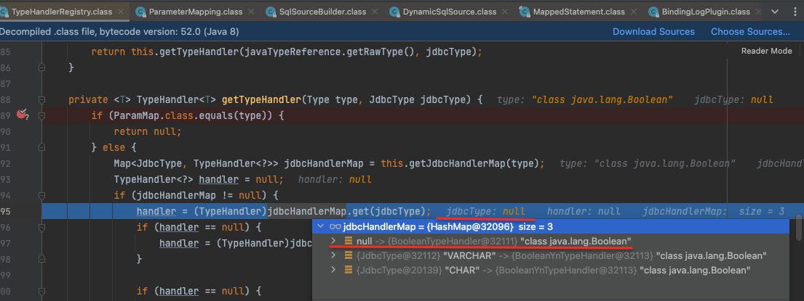
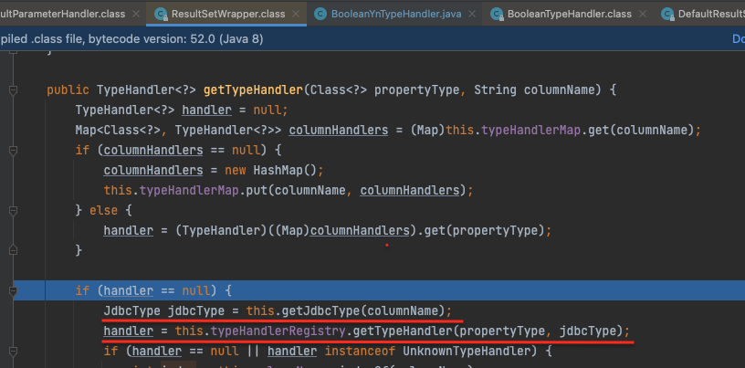
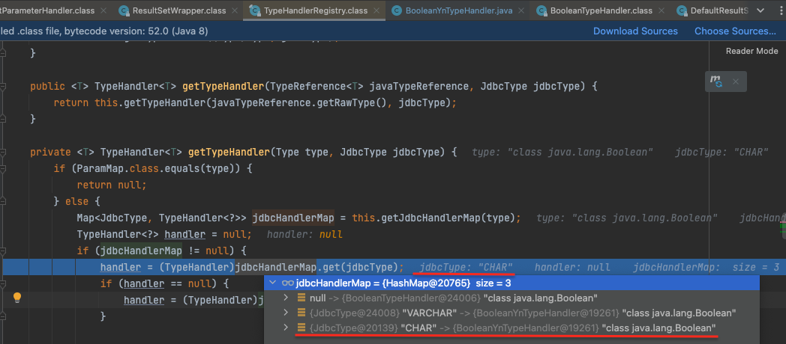

- mybatis typeHandler 
  - 왜쓰나?
    - PreparedStatement에 파라미터를 설정하고 ResultSet에서 값을 가져올때마다 TypeHandler는 적절한 자바 타입의 값을 가져오기 위해 사용 
    - > Whenever MyBatis sets a parameter on a PreparedStatement or retrieves a value from a ResultSet, a TypeHandler is used to retrieve the value in a means appropriate to the Java type. The following table describes the default TypeHandlers.
  - 즉, 두가지 측면에서 사용
    - PreparedStatement에 파라미터를 설정할때 (바인딩할때)
    - ResultSet에서 값을 가져올때 (자바 타입으로 변환할때)
    - 이 두가지 측면에서 사용하는 방법이 조금 다르다. 그렇기에 1번에서 A라는 TypeHandler를 사용했다할지라도, 2번에서는 동일한 TypeHandler를 사용하지 않을 수 있다.
  - 하나씩 살펴보자
  - PreparedStatement에 파라미터를 설정시 TypeHandler 사용과정
    - 메타데이터를 읽어오지않는다
      - java type은 알고 있으나, jdbc의 type은 알고 있지않다
      - PreparedStatement 파라미터 바인딩하는 시점에 java 타입은 알 수 있으나, jdbc 타입을 알 수 없다는 것이다. (각 컬럼의 타입을 알기위해서 데이터베이스에 메타데이터를 요청하진 않는다)
      - 그래서 jdbc 타입은 null로 셋팅된다
    - 파라미터 바인딩시에 `public void setParameter(PreparedStatement ps, int i, T parameter, JdbcType jdbcType)` 호출됨
      - 해당메서드에서 `this.setNonNullParameter(ps, i, parameter, jdbcType);`를 호출하여 커스텀하게 정의한 TypeHandler가 수행
    - 
      - java type은 Boolean이고, jdbc type은 null 이기때문에, BooleanTypeHandler (디폴트 typeHandler)를 가져오게된다..
      - 마이바티스는 타입핸들러를 선택하기 위해 javaType=[TheJavaType], jdbcType=null조합을 사용
        - > MyBatis therefore uses the combination javaType=[TheJavaType], jdbcType=null to choose a TypeHandler.
  - ResultSet에서 값을 가져올때 TypeHandler 사용과정
    - 메타데이터를 읽어온다
      - java type도 알고, jdbc의 type도 알고있다
        - db에서 가져올 데이터의 메타데이터를 조회하여 jdbc type을 알아냄
      - ~~메타데이터를 읽는것은 이미 한번 db에서 데이터에 대한 접근을 하였기때문에 이미 가져온 메타데이터를 캐싱해서 사용하는게 아닐까..싶다(추측)~~
    - java type과 읽어온 메타데이터를 기준으로 typeHandler를 고른다
    - 
    - 
      - 예제에선 java type은 Boolean이고, jdbc type은 CHAR 인데, 이를 기반으로 적절한 typeHandler(커스텀 typeHandler)를 가져온다
        - 앞서 조회해온 메타데이터를 통해 jdbc type을 명확히 알기떄문
  - 결론
    - PreparedStatement에서 파라미터를 바인딩할때 사용하는 typeHandler와, ResultSet에서 값을 java 타입으로 변환할때 typeHandler는 다를수 있다
    - 다를 수 잇는 이유는 PreparedStatement에서 파라미터 바인딩시 jdbc type을 알수 없기때문에 jdbc type이 null인 typeHandler를 가져오게된다
    - 커스텀하게 만든 typeHandler를 PreparedStatement에서 파라미터 바인딩시 사용하도록하고 싶다면, 
      - `@MappedJdbcTypes(includeNullJdbcType = true)`을 선언해주거나 
        - TypeHandler에서 지정한 java type이 하나만 있을때는일때는 굳이 선언안해도됨
      - 직접 binding이 필요한 데이터에 typeHandler를 명시해주면됨
        - ex. `#{propertyName, typeHandler = booleanYnTypeHandler}`
      - 직접 binding이 필요한 데이터에 jdbcType을 지정 
        - ex. `#{propertyName, jdbcType=CHAR}`
          - @MappedJdbcTypes(JdbcType.CHAR) 이렇게 지정되어있는 TypeHandler의 경우임


  - 참고사이트
    - [mybatis 공식문서 한글번역](https://mybatis.org/mybatis-3/ko/configuration.html#typeHandlers)
    - [mybatis 공식문서](https://mybatis.org/mybatis-3/configuration.html#typeHandlers)

---

- 위 내용을 찾게된 원인 정리
```java
    @MappedJdbcTypes({JdbcType.VARCHAR, JdbcType.CHAR})
    public class BooleanYnTypeHandler extends BooleanTypeHandler {
    	@Override
    	public void setNonNullParameter(PreparedStatement ps, int i, Boolean parameter, JdbcType jdbcType)
    			throws SQLException {
    		ps.setString(i, getYnFromBoolean(parameter));
    	}

      private String getYnFromBoolean(Boolean parameter) {
        return parameter ? "Y" : "N"; // 요기
      }
    }
```
- 위의 소스를 보면서, BooleanTypeHandler를 extends하고 있으니, handler를 등록하게되면, 0이나 1로 db에 데이터가 있을때 조회시 알아서 java 의 Boolean type으로 변경될것인데, 이제 자바의 Boolean 타입이 db에 저장될때 "Y"나 "N"으로 무조건 들어가게 되는게 아닌가?("// 요기" 부분으로 인해..) 하는 생각이 들기시작..
  - 즉, DB에 해당 컬럼에 "Y", "N"이 추가되어 기존 0,1만 있던 컬럼에 Y,N 까지 추가되는것은 아닌가 하는 생각이 들었다..
- 실제 운영 테이블에 Boolean을 0과 1로 저장하고있는 테이블을 찾았는데 insert를 수행하도록 요청을 보내봤더니 여전히 0과 1로 저장되어있었음
- 확인해보니 db에 data를 저장할때는 BooleanTypeHandler가 사용되었고, data를 읽어서 자바 타입으로 변경시에는 Boolean**Yn**TypeHandler가 사용
  - 참고로 BooleanTypeHandler 는 디폴트로 제공되어지는 TypeHandler이고, BooleanYnTypeHandler는 커스텀하게 만든것
- 왜 다른 TypeHandler가 쓰인것일까??


---


- Spring4에서 Spring5로 마이그레이션 진행과정에서 MyBatis의 버전을 함께 올리게되었는데, TypeHandler 동작이 기존과 달리되어 수정한 부분들이 있었습니다. 그중 자바에서의 Boolean 타입의 값을 'Y'나 'N'으로 변경하여 저장하도록 하는 커스텀한 TypeHandler가 있었습니다(디폴트로 제공되어지는 BooleanTypeHandler를 확장하여 만들었습니다). 해당 코드를 보았을때, DB에 기존 0,1만 있던 컬럼에 Y,N 까지 추가되는것은 아닌가 하는 생각이 들게되었고, 빠르게 Boolean을 0과 1로 저장하는 테이블을 찾아서 데이터를 insert 해보았을때 문제가 없는 것을 확인할 수 있었습니다. 확인해보니 db에 data를 저장할때는 디플트로 제공되어지는 BooleanTypeHandler가 사용되었고 data를 읽어서 자바 타입으로 변경시에는 직접만든 커스텀한 TypeHandler가 사용되었습니다. 왜 다르게 TypeHandler가 사용되어지는지를 확인하기 위해 공식문서와 코드를 자세히 살펴보았습니다.
공식문서에서는 PreparedStatement에 파라미터를 바인딩하고 ResultSet에서 값을 가져올때마다 TypeHandler는 적절한 자바 타입의 값을 가져오기 위해 사용한다는 내용을 찾아볼 수 있었습니다. 또한 TypeHandler를 선택하는것은 자바의 타입과 db의 타입을 고려하여 선택되는 부분도 알려주고 있었습니다. 코드상에서도 TypeHandler의 후보군을 모아놓고 db의 타입과 자바의 타입을 맵핑해서 TypeHandler를 최종적으로 선택하는 부분을 찾아 볼 수 있었습니다. 결과적으로 PreparedStatement에 파라미터를 바인딩하고 ResultSet에서 값을 가져올때의 가장 큰 차이는 db의 타입을 아느냐 알지못하느냐인데, PreparedStatement에는 기본적으로 db 타입을 모르기때문에 null로 셋팅이되어 다르게 typeHandler를 가져오게되었던 것이었습니다(db의 type이 null이면 디폴트 typeHandler를 선택). 쿼리문에 명시적으로 db의 타입을 지정해주어야만 원하는 TypeHandler를 가져올 수 있었습니다.

   ~~즉, TypeHandler는 두가지 측면에서 사용되어지는데 PreparedStatement에 파라미터를 설정할때(바인딩할때), 그리고 ResultSet에서 값을 가져올때 (자바 타입으로 변환할때) 사용된다는것을 볼 수 있었습니다.~~

첫번째는 PreparedStatement에서 사용되는 쿼리문의 파라미터 바인딩시 java 타입을 db의 데이터에 맞도록 변경해주어야하는데, 이때 TypeHandler가 필요한 부분입니다. 즉, 쿼리문 실행을 위해 java 타입(ex. String)을 적절한 jdbc 타입(ex. VARCHAR)으로 변경하는데 TypeHandler를 사용하게됩니다. 그런데, 여기서 중요한점은 파라미터 바인딩하는 시점에 java 타입은 알 수 있으나, jdbc 타입을 알 수 없다는 것이었습니다(각 컬럼의 타입을 알기위해서 데이터베이스에 메타데이터를 요청하진 않는다). 그래서 변경하고자하는 자바의 타입과 jdbc 타입이 null인 대상이 선택되게 됩니다