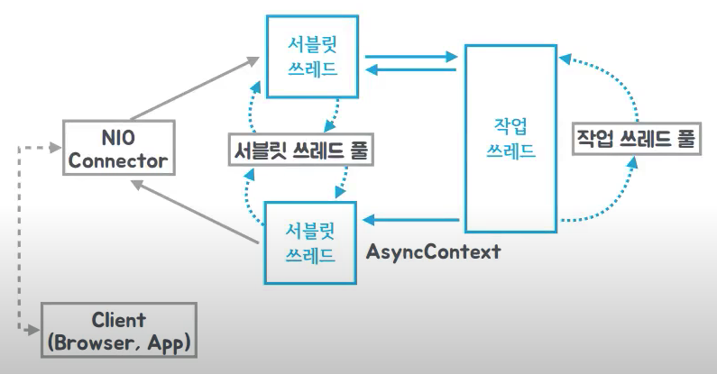
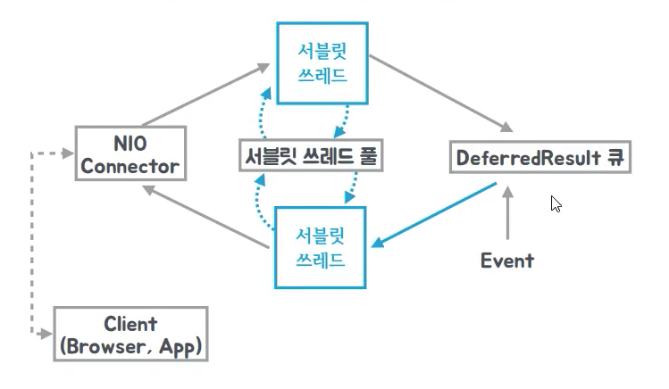

toby_reactive_stream 유투브 강의정리

- 토비의 봄 TV 4회
  - 외부에서 쓰는거면 ? super Type (하위제한)
  - 내부에서 쓰는거면 ? extend Type (상위제한)

  - capture
    - 타입추론시 사용하는 프로세스.. 컴파일러가 타입추론을 할수 없다고 생각되면 capture 어쩌구 에러뜸 

  - 람다 사용한다해서 클래스안만드는게아님! 일종의 익명클래스가 내부적으로 생성되는것!!
    - Get the enclosing class of a Java lambda expression - Stack Overflow - https://stackoverflow.com/questions/34589435/get-the-enclosing-class-of-a-java-lambda-expression
    - What is a Java 8 Lambda Expression Compiled to? - Stack Overflow - https://stackoverflow.com/questions/21858482/what-is-a-java-8-lambda-expression-compiled-to

        ```java
        public class LambdaTest {
            @Test
            void 람다클래스_확인(){
                tempMethod(()-> System.out.println("lambda1"));
                tempMethod(()-> System.out.println("lambda2"));
                tempMethod(new Runnable() {
                    @Override
                    public void run() {
                        System.out.println("anonymous");
                    }
                });
                tempMethod(new RunnableImpl());
                tempMethod(new External());
            }

            private void tempMethod(Runnable runnable){
                runnable.run();
                Class<? extends Runnable> aClass = runnable.getClass();
                System.out.println("class name : "+aClass.getName());
                System.out.println("class hashcode : "+aClass.hashCode());
                System.out.println("canonical class name : "+aClass.getCanonicalName());
                System.out.println("enclosing class name : "+aClass.getEnclosingClass());
                System.out.println();

            }

            static class RunnableImpl implements Runnable{

                @Override
                public void run() {
                    System.out.println("static class");
                }
            }
        }

        class External implements Runnable{

            @Override
            public void run() {
                System.out.println("external class");
            }
        }


            /**
            실행결과

            lambda1
            class name : com.study.reactiveprgramming.modernjava.LambdaTest$$Lambda$275/241984962
            class hashcode : 241984962
            canonical class name : com.study.reactiveprgramming.modernjava.LambdaTest$$Lambda$275/241984962
            enclosing class name : null

            lambda2
            class name : com.study.reactiveprgramming.modernjava.LambdaTest$$Lambda$276/2041008972
            class hashcode : 2041008972
            canonical class name : com.study.reactiveprgramming.modernjava.LambdaTest$$Lambda$276/2041008972
            enclosing class name : null

            anonymous
            class name : com.study.reactiveprgramming.modernjava.LambdaTest$1
            class hashcode : 719509796
            canonical class name : null
            enclosing class name : class com.study.reactiveprgramming.modernjava.LambdaTest

            static class
            class name : com.study.reactiveprgramming.modernjava.LambdaTest$RunnableImpl
            class hashcode : 1592828874
            canonical class name : com.study.reactiveprgramming.modernjava.LambdaTest.RunnableImpl
            enclosing class name : class com.study.reactiveprgramming.modernjava.LambdaTest

            external class
            class name : com.study.reactiveprgramming.modernjava.External
            class hashcode : 205862600
            canonical class name : com.study.reactiveprgramming.modernjava.External
            enclosing class name : null
            
            참고
            canonical class : 본래의, 원형의, 근본의 클래스.. 익명클래스는 null
            enclosing class : 애워싸고 있는 클래스.. 만약 null이면 본인을 애워싸는게없는, 독립된 클래스이기때문

            */
        ```

  - 람다에서 인터섹션 타입이라하여 추가적으로 인터페이스를 명시하여 해당 ***인터페이스의 기능***을 추가해줄수있다..
    - ex. 
      - (Function & hello & hi) s -> s 
      - 위와같이 사용할수있는데, 여기서 중요한것은 위의 3가지가 합쳐졌을때 어쨋든 추상메서드가 한개여야한다는것이다.. 이 말인즉, hello나 hi는 마커인터페이스(그냥 마커용.. 아무기능안하는)나 디폴트메서드로 정의가 되어있어야함
      - 이렇게 되어있을때 hello나 hi에서 정의된 메서드를 사용할수있다! 이런식으로 람다로 넘겨줄때 "&"와 "인터페이스" 를 추가하여 원하는 기능들을 새로이 추가할수있다!!
      - 근데 받는부분에서는 추가한 인터페이스에 맞추어 또 정의를 해주어야하니.. 약간불편..
        - 이에 대한 해결책은 콜백!
    ```java
        public class IntersectionType {
            interface DelegateTo<T>{ //이 인터페이스를 통해서 범용적으로 사용할수있음!!!@#!@# 만약 이런 대리자 인터페이스를 사용하지않으면 run에서 타입이 계속 바껴야함..
                T delegate();
            }

            interface Hello extends DelegateTo<String>{
                default void hello(){
                    System.out.println("Hello "+delegate());
                }
            }

            interface UpperCase extends DelegateTo<String>{
                default void uppercase(){
                    System.out.println(delegate().toUpperCase());
                }
            }

            public static void main(String[] args) {
                run((DelegateTo<String> & Hello & UpperCase)()->"hi",d -> { //d는 앞서 선언되어있는 DelegateTo<String>, Hello, UpperCase 타입 모두를 추론할수있다.. 
                    d.hello();
                    d.uppercase();
                });
            }

            private static <T extends DelegateTo<S>,S> void run(T t, Consumer<T> consumer) {
                consumer.accept(t);
            }
        }
    ```


- 토비의 봄 TV 5회 스프링 리액티브 프로그래밍 (1) - Reactive Streams
  - 리엑티브 : 외부에 뭔가가 발생하면 거기에 대응하는 방식.. 즉, 이벤트발생하면 실행
  - Reactive Streams : reactive 프로그래밍을 하기위해서 정한 표준.. 
    - 이에 대한 구현에 조건이 있음.(정해진 스펙에 맞추어야함)
      - ex. subscriber가 onSubscribe 호출되어서 subscription으로 request를 처음보내게 되었을때, 이 request 호출을 별도의 스레드로 만들면안된다!(Subscription의 request안에서는 상관없음!) 등등의 스펙이있음
    
    | Iterable | Observable (duality 상대성) |
    |--|--|
    | pull | Push |
    | 멀티스레드 구성에 별로.. | 멀티스레드 구성하기좋음 |

    - Observable 단점
      1. Event에 끝이없다!! 완료의 개념이없음!
      2. Error 처리가 어렵다 (전파가 되어도.. 어디서 잡을거냐..)
    - Observable의 개선으로 pub-sub 모델 등장
      - publisher <-- Observable
        - publisher는 subscriber로부터 요구에따라 일련의 연속적인 요소들을 제공해주는놈이다
      - subscriber <-- Observer
      - subscription : publisher와 subscriber에서 중간다리역할을 해줌.. Subscription을 통해서 데이터를 요청하면, 해당 데이터만큼 push를 해줌.
        - Observer와 매우 유사하지만, 한 없이 push하는것이아닌 Subscription을 통해서 subscriber가 데이터를 요청하기때문에, pub과 sub의 속도차이가 난다면 이를 통해서 조절가능(back pressure라고함)
        - subscription은 request라는 함수를 통해서 위의 작업이 이루어지는데, 리턴으 void다. 즉, iterable처럼 데이터를 pull하는 방식이아니라는것! push를 얼만큼 하냐에 대한 이야기임

      - `onSubscribe onNext* (onError | onComplete)`
        - 시작은 onSubscrbie로 반드시 호출해야하며, onNext는 여러번 호출가능하고, OnError나 OnComplete는 옵션인데 둘중에 하나만 선택가능하다 라는 뜻

- 토비의 봄 TV 6회 스프링 리액티브 프로그래밍 (2) - Operators
  - 변화를 주거나 변신을 시키는게 Operator의 역할 (원본 source를 최종 sub에게 전달하는 과정에서 데이터의 변형이나 가공이 가능하도록 해주는놈)
    - 데이터를 변형해주는 대리자 역할임
  - flux 맛보기
    
  ```java
    public class ReactorEx {
        public static void main(String[] args) throws InterruptedException {
            Flux.<Integer>create(e->{
                e.next(1);
                e.next(2);
                e.next(3);
                e.next(4);
                e.complete();
            })
            .log()
            .map(s->s*10)
            .log()
            .reduce(1,(a,b)->a+b)
            .log()
            .subscribe(integer -> System.out.println(integer),Throwable::printStackTrace);

        }
    }
    
    /**
    
    11:38:31.030 [main] INFO reactor.Flux.Create.1 - onSubscribe(FluxCreate.BufferAsyncSink)     // 이 pub의 source를 발행하기위해서 해당 Pub의 sub.onSubscrbe 호출 (여기서 sub은 map)
    11:38:31.032 [main] INFO reactor.Flux.Map.2 - onSubscribe(FluxMap.MapSubscriber)             // 이 pub의 source를 발행하기위해서 해당 Pub의 sub.onSubscrbe 호출 (여기서 sub은 reduce)
    11:38:31.032 [main] INFO reactor.Mono.ReduceSeed.3 - | onSubscribe([Fuseable] MonoReduceSeed.ReduceSeedSubscriber) // 
    11:38:31.032 [main] INFO reactor.Mono.ReduceSeed.3 - | request(unbounded)                   // subscriber가 pub(여기서는 map)의 subscription의 request를 호출하여 데이터 요청시작
    11:38:31.032 [main] INFO reactor.Flux.Map.2 - request(unbounded)                            // subscriber가 pub(여기서는 flux.create~)의 subscription의 request를 호출하여 데이터 요청시작
    11:38:31.032 [main] INFO reactor.Flux.Create.1 - request(unbounded)                         // subscriber가 pub(여기서는 emitter?)의 subscription의 request를 호출하여 데이터 요청시작
    11:38:31.034 [main] INFO reactor.Flux.Create.1 - onNext(1)
    11:38:31.034 [main] INFO reactor.Flux.Map.2 - onNext(10)
    11:38:31.034 [main] INFO reactor.Flux.Create.1 - onNext(2)                                  // 근본 source의 데이터 하나 다 소비했으니 다음꺼
    11:38:31.034 [main] INFO reactor.Flux.Map.2 - onNext(20)
    11:38:31.034 [main] INFO reactor.Flux.Create.1 - onNext(3)
    11:38:31.034 [main] INFO reactor.Flux.Map.2 - onNext(30)
    11:38:31.034 [main] INFO reactor.Flux.Create.1 - onNext(4)
    11:38:31.034 [main] INFO reactor.Flux.Map.2 - onNext(40)
    11:38:31.035 [main] INFO reactor.Flux.Create.1 - onComplete()                               // 근본 source의 데이터 모두 다 소비했으니 complete
    11:38:31.035 [main] INFO reactor.Flux.Map.2 - onComplete()
    11:38:31.035 [main] INFO reactor.Mono.ReduceSeed.3 - | onNext(101)                          // reduce는 특성상 데이터를 저장하여 보내주므로 앞의 sub이 complete 되어야 onNext로 발행.. 그리고 바로 끝
    101
    11:38:31.035 [main] INFO reactor.Mono.ReduceSeed.3 - | onComplete()
    
    */
    
  ```
  - 기타 팁
    - 제네릭으로 바꾸고싶을때는 구체적인 타입을 넣어서(물론 타입을 하나로만 하는것은 의미없겟지) 테스트해본뒤, 제네릭으로 변경하라!
    
- 토비의 봄 TV 7회 스프링 리액티브 프로그래밍 (3) - Schedulers
  - 보통 pub-sub에서 이벤트 발생하여 처리하였을때, 하나의 스레드만을 사용하여 직렬적으로 처리하진않는다!
  - 이를 위해서 reactor에서 별도의 스레드에서 처리할수있도록 scheduler를 제공해줌
    - subscribeOn
      - Typically used for slow publisher e.g., blocking IO, fast consumer(s) scenarios.\
      - 구독할때 별도 스레드진행(publisher에 subscriber가 구독을 등록하는시점 즉, subscribe호출을 별도 스레드에서..)
    - publishOn
      - Typically used for fast publisher, slow consumer(s) scenarios.
      - 그리고 publishOn에서 consumer를 더 빠르게하겠다고 여러 스레드를 써서 event의 순서를 뒤바꾸면안된다! (규칙임)
      - pub이 발행할때 별도스레드진행 (publisher가 subscriber에 데이터 발행해주는 시점 즉, subscriber의 onNext 호출을 별도 스레드에서)

  - 기타 팁
    - JVM은 유저 스레드가 모두 죽어있으면, 데몬스레드가 살아있더라도 애플리케이션 종료를 강행한다. 그러나, 유저스레드가 하나라도있으면 죽지않는다(당연 데몬스레드도 죽지않것지)
    - Flux의 interval은 데몬스레드로 동작
    - 스프링에서 ThreadFactory 잘 활용하기 좋도록 만들어놓은것이 CustomizableThreadFactory.. 내가 원하는부분만 변경하면됨
    - ExecutorService의 shutdown은 우아한종료가능
      - shutdownNow는 강제로 interrupt 발생시킴..

- 토비의 봄 TV 8회 스프링 리액티브 프로그래밍 (4) - 자바와 스프링의 비동기 기술
  - 자바의 비동기작업
    - Future
      - FutureTask
      - ListenableFuture
        - spring에서 제공
        - 결과가 완료된다면 ListenableFuture에 등록된 callback으로 넘겨주어 success 또는 fail에 대한 작업실행 (Future의 get과 같이 호출해서 결과를 기다릴필요가없음)
        - FutureTask를 상속받아서 작업완료 후 호출해주는 후크 메서드인 done메서드를 오버라이딩해서 등록한 callback을 상황에 맞게 호출해주도록 구현되어있음
    - Callback
  - 비동기 서블릿 (서블릿3.1)
    - 
    - client가 NIO Connector에게 요청
    - NIO Connector는 서블릿 스레드에게 요청을 전달
    - 서블릿 스레드 풀에서 사용가능한 서블릿 스레드(ex. 톰캣쓰면 보통 로그에 http-nio-8080-exec-1 이런식으로..)를 가져와서 서블릿 스레드가 작업 스레드에게 전달(여기서 작업스레드는 비지니스로직이라고 생각하면됨). 전달하자마자 서블릿스레드는 할거다했기때문에 다시 서블릿 스레드풀에 반환
    - 작업스레드가 자신의 일을 완료해서 결과를 서블릿 스레드에게 전달
      - 여기서 서블릿 스레드는 다시 스레드풀에서 놀고있는 서블릿 스레드를 가져온것
    - 서블릿스레드는 적절한 뷰를 만들어서 NIO Connector에게 전달. 이때 서블릿 스레드는 자신의 일을 다 마쳤으면 다시 서블릿 스레드풀로 반환됨 
    - NIO Connector는 client에게 응답
    ```java
      @GetMapping("/callable")
      public Callable<String> callable(){
          log.info("callable");
          return ()->{  // 리턴은 Callable로 하게되면, 스프링에서 Callable의 body를 작업스레드풀에서 진행시키고, 서블릿또한 비동기를 사용하게된다
              log.info("async");
              Thread.sleep(2000);
              return "Hello";
          };
      }

      // 결과 로그
      2021-10-01 14:22:43.464  INFO 82929 --- [nio-8080-exec-1] c.s.r.ReactivePrgrammingApplication      : callable  //nio-8080-exec-1 이 서블릿 스레드
      2021-10-01 14:22:43.469  INFO 82929 --- [         task-1] c.s.r.ReactivePrgrammingApplication      : async     //task-1이 작업스레드
      2021-10-01 14:23:26.664  INFO 82929 --- [nio-8080-exec-4] c.s.r.ReactivePrgrammingApplication      : callable  //다시 요청했더니 서블릿스레드는 새로운 스레드로 받아옴(스레드풀에서 받아오겠지)
      2021-10-01 14:23:26.664  INFO 82929 --- [         task-2] c.s.r.ReactivePrgrammingApplication      : async

      // => 이런식으로 서블릿 스레드가 서블릿 스레드풀에서 반납하고 사용하는것을 반복하게되면, 결국 서블릿 스레드 하나만 가지고도 수많은 요청을 받을수있다!
      //    그러나 delay되는 작업이 많다면 작업스레드가 뒤에서 별도 스레드를 만들면서 수행을 하게된다(이 또한 적절한 스레드 풀이 필요하겠지)
      //    즉, 만약 위의 코드에서 작업스레드풀의 크기가 100개이고, 서블릿스레드풀 크기는 1개일때, 클라이언트가 동시에 100번의 요청을 날리게되면 2초뒤에 모든 응답을 받으나 작업스레드는 100개 모두 사용하게된다(당연 서블릿스레드는 한개만 가지고 처리되었음.. 여기서는 이게핵심! 서블릿스레드 풀에 하나의 스레드를 가지고도 요청을 빠르게 처리할수있다라는것!)
    ```
    
    

    - 스프링 비동기 기술
      - DeferredResult <span style="color:yellow">아직 정확하게 언제쓸수있을지 각이 안옴..</span>
        - client요청시 DeferredResult를 반환하면 DeferredResult에 결과를 셋팅하지않는이상 client에게 응답을 주지않는다
        - 이때, 스레드가 block되는 개념이 아니라, DeferredResult에 결과 셋팅하는 이벤트 발생하면 client에게 응답을 주는 프로세스가 진행되는것이다.. 즉 워커스레드를 점유하고있거나 하지않음
        - 이를 활용해서 특정 이벤트가 발생할때까지 기다렸다가 발생했을때 응답을 받을수있도록 하는 간단한 채팅도 구현가능하다
          - 메세지를 받기위한 요청을 보내고, 다른 누군가 메세지 쓸것을 기다렸다가 누군가가 쓰게되엇을때(이벤트발생) 응답을 받는것
        
        ```java
          Queue<DeferredResult<String>> results=new ConcurrentLinkedQueue<>();

          @GetMapping("/dr")
          public DeferredResult<String> dr(){
              log.info("dr");
              DeferredResult<String> dr=new DeferredResult<>();
              results.add(dr);
              return dr; //block되는구간은 하나도없지만, 아직 Result를 셋팅하지않았기때문에 사용자는 응답을 받지못한상황 
          }

          @GetMapping("/dr/size")
          public String drCount(){
              return String.valueOf(results.size());
          }

          @GetMapping("/dr/event")
          public String drEvent(String msg){ 
              for(DeferredResult<String> dr:results){
                  dr.setResult("Hello "+ msg); //Result를 셋팅하게되었을때 이벤트 발생.. 즉 "/dr"로 요청한 사용자에게 이때 응답함
                  results.remove(dr);
              }

              return "Ok";
          }
        ```
        - 
      - ResponseBodyEmitter
        - Http의 스트림방식 표준에 따라서 만든거라함
        ```java
          @GetMapping("/emitter")
          public ResponseBodyEmitter emitter(){
              ResponseBodyEmitter emitter = new ResponseBodyEmitter();

              Executors.newSingleThreadExecutor().submit(()->{
                  try{
                      for(int i=0;i<=50;i++){
                          emitter.send("<p>Stream "+ i +"</p>");
                          Thread.sleep(100);
                      }
                  }catch(Exception e){}
              });

              return emitter;
          }
        ```
  - 기타 팁
    - InterruptedException은 작업을 수행하지말고 종료하라는 시그날임.. 
    
    - thread block 되면 cpu 많이먹음
      - block 상태일때 cpu가 해당 스레드를 대기상태로전환해서 다른 스레드를 진행시킨다.. 이를 컨텍스트 스위칭이라고함 block 되는순간, 그리고 다시 run 시작하는순간 이렇게 두번 컨텍스트스위칭이 일어남.. 


- 토비의 봄 TV 9회 스프링 리액티브 프로그래밍 (5) - 비동기 RestTemplate과 비동기 MVC/Servlet

  - AsyncRestTemplate (이는 deprecated됨.. webclient를 사용할것은 권함)
    - 비동기로 작업을 진행은하나, 내부적으로 스레드를 요청하나씩 계속 만든다...(기본값..)
      - Netty를 AsyncRestTemplate에 사용하면, 스레드 한개(엄밀하게는 지정한 스레드풀의 크기로)로 비동기 가능 (NIO)
    - ListenableFuture가 리턴타입이기때문에 asynRestTemplate을 사용하여 api를 요청한 결과값을 Controller에서 응답으로 전달해주면, 스프링에서 알아서 결과를 처리하여 응답해준다.. 
      - 그러나, 결과에 대한 가공이 필요하다면, ListenableFuture와 더불어 DeferredResult를 사용해야한다!
        - 컨트롤러에는 DeferredResult를 응답값으로 넘겨주어서, ListenableFuture에 callback을 통해 데이터를 가공한뒤에 DeferredResult에 가공한 데이터를 넘겨주는 방식으로 사용할수있다!
        - 근데 콜백을 사용해서 계속 그 결과에 대해 api요청을 순차적으로 수행해야한다면 콜백헬(hell)을 경험하게된다...
          - => 이에 대한 해결책이 CompletableFuture
    - *이런 비동기작업을 쓰는 이유는 IO와 같은 스레드를 block시켜 대기하는 로직들은 CPU를 사용하지않고 그냥 멍때리고있는것인데, 그로 인해 놀고있는 자원들이 생기게됨.. 그것을 NIO 기술을 통해서 스레드를 block하는것이 아닌, 이벤트방식으로 필요할때만 전달받을수 있도록 할수있는데, 그것을 비동기 로직을 통하여 스레드를 block하여 놀고있도록 하지않을수있다.. 만약 응답 이벤트를 기다리고있다면 스레드는 반납하고 이벤트 발생하면 그때 다시 스레드가 실행된다!
  - 기타 팁
    - CyclicBarrier 를 사용하면 스레드들을 동기화할수있다
      - CyclicBarrier를 생성할때 특정 숫자를 지정하고, await메서드를 호출하게되면, 지정한숫자만큼 스레드가 오기까지 모든 스레드는 대기상태가된다. 이를 가지고 좀 더 일괄적인 작업시작 즉, 모두 동시에 스레드들을 시작할수있도록 해줄수있다(테스트의 오차들을 좀더 잡아줄수있음)
    - JDBC는 기본적으로 IO.. 이를 비동기로 사용하기위해서는 적절한 스레드풀을 지정해서 여러 스레드를 사용하는수밖에 없다..
      - 그러나 몽고DB나 기타 NoSQL은 스레드를 계속 생성할 필요없이 비동기로 모두 제공해준다!(Redis, Kafka 등등)
    - 임시 테스트를 위해 spring boot 활용하여 서버 하나 더 띄우는 방법
    ```java
      @SpringBootApplication
      public class RemoteService {
          @RestController
          static class MyController{
              @GetMapping("/remote/service")
              String remote(String data) throws InterruptedException {
                  Thread.sleep(2000);
                  return data +" | remote";
              }
          }

          public static void main(String[] args) {
              System.setProperty("server.port","8899"); //여기에 셋팅해주어서 기존 올려놓은 어플리케이션과 포트 충돌일어나지않도록 해줄수있음
              System.setProperty("server.tomcat.threads.max","100");
              SpringApplication.run(RemoteService.class, args);
          }
      }
    ```

- 토비의 봄 TV 10회 스프링 리액티브 프로그래밍 (6) - AsyncRestTemplate의 콜백 헬과 중복 작업 문제
  - 기타 팁
    - 제네릭을 사용할때는 클래스 레벨에 선언한 제네릭인지, 메서드 레벨에서 추가로 선언이 필요한 제네릭인지 잘 구분을 해야한다
    - 아무리봐도 타입만 바꿔서 재사용하면 되는거면 제네릭!

- 토비의 봄 TV 11회 스프링 리액티브 프로그래밍 (7) - CompletableFuture
  - 비동기기술 : 자원의 효율적 사용! MSA에서는 API요청의 결과값들을 조합하여 응답을 처리하는경우가 많은데, 이럴때 매우 강력함!
  - CompletableFuture : 이름에서도 알수있듯이 비동기작업을 완료하는 작업을 수행가능
    - 비동기작업의 결과를 담고있는것이지, 비동기작업 자체는 아님..
    - 예외처리?
      1. 예외일어나면 끝까지 계속넘김
      2. 의미있는값으로 변환해서 넘김
    - CompletionStage : 하나의 비동기 작업 수행하고, 완료햇을때 여기에 의존적인 또다른 작업을 할수있또록 해주는 인터페이스(그런 메소드들을 제공해줌 ex. thenXXX)
      - 결과에 의존할수도있고, 각각 비동기작업하고 합치는것 등 모두 가능
      - <span style="color:yellow">요기 인터페이스가 거의 핵심이니, 인터페이스에 정의된 내용들 잘 살펴볼것 </span>
    ```java
      CompletableFuture.supplyAsync(()->{
                    log.info("runAsync");
                    if(1==1) throw new RuntimeException();
                    return 1;
                })
                .exceptionally(e->5) //바로 위에서 에러발생하면 5로 바꿔줌
                .thenCompose(s1-> { //flatmap과 유사..
                    log.info("thenApply1 {}",s1);
                    return CompletableFuture.completedFuture(s1+1);
                })
                .thenApply(s2-> { //map과 유사
                    log.info("thenApply2 {}",s2);
                    return s2*3;
                })
                .exceptionally(e -> -10 ) //에러나면 -10으로 변경시켜줌.. 만약 thenApply1에서 에러났으면 thneApply2는 넘어가고 여기서 예외를 -10으로 변경해준
                .thenAccept(s3-> {
                    log.info("thenAccept {}",s3);
                });
    ```
  - 스프링에서는 ListenableFuture를 CompletableFuture로 변환해서 사용하는게좋음
    ```java
      @GetMapping("/async3/rest")
      public DeferredResult<String> rest(int idx){
        DeferredResult dr=new DeferredResult(new Long("100000"));

        toCF(asyncRestTemplate.getForEntity("http://localhost:8899/remote/service?data={data}", String.class, idx))
                .thenCompose(s -> toCF(asyncRestTemplate.getForEntity("http://localhost:8899/remote/service2?data={data}", String.class,s.getBody())))
                .thenApplyAsync(s -> myService4_sync.work(s.getBody()),es) 
                //기존에 시간이 오래걸릴거같아서 서비스단에서 @Async를 사용하여 비동기로 만들어놓았던것들을 동기로 처리할수있음!(비동기 수행은 CompletableFuture를 사용하는것!) 그리고 필요에따라 적절한 스레드 풀도 유동적으로 지정할수있으니 좋음! 비동기 처리하는 곳을 컨트롤러에서 관리할수있겠네~
                //AsyncRestTemplate에서 NioEventLoopGroup을 1로 설정하였던것이 요청뿐아니라 결국 응답처리도 여기서 지정한 스레드 만큼 쓰는것이니깐, 요청뿐아니라 응답받은값을 처리하는데 지연되는 부분이있다면 별도 스레드로 처리할수있도록 해주아야함(여기서는 thenAsync로 서비스로직 처리)
                .thenAccept(s -> dr.setResult(s))
                .exceptionally(e -> { //completablefuture에서 exceptionally로 에러를 잡아주지않으면 CompletableFuture에서 값을 가져오려고 하지않는 이상 아무런 동작을 하지않는다.. 그렇기때문에, DeferredResult에 타임아웃만 떨어져버린다.. 이 타임아웃 에러가 떨어졌을때, 예외핸들러로 전달이 되어서 처리가됨..
                    dr.setErrorResult(e.getMessage());
                    return null;
                });

          return dr;
      }


      private <T> CompletableFuture<T> toCF(ListenableFuture<T> listenableFuture) {
        CompletableFuture<T> completableFuture=new CompletableFuture();
        listenableFuture.addCallback(s -> completableFuture.complete(s), e-> completableFuture.completeExceptionally(e));
        return completableFuture;
      }
    ```
  - 기타 팁
    - 리엑티브인데, 함수형스타일이 아니면 API호출의 결과들을 조합해야할때 콜백헬이 나타난다.. => 이에 대한 대안으로 함수형스타일로 만들어진게 CompletableFuture

- 토비의 봄 TV 12회 스프링 리액티브 프로그래밍 (8) - WebFlux
  - Mono, Flux 를 사용해야한다!
    - Flux : event driven 으로 이벤트 발생시 "여러개"의 데이터들을 받아서 처리하기위해 사용 (1:10:00 좀더 참고)
    - Mono : Mono는 "하나" 라는 뜻. 기존의 전통적인 DB나 API에서 결과 하나 가져오는것에 리엑티브 스타일에서 굳이 여러개로 만들지않게 대응하기위해서 Mono를 사용
  - Mono 또한 하나의 컨테이너이다.. 즉, 데이터를 가지고있고, 이러한 데이터를 잘 활용할수있도록 도와주는 컨테이너!
    - 대표적인 컨테이너의 예시는 List, Optional 등등 있음.. List 또한 데이터의 크기를 보거나, 데이터를 넣는거 등등 할수있도록 해주는 컨테이너
  - 기본적으로 웹플럭스를 사용하도록 셋팅하면 netty로 실행됨(서블릿 사용안함)
    - 서블릿을 사용하는것은 톰켓이랑 제티..
  - WebFlux 사용시 주의할점
    - 구독을 어딘가에서 진행해야만 발행되어 로직이 수행된다! 그냥 발행만 있다면 아무것도 하지않는다!(webclient 사용시 주의..)
      - 스프링에서는 controller에서 publisher를 리턴해주면 알아서 subscribe함 
    - low level의 코드가 드러나지않는게 엄청난 장점이지만, 그만큼 내부적으로 어떻게 돌아가는지 이해가 안되면 문제의 원인 찾기가 어려우므로 로그를 찍으면서 흐름을 반드시 잘 파악할것!
  ```java
    @GetMapping("/webflux/rest")
    public Mono<String> rest(int idx){ //spring은 Mono로 전달해주면, 이를 알아서 subscribe함..

        return webClient.get().uri("http://localhost:8899/remote/service?data={data}",idx)
                //여기를 처음 호출하는 놈은 톰켓(만약 netty서버라면 netty 스레드.. 스프링 내부적으로 구독을 진행하니깐)
                //webclient는 netty를 기반으로 동작하기때문에, 이제 요청을 위한 채널이 등록되고 eventLoop에 등록되므로 netty의 스레드 사용
                .exchangeToMono(clientResponse -> {
                    if(clientResponse.statusCode()==HttpStatus.OK ){
                        return clientResponse.bodyToMono(String.class);
                    }else{
                        return Mono.error(new RuntimeException("에러 | "+idx)); //이 에러는 에러1, 에러2, 에러3 을 거쳐서 Exception Handler 로 넘어가게됨.. Exception Handler에서는 doOnError의 스레드가 아니라 톰켓의 스레드이다..( "normal_async.png" 참고 )
                    }

                })
                .doOnNext(s -> log.info("1번요청 : "+s)) //여기서는 응답한 값을 볼수잇는데, 이때의 스레드는 요청할때와 같은 스레드일거임(netty의 채널은 eventloop에 등록되는데, 이 eventLoop는 항상 동일한 스레드로 처리됨.. 그래서 데이터 전송시 사용한 스레드와, 데이터 받았을때의 스레드는 동일.. 그리고 이로 인하여 모든 이벤트의 순서를 보장한다.. )
                .doOnError( e -> log.info("에러1 "+e.getMessage()))
                .flatMap(res -> webClient.get().uri("http://localhost:8899/remote/service2?data={data}",res).exchangeToMono(clientResponse -> clientResponse.bodyToMono(String.class)))
                .doOnNext(s -> log.info("2번요청 : "+s)) // 여기는 remote/service 에 전송했던 스레드와는 다를수있지만, service2를 요청한 스레드와는 같을거임
                .doOnError( e -> log.info("에러2 "+e.getMessage()))
                .flatMap(res -> Mono.fromCompletionStage(myService5_completableFuture.work(res))) //여기서 block이 있다면 당연 스레드 하나를 점유하게되는거기때문에 요청이 eventLoop(디폴트는 Runtime.getRuntime().availableProcessors()*2) 갯수를 초과하게된다면 전체적인 서비스는 현저히 느려진다.. 그래서 비동기 사용! 스프링의 디폴트 스레드풀 사용
                .doOnNext(s -> log.info("3번 비동기 메서드 : "+s))
                .doOnError( e -> log.info("에러3 "+e.getMessage()));

        /*
         - 여기서 map을 사용하지않고 flatMap을 사용할수밖에 없는이유!
           - map을 사용하면 이렇게 된다
            Mono<ClientResponse> exchange = webClient.get().uri("aa", "data").exchange();
            Mono<Mono<String>> map = exchange.map(clientResponse -> clientResponse.bodyToMono(String.class));
            bodyToMono(String.class)를 호출하게되면 Mono<String> 이 리턴타입이다.. 그렇기때문에 여기서와 같이 map안에서 사용하게되면, Mono<Mono<String>>이 되어버린다.. 그렇기때문에 flatMap을 사용해야했다!!! (flatMap은 리턴해준거를 평면화하기때문에 다시 Mono<String>을 리턴할때 이와 동일하게 Mono<String>으로 만들어주기때문에!!)
            *함수가 컨테이너를 감싸서(ex. Mono<XX>, Flux<XX>, List<XX>..등) 리턴한다면 flatMap을 통해서 평면화시켜라!!

         - 비동기 메서드가 CompletableFuture를 반환할때, Mono로 계속 연결하기위해서는 Mono.fromCompletionStage() 를 사용하라! CompletableFuture는 CompletionStage를 구현하고있기때문에 가능!

        */

    }

  ```

- 토비의 봄 TV 13회 스프링 리액티브 프로그래밍 (9) - Mono의 동작방식과 block
  - `Mono.just` 사용시 주의할점
    - Mono.just 인자로 있는 generateHello 메서드는 subscribe하고나서 실행되는 부분이아니다! Mono가 만들어질때 이미 실행이 된다!! 결과값이 Mono에 들어가있는것이고 그것을 subscribe할때 활용하는것이다!
      - Mono.fromSupplier 에서 넘겨주는 콜백은 구독시에 Mono에 데이터를 넣어서 가져오는것!
  - block
    -  Mono에 담긴 결과값을 가져오고 싶을때는 block() 메소드를 사용하면된다
    - block을 호출하면 내부적으로 구독을 하여서 결과를 꺼내올수있다..
    - Mono의 결과값을 이렇게 꺼내온다면, 구독을 해서 결과를 가져올때까지 block 되기때문에 block이라는 이름을 사용한것!
    - 그러나, 가능한한 block은 사용하지말자!
  - 기타 팁
    - log 또한 publisher 임
      ```java
        Mono<String> m=Mono.just(generateHello()).log(); // log 또한 Operator 즉, 또하나의 pub..  Publisher -> Publisher(Operator) -> Publisher(Operator) ... -> Subscriber
      ```
    - Publisher는 하나지만, Subscriber는 여러개가될수있다! 즉, 스트림과 달리 한번 소비했으면 끝이아니라, 구독하는대로 계속 소비할수있다!
    - publishing 하는 소스 타입은 두가지
      - hot
        - 실시간으로 일어나는 이벤트들이 hot (구독한 때부터 데이터를 전달받게됨)
        - 구독한 시기에 따라 pub의 데이터는 다를수있음!
      - cold
        - 언제 구독을 하던지간에 pub의 데이터를 동일하게 가져옴

- 토비의 봄 TV 14회 스프링 리액티브 프로그래밍 (10) - Flux
  - 데이터가 여러개일때 (컬렉션과같은..) 리엑티브 스타일로 사용한다면 Flux를 사용!
    - Mono에도 `Mono<List<String>>` 이런식으로 사용할수도있는데, `Flux<String>` 과 유사하게 사용될수있다.. 
      - 여기서 유사하게라고 이야기한것은, 컨트롤러에서 위의 두개가 리턴타입일때 결국 같은값을 클라이언트는 받게되지만, Mono와 Flux안에 데이터를 핸들링 하는데 있어서 분명한 차이가 있따..
        - Mono는 하나의 데이터만 처리하기에 List와 같은 컬렉션이 들어가있으면, 컬렉션 내부요소를 핸들링하기에 어려움이있으나(Mono는 한건의 데이터 처리), Flux는 그런 여러 데이터를 핸들링하는데 최적화 되어있다!(여기서 핸들링은 Operator를 사용해서 핸들링하는거로 이해하면됨) 
  - Http Stream을 이용할때도 Flux를 사용해야함!
    - Http Stream 은 클라이언트가 응답받을때 한번에 데이터를 받는게아니라, 데이터 단위로 끊어서 하나씩 받는것을 이야기함.. 즉, 데이터 여러개가 시간의 간격을 두고 전달을 받게되는데, 그때 사용(서버는 응답헤더에 stream 관련 응답을 명시해주어야함! - spring에서는 produce에 MediaType을 지정할것!) 

  - 확인해볼것
    - 49분
      - Stream.generate 는 내부적으로 데이터를 알아서 계속 만들어내는것같은데, 로그를보니 Flux로 구독할때 미리 만들어놓은것을 소비하는게아니다.. 확인해볼것

- *추가 - [스프링캠프 2017 spring web flux](https://www.youtube.com/watch?v=2E_1yb8iLKk)
  - WebFlux
    - 개발방식
      - 기존의 @MVC 방식과 유사
      - 새로운 함수형 모델
        - 서블릿 API에서 탈피!
        - ServerRequest, ServerResponse 사용 (~~~HttpServletRequest. HttpServletResponse~~~ )
    - 지원 웹 서버 / 컨테이너
      - Servlet 3.1+ (톰캣, 제티 ..)
      - Netty (서블릿과 상관 x)
      - Undertow (서블릿과 상관 x)
    - 스프링이 웹 요청을 처리하는 방식
      - 요청매핑 
        - 어떤 컨트롤러(핸들러)로 요청을 전달할지 매핑 
        - @RequestMapping
        - **RouterFunction (webflux)**
      - 요청바인딩
        - 해당 컨트롤러의 메서드에 클라이언트가 요청한 데이터를 바인딩
        - url path, body 데이터, 헤더 등등
        - **HadnlerFunction (webflux)**
      - 핸들러실행
        - **HadnlerFunction (webflux)**
      - 핸들러 결과처리(응답생성)
        - **HadnlerFunction (webflux)**
    - HandlerFunction
      - 함수형 스타일의 웹 핸들러(컨트롤러 메서드와 같음)
      - 웹 요청을 받아 웹 응답을 돌려주는 함수
    - RouterFucntion
      - 요청 매핑해줌
      - RouterFunction의 and(), andRoute() 등으로 하나의 @Bean에 n개의 RouterFunction을 선언할수있음
      - 타입레벨 - 메소드레벨의 @RequestMapping 처럼 공통의 조건을 정의하는것 가능
        - RouterFunction.nest()
        - 여러개 만드는방법.. 36분 참고
    - webflux 함수형 스타일의 장점
      - 모든 웹 요청 처리 작업을 명시적인 코드로 작성
        - 메소드 시그니처 관례와 타입체크가 불가능한 애노테이션에 의존하는 @MVC 스타일보다 명확
        - 정확한 타입 체크 가능 (함수형)
      - 함수 조합을 통한 편리한 구성, 추상화에 유리
      - 테스트 작성의 편리함
        - 핸들러 로직은 물론이고 요청 매핑과 리턴값 처리까지 단위테스트로 작성가능
    - webflux 함수형 스타일의 단점
      - 함수형 스타일의 코드 작성이 편하지않으면 코드 작성과 이해모두 어려움
    - 리턴할때 Mono나 Flux로 감싸서 리턴해주기만하면, 거의 모든게 기존 @MVC 사용방법과 동일하나, @RequestBody 바인딩은좀 다름
      - @RequestBody 바인딩타입
        - `T`
        - `Mono<T>`
        - `Flux<T>`
        - webflux 쓸거면 Mono나 Flux로 받아서 사용하는게좋음
      - @ResponseBody 리턴값 타입
        - `T`
        - `Mono<T>`
        - `Flux<T>`
        - `Flux<ServerSideEvent>` // Http stream 으로 리턴하고싶을때는 ServerSideEvent로 감싸서 리턴!
        - `void`
        - `Mono<Void>`
    - WebFlux의 장점을 극대화하려면 블록킹IO를 제거해야가능하다!
      - 개선할 블록킹IO
        - 데이터 액세스 리포지토리
          - CompletableFuture로 리턴타입을 주고 @Async하면 별도 스레드에서 처리하고, 리턴받은 CompletableFuture를 Mono.fromCompletionStage로 감싸서 컨트롤러에서 리턴해주면된다
          - 아마 지금쯤 jdbc는 비동기 나왔을듯..? 찾아보자
          - MongoDB, Cassandra, Redis 등은 ReactiveCrudRepository를 확장하여 완전한 webflux를 활용하여 비동기 방식으로 사용가능!
        - HTTP API 호출
        - 기타 네트워크를 이용하는 서비스
      - WebFlux + ( 리엑티브 리포지토리 | 리엑티브 원격 API 호출 | 리액티브 지원외부서비스 | @Async 블록킹 IO )
      - Flux나 Mono에서 데이터 꺼내오기위해서는 block이 필요한데, 그런로직 노노!
    
    - 기타팁
      - 처음 개발할때 타입하나씩 볼수있도록 체이닝을 사용하지말고 개발해볼것!@!@!@!@!@!
      - webflux는 시스템 외부에서 발생하는 이벤트에도 유용하게 사용가능
      - 클라이언트로부터 이벤트형식으로 받을때도 사용가능
- 기타 이모저모
  - 제네릭에서 와일드카드(?) 를 쓰는경우는 언제?
    - 구체적으로 T와 같은 선언이 없이, 와일드카드를 쓰겠다는것은 해당 메소드내부에서는 구체적으로 타입관련한 조작이 없을것임을 의미한다! 즉, 그냥 제네릭의 구체적인 타입없이도 동작을 수행하는거라면 와일드카드로 
- subscribeOn와 publishOn차이..


- 