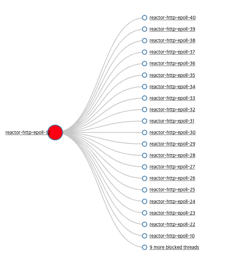

WEB on Reactive Stack 정리

한글번역 : https://madplay.github.io/post/web-on-reactive-stack-spring-webflux
        https://godekdls.github.io/Reactive%20Spring/contents/

- 왜 필요했나?
  - 기존 서블릿에도 논블로킹 IO를 지원은했지만, 서블릿에서의 동기나 블로킹방식의 API가 같이 쓰기 어려웠기에 논블로킹과 온전히 잘 조화되는 API를 만들필요가있었음
  - 자바 8 람다 사용가능으로 continuation-style api 사용가능(체인식으로 계속 쓸수있는것)

- reactive?
  - 변화에 반응하는 것을 중심에 두고 만든 프로그래밍 모델
  - 작업을 기다리기보단 완료되거나 데이터를 사용할수있게 되면 반응하므로, 논블로킹도 리엑티브
  - back pressure
    - 논블로킹에서는 프로듀서 속도가 컨슈머 속도를 압도하지않도록 이벤트 속도를 제어함(구독자가 발행자에게 발행에 대한 속도를 제어할수있게함)

- reactive api
  - 비동기 로직을 만들기 위한 풍부한 고수준 함수형 API가 필요한데, 이를 사용하기위해서 스프링 웹플럭스는 Reactor를 선택함
    - Mono
    - Flux 

- programming model
  - 어노테이션기반 : 기존 @Controller와 같이 선언하는방식
  - functional endpoints

- 웹플럭스는 언제쓰는게 좋나?
  - 이미 잘 동작하고 있는 스프링 MVC 어플리케이션이 있다면, 굳이 바꿀 필요 없다. 명령적(Imperative) 프로그래밍은 작성하기도, 이해하기도, 디버깅하기도 가장 쉽다. 지금까지 대부분이 블로킹 방식을 사용했기 때문에, 사용할 수 있는 라이브러리가 가장 풍부하다.
  - 이미 논블로킹 웹 스택을 알아보고 있다면, 스프링 웹플럭스는 다른 웹 스택과 같은 실행 환경을 제공하면서도, 다양한 서버(Netty, Tomcat, Jetty, Undertow, 서블릿 3.1+ 컨테이너)와 여러 리액티브 라이브러리(리액터, RxJava 등)를 지원하며, 두 가지 프로그래밍 모델(어노테이션을 선언한 컨트롤러와 함수형 웹 엔드포인트)을 사용할 수 있다.
  - 자바 8 람다나 코틀린으로 개발할 수 있는 경량의 함수형 웹 프레임워크를 찾고 있다면, 스프링 웹플럭스의 함수형 웹 엔드포인트를 사용하면 된다. ***로직을 투명하게 제어***할 수 있기 때문에 요구사항이 덜 복잡한 소규모 어플리케이션이나 마이크로서비스에서도 좋은 선택이 될 것이다.
  - 간단하게는 어플리케이션 의존성(dependency)을 확인해봐도 좋다. 블로킹 방식의 영속성 API(JPA, JDBC)나 네트워크 API를 사용하고 있다면 스프링 MVC가 최소한 아키텍처를 통일할 수 있으므로 가장 좋은 선택이다. 리액터나 RxJava로도 각 쓰레드에서 블로킹 API를 호출할 수 있지만, 이렇게 하면 논블로킹 웹 스택을 거의 활용하기 어렵다.

- 서버
  - 스프링 웹플럭스는 톰캣, 제티, 서블릿 3.1+ 컨테이너뿐만 아니라 네티(Netty)와 언더토우(Undertow)와 같은 비 서블릿 런타임에서도 지원된다. 모든 서버는 저수준(low-level)의 공통 API를 적용하여, 여러 서버에서 고급 프로그래밍 모델이 지원될 수 있도록 한다.
  - 스프링 부트에는 이러한 단계를 자동화하는 웹플럭스 스타터(starter)가 있다. 기본적으로 스타터는 네티(netty)를 사용하지만 메이븐(maven) 또는 그래들(gradle) 의존성을 변경하여 톰캣(tomcat), 제티(jetty) 또는 언더토우(undertow)로 쉽게 전환할 수 있다. 스프링 부트는 기본적으로 네티를 설정한다. 이유는 비동기 논 블로킹에서 더 광범위하게 사용되며 클라이언트와 서버가 리소스를 공유할 수 있기 때문이다.
  - 톰캣(tomcat)과 제티(jetty)는 스프링 MVC와 웹플럭스 모두 함께 사용할 수 있다. 그러나 사용되는 방식이 매우 다르다는 것을 명심해야 한다. 스프링 MVC는 서블릿 블로킹 I/O에 의존하며 필요한 경우에는 서블릿 API를 직접 사용할 수 있도록 한다. 스프링 웹플럭스는 서블릿 3.1 논 블로킹 I/O에 의존하며 저수준(low-level) 어댑터 뒷단에서 서블릿 API를 사용하며 이를 직접 노출하지 않는다.

- 성능
  - 어플리케이션이 무조건 빨라진다고 볼수는없음! 논블로킹 방식이 처리할 일이 더 많다보니 처리 시간이 약간 더 길어질수있음! 그러나 WebClient를 사용해서 외부서비스 호출을 병렬로 처리하는 방법과같은경우는 당연 빨라질수있음!! 
  - 리액티브와 논블로킹의 주된이점은 고정된 적은 스레드와 메모리로도 확장할수있다는것!

- 동시성모델
  - 스레딩 모델
    - 최소한의 설정으로 스프링 웹플럭스 서버를 띄우면(예를 들어 데이터 접근이나 다른 dependency가 없는), 서버는 쓰레드 한 개로 운영하고, 소량의 쓰레드로 요청을 처리할 수 있다(보통은 CPU 코어 수만큼). 하지만 서블릿 컨테이너는 서블릿 블로킹 I/O와 서블릿 3.1 논블로킹 I/O를 모두 지원하기 때문에 더 많은 쓰레드를 실행할 것이다 (예를 들어 톰캣은 10개).
    - 리액티브 WebClient는 이벤트 루프를 사용한다. 따라서 적은 쓰레드를 고정해 두고 쓴다(예를 들어 리액터 Netty 커넥터를 쓴다면 reactor-http-nio-로 시작하는 쓰레드를 확인할 수 있다). 단, 클라이언트와 서버에서 모두 리액터 Netty를 사용하면 디폴트로 이벤트 루프 리소스를 공유한다.
    - 리액터와 RxJava는 Scheduler라는 추상화된 쓰레드 풀 전략을 제공한다. publishOn 연산자가 나머지 연산을 다른 쓰레드 풀로 전환할 때도 이 스케줄러를 사용한다. 스케줄러는 이름을 보면 동시 처리 전략을 알 수 있다. 예를 들어, 제한된 쓰레드로 CPU 연산이 많은 처리를 할 때는 “parallel”, 여러 쓰레드로 I/O가 많은 처리를 할 때는 “elastic”이다. 이런 쓰레드를 본다면 코드 어딘가에서 그 이름에 해당하는 쓰레드 풀 Scheduler 전략을 사용하고 있다는 뜻이다.
    - 데이터에 접근하는 라이브러리나 다른 외부 dependency에서 쓰레드를 따로 실행하는 경우도 있다.
  - Configuring
    - 스프링 프레임워크에서 서버를 직접 실행시키거나 중단할 수는 없다. 서버의 쓰레드 모델 바꾸고 싶다면 각 서버에 맞는 설정 API를 참고하거나, 아니면 스프링 부트를 써서 각 서버에 맞는 스프링 부트 옵션을 설정하면 된다. WebClient는 코드로 직접 설정할 수 있다. 다른 라이브러리는 해당 라이브러리 문서를 확인하라.
  - Mutable State(함수형 프로그래밍의 특징..?)
    - 리액터와 RxJava에서 로직은 연산자로 표현한다. 연산자를 사용하면 런타임에 분리된 환경에서 리액티브 파이프라인을 만들고, 각 파이프라인에서 데이터를 순차적으로 처리한다. 파이프라인 안에 있는 코드는 절대 동시에 실행되지 않으므로 더 이상 상태 공유(mutable state)를 신경 쓰지 않아도 된다.


- https://m.blog.naver.com/gngh0101/221529470975 여기에 webflux 동작방식 정리 잘되어있음

```java
//이런점때문에 단순 테스트의 경우 @SpringBootApplication 을 사용하지 않고 단순 Netty 서버를 사용해 빠르게 서버를 실행하고 구현한 메서드들을 테스트 할 수 있다.
//만약 패스워드 암호화 및 복호화 테스트를 한다면 서버기능을 하는 객체 외에 추가적으로 필요한 객체는 해시 기능이 있는 spring-boot-starter-security 의 PasswordEncoder 뿐이다.

import static org.springframework.web.reactive.function.server.RequestPredicates.*;
import static org.springframework.web.reactive.function.server.RouterFunctions.*;

public static void main(String... args) {
    long start = System.currentTimeMillis();
    BCryptPasswordEncoder passwordEncoder = new BCryptPasswordEncoder(18); // encoder 생성

    HttpHandler httpHandler = RouterFunctions.toHttpHandler( // RouterFunction -> HttpHandler 변경
        route(POST("/password"), request -> request // RouterFunction 으로 라우터 로직 생성 
            .bodyToMono(PasswordDTO.class)
            .map(p -> passwordEncoder.matches(p.getRaw(), p.getSecured()))
            .flatMap(isMatched -> isMatched
                ? ServerResponse.ok().build()
                : ServerResponse.status(HttpStatus.EXPECTATION_FAILED).build())
        )
    );
    ReactorHttpHandlerAdapter reactorHttpHandler = new ReactorHttpHandlerAdapter(httpHandler); 
    // HandlerAdapter 에 HttpHandler 삽입, BiFunction 를 구현한 클래스임  
    DisposableServer server = HttpServer.create() // Netty Server
        .host("localhost").port(8080)
        .handle(reactorHttpHandler) // BiFunction<HttpServerRequest, HttpServerResponse, Mono<Void>> 요구함
        .bindNow(); // 서버 엔진 시작  
        
    LOGGER.debug("Started in " + (System.currentTimeMillis() - start) + " ms"); // Started in 703 ms
    server.onDispose().block(); // main 스레드 차단  
}

``` 
- WebHttpHandlerBuilder
  - *WebHttpHandlerBuilder 목적
    - This builder has two purposes:
      - One is to assemble a processing chain that consists of a target WebHandler, then decorated with a set of WebFilters, then further decorated with a set of WebExceptionHandlers. 
        - => WebHandler, WebFilter, WebExceptionHandlers 관련 셋팅해줌..
      - The second purpose is to adapt the resulting processing chain to an HttpHandler: the lowest-level reactive HTTP handling abstraction which can then be used with any of the supported runtimes. The adaptation is done with the help of HttpWebHandlerAdapter. 
        - => HttpHandler에 체이닝할것들 
      - The processing chain can be assembled manually via builder methods, or detected from a Spring ApplicationContext via applicationContext, or a mix of both.
  - WebHttpHandlerBuilder에 직접 등록하거나 어플리케이션 컨텍스트에서 자동으로 주입받을수잇는 컴포넌트들
    - HttpHandler
      - 서로 다른 HTTP 서버를 쓰기위한 추상화가 전부
      - Netty, Jetty, undertow, 톰캣 ...
    - WebHandler (DispatcherHandler)
      - 요청을 처리하는핸들러(DispatcherServlet과 같은역할.. 프론트 컨트롤러)
      - 웹 어플리케이션에서 흔히 쓰는 광범위한 기능을 제공
      - User session과 Session Attribute
      - Request attributes
      - Local, Principal 리졸브
      - form 데이터 파싱, 캐시조회
      - multipart 데이터 추상화
      - 등등등
    - WebFilter (FilteringWebHandler(WebHandlerDecorator의 구현체)에 셋팅되어서 WebHandler의 decorator역할)
      - 다른 필터 체인과 WebHandler 전후에 요청을 가로채 원하는 로직을 넣을수있음
    - WebExceptinoHandler (ExceptionHandlingWebHandler(WebHandlerDecorator의 구현체)에 셋팅되어서 WebHandler의 decorator역할)
      - WebFilter 체인과 WebHandler에서 발생한 예외를 처리
      - WebExceptionHandler를 구현한 DefaultErrorWebExceptionHandler가 있는데, 이는 order가 -1로 되어있음.. 특별히 커스텀하게 에러를 리턴해야한다면 WebExceptionHandler를 구현한것을 등록하고 @Order를 -1보다 작은숫자로 해놔야함 
        - 즉, 에러를 핸들링하기위해서는 WebExceptionHandler를 Component로 등록할것 Order(-2)로 사용할것([참고사이트](https://stackoverflow.com/questions/49648435/http-response-exception-handling-in-spring-5-reactive))
        - 근데 DefaultErrorWebExceptionHandler 가 json메세지(timestamp, path, status, error, message 등)로 깔끔하게 에러를 전달해주기때문에, 이를 사용하면 좋을듯
          - 만약 WebExceptionHandler을 커스텀해서(order를 -2로..) 로그만찍고 DefaultErrorWebExceptionHandler로 보내고싶다면 WebExceptionHandler를 구현한곳에서 Mono.error(ex)로 던져주어야한다!
        - ResponseStatusException 으로 던져야 DefaultErrorWebExceptionHandler가 잡아서 적절하게 값들을 셋팅하므로 ResponseStatusException을 커스텀하여 사용하면 좋을듯
          - message를 보기 위해서는 application.properties에 `server.error.include-message=always` 셋팅해주어야함 
      - WebExceptionHandler 통해서 예외처리 어떻게하는지보다가 돌아가는 흐름 분석한 내용
        - MappingHandler로 Handler 찾고, 찾은 핸들러를 HandlerAdatper(HandlerFunctionAdpater인 경우 HandlerFunction을 실행)로 실행시키고, 그에대한 결과값인 HandlerResult를 HandlerResultHandler가 실행시켜서 결과를 셋팅하여 응답하게된다
        - filter는 HandlerAdapter가 mapping된 핸들러 실행 전후에 수행됨 (filter 또한 결과적으로 HandlerFunction으로 만들어져서 기존의 HandlerFunction에 더해지는것..)
        - 그렇다보니, 비지니스 로직을 수행을 다 진행하고 결과를 전달받는 로직으로 HandlerFunction을 만들어놓았다면, 에러 발생시 after와 같은 filter는 당연 실행안되고, 그냥 filter 에서도 response에 대한 처리 로직을 수행안됨
        - 만약, 비지니스 로직을 수행하고 값을 넣는것을 Mono로 감싸서 response의 body로 넘겨주어 파이프라인을 만들었다면, body 내부에 있는 Mono는 HandlerResultHandler에서 결과값을 셋팅할때 수행될테니, 만약 에러가 난다해도 filter에서 절대 잡힐수가없다..
        - 그러므로 webFilter나, WebExceptionHandler 에서 예외를 받아서 처리해주어야한다!
          - *filter는 handler를 수행하기전에 필요한 로직을 메서드안에 정의할수있고, response에 대한것은 next.handler(request)를 통해(이게 Mono에 감싸진 response 리턴해줌)에 정의할수있다..


- DispatcherHandler 요청처리과정
  - HandlerMapping을 뒤져 매칭되는 핸들러를 찾는다.. 첫번째로 매칭된 핸들러사용
  - 핸들러를 찾으면 적당한 HandlerAdapter를 사용해 핸들러를 실행하고, HandlerResult를 돌려받는다
    - HandlerAdpater중 HandlerFunctionAdapter를 사용한다면, HandlerFunction을 호출하게된다
    - 핸들러가 리턴한 리액티브 타입(Mono or Flux)이 데이터를 produce하기 전에 에러를 알아차릴수만 있으면, @Controller로 선언하나 클래스에서 @ExceptionHandler or @ControllerAdvice를 사용하여 잡을수있음(여기서 응답코드 변경하거나 하겠지..)
  - HandlerResult를 적절한 HandlerResultHandler로 넘겨 바로 응답을 만들거나 뷰로 렌더링하고 처리를 완료한다..

- validator는 어떻게?
  - JSR380 (어노테이션 validation) 을 사용하여 valdation할거면 spring에서 validator를 주입받아도되고, 그냥 유틸클래스 하나 만들어서 검증하도록 하는게 좋음

- functional endpoint 는 어떻게 만드나?
  - route를 통해서 요청들을 연결시켜주는데, route는 대략 아래처럼 만들면됨
    ```java
  import static org.springframework.web.reactive.function.server.RequestPredicates.*;
  import static org.springframework.web.reactive.function.server.RouterFunctions.*;

        @Bean
        public RouterFunction userRouterFunction(UserHandler user){ // 필요한 핸들러를 전달받아서 요청에 맞는 동작을 수행하도록 해준다! (상당히 깔끔 및 직관적)
            return nest(path("/users") // "/users" 를 공통으로 하도록 nest(중첩) 사용
                    ,nest(accept(MediaType.APPLICATION_JSON) //중첩안에 또 중첩으로, 요청의 accept 헤더를 json인것으로 필터..(서버입장에서 response의 content-type)
                            ,route().GET("{id}",user::getUser)
                                    .GET("/{id}/error",user::error)
                                    .GET("/{id}/error2",user::error2)
                                    .build()
                    ).andNest(contentType(MediaType.APPLICATION_JSON)
                            ,route().POST(user::register)
                                    .POST("/error",user::postError)
                                    .build()
                    ).filter((request, next) -> next  // 위 모든 중첩된것들의 filter..
                            .handle(request)
                            .doOnNext(serverResponse -> {
                                log.info("서버 응답: "+serverResponse.statusCode());
                            }))
                    )
            );
        }
    ```


- webflux 주의사항 ([출처](https://www.youtube.com/watch?v=I0zMm6wIbRI))
  - 리엑터의 log()함수는 사용하지말자!
    - log가 왜 block...?
      - log가 block되는것은 아닌듯함.. 공식문서에 아래와같이나옴
        - you should take care to configure the underlying logging framework to use its most asynchronous and non-blocking approach — for instance, an AsyncAppender in Logback or AsyncLogger in Log4j 2.
        - 핵심은 구현체를 잘쓰라는것
      - ~~log를 써서 느려진이유가 block 때문은 아닌거같고, 로그 구현체의 문제인거나 로그찍는 양이 많앗다거나 했었을듯함..~~
        - 무엇보다 block이 되었다면 blockhound에 잡혀야되는데 그렇지않있음..
        - => blockhound에 잡히지는않았지만, 내부적으로 block되는 구간이있었다..(근데 왜 blockhound에는 안잡혓지...?)
          - => 테스트 해본바, log를 쓰면 느리긴함.. doOnNext를 사용해서 log를찍으면 그렇지않음.. 
            - log 썼을때 thread dump로 확인해본바, SignalLogger 내부에서 logger 작성하는 부분에 lock이 잡히고, 그에 따라 block된 스레드들이 많아짐(100개의 스레드로 요청을 서버로 보내고있었는데, 서버에서 29개의 block이 발견 - 참고로 해당서버의 cpu전체 코어갯수는 40개)
            ```java
              reactor-http-epoll-12
              Stack Trace is:
              java.lang.Thread.State: RUNNABLE
              at java.util.Arrays.copyOf(Arrays.java:3181)
              at java.util.concurrent.CopyOnWriteArrayList.add(CopyOnWriteArrayList.java:440)
              at ch.qos.logback.classic.Logger.createChildByName(Logger.java:359)
              at ch.qos.logback.classic.LoggerContext.getLogger(LoggerContext.java:154)
              - locked <0x00000001dd4e1240> (a ch.qos.logback.classic.Logger)               //여기서 lock..
              at ch.qos.logback.classic.LoggerContext.getLogger(LoggerContext.java:53)
              at org.slf4j.LoggerFactory.getLogger(LoggerFactory.java:363)
              at reactor.util.Loggers$Slf4JLoggerFactory.apply(Loggers.java:201)
              at reactor.util.Loggers$Slf4JLoggerFactory.apply(Loggers.java:197)
              at reactor.util.Loggers.getLogger(Loggers.java:182)
              at reactor.core.publisher.SignalLogger$$Lambda$1295/975302839.apply(Unknown Source)
              at reactor.core.publisher.SignalLogger.<init>(SignalLogger.java:119)
              at reactor.core.publisher.SignalLogger.<init>(SignalLogger.java:75)
              at reactor.core.publisher.Mono.log(Mono.java:3338)
              at reactor.core.publisher.Mono.log(Mono.java:3306)
              at reactor.core.publisher.Mono.log(Mono.java:3263)
              at com.test.webfluxperformance.user.UserHandler.find(UserHandler.java:50)
              ...

            ```
            - 
            
  - map 과 flatmap 을 잘쓰자 (Mono)
    - map : 동기식으로 아이템을 변경
      - 너무 많은 map 함수 조합은 연산마다 객체를 생성하기때문에 GC에 대상이 많아질수있음
      - 동기식으로 동작해
    - flatmap : 비동기식으로 아이템 변경
      - flatmap을 사용하면 확 변하는개념이아니라, 반환값이 일단 publisher 이기때문에 비동기식으로 사용할수있다는것! 그리고 Flux일때 flatmap은 위빙이라는 작업을 통해서 비동기작업이 이루어졌을때 작업을 시작한 순서와 상관없이 빠르게 끝난것부터 조합을하기때문에 빠름!
  - BlockHound 라이브러리로 Blocking 코드를 찾아보자!
    - reactor-core 3.3.0 부터 내장
    

response time 95th percentile
mean requests/sec
- 게이틀링??
- 스캐터차트

- Flux 있는데 Mono 왜 필요?
  - ***사용성***과 ***context***에서 중요
  - 즉, 컨트롤러에서 Mono로 Response를 리턴한다면, 해당 요청은 스트림으로 작용하는게아니란것을 알수있다!

- webflux 관련 테스트코드
  - WebTestClient를 직접 만드는 경우
    - Spring이랑 연관이 안되니까 빠르게 올라가긴하는데, auto configuration으로 자동생성되는것들 중에 필요한것들은 직접 셋팅해줘야함..
      ```java
        WebTestClient webTestClient = WebTestClient.bindToRouterFunction(helloRouterFunction) //routerFunction보다도 더 low level로도 만들수있음
                  .webFilter((exchange, chain) -> { //이런식으로 filter를 직접 셋팅가능
                      System.out.println(Thread.currentThread().getName()+" | 동작1");
                      return chain.filter(exchange)
                              .onErrorResume(RuntimeException.class, e -> {
                                  System.out.println(Thread.currentThread().getName()+" | 동작10");
                                  ServerHttpResponse response = exchange.getResponse();
                                  response.setStatusCode(HttpStatus.BAD_GATEWAY);
                                  return response.setComplete();
                              });
                  })
                  .handlerStrategies(HandlerStrategies.builder() //여러 핸들러 전략도 이렇게 셋팅가능(여기서는 webExceptionHandler)
                          .exceptionHandler((exchange, ex) -> { 
                              if(ex instanceof ClientRuntimeException){
                                  exchange.getResponse().setStatusCode(HttpStatus.BAD_REQUEST);
                                  exchange.getResponse().getHeaders().set(HttpHeaders.CONTENT_TYPE,MediaType.APPLICATION_JSON_VALUE);
                                  return exchange.getResponse().writeWith(Mono.just(exchange.getResponse().bufferFactory().wrap((("{\"message\":\""+ex.getMessage()+"\"}").getBytes()))));
                              }
                              else if(ex instanceof RuntimeException){
                                  exchange.getResponse().setStatusCode(HttpStatus.BAD_GATEWAY);

                                  return exchange.getResponse().setComplete();
                              }
                              return Mono.error(ex);
                          }).build())
                  .configureClient().responseTimeout(Duration.ofHours(1))
                  .build();
      ```
  - `@WebFluxTest` + `@Import` 조합
    - `@Import`를 통해서 필요한 빈 만 사용할수있음
    ```java

      @WebFluxTest(properties = "server.error.include-message=always")
      @Import({RouterFunctionConfig.class,UserHandler.class, CustomWebExceptionHandler.class, Config.class}) //필요한 빈만 등록
      class UserHandlerTest {
        @Autowired
        WebTestClient webTestClient;

        @BeforeEach
        public void setUp() { //webTestClient관련해서 커스텀하고싶으면 아래와 같이 사용할것
            webTestClient = webTestClient 
                    .mutate()
                    .responseTimeout(Duration.ofHours(1)) 
                    .build();
        }  

        ...
      }
    ```
    
  - `@SpringBootTest(webEnvironment = SpringBootTest.WebEnvironment.RANDOM_PORT)` + `@AutoConfigureWebTestClient` 조합
    - 외부 라이브러리를 사용해야한다거나, 전체적으로 통합테스트할때 사용
    ```java

      @SpringBootTest(webEnvironment = SpringBootTest.WebEnvironment.RANDOM_PORT) //그냥 @SpringBootTest로하면 정상동작안함..
      @AutoConfigureWebTestClient
      class DistributionHandlerTest {
          @Autowired
          WebTestClient webTestClient;

          @SpyBean(MessageDistributor.class) 
          Distributor distributor;

          @MockBean
          KafkaProducer kafkaProducer;

          ...
      }
    ```


- 마블다이어그램 참고하기 좋은 사이트 : https://rxmarbles.com/