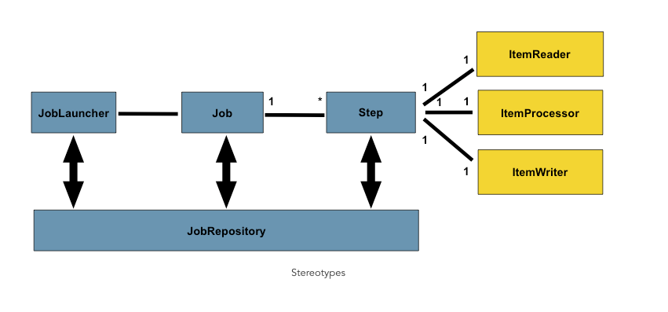
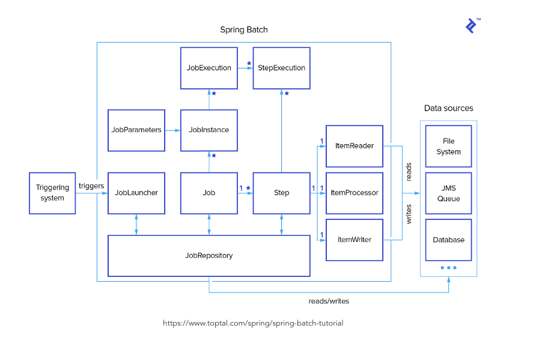

spring batch
- spring batch?
  - Spring Batch는 엔터프라이즈 시스템의 일상적인 운영에 필요한 배치 애플리케이션을 쉽게 개발할 수 있도록 설계된 강력한 프레임워크
  - 로깅/추적, 트랜잭션 관리, 작업 처리 통계, 작업 플로우 지정(작업을 재시작하거나 스킵), 리소스 관리 등 대량의 레코드를 처리하는 데 필수적인 기능을 재사용 가능한 형태로 제공
- 기본 동작
  - Job은 하나 이상의 Step을 가질 수 있고, 각 Step은 ItemReader, ItemProcessor, ItemWriter를 단 하나씩만을 가지며, 현재 프로세스에서 필요한 메타정보들은 JobRespository에 저장
  - 
  - 

- ExecutionContext
  - Job마다, 혹은 각 Step마다 공유되어야 하는 상태나 데이터가 필요한데, 이를 지속가능한 상태로(DB) 저장할수있도록 Spring batch 프레임워크에서 지원하는 key/value 데이터를 담는 공간
  - 범위에 따라 두개의 ExecutionContext를 지원
    - JobExecution의 ExecutionContext
      - JobExecution 내에서 사용되며, 각 Step에서 접근하면서 공유할 수 있음
    - StepExecution의 ExecutionContext 
      - 특정 Step에서만 저장
  - Store Data
    - ExecutionContext에 데이터가 저장될 때에는 JSON형식으로 변환하여 json문자열을 DB에 보관. 
    - 예전에는 Xstream 프레임워크를 이용했는데, 3.0.7 버전 부터 Jackson2을 사용하기 시작(Spring Batch 4에서 Xstream은 deprecate되고 Jackson2를 사용하기 시작)
  - Serialize
    - Java 객체를 Json형태로 Serialize해서 보관하고 Deserialize해서 가져오게됨
    - 기본적으로 사용하는 Serializer는 ExecutionContextSerializer를 구현한 Jackson2ExecutionContextStringSerializer
    - JSON 형식으로 Serialize할 수 없는 객체는 기본적인 설정으로는 저장할 수 없다
      - 만약 추가적인 기능이 필요하다면 ExecutionContextSerializer를 구현하여 사용
        - 주의해야할점은 그냥 JobRepository를 정의하거나, ObjectMapper를 정의하는것이 아닌, `DefaultBatchConfigurer`를 재정의해서 사용해야한다..
          - https://stackoverflow.com/questions/53116676/spring-batch-not-deserialising-dates

- JobRepository
  - 스프링 배치는 Job 실행 시의 상태나 데이터 관리를 위해 해당 정보들을 JobRepository를 통해 저장하고 관리
  - 테이블 종류
    - BATCH_JOB_INSTANCE
      - Job을 시작하면 가장 먼저, BATCH_JOB_INSTANCE에 Instance 정보가 등록
      - 컬럼
        - JOB_INSTANCE_ID : JobInstance의 식별값으로, PK에 해당. JobInstance에서 getId 메서드를 통해 얻을 수 있음
        - VERSION : Optimistic locking에 사용되는 Version
        - JOB_NAME : Instance의 구분을 위한 Job의 이름
        - JOB_KEY : Job Name과 Job Parameter의 해시값, Job instance를 고유하게 식별하는 값
    - BATCH_JOB_EXECUTION_PARAMS
      - Job이 실행될 때마다 사용되는 JobParameter의 데이터들을 저장
    - BATCH_JOB_EXECUTION
      - 배치 잡의 실제 실행 기록을 저장
      - Job이 실행 될때마다 새로운 레코드가 테이블에 생성되며, Job이 진행되는 동안 주기적으로 업데이트
    - BATCH_JOB_EXECUTION_CONTEXT
      - Batch Job의 ExecutionContext에 대한 정보를 저장하는 테이블
      - 배치가 여러번 실행해야 하는 상황에서 유용하게 쓰임
    - BATCH_STEP_EXECUTION
      - 항상 하나의 JobExecution엔 적어도 하나의 StepExecution이 존재
      - 해당 테이블은 분석이 가능하도록 다양한 횟수값(읽기, 처리 등)을 추가로 저장
      - 컬럼
        - STEP_EXECUTION_ID : 해당 테이블(BATCH_STEP_EXECUTION)의 PK 
          - 이 값은 StepExecution 객체의 getId 메서드를 통해 얻을 수 있습니다.
        - VERSION : Optimistic locking에 사용되는 레코드의 버전
        - STEP_NAME : Step 이름
        - JOB_EXECUTION_ID : BATCH_JOB_EXECUTION의 FK 
          - StepExecution이 속한 JobExecution을 가리킵니다.
        - START_TIME : Step 실행 시작 시간 (Timestamp)
        - END_TIME : Step 실행 완료 시간 (Timestamp)
          - 성공/실패에 관계없이 실행이 완료된 시간을 나타내는 타임스탬프입니다. 작업이 현재 실행되고 있지 않을 때 **해당 값이 비어 있으면 오류가 발생해서 실패 전에 마지막 저장을 수행하지 못했음을 나타냅니다.**
        - STATUS : Step 배치 상태
          - 이 값은 Java BatchStatus Enum 값 중 하나로 들어갑니다.
        - COMMIT_COUNT : Step 실행 동안 커밋된 트랜잭션 수
        - READ_COUNT : Step 실행 동안 읽은 Item 수
        - FILTER_COUNT : Step 실행 동안 ItemProcessor가 null을 반환해 필터링된 아이템 수
        - WRITE_COUNT : Step 실행 동안 기록된 아이템 수
        - READ_SKIP_COUNT : ItemReader 내에서 예외가 던져졌을 때 건너뛴 아이템 수
        - PROCESS_SKIP_COUNT : ItemProcessor 내에서 예외가 던져졌을 때 건너뛴 아이템 수
        - WRITE_SKIP_COUNT : ItemWriter 내에서 예외가 던져졌을 때 건너뛴 아이템 수
        - ROLLBACK_COUNT : Step에서 롤백된 트랜잭션 수
          - Retry나 그 때 Retry를 Skip한 것에 대한 롤백을 포함하여 매 롤백마다 포함됩니다.
        - EXIT_CODE : Step의 종료 코드 (Character String)
          - command-line job의 경우 number로 변환가능합니다.
        - EXIT_MESSAGE : Step 실행에서 반환된 메시지나 Stack Trace
          - Job이 종료 내용을 서술하는데, 만약 오류가 발생했다면 오류 메세지가 추가됩니다.
        - LAST_UPDATED : 레코드가 마지막으로 업데이트된 시간 (Timestamp)
    - BATCH_STEP_EXECUTION_CONTEXT
      - StepExecution 수준의 ExecutionContext를 저장

---

- JobRepository는 meta-data에 대한 CRUD를
- JobExplorer는 meta-data에 대한 read-only 동작
- JobOperator는 Job에 대해 정지하거나, 재시작하거나, 혹은 요약하는 등의 모니터링을 할 때에는 batch operator에 의해 수행

---

- 참고블로그
  - https://gngsn.tistory.com/177
  - https://gngsn.tistory.com/178
  - https://gngsn.tistory.com/179
  - https://gngsn.tistory.com/187
- exitStatus vs batchStatus
  - https://www.google.com/search?q=spring+batch+exit+status+vs+batch+status&rlz=1C5CHFA_enKR988KR988&oq=spring+batch+exitstatus+batch&aqs=chrome.1.69i57j0i22i30l2j0i390i650l2.10398j0j4&sourceid=chrome&ie=UTF-8
  - transition의 status 셋팅되는건 exitStatus임..
    - https://jojoldu.tistory.com/328
- 나중에 개발 참고하기 좋은 사이트
  - spring 공식문서..
  - https://jojoldu.tistory.com/category/Spring%20Batch
    