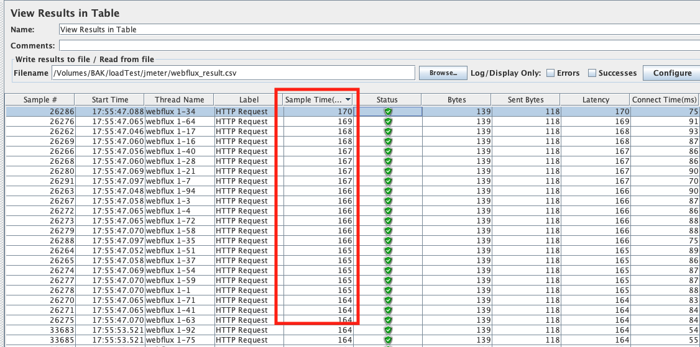

- webflux vs web mvc(async 아님)
  - webflux 테스트용 application, web mvc 테스트용 application 은 내부 로직은 동일하며, 내부로직을 달리하여서 두가지 테스트를 진행
  - 테스트 환경
    - jmeter로 테스트(로컬에서 구동)
    - 56번 개발서버에 어플리케이션 구동 및 redis 구동
    - local에 1초가량의 delay가 있는 api 서버 구동
      - 스레드풀에 1000개의 스레드를 고정시킴 (1000개의 요청에 대해서 block없음)
  - 로직1
    - redis로 데이터 get
    - 결과 
      - webflux가 throughtput(여기서는 초당요청수)과 sampletime(response time)을 보았을때 아주 약간의 더 나은 모습이 보임 (아래 참고)
      - 약간인 이유는 비지니스로직에 별다른 block 구간이 없기때문
      - 또한 web mvc는 기본적으로 스레드 200개를 사용하게되는데, 그것또한 병목이 없으니 모든 요청에 바로바로 받아줄수있었음
      - 즉, block되는구간이 없다면 비동기 webflux와 web mvc는 성능상 큰 차이가없다
        - 분명히 해야할점은 운영상에서 block될수있는 구간(db,api호출)이 존재하며, 모든 비지니스로직들을 block되지않도록 만드는것은 web mvc 를 통해서는 신경쓸부분이 많다
      
      |webflux|web mvc|
      |---|---|
      |||
      |||
      |* 100 Users x 1000|

  - 로직2  
    - api 호출(1초 정도의 delay있음), 결과 데이터를 기반으로 redis로 데이터 get한것을 조합 
    - 결과
      - webflux가 월등히 앞서는것을 볼 수 있음
      - throughtput뿐 아니라, Min(응답시간 최소값)과 Max(응답시간 최대값)의 차이가 web mvc보다 훨씬 적음
        - webflux가 반응성이 좋기때문에 사용자의 사용성을 더 좋게해줄수있다!
      - 이렇게 차이가 나는 이유는 API호출시 blocking되는 현상이 일어나기때문.. web mvc의 restTemplate은 기본적으로 요청에대한 응답을 받아야 진행되는 blocking형식인데(아까운 스레드를 계속 잡고있음), 톰캣의 스레드가 다 사용되면 요청에 대해서 계속 대기를 하게되고, 그로인해서 어떤 사용자의 응답시간은 한없이 늘어난다..
      - 반면, webflux의 경우에 webclient는 비동기로 데이터를 요청하고 응답받기때문에, api 서버가 처리만 가능하다면 상당히 빠르게 진행될수있다. 즉, api 서버가 처리하는 속도에 따라서 사용자의 응답시간이 바뀔뿐이다..
        - (너무 빠르게 마냥 API를 호출하는것도 좋지는않을텐데.. 이에 대한 처리는 어떻게하는게 좋을까? - back pressure?) 

      |webflux|web mvc|
      |---|---|
      |||
      |||
      |* 1000 Users x 20|
  
  - 위 두 테스트에대한 결론
    - 어플리케이션에 db를 사용하는 경우가 많은데 그럴때에 webflux의 스케줄러를 사용하여 손쉽게 block을 피할수 있기때문에 값비싼 스레드를 점유하고 있지도 않을뿐 아니라, api 호출과 같은경우도 webclient를 사용하여 비동기로 처리하고 reactor 파이프라인을 만들어줌으로써, 요청에서 응답까지 하나의 파이프라인안에서 비동기로 깔끔하게(함수형) 처리한다면 반응성을 극대화하고, 그에 따라 사용자의 사용성을 향상시킬수있을거라 생각한다.
    - redis는 빠르다..
- 테스트 소스
  - https://github.com/KimJeongHoon3/api-for-performance-test
  - https://github.com/KimJeongHoon3/webflux-performance-test
  - https://github.com/KimJeongHoon3/mvc-performance-test