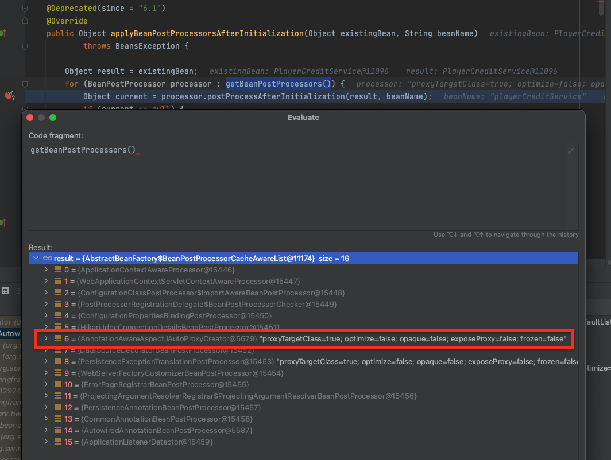
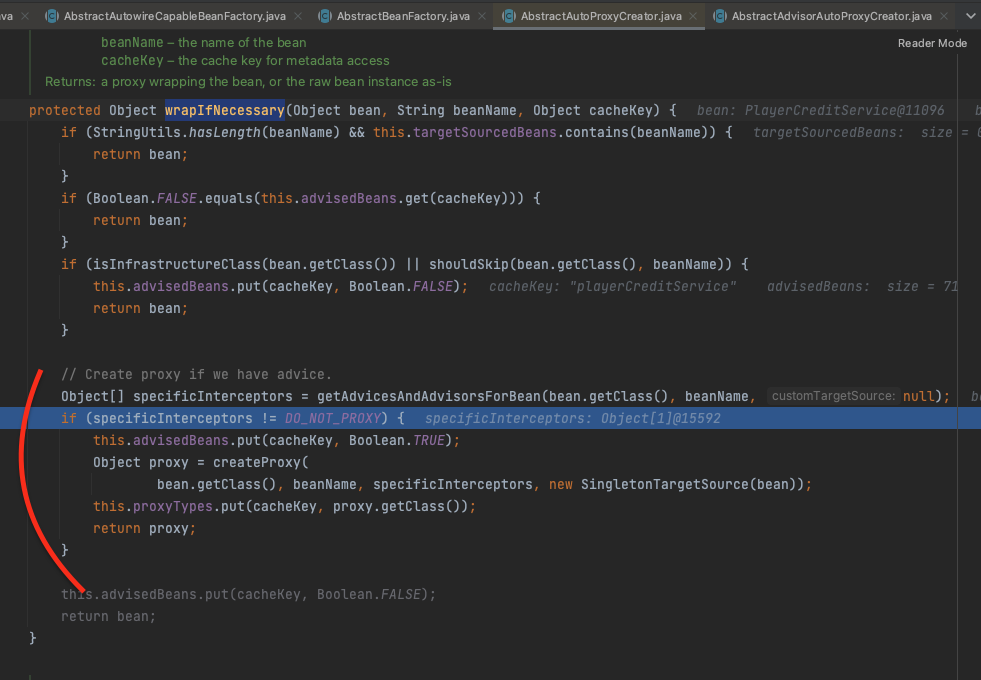
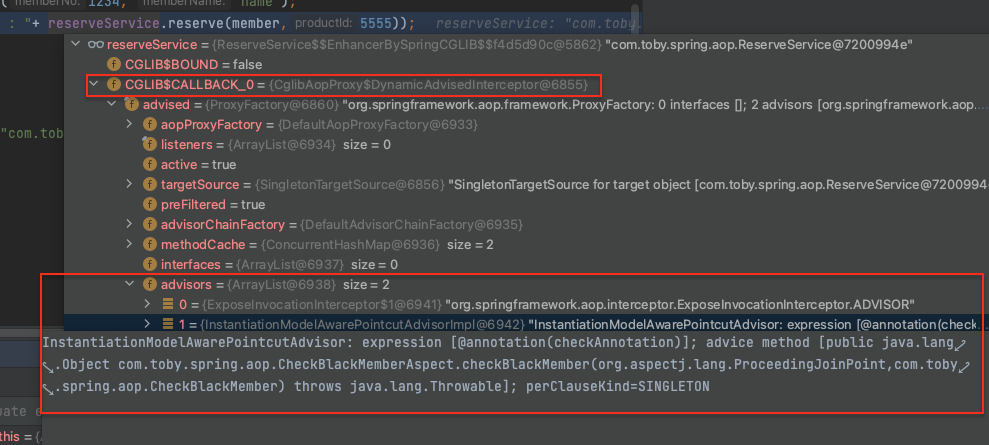

Aspect Oriented Programming with Spring 

- OOP를 보완해줄수있는게 AOP
- 부가기능을 비지니스로직으로부터 분리시키는 개념
  - 문서에서는 부가기능을 “crosscutting” concerns 으로 표현
- 구현방법
  - schema-based approach
  - AspectJ annotaion style
    - AspectJ 프로젝트에서 도입되었다함 (AspectJ 5 release)
- 컨셉
  - 용어
    - target(타깃) : 부가기능 부여할 대상. 핵심기능 담은 클래스 or 부가기능 담은 프록시 오브젝트가 타깃이 될수있음
    - join point : 어드바이스가 적용될수 있는 위치. 타깃 오브젝트가 구현한 인터페이스의 모든 메소드는 조인포인트가 됨
    - proxy : 클라이언트와 타깃 사이에 투명하게 존재. 부가기능을 제공. 스프링은 프록시를 통해 AOP를 지원
    - Advice : 타깃 오브젝트에 적용하는 부가기능을 담은 오브젝트. 타깃 오브젝트에 종속되지않는다! 순수한 부가기능!(ex. MethodInterceptor를 구현한 오브젝트)
    - Pointcut : 메소드 선정 알고리즘을 담은 오브젝트! => 적용 클래스 맞는지(클래스필터), 메소드 맞는지(메소드매처)
     - 어드바이스 적용할 조인포인트를 선별하는 작업 또는 기능을 정의한 모듈
     - *spring aop는 AspectJ pointcut expression language 를 기본적으로 사용함*
    - Advisor : Pointcut + Advice. 즉, 어떤 부가기능(advice)을 어디에 전달(pointcut)할 것인지를 알고 있는 모듈
      - 문서에는 특별히 나와있진않음 (토비스프링)
    - Aspect : application을 구성하는 중요한 한가지 요소. 핵심기능에 부가되어 의미를 갖는 특별한 ***모듈***. Advisor는 단순한 형태의 Aspect!
  - adivce type
    - Before advice
    - After returning advice
    - After throwing advice
    - After (finally) advice
    - Around advice
    - => advice를 적용하는 시점을 지정할수있는데, Aroud advice보다는 좀더 범위가 좁은것들을 활용하여 더 심플하게 만들것을 권함. (Aroud adivce와 같은경우는 proceed라는 메소드를 통해서 무언가를 처리해주어야하는데, 이럴때 적절한 예외처리가 함께 포함되므로, 좀더 단순한구조로 셋팅하기 어려울수있고 에러유발의 가능성을 높일수있음)
- Spring AOP Capabilities and Goals
  - 완벽한 AOP 기능을 지원하지않는다.. 그 이유는 Spring IoC와 AOP의 통합에 더욱 집중했기때문 (Rather, the aim is to provide a close integration between AOP implementation and Spring IoC, to help solve common problems in enterprise applications.)
    - There is no need for a special compilation process. Spring AOP does not need to control the class loader hierarchy and is thus suitable for use in a servlet container or application server. (빈 후처리기를 사용하여 일괄적으로 프록시를 적용하는것도 스프링 컨테이너와의 통합때문인듯 - 스프링 컨셉유지)
    - 그렇기에, field에 대한 인터셉션이 어렵고, 도메인객체에는 Spring AOP 적용이 어렵다. (그래서 여기에도 적용하기위해서는 AspectJ를 별도로 사용해야한다)

- Enabling @AspectJ Support
  - @AspectJ aspects와 auto-proxing beans 를 하기위한 spring support를 적용해야함
    - auto-proxing 은 스프링에서 하나 이상의 aspects를 빈에 적용하고(intercept) 적절한 순서에 맞게 실행되는것을 보장하는것을 이야기한다
    - `@EnableAspectJAutoProxy`
- Declaring an Aspect
  - `@Aspect`만 선언되어있으면 auto-detection 불가.. 반드시 설정 클래스에 `@Bean`으로 등록하거나, `@Component`를 클래스에 선언하여 빈으로 등록되어야함!
  - advice의 타겟이 aspect가 될수는없다! (advice의 타겟은 real object..). 
    - `@Aspect`라는 어노테이션이 선언된 클래스는 aspect라는뜻이 되었기떄문에, auto-proxing 진행시에 타겟으로 제외된다
    - In Spring AOP, aspects themselves cannot be the targets of advice from other aspects. The @Aspect annotation on a class marks it as an aspect and, hence, excludes it from auto-proxying.
- Declaring a Pointcut
  - 두가지로 구성
    - a signature comprising a name and any parameters
      - 보통 메서드 정의로 나타냄
      - `void` 리턴타입이어야함
      - 여기에 정의된 접근제한자에 따라서 해당 pointcut signature를 사용하는 범위가 결정 (private은 해당 클래스내, protected는 상속받은 대상까지, public은 모든 영역에서 참조가능)
        -  When referring to pointcuts by name, normal Java visibility rules apply (you can see private pointcuts in the same type, protected pointcuts in the hierarchy, public pointcuts anywhere, and so on).
    - pointcut expression
      - `@Pointcut` 사용
    - ex
    ```java
        @Pointcut("execution(* transfer(..))") // the pointcut expression
        private void anyOldTransfer() {} // the pointcut signature
    ```

  - pointcut format
  ```java
    execution(modifiers-pattern? ret-type-pattern declaring-type-pattern?name-pattern(param-pattern) throws-pattern?)
  ```

  - `args`를 사용한다면 이 점을 유의하자 (무슨소리인지 잘 모르겠음)
    - Note that the pointcut given in this example is different from execution(* *(java.io.Serializable)). The args version matches if the argument passed at runtime is Serializable, and the execution version matches if the method signature declares a single parameter of type Serializable.


- Advice
  - `@After` 
    - 정상적으로 수행완료된것 혹은 예외가 떨어진 후에도 핸들링 할 수 있다. 
    - finally와 유사
  - `@AfterThrowing`
    - `@After` 이나, `@AfterReturning` 에서 발생한 예외는 처리하지않는다
    - 오직 join point에서 발생한 에러만 처리

  - `@Around`
    - target object 호출 이전과 이후에 공유될 상태가 있다면 이를 사용할것. 
    - 반드시 return type이 `Object`로 선언되어있어야함
    - 반드시 첫번째 파라미터는 `ProceedingJoinPoint` 타입이어야함
      - 그리고 반드시 `proceed()`를 호출해서 target object의 메서드를 실행시켜야한다
      - `proceed()` 호출을 통해 target object 메서드의 결과값을 가져올수있는데, 여기서 캐싱같은것 구현한다면 기존에 값이 있어서, 굳이 해당 메서드를 호출하지않아도 된다면 호출안할수도있다. 그리고 또한 필요에 따라 여러번 호출할 수 도 있는데, 이는 문제있는 로직이 아니다!
        - void로 리턴타입이 선언되어있는 target object 메서드라면, 항상 null이 리턴된다
    - 주의사항
      - proceed에 인자가 없을때와 인자 있을때의 동작이 다르다!
        - [필요시 내용참고해서 적용하자](https://docs.spring.io/spring-framework/docs/current/reference/html/core.html#aop-ataspectj-around-advice)
  
  - `@Before`
    ```java
        @Before("com.xyz.myapp.CommonPointcuts.dataAccessOperation() && args(account,..)") // 적어도 하나의 파라미터가 있어야하며, 그 파라미터는 Account 타입이어야한다!
        public void validateAccount(Account account) {
            // ...
        }

        // args 표현식에서 타입 이름 대신 매개변수 이름을 사용하면 어드바이스가 호출될 때 해당 인수의 값이 매개변수 값으로 전달됩니다.

        // 위와 같으나, pointcut을 활용한 사례
        @Pointcut("com.xyz.myapp.CommonPointcuts.dataAccessOperation() && args(account,..)")
        private void accountDataAccessOperation(Account account) {}

        @Before("accountDataAccessOperation(account)")
        public void validateAccount(Account account) {
            // ...
        }


    ```
    - [Before에 parameter 받기](https://docs.spring.io/spring-framework/docs/current/reference/html/core.html#aop-ataspectj-advice-params-passing)

- 예시
  ```java
    @Retention(RetentionPolicy.RUNTIME)
    @Target(ElementType.METHOD)
    public @interface Auditable {
        AuditCode value();
    }

    @Before("com.xyz.lib.Pointcuts.anyPublicMethod() && @annotation(auditable)") // 어노테이션 이렇게 받을수있으면, 필요한 인자 memberNo와 productId를 두개 받아서 여기서 가져오면될것같은데.. 가능할지 확인필요할듯..
    public void audit(Auditable auditable) {
        AuditCode code = auditable.value();
        // ...
    }

  ```

- [제네릭을 사용하는 경우 aspect 사용방법](https://docs.spring.io/spring-framework/docs/current/reference/html/core.html#aop-ataspectj-advice-params-generics)
  - Collection 제네릭을 받을때는 구체적인 타입을 명시할순없음.. 아래와 같이 해야함
  ```java
    @Before("execution(* ..Sample+.sampleGenericCollectionMethod(*)) && args(param)")
    public void beforeSampleMethod(Collection<?> param) {
        // Advice implementation
        // manually check the type of the elements.
    }
  ```

- @Around, @Before, @After, @AfterReturning, @AfterThrowing 중에 어떤게먼저 수행될까? (답은 질문)
  - As of Spring Framework 5.2.7, advice methods defined in the same @Aspect class that need to run at the same join point are assigned precedence based on their advice type in the following order, from highest to lowest precedence: @Around, @Before, @After, @AfterReturning, @AfterThrowing. Note, however, that an @After advice method will effectively be invoked after any @AfterReturning or @AfterThrowing advice methods in the same aspect, following AspectJ’s "after finally advice" semantics for @After.


- Proxying Mechanisms
  - Spring aop는 CGLIB나 JDK dynamic proxy를 사용
    - CGLIB: 오픈소스 사용(spring-core에서 재패키징함)
    - JDK dynamic proxy: JDK 내에 있음
  - 기본적으로 인터페이스 사용하면, JDK dynamic proxy를 사용하고 그렇지않고 클래스를 사용하면 CGLIB를 사용
  - 프록시로 만들어지기때문에, target object에서 this.method 와 같이 자신의 메서드를 호출하면 advice는 실행되지않는다..! 반드시 프록시 객체를 통해서 호출해야만 동작한다
    - 이에대한 해결책은, 리팩토링을 통해 자신을 호출하지않도록 하는게 제일 best.. (The best approach (the term "best" is used loosely here) is to refactor your code such that the self-invocation does not happen. )
    - 

- Programmatic Creation of @AspectJ Proxies
    ```java
    // create a factory that can generate a proxy for the given target object
    AspectJProxyFactory factory = new AspectJProxyFactory(targetObject);

    // add an aspect, the class must be an @AspectJ aspect
    // you can call this as many times as you need with different aspects
    factory.addAspect(SecurityManager.class);

    // you can also add existing aspect instances, the type of the object supplied must be an @AspectJ aspect
    factory.addAspect(usageTracker);

    // now get the proxy object...
    MyInterfaceType proxy = factory.getProxy();
    ```


- [Using the ProxyFactoryBean to Create AOP Proxies](https://docs.spring.io/spring-framework/reference/core/aop-api/pfb.html)
  - AOP의 proxy를 만들때는 `ProxyFactoryBean` 클래스의 `getObject()` 메서드를 를 사용한다. (클라이언트는 해당 bean에 접근할때 `ProxyFactoryBean` 자체를 받는게 아닌, `getObject()` 메서드를 통해서 만들어진 객체를 전달)
    - `ProxyFactoryBean` 의 이점은 pointcut과 advice들이 IoC에 의해 관리될 수 있는 것이다.
    - 왜냐하면 DI를 통해 여러 다른 빈들을 모두 주입받을 수 있기때문
      - > For example, an advice may itself reference application objects (besides the target, which should be available in any AOP framework), benefiting from all the pluggability provided by Dependency Injection.)
  - `ProxyFactoryBean`는 어떤 interceptor, target, target의 인터페이스 등을 셋팅하게된다
  - 대상 클래스(target object)가 interface를 사용한다면 jdk dynamic proxy를 사용하지만, 그렇지않는다면 CGLIB를 사용한다
    - CGLIB는 대상클래스의 서브클래스를 만드는 방식으로 동작한다. (서브클래스가 대상 클래스의 호출을 위임해준다 - 데코레이터 패턴활용)
    - CGLIB 사용시 주의사항
      - CGLIB proxying should generally be transparent to users. However, there are some issues to consider:
        - final classes cannot be proxied, because they cannot be extended.
        - final methods cannot be advised, because they cannot be overridden.
        - private methods cannot be advised, because they cannot be overridden.
        - Methods that are not visible, typically package private methods in a parent class from a different package, cannot be advised because they are effectively private.
          - => package-private도 가능은한데, 사용하지않는걸 권함 (package-private이 원래 외부에 노출시키려고 한게 아니니깐)

-----

- 기타 확인내용
  - spring mvc에서 Controller 단에서 AOP를 적용했을때, Aspect 클래스에서 @Around 사용시 proceed 호출할때 예외 밖으로던지면, handlerException으로 잡음
    - spring aop 사용하여 컨트롤러 객체를 빈 후처리기에서 프록시객체로 만들었으므로, 컨트롤러에 적용되는 mvc 기술들은 영향받지않을것같다..! (ex. ArgumentResolver, PathVariable, HandlerException 등등)
- AOP가 사용되는 `@Transactional` 선언된 클래스는 어떻게 Proxy bean이 되는걸까?
  - `AbstractAutowireCapableBeanFactory.applyBeanPostProcessorsAfterInitialization` 실행시 여러 BeanPostProcessor 들이 있는데, 그 중 `AnnotationAwareAspectJAutoProxyCreator` 가 사용
    - 
  - `AbstractAutoProxyCreator.wrapIfNecessary` 에서 proxy 생성 
    - 
    - 내부적으로 [ProxyFactory](https://docs.spring.io/spring-framework/reference/core/aop-api/prog.html)를 사용
      - `ProxyFactoryBean`과는 엄밀하게는 다르긴하나, `ProxyCreatorSupport`를 둘다 상속한다
    ```java
      // AbstractAutoProxyCreator 내부
      private Object buildProxy(Class<?> beanClass, @Nullable String beanName,
			@Nullable Object[] specificInterceptors, TargetSource targetSource, boolean classOnly) { // specificInterceptors에서 TransactionInterceptor가 들어있음 (TransactionInterceptor는 Advisor로 사용될 놈)

        if (this.beanFactory instanceof ConfigurableListableBeanFactory clbf) {
          AutoProxyUtils.exposeTargetClass(clbf, beanName, beanClass);
        }

        ProxyFactory proxyFactory = new ProxyFactory();
        proxyFactory.copyFrom(this);

        // ...

        Advisor[] advisors = buildAdvisors(beanName, specificInterceptors); // Advisor로 wrapping
        proxyFactory.addAdvisors(advisors);
        proxyFactory.setTargetSource(targetSource);
        customizeProxyFactory(proxyFactory);

        proxyFactory.setFrozen(this.freezeProxy);
        if (advisorsPreFiltered()) {
          proxyFactory.setPreFiltered(true);
        }

        // Use original ClassLoader if bean class not locally loaded in overriding class loader
        ClassLoader classLoader = getProxyClassLoader();
        if (classLoader instanceof SmartClassLoader smartClassLoader && classLoader != beanClass.getClassLoader()) {
          classLoader = smartClassLoader.getOriginalClassLoader();
        }
        return (classOnly ? proxyFactory.getProxyClass(classLoader) : proxyFactory.getProxy(classLoader)); // proxyFactory 내부에서 CGLIB나 JDK Dynamic Proxy 사용을 결정해서 Proxy를 생성하여 리턴
      }
    ```


- AOP를 직접 만들어서 사용하게되도 `@Transactional`과 기본적인 동작과정은 당연 비슷.. CGLIB를 사용하면 `DynamicAdvisedInterceptor` 가 수행됨
  - CGLIB로 만든 프록시 클래스는 `CGLIB$CALLBACK_0`에 있는 `DynamicAdvisedInterceptor`가 수행되고, `DynamicAdvisedInterceptor` 이 안에 커스텀하게 만든 advisors들이 있음
    - 
  - 하지만, 커스텀하게 만든부분에 Pointcut을 정의하였다면, matcher를 통해서 pointcut을 확인하고 메서드를 호출함. 
    ```java
      @Override
      @Nullable
      public Object proceed() throws Throwable {
        // We start with an index of -1 and increment early.
        if (this.currentInterceptorIndex == this.interceptorsAndDynamicMethodMatchers.size() - 1) { // 여기서 interceptor를 하나씩 가져옴
          return invokeJoinpoint();
        }

        Object interceptorOrInterceptionAdvice =
            this.interceptorsAndDynamicMethodMatchers.get(++this.currentInterceptorIndex);
        if (interceptorOrInterceptionAdvice instanceof InterceptorAndDynamicMethodMatcher) { // 커스텀하게 만든곳(pointcut 정의 ex.annotation 지정)은 여기가 실행
          // Evaluate dynamic method matcher here: static part will already have
          // been evaluated and found to match.
          InterceptorAndDynamicMethodMatcher dm =
              (InterceptorAndDynamicMethodMatcher) interceptorOrInterceptionAdvice;
          Class<?> targetClass = (this.targetClass != null ? this.targetClass : this.method.getDeclaringClass());
          if (dm.methodMatcher.matches(this.method, targetClass, this.arguments)) {
            return dm.interceptor.invoke(this);
          }
          else {                                      // 여기는 언제 타게될까..............????????????
            // Dynamic matching failed.
            // Skip this interceptor and invoke the next in the chain.
            return proceed();
          }
        }
        else {                  // @Transactional로 선언한 곳은 여기가 바로 실행됨
          // It's an interceptor, so we just invoke it: The pointcut will have
          // been evaluated statically before this object was constructed.
          return ((MethodInterceptor) interceptorOrInterceptionAdvice).invoke(this); 
        }
      }
    ```
    