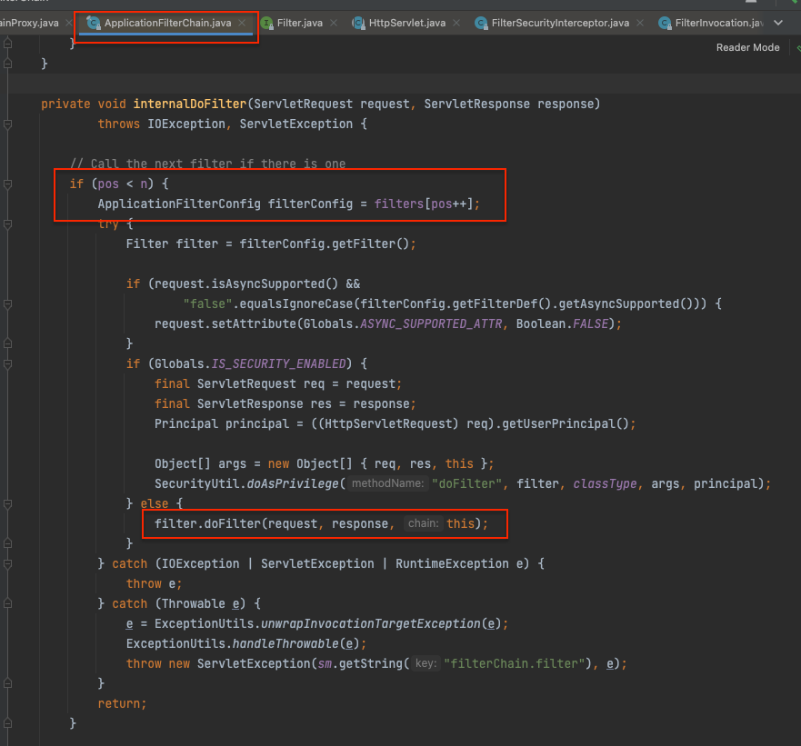
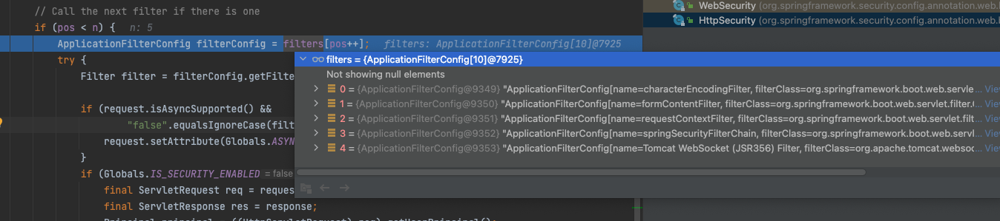
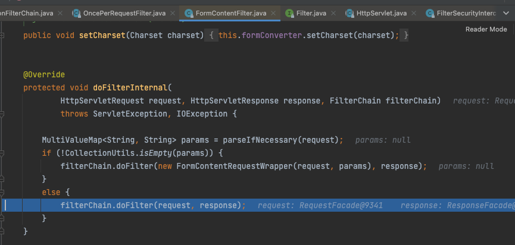

spring security
- Servlet Security, The Big Picture
  - 스프링 시큐리티는 서블릿 Filter를 기반으로 서블릿을 지원
    - 스프링 mvc 어플리케이션의 Sevlet은 DispatcherServlet. 요청이 들어오면 그 앞에 Filter셋팅된 Filter들을 타게되고 마지막 DispatcherServlet을 타게됨
      - Filter들과 Servlet까지 포함된걸 FilterChain 이라 부른다
      - 단일 HttpServletRequest와 HttpServletResponse 처리는 최대한 한개의 Servlet이 담당
    - Filter는 여기서 다음과 같은 역할
      - 다운스트림의 Servlet과 여러 Filter의 실행을 막음
        - 이때, Filter에서 HttpServletResponse를 생성
      - 다운스트림의 Servlet과 여러 Filter로 HttpServletRequest 또는 HttpServletResponse를 수정
  - DelegatingFilterProxy
    - Spring에서 등록한 Security관련 Filter들을 서블릿이 인지하고 수행을 하여야할텐데, 이를 이어주는 역할이 DelegatingFilterProxy
    - DelegatingFilterProxy 내부에는 ApplicationContext가 있고, ApplicationContext를 통해서 전달받은 bean name에 맞는 Filter를 가져와서 대리자로 셋팅해놓음(security에서는 springSecurityFilterChain 라는 이름의 Filter)를 가지고있게된다.
    - 그래서 DelegatingFilterProxy 실행시 FilterChainProxy를 호출하게되고, FilterChainProxy(빈 이름은 springSecurityFilterChain) 내부에는 security 관련한 빈들(SecurityFilterChain 구현체들)을 실행하게된다. 이 Filter(SecurityFilterChain)들이 security 로직을 담고있는 빈들.
    - 즉, 여기까지 security 빈을 호출하기까지 DelegatingFilterProxy -> FilterChainProxy 두번의 프록시를 거치고 수행됨
    <!-- - 그렇기에, DelegatingFilterProxy 내부에는 ApplicationContext가 있고, ApplicationContext를 통해서 Spring에 빈으로 등록되어진 FilterChainProxy(대리자역할, 빈 이름은 springSecurityFilterChain)를 가져와 수행한다
      - 여기 FilterChainProxy에 많은 필터들이 등록되어있음 -->
    - 참고사항
      - DelegatingFilterProxy는 Servlet에 등록된 여러 Filter중 하나 (아래 사진 참고)
        -  
      - 위 사진에서보면 4번째인걸 확인할수 잇는데, 4번째에 있는 DelegatingFilterProxy가 수행되면서 내부적으로 본격적인 spring security filter 들이 수행된다
        - 
  - SecurityFilterChain
    - FilterChainProxy에는 여러개 SecurityFilterChain이 있을 수 있는데, 어떤 SecurityFilterChain을 사용할지는 SecurityFilterChain에 셋팅되어있는 RequestMatcher 를 통해서 정하게 된다 (기본적으로 DefaultSecuiryFilterChain을 만들어준다)
      - 
        - 만약 위의 security 필터를 제외하고자할때는 아래와 같은 설정을 셋팅할 수 있는데, 경로 하나당 SecurityFilterChain(DefaultSecuiryFilterChain)을 생성하고 어떤 Filter도 등록되어있지않도록 만들어버린다
    - 특정 url 제외하고싶을때..
      ```java
        @Bean
        public WebSecurityCustomizer webSecurityCustomizer(){
            return web -> {
                web.ignoring()
                        .antMatchers(
                                "/error/**",
                                "/abc/erf",
                              );
            };
        }

        /* 
        위와 같이 등록하면, WebSecurity에서 ignoredRequests로 등록되어, ignoredRequests에 셋팅된 경로들을 기반으로 만들어진 RequestMatcher를 가진 DefaultSecuiryFilterChain를 만든다. 그리고 DefaultSecuiryFilterChain 에는 아무런 filter도 등록되어있지않게된다. 그리고 WebSecurity에서 FilterChainProxy에 들어갈 securityFilterChains들을 만드는데, ignoreRequests가 등록된 DefaultSecurityFilterChain을 list에 먼저넣음으로써, 제외할 url 요청이 들어오면 security filter는 더이상 타지않고 넘어가게되는 구조로 되어있다

        자세한 소스는 WebSecurity.performBuild() 에서 확인가능
        
        */

      ```

- 내용이해한거 간단정리 (추후 추가 정리 필요)
  - filter들을 다 태우고 sevlet(dispatcherServlet)을 실행시키는데, dispatcherSerlvet에서 예외던지면 filter는 어떻게 잡을 수 잇을까?
    - 
      - 
      - 
      - ApplicationFilterChain에서 servlet(DispatcherServlet)을 가지고있고, filters 배열에 있는 ApplicationFilterConfig의 filter를 모두 다 태우고 난뒤에 DispatcherSerlvet을 실행한다(여기 캡쳐에서는 안보임)
      - 여기서 filter를 그냥 루프돌린뒤에 다음 실행으로 넘어가지 않는것을 주의해서 봐야한다. 가령, 특정 filter에서 exception이 떨어지면 앞서 진행했던 filter가 잡아주어 기존 filter의 결과에 따라 적절한 처리를 해줄 수 있게해주어야하는데, 이러한 구현을 위의 코드를 보고 확인할 수 있다. 
      - 핵심은 `filter.doFilter(request, response, this);` 인데 여기서 나 자신인 ApplicationFilterChain을 넘겨주어 filter 작업을 끝낸 이후 다시 `filterChain.doFilter(request, response)` 를 호출해준다.(위의 캡쳐에서 FormContentFilter에서 호출해주고 잇음을 볼 수 있다) 
      - 이러한 방법(재귀인데 내가 알던 보통 재귀랑은 좀 다른느낌)을 통해서 servlet을 호출했을때에도 servlet에서 예외가 떨어질때 적절히 filter에서 잡아주어 특정 작업을 수행할 수 있다 (참고로 등록된 filters 배열을 다 수행하고 다음 로직으로 내려가면 DispatcherServlet을 실행하는 로직이 있다)
    
  - ExceptionTranslationFilter 는 AccessDeniedException 및 AuthenticationException 처리를 해주는데, 이전 Filter(ex. bearer토큰 인증하는 filter(BearerTokenAuthenticationFilter)) 에서 예외난것들(AccessDeniedException 및 AuthenticationException)을 잡아주진않는다. 어찌보면 당연히 불가능한것이 ExceptionTranslationFilter 필터보다 BearerTokenAuthenticationFilter가 앞서 등록되어있기때문이다. 그래서 BearerTokenAuthenticationFilter에서는 별도로 authenticationEntryPoint 를 가지고있고, 해당 필터에서 예외떨어지면 authenticationEntryPoint 에서 적절한 응답으로 반환해준다. 
    - authenticationEntryPoint 는 클라이언트의 credential을 요청하는 HTTP 응답을 보낼때 사용한다. 로그인 페이지로 리다이렉트를 해주거나, WWW-Authenticate 헤더로 응답하는 등의 일을 담당
- 참고사이트
  - https://godekdls.github.io/Spring%20Security/servletsecuritythebigpicture/


---
- 내가 이걸로 뭘 알고 싶은가?
- 