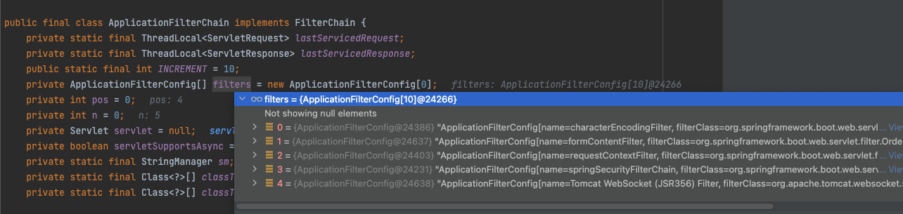
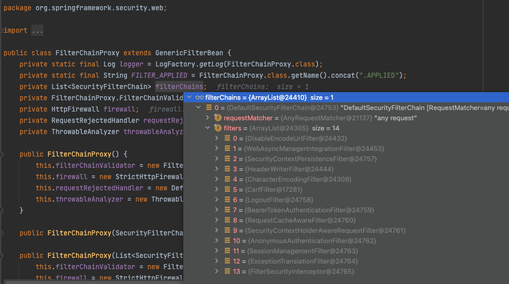
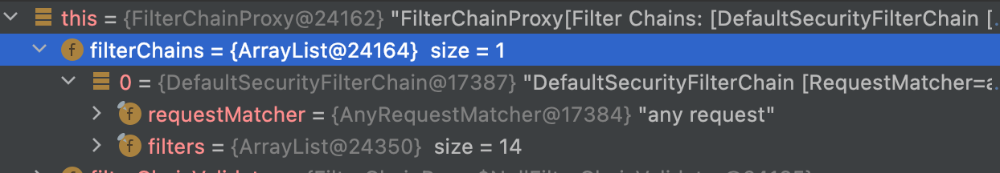

spring security
- Servlet Security, The Big Picture
  - 스프링 시큐리티는 서블릿 Filter를 기반으로 서블릿을 지원
    - 스프링 mvc 어플리케이션의 Sevlet은 DispatcherServlet. 요청이 들어오면 그 앞에 Filter셋팅된 Filter들을 타게되고 마지막 DispatcherServlet을 타게됨
      - Filter들과 Servlet까지 포함된걸 FilterChain 이라 부른다
      - 단일 HttpServletRequest와 HttpServletResponse 처리는 최대한 한개의 Servlet이 담당
    - Filter는 여기서 다음과 같은 역할
      - 다운스트림의 Servlet과 여러 Filter의 실행을 막음
        - 이때, Filter에서 HttpServletResponse를 생성
      - 다운스트림의 Servlet과 여러 Filter로 HttpServletRequest 또는 HttpServletResponse를 수정
  - DelegatingFilterProxy
    - Spring에서 등록한 Security관련 Filter들을 서블릿이 인지하고 수행을 하여야할텐데, 이를 이어지는 역할이 DelegatingFilterProxy
    - 그렇기에, DelegatingFilterProxy 내부에는 ApplicationContext가 있고, ApplicationContext를 통해서 Spring에 빈으로 등록되어진 FilterChainProxy(대리자역할, 빈 이름은 springSecurityFilterChain)를 가져와 수행한다
      - 여기 FilterChainProxy에 많은 필터들이 등록되어있음
    - 참고사항
      - DelegatingFilterProxy는 Servlet에 등록된 여러 Filter중 하나 (아래 사진 참고)
        -  
      - 위 사진에서보면 4번째인걸 확인할수 잇는데, 4번째에 있는 DelegatingFilterProxy가 수행되면서 내부적으로 본격적인 spring security filter 들이 수행된다
        - 
  - SecurityFilterChain
    - FilterChainProxy에는 여러개 SecurityFilterChain이 있을 수 있는데, 어떤 SecurityFilterChain을 사용할지는 SecurityFilterChain에 셋팅되어있는 RequestMatcher 를 통해서 정하게 된다 (기본적으로 DefaultSecuiryFilterChain을 만들어준다)
      - 
    - 특정 url 제외하고싶을때..
      ```java
        @Bean
        public WebSecurityCustomizer webSecurityCustomizer(){
            return web -> {
                web.ignoring()
                        .antMatchers(
                                "/error/**",
                                "/abc/erf",
                              );
            };
        }

        /* 
        위와 같이 등록하면, WebSecurity에서 ignoredRequests로 등록되어, ignoredRequests에 셋팅된 경로들을 기반으로 만들어진 RequestMatcher를 가진 DefaultSecuiryFilterChain를 만든다. 그리고 DefaultSecuiryFilterChain 에는 아무런 filter도 등록되어있지않게된다. 그리고 WebSecurity에서 FilterChainProxy에 들어갈 securityFilterChains들을 만드는데, ignoreRequests가 등록된 DefaultSecurityFilterChain을 list에 먼저넣음으로써, 제외할 url 요청이 들어오면 security filter는 더이상 타지않고 넘어가게되는 구조로 되어있다

        자세한 소스는 WebSecurity.performBuild() 에서 확인가능
        
        */

      ```
      
- 참고사이트
  - https://godekdls.github.io/Spring%20Security/servletsecuritythebigpicture/