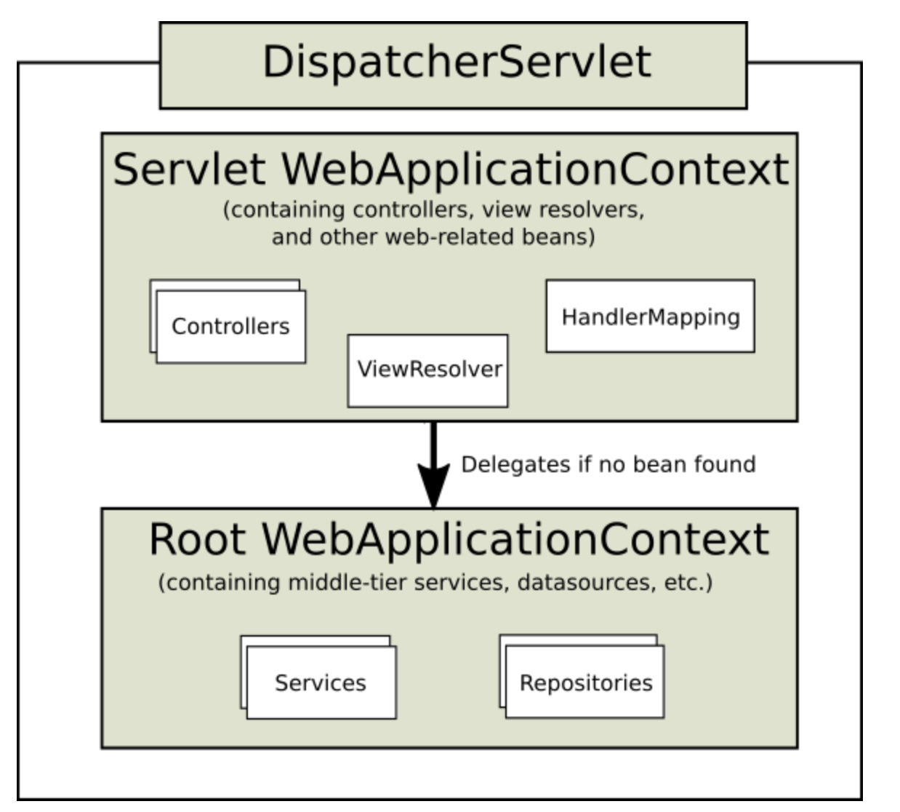

DispatcherServlet
- 서블릿인데, 설정 가능한 대리자 컴포넌트에 의해서 실제 작업이 처리되도록 만든 알고리즘인 front controller 패턴을 사용
  - 즉, 디스패처서블릿 한곳에서 받아서 설정된 컴포넌트에게 위임하여 실제 작업을 수행하는 구조
- DispatcherServlet은 Spring 구성을 사용하여 handlerMapping, HandlerAdapter, HandlerExceptionResolver, ViewResolver 등 필요한 대리자 컴포넌트(구현체들)를 선택해서 사용
- 일반적으로 Servlet 컨테이너의 라이프사이클에서 훅을 통해 스프링 컨테이너를 등록하게되는데, 스프링부트같은 경우는 스프링 설정을 사용해서 자신과 내장서블릿 컨테이너를 사용하게된다.(스프링부트에서 자동구성을 활용하여 내장 서블릿컨테이너를 직접 생성) 그래서 Filter와 Servlet 같은것을 등록시에 빈으로 등록되어있으면, 알아서 서블릿 컨테이너에 등록이 된다!
  - [자세한 내용 참고](https://docs.spring.io/spring-boot/docs/current/reference/htmlsingle/#boot-features-embedded-container)
- 1.1.1. Context Hierarchy
  - DispatcherServlet은 WebApplicationContext를 가지고있다.(ApplicationContextAware을 상속하고있음) 그리고 WebApplicationContext는 ServletContext를 가져올 수 있다. 그리고 RequestContextUtils의 정적 메서드를 통해서 WebApplicationContext를 가져올 수 있다. (무튼 WebApplicatinContext는 ServletContext에 접근가능하고, DispatcherServlet은 ApplicationContext에 접근가능.. 필요하면 어디서나 접근가능하다.. 심지어 컨트롤러와 같은 빈에서도 RequestContextUtils의 정적메서드를 통해서 모두 접근가능하다)
  - DispatcherServlet에서 하나의 WebApplicationContext를 가지고 사용해도 문제될건 없지만, ApplicationContext의 계층구조를 사용하여 관리하는 빈들을 나눌수도 있다 (web.xml에 servlet-context.xml과 applicationContext.xml 이렇게 두개가 등록되어있는 이유..)
    - Root WebApplicationContext는 비지니스 로직을 담고있는 서비스나 data repository 같은게 있는곳(공유할만한 것들)이고, Servlet WebApplicationContext 같은 경우 컨트롤러나, 뷰 등 웹과 관련된 빈들을 등록해놓는다
      - Root WebApplicationContext와 Servlet WebApplicationContext 는 계층구조로 되어있는데, Servlet WebApplicationContext에서 찾지못한 빈이 있따면 Root WebApplicationContext 에서 찾게된다. 물론 반대는 불가
    - 

- 1.1.2. Special Bean Types
  - Special Bean은 DispatcherServlet이 요청을 처리하고 응답을 렌더링하기위해 스프링에서 기본으로 제공해주는 프레임워크 규약들(mvc 프레임워크를 사용하기위해 반드시 있어야하는 인터페이스 및 구현체들 정도로 이해하면될듯?)인데, 기본적으로 내장되어있는것 외에도 커스텀하게 추가하거나 대체할 수 있다
  - 종류
    - HandlerMapping
      - 들어온 Request를 handler에 맵핑해주는 역할인데, 핸들러의 전처리와 후처리를 진행하는 interceptor들도 같이 맵핑해준다. HandlerMapping의 구현체에 따라 어떤 기준으로 맵핑하는지를 알 수 있다
      - 대표적으로 RequestMappingHandlerMapping(@RequestMapping 선언과 연결됨), SimpleUrlHandlerMapping(URI path pattern을 명시적으로 등록한것과 연결, 특정 uri는 어떤 controller와 맵핑이다~ 설저에 명시)이 있음
    - HandlerAdapter
      - HandlerAdapter를 통해서 DispatcherServlet은 어떤 Handler든 상관없이 요청에 맞는 Handler를 실행시킬 수 있음. DispatcherServlet은 추상화된 HandlerAdpater로 Handler를 실행시킴으로써, 역할은 끝. Handler에 따라 어떻게 실행시켜야하는지를 DispatcherServlet이 신경쓰지않도록 만든것! 예를들어, 요청에 맵핑된 Handler가 RequestMappingHandlerMapping가 만들어준 HandlerMethod일때(항상 HandlerMethod가 아님.. HandlerMapping이 어떤거냐에따라 다를수잇음) 여러 HandlerAdapter중 RequestMappingHandlerAdapter가 아래와같은 로직을 통해서 선정이되고, 이를 통해서 handlerMethod를 실행하게된다. 그리고 HandlerAdpater 내부에는 수많은 어노테이션들을 활용한 정보들을 resolving 해주는 로직들이 들어있다.. (그래서 DispatcherServlet은 그냥 호출만할뿐, HandlerAdapter가 구체적으로 어떤놈인지 신경 안써도됨.. => 전략 패턴!!)
      ```java
        // DispatcherServlet 내부의 핸들러 가져오는 매서드

        protected HandlerAdapter getHandlerAdapter(Object handler) throws ServletException {
          if (this.handlerAdapters != null) {
            for (HandlerAdapter adapter : this.handlerAdapters) {
              if (adapter.supports(handler)) {
                return adapter;
              }
            }
          }
          throw new ServletException("No adapter for handler [" + handler +
              "]: The DispatcherServlet configuration needs to include a HandlerAdapter that supports this handler");
        } 
      ```
    - HandlerExceptionResolver
      - 예외해결을 위한 전략
    - ViewResolver
    - LocaleResolver, LocaleContextResolver
    - ThemeResolver
    - MultipartResolver
    - FlashMapManager


-공식문서 + 코드보면서
  -requestMapping, resquestHandler 정리
  -서블릿 비동기는 어떻게 동작하는가?
  -DispatcherServlet
    -json body(@RequestBody)는 messageConverter를 사용하나?