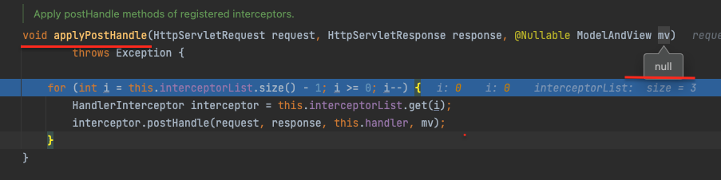

DispatcherServlet
- 서블릿인데, 설정 가능한 대리자 컴포넌트에 의해서 실제 작업이 처리되도록 만든 알고리즘인 front controller 패턴을 사용
  - 즉, 디스패처서블릿 한곳에서 받아서 설정된 컴포넌트에게 위임하여 실제 작업을 수행하는 구조
- DispatcherServlet은 Spring 구성을 사용하여 handlerMapping, HandlerAdapter, HandlerExceptionResolver, ViewResolver 등 필요한 대리자 컴포넌트(구현체들)를 선택해서 사용
- 일반적으로 Servlet 컨테이너의 라이프사이클에서 훅을 통해 스프링 컨테이너를 등록하게되는데, 스프링부트같은 경우는 스프링 설정을 사용해서 자신과 내장서블릿 컨테이너를 사용하게된다.(스프링부트에서 자동구성을 활용하여 내장 서블릿컨테이너를 직접 생성) 그래서 Filter와 Servlet 같은것을 등록시에 빈으로 등록되어있으면, 알아서 서블릿 컨테이너에 등록이 된다!
  - [자세한 내용 참고](https://docs.spring.io/spring-boot/docs/current/reference/htmlsingle/#boot-features-embedded-container)
- 1.1.1. Context Hierarchy
  - DispatcherServlet은 WebApplicationContext를 가지고있다.(ApplicationContextAware을 상속하고있음) 그리고 WebApplicationContext는 ServletContext를 가져올 수 있다. 그리고 RequestContextUtils의 정적 메서드를 통해서 WebApplicationContext를 가져올 수 있다. (무튼 WebApplicatinContext는 ServletContext에 접근가능하고, DispatcherServlet은 ApplicationContext에 접근가능.. 필요하면 어디서나 접근가능하다.. 심지어 컨트롤러와 같은 빈에서도 RequestContextUtils의 정적메서드를 통해서 모두 접근가능하다)
  - DispatcherServlet에서 하나의 WebApplicationContext를 가지고 사용해도 문제될건 없지만, ApplicationContext의 계층구조를 사용하여 관리하는 빈들을 나눌수도 있다 (web.xml에 servlet-context.xml과 applicationContext.xml 이렇게 두개가 등록되어있는 이유..)
    - Root WebApplicationContext는 비지니스 로직을 담고있는 서비스나 data repository 같은게 있는곳(공유할만한 것들)이고, Servlet WebApplicationContext 같은 경우 컨트롤러나, 뷰 등 웹과 관련된 빈들을 등록해놓는다
      - Root WebApplicationContext와 Servlet WebApplicationContext 는 계층구조로 되어있는데, Servlet WebApplicationContext에서 찾지못한 빈이 있따면 Root WebApplicationContext 에서 찾게된다. 물론 반대는 불가
    - 

- 1.1.2. Special Bean Types
  - Special Bean은 DispatcherServlet이 요청을 처리하고 응답을 렌더링하기위해 스프링에서 기본으로 제공해주는 프레임워크 규약들(mvc 프레임워크를 사용하기위해 반드시 있어야하는 인터페이스 및 구현체들 정도로 이해하면될듯?)인데, 기본적으로 내장되어있는것 외에도 커스텀하게 추가하거나 대체할 수 있다
  - 종류
    - HandlerMapping
      - 들어온 Request를 handler에 맵핑해주는 역할인데, 핸들러의 전처리와 후처리를 진행하는 interceptor들도 같이 맵핑해준다. HandlerMapping의 구현체에 따라 어떤 기준으로 맵핑하는지를 알 수 있다
      - 대표적으로 RequestMappingHandlerMapping(@RequestMapping 선언과 연결됨), SimpleUrlHandlerMapping(URI path pattern을 명시적으로 등록한것과 연결, 특정 uri는 어떤 controller와 맵핑이다~ 설저에 명시)이 있음
        - 정적파일들은 SimpleUrlHandlerMapping에서 처리
    - HandlerAdapter
      - HandlerAdapter를 통해서 DispatcherServlet은 어떤 Handler든 상관없이 요청에 맞는 Handler를 실행시킬 수 있음. DispatcherServlet은 추상화된 HandlerAdpater로 Handler를 실행시킴으로써, 역할은 끝. Handler에 따라 어떻게 실행시켜야하는지를 DispatcherServlet이 신경쓰지않도록 만든것! 예를들어, 요청에 맵핑된 Handler가 RequestMappingHandlerMapping가 만들어준 HandlerMethod일때(항상 HandlerMethod가 아님.. HandlerMapping이 어떤거냐에따라 다를수잇음) 여러 HandlerAdapter중 RequestMappingHandlerAdapter가 아래와같은 로직을 통해서 선정이되고, 이를 통해서 handlerMethod를 실행하게된다. 그리고 HandlerAdpater 내부에는 수많은 어노테이션들을 활용한 정보들을 resolving 해주는 로직들이 들어있다.. (그래서 DispatcherServlet은 그냥 호출만할뿐, HandlerAdapter가 구체적으로 어떤놈인지 신경 안써도됨.. => 전략 패턴!!)
      ```java
        // DispatcherServlet 내부의 핸들러 가져오는 매서드

        protected HandlerAdapter getHandlerAdapter(Object handler) throws ServletException {
          if (this.handlerAdapters != null) {
            for (HandlerAdapter adapter : this.handlerAdapters) {
              if (adapter.supports(handler)) {
                return adapter;
              }
            }
          }
          throw new ServletException("No adapter for handler [" + handler +
              "]: The DispatcherServlet configuration needs to include a HandlerAdapter that supports this handler");
        } 
      ```
    - HandlerExceptionResolver
      - 예외해결을 위한 전략
      - DispatcherServlet에서 예외처리를 해주는곳은 하나!
        - `processDispatchResult` 메서드에서 handler에서 exception을 전달해주었다면 예외해결를 처리하는 전략들을 사용하여 예외를 처리
    - ViewResolver
      - 응답에 맞는 적절한 뷰를 찾아주고 랜더링해주는 전략
    - LocaleResolver, LocaleContextResolver
      - 국제화된 뷰를 제공해줄 수 있도록, 클라이언트가 사용중인 타임존 같은 경우를 제공
    - ThemeResolver
      - 이를 활용하여, 개인화된 레이아웃 등을 제공해줄수있다
    - MultipartResolver
      - 브라우저에서 파일 업로드 같은 mult-part 요청시에 파싱하는것에 대한 추상화
    - FlashMapManager
      - FlashMap을 저장하고 가져오고 하는데 도와주는놈인데, FlashMap은 session을 사용하기위함. 즉, 하나의 요청에서 정보를 저장해두었다가 다른 요청시 그 요청이 이전 요청과 연계되어있을 수 있도록 해줌 (값을 저장하여..)

- 1.1.3. Web MVC Config
  - 앞서 위에서 이야기한 Special Bean Types 들의 구현체들이 필수적으로 있어야하는데, DispatcherServlet은 WebApplicationContext에서 해당 빈들을 찾지못하면, DispatcherServlet.properties에 정의된 기본 유형으로 셋팅이 된다
- 1.1.4. Servlet Config
  - 
- 1.1.5. Processing
  - DispatcherServlet은 아래와 같은 순서로 진행
      1. WebApplicationContext를 요청에 바운드 (컨트롤러나 다른 요소에서 사용할수있도록..)
         - `DispatcherServlet.WEB_APPLICATION_CONTEXT_ATTRIBUTE`로 바운딩됨
      2. locale resolver를 요청에 바운드
         - 뷰 랜더링, 데이터 준비 등등에서 사용
         - 필요없으면 안써도됨
      3. theme resolver를 요청에 바운드
      4. multipart file resolver를 지정해놓았을때, multipart 요청이 들어오게되면 MutlipartHttpservletRequest로 감싸서 전달해준다
      5. 적절한 핸들러를 찾고, 만약 핸들러를 찾으면 전처리, 후처리, 컨트롤러들과 같은것들을 조합하여 실행 체인을 만들게된다. 그리고 이런 일련의 처리들을 통해 뷰에서 랜더링할 model을 만든다
         - 대신, 어노테이션을 사용한 컨트롤러는 뷰를 리턴해주는대신, HandlerAdpater를 통해서 이미 랜더링된 응답을 전달할 수 있다
         - @ResponseBody의 경우 `ModelAndView` 객체가 null로 리턴..
      6. 모델이 리턴되면, 뷰가 랜더링을 진행. 만약 모델이 리턴되지않는다면, 요청이 이미 처리되었다고 생각되어, 뷰 랜더링이 진행되지않는다
  - HandlerExceptionResolver를 통해서 예외를 처리
  - Http 캐싱도 가능한데, WebRequest.checkNotModified 를 사용함
    - [캐싱관련 자세한내용](https://docs.spring.io/spring-framework/docs/5.3.26/reference/html/web.html#mvc-caching-etag-lastmodified)
- [1.1.6. Path Matching](https://docs.spring.io/spring-framework/docs/5.3.26/reference/html/web.html#mvc-handlermapping-path)
  - 잘 이해안감.. 추구 다시보자
- 1.1.7. Interception
  - 모든 HandlerMapping은 handler interceptor들을 지원
    - handler interceptor는 `HandlerInterceptor`를 통해서 아래 3가지를 구현해야하는데, 이를 통해서 전처리, 후처리 등에서 수행할수있는 작업 가능
      - preHandle(..): Before the actual handler is run
        - true가 리턴될 경우, execution chain이 지속적으로 수행.
        - false가 리턴될 경우, DispatcherServlet은 요청을 모두 처리되었다고 간주해서, 더이상 execution chain을 수행하지않는다
      - postHandle(..): After the handler is run
        - HandlerAdpater를 통해서 @ResponseBody나 ResponseEntity에서 response가 이미 처리되었다면 해당 메서드는 크게 의미없음..
        - 왜냐하면, 응답이 이미 HandlerAdapter에서 만들어졌기때문에 추가적으로 응답에 대해서 수정하거나 추가하는게 의미없기때문
        - @ResponseBody를 사용해서 응답값을 이미 만들어버렸으면, HandlerAdapter가 응답시 ModelAndView를 null로 리턴해주기때문에 의미가 없음..
          - 
        - 그럴 경우에는 `ResponseBodyAdvice`를 구현하여 `@ControllerAdvice`로 선언하게되면, RequestResponseBodyMethodProcessor(RequestMappingHandlerAdapter에서 가지고있는놈)에서 응답을 랜더링할때 ResponseBodyAdivce 구현체를 실행시켜준다. 
          - 그래서 HandlerAdpater에서 응답을 만들어주는 대상은 이런식으로 일괄적으로 조작가능하다 
      - afterCompletion(..): After the complete request has finished
- 1.1.8. Exceptions
  - 요청핸들러 내부에서 혹은 요청 맵핑중에 발생한 에러는 DispatcherServlet이 HandlerExceptionResolver 빈들을 가지고있는 chain에 위임한다.
  - HandlerExceptionResolver 빈들은 아래와 같다
    - SimpleMappingExceptionResolver
      - 예외클래스이름과 에러뷰이름간에 맵핑해줌
    - DefaultHandlerExceptionResolver
      - 스프링 MVC에서 유발된 예외를 처리하고 적절한 상태코드로 변경해줌
      - ResponseEntityExceptionHandler(추상클래스)를 사용해서 따로 커스텀하게 사용하는게 좋음
    - ResponseStatusExceptionResolver
      - @ResponseStatus 어노테이션 달린 예외를 처리. 여기에 셋팅된 값으로 Http status code를 셋팅해줌
    - ExceptionHandlerExceptionResolver
      - @Controller내에 @ExceptionHandler가 선언된 메서드 또는 @ControllerAdivce가 선언된 클래스를 통해 예외를 처리할 수 있도록 해줌
  - 기본적으로 ExceptionHandlerExceptionResolver, ResponseStatusExceptionResolver, DefaultHandlerExceptionResolver 요런 순서로 구성됨
  - Container Error Page
    - HandlerExceptionResolver 여기서 예외를 적절히 해결되지못하여 서블릿 컨테이너로 전파되거나, 응답 상태가 4xx, 5xx 로 셋팅되어있다면, 서블릿 컨테이너는 내장되어있는 디폴트 에러 페이지(HTML)로 랜더링한다. 
    - 이를 커스터마이징 하기위해서는 web.xml 에서 특정 경로(ex. /error)로 맵핑하도록 셋팅할 수 있는데, 해당 경로로 다시 DispatcherServlet에 요청(ex. /error)을 보내는것이다. 그러므로 당연히 해당 경로를 받을 수 있는 Controller를 만들어주어야한다!
- [1.1.9. View Resolution](https://docs.spring.io/spring-framework/docs/5.3.26/reference/html/web.html#mvc-viewresolver)
  - 필요하면 찾아보자
  - redirect vs forward
    - redirect will respond with a 302 and the new URL in the Location header; the browser/client will then make another request to the new URL.
    - forward happens entirely on a server side. The Servlet container forwards the same request to the target URL; the URL won’t change in the browser.
    - [출처](https://www.baeldung.com/spring-redirect-and-forward)
