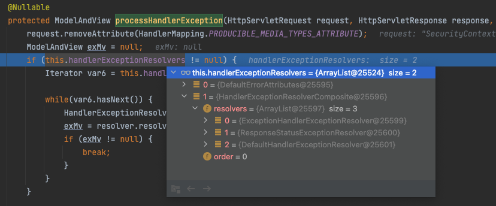
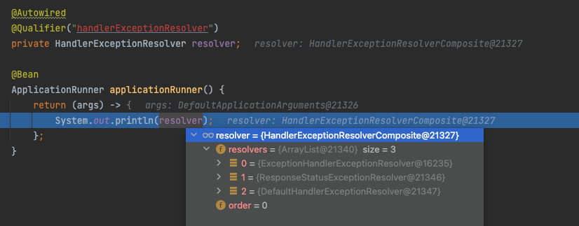

예외처리

- 아래 내용 너무 좋음 예외관련 개발시 참고하기 좋음
  - [Spring 스프링의 다양한 예외 처리 방법(ExceptionHandler, ControllerAdvice 등) 완벽하게 이해하기 - (1/2)](https://mangkyu.tistory.com/204)
  - [Spring @RestControllerAdvice를 이용한 Spring 예외 처리 방법 - (2/2)](https://mangkyu.tistory.com/205)
- ControllerAdivce는 어떻게 예외를 잡나?
  - 간단하게 정리하면, DispatcherServlet에서 doDispatch 메서드가 실행시 발생한 에러는 DispatcherServlet의 에러처리 기본전략에 따라 handlerExceptionResolvers 들을 수행하게되는데, 이때, ExceptionHandlerExceptionResolver 에 등록된 ControllerAdvice들을 사용하여 예외를 처리하게된다
  - 아래 코드로 흐름을 보자
    ```java
      // DispatcherServlet 내부

      protected void doDispatch(HttpServletRequest request, HttpServletResponse response) throws Exception {
          // ...

          try {
              try {
                  ModelAndView mv = null;
                  Object dispatchException = null;

                  try {                                                           // try 블럭 내부에서 실질적으로 작업이 이루어짐
                      processedRequest = this.checkMultipart(request);
                      multipartRequestParsed = processedRequest != request;
                      mappedHandler = this.getHandler(processedRequest);
                      if (mappedHandler == null) {
                          this.noHandlerFound(processedRequest, response);
                          return;
                      }

                      HandlerAdapter ha = this.getHandlerAdapter(mappedHandler.getHandler());
                      String method = request.getMethod();
                      boolean isGet = HttpMethod.GET.matches(method);
                      if (isGet || HttpMethod.HEAD.matches(method)) {
                          long lastModified = ha.getLastModified(request, mappedHandler.getHandler());
                          if ((new ServletWebRequest(request, response)).checkNotModified(lastModified) && isGet) {
                              return;
                          }
                      }

                      if (!mappedHandler.applyPreHandle(processedRequest, response)) {
                          return;
                      }

                      mv = ha.handle(processedRequest, response, mappedHandler.getHandler());
                      if (asyncManager.isConcurrentHandlingStarted()) {
                          return;
                      }

                      this.applyDefaultViewName(processedRequest, mv);
                      mappedHandler.applyPostHandle(processedRequest, response, mv);
                  } catch (Exception var20) {
                      dispatchException = var20;
                  } catch (Throwable var21) {
                      dispatchException = new NestedServletException("Handler dispatch failed", var21);
                  }

                  this.processDispatchResult(processedRequest, response, mappedHandler, mv, (Exception)dispatchException); // 무조건 여길 타게된다
              } catch (Exception var22) {
                  this.triggerAfterCompletion(processedRequest, response, mappedHandler, var22);
              } catch (Throwable var23) {
                  this.triggerAfterCompletion(processedRequest, response, mappedHandler, new NestedServletException("Handler processing failed", var23));
              }

          } finally {
              if (asyncManager.isConcurrentHandlingStarted()) {
                  if (mappedHandler != null) {
                      mappedHandler.applyAfterConcurrentHandlingStarted(processedRequest, response);
                  }
              } else if (multipartRequestParsed) {
                  this.cleanupMultipart(processedRequest);
              }

          }
      }

      private void processDispatchResult(HttpServletRequest request, HttpServletResponse response, @Nullable HandlerExecutionChain mappedHandler, @Nullable ModelAndView mv, @Nullable Exception exception) throws Exception {
          boolean errorView = false;
          if (exception != null) {                                          // 예외 넘어온게 있으면 여기를 타게됨
              if (exception instanceof ModelAndViewDefiningException) {
                  this.logger.debug("ModelAndViewDefiningException encountered", exception);
                  mv = ((ModelAndViewDefiningException)exception).getModelAndView(); 
              } else {
                  Object handler = mappedHandler != null ? mappedHandler.getHandler() : null;
                  mv = this.processHandlerException(request, response, handler, exception);     // ModelAndViewDefiningException 외에는 다 여기
                  errorView = mv != null;
              }
          }

          if (mv != null && !mv.wasCleared()) {
              this.render(mv, request, response);
              if (errorView) {
                  WebUtils.clearErrorRequestAttributes(request);
              }
          } else if (this.logger.isTraceEnabled()) {
              this.logger.trace("No view rendering, null ModelAndView returned.");
          }

          if (!WebAsyncUtils.getAsyncManager(request).isConcurrentHandlingStarted()) {
              if (mappedHandler != null) {
                  mappedHandler.triggerAfterCompletion(request, response, (Exception)null);
              }

          }
      }

      @Nullable
      protected ModelAndView processHandlerException(HttpServletRequest request, HttpServletResponse response, @Nullable Object handler, Exception ex) throws Exception {
          request.removeAttribute(HandlerMapping.PRODUCIBLE_MEDIA_TYPES_ATTRIBUTE);
          ModelAndView exMv = null;
          if (this.handlerExceptionResolvers != null) {
              Iterator var6 = this.handlerExceptionResolvers.iterator();   // handlerExceptionResolvers 이게 핵심.  아래 "등록된 handlerExceptionResolvers들" 이미지 참고

              while(var6.hasNext()) {
                  HandlerExceptionResolver resolver = (HandlerExceptionResolver)var6.next();
                  exMv = resolver.resolveException(request, response, handler, ex);    // 여기서 ExceptionHandlerExceptionResolver 클래스를 호출하게됨.
                  if (exMv != null) {
                      break;
                  }
              }
          }

          if (exMv != null) {
              if (exMv.isEmpty()) {
                  request.setAttribute(EXCEPTION_ATTRIBUTE, ex);
                  return null;
              } else {
                  if (!exMv.hasView()) {
                      String defaultViewName = this.getDefaultViewName(request);
                      if (defaultViewName != null) {
                          exMv.setViewName(defaultViewName);
                      }
                  }

                  if (this.logger.isTraceEnabled()) {
                      this.logger.trace("Using resolved error view: " + exMv, ex);
                  } else if (this.logger.isDebugEnabled()) {
                      this.logger.debug("Using resolved error view: " + exMv);
                  }

                  WebUtils.exposeErrorRequestAttributes(request, ex, this.getServletName());
                  return exMv;
              }
          } else {
              throw ex;
          }
      }

      //////////////////////////////////////////

      // ExceptionHandlerExceptionResolver 내부

      // ...
      private final Map<ControllerAdviceBean, ExceptionHandlerMethodResolver> exceptionHandlerAdviceCache = new LinkedHashMap(); // 여기에 ControllerAdvice들 저장
      // ...

      protected ModelAndView doResolveHandlerMethodException(HttpServletRequest request, HttpServletResponse response, @Nullable HandlerMethod handlerMethod, Exception exception) {  // 계속해서 해당 메서드가 호출됨
          ServletInvocableHandlerMethod exceptionHandlerMethod = this.getExceptionHandlerMethod(handlerMethod, exception); // 여기서 실행할 ControllerAdvice를 HandlerMethod형태로 가져옴
          if (exceptionHandlerMethod == null) {
              return null;
          } else {
              if (this.argumentResolvers != null) {
                  exceptionHandlerMethod.setHandlerMethodArgumentResolvers(this.argumentResolvers);
              }

              if (this.returnValueHandlers != null) {
                  exceptionHandlerMethod.setHandlerMethodReturnValueHandlers(this.returnValueHandlers);
              }

              ServletWebRequest webRequest = new ServletWebRequest(request, response);
              ModelAndViewContainer mavContainer = new ModelAndViewContainer();
              ArrayList exceptions = new ArrayList();

              try {
                  // ...
                  exceptionHandlerMethod.invokeAndHandle(webRequest, mavContainer, arguments); // ControllerAdvice 실행됨
              } catch (Throwable var13) {
                  if (!exceptions.contains(var13) && this.logger.isWarnEnabled()) {
                      this.logger.warn("Failure in @ExceptionHandler " + exceptionHandlerMethod, var13);
                  }

                  return null;
              }
              //...
          }
      }
    ```
    - 
    
- [baeldung에서 설명](https://www.baeldung.com/spring-security-exceptionhandler)한거보면, DefaultHadnlerExceptionResolver를 사용해서 예외를 처리하면, ControllerAdvice가 잡을 수 있다고 하는데, 이게 어떻게 가능?
  - baeldung 공유 코드
    ```java
      @Component("delegatedAuthenticationEntryPoint")
      public class DelegatedAuthenticationEntryPoint implements AuthenticationEntryPoint {

          @Autowired
          @Qualifier("handlerExceptionResolver")
          private HandlerExceptionResolver resolver;

          @Override
          public void commence(HttpServletRequest request, HttpServletResponse response, AuthenticationException authException) 
            throws IOException, ServletException {
              resolver.resolveException(request, response, null, authException);
          }
      }
    ```
    - 여기서 resolver는 DefaultHadnlerExceptionResolver를 사용하는게아닌, HandlerExceptionREsolverComposite를 가져오게된다. HandlerExceptionREsolverComposite 안에는 3개의 ExcpetionResolver가 등록되어있는데, 그 중 등록된 ExceptionHandlerExceptionResolver가 자신에게 가지고잇는 ControllerAdvice를 사용해서 예외를 처리할 수 있다. DefaultHandlerExceptionResolver에는 ControllerAdvice 내용은 아예 없다. 이는 스프링 기본 예외들을 처리해주고있는곳인데, 만약 ControllerAdvice를 사용하고 그 안에 Exception을 잡는 메서드가 있다면 거기까지 타지 않을것이다..
    - 

- DispatcherServlet에서 mapping되는 대상을 못찾으면, 설정에 따라 NoMapping어쩌구 예외를 던지거나, 에러 코드를 응답하던데, /error는 어떻게 다시 DispatcherServlet요청으로 들어오는것인가..?
  - 부트가 내장 서블릿컨테이너에 등록을한다
  - 아래와 같이 application.yml에 에러 엔드포인트를 어떻게 설정할지도 셋팅가능
    ```yml
      server:
        error:
          path: /err # 서블릿에서 예외를 잡으면 최종적으로 /err 라는 경로를 다시 호출하게됨
    ```
  - `StandardHostValve.invoke` 메서드 실행시 스프링 컨테이너로부터 받은 응답을 아래와 같이 처리하는 부분이 잇는데, response.isErrorReportRequired 를 기준으로 true면 설정된 error 엔드포인트로 포워딩을 수행
    - ControllerAdvice와 같은곳에서 에러를 이미 스프링컨테이너에서 처리하고 응답을 보내면, 이 값이 false가 된다.
    - 좀더 깊게 들어가면, 필터나 DispatcherServlet 같은곳에서 응답에 에러를 전송할때, `(HttpServletResponse)response.sendError`를 호출하는것을 볼 수 있는데, 이때 내부적으로 errorState의 값이 increment하게된다.(1로 증가) 해당 값에 따라 response.isErrorReportRequired 가 해당 errorState가 1이면, true를 반환하고 아니면, false를 리턴해주는데, 예외처리를 하고 응답을 던지면 (즉, response.sendError를 호출하지않으면) 바로 error 페이지 관련 작업을 수행하지않고, 응답을 리턴해주게된다
    - tomcat의 `StandardHostValve.status` 메서드에서 응답 코드에 맞는 예외페이지를 찾고, 없으면 위에 위에 설정한 경로로 다시 요청을 보내게된다. SpringBoot에는 default로 등록된 BasicErrorController 가 이를 받게됨. 그래서 springboot가 기본설정한 응답을 하게된다..
    - 코드상세
      ```java
      // StandardHostValve 내부

      // ...
      if (response.isErrorReportRequired()) {
          AtomicBoolean result = new AtomicBoolean(false);
          response.getCoyoteResponse().action(ActionCode.IS_IO_ALLOWED, result);
          if (result.get()) {
              if (t != null) {
                  this.throwable(request, response, t);
              } else {
                  this.status(request, response); // 여기 내부에서 적절한 errorPage를 찾고 forwarding까지 이루어짐
              }
          }
      }    

      //...

      ```


- csrf 에러 떨어져서 /error 리다이렉트된건 통일 못시키나
  - 결국 /error 를 핸들링할 수 있는 컨트롤러를 만들어서 처리하면 통일되게할 수 있을듯
    - 추가로 "handlerExceptionResolver" 를 받아서 대리자로 활용하면 가능할듯


- 아래 무슨설정인지 확인
```yml
spring:
  web:
    resources:
      add-mappings: false
```
  - SimpleUrlHandlerMapping 안쓰는것. 즉 정적 리소스 파일에 대한 핸들링 없는것. 
  - NoHandlerFoundException 을 유발해야할때 사용.. 기본적으로 SimpleUrlHandlerMapping 매핑경로가 /** 이기때문에 url 요청시 실제 없는 경로인데도 SimpleUrlHandlerMapping이 이를 매칭하게되어, NoHandlerFoundException 예외가 발생하지않게됨. 그래서 처리할수 없는 요청에 대해 NoHandlerFoundException을 발생시키기위해 사용
    - 그런데, 404 not found같은 경우, 그냥 기본 에러처리하는 컨트롤러 구현해도 해결가능 (물론, 다시 서블릿에서 /error 경로로 포워딩되어 상대적으로 성능상 느리긴하겠지만.. 크게 문제될건 없을듯)
    