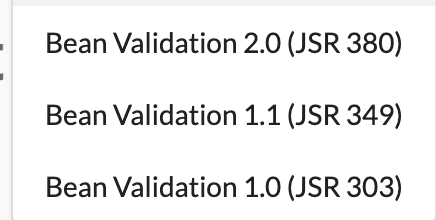

validation정리
- 애플리케이션을 개발할때 데이터를 각 계층에 전달하게되고, 이 데이터는 java bean 형태를 띄게된다. 이 계층이 옮겨다니는 과정에서 해당 bean 생성시에 데이터에 대한 검증이 필요할텐데, 이런 검증 로직을 계층마다 혹은 bean 마다 중복해서 만드는게 아닌, 어노테이션을 활용해서 데이터의 유효성을 검증을 한곳에서 가능케 해주는게 Bean Validation
  - java bean은 엄밀히이야기하면, 아무것도 전달받지않는 생성자가있고, setter와 getter를 통해서 속성을 접근할수있도록 하는건데, validation 진행시 반드시 setter가 필요하진않은듯함
- hibernate-validator는 javabean-validation 스펙의 구현체..
  - 참고로 여기 hibnerate와 ORM은 별개..
- Bean-validation은 아래와 같이 발전중
  - 
    - 위의 버전에 맞추어 각 hibernate-validator(구현체)가 있음
  - 스프링 부트에선 spring-boot-starter-validation 이 프로젝트로 래핑해서 제공해줌
  
- 예시
    ```java
        @NotNull validates that the annotated property value is not null.
        @AssertTrue validates that the annotated property value is true.
        @Size validates that the annotated property value has a size between the attributes min and max; can be applied to String, Collection, Map, and array properties.
        @Min validates that the annotated property has a value no smaller than the value attribute.
        @Max validates that the annotated property has a value no larger than the value attribute.
        @Email validates that the annotated property is a valid email address.
        Some annotations accept additional attributes, but the message attribute is common to all of them. This is the message that will usually be rendered when the value of the respective property fails validation.

        And some additional annotations that can be found in the JSR:

        @NotEmpty validates that the property is not null or empty; can be applied to String, Collection, Map or Array values.
        @NotBlank can be applied only to text values and validates that the property is not null or whitespace.
        @Positive and @PositiveOrZero apply to numeric values and validate that they are strictly positive, or positive including 0.
        @Negative and @NegativeOrZero apply to numeric values and validate that they are strictly negative, or negative including 0.
        @Past and @PastOrPresent validate that a date value is in the past or the past including the present; can be applied to date types including those added in Java 8.
        @Future and @FutureOrPresent validate that a date value is in the future, or in the future including the present.
    ```
- [java validation과 hibernate-validator 설명 굿](https://www.popit.kr/javabean-validation%EA%B3%BC-hibernate-validator-%EA%B7%B8%EB%A6%AC%EA%B3%A0-spring-boot/)
- https://www.baeldung.com/javax-validation
- https://www.baeldung.com/spring-boot-bean-validation