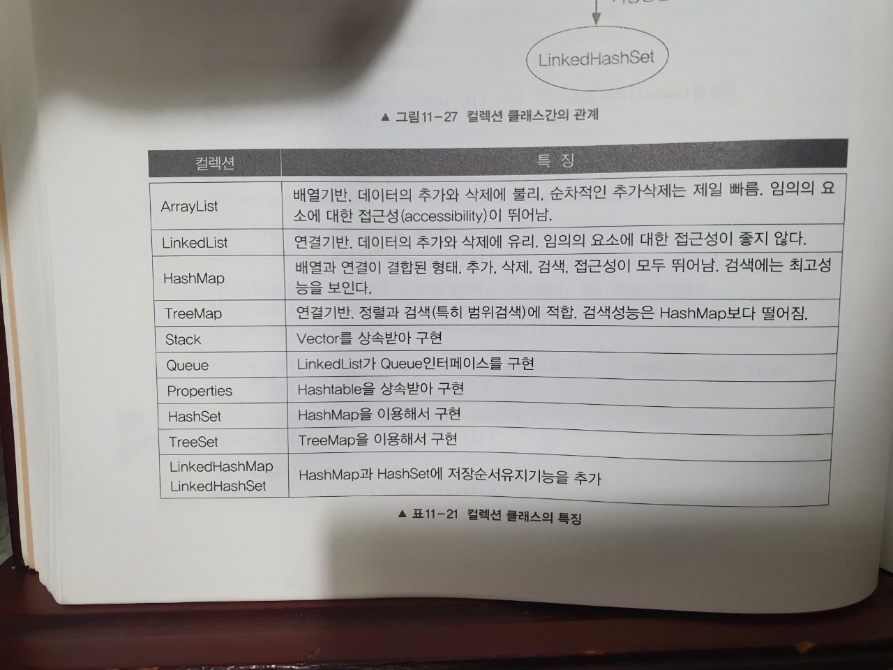

자바의정석_Collection
- 컬렉션 프레임워크
  - 정의
    - 컬렉션 : 다수의 데이터(데이터 그룹)
    - 프레임워크 : 표준화된 프로그래밍 방식(단일화된 구조)
    - 다수의 데이터 그룹을 단일화된 구조의 방식으로 다룰수있도록 해주는 역할!
  - 핵심인터페이스
    - Collection : List와 Set의 공통부분 뽑아낸거
      - List : 순서o, 데이터 중복허용
      - Set : 순서x, 데이터 중복허용x
    - Map : 키(key)와 값(value)의 쌍으로 이루어진 데이터 집합(Entry). 순서는 유지x, 키 중복허용x, 값은 중복 당연가능
      - 여기서 key란 값(value)을 찾는데 열쇠가 된다는 의미에서 붙여진이름! 그렇기에 중복안된다!
  - List
    - ArrayList
      - 데이터 추가시에 내부적으로 배열의 공간이 적으면, 크기를 늘리고 복사하고 등등의 작업이 이루어지기때문에, 이러한 비용을 줄이기위해 미리 충분한 공간을 확보하는것이 좋음
      - 맨 마지막의 요소에 데이터를 삭제하거나 추가하는것은 비용이 거의 안든다고 봐도무방.. 하지만, 중간에 데이터가 삽입되어야하거나 삭제하면 요소들을 copy하는 작업이 있기때문에 비용이 많이듬(데이터가 많이 있을수록 비용증가)
    - LinkedList
      - 배열의 단점을 보완
        - *배열의 단점
          - 크기를 변경해야하면, 새로운 배열을 생성해서 데이터 복사해야함..
          - 비 순차적인 데이터(중간에 넣는데이터..)의 추가 또는 삭제에 시간이 많이 걸림.. 
      - 불연속적으로 존재하는 데이터를 서로 연결한 형태로 구성
      ```java
        class Node{
            Node next;  // 다음 요소의 주소 저장
            Object obj; //데이터
            Node previous; //이전 요소의 주소를 저장(java의 LinkedList는 기본적으로 previous도 포함함 -> 더블링크드리스트)
        }
      ```
      - 추가 or 삭제시 배열을 새로 복제하지않기 때문에 빠름
      - 링크드 리스트 : 다음요소
      - 더블링크드 리스트 : 다음요소 + 이전요소
      - 더블 서큘러링크드 리스트 : 다음요소 + 이전요소 (+첫번째 요소의 이전요소가 마지막요소이며, 마지막요소의 다음요소가 첫번째요소)
     
    - ArrayList vs LinkedList
      - 순차적으로 추가/삭제 하는 경우에는 ArrayList가 LinkedList보다 빠름
        - 참고로 여기서 ArrayList는 capacity를 충분히 설정해놨다는것을 가정.. 또한, 순차적으로 삭제하는것은 마지막 데이터부터 삭제해나간다는것을 의미.. 앞에서부터 순차적 삭제하는것아님!
      - 중간 데이터를 추가/삭제 하는 경우에는 LinkedList가 ArrayList보다 빠름
      - 읽기는 ArrayList가 LinkedList보다 빠름
        - ArrayList는 간단한 수식으로 바로 데이터 접근가능! ***연속적으로 메모리에 저장***되어있기떄문
          - 수식 : 인덱스가 n인 데이터의 주소 = 배열의주소 + n*데이터 타입의 크기
        - LinkedList는 ***불연속적으로 위치한 요소들이 연결***되어있기때문에, n번째 데이터까지 차례대로 찾아들어가야함!
      - => 서로 변환이 가능한점을 활용할것! 즉, 처음에 데이터 저장할때는 ArrayList를 사용하고, 추가삭제의 작업이 빈번한 작업을 진행한다면, LinkedList로 변경해라!
        - Collection은 ***서로 변환이 가능한 생성자***를 지닌다!!
    - STACK vs QUEUE
      - STACK
        - 후입선출이므로, ArrayList가 적합
        - 사용용도는 웹브라우저의 앞으로가기, 뒤로가기(여기서 arrayList 두개사용할것!)
      - QUEUE
        - 선입선출이므로, LinkedList가 적합
          - 선입선출이므로, 맨 앞의 요소가 계속 나가야함.. 그렇다면 앞에 빈 공간 생겼을때, 데이터를 계속 copy해서 옮겨야하는 ArrayList는 적합하지않음
        - 사용용도는 인쇄작업 대기 목록 등
        - PriorityQueue
          - 저장한 순서에 상관없이 우선순위가 높은것부터 꺼내게됨
          - 힙(heap)이라는 자료구조의 형태로저장
            - 힙은 이진트리의 한 종류. 
            - 순서를 가진다는것은, 크기를 비교할수잇는 방법을 제공해야한다는뜻!
            - [힙 자료구조 정리굿](https://gmlwjd9405.github.io/2018/05/10/data-structure-heap.html)
              - 데이터 추가되면 맨 마지막 인덱스에 데이터 추가하고 해당 인덱스를 2로 나눠가면서(즉, 부모 노드와 비교해가면서) 노드의 값을 비교하여 swap해나가는 방식..
          - [우선순위큐 내용정리굿](https://coding-factory.tistory.com/603)
        - Deque(Double-Ended Queue)
          - Queue의 변형으로, 양쪽 끝에 추가/삭제가 가능
          - 조상은 Queue이며, 구현체로는 ArrayDeque, LinkedList 등이 있음
          - 이를 사용하면, 큐뿐만아니라 스택으로도 사용가능하다
    - List 주의사항
      - 제거가 필요하면, 반대로 읽으면서 지울것!
        - 향상된 for문을 사용하면서, for문 안에서 remove를 하면, list 요소의 갯수가 줄어들었기때문에 계속 for문을 돌리면 indexOutOfBoundsException(인덱스로 지울경우) 이 나타남
        - 기존 for문(변수 사용)을 사용하면, 마지막 요소가 remove되는거면 괜찮지만, 그 외의 요소가 지워졌을떄는 정상적으로 remove가 되지않을수있음!
          - 예를들어, 4개의 요소중 3번째 요소가 지워졌다면(i=2), 다음 루프에서 i=3이 되고 list.size()는 3으로 변했기때문에 4번째 요소를 정상적으로 읽지않고 루프를 나가게된다   
        ```java
            for(int i=0;i<list.size();i++){
                if(i==2){
                    list.remove(i); 
                }
            }

            //추가 예제.. 아래4개를 잘 구분할것!

            List<String> list= new ArrayList<>(Arrays.asList("hi","hello","hello"));

            for(int i=0;i<list.size();i++){ //이렇게 만들면 3번째 요소는 그냥 지나감
                String str=list.get(i);
                if(str.equals("hello")){
                    list.remove(i);
                }
            }

            for(Iterator<String> iterator = list.iterator(); iterator.hasNext();){ //정상적으로 삭제됨
                String str=iterator.next();
                if(str.equals("hello")){
                    iterator.remove();
                }
            }

            list.removeIf(str->str.equals("hi")); //위의꺼 한줄로 줄인것.. java8

            for(String s:list){         //ConcurrentModificationException 에러발생.. list의 숫자가 갑자기 변했기때문에 발생.. (근데 조건에 hello로 넣어서 지우면 에러발생안함.. 물론 정상적으로 마지막 데이터는 삭제가안되어있음..)
                if(s.equals("hi")){
                    list.remove(s);
                }
            }

            

        ```
        - 뿐만아니라, list내부적으로 중간에서 지우게되면, 다시 복제하고 합쳐져야하므로 비용이많이들게됨(물론 이것은 arrayList에 한함)
  - Iterator, ListIterator, Enumeration
    - Iterator
      - Iterator는 컬렉션에 저장된 요소를 읽어오기위해 표준화된것!
    - ListIterator
      - Iterator에 양방향 조회기능추가(List를 구현한 경우만 사용가능)
      - Iterator를 상속받아서 기능을 추가한것!
    - Enumeration
      - Iterator의 구버전..
  - Arrays (클래스임)
    - 배열을 다루는데 유용한 메서드 정의
    - 배열의복사
      - copyOf, copyOfRange
    - 배열채우기
      - fill, setAll
    - 배열의 정렬과 검색
      - sort, binarySearch
        - binarySearch는 배열의 데이터가 반드시 정렬되어있어야만 제대로 인덱스를 반환해줌
        - 선형검색보다 매우빠름!
    - 배열의 비교와 출력
      - equals, toString
      - 2차원 이상일때는 deepToString, deepEquals를 사용할것
    - 배열을 List로 변환
      - asList
      - 크기 변경안됨! 즉, 추가삭제 불가.. 내용은 변경가능!
      - 크기 변경하고싶다면 아래와같이 ArrayList로 만들어주면됨
        - ```List list=new ArrayList(Arrays.asList(1,2,3,4,5));```
  - Comparator와 Comparable
    - Comparable
      - 기본 정렬 기준을 구현하는데사용
      - 이를 구현한 클래스는 정렬 가능하다는 뜻
    - Comparator
      - 기본 정렬기준 외에 다른 기준으로 정렬하고자할때 사용
    - 해당 메소드를 오버라이딩할때 리턴값이 int
      - 아래와 같이 설정하면 오름차순으로 정렬됨
        - 내 입장에서 비교하는것보다 내가 작으면 음수 리턴
        - 내 입장에서 비교하는것보다 나와 동일하면 0 리턴
        - 내 입장에서 비교하는것보다 내가 크면 양수 리턴
      - 반대로 정렬하고싶으면 여기에 -1 곱하면됨
    - Arrays.sort로 정렬할때, Comparator를 지정해주지않으면 Comparable에 구현된 내용에 따라 정렬됨
  - Set
    - HashSet
      - 중복x, 순서x
      - 내부적으로 HashMap을 사용
      - 정렬하고싶으면 ArrayList(Collection)나 LinkedList(Collection)으로 변경하여, Collections.sort(List) 하면됨 
      - Hashset의 Add매서드는 새로운 요소를 추가하기전에 기존에 저장된 요소와 같은 것인지 판별하기위해 추가하려는 요소의 hashCode와 equals를 호출하기때문에, 추가하려는 클래스의 해당 매소드를 적절히 오버라이딩 해야한다
        - equals를 재정의하지않으면, 기본적으로 객체의 주소값을 비교함
        - 적절한 hashcode를 만들어주어야함(Objects.hash()를 사용할것을 권함)
          - 실행중인 어플리케이션 내의 동일한 객체에 대해서 여러번 hashCode를 호출해도 동일한 int를 반환해야함
          - equals 메소드를 이용한 비교에 의해서 true를 얻은 두 객체에 대해 각각 hashcode를 호출해서 얻은 결과는 같아야함
            - 만약 equals는 true인데, hashCode가 같지않으면, 새로이 저장함(hashCode로 저장된 요소의 위치를 찾기때문)
          - equals메서드를 호출했을대 false를 반환하는 두 객체는 hashCode 호출에 대해 같은 int를 반환하는 경우가 있어도 괜찮지만, 해싱을 사용하는 컬렉션의 성능을 향상시키기위해서는 다른 int 값을 반환하는것이 좋음
            - 내부적으로 같은 해쉬값이면 LinkedList 자료구조를 사용해서 저장함.. LinkedList 자료구조는 데이터 많이 저장될수록 성능떨어지는건 위에서 이야기했음
    - LinkedHashSet
      - 중복x, 순서o
    - TreeSet
      - 중복x, 순서x (정렬시켜버리므로)
      - 이진검색트리 라는 자료구조의 형태로 데이터를 저장하는 컬렉션 클래스
        - 이전검색트리는 정렬, 검색, 범위검색에 높은 성능을 보이는 자료구조
        - TreeSet은 이진검색트리의 성능을 향상시킨 '레드-블랙 트리'로 구현되어있다함
        ```java
            class TreeNode{
                TreeNode left; //왼쪽 자식노드 (부모노드의 값보다 작은값)
                Object element; //객체를 저장하기 위한 참조변수
                TreeNode right; //오른쪽 자식노드 (부모노드의 값보다보다 큰 값)
            } 
        ```
      - 당연 정렬이 이루어지니깐, TreeSet에 저장되는 객체가 Comparable을 구현하던가, TreeSet에게 Comparator를 제공해서 비교할 방법 알려줘야함
      - 데이터를 순차적으로 저장하지않고, 저장위치를 찾아야하므로 링크드 리스트보다 데이터의 추가/삭제 시간은 더 걸린다
      - 배열이나 링크드리스트에 비해 검색(범위검색)과 정렬기능이 더 뛰어남
      - ***범위검색이 필요하면 TreeSet을 항상 염두할것!(여기서 범위는 인덱스범위가 아니라 값의 범위)***
  - Map
    - HashMap
      - key와 value를 묶어서 하나의 entry로 저장한다는 특징
        - key는 중복허용x, value는 당연 상관없음
      - 해싱을 사용하기때문에 많은 양의 ***데이터를 검색하는데 있어서 뛰어난 성능***을 보인다!
      - HashTable은 옛날꺼.. 굳이 사용x
      - HashMap은 key나 value에 null을 허용한다!(HashTable은 허용x)
      - 해싱과 해시함수
        - 해싱이란 해시함수를 이용해서 데이터를 저장하고 검색하는 기법을 이야기함
        - Hashing을 통해 배열주소를 만들어내고 배열에 저장되는 Node는 LinkedList로 데이터를 저장한다(Map.Entry를 구현한 Node를 보면, 다음 Node의 주소를 저장하도록 되어있음-LinkedList)
        ```java
            public class HashMap<K,V> extends AbstractMap<K,V> implements Map<K,V>, Cloneable, Serializable {
                /.../
                static class Node<K,V> implements Map.Entry<K,V> {
                    final int hash;
                    final K key;
                    V value;
                    Node<K,V> next;
                }
                /.../
            }
        ```
        - Hashing을 구현하는 과정에서 제일 중요한것은 해시함수의 알고리즘이고, 중복되지않을수록 좋은 성능을 발휘할수있다. 또한 세부적으로 나뉜다는것은 그만큼 배열이 크게 만들어진다는것이고, 이는 메모리에 차지하는게 많아진다는것을 의미한다. 결국 메모리를 얼마나 사용하느냐가 성능을 좌우한다..
          
        | equals | hashCode | 결과 |
        | -- | -- | -- |
        | true | false | => 다른 배열에 저장 |
        | false | true | => 같은 배열에 저장 - Node에 추가됨(LinkedList 자료구조로) |

    - TreeMap
      - 범위검색이나 정렬이 필요한 경우에 treeMap 사용할것!
  - Properties
    - HashTable을 상속받아 구현하것.. String,String 의 형ㅌ애로 저장하는 보다 단순화된 컬렉션 클래스
    - 애플리케이션의 환경설정과 관련된 속성을 저장하는데 사용되며, 데이터를 파일로부터 읽고쓰는 편리한 기능을 제공
    - 유용하게 사용할수있을듯한것
    ```java
        Properties porp=new Properties();
        prop.load(new FileInputStream("aa.txt")); //파일 읽어옴
        prop.list(System.out); //PrintWriter에 저장된 목록을 출력
        prop.save(new FileOutputStream("output.txt")); //지정한 writer에 파일을 출력or 저장가능 
    ```
  - Collections (클래스임.. 인터페이스는 collection)
    - Arrays가 제공해주는것 기본적으로 제공
    - 컬렉션의 동기화
      - Vector와 HashTable같은 구버전의 클래스들은 자체적으로 동기화처리가 되어있는데, 멀티쓰레드 환경이 아닌이상은 성능을 저하시키기때문에 동기화 되지않은 ArrayList와 HashMap을 사용한다. 하지만 분명 동기화 처리해야할때가 있는데, 그때 이를 사용함
      - Collections.syncronizedXXX()
    - 변경불가 컬렉션 만들기
      - 컬렉션에 저장된 데이터를 보호하기 위해서 컬렉션을 변경할수없게 즉, 읽기전용으로 만들수 있음
      - Collections.unmodifiableXXX
    - 싱글톤 컬렉션 만들기
      - 단 하나의 객체만을 저장하는 컬렉션
      - 해당 컬렉션은 변경불가함
      - Collections.singletonXXX
    - 