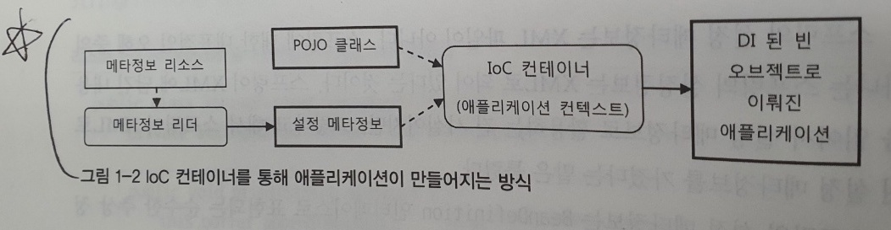
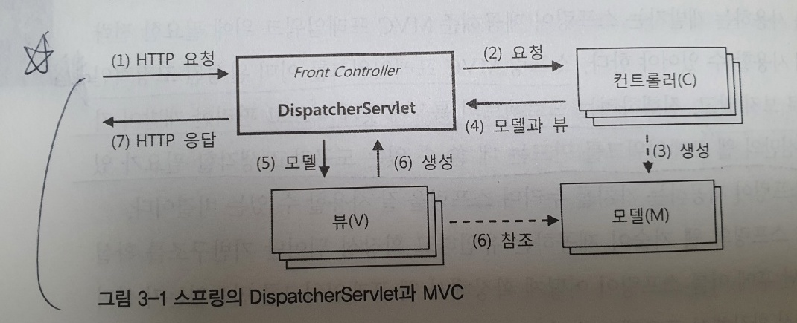
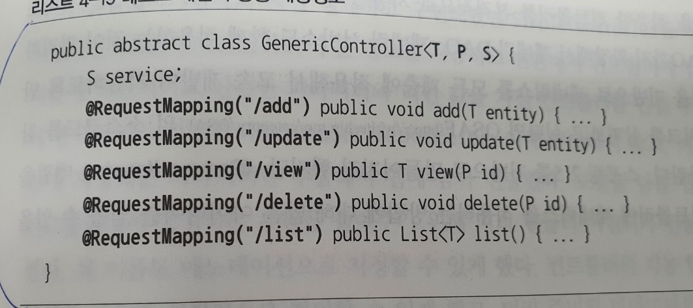
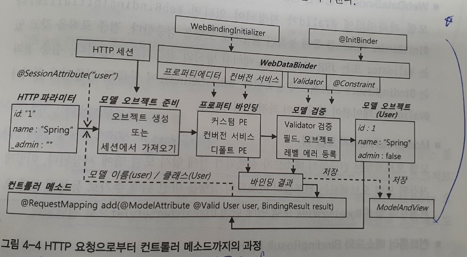
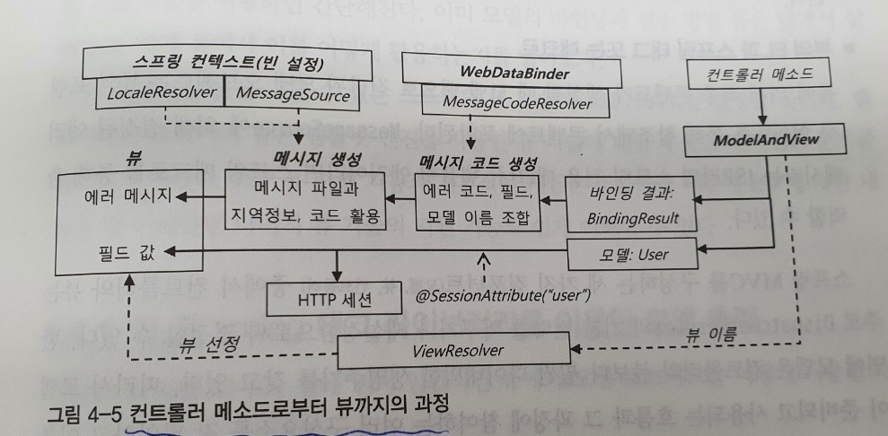
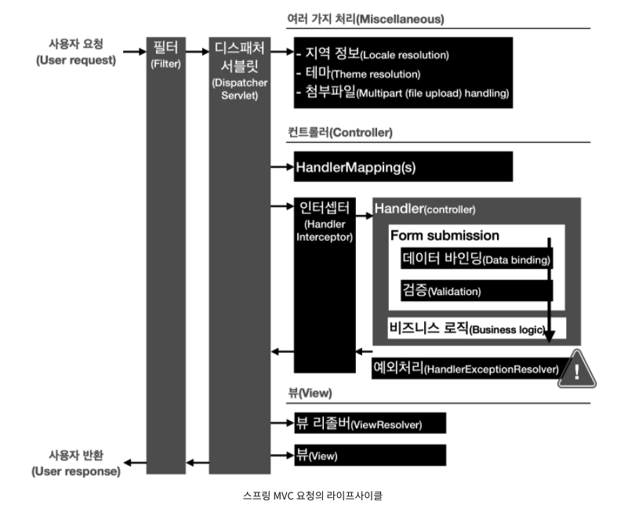

# 토비의 스프링 vol2

- 1장 IoC 컨테이너와 DI
  - 왜 IoC?
    - 컨테이너가 오브젝트에 대한 제어권을 갖고있어서 IoC (코드가 오브젝트를 제어하지않음!)
  - IoC 컨테이너 = 어플리케이션 컨텍스트 = 빈 팩토리
    - 어플리케이션 컨텍스트 (빈 팩토리를 상속받고있음..)
      - 엔터프라이즈 애플리케이션 개발하는데 필요한 여러가지 기능 + 빈 팩토리
    - 빈 팩토리
      - 오브젝트 사이의 관계 설정
  - IoC 컨테이너 사용을 위해서는 메타정보가 필요하다. 여기서 메타정보는 빈을 어떻게만들지, 어떻게 동작하게할지를 정의한 정보다
  - 스프링 애플리케이션이란, POJO클래스와 설정메타정보를 이용해 IoC 컨테이너가 만들어주는 오브젝트의 조합이라고 할수있다!
    - 
      
      - 리더만 잘 만들면 어떤 형태로도 빈 설정 메타정보를 작성할 수 있다!
  - IoC컨테이너는 오브젝트 단위로 관리함!
    - 클래스 하나에 여러 오브젝트를 만들수 있고, 이 오브젝트들을 IoC컨테이너가 관리하기 때문에 클래스단위가 아니라 오브젝트 단위로 관리된다.
  - IoC컨테이너 종류
    - StaticApplicationContext, GenericApplicationContext, GenericXmlApplicationContext, WebApplicationContext...
      - WebApplicationContext
        - 서블릿 컨테이너 : 요청을 받아서 서블릿을 동작시켜줌
          - 서블릿 : IoC 컨테이너에서 필요한 빈을 받아놓고 요청이 들어오면 해당 요청에 맞는 적절한 빈을 호출(web에서는 DispatcherServlet이 해당역할)
  - IoC 컨테이너 계층 구조
    - 트리모양의 계층구조를 사용하여 IoC 컨테이너는 하나 이상을 만들수 있다
    - 검색순서는 항상 자신이먼저! 그 다음이 직계부모(자신이 부모꺼 오버라이딩했다면 부모꺼 당연안불러온다~)
    - 웹 어플리케이션의 IoC 컨테이너 구성(p76참고)
      - 루트 applicationContext + 서블릿 컨텍스트(이거는 여러개될수있음. 부모컨텍스트가 루트 application context)
      - 꼭 반드시 두개이상을 사용해야하는것은 아님..
        - 스프링 웹기술을 사용하지않는다면 루트 애플리케이션 컨텍스트만 등록하면됨
        - 서블릿 컨텍스트 단일구조로 사용하기도함
  - 컨테이너가 자동등록하는 빈
    - ApplicationContext
    - BeanFactory
      - ApplicationContext도 BeanFactory를 상속받고있지만, 내부적으로 빈 팩토리 오브젝트를 별도로 만들어놓고 위임하는 방식으로 돌아가기때문에, BeanFactory를 직접적으로 주입받는객체랑 ApplicationContext의 BeanFactory 객체는 다르다!
    - ResourceLoader
      - 리소스 로드 가능
      - applicationContext가 상속받고있음
    - ApplicationEventPublisher
      - 컨테이너 안의 빈 오브젝트간에 이벤트 발생 & 전달받을수있는기능
      - 굳이 컨테이너에 의존적인 방법 사용할 필요가 없기에 거의 사용안함(필요하면 빈 사이에 독자적인 이벤트/리스너 구성을 사용하면됨)
    - systemProperties
      - JVM관련 설정값들
      - ```System.getProperty("")``` 와 같이 쓰는것이 좋음 (Property로 구현되어있기에, 타입으로 가져오기가좀.. 굳이 가져오려면 @Resource Properties systemProperties)
      - 해당 빈 이름은 사용하지말것! (systemProperties 는 빈이름등록금지)
    - sysetmEnvironement
      - 시스템 환경변수관련 (OS 종류나 서버환경 설정에 따라 달라질수있음)
      - ``` @Value(#{systemEnvironment['Path']}) String path; ```와 같이 사용가능
      - 해당 빈 이름은 사용하지말것! (sysetmEnvironement 는 빈이름등록금지)
  - 프로토타입과 스코프
    - 프로토타입
      - 생명주기 
        - 컨테이너가 생성은 해주지만, 그 이후의 관리는 주입받은 빈이 알아서 해야함
      - 용도
        - new 키워드로 ***매번 새롭게 생성***해 주어야할때, 컨테이너에 등록된 ***빈을 주입받아야 한다***면 프로토타입을 사용하자!
      - 사용방법
        - DI
          - @Scope에 proxyMode를 설정해줌
            - proxymode를 사용하면 보통 DI처럼 사용가능하며, 주입된 객체는 프록시패턴을 통해 만들어진 오브젝트이다. 이 오브젝트가 스코프에 적절히 맞추어 객체를 연결시켜준다
              - 겉으로만 봐서는 프록시 객체를 사용한것인지 당연 알수없음.. 하지만 내부적으로는 proxymode에 정의된대로 오브젝트를 연결해줌
              - *proxyMode 종류
                - ScopedProxyMode.INTERFACES : 프록시 빈이 인터페이스를 구현하고있고, 클라이언트에서 인터페이스로 DI받을때 사용 (jdk dynamic proxy 사용)
                - ScopedProxyMode.TARGET_CLASS : 프록시 빈 클래스를 직접 DI 할때 사용 (cglib 사용)
                  - 위 둘 차이 설명 : https://stackoverflow.com/questions/21759684/interfaces-or-target-class-which-proxymode-should-i-choose
                  - 결론은 인터페이스를 사용하고있으면 INTERFACES를, 그렇지않으면 TARGET_CLASS를 사용하면됨
        - DL(dependency lookup)
          - Provider\<T\> 사용
            - JSR-330(DIJ) 에 추가된 표준인터페이스
            - @Autowired로 주입받고 get()으로 가져오면 끝
            - 객체를 stateful로 사용하려면 이거를 써야함..
              - proxyMode를 target_class로 셋팅하면 메소드 호출할때마다 객체를 새로이만듦..
                - <span style="color:yellow">이에대한 자세한 내용은 추후 다시 확인해볼것</span>
                - https://coderedirect.com/questions/321125/what-is-a-scoped-proxy-in-spring
  - 싱글톤, 프로토타입 외 스코프 (웹 환경에서만 의미가 있음)
    - 프로토 타입과는 달리 스프링이 초기화에서부터 ***제거***까지 모두 관리
    - 사용방법 : 프로토타입과 동일
    - 종류
      - 요청 스코프
        - 요청별로 독립적인 빈이 만들어짐.
        - 상태값을 저장해둬도 안전
      - 세션 스코프
        - Http 세션과 같은 존재 범위를 갖는 빈
        - 세션 타임이 종료될때까지유지되므로 로그인 정보나 사용자별 선택옵션 등을 저장해두기에 좋음
      - 애플리케이션
        - 서블릿 컨텍스트에 저장되는 빈 오브젝트
        - 컨텍스트가 존재하는 동안 유지되는 싱글톤 스코프와 비슷한 존재범위를 가짐
        - 멀티스레드에 주의할것
  - 빈 생명주기 메소드
    - 초기화 메소드
      - 빈 오브젝트 생성 + DI 완료된 이후 진행
      - @PostConstruct
    - 제거메소드
      - 컨테이너가 종료될때 호출. 빈이 사용한 리소스 반환하거나 종료전에 진행
      - @PreDestory
  - 빈의 종류
    - 애플리케이션 로직 빈(0) : 비지니스 로직, 서비스 오브젝트 , DAO..
    - 애플리케이션 인프라 빈(0) : 대개 스프링에서 제공하는 추상화 되어있는 빈.. 직접 로직작성은 안하고 애플리케이션 로직 빈에 영향을 주는 빈. 기술API도 여기 속함 ex) 트랜잭션, DataSource
    - 컨테이너 인프라 빈(2) : 스프링 컨테이너 기능을 확장해서 빈의 등록과 생성, 관계설정, 초기화 등의 작업에 참여하는 빈 ex) AOP
      - 빈 후처리기 구현체들이 여기에 속하겠지.. (ex. \<context:component-scan\> 설정했을때 생성되는 빈들)
  - 런타임환경과 프로파일
    - 환경에 따라 설정파일 외에도 등록하는 빈이 달라져야 할때가 있는데, 지정한 프로파일에 따라 빈이 생성될수 있도록 가능!
    - 런타임 환경은 애플리케이션 컨테스트에 새롭게 도입된 개념!
    - 컨텍스트 내부에 Environment 인터페이스를 구현한 런타임 환경 오브젝트가 만들어져서 빈을 생성하거나 의존관계를 주입할때 사용한다
      - 런타임 환경은 "프로파일"과 "프로퍼티 소스" 로 구성되는데, 환경에 따라 프로파일과 프로퍼티 소스가 다르게 설정된 Environment 오브젝트가 사용
      - 프로파일안에 환경에 따라 각기 구성되는 빈들을 정의해놓으면, 애플리케이션 컨택스트가 시작될때 지정된 프로파일을 실행시킴으로써 환경에 필요한 빈을 만드는개념이다!
        - @Profile("dev") 로 선언하면 spring.active.profile이 dev일때만 실행된다.. (활성 프로파일은 prod로 해놓으면 당연실행안됨)
        - 아무것도 지정하지않으면 어떤 프로파일이던 상관없이 실행
        - @Profile("dev","prod") 이렇게 여러개도 지정가능
  - 프로퍼티 소스
    - 스프링에서 사용되는 프로퍼티 종류
      - 환경변수
        - OS의 환경변수. OS 레벨에서 동일한 값을 전달해야할때 사용
        - System.getEnv()
      - 시스템 프로퍼티
        - JVM 레벨
        - System.getProperties()
      - JNDI
        - 웹 어플리케이션 레벨
      - 서블릿컨텍스트 파라미터
        - 웹 어플리케이션 레벨. JNDI값을 설정하기 번거로울때
        - web.xml에 서블릿 컨텍스트 초기 파라미터를 프로퍼티로 사용가능
        - \<content-param\> 
        - @Autowired ServletConetxt servletContext
      - 서블릿 config 파라미터
        - 해당 서블릿의 서블릿 컨텍스트에만 영향. 즉, 위의 종류중에 범위가 제일 좁음
        - \<init-param\>
        - @Autowired ServletConfig servletConfig
    - 프로파일의 통합과 추상화(Environment)
      - 프로퍼티의 종류와 그에 따라 달라지는 접근 방법을 프로퍼티 소스라는 개념으로 추상화
      - 이를 통해 일관된방식으로 접근. 동일한 이름이 있을 경우에 우선순위에 따라 정해짐!
      - 사용방법
        - Environment.getProperty()
        ```java
          @Autowired
          Environment env
          ..
          env.getProperty("os.name");
        ```
        - PropertySourceConfigurerPlaceholder 빈 등록 & @Value
        ```java
          @Value("${db.username}")
          private String userName;
        ```
      - @PropertySource("classpath:/database.properties")
        - 이렇게 가져올수있음
        - 컨텍스트에 기본적으로 등록되는 프로퍼티 소스보다 우선순위 낮음
          - 우선적용하고 싶은 프로퍼티있거나 기타 프로퍼티 관련한 내용은 아래 래퍼런스 참고할것!

      - 스프링부트에서 프로퍼티 활용하는 레퍼런스
        - https://docs.spring.io/spring-boot/docs/current/reference/htmlsingle/#features.external-config

           
  - 1장을 통한 기타팁
    - /WEB-INF/**/*Context.xml (web.xml)
      - WEB-INF 폴더 밑의 모든 서브폴더에 Context.xml로 끝나는 모든 파일을 찾는다
    - 스테레오타입 애노테이션 : 디폴트 필터에 적용되는 애노테이션
      - 종류
        - @Component 
        - @Service : 서비스계층에서 사용
        - @Controller : MVC 컨트롤러에 사용. 스프링 웹 서블릿에 의해 웹 요청을 처리하는 컨트롤러 빈으로 선정됨
        - @Repository : 데이터 엑세스 계층의 DAO 또는 repository 클래스에 사용. DataAccessException 자동변환과 같은 AOP 적용 대상을 선정하기 위해서도 사용
    - @Configuration 클래스에 @Bean으로 생성한 빈 오브젝트들을 @Bean으로 등록한 함수로 호출하게되면, 몇번을 호출하던 싱글톤으로 동일한 빈을 전달해준다.(프록시 적용! CGLib..) 그러나, @Component 클래스에 @Bean으로 생성된 오브젝트를 함수로 호출하게되면, 호출할때마다 새로운 오브젝트가 등록이된다!
    - component-scan 태그는 애노테이션 의존관계 설정을 지원한다(의존관계 설정도하고 필요에따라 빈도 등록하고..)
      - annotation-config 태그는 이미 등록된 빈의 메타정보에 프로퍼티 항목을 추가해주는 작업! 새로운 빈을 등록해주지는않음!
    - @Resource는 빈의 이름을 이용해서 빈을 찾음
    - @Autowired는 빈의 타입을 이용해서 빈을 찾음
      - @Inject는 JSR-300(DIJ) 에서 제공해주는데, 이는 Autowired 와 같은기능!
      - 생성자에서도 사용할수있는데, 생성자 여러개 있을때 어떤것을 Autowired 사용할 것인지 명시해주어야 에러가 안난다
      - 꼭 생성자를 이용해서 DI 방식을 사용하는것이 정답은아님!
        - 디폴트 값을 주고 선택적으로 DI할수있또록 만들어야할때는 수정자메소드 주입이 더 좋겟지?
      - 동일한 타입이 여러개 빈으로 등록록되어있으면, Set, List로 가져올수있다
        - Map<String,Object>로도 가져올수있는데 key에는 bean 이름이 들어감
      - @Qulifier
        - 기본적으로 bean으로 등록된 놈이 qulifier(한정자) 를 가지고있는지 찾고, 없으면 빈 이름으로 찾는다. 즉, @Qualifer는 빈 생성시 전달한다.. "Autowired를 사용했을때 특정 한정자에 의해 한정을 시킨다!" 로 qualifer를 이해하자..
          ``` java
          @Component
          @Qulifier("abc")
          class Kkk{
              ...    
          }
          ```
        - 빈에 부가적인 속성을 지정해주는효과있음
        - 스프링은 @Qualifier를 메타애노테이션으로 갖는 애노테이션도 @Qualifier 취급을 해준다!
        - Qualifer(한정자) 사용해서 주입하려하는데, 적절한 Qualifier를 사용해서 등록된 빈이 없다면, 그냥 빈 이름으로 찾아줌
      - 꼭반드시 bean이 주입되어야하는게 아니면 @Autowired의 required 엘리먼트를 false로! 
        ```java
            @Autowired(required=false) Printer printer;
        ```
      - @Bean 을 통해서 빈을 등록할떄, 선언한 메소드는 자동주입되므로 @Autowired와 동일하게 동작한다(@Bean이 @Autowired를 포함한다고 보면됨!)
    - @Value는 필드, 수정자메소드, 메소드파라미터에서 사용가능
    - 프로퍼티 파일을 이용한 값 설정
      - 수동변환(PropertyPlaceHolderConfigurer)
        - 프로퍼티 치환자(placeholder)를 사용
        - 빈 팩토리 후처리기에서 실행됨(빈 후처리기가 아님)
          - 빈 후처리기는 매 빈 오브젝트가 만들어진 직후에 오브젝트의 내용이나 오브젝트 자체를 변경할때 사용하고, 빈 팩토리 후처리기는 빈 설정 메타정보가 모두 준비됐을대 빈 메타정보 자체를 조작하기 위해 사용
          - property 파일을 읽어서 메타정보의 값 정보에서 치환자(${}) 를 후처리기 시점에 찾아서 적절한 value로 바꿔준다!
            - 애매하게 정리한거 같은데, property 파일을 읽어서 메타정보의 값을 셋팅하는것은 빈 팩토리 후처리기에서 진행하고, @Value로 선언되어있는 변수에 값을 셋팅하는것은 빈 후처리기에서 진행
          - 빈 팩토리 후처리기가 빈 후처리기보다 앞서서 있는듯함 이건당연한말.. - 빈팩토리 후처리기가 먼저 동작해서 작업진행
            - ~~필드에 @Value로 셋팅하였을때, 생성자 호출하는 시점에는 값이 주입되어있지않은데, 메소드 수정자 주입시에는 값이 주입되어있었음.. (더 확실히 알기위해서 좀더 찾아봐야할듯)~~
            - ~~빈 팩토리 후처리기는 왠지 오브젝트 생성과 초기화 사이에 이루어지는듯하다..~~
              - 빈 팩토리 후처리기를 통해서 셋팅된 메타데이터를 빈 후처리기를 통해서 가져오는게 맞는말인듯
      - 능동변환(SpEL)
        - #{} 사용
        - 표현식을 사용해 다른 빈 오브젝트에 직접 접근할수도있음
          - ex) #{hello.name} (hello라는 빈 이름의 name 프로퍼티) 
    - 프레젠테이션 계층의 입력방식에 따라서 비지니스 로직을 담당하는 코드가 휘둘리지않고 독립적으로 존재하기 위해서는 최대한 도메인객체를 참조하도록 해야한다(도메인 객체만 잘 만들어져있다면...)
      - 컨트롤러에서 요청받은 데이터를 오브젝트에 담았을때, 해당 오브젝트에 도메인 객체를 담고있다면, 이는 컨트롤러에서 요청하는 데이터가 변경된다할지라도 서비스 계층에서 데이터를 사용하는데에 있어서 큰 변경이 없을것이다!
      - 그리고 여기에서 컨트롤러에서 요청시 데이터를 오브젝트에 담을때 새롭게 객체를 생성할텐데, 도메인 객체에 데이터를 셋팅하기위해서 DAO를 통해서 데이터를 select해 올 필요가 있을수있다. 이때 오브젝트는 요청마다 새롭게 생성되고, 컨테이너 등록된 빈(dao)을 사용해야하므로 프로토타입으로 사용하는것이 좋다!
    - @Import
      - @Configuration 클래스 가져온다! @Enable.. 클래스에서 많이 사용된다함
    - @Configuration은 각각 하나의 XML과 같다고 볼수있다! 설정의 성격에 따라서 잘 분리하자!! 
    - @EnableTransactionnManagement
      - 트랜잭션 사용할때 사용.. @Transactional 사용하기 위한 AOP 관련 빈들을 등록해줌
      - 스프링부트에서도 반드시 써야하는것인지 확인필요(어떤 의존성을 불러오면 자동으로 등록되는것같긴한데.. 확인필요하다!)
        - DB관련 의존성을 주입하면 알아서 트랜잭션 관련 인프라 빈들은 등록됨(스프링부트)
    - 프로퍼티 파일은 저장소에 올리지 말자! 그냥 sample properties만 올릴것!
    - 롤백 테스트는 내장형 DB로 확인하는것도 좋다!
    - -D 옵션은 JVM 옵션 (-Dspring.profile.active=prod)
    - 팩토리 빈을 통해서 빈을 등록하는 방법 정리(자세한 factory bean 관련 내용은 toby Spring vol 1을 참고할것!) : https://live-everyday.tistory.com/224

- 2장 데이터 엑세스 기술 (해당 기술의 자세한 내용은 필요할때 다시 참고하면 좋을듯)
  - DAO 패턴
    - 도메인 오브젝트만을 사용하는 인터페이스를 통해서 데이터 엑세스 기술을 외부에 노출하지않도록 만드는것! => POJO => 기술에 영향x, 단위테스트 용이
    - 예외도 checked error 나 특정 기술에 종속되어있는 에러x.. 또한 되도록 런타임에러로뺄것!
      - 런타임 에러로빼는이유는 데이터 엑세스 중에 발생하는 예외는 대부분 복구할수 없기때문!
  - JDBC
    - 스프링의 JDBC 접근방법
      - JdbcTemplate(Datasource)
        - 파라미터 소스
          - 쿼리에서 값이 매번 달라지는 경우, 치환자를 만들어서 바인딩하는 방법을 사용하는게 좋은데, 바인딩을 위해 넘겨주는 값을 파라미터 소스라고 한다
          - ex) INSERT INTO MEMBER(ID,NAME,POINT) VALUES(:id,:name,:point); 라면, :id, :name, :point에 값을 바인딩해줌
          - 종류
            - Map/MapSqlParameterSource : key, value 값으로 전달해주고, key값으로 바인딩함 ex) key가 id,name,point 이렇게 들어가있어야함
            - BeanPropertySqlParamenterSource : 자바빈 스타일의 오브젝트를 전달해주면 해당 필드 이름으로 바인딩함
        - RowMapper
          - 데이터를 읽어올때 BeanPropertyRowMapper를 넘겨주면, BeanPropertyRowMapper를 생성할때 넘겨준 클래스를 바탕으로 데이터를 바인딩하여 해당 객체를 리턴해줌
      - SimpleJdbcInsert
        - DB메타정보 활용하여 db에 insert하는데 용이하게 해줌
        - insert 할때 일일이 컬럼 일일이 추가해서 쿼리만들 필요없음! 어떤 테이블에 insert할건지만 명시해주면 해당 테이블의 메타정보를 가져와서 셋팅
        - 이를 통해서 자동증가 컬럼은 제외할수도잇으며, 자동증가 컬럼의 현재값도 가져올수있다!
      - SimpleJdbcCall
        - 프로시저나 함수 콜
    - 스프링 JDBC가 해주는 작업
      - connection 열기와 닫기
        - connection 열고 닫는 시점은 스프링 트랜잭션 기능과 맞물려서 결정
      - statement(preparedstatement) 준비와 닫기
      - statement 실행
      - resultset 루프
      - 예외처리와 변환
        - 런타임예외로 변경
        - 일관된 DataAccessException 계층구조내의 예외로 전환
      - 트랜잭션 처리
      - *개발자가 해야할작업 : SQL, SQL에 넘겨줄 파라미터, 실행결과를 어떤 오브젝트에서 받을것인지, DB 커넥션 가져올 DataSource 정의
    - 스프링 JDBC DAO
      - ***도메인 오브젝트*** or ***테이블 단위***로 DAO 생성! => DAO는 여러개
  - ORM
    - 스터디필요
  - 트랜잭션
    - 트랜잭션 추상화와 동기화
      - 트랜잭션 추상화 
        - 트랜잭션 서비스의 종류나 환경이 바뀌더라도 트랜잭션 사용하는 코드는 그대로유지!
        - PlatformTransactionManager(구현체로는 jdbc, jpa, hibernate 등이있음)
          - 구현체
            - DataSourceTranactionManager
            - JpaTransactionManager
            - HibernateTransactionManager
            - JtaTransactionManager
              - 여러개 DB를 사용할때, 꼭 DB뿐 아니라 JMS와 DB 등 짬뽕된 트랜잭션이 필요할때, 여러대 서버에서 분산되어 진행되는 작업 등 트랜잭션으로 연결이 필요할때 사용!
              - 이를 지원하는 WAS를 사용하거나, 독립적으로 사용할수있도록 해주는 프레임워크가 필요함
          - 만약 Datasource가 다르고 각 Datasource에 대한 트랜잭션을 사용해야한다면 당연히, 각 Datasource를 가지고 트랜잭션매니저를 등록하면됨. 즉, 2개 등록..
            - @Tranactional 에서 사용해야할 트랜잭션 매니저를 지정하면됨
      - 트랜잭션 동기화
        - 트랜잭션을 일정 범위 안에서 유지해주고, 어디서든 자유롭게 접근할수있게 만들어줌!(이로 인해 전파(propagation) 옵션을 활용가능)
    - 트랜잭션 경계설정 방법
      - 코드로짜기
        - PlatformTasactionManager를 직접사용해도되나, try catch 블록을 써야하므로 TransactionTemplate을 이용하면 좋음
        - TransactionTemplate(PlatformTrasactionManager)
        - 트랜잭션 관련 ***디버깅할때는 PlatformTasactionManager***를 사용하는것이 좋은데, 해당 객체에서 getTransaction()으로 전달받은 ***TransactionStatus*** 객체를 이용하면 현재 트랜잭션이 새로 시작된것인지 기존 트랜잭션에 참여한것인지 또는 종료된 것인지 모두 확인가능!
      - 선언적 트랜잭션 경계설정
        - 선언적 트랜잭션 경계썰정은 트랜잭션 프록시빈(빈 후처리기에서 프록시 오브젝트를 반환) 덕분에 가능!
        - 방법
          - xml 설정파일에 pointcut, advice 정의 
            - pointcut은 기본적으로 ***인터페이스***에 적용!
              - 스프링AOP의 동작원리인 JDK 다이내믹 프록시는 인터페이스를 이용하여 프록시를 만들기떄문!
              - 그러나, 인터페이스없이 프록시를 만들수도있긴함...
              - *특정 클래스로 지정해서 aop를 적용하면, 트랜잭션 적용과 상관없는 메소드도 포인트 컷의 선정대상이된다.. 불필요한 리소스 소모.. 인터페이스 분리 원칙에 따라 클라이언트가 필요한(실제적으로 DB의 데이터를 핸들링하는 기능)것만 나타나있고, 바로 그 기능들이 트랜잭션 적용대상들이여야하므로 인터페이스를 기준으로 적용하는것이좋음!(하지만 이게 또 어노테이션 쓸때는 꼭 인터페이스에 적용하는게 좋지않음..)
          - 어노테이션(@Transactional)
          - 참고사항
            - 프록시 모드 (JDK 다이내믹 프록시 vs CGLIB)
              - CGLIB 사용 
                - 보통 인터페이스를 사용하지않을때, 클래스 레벨의 프록시를 사용하도록해줌(런타임 바이트 코드 생성기법을 이용해서 적용함)
                - 상속해서 프록시를 만드는 개념이기때문에, final로 선언된 클래스는 안됨
                - public으로 정의된 모든 메소드에 적용이 되기때문에, 수정자와 같은, 트랜잭션적용이 필요없는 메소드도 적용이 됨
                - @EnableTransactionManager에 Proxy-target-class를 true로 변경해야하고(기본값 false) 인터페이스가 아닌 클래스에 선언해야한다
                  - 만약 인터페이스에 적용하고 proxy target class를 true로햇다면 트랜잭션 안먹는다
                  - 또한 proxy target class를 별도로 설정하지않고 클래스에만 선언하게되면 JDK 다이내믹 프록시로 진행됨
            - AOP 방식(프록시 vs AspectJ)
              - 프록시
                - 스프링의 AOP 방식
                - CGLib든 JDK 다이내믹 프록시든 모두 어쨋든 프록시 사용하는것.. 그래서 해당 클래스 내부에서 바로 트랜잭션 적용되어있는 자신을 호출하면 트랜잭션 안먹는다..(타깃오브젝트의 자기호출) 외부에서 호출해주어야함..
              - AspectJ
                - 프록시를 타깃 오브젝트 앞에 두는 방식이 아닌, 타깃 오브젝트 자체를 조작해서 부가기능을 직접 넣는 방식. 처음부터 타깃 오브젝트의 클래스에 부가기능을 가진 소스코드가 있었던 것처럼 만들어줌
                - 프록시 방식을 사용할때 외부에서 호출해주어야하는 한계점을 이를 통해서 해결가능
                - @EnableTransactionManager에 mode를 aspectJ로 해주어야함
                  - 클래스 레벨, 클래스 메소드레벨에 적용해야함(인터페이스x)       
      - 트랜잭션 속성
        - 전파(propagation)
          - 트랜잭션을 시작하거나 기존 트랜잭션에 참여하는 방법을 결정하는 속성
        - 격리수준(isolation)
          - 트랜잭션이 진행될때 트랜잭션의 작업결과를 여타 트랜잭션에게 어떻게 노출할 것인지를 결정
          - 예를들어, 격리수준이 REPEATABLE_READ라면, 내가 읽은 데이터를 다른 트랜잭션이 수정하는것을 막아줌. 하지만 다른 트랜잭션이 새로운 로우를 추가하는것은 제한하지않는다..
        - 제한시간(timeout)
        - 읽기전용(read-only)
          - 성능 최적화도된다함..
          - 쓰기작업 막을수있음
        - 롤백예외(rollbackFor)
          - 특정 에러클래스를 발견하면 롤백하라!
          - 기본적으로 런타임에러만 롤백하고, checked error는 롤백대상이 아닌데, 여기서 지정해주면 해당 checked error도 롤백대상이됨
          - @Transactional(rollbackFor=NoSuchMemberException.class)
        - 커밋예외
          - 런타임 예외라도 발견하면 롤백하지말고 커밋해!
          - 사용방법은 롤백예외랑 동일
      - 데이터 엑세스 기술 트랜잭션의 통합
        - 트랜잭션 매니저별 조합가능기술
          - 하나의 트랜잭션 매니저를 사용해서 여러 DA 기술이 짬뽕되어있는 상태에서도 트랜잭션 적용가능!
          - 물론, ***같은 Datasource***를 봐야함!
          - 두개 이상의 여러DB 사용할때도 트랜잭션 필요하다면 JTA 사용해야함 
        - ORM과 비ORM DAO를 함께 사용할때 주의사항
          - ORM은 바로 DB에 반영하지않고 캐시로 수행해야할 작업을 가지고있다가 일괄적으로 반영한다. 그로인해서 비ORM과 서비스내에 같이 있다면 생각했던 결과와 다를수있다(비ORM은 바로 DB에 반영)
          - 이를 해결하기위해 비ORM과 같이 사용할때는 ORM의 flush()를 사용해서 바로 DB에 반영시켜주는것이 좋다. (이또한 AOP로 셋팅이 가능하다하는데, 자세한건 JPA와 같은 ORM 스터디가 필요할듯!)
           
  - 2장을 통한 기타 팁
    - 서버가 제공해주는 DB풀을 사용해야하는 경우에는 JNDI를 통해 서버의 DataSource에 접근!
    - ORM : 오브젝트와 RDB사이에 존재하는 개념과 접근 방법, 성격의 차이 때문에 요구되는 불편한 작업을 제거해줘서, 자바 개발자가 오브젝트를 가지고 RDB에 적절한 형태로 변환하거나 반대로, RDB에 저장되어 있는 정보를 자바 오브젝트가 다루기 쉬운 형태로 변환해주는 기술!
      - ORM 사용하면 SQL문장을 직접 작성x
      - 즉, 쉽게 이야기하면 자바 오브젝트와 RDB사이에 ORM 프레임워크가 적절히 맵핑해주어, 데이터를 오브젝트 관점에서 핸들링 할수있는것!
    - @EnableTransactionManager를 통해서 트랜잭션 AOP관련한 인프라 빈들이 등록됨.. 스프링부트에서는 jdbc사용하면 자동으로 등록이되는듯..


- 3장 스프링 웹 기술과 스프링 MVC
  - 기본적으로 서비스 계층과 데이터 엑세스 계층을 담은 ***루트에플리케이션 컨텍스트***와 스프링 웹 기술을 기반으로 동작하는 웹 관련 빈을 담은 ***서블릿 에플리케이션 컨텍스트***로 분리된다
    - 이를 통해서 다른 웹 기술을 사용할때 언제라도 대체가 가능할수있도록 할 수 있다.
  - 스프링 MVC와 DispatcherServlet 전략
    - 스프링은 기본적으로 추상화를 기반으로 기술이 바뀐다한들 비지니스 로직이 변경되지않도록 해준다. 스프링 MVC와 DispatcherServlet 또한 이를 기반으로 만들어져있다. 하지만 중요한것은 추상화를 기반으로 프로젝트에 맞는 구체적인 프레임워크를 만들어 나가야한다. RoR과 같은 일체형 고속개발 프레임워크는 기술에 대한 자기주장이 강한데, 스프링 프레임워크 또한 궁극적으로 빠른 개발을 위해서는 추상화를 기반으로 특정 프로젝트에 맞는 최적화된 구조를 만들어내고, 관례를 따라 빠르게 개발 가능한 스프링 기반 프레임워크를 만들어서 사용해야한다!
    - 스프링 MVC 프레임워크를 이미 완성된 고정적인 프레임워크로 보지말고, 진행하려는 프로젝트의 특성에 맞게 빠르고 편리한 개발이 가능하도록 자신만의 웹 프레임워크를 만드는데 쓸 수 있는 도구라고 생각할 필요가 있다! 
    - DispatcherServlet과 MVC 아키텍처
      - MVC 
        - M(model) : 프레젠테이션 계층의 구성요소 정보를 담은 모델
        - V(view) : 화면 출력 로직을 담은 뷰
        - C(Controller) : 제어 로직을 담은 컨트롤러
      - MVC 아키텍처는 프론트 컨트롤러 패턴과 함께사용
        - 프론트 컨트롤러 패턴 : 중앙 집중형 컨트롤러를 프레젠테이션 계층의 제일 앞에 둬서 서버로 들어오는 모든 요청을 먼저 받아서 처리(DispatcherServlet이 그 역할을함)
          1. 공통적인 작업을 먼저수행
          2. 적절한 세부컨트롤러로 작업 위임
          3. 클라이언트에게 보낼 뷰 선택해서 최정결과 생성
          4. 예외가 발생했을때 이를 일관된 방식으로 처리
          - 
          - (1) Http 요청 접수
            - 지정한 패턴에 맞추어 요청이 들어오면, 해당 DispatcherServlet으로 전달.
            - 공통적으로 진행해야하는 전처리 작업(보안, 파라미터 조작, 한글인코딩 등)이 있다면 이를 수행
          - (2) DispatcherServlet에서 컨트롤러로 HTTP 요청 위임
            - 컨트롤러를 선정하는 ***핸들러 맵핑 전략***을 통해서 어떤 핸들러(컨트롤러)를 선택할지를 결정하고 ***핸들러 어뎁터***를 통해서 해당 컨트롤러를 실제적으로 실행하게된다
              - 핸들러 어뎁터는 어뎁터 패턴으로 이루어져있는데, 이를 사용하는 이유는 DispatcherServlet이 핸들러(세부컨트롤러)를 호출할때 해당 핸들러의 특정함수까지 알수 없기에 확장성을 고려해서 만들어진것! 즉, DispatcherServlet은 어뎁터를 통해서 세부컨트롤러가 어떻게 생겨먹던 상관없이 호출가능하게된것!
          - (3) 컨트롤러의 모델 생성과 정보 등록
            - 모델(비지니스 계층에서 돌려받는 값을 기반으로 생성)을 DispatcherServlet에 전달
          - (4) 컨트롤러의 결과 리턴 : 모델과 뷰
            - 기본적으로 ModelAndView 객체를 리턴
              - 해당 객체 내부적으로는 (3)을 통해 얻은 모델과 어떤 뷰를 사용할것인지가 들어가있다
              - 여기서 뷰는 바로 뷰 오브젝트를 전달할수도있고, 뷰 리졸버를 통해서 뷰를 만들수있도록 그냥 String 값을 전달할수도있다
                - DispacherServlet의 전략인 뷰 리졸버가 뷰의 논리적인 이름을 전달받아 뷰 오브젝트를 생성해준다!
            - 세부 컨트롤러의 역할은 결국 모델을 셋팅하고 해당 모델정보를 어떤 뷰를 통해 보여줄것인지를 결정해주는것!
          - (5) DispatcherServlet의 뷰 호출과 (6) 모델 참조
            - 브라우저에 나타낼 HTML을 생성하는것이 일반적인 뷰의 작업
            - 어떤 뷰를 선택하느냐에 따라 jsp, json, pdf 등의 형식으로 결과를 보여줄수있다. 그리고 해당 내용은 HttpServletResponse 오브젝트에 담기게된다
          - (7) HTTP 응답 돌려주기
            - DispatcherServlet은 등록된 후처리기 있으면, 이를 진행하고 전달받은 HttpServletResponse에 담긴 결과를 서블릿 컨테이너에 전달
            - 서블릿 컨테이너는 HTTP 응답으로 만들어 클라이언트에게 전송
        - DispatcherServlet의 DI 가능한 전략
          - HanlderMapping
            - 어떤 컨트롤러로 갈것인지 결정하는 로직을 담당
          - HandlerAdapter
            - Handler Mapping을 통해서 찾은 컨트롤러를 실행시켜주는 역할
            - 여러 핸들러 매핑을 이용해서 하나의 어댑터를 통해 컨트롤러를 호출하기도하고
            - 하나의 핸들러 매핑이 여러개의 어댑터를 통해 컨트롤러 호출하기도하고
            - 핸들러 매핑과 어댑터가 한가지 컨트롤러에만 적용되기도함(DefaultAnnotationHandlerMapping(spring 3.1 이상부터 RequestMappingHandlerMapping) 에 의해 핸들러 결정되고, AnnotationMethodHandlerAdapter(spring 3.1 이상부터 RequestMappingHandlerAdapter)에 의해 핸들러 호출)
          - HandlerExceptionResolver
            - 예외가 발생했을때 이를 처리하는 로직을 가진 전략 오브젝트
          - ViewResolver
            - 뷰 이름 참고해서(logical view) 적절한 뷰 오브젝트를 찾아주는 로직을 가진 전략 오브젝트
          - LocaleResolver
            - 지역정보를 결정
          - ThemeResolver
          - RequestToViewNameTranslator
            - 컨트롤러에서 뷰 이름이나 뷰 오브젝트를 제공해주지 않았을 경우(ModelAndView에서 view 빠져잇을때) URL과 같은 요청정보를 참고해서 자동으로 뷰이름을 생성해주는 전략
            - 이를 기반으로 관례를 잘 사용하면 뷰와 자동으로 매핑시켜줄수있음
            - /hello 라고 요청이들어왔따면, hello 라는 뷰이름으로.. /admin/user.do 라면 admin/user 라는 뷰이름으로 넘어감
          - *DispatcherServlet은 서블릿 컨테이너가 생성하고 관리하는 오브젝트이지, 스프링의 컨텍스트에서 관리하는 빈 오브젝트가 아님..! DispatcherServlet에 바로 DI해줄수는 없지만, DispatcherServlet은 서블릿 웹 애플리케이션 컨텍스트를 가지고있기때문에 이를 가지고 사용하는것임
            - 아마 여기서 서블릿 컨테이너가 생성한다는것은, web.xml을 읽어들여서 생성하기때문에 그렇게이야기한듯.. 스프링부트일경우 서블릿 컨테이너가 생성하지않고, 생성자체는 자동설정에서 진행하고(빈 등록) 또한 DispatcherServlet에 적용하는 전략들또한 자동설정에서 진행
          - **DispatcherServlet에 적용할 전략을 선택하고 필요에 따라 확장하거나 다른 방식으로 동작하도록 설정해주는것이 스프링 MVC를 바르게 사용하는 첫걸음!
  - 컨트롤러(Controller)
    - 요청정보 추출 + 검증(+예외처리) + 적절한 타입변환(ex. multipart, 오브젝트) + 비지니스로직을 태우기위해 적절한 파싱 + 비지니스 로직의 결과에 따른 뷰 전달(ex. redirect, forward..) + 모델정보셋팅(서비스 결과 전달 or 직접 생성) (+ 상태 세션 저장)
    - 위의 다양한 책임들이 컨트롤러에 있게되는데, 이를 스프링은 적절하게 분리하였음!
      - 스프링 부트 default 빈 참고 : https://jwdeveloper.tistory.com/146
    - 컨트롤러의 종류와 핸들러 어뎁터(DispatcherServlet이 HandlerMapping을 통해서 세부 컨트롤러를 찾으면, 해당 세부컨트롤러를 실행시켜줄 HandlerAdapter를 찾는다)
      - Servlet과 SimpleServletHandlerAdapter
        - 표준서블릿 구현한것.. 
        - DispatcherServlet은 기본적으로 ModelAndView로 진행을하는데, 요놈은 그런게 없어서 직접 response에 다 넣어주어야함..
      - HttpRequestHandler와 HttpRequestHandlerAdapter
        - RMI 스타일의 컨트롤러를 이용한 원격호출할때 사용한다함(Exposing services using RMI)
      - Controller와 SimpleControllerHandlerAdapter
        - 스프링3.0 에서 어노테이션과 관례를 이용한 컨트롤러 나오기전까지는 이거를 많이 썻다함
        - 탬플릿 메소드 패턴을 활용하면, 세부 컨트롤러 구현체를 간결하게 해주고, 테스트도 용이!
          - Map으로 파라미터 전달받고, Model정보를 map에 셋팅해서 넘겨주는 로직들이 이를 통해서 가능!
      - AnnotationMethodHandlerAdapter(스프링 3.1 이상 RequestMappingHandlerAdapter)
        - 다른 핸들러 어뎁터와 같은경우에 반드시 특정 인터페이스를 구현한 컨트롤러만을 지원하는데, 이는 지원하는 컨트롤러의 타입이 정해져 있지 않음!
        - 대신 클래스와 메소드에 애노테이션의 정보와 메소드이름, 파리미터, 리턴타입에 대한 "규칙" 등을 종합적으로 분석해서 컨트롤러를 선별하고 호출방식을 결정!
        - URL의 매핑을 컨트롤러 단위가 아니라, 메소드 단위로 가능하게했음!
        - DefaultAnnotationHandlerMapping(스프링3.1 이상 RequestMappingHandlerMapping) 핸들러 매핑과 함께 사용됨
        - 규칙과 관례를 잘 기억해야함!
    - 핸들러 매핑
      - HTTP 요청 정보를 이용해서 세부 컨트롤러를 찾아주는 기능을 가진 DispatcherServlet의 전략
      - 컨트롤러의 타입과는 전혀 상관없음
        - 즉, 하나의 핸들러 매핑전략이 여러가지 타입의 컨트롤러를 선택가능하다는뜻
      - 종류
        - BeanNameUrlHandlerMapping(디폴트)
          - 빈의 이름에 들어있는 URL을 HTTP 요청의 URL과 비교해서 일치하는 빈을 찾아줌
          - 빈 이름에 ant 패턴이라 불리는 *,**,? 사용가능
            - /abc/s* : /abc/s, /abc/s1, /abc/sssasdf 다 됨
            - /root/**/sub : /root/sub, /root/a/sub, /root/a/b/c/d/sub 다 됨
        - ControllerBeanNameHandlerMapping
          - 빈 이름을 기반으로 찾음. prefix가 있기때문에 prefix와 조합해서 찾음
        - ControllerClassNameHandlerMapping
          - 클래스 이름을 기반으로 찾음.
        - SimpleUrlHandlerMapping
          - 프로퍼티에 매핑정보를 저장하면 이를 반으로 찾아줌
        - DefaultAnnotationHandlerMapping(디폴트, 스프링 3.1 이상 RequestMappingHandlerMapping 변경)
          - @RequestMapping이라는 어노테이션을 컨트롤러 "클래스"나 "메소드"에 직접 부여하고 이를 기반으로 찾아줌
          - 단지 URL뿐 아니라, GET/POST와 같은 HTTP메소드, 심지어 파라미터와 HTTP 헤더정보까지 매핑에 활용가능
        - 기타 공통 설정정보
          - order
            - 핸들러 매핑은 한개 이상을 동시에 사용할수있기 때문에, 두개 이상 적용했을때 URL 매핑정보가 중복되는 경우를 주의해야함..
            - 이를 위해 핸들러 매핑의 우선순위를 지정가능
          - defaultHandler
            - URL을 매핑할 대상 찾지못하면, 자동으로 디폴트 핸들러를 선택해줌
            - 맵핑 안되어있을때, 에러 관련해서 일괄처리 가능!
          - alwaysUseFullPath
            - URL은 맵핑은 기본적으로 웹 애플리케이션의 컨텍스트 패스와 서블릿 패스 두가지를 제외한 나머지만을 가지고 비교한다
              - 이렇게 URL 기준을 상대경로만 사용하는 이유는 웹 애플리케이션의 배치 경로와 서블릿 매핑을 변경하더라도 URL 매핑정보가 영향받지 않도록 하기 위해서다. HTML의 링크라면 상대경로를 사용하면 되지만, URL은 절대경로를 사용하므로 바뀌지 않는 부분만 매핑에 이용하는것이 바람직(이해안감..!!!)
            - 특별한 이유가 있어서 URL 전체를 사용해서 컨트롤러를 매핑하기 원하는 경우가 아니라면 true로 변경하지말것(default가 false)
          - detectHandlersInAncestorContexts
            - 컨트롤러는 루트컨텍스트가아니라, 서블릿컨텍스트에 등록되어있어야 찾을수 있는것이 기본값인데, 루트 컨텍스트에서 컨트롤러를 등록해도 찾을수 있도록 변경할수있음.. 그러나 이는 사용하지말것!
    - 핸들러 인터셉터
      - DispatcherServlet이 컨트롤러 호출 전,후에 요청과 응답을 참조 or 가공가능하도록 해주는 전략(필터)
      - 핸들러 맵핑은 DispatcherServlet으로부터 매핑작업 요청받으면 그 결과로 핸들러 실행체인(HandlerExecutionChain)을 돌려주는데, 하나 이상의 핸들러 인터셉터를 거쳐서 컨트롤러가 실행될수있도록 구성되어잇다!(체인에 추가해서 전달해줌)
        - 핸들러 맵핑에서 실행체인에 핸들러와 인터셉터들 셋팅해서 돌려주는것!
      - 핸들러 인터셉터 자체가 스프링의 빈이기 때문에 DI를 통해 다른 빈 활용가능
      - 핸들러매핑클래스에 프로퍼티를 이용해 셋팅함(3.0부터는 URL 패턴을 이용해서 모든 핸들러 매핑에 일괄 적용하는 기능이 추가됐다함)
      - ***컨트롤러***에 공통적으로 적용할 부가기능이라면 핸들러 인터셉터를 활용하는게좋음!(AOP로 구현하기 어렵고 복잡..)
      - 종류
        - HandlerInterceptor
          - 이 인터페이스를 구현해서만듦
      ```java

        // 컨트롤러가 호출되기 전에 실행
        // hanlder 파라미터는 핸들러 매핑이 찾아준 컨트롤러 빈 오브젝트
        // return이 false라면 작업중단하고 리턴하기떄문에 컨트롤러와 남은 인터셉터 실행 안됨
        boolean preHandle(HttpServletRequest request, HttpServletResponse response, Object handler) throws Exception


        //컨트롤러 실행하고 난 후 호출
        //에러나면 여기 안탐 
        void postHandle(HttpServletRequest request, HttpServletResponse response, Object handler, ModelAndView modelAndView) throws Exception

        // 모든 뷰에서 최종 결과를 생성하는 일을 포함한 모든 작업이 다 완료된 후에 실행
        // HandlerExceptionResolver 에서 에러 맞는 페이지 전달해주고 인터셉터의 afterCompletion에서 세부로그 찍어주거나, 알림을 셋팅하는게 좋음
        void afterCompletion(HttpServletRequest request, HttpServletResponse response, Object handler, Exception ex) throws Exception
        
      ```
  - 뷰
    - 웹 환경에서는 보통 브라우저에 나타낼수있는 HTML을 만들어주는게 뷰의 역할이다
    - 컨트롤러가 작업을 마치면 ModelAndView를 넘겨주는데 이때, 두가지 방법이있다
      - 첫째는 View 타입의 오브젝트를 돌려주는것
      - 둘째는 뷰 이름을 돌려주는것
        - 여기서 뷰 리졸버가 사용되어 논리적인 뷰이름을 실질적인 뷰 오브젝트로 전환시켜준다
    - 뷰의 종류
      - InternalResourceView
        - RequestDispatcher의 forward() 나 include()를 사용하는 뷰
        - /WEB-INF/ 밑으로 접근가능
        - JSP 뷰를 만든다면, 이를 ModelAndView에 넣으면 JSP로 포워딩해줌
      - JstlView
        - InternalResourceView 의 하위클래스
        - locale(지역정보) 에 따라 달라지는 지역화(localization)된 메세지를 jsp에서 사용 가능
          - message.propierteis(지역정보가 한국으로 설정되어있다면, message_ko.properties) 파일의 메세지를 JSTL의 fmt에서 사용가능
      - RedirectView
        - 실제 뷰가 생성되지않고, URL만 만들어져 다른 페이지로 리다이렉트됨
        - 모델정보가 있다면, URL 뒤에 파라미터로 추가
        - "redirect:~~" 이렇게 시작되면 뷰 리졸버가 인식해서 RedirectView로 만들어줌
      - VelocityView
      - FreeMarkerView
      - MarshallingView
      - AbstractExcelView, AbstractJExcelView, AbstractPdfView
      - AbstractAtomFeedView, AbstractRssFeedView
      - XsltView, TilesView, AbstractJasperReportsView
        - AbstractJasperReportsView는 JasperReport를 이용해 CSV, HTML, PDF, Excel 다 만들수있음
      - MappingJacksonJsonView
        - 모든 오브젝트를 json으로 변환
        - Http 응답의 content type은 application/json으로 지정
    - 뷰 리졸버
      - 논리적인 뷰이름을 실질적인 뷰 오브젝트로 전환시켜준다
      - 보통 뷰 오브젝트를 캐싱하기때문에 뷰가 반복적으로 만들어지지않게 해서 성능면에서도 좋음
      - 뷰 리졸버를 빈으로 등록하지않으면, DispatcherServlet의 디폴트 뷰 리졸버인 InternalResourceViewResolver가 사용
      - 뷰 리졸버를 하나 이상을 빈으로 등록해서 사용할수있고, 여러개 사용할때는 order를 사용해서 뷰 리졸버의 순서를 지정하는게 좋음
        - 순서를 지정했을때 먼저 선택되면 바로 해당 뷰로 리턴
      - 종류
        - InternalResourceViewResolver
          - 되도록이면 default로 사용하지말고, prefix나 suffix를 지정해서 사용할것
          - 클래스패스에 JTSL 라이브러리가 존재하면 JstlView를 사용하고, 그렇지않으면 InternalResourceView를 사용
        - ResourceBundleViewResolver
          - 클래스패스에있는 views.properties 파일을 기반으로 뷰를 매칭
          - 모든 뷰를 파일에 일일이 정의해야하기때문에, 단독적으로 사용하는것은 비추
            - InternalResourceViewResolver 와 함께 사용하여 우선순위를 지정해주어, ResourceBundleViewResolver 에서 못찾은놈은 InternalResourceViewResolver 에서 찾게해주도록 하는게 좋음(InternalResourceViewResolver의 order는 Integer.MAX가 기본값.. 상당히 후순위)
          - 지역화기능 사용가능
        - XmlViewResolver
          - /WEB-INF/views.xml에 정의된 대로 뷰를 매칭
          - 지역화기능 사용못함
        - BeanNameViewResolver
          - 빈 이름으로 뷰를 찾아서 매칭
          - ModelAndView 에는 빈 이름을 전달해주고, 해당 빈 이름으로 등록되어있는 뷰를 사용
            - 뷰 클래스와 jsp 위치 등 다 셋팅되어있음
        - ContentNegotiatingViewResolver
          - 같은 URL이지만 보내는 파라미터에 따라서 다르게 view를 제공해줄수있게함
          - ContentNegotiatingViewResolver가 뷰를 결정하는 과정
            1. 미디어 타입 결정
                - 미디어 타입은 HTTP의 content type 에 대응
                - 사용자의 요청정보로 사용자가 요청한 미디어 타입정보를 추출하게됨(아래 순서대로)
                  1. URL 확장자를 가지고 결정 (spring boot 2.x 에서 이거는 사라짐..)
                  2. 포맷 지정하는 파라미터로 미디어 타입을 결정
                       - "/hello?format=pdf" 라면, pdf 미디어 타입
                  3. Accept 헤더의 설정 이용
                  4. defaultContentType 프로퍼티에 설정해준 디폴트 미디어 타입을 사용(이게 어떻게 사용되는건지..)
            2. 뷰 리졸버 위임을 통한 후보 뷰 선정
               - 여러개의 뷰 리졸버를 사용하지만, 우선순위를 무시
               - 뷰 이름을 처리할수있는 등록된 모든 뷰 리졸버를 통해서 뷰를 돌려받고 이를 모두 최종 뷰 선택을 위한 후보목록에 넣어둠
               - ContentNegotiatingViewResolver에 사용할 뷰 리졸버 등록해놔야함
            3. 미디어 타입 비교를 통한 최종 뷰 선정
               - 요청정보에서 추출한 미디어 타입(1번의 결과)과 뷰 리졸버에서 찾은 뷰 목록(2번위 결과)을 매칭해서 사용할 뷰를 결정
               - 여기서 ContentNegotiatingViewResolver에 defaultViews 등록한 뷰는 항상 후보목록에 올라가게됨
            - 예시
              - ContentNegotiatingViewResolver 셋팅정보
                - mediaTypes : html / text/html, json / application/json
                - viewResolvers 
                  - BeanNameViewResolver
                  - InternalResourceViewResolver
                    - prefix : /WEB-INF/jsp/
                    - suffix : .jsp
                  - defaultViews
                    - MappingJacksonView
              - 위 셋팅정보를 기반으로 /content.html 이라는 URL에서 뷰 찾는과정
                - URL의 .html을 보고 미디어 타입은 html로 결정된다
                - ModelAndView에서 content라는 String으로 view name을 return을 했다면, viewResolvers에 등록된것을 바탕으로,  content로 등록되어있는 빈 이름의 뷰를 찾아서 최종 후보에 등록하고, 또한 new JstlView("/WEB-INF/jsp/content.jsp") 도 최종후보에 등록할것이다
                - 추가로, MappingJacksonView는 defaultViews이기때문에 최종후보 뷰에 등록된다. 결국 총 뷰 후보는 3개
                - View 인터페이스는 getContentType()를 통해서 각 뷰가 지원하는 콘텐트 타입을 얻을수있는데, JstlView 외에는 콘텐트 타입이 일치하지않으니, 2개는 탈락되고 최종적으로 JstlView가 선정된다
  - 기타전략
    - 핸들러 예외 리졸버
      - 해당 리졸버가 등록되어있다면, DispatcherServlet이 바로 서블릿컨테이너에게 던지지않고, 핸들러 예외리졸버가 처리
      - 사용자한테 어떻게 보여줄지는 여기서 셋팅하고 자세한 로그나 알림이 필요하다면 인터셉터 핸들러의 afterCompletion을 통해서 하도록!
        - 응답에러 코드같은거는 핸들러예외리졸버에서 처리하고, 내부적인 처리는 afterCompletion에서 하는게 좋을듯!?
      - 종류
        - AnnotationMethodHandlerExceptionResolver (디폴트) (3.1부터는 ExceptionHandlerExceptionResolver)
          - 예외가 발생한 ***컨트롤러 내*** 의 메소드 중에서 @ExceptionHandler 붙은 메소드 실행
            - @RestControllerAdvice 를 통해서 하나의 클래스에 예외를 관리할수있음(컨트롤러에서 에러 떨어지면 해당 클래스로 전달됨)
              - @Rest~ 는 @ResponseBody 붙은거
          - 넘겨받을수 있는 파라미터들에 관한 여러 관례들이 있으니 찾아볼것!
          
        - ResponseStatusExceptionResolver (디폴트)
          - 예외를 특정 HTTP 응답상태코드로 전환!
          - 예외클래스에 @ResponseStatus가 있는지 확인해서 있으면, 지정한 HTTP 응답코드를 전달
          - @ResponseStatus 어노테이션을 적용하기 힘들때는 @ExcpetionHandler을 선언한 메소드의 리턴타입을 void, 파라미터를 HttpServletResponse로 받아서(하나의 관례) setStatus() 메소드에 응답상태와 에러메세지 넣어주면됨
        - DefaultHandlerExceptionResolver (디폴트)
          - 스프링 내부 예외를 다룸.
          - 위 두개가 처리하지못한 에러들.. 신경안써도댐
        - SimpleMappingExceptionResolver
          - 에러 클래스와 이에 대응되는 view 이름을 key/value 형식의 프로퍼티로 셋팅
    - 지역정보 리졸버
      - 애플리케이션에서 사용하는 지역정보(Locale)를 결정하는 전략
      - 종류
        - AcceptHeaderLocaleResolver(디폴트)
          - HTTP 헤더의 지역정보를 그대로 사용
        - SessionLocaleResolver, CookieLocaleResolver
          - 브라우저의 설정을 따르지않고 사용자가 직접 변경하도록해줌
          - 사용자가 원하는 지역정보를 session이나 cookie에 담아서 전달하면 그것을 기반으로 선택한 지역에 해당하는 메세지나 리소스번들 파일을 사용
    - 멀티파트 리졸버
      - 파일 업로드와 같은 멀티파트 포맷의 요청정보를 처리하는 전략을 설정가능
      - 디폴트 없어서 등록필요
      - 종류
        - CommonsMultipartResolver 
          - 이를 사용하면, HttpServletRequest의 확장타입인 MultipartHttpServletRequest 오브젝트로 전환해서, 멀티파트를 디코딩한 내용과 이를 참조하거나 조작할수있는 기능을 제공해준다
          - 애노테이션 방식의 유연한 컨트롤러 메소드를 이용하면 넘겨받는 파라미터를 바로 MultipartFile 타입의 파라미터로 받거나, 변환기를 이용해서 아예 바이트 배열이나 파일정보를 담은 오브젝트를 파라미터로 받을수도있다
  - 스프링3.1의 MVC
    - 플래시 맵 매니저 전략
      - Post/Redirect/Get 패턴에서 사용
        - Post/Redirect/Get 패턴 : POST 방식으로 사용자를 등록하고나면, 브라우저 새로고침시 다시 등록하게되어 등록 요청을 다시 일어나게 하는것을 막기위해 처리후에 Redirect를 통해서 다른 URL을 가진 GET 방식의 새로운 페이지로 이동시키는것이 권장되는데, 이렇게 구성하는 방법을 말한다
        - Redirect가 일어나면, HTTP 요청이 바뀌므로 컨트롤러가 모델을 이용해서 다음 요청의 뷰로 정보를 전달시킬수없다. 그래서 리다이렉트하는 URL의 파라미터에 정보를 담거나, HTTP 세션을 이용한다
        - 그러나 사용자 정보를 저장하고 사용자 목록 페이지로 리다이렉트될때 한번만 메세지를 보여주고, 같은 페이지에서 검색 조건을 바꾸거나 직접 페이지를 갱신해서 동일한 웹 페이지가 다시 로딩되었을때는 한번만 보여주고자 한 메세지라 사라져야한다. 이럴때 세션은 계속 유지되고있으니 사용하기 어려울것이고, 파라미터 또한 계속 가지고 다니게 하기 애매하다. (또한 get방식의 파라미터를 사용하면 URL에 데이터를 노출해야하는 단점도잇음) 이런 상황에서 사용하기 좋은게 플래시 맵!
      - 플래시 맵 : 플래시 어트리뷰트를 저장하는 맵
      - 플래시 어트리뷰트 : 하나의 요청에서 생성되어 다음 요청으로 전달되는 정보
      - 플래시 어트리뷰트는 HTTP 세션보다 정보가 오래 저장되지는 않음
 
      ```java

      // 1. flashMap 셋팅 (redirect 실행전 controller)
      FlashgMap fm=RequestContextUtils.getOutputFlashMap(request);
      fm.put("message", "새로운사용자 등록됐습니다.");
      fm.setTargetRequestPath("/user/list"); //해당 경로를 호출되었을때만 이를 가져옴
      fm.startExpirationPeriod(10); // 10초 이상 안가져가면 사라짐.. 요청후 응답받기전에 갑작스레 브라우저 종료하면 맵에서 사라져야하는데 그런경우를 예방해줌
      RequestContextUtil.getFlashMapMager(request).saveOutputFlashMap(fm, request, response)

      // 2. redirect 실행

      // 3. redirect로 호출된 컨트롤러
      Map<?, String> fm = RequestContextUtils.getInputFlashMap(request);
      String message=fm.get("message");
      model.addAttribute("flashMessage",message);
      ```

      - 스프링 3.1에서는 플래시 맵 정보를 저장하고 가져오는 방법이 DispatcherSerlvet 전략으로 추가되었음.. 디폴트로 사용되는 전략은 SessionFlashMapManager(Http 세션을 이용하는 플래시 맵 매니저 전략)
  - 3장을 통한 기타 팁
    - @Autowired 어노테이션 또한 스프링이 확장에 열려있도록 잘 만들었다는 증거! 해당 어노테이션이 붙어있는 곳에 의존관계를 주입하는것은 기존에 만들었던 빈 후처리기를 하나 더 추가한게 전부!
    - /WEB-INF/아래에 jsp 파일을 두는이유
      - 실수로라도 JSP 파일을 직접 실행시키지 못하도록 직접 접근이 불가능한 "웹루트/WEB-INF/" 아래에 jsp 파일을 놓아야한다
      - InternalREsourceView는 "웹루트/WEB-INF/" 접근이 가능하기에 jsp파일을 가져올수있는것!
    - Spring Util을 잘 활용하자
      - ClassUtils.classPackageAsResourcePath(clazz) : clazz.class 파일의 경로가져옴
      - ReflectionUtils.findMethod(클래스,"메소드명",파라미터클래스1,파라미터클래스2...) : Method 가져옴
      - AnnotationsUtils.getAnnotation(Method, 어노테이션.class) : 어노테이션 가져옴
    - 프로퍼티를 사용할수 없고, 개별적으로 설정정보(ex. 하나의 클래스(인터페이스) 내에서 특정 메소드)를 지정해야할때 좋은 대안은 애노테이션!
      - 컨트롤러 입장에서 각 메소드 별로 다른 설정값들을 어노테이션을 활용해 일괄적으로 처리할수있다!(즉, 관례를 사용하여 공통으로 뺄 수 있도록 도와준다!)
    - RESTFul 특징
      - 같은 리소스에 대해 다양한 타입의 콘텐트를 제공..
      - 리소스라고 불리는 서버의 정보는 바뀌지않고(보통 json을 넘겨주는게 그 이유인듯..) 이를 표현하는 방식은 선택할수있는것(프론트에서 알아서 선택해서 보여주겠지)
    - [redirect, forward 정리](http://jonggs.blogspot.com/2018/11/spring-redirect-forward.html)
    - ContextLoaderListener
      - 초기화 이벤트, 종료이벤트때 적절한 동작이 일어나도록해줌 (ex. 종료 이벤트시 자원해제)
    - WebApplicationInitializer 를 사용하여 web.xml과 xx-servlet.xml 모든 설정을 다 java로 변경할수있음(스프링 3.1 + 서블릿3.0)
      - [정리굿](https://joont92.github.io/spring/WebApplicationInitializer/)

- 4장 스프링 @MVC
  - @RequestMapping 핸들러 매핑
    - 핸들러 매핑과 핸들러 어댑터의 대상이 오브젝트가 아니라, ***메소드***!
    - 타입레벨(클래스, 인터페이스)의 @RequestMapping을 기준으로 메소드레벨의 @RequestMapping으로 구체화
      - 메소드 레벨에서 참조할 공통정보를 타입레벨의 RequestMapping으로 빼는게좋음
    - 엘리먼트 종류
      - String[] value() : URL 패턴(ANT 스타일 가능)
        - @RequestMapping("/admin/**/user) : admin/a/user , admin/a/b/user, admin/a/b/c/user 다 가능
        - {} (중괄호) 를 사용가능하며, path variable 이라고 부른다. 하나 이상 등록가능. ex) @RequestMapping("user/{userId}")
        - 디폴트 접미어 패턴 적용
          - @RequestMapping("/hello") 라고 선언하면, /hello, /hello/, /hello.* 과 같음(이는 디폴트값으로, 변경가능)
        - 배열이므로 하나이상 가능
      - RequestMethod[] method() : HTTP 요청메소드
        - RequestMethod는 HTTP 메소드를 정의한 enum
        - 같은 URL인데, 지정한 메소드와 다르게 요청이들어오면 HTTP405 Method Not Allowed 응답줌
        - URL을 타입레벨에서 지정했고 이를 그대로 활용할것이라면 메소드레벨에서 RequestMethod만 지정해도 괜춘
        - @RequestMapping(method=RequestMethod.GET)
      - String[] params() : 요청파라미터
        - 요청의 파라미터와 비교해서 매핑
        - 조건이 충족되는게 2개 이상일때, 구분이 좀 더 상세하게 되어있는걸로 매핑
        - "!" 이거 파라미터 앞에 붙여주면, 해당 파라미터 없는 경우만 매핑
      - String[] headers() : HTTP 헤더 (3.1이상부터는 Content-Type과 Accept는 따로 분리됨)
        - HTTP 헤더 정보
        - "헤더이름=값" 형식으로 사용
          - ex. @RequestMapping(value="/view", headers="content-type=text/*)
    - @RequestMapping은 상속이되고, 오버라이딩된다!
      - 원래는 어노테이션이 상속이 되는 개념은 아니지만, 스프링에서 그렇게 사용되도록 만든것!
      - 재정의를 하면, 상위클래스에 선언된 어노테이션은 아예무시.. 어노테이션의 특정 엘리먼트 재정의안한것들은 유지되는개념아님
      - 메소드 오버라이딩시 빈@RequestMapping 사용하면 상위 메소드가 실행.. 즉, 오버라이딩 안먹음
    - 제네릭을 활용하면 공통적으로 반복되어 쓰이는 로직들을 쉽게 사용가능
      - 
      - 위의 내용을 상속받으면 controlelr에서 반복적으로 사용되는것들을 Generic만 적절하게 지정해주면 사용가능
      - 물론 이를 사용하기위해서 service단에서 메소드 호출관련해서 규칙이있어야할것
      - 상속받은 타입레벨의 url을 잘 지정할것
  - @Controller
    - HandlerMapping을 통해서 적절한 컨트롤러를 찾으면, HandlerAdpater로 컨트롤러를 실행시킨다
    - @MVC에서는 관례를 따라 선언된 애노테이션을 기준으로 많은 동작들이 수행된다.. 그래서 어뎁터핸들러도 상당히 복잡
    - 여기서는 AnnotationMethodHandlerAdapter(RequestMappingHandlerAdpater)가 허용하는 메소드 파리머터의 종류, 사용방법, 리턴값의 종류등을 알아보는것
    - 메소드 파라미터의 종류
      - 아래 종류는 메소드 파라미터로 자유롭게 사용가능(단, 몇 가지 파라미터는 사용방법상의 제약이 있음)
      - 스프링은 파라미터의 타입,이름, 애노테이션 정보를 기반으로 맞는 파라미터 값을 제공
      - HttpServletRequest, HttpServletResponse
        - ServletRequest, ServletResponse도 가능
      - HttpSession
        - 멀티스레드 환경에서 안전 보장안됨
      - WebRequest, NativeWebRequest
        - 서블릿과 포틀릿 모두 사용가능하게 하기위해서 만들어진것이라함.. 안씀
      - Locale
        - Locale Resolver가 결정한 Locale 오브젝트르 받을수 있음
      - @PathVariable
        - RequestMapping에서 URL에 {}로 들어가는 패스변수를 받음
        - URL에 쿼리스트링으로 파라미터를 보내지않고 URL 패스로 쓰면 이걸 사용
        - 여러개 가능하고 {id} 라면 @PathVariable에 id를 지정해야 받을수있음
        - 변환 타입 안맞으면 400 bad request error 뜸
      - @RequestParam
        - 단일 HTTP 요청 파라미터를 메소드 파라미터에 넣어주는 애노테이션
        - 하나 이상의 파라미터에 적용가능
        - 스프링의 내장 변환기가 다룰수있는 모든 타입을 지원
        - @RequestParam을 사용했다면, 해당 파라미터가 반드시 있어야하는게 디폴트값(없으면 400 bad request 에러)
          - required 엘리먼트를 false로 하면 에러안뜸
          - defaultValue라는 엘리먼트를 사용해 해당 파라미터 없을때 default값 설정가능
        - 메소드 파라미터 이름과 요청파라미터의 이름이 일치하면 생략가능
          - ex. public String view(@RequestParam int id){..} //요청 파라미터 이름이 id
      - @CookieValue
        - 전달받은 쿠키값을 메소드 파라미터에 넣어줄수있음
      - @RequestHeader
        - 요청 헤더 정보를 메소드 파라미터에 넣어주는 애노테이션
        - ex. public void header(@RequestHeader("Keep-Alive") long keepAlive){..}   
      - Map, Model, ModelMap
        - 모델정보 담는 오브젝트
        - Model과 ModelMap에는 addAttribute라는 함수가 잇는데, 해당 함수로 오브젝트만 넘겨주게되면, 해당 오브젝트의 타입이름을 기준으로 model의 이름을 정해준다
          - ex. User 타입인 user를 model.addAttribute(user) 로 넣게되면, addAttribute("user",user) 와 동일하다
            - 참고로 ***타입***을 기준으로 이름을 만든다!(User 클래스이기때문에 user라는 이름이 들어간것!)
      - @ModelAttribute
        - 메소드 파라미터 레벨에서 사용할때
          - URL 쿼리 스트링, 또는 폼데이터(Post의 body로 넘어오는..) 를 오브젝트에 바인딩해서 컨트롤러에 전달 + 모델에 자동으로 등록(타입의 이름이 모델의 key값으로 들어감)
            - ModelAttribute 는 이름에서도 알 수 있듯이 view에서 보여주는 정보가 담긴 모델에 들어가는 값인데, 사용자가 요청한 데이터를 일회성이 아니라 수정하거나 혹은 다시 돌려줘야할때 @ModelAttribute를 사용!!
          - 생략 가능하긴하나, 여러 파라미터들을 받아야한다면, 각 파라미터들에 애노테이션을 달아줄것!
            - ex. public void test(@ModelAttribute User user, @RequestParam id ...)
        - 메소드 레벨에서 사용할때
          - 항상 Model에 추가해야할 내용이 있다면, 메소드 레벨에서 선언하고 추가하면 된다
            - ex. selectbox에서 사용하는 값들..
      - Errors, BindingResult
        - @ModelAttribute와 같이 요청 파라미터들의 값들을 바인딩 해줄때, 에러가 발생하면 Errors나 BindingResult에 담긴다
          - Errors나 BindingResult는 ***@ModelAttribute 뒤에 파라미터***로 지정하면됨
          - 이를 통해서 입력폼과 같은 검증이 필요한 데이터가 잘못 넘어올 경우, 다시 작성하라고 깔끔하게 응답해줄수있음
          - 이걸로 잡지않으면 지저분한 에러를 응답값으로 반환
            - @RequestParam 같은 요청 파라미터값을 지정한 타입에 맞추어, 타입변환하고 값을 셋팅하는 과정에서 에러가 발생하면 이는 그냥 400번 에러(bad request error)가 리턴됨
            - RequestParam은 프로퍼티 타입으로 변환해서 값을 넣을때 별도의 검증과정이 없기때문에 변환이 안되면 바로 에러가 발생하나, ModelAttribte는 타입변환 외에도 다양한 검증작업이 진행되며 타입이 일치하지않는다는건 검증 작업의 한가지 결과일뿐이지, 예상치 못한 예외는 아니기때문! 이러한 검증에서 문제됐다고해서 400에러화면뿌리면 사용자입장에서는 개어이.. 그래서 BindingResult로 에러를 받게되면 정상적으로 처리됨.. 즉, 별도의 분기처리가 필요하다!
      - SessionStatus
        - 컨트롤러가 제공하는 기능중에 모델 오브젝트를 세션에 저장했다가 다음 페이지에 다시 활용하도록 해주는 기능있다. 이 기능을 사용하다가 더 이상 세션 내에 모델 오브젝트를 저장할 피룡가 없을 경우네느 코드에서 직접 작업 완료 메소드를 호출해서 세션안에 저장된 오브젝트르 제거해줘야하는데, 그때 필요한 오브젝트!
        - 세션안에 불필요한 오브젝트를 방지하는것은 메모리누수를 막기위함
      - @RequestBody
        - Http 요청의 ***본문이 그대로 전달!***
        - XML or JSON에 유용하게 사용가능
        - @RequestBody가 붙어있으면 HTTP 요청의 미디어 타입과 파라미터의 타입을 먼저 확인하여, 메시지 변환기(xxxConverter)들 해당 미디어타입과 파라미터 타입을 처리할수있는 것이 있따면, 본문 부분을 변환해서 컨트롤러에 전달
          - 대표적인게 json 변환해주는 converter가 있음
      - @Value
        - 빈의 값 주입에서 사용하는 @Value 애노테이션도 컨트롤러 메소드 파라미터에 부여할수있음
        - 사용방법은 동일.
        - SpEL 을 이용하여 시스템 프로퍼티나 빈의 프로퍼티값 등을 가져올수있음
          - 근데 이렇게 메소드 파라미터로 가져올거면 그냥 전역변수에 셋팅해서 가져오는게 날듯함
      - @Valid
        - JSR-303의 빈 검증기를 이용해서 모델 오브젝트 검증
        - 애노테이션을 지정하여 사용가능
          - ex) @Max(100) int a ..
        - ModelAttribute와 함께 사용함(requestBody에도 사용가능)
    - 리턴 타입의 종류
      - *자동추가 모델 오브젝트와 자동생성 뷰 이름
        - @ModelAttribute 모델 오브젝트
        ```java
          public void add(@ModelAttribute("user") User user);
          public void add(@ModelAttribute User user);
          public void add(User user);

          //위의 3가지는 동일하게 "user"라는 이름으로 user 오브젝트가 모델에 추가됨
        ```
        - Map, Model, ModelMap
          - 이것들을 파라미터로 받아서 넣는 값들은 다 추가됨
        - @ModelAttribute **메소드**
          - 모델에 자동으로 등록됨
          - 컨트롤러에서 해당 메소드 끝나면 자동으로 추가됨
          - 여기에 @RequestMapping 붙이는 어리석은 짓 하지말것!
          - 같은 클래스 내의 모든 컨트롤러 메소드에서 공통적으로 활용하는 정보라면 이를 활용하는것이 좋음
          - 하나의 컨트롤러에서 하나 이상 지정가능(당연.. key만 다르다면..)
        - BindingResult
          - BindingResult 타입의 오브젝트도 모델에 자동으로 추가됨
          - 핸들러 인터셉터를 통해서 바인딩 결과를 로킹하거나 분석할때 사용가능
        - 뷰 이름 없으면 RequestToViewNameTranslator 전략에 의해 자동으로 뷰 이름 생성됨(url 요청정보활용)
      - ModelAndView
        - ModelAndView를 만들어 리턴하는 경우에도, @ModelAttribute 모델과 Map/Model/ModelMap 파라미터 모델, @ModelAttribute 메소드가 리턴하는 모델이 있다면 자동으로 등록된다!!!@#!@#
      - String
        - 뷰 이름으로 사용됨
      - void
        - RequestToViewNameTranslator 전략을 통해 자동생성되는 뷰 이름이 사용
      - 모델 오브젝트
        - 스프링은 단순 오브젝트가 리턴으로 넘어오면 모델 오브젝트로 인식해서 모델에 자동으로 추가해준다. 이때, 모델 이름은 리턴값 ***타입의 이름***!
      - Map/Model/ModelMap
        - dao 결과로 Map을 리턴받는경우, 이를 바로 컨트롤러에서 리턴해줘버리면안됨.. 모델에 따로 dao에서 리턴받은 map을 "등록"해줘야함! ex. modelMap.put("daoRsltMap",daoResltMap)
        - 그래서 Map타입의 단일 오브젝트 리턴은 피하는게 좋음
      - View
        - 뷰 오브젝트 바로 리턴
      - @ResponseBody
        - 메세지 컨버터를 통해 바로 HTTP 응답 메세지의 본문으로 전환(HttpServletResponse의 출력스트림에 넣어버림)
        - 뷰를 사용하지않으니, 리턴값을 모델로 사용x
        - 해당 애노테이션 없는데, 리턴이 스트링일 경우 뷰 이름으로 인식
    - @SessionAttribute와 SessionStatus
      - @SessionAttribute는 session에 저장할수있도록 해준다
        - @SessionAttribute("user") 와 같이 타입레벨에 선언하게되면, 컨트롤러 메소드가 생성하는 모델정보중에 user라는게 있다면 이를 저장해줌
        - 그리고 controller에서 요청이 들어왔을때 user라는 이름의 model값을 찾아보고 있으면 이를 돌려주고, 없으면 새로 만들게된다
        - 여기서 세션에 등록되어있던게 있다면 파라미터로 새로이 넘어온 값들만 갱신하여 @ModelAttribute로 선언된 객체에 바인딩해준다
        - 하나 이상의 모델을 지정가능
      - SessionStatus를 통해서 @SessionAttribute에 의해 저장된 오브젝트를 지우도록한다
        - @SessionAttribute를 사용한다면 항상 같이 사용하고있는지 확인이 필요!
        - 파라미터로 SessionStatus 받아서 setComplete 함수 실행
      - *참고로 세션을 저장하는 방법은 변경할수있다(redis와 같은 nosql을 사용하도록 변경 또한 가능)
    - 모델 바인딩과 검증
      - 크게 3가지 작업으로 진행
        1. 오브젝트 만듦(세션에 저장된값 있으면 그거 가져옴)
        2. 요청파라미터를 바인딩
           1. 프로퍼티 타입에 맞추어 잘 변환하고
           2. 수정자 메소드 호출해서 값을 넣음
        3. 검증
      - 바인딩 과정에서 변환 작업을 위한 API
        - PropertyEditor
          - 프로퍼티 타입에 맞는 적절한 PropertyEditor가 자동으로 선정돼서 사용됨(ex.CharsetEditor)
          - 이를 위해 사용하는 메소드는 총 4개
            - setAsText : 스트링 타입의 문자열넣고
            - getValue : 변환된 오브젝트 가져옴
            - setValue : 변환된 오브젝트를 다시 문자열로 바꿀때 여기넣고
            - getAsText : setValue에 넣은 오브젝트를 문자열을 가져옴
            - => 여기서 중요한것은 어딘가에 변환된 오브젝트나 문자열을 저장하기때문에, 멀티스레드에서는 사용하기가 어렵다는 단점이있음
          - @InitBinder
            - 디폴트로 등록되어있는것 외에 커스텀한 프로퍼티 에디터 추가할때 사용
            - 적용해야하는 ***컨트롤러***안에서 사용 (다른 컨트롤러 당연 적용x)
            - 변환 타입이 없을때 새로이 등록하는 것과, 기존 변환 타입이 있지만 구체적으로 특정조건에서 조작이나 변경이 필요한 경우에도 사용가능!!(즉, 같은 타입 변환이더라도 특정 프로퍼티를 지정해서 해당 프로퍼티에는 우선적으로 커스텀한 타입변환이 이루어질수있도록 할수있음) 후자는 우선순위 매겨서 처리됨(커스텀한게 우선순위 높음)
            - 메소드 파라미터를 바인딩하기전에 자동으로 계속호출(멀티스레드에 안전하지않으므로 당연 계속 생성됨)
          - WebBindingInitializer
            - 한번에 모든 컨트롤러에 적용
            - 이를 적용하기 위해서는 default로 등록되어있는것을 사용하면 안되고, HandlerAdapter에 따로 DI 해주어야함
          - 빈을 주입받아서 사용할 필요가있다면 프로토타입으로 만들어라!!(싱글톤은 절대 안된다!!)
        - Converter와 Formatter 
          - Converter
            - PropertyEditor가 매번 바인딩할때마다 새로운 오브젝트를 만드는것에 대한 약점을 해결
            - Converter 인터페이스는 메소드를 한번만 호출. 즉, 변환 작업 중에 상태를 인스턴스 변수로 저장x
            - 단방향만 지원하기때문에, 양방향으로 하기 위해서는 두개의 Converter를 추가하면됨
            - ConversionService
              - InitBinder를 통해서 등록가능
              - ConversionService에 Coverter들을 등록한뒤, ConversionService를 InitBinder를 통해서 등록
          - Formatter (p555 잘 참고하자)
            - 컨트롤러 내 바인딩과 타입변환에 특화되어있음(PropertyEditor의 완벽한 대체제)
            - Locale 정보도 같이줌
            - 양방향 전환 가능 (두개의 변환 메소드 사용)
              - String print(T object, Locale locale) : 오브젝트 -> 문자열
              - T parse(String text, Locale locale) : 문자열 -> 오브젝트
            - FormattingConversionService를 통해서 formatter를 등록가능(FormattingConversionService를 conversionService에 등록하는건가..?)
              - 이는 좀더 살펴볼것.. 스프링 부트에서는 그냥 Formatter 인터페이스 상속해서 빈으로 등록(@Component) 해주면끝..
              ```java
              @Component
              public class BookFormatter implements Formatter<Book> {

                  @Override
                  public Book parse(String s, Locale locale) throws ParseException {
                      Book book = new Book();
                      book.setTitle(s);
                      return book;
                  }

                  @Override
                  public String print(Book book, Locale locale) {
                      return book.getTitle();
                  }
              }
              ```
            - FormattingConversionServiceFactoryBean을 사용하게되면, 자동으로 등록되는 formatter가 있는데, 애노테이션을 이용해 사용가능
              - @NumberFormat
                - 화폐를 사용한 값들도 그냥 int로 변환해서 바인딩가능
                - 반대도가능(뷰에서 보여줄때 그냥 int값을 화폐쓰거나 세자리마다 콤마 구분같은거 가능)
              - @DateTimeFormat
                - 적용할수있는 필드 타입은 Date, Calendar, Long과 Joda 라이브러리의 LocalDate, LocalTime, LocalDateTime, DateTime 이 있음
          - 우선순위
            1. 커스텀 프로퍼티 에디터
            2. 컨버전 서비스의 컨버터
            3. 스프링에 내장된 디폴트 프로퍼티 에디터
            - *참고로 WebBindingInitializer로 일괄 적용한 컨버전 서비스나 프로퍼티에디터는 @InitBinder에서 직접 등록한 프로퍼티 에디터나 컨버전 서비스보다 우선순위가 뒤진다
        - WebDataBinder 설정항목
          - HTTP 요청정보를 컨트롤러 메소드의 파라미터나 모델에 바인딩할 때 사용되는 바인딩 오브젝트
            - @InitBinder 사용시 넘겨주는 오브젝트
              - 이를 통해서 커스텀 프로퍼티 에디터(PropertyEditor)와 컨버전 서비스(ConversionService) 등록가능
          - allowedFields & disallowedFields
            - 바인딩에 대한 제어하도록 해줌.. client가 강제로 폼 내용 수정해서 보내는것을 막아줌..(보안)
            - 와일드카드 사용가능
            - allowedFields
              - 바인딩 할 수 있는 목록을 지정해서 그 외의 모든 요청 파라미터는 막아줌
            - disallowedFields
              - 기본적으로 다 허용하지만, 특별한 이르믕ㄹ 가진 요청파라미터만 막아줌
          - requiredFields
            - setRequiredFileds를 통해 필수 파라미터의 이름을 전달해주면, 해당 파라미터가 들어오지않을때 바인딩 에러로 처리가능
          - fieldMarkerPrefix
            - 체크 박스를 사용할때, 체크박스를 해제하고 전송하면 폼 자체에 해당 필드가 전송이 되질않는데, 이를 해결하기위해 필드마커(default값이 "_" (언더바))를 사용한다
            - 스프링은 필드마커가 있는 HTTP 파라미터를 발견하면, 필드마커를 제외한 이름의 필드가 폼에 존재한다고 생각하는데, 그 필드 이름의 파라미터가 요청정보에 존재하지 않는다면 해당하는 프로퍼티 값을 리셋해준다
              - 리셋 하는 방식은 boolean이면 false, 배열타입이면 빈 배열, 그 외면 Null
            - default값인 _(언더바) 사용하기싫으면 setFieldMarker()를 이용해 변경하면된다
          - fieldDefaultPrefix
            - hidden 필드를 이용해 체크박스에 대한 디폴트 값 지정하는데 사용 (default값이 "!" (느낌표))
            - ex. \<input type="hidden" name="!type" value="member"\> 라면, 체크박스가 해제되어 type이라는 이름이 없다면 !type을 보고 member라는 값이 넘어가게됨
            - 물론 default값 변경가능.. 하지만 되도록 변경 노노
        - Validator와 BindingResult, Error
          - 바인딩 작업이 실패로 끝나는 경우는 두가지
            1. 타입변환 불가
            2. 검증기(validator)를 이용한 검사 통과 못함
          - Validator라는 인터페이스를 통해 검증을 진행하며, 이에 대한 검증 결과를 BindingResult를 통해 확인가능
            - BindingResult는 Errors의 서브 인터페이스
              - Errors 인터페이스는 바인딩 또는 검증 과정에서 오류를 발견하면 그에 대한 정보를 등록할 수 있는 메소드를 제공
          - Validator
            - 스프링에서 범용적으로 적용할 수 있는 오브젝트 검증기를 정의할수있는 API
            - HTTP 요청을 @ModelAttribute 모델에 바인딩할때 주로 사용되나, 비지니스 로직에서 검증로직을 분리하고 싶을때도 사용가능!
            - 메소드 구성
              - boolean supports(Class<?> clazz) : 검증할 수 있는 오브젝트 타입인지 확인
                - 타입 검증할때는 상속받은 클래스일수도잇으므로 isAssinalbeFrom()을 사용하자!
              - void validate(Object target, Errors errors) : ***바인딩이 완료된*** 오브젝트를 이용해 값을 검증하는 코드를 작성
            - 검증 로직은 특정 계층에 종속되기보다 도메인 오브젝트처럼 독립적으로 만드는게 좋음!
              - 즉, Validator에서 필요한 로직을 담고있는 빈을 호출하는것도 좋다!(빈 주입 받을수있으니~)
            - 사용방법
              - 빈으로 등록한 Validator를 컨트롤러에 주입받아서 필요한 검증로직에 사용
              - @Valid를 이용한 자동검증
                - JSR-303(Bean Validation)의 javax.validation.Valid 애노테이션 사용
                  - 내부적으로는 스프링의 Validator를 이용한 검증이 수행됨
                - 컨트롤러 메소드 파라미터에 (ex. @ModelAttribute 붙은 객체) 사용하면, 바인딩 과정에서 자동으로 검증이 진행
                - @InitBinder를 통해서 setValidator를 사용하여 등록해줘야함
                - 해당 컨트롤러의 모든 메소드에서 검증기능 사용할수있음~
              - 서비스 계층 오브젝트에서의 검증
                - 서비스계층에서 DI 받아서 사용하면되는데, BindingResult 오브젝트를 직접 만들어줘야함
                  - BeanPropertyBindingResult를 사용하는게좋음
              - Validator에서 서비스 계층을 DI 받아서사용
                - Validator 내부에서 서비스 계층의 기능을 사용해 검증 작업을 수행하기때문에 바로 컨트롤러 내에서 BindingResult를 통해서 결과를 전달받을수있음
                - 그러나 단점은 컨트롤러에서 두번 이상 서비스 계층을 호출하여 서비스 계층에 트랜잭션 경계를 설정해뒀다면 트랜잭션이 두번 생성될수있으니 주의해야함
                - 하지만 각 오브젝트는 자기 책임에 충실하게 독립적으로 작성가능!
          - JSR-303 빈 검증
            - 스프링에서는 LocalValidatorFactoryBean을 이용해서 사용가능
              - LocalValidatorFactoryBean은 JSR-303의 검증기능을 스프링의 Validator처럼 사용할수있게해주는 일종의 어뎁터
              - 요거 주입받아서 @InitBinder에 등록해줘야함
            - 오브젝트 필드에 달린 제약조건을 애노테이션을 이용해 검증을 진행할수잇음
              - ex) public class User{@NotNull String name}
              - 어노테이션 여러개 있으니 reference 잘 참고할것 
                - [validation-reference](https://www.baeldung.com/javax-validation)
                - <span style="color:yellow"> 여기 내용 추가하자 </span>
          - BindingResult와 MessageCodeResolver
            - BindingResult에는 모델의 바인딩 작업중에 나타난 ***타입 변환 오류정보***와 ***검증 작업에서 발견된 검증 오류정보***가 모두 저장
            - 이 오류 정보를 토대로 폼을 다시 띄울때 활용
            - 기본적으로 messages.properties와 같은 프로퍼티 파일에 담긴 메세지를 가져와 에러메세지로 활용함
            - BindingResult에 에러코드를 전달해서 넣어주면 MessageCodeResolver를 통해 좀더 상세한 메세지 키 값으로 확장
              - ex. user라는 이름을 가진 모델 바인딩, 검증하는 중에 name이라는 필드 이름과 field.required라는 에러코드가 BindingResult에 등록시 아래의 키 후보가 생성
                1. 에러코드.모델이름.필드이름 : field.required.user.name
                2. 에러코드.필드이름 : field.required.name
                3. 에러코드.타입이름 : field.required.User 
                4. 에러코드 : field.required
                - 위의 키를 messages.properties 파일안에서 찾아 우선순위에 따라 하나를 찾아서 리턴
                  - field.required.user.name=안녕     
                  field.required=안녕2     
                  이렇게 있다면 "안녕"을 사용
                - *변환시 타입변환 에러나면, typeMismatch 라는 에러코드를 지정.
                  - ex. BigDecimal 이라면 3번 후보는 typeMismatch.java.lang.BigDecimal 로 키가만들어짐
              - 특정 필드에 속한 에러가 아니라면 reject()를 사용해서 글로벌 에러를 등록가능. 이때는 필드이름이 없으므로 에러코드와 모델 이름을 이용해서 두개의 후보만 나타남
                1. 에러코드.모델이름   
                2. 에러코드
              - JSR-303의 애노테이션 검증을 이용하면, 에러코드는 애ㅌ노테이션 이름으로 지정
                - ex. @NotNull이면, NotNull이 에러코드로 사용
          - MessageSource
            - MessageCodeResolver를 통해 여러개의 후보로 만들어진 키들을 MessageSourceResolver를 통해서 최종적인 메세지로 만들어짐
            - messages.properties 리소스 번들 방식을 사용하는 ResourceBundleMessage를 등록해주어야함
            - 일정시간마다 파일변경여부 확인해서 메세지를 갱신하고자하면 ReloadableResourceBundleMessageSource를 사용하면댐
            - 최종메세지 만들기 위해서 아래 네가지 정보를 활용
              - 코드
                - DefaultMessageCodeResolver를 통해서 만들어진 키 후보를 코드로 사용하여 차례로 적용해서 첫번째 발견되는 메세지 선택
              - 메시지 파라미터 배열
                - messages.properties의 value에 " {0} " 과 같이 사용할수있는데 BindingResult나 Errors의 rejectValue,reject에 파라미터를 넘겨줄수있다
              - 디폴트메세지
                - messages.properties에 후보 키들을 찾을수 없으면 디폴트 메세지가 사용될수있는데, 디폴트 메세지는 BindingResult나 Errors에서 전달
                - 되도록 messages.properties에 등록하도록!
                - 디폴트 메세지까지 못찾으면 에러발생
              - 지역정보
                - LocaleResolver에 의해 결정된 현재 지역정보
                - 디폴트 메세지를 messages.proerties라고 했다면, Locale.KOREAN일 경우 messages_ko.properties를 찾게됨
                - 지역에 해당하는 메세지 파일없으면 디폴트로!
        - 모델의 일생
          - MVC 아키텍처에서 ***정보***를 담당
            - 클라이언트 요청시 전달된 정보담은 오브젝트
            - 비지니스 로직에 의해 생성된 정보를 응답으로 보내는 동안 유지하는 오브젝트
          - HTTP 요청으로부터 컨트롤러 메소드까지의 그림(모델에 국한된설명)
            - 
            1. 컨트롤러의 메소드의 모델 파라미터와 @ModelAttribute로 부터 모델이름, 모델타입정보를 가져옴
            2. 모델이름과 동일한 것이 있따면 HTTP 세션에 저장해둔것이 있는지 확인. 있다면 저장된것 가져와 사용
            3. WebBindingInitializer나 @InitBinder 메소드를 통해서 등록된 변환 기능 오브젝트를 이용해 HTTP 요청 파라미터를 모델의 프로퍼티에 맞도록 변환해서 넣어줌. 타입변환 실패하면 BindingResult에 에러등록 (WebDataBinder에 등록된 프로퍼티 에디터, 컨버전 서비스)
            4. @Valid가 지정되어이싸면 등록된 검증기로 모델을 검증. 검증 결과는 BindingResult에 등록. 등록된 검증기 없거나 @Valid 없으면 이를 생략 (WebDataBinder에 등록된 검증기)
            5. 모델 오브젝트는 컨트롤러 메소드가 실행되기 전에 임시모델 맵에 저장. 컨트롤러 메소드 실행 마친 뒤에 추가로 등록된 모델 오브젝트와 함께 ModelAndView에 함께 담겨 DispatcherServlet에 전달(@ModelAttribute 지정하면 컨트롤러 메서드에서 별다른 작업 없이도 자동으로 모델에 등록되는 이유!)
            6. 모델 파라미터 다음에 BindingResult있으면 이를 제공. BindingResult는 ModelAndView의 모델맵에 자동으로 추가됨!
          - 컨트롤러 메소드로부터 뷰까지 그림
            - 
            1. ModelAndView의 모델맵에 직,간접적으로 생성된 @ModelAttribute의 오브젝트가 담겨있고, BindingResult도 함께잇음
            2. WebDataBinder에 등록되어있는 MessageCodeResolver가 메세지 코드 후보 목록을 만들어줌
            3. LocaleResolver에 의해 결정된 지역정보와 2번에서 생성한 코드후보 목록을 이용해 MessageSource가 뷰에 출력할 최종 에러 메세지 결정(messages.properties파일을 사용하기위해서는 ResourceBundleMessageSource 등록필요)
            4. @SessionAttribute로 지정한 이름과 일치하는 모델이 있으면 HTTP 세션에 저장. 저장된 오브젝트는 다음요청에서 활용
            5. 뷰에 의해 최종 콘텐트가 생성될때 모델 맵으로 전달된 모델 오브젝트는 뷰의 표현식언어를 통해 참조돼서 콘텐트에 포함
  - 메세지 컨버터와 AJAX
    - HTTP 요청 메세지 본문과 HTTP 응답 메세지 본문을 메세지로 다루는 방식을 사용할때 메세지 컨버터가 사용된다
      - @RequestBody, @ResponseBody 사용
    - 메시지 컨버터의 종류
      - 컨버터는 ***HandlerAdapter에 등록***
      - ByteArrayHttpMessageConverter
        - 바이트 배열로 가져옴
        - 미디어 타입은 모든것을 지원
        - @ResponseBody로 보낼때는 콘텐트 타입이 application/octet-stream으로 지정
      - StringHttpMessageConverter
        - 본문을 그대로 String으로 가져옴
        - 미디어 타입은 모든것을 지원
        - @ResponseBody로 보낼때는 콘텐트 타입이 text/plain으로 지정
      - FormHttpMessageConverter
        - 미디어 타입이 application/x-www-form-urlencoded
      - SourceHttpMessageConverter
        - 미디어 타입이 application/xml, application/*+xml, text/xml
      - Jaxb2RootElementHttpMessageConverter
        - 미디어 타입이 application/xml, application/*+xml, text/xml
      - MarShallingHttpMessageConverter
        - 미디어 타입이 application/xml, application/*+xml, text/xml
      - MappingJacksonHttpMessageConverter
        - Jackson OjbectMapper를 이용해서 자바오브젝트와 JSON 문서를 자동으로 변환
        - 미디어 타입은 application/json
        - 자바빈 스타일 or HashMap으로 받을수있음
  - @MVC 의 확장포인트
    - AnnotationMethodHandlerAdapter
      - WebBindingInitializer
      - HttpMessageConverter
      - SessionAttributeStore
        - 세션 저장방법 변경 가능
      - WebArgumentResolver
        - 메소드 파라미터 선언을 확장가능
        - customArgumentResolver 프로퍼티에 WebArgumentResolver 구현한거 넣어주면댐
      - ModleAndViewResolver
        - 컨트롤러 메소드의 리턴타입과 메소드 정보, 애노테이션 정보등을 참고해서 ModelAndView를 생성해주는 기능을 만들수있음
  - 스프링3.1의 @MVC
    - 새로운 RequestMapping 전략
      - 클래스 변경
        - DefaultAnnotaionHandlerMapping -> RequestMappingHandlerMapping (@RequestMapping 지원)
        - AnnotationMethodHandlerAdpater -> RequestMappingHandlerAdapter (@RequestMapping 지원)
        - AnnotationMethodHandlerExceptionResolver -> ExceptionHandlerExceptionResolver (@ExceptionHandler 지원)
      - history..
        - 기존 Controller 인터페이스만 구현해서 매핑해주는(클래스단위 매핑) 방법에서 RequestMapping이 클래스 단위가아니라 메소드단위로 매핑하도록 설계가 되면서, Adpater가 어떤 메소드를 실행시켜야되는지를 찾는 mapping 역할도 했었음.. (Adapter는 실행만 책임짐..)
        - 대표적으로 핸들러 인터셉터의 활용이 제한..
          - 핸들러 인터셉터는 핸들러 매핑이 끝나고 실제 핸들러가 실행되기 전후에 동작
            - 인터셉터로 핸들러 실행 전에 preHandle 이라는 함수를 사용하게되는데, 여기서 받게되는 파라미터인 "Object handler" 에 해당 컨트롤러 객체 전부를 넘겨줘 버려서 얻을수 있는 정보가 제한적..
        - 이를 해결하기위해 HandlerMethod 타입이 스프링 3.1에 나옴!
      - HandlerMethod
        - @RequestMapping이 붙은 메소드의 정보를 추상화한 오브젝트 타입
        - 컨트롤러 오브젝트 대신 추상화된 메소드 정보를 담은 HandlerMethod를 결과로 돌려주고, 핸들러 어뎁터는 HandlerMethod 오브젝트의 정보를 이용해 메소드를 실행
          - 여기서 중요한것은 HandlerMethod는 그 자체가 실행 가능한 오브젝트가 아니다!! 대신, 메소드를 실행하는데 필요한 참조정보를 담고있는 오브젝트! 핸들러어뎁터는 이 참조정보를 활용해서 간접적으로 @RequestMapping의 메소드를 실행
        - HandlerMethod에 담긴정보
          - 빈 오브젝트
          - 메소드 메타정보
          - 메소드 파라미터 정보
          - 메소드 애노테이션 메타정보
          - 메소드 리턴 값 메타정보
        - HandlerMethod가 등록되는 과정
          1. DispatcherServlet 시작
          2. RequestMappingHandlerMapping이 모든 컨트롤러 빈의 메소드를 살펴서 HandlerMethod 형태로 저장
          3. 요청 들어오면 해당 HandlerMethod 반환 (RequestMappingHandlerMapping 빈에 접근하면 저장된 핸들러 메소드 모두 확인 가능)
          - *RequestMappingHandlerMapping에서 @RequestMapping으로 선언한 메소드(혹은 타입)의 메타정보들을 RequestMappingInfo에 저장하고, 이를 기반으로 HandlerMethod를 만들어서 Adapter가 이를 실행시킴!
            - 참고로 interceptor는 RequestMappingHandlerMapping에 저장은 되는데, http 호출할때마다 RequestMappingHandlerMapping이 chain으로 만들어서 반환하고, 이를 handlerAdapter가 실행시킴
            ```java
            //RequestMappingHandlerMapping에서 HandlerMethod 등록되는과정.. 상세하게
            //Look for handler methods in the specified handler bean.
            public abstract class AbstractHandlerMethodMapping<T> extends AbstractHandlerMapping implements InitializingBean {
              ...
              protected void detectHandlerMethods(Object handler) {
                Class<?> handlerType = (handler instanceof String ?
                    obtainApplicationContext().getType((String) handler) : handler.getClass());

                if (handlerType != null) {
                  Class<?> userType = ClassUtils.getUserClass(handlerType);
                  Map<Method, T> methods = MethodIntrospector.selectMethods(userType,
                      (MethodIntrospector.MetadataLookup<T>) method -> {
                        try {
                          return getMappingForMethod(method, userType); //@RequestMapping에 대한 정보(path, http method, header, param, produce, consume 등)를 RequestMappingInfo로 만들어줌
                        }
                        catch (Throwable ex) {
                          throw new IllegalStateException("Invalid mapping on handler class [" +
                              userType.getName() + "]: " + method, ex);
                        }
                      });
                  if (logger.isTraceEnabled()) {
                    logger.trace(formatMappings(userType, methods));
                  }
                  else if (mappingsLogger.isDebugEnabled()) {
                    mappingsLogger.debug(formatMappings(userType, methods));
                  }
                  methods.forEach((method, mapping) -> {
                    Method invocableMethod = AopUtils.selectInvocableMethod(method, userType);
                    registerHandlerMethod(handler, invocableMethod, mapping);       //여기서 handlerMethod를 만들고 저장함
                  });
                }
              }
              ...
            }
            ```
    - @RequestMapping 핸들러 매핑 : RequestMappingHandlerMapping
      - 클라이언트의 요청을 @RequestMapping이 붙은 메소드로 매핑해줌! 매핑결과는 HandlerMethod 타입으로 리턴해줌
      - 요청조건
        - 매핑에 기준이 되는 정보를 요청조건이라함
        - @RequestMapping 어노테이션의 엘리먼트와 값으로 표현
        - 종류(총 7가지)
          - value : URL패턴
          - method : HTTP 요청 메소드
          - params : 파라미터
          - headers : HTTP 헤더
          - consumes : Content-type 헤더
          - produces : Accept 헤더
            - Accpet 헤더에 대한 요청조건일뿐 아니라, Reponse 의 content-type 또한 여기서 셋팅한 값으로 전달됨
              - 즉, application/json;charset=utf-8 이렇게 produce를 지정하면, response의 content type도 이와 동일하게 지정되고, 브라우저는 해당 내용에 맞춰서 보여줌(한글깨질때 잘 확인할것..)
              - 어떻게보면 당연한게, Accept 헤더의 요청조건이 application/json;charset=utf-8 이라면 브라우저는 저 형식에 맞추어서 받을수 있다라는 뜻일것이고, 그것에 맞추어 서버가 응답해주는것이니.. 당연..! 여기서 놓치지말아야할것은 클라이언트가 */*로 Accept를 놓앗을때, 서버에서 응답으로 한글을 보냈는데 utf-8로 응답을 주지않으면 깨질수있으니, produce를 통해서 charset을 지정해서 보내주는것이 필요하다는것!! 
          - 사용자가 등록하는 커스텀 조건
        - 타입레벨과 메소드레벨에 모두 사용할수있으므로 하나의 핸들러 메소드를 선정할때 참고하는 요청조건은 모두 14가지
          - 두가지 이상의 조건이 지정된 경우네는 조건을 조합하거나 결합해서 사용(AND로 결합될수도있고, OR로 결합될수도있음)
        - RequestMappingHandlerMapping 전략 빈에는 URL 패턴 요청 조건에서 사용하는 두가지 프로퍼티가있음
          - useSuffixPatternMatch : URL 패턴조건에 ".*" 를 포함시킬지..(디폴트는 true, 포함. 즉, /hello라고 지정했다면 /hello.html, /hello.do, /hello.world 가 모두 조건을 만족) 
          - useTrailingSlashMatch : URL 패턴조건에 "/"가 붙는 경우를 포함시킬지..(디폴트는 true. 즉, /hello라고 지정했다면 /hello/ 또한 포함)
        - 스프링3.1 부터는 Content-Type과 Accept은 headers에서 사용노노! consumes와 produces 를 사용할것!!
        - Content-Type 조건은 OR로 연결됨
          - 만약 타입레벨과 메소드레벨 모두에 적용되어있다면 타입레벨은 무시됨
        - Accept 헤더는 클라이언트가 받아들일수 있는 미디어 타입을 지정하는데 사용.. 조건이 결합되는 방식은 consumes와 동일
    - @RequestMapping 핸들러 어뎁터 : RequestMappingHandlerAdpater
      - @Validated
        - 검증방법이 특정 조건에 따라 달라져야할때 사용
        ```java
          // 관리자/사용자 폼 검증

          //일종의 marker 인터페이스
          public interface User{}
          public interface Admin{}

          public class User{
            @NotEmpth(groups={User.class, Admin.class})
            String name;

            @NotEmpty(groups=User.class)
            String userId;

            @NotEmpty(groups=Admin.class)
            String adminId;
          }

          public class Controller{
            @RequestMapping(...)
            public String saveUser(@ModelAttribute("user") @Validated(User.class) User user){
              //Validated에서 User라는 마커(인터페이스)를 사용하면, User오브젝트에서 groups에 User.class가 들어가있는것만 검증
              //만약 그냥 @Valid를 사용하면 groups 내용은 먹지않음!
              ...
            }
          }
        ``` 
      - @Valid와 @RequestBody
        - 3.1부터는 메세지 컨버터 이용하는 @RequestBody 파라미터에도 사용가능
        - BindingResult 또한 사용가능
          - RequestBody가 Jackson활용해서 json 컨버터 실행될때, Enum 또한 알아서 컨버터해준다.. Enum을 위해서 Formatter를 따로 등록할 필요없음
            - 여기서 만약 에러나면, BindingResult에 검증에러가 들어가지않고, HttpMessageNotReadableException 에러를 떨군다.. 그래서 해당 에러를 잡으려면 ControllerAdvice나 @ExceptionHandler로 잡아야한다..
            - 물론 이렇게되면 인터셉터에서 posthandle은 작동안하고, prehandle과 afterCompletion 이 작동
          - BindingResult로 잡힌다고해서 자동으로 error등록되지않음.. 이에 관련한 처리를 해주어야함!(굳이 이럴바에는 BindingResult로 잡는거보단 ControllerAdvice쪽으로 아예 던져버리는게 낫지않을까나)
      - UriComponentsBuilder
        - URI 생성하거나 가공할때 사용하면 좋음..
        - static으로 사용
      - RedirectAttributes와 리다이렉트 뷰
        - Model에 데이터 넣어서 Redirect하면, 자동으로 파라미터가 추가되어 전달한다(쿼리 스트링으로) 그런데, 전달하고자 하는 정보외에도 기본적으로 model에 추가되는 정보가 있을때 불필요하게 파라미터를 전달하게 되는데(ex. 메소드레벨에 선언된 @ModelAttribute 내용..), 이를 막기위해 RedirectAttributes를 사용한다(RedirectAttributes는 Model의 서브타입) 즉, addAttribute("key","value") 로 넣은 값만 쿼리스트링으로 넘어간다
          - <span style="color:red"> springboot 2.4.5 확인해본결과 redirect하면 특별히 넘겨줄 파라미터 제외하고 model에 데이터 안넣음.. 개선된듯.. </span>
        - RedirectAttributes 로 플래시 애트리뷰트 또한 사용가능한데, addFlashAttribute("key","value") 로 사용하면됨
        - 당연히 메소드 파라미터로 전달받는것!
      - 3.1의 확장포인트 (RequestMappingHandlerAdpater로 변경되었으니 확장하는 클래스도 변경!)
        - HandlerMethodArgumentResolver
          - 메소드 파라미터 확장하기 위해 사용
          - 3.1에 맞추어, WebArgumentResolver 를 대체
          - RequestMappingHandlerAdpater의 customArgumentResolvers 프로퍼티에 추가하면됨
          - 자세한 사용법은 필요시 찾아볼것
        - HandlerMethodReturnValueHandler
          - 리턴값 처리하는 기능 확장
          - 3.1에 맞추어, ModelAndViewResolver 를 대체
          - RequestMappingHandlerAdapter의 customReturnValueHandlers 프로퍼티에 넣어주면됨
          - 자세한 사용법은 필요시 찾아볼것
    - @EnableWebMvc와 WebMvcConfigurationSupport를 이용한 @MVC 설정
      - @EnableWebMvc를 사용하면 기본적으로 디폴트 인프라 빈들이 등록되는데, 해당 인프라빈을 변경하거나 수정자를 통해 셋팅이 필요한 즉, 사용자의 커스텀이 필요한 경우는 WebMvcConfigurer(빈 설정자) 나 WebMvcConfigurationSupport를 사용한다
        - WebMvcConfigurer는 인터페이스.. 이를 구현해서 빈으로 등록되어야 빈 설정자로 사용가능 
          - WebMvcConfigurer 로 구현하는 내용들은 p659참고
          - 모두 구현하기 귀찮으면 WebMvcConfigurerAdatper 를 상속해서 필요한것만 오버라이딩하면됨
        - WebMvcConfigurationSupport 는 클래스이기때문에 상속해서 사용. 디폴트 인프라빈들을 @Bean으로 등록해놓았기때문에, 커스텀할때 용이하다
          - WebMvcConfigurer에서 configure로 시작하는 함수들을 오버라이딩하면 기본적으로 등록되어야하는 디폴트 빈들이 아예 무시가 되어버리는데, WebMvcConfigurationSupport는 @Bean으로 이미 등록되어져잇기때문에 "추가"의 개념으로 등록됨
      - *스프링은 @Enable 전용 애노테이션으로 등록되는 인프라 빈에 대한 추가 설정을 위해 설정용 빈을 활용하는 방법을 제공한다
        - 설정용 빈이 등록되어잇으면, @Enable~~ 을 활용하여 인프라 빈을 추가할때 설정용 빈에 등록된 내용을 기반으로 인프라빈 등록이 이루어진다
        - 보통 ~~Configurer 인터페이스의 이름으로 되어있고, 이를 구현하여 빈으로 등록하면 설정용 빈으로 사용되고, 이를 설정자 또는 configurer(컨피규어러) 또는 빈 설정자 라고 부른다
      - 여기서 추가로 필요한 뷰, 뷰리졸버, 지역정보 리졸버, 멀티파트 리졸버, 메세지 소스 등등은 @Bean을 활용하여 등록하면된다!!!
  - 4장을 통한 기타 팁
    - 사용자가 직접 입력하는 폼에서 들어오는 정보라면 반드시 검증이필요하다!!
      - 자바스크립트단에서 검증을 거쳤다하더라도 반드시 검증로직을 넣어야한다!
    - HTTP 로 넘어오는 정보는 기본적으로 모두 텍스트 정보
    - isAssignalbeFrom()
      - 파리미터로 넘어오는 클래스가 상속 or 구현한 놈인지 확인(자신도 가능)
        - 중요한건 반대로는 체크가 안됨
        - SuperClz.isAssinableFrom(SubClz.class) //이건가능
        - SubClz.isAssinableFrom(Super.class) //이건안됨
      - *instanceof 는 객체가 뒤에나오는 클래스로 캐스팅 가능한지 확인이기때문에 super 클래스가 오던, sub 클래스가 오던 상관없음!
    - Controller에서 검증시에는 Spring에서 제공해주는 ValidationUtils 사용하면 편함
    - AJAX : Asynchronous JavaScript and XML 의 약자로 자바스크립트를 이용해 서버와 비동기 방식의 통신을 해서 웹 페이지를 갱신하지 않은 채로 여러가지 작업을 수행하는 프로그래밍 모델.. XML로 제한된것은 아니고 JSON이 AJAX의 인기 메세지 포맷으로 자리잡음
      - JSON(JavaScript Object Notation) : 자바스크립트의 오브젝트를 표현하는 표기법으로 사용
    - RESTful 한 서비스를 운영하게되면, url에 필요한 정보만 정확하게 담아주게된다. 그로인해 DispatcherServlet에 "/"가 들어오게 되는 경우가 많은데, DispatcherServlet을 "/" 를 맵핑하게되면, 모든 URL을 DispatcherServlet이 담당하기떄문에 /index.html이나 /js/jquery.js 같은 URL을 전달받게 되면 에러를 뱉는다.(해당 경로를 DispatcherServlet이 찾을수없으니..) 이러한 문제를 해결하기위해서 \<mvc:default-servlet-handler/\> 를 사용!
      - \<mvc:default-servlet-handler/\> 이거를 사용하게되면, 똑같이 DispatcherServlet으로 모든 url이 전달은 되나, 핸들러매핑이 적절한 핸들러를 찾지못하게되면, 해당요청은 정적리소스라고 판단하고 디폴트 서블릿으로 넘기게된다
    - \<url:resource/\> 는 필요할때 확인.. p630
    - @RequestMapping이 타입레벨에는 선언안되어있고, 메소드레벨에서만 사용했을때 정상동작이 안되었었으나(스프링 3.0), 스프링 3.1부터는 메소드레벨에만 선언해도됨 
    - Post로 전송할때 query string 또는 form-data로 보내는것과, body에 raw(like json)로 보내는거는 다른거다......
      - query string 또는 form-data를 오브젝트로 변경해주는게 @ModelAttribute
        - 좀더 엄밀히 이야기하자면 키/값 쌍의 폼 데이터를 보내는것들은 @ModelAttribute로 매핑가능
        - 쿼리스트링으로 전달해줘도 매핑가능하고, body에 form-data, x-www-form-urlencoded 로 전달해도 매핑가능 
      - body를 오브젝트로 매핑해주는게 @RequestBody(@RequestBody는 body의 모든값을 변경해주는데, 그러다보니 form-data를 body에 넣었을때 @RequestBody가 객체로변환하려면 에러뜬다!)
      - HTML의 \<form\>태그에 method="POST" 또는 method="GET"(기본값)을 모두 사용할 수 있다. 만약에 GET 메소드를 사용하면 모든 form data는 URL로 인코딩되어 action URL에 query string parameters로 전달된다. POST 메소드를 사용하면 form data는 HTTP request의 message body에 나타날 것이다.
        - form 태그에 post로 보내면, 기본 content-type은 x-www-form-urlencoded이고, form 데이터는 body에 key=value&key2=value2... 으로 들어간다...
      - [참고사이트](https://im-developer.tistory.com/166)
    - 컨트롤러 메소드 파라미터에 별도 어노테이션없이 그냥 클래스타입이 오게되면(ex. User), 이는 param으로 파싱을 한다. 즉, 백날 body에 json 넣어서 요청해도 절대 받지않는다.. body는 무조건 @RequestBody를 써야가능..!
    - [REST 사용시 ERROR handling 하는 가이드](https://www.baeldung.com/exception-handling-for-rest-with-spring)
      - [spring boot error 페이지로 매핑하는 구조](https://goddaehee.tistory.com/214)
      - ResponseStatusException 를 사용해서 프로그래밍적으로 REST 응답 활용하는데 좋음
        - 최종적으로 이거를 전달해주면 스프링부트의 기본 에러페이지보여주는 방법에 의해 body에 json으로 에러가 깔끔하게떨어짐..(당연 ExceptionHandler가 잡아서 뭔짓을 하면 안되겠지!)
    - 하나의 사진으로 깔끔하게 정리
      - 
        - 출처: https://earth-95.tistory.com/42
    - 컨트롤러에서 에러발생시, HandlerExceptionResolver 전략을 통해서 잡게되면, 인터셉터의 postHandle은 타지않는다! 즉,preHandler과 afterComplpetion은 타게됨.. 그래서 에러 관련해서 알람발생이나 DB저장 등의 작업을 하고싶으면 afterCompletion에서 진행할것! 
      - 아마 컨트롤러에서 에러발생하면 인터셉터의 postHandle 호출하는 작업을 패스하고 뷰 관련된 작업 다 마친뒤에 마지막에 afterCompletion을 호출하고 끝나는듯함
      - HandlerInterceptor로 확인해본바, preHandle,afterCompletion의 로그는 남으나, postHandle의 로그는 안남음
    - 컨트롤러 관련 테스트한거는 toby-spring 프로젝트에있으니 꼭 참고할것!
    - [validation 관련 설명 굿](https://jyami.tistory.com/55)
    - RequestMapping에서 produces 로 요청조건을 주면 client에서 요청시 Accept 헤더에 요청 조건에 맞는 값을 넘겨주어야한다
      - ex. produces= application/json 이라면, curl로 전송할때 curl -i -H "Accept: application/json" url.. 이런식으로 요청해야한다!
    - @RequestBody를 사용해서 컨버터로 Jackson을 사용하게될때, Enum타입인경우 Jackson이 알아서 컨버팅을 해주는데, 그때 숫자값을 넘겨버리면 Enum 내부의 배열을 사용해서 가져온다.. 즉, 숫자값이 Enum의 value값이랑 매칭은안된다.. 
      - <span style="color:yellow">아마 jackson에 이와 관련한 전략을 변경하여 매칭할수있지않을까..</span>
    - Service나 Bean에서 @Vaild를 사용하기위해서는 타입레벨에서 @Validated 를 추가해야한다!
    - [validation관련 다양하고 유용한 정리](https://meetup.toast.com/posts/223)
    - REST 방식일때는 어떻게 검증과 예외처리하는게 깔끔할까?

- 6장 테스트 컨텍스트 프레임워크
  - 스프링은 테스트가 사용하는 컨텍스트를 캐싱해서 여러 테스트에서 하나의 컨텍스트를 공유할 수 있는 방법을 제공
  - 테스트용 컨텍스트의 공유는 메소드내 뿐 아니라, 클래스 사이에서도 가능!
    - 엄밀하게 이야기하면 테스트 컨텍스트 프레임워크가 애플리케이션 컨텍스트를 관리해서 같은 컨텍스트 사용하면 새로 만드는것이 아니라 계속 사용할수 있도록 해주는것임!
      - 참고로 테스트클래스는 빈이아니지만, @Autowired와 같은 어노테이션 등을 사용해서 DI 가능
    - A클래스에 컨텍스트 사용했으면, B클래스 테스트실행할때 A클래스 사용했던거 그대로 사용
    - 물론 동일한 설정 파일 아니면 새로이 만든다!
  - @ContextConfiguration 으로 컨텍스트 파일을 지정할수있는데, 이는 상속가능..
    ```java
      @ContextConfiguration("common-context.xml")
      public class SuperTest{...}

      @ContextConfiguration("sub-context.xml")
      public class SubTest exteds SuperTest{...} //요 클래스는 SuperTest에서 읽어온 설정파일을 사용할수있음.. 같으면 오버라이딩
    ``` 
  - 공유 컨텍스트 사용시 주의할점
    - 테스트는 언제나 고립돼서 동작해야함
    - 테스트 결과도 자신이 검증하는 코드가 바뀌지않는 한 항상 일정해야함!
    - 그러나, 임의로 컨텍스트를 수정해서 테스트할때가 있는데, 이때는 @DirtiesContext를 사용할것!
      - 해당 어노테이션을 사용한다는것은, 더렵혀진 Context라고 지정하는것인데, 그로인해 해당 테스트 이후에 context는 공유되지않고, 새롭게 만들어짐!
      - 메소드레벨뿐 아니라, 클래스레벨에도 지정할수있는데, 테스트 클래스 내의 모든 메소드의 테스트가 끝난 후에 컨텍스트를 새로 만든다
  - 트랜잭션 테스트
    - DB 테스트시 테스트간에 변경이 일어난 부분은 테스트가 끝남과 동시에 원상복구를 해줄 필요가 있는데(트랜잭션-롤백), 아래 두가지 방법을 활용해서 하면 좋음
      - 코드로 트랜잭션 진행
        - PlatformTransactionManager를 주입받아서 직접 사용 
          - 스프링에서 제공해주는 템플릿 또한 있는데(TransactionTemplate), 여기에 PlatformTransactionManager을 넘겨주어 생성하면 좀더 손쉽게 테스트가능(디폴트 사용하고싶지않으면, TransactionDefinition에 트랜잭션 속성을 셋팅해서 넘겨줄수도있음) 
      - 어노테이션을 활용하여 트랜잭션 진행  
        - @Transactional 사용
          - "트랜잭션 시작 + 강제롤백" 해줌
            - 강제롤백싫으면 @Rollback(false) 을 같이 선언해주면됨
          - @Before나 @After 모두 트랜잭션 안에 포함돼서 실행된다!
            - 만약 트랜잭션 전,후에 실행되어야한다면, @BeforeTransaction, @AfterTransaction 사용하면됨
          - 클래스 레벨에 지정가능함
            - 이는 모든 메소드에 @Transactional이 적용된것
            - 특정 메소드에 트랜잭션 속성을 달리하고싶으면 해당 메소드에서 다시 @Transactional을 정의해주면된다
    - ORM 롤백을 테스트할때 주의사항
      - ORM은 내부적으로 캐시를 사용하여 한번에 DB에 반영하도록하는 특징이 있어서, 테스트를 위해서는 특정변경이 있을때 flush를 호출해주는것이 필요
    - DBUnit 사용
      - DBUnit은 DB가 사용되는 테스트를 만들때 유용하게 쓸수있는 지원라이브러리
      - XML이나 엑셀파일에 준비해둔 테스트 데이터를 DBUnit의 명령을 이용해 삽입할수있음
      - 아래참고
      ```java
        @Autowired DataSource datasource;

        @Test
        @Tranactional
        public void userQuery(){
          IDatabaseConnection connection=new Database(DataSourceUtils.getConnection(this.datasource)); // @Transactional에 의해 시작된 현재 트랜잭션이 사용하는 DB커넥션을 가져와 DBUnit용으로 변환

          IDataSet dataset=new FlatXmlDataSet(...); // XML로 만들어진 테스트 데이터 파일을 지정. 엑셀, CSV로도 만들수잇음
          
          DatabaseOperation.CLEAN_INSERT.execute(connection,dataset); //테스트 데이터 삽입. 테스트가 끝나면 모두 롤백

          List<User> users=dao.findUSerByCondition(...); //테스트 데이터 이용해서 테스트 진행
          assertThat(...);
      
        }
      ```

  - 6장을 통한 기타 팁
    - 테스트를 특정 profile에서 진행해야한다면, 커맨드로 계속 넘겨줄 필요 없이, 테스트 클래스에 @ActiveProfiles("") 을 사용하여 특정 profile이 작동하도록 셋팅하는게좋음

- 7장 스프링의 기타 기술과 효과적인 학습방법
  - 빈을 효과적으로 분석하는 방법
    - 오브젝트가 빈으로 사용된다는 의미
      1. 다른 빈에 의해 DI돼서 사용되는 서비스. 즉, 클라이언트를 갖는다 (다른놈한테 호출당함)
      2. 다른 빈이나 정보를 의존하고있다 (내가 호출함)
    - 위 두가지 특징을 잘 알고 싶다면, 빈으로 등록된 클래스의 구현 인터페이스와 프로퍼티 목록을 살펴보면됨 (여기서 프로퍼티는 set함수)
      - 인터페이스를 통해서 클라이언트와 어떤 관계를 맺고있는지 알수있고, 제공하는 기능을 분석가능
        - 인터페이스는 빈이 제공하는 기능을 정의한것(인터페이스 분리원칙)
      - 프로퍼티는 빈의 확장 포인트를 파악할수있음
        - ex. 프로퍼티로 받는게 인터페이스라면 데코레이터 패턴을 활용해서 확장가능!
        - 프로퍼티로 전략들을 제공받게되는 경우가 많은데(인터페이스 구현체들), 이를 통해서 어떻게 확장가능한지 알수있음
      - 스프링은 Datasource를 활용하여 DataSource 타입의 프로퍼티를 갖는 빈 사이에 데코레이터 패턴이나 프록시 패턴을 이용해 부가기능을 또는 접근제어 기능을 제공해주는 빈을 만들려고할때 유용한 기반 클래스를 제공
        - DelegatingDatsource
          - LazyConnectionDataSourceProxy
            - @Transactional 이 선언된 메소드 호출시부터 커넥션을 가져오는게 아니라, 쿼리가 실행되는 그때까지 커넥션을 가져오는것을 지연시킴! 보통 @Transactional을 Service에 선언을 하게되는데, 그로 인해서 DAO랑 상관없는 비지니스 로직이 돌때, 계속해서 트랜잭션을 잡고있지않도록 해주어 자원을 효율적으로 사용할수있도록 해줌
          - AbstractRoutingDataSource
            - DB를 ReadOnly용, ReadWrite용 두개를 놓았을때 사용하면 좋음!
            - 키를 사용해서 DataSource를 맵핑하고, 이를 룩업하여 사용
  - IoC 컨테이너 DI
    - 어플리케이션 컨텍스트는 자신의 확장 포인트 인터페이스를 구현한 빈을 찾아서 스스로 DI함.. 엄밀히 말하면 DL!
    - 가장많이 사용되는 IoC 컨테이너의 확장포인트는 BeanPostProcessor와 BeanFactoryPostProcessor
      - BeanPostProcessor(빈 후처리기)
        - 빈 오브젝트를 생성하는 시점에서 사용
          - postProcessBeforeInitialization 메소드 : 빈 오브젝트 처음 만들어지고 초기화 메소드가 호출되기 전에 실행
          - postProcessAfterInitailization 메소드 : 초기화 메소드 호출 이후에 실행
        - 해당 인터페이스를 구현해서 등록하면, 새로운 빈이 등록되었을때 BeanPostProcessor 구현체가 빈을 받아서 구현한 적절한 동작을 수행한다
          - @Autowired나 @Inject 같은 어노테이션을 이용해서 빈 주입하는것도 BeanPostProcessor를 구현한 빈이 해주는 작업
            - 스캐닝을 통해 등록된 빈을 애노테이션DI를 담당하는 BeanPostProcessor가 받아서 필드나 메소드의 @Autowired를 확인하고, 그에 따라 필요한 빈을 DI해줌
          - 자동 프록시 생성기도 같은원리!
        - 빈 후처리기는 인스턴스의 값을 조작하는것!!
      - BeanFactoryPostProcessor(빈 팩토리 후처리기)
        - 빈 팩토리에 대한 후처리기는 빈 설정 메타정보가 모두 준비됐을때 빈 메타정보 자체를 조작하기 위해 사용
          - postProcessBeanFactory 메소드 : 빈의 모든 메타정보를 담고 있는 ConfigurableListableBeanFactory 타입의 오브젝트를 전달해주는데, 바로 컨테이너 자신을 보내주는것.. 이를 이용해서 빈의 메타정보를 조작가능.. 뿐만아니라 새로운 빈을 등록도 가능..
        - 구현체 PropertySourcesPlaceholderConfigurer 가 있는데, 이는 @Value에 "${}" 로 선언한곳에 적절한 프로퍼티 값을 셋팅해줌 
          - 즉, 메타데이터 자체를 조작할수잇는 빈팩토리 후처리기를 통해, ${aa.bb} 로 정의된 놈을 어떤 값으로 치환해줄것인지를 셋팅해준다..  
            - @Value 어노테이션이 선언되어있는 변수에 값을 셋팅해주는것은 빈 후처리기 AutowiredAnnotationBeanPostProcessor에서 진행.. 내부적으로 보니 후처리기에서 AbstractBeanFactory로 접근하여 propertySource 값을 가지고오는듯함..  
              - PropertySourcesPlaceholderConfigurer(빈 팩토리 후처리기)를 통해 셋팅된 메타데이터를, 빈펙토리를 통해서 가져오게되는듯
          - (좀 다른 내용)이런 빈 팩토리 후처리기가 @Value를 사용한 빈 클래스보다 우선되어 적용이 되어있어야 @Value에 정상적으로 값을 전달받게되는데, 이렇게 빠르게 빈 팩토리 후처리기를 등록해야할때 static을 사용하여 @Bean을 등록하면 가능하다
            - 보통 @Configuration 클래스에서 @Bean으로 등록할때 PropertySourcesPlaceholderConfigurer 이게 상대적으로 늦게 등록이되어 정상적으로 값을 받지 못하는 경우가 생기는데, 이때 static을 사용하여 PropertySourcesPlaceholderConfigurer를 등록하면 이런 현상을 막을수있음
            - [참고사이트](https://mangkyu.tistory.com/177)
  - 태스크 실행과 스케줄링
    - 태스크(task) : 독립적인 스레드 안에서 동작하도록 만들어진 오브젝트(독립적으로 실행가능한 오브젝트!)
    - 태스크 실행기(TaskExecutor) : 스프링에서 task를 실행하도록 만들어진 추상화된 인터페이스
      - 자바5의 taskExecutor뿐아니라, CommonJ, Quartz같은 다른 태스크 실행기 또한 사용가능하도록 만들기위해 추상화
      - taskExecutor가 꼭 반드시 별도의 스레드에서 실행해야하는것은 아니지만, 대부분의 TaskExecutor가 추상화한 기술은 비동기적으로 독립적인 스레드에서 실행되며, 주로 스레드 풀을 사용하는 방식
      - 구현체
        - ThreadPoolExecutor
          - JDK의 ThreadPoolExecutor에 대한 어댑터 클래스
          - corePoolSize, maxPoolSize, queueCapacity 같은 속성을 프로퍼티에 이용
          - 지정된 크기의 스레드 풀을 이용하며, 작업요청은 큐를 통해관리
          - <span style="color:yellow">좀더 상세하게 찾아보자</span>
        - SimpleThreadPoolTaskExecutor
          - Quartz의 SimpleThreadPool을 이용
        - WorkManagerTaskExecutor
          - CommonJ 작업관리자의 태스크 실행기에 대한 어댑터
    - TaskScheduler
      - 주어진 테스크를 조건에 따라 실행하거나 반복하는 작업을 수행
      - Trigger 인터페이스를 사용해서 유연한 실행조건 만들수있음
        - 대표적으로 CronTrigger가 있음
          - cron 서버의 실행시간 설정 포맷 활용가능
      - 구현체
        - ThreadPoolTaskScheduler
        - TimerManagerTaskScheduler
          - CommonJ
    - 어노테이션을 이용한 스케줄링과 비동기 태스크 실행
      - 스케줄링 또는 비동기 태스크로 진행되어야할 메소드위에 어노테이션 지정하면됨
      - @Scheduled와 @Async가 사용할 태스크 실행기
      - @Scheduled
        - @Scheduled(fixedDelay=60000) : 작업이 끝난 시점부터 일정시간 60초 뒤에 동작
        - @Scheduled(fixedRate=60000) : 작업이 끝난거랑 상관없이 60초마다 동작
        - @Scheduled(cron="0 0 12 1 * MON-FRI") : cron 포맷
        - *파라미터 가질수없고 반드시 void형의 리턴타입이어야함, 태스크 스케줄러 빈 등록필요
      - @Async
        - 비동기 사용시, 적절한 ThreadPool 지정은 필수!(디폴트 노노)
        - *리턴타입은 void 또는 Future 타입, 태스크 실행기 등록필요
        - 스레드 풀을 여러개 만들고 특정 스레드풀을 지정해서 사용하고싶다면 @Async("스레드풀 등록한 빈 이름") 으로 지정가능
    - ThreadPoolTaskExecutor 사용방법 확인
      - pool이나 queue가 어떻게사용되고, pool은 어떻게 증가되는지, 적절한 스레드 풀 사이즈 등
      - ThreadPoolTaskExcecutor 가 현재 기본값임
      - core와 max가 같지않다면 적절한 queue 셋팅필요
        - 같으면 상관없음(그냥 큐에 계속 대기시켰다가 여유생기면 가져오니깐)
      - 스레드 수 = 사용 가능한 코어 수 * (1+대기 시간/서비스 시간)
        - 출처: https://yaaam.tistory.com/entry/스레드-풀Thread-Pool-스레드-풀의-적정-크기는-스레드-풀의-적절한-사이즈는 [시 쓰는 개발자]
      - ThreadPoolTaskExcecutor 설정 (스프링부트 기본값!)
        - pool-size
          - 스레드 풀 사이즈
          - "5-10"과 같이 명시가능
            - corePoolSize가 5이고, maxPoolSize가 10인것을 나타냄
            - 하나만 명시되어있다면 corePoolSize=maxPoolSize
        - queue-capacity
          - 요청받은 작업을 저장할 최대갯수. 기본값은 Integer.MAX_VALUE
          - corePoolSize보다 이상의 task가 들어오게되면 바로 maxPoolSize만큼 하나씩 증가하는게아니라, queue에 작업이 들어가서 대기하게된다.. 지정한 queue에 사이즈보다 커질경우, 스레드 풀에 스레드를 하나 추가하게됨.. 즉, corePoolSize와 maxPoolSize가 다르다면, queue-capacity를 조정할 필요가있음
        - reject-policy
          - queue도 가득차고 maxPoolSize를 만족했을때, 작업이 들어오게되면(작업 더이상 받아들일수 없는상태) reject하는 정책을 지정
          - 기본적으로 다음 4가지 방법을 선택할 수 있고 직접 구현해서 설정하는 것도 가능하다.
            - ABORT : 작업이 추가되지 않고 RejectedExecutionException을 던지게 된다. (기본값)
            - CALLER_RUNS : 작업을 등록하려 한 스레드에서 작업을 실행하게 함. 따라서 그 시간 동안 스레드 풀의 스레드는 큐의 작업을 처리할 시간을 가지게 된다.
            - DISCARD : 추가하려했던 작업을 아무 반응 없이 제거
            - DISCARD_OLDEST : 큐에서 가장 오래된 항목 제거 후 추가
        - shutdown
          - ThreadPoolTaskExecutor 빈이 destroy될 때 shutdown 처리되게 되는데, 기본적으로는 작업을 더 이상받지 않고, 만약 실행 중인 작업이 있다면 중지시키게(interrupt) 된다. 만약 작업이 끝날 때까지 대기하게 하고 싶다면, 다음 설정값으로 조정할 수 있다.
            - waitForTasksToCompleteOnShutdown : shutdown 시 대기할지 여부 true/false, 기본값 false.
            - awaitTerminationSeconds : 대기할 경우 대기할 초
            - *위 두 속성은 ThreadPoolTaskExecutor 빈 직접 정의 시 설정할 수 있다.
        - [참고사이트](https://sheerheart.tistory.com/entry/%EC%8A%A4%ED%94%84%EB%A7%81-Async%EB%A5%BC-%ED%86%B5%ED%95%9C-%EB%B9%84%EB%8F%99%EA%B8%B0-%EC%B2%98%EB%A6%AC-%EB%B0%8F-%EC%84%A4%EC%A0%95%EA%B0%92)
        - [내용은 비슷한데 좀더 보기 좋게 잘 나와있음](https://kapentaz.github.io/spring/Spring-ThreadPoolTaskExecutor-%EC%84%A4%EC%A0%95/#)
  - 캐시 추상화
    - ***AOP를 이용***한것!
    - 추상화 되어있기때문에 캐시 기술이 바뀌어도 괜춘!
    - 동일한 요청이 들어오면 캐시에 보관해두었던거를 돌려주니, 빠를뿐아니라 리소스를 아낄수있음
    - 동일한 결과 리턴하는 작업이 많고, 각 작업의 시간이 오래걸리는 경우에 사용하면좋다!
    ```java
      @Cacheable("product") //캐시에 product라는 이름으로저장
      public Product bestProduct(String productNo){ //productNo는 product의 key값
        //리턴타입이 Product인데, product라는 이름에 productNo의 key로 Product오브젝트가 저장됨
        ...
      }

      //key는 여러개가 가능하고, 특정 key만 지정도 가능(SpEL 사용하여 가능)
      @Cacheable(value="product", key="#condition.productNo") //condition 객체의 productNo 필드 
      public Product bestProduct(SearchCondition condition){ 
        ...
      }

      @CacheEvict("bestProduct") //bestProduct라고 저장된 캐시 삭제(새로이 읽기위함)
      public void refreshBestProduct(){
        ...
      }

      @CacheEvict(value="bestProduct", key="#product.productNo") //특정 productNo만 캐시제거 가능
      public void updateProduct(Product product){
        ...
      }

      @CachePut : 저장된 캐시내용 사용하지않고, 그냥 저장만 계속함.. 즉, 계속 메소드호출

      @EnableCaching : 해당 어노테이션 선언해주어야 기본 빈들이 등록됨

    ```
    - 캐시 매니저
      - 캐시기술을 지원하는 캐시매니저를 빈으로 등록해주어야한다!
      - EhCacheCacheManager: 가장 인기있는 프레임워크인 EhCache를 지원하는 캐시매니저
  - @Enable 애노테이션을 이용한 빈 설정정보 모듈화
    - 모듈화의 가장 큰 이유는 효과적인재사용!
    - 빈 설정정보를 모듈화 하는 이유는 반복적이고 복잡한 빈 설정을 독립시켜서 편리하게 재사용하기위함
    - 모듈은 자기 책임을 명확히하고, 간결한 인터페이스를 통해서 외부와 연결되어야함
    - @Import 사용
      - 설정정보를 변경하지 않아도 되면 이를 사용
      - 설정정보 변경해야한다면 @Import는 사용하기어려움(파라미터를 넘길수없으니..)
    - @Configuration 클래스 상속과 오버라이딩을 이용한 확장
      - 오버라이딩해서 설정정보를 변경할수는 있으나, 상속특성상 한 클래스에서 두개이상의 상속은 불가하니, 여러개의 @Configuration 클래스는 변경할수가 없음
      - 또한, 오버라이딩을 잘못하게되면 전체 설정을 엉망으로 만들수도있음..
    - @Enable전용 애노테이션과 ImportAware 인터페이스
      - @Enable로 시작하는 애노테이션들은 모듈화된 빈 설정정보를 추가하면서 애노테이션의 엘리먼트를 사용해서 옵션들을 제공할수있도록 해주는데, ImportAware 인터페이스를 활용하면 가능!
        - 물론, 꼭 Enable로 시작해야하는것은 아니지만, 스프링의 관례이니 굳이 벗어나지말것
        - ***고정된 값*** 넘겨줄때 사용
        - (netty 모듈로 만들때 사용하면좋을듯)
    - 빈 설정자
      - 엘리먼트로는 고정된 값만 가능하기때문에, ***코드를 이용해 복잡한 설정을 추가***해야할 필요가 있을때 사용
      - 대표적으로 WebMvcConfigurer가 있는데, 이를 통해서 @EnableWebMvc가 제공하는 기본 빈 설정정보에 추가해주는 역할을 한다
      - 자바 코드를 이용한 빈 설정정보 확장이 필요한 경우 @Configuration 상속보다는 @Enable 애노테이션과 빈 설정자를 활용하는 방법이 낫다!(인터페이스니깐 여러개 가능하므로!)
    - ImportSelector
      - 애노테이션 엘리먼트에 따라 import하는 ***설정정보 클래스***를 달리하고 싶다면 ImportSelector를 구현!
      - @Import에 ImportSelector를 구현한 클래스를 넣어줄것!
        - ImportSelector를 구현한 클래스에 설정정보 클래스를 셋팅해서 자기 자신의 빈 이름을 리턴해주면 무한 뺑뺑이 돌음..
        - ImportSelector를 구현한 클래스가 아닌, 별도의 설정클래스를 지정해야함!
      - 프록시 사용할때, 어노테이션의 설정에따라 cglib나 jdk dynamic proxy 를 선택해서 사용가능한것도 이를 활용한것
  - 7장을 통한 기타 팁
    - 서브인터페이스는 구현 클래스들을 다시 특정 그룹으로 구분할수있는 공통 특정을 정의하는 경우에 사용
    - 인터페이스 타입의 프로퍼티(setXXX 함수) 있으면, 구현체들이 무엇이 있는지 확인해볼것!!
    - RestTemplate도 RMI의 하나라는거..
      - [RestTemplate 개념 및 사용방법 정리 굿](https://sjh836.tistory.com/141)
      - 커넥션풀 셋팅 : https://minkwon4.tistory.com/216
        - 설명굿 : https://nesoy.github.io/articles/2020-05/RestTemplate
    - ClassPathResource : 지정한 클래스 기준으로 설정파일 경로 셋팅가능


- 스레드 풀
  - 자원해제
    - 스레드 풀에 속한 스레드는 기본적으로 데몬스레드(주 스레드를 서포트하기 위해 만들어진 스레드, 주 스레드 종료시 강제 종료)가 아니기 때문에 main 스레드가 종료되어도 작업을 처리하기 위해 계속 실행 상태로 남아있다. 즉 main() 메서드가 실행이 끝나도 어플리케이션 프로세스는 종료되지 않는다. 어플리케이션 프로세스를 종료하기 위해선 스레드 풀을 강제로 종료시켜 스레드를 해체시켜줘야 한다. 
    - ExecutorService 구현객체에서는 기본적으로 3개 종료 메서드를 제공한다.
      - excutorService.shutdown();
        - 작업큐에 남아있는 작업까지 모두 마무리 후 종료 (오버헤드를 줄이기 위해 일반적으로 많이 사용.)
      - excutorService.shoutdownNow();
        - 작업큐 작업 잔량 상관없이 강제 종료

      - excutorService.awaitTermination(long timeout, TimeUnit unit);
        - 모든 작업 처리를 timeout 시간안에 처리하면 true 리턴 ,처리하지 못하면 작업스레드들을 interrupt()시키고 false리턴 

  - 실행
    - execute();
      - 작업 처리 결과를 반환하지 않는다.
      - 작업 처리 도중 예외가 발생하면 스레드가 종료되고 해당 스레드는 스레드 풀에서 제거된다. 
      - 다른 작업을 처리하기 위해 새로운 스레드를 생성한다.
    - submit();
      - 작업 처리 결과를 반환한다.
      - 작업 처리 도중 예외가 발생하더라도 스레드는 종료되지 않고 다음 작업을 위해 재사용
      - 스레드의 생성 오버헤드를 방지하기 위해서라도 submit() 을 가급적 사용한다.

  - [참고사이트](https://limkydev.tistory.com/55)


  - [forkJoinPool 설명굿](https://hamait.tistory.com/612)


  - [토비의봄TV "자바와 스프링의 비동기 기술" 정리](https://jongmin92.github.io/2019/03/31/Java/java-async-1/)
    - Future
    - FutureTask
    - ListenableFuture
    - 
    - 서블릿 비동기관련
      - return type을 Callable로
      - return type을 DefferedResult로(지연된 결과)
      - return type을 ResponseBodyEmitter로
      
<br><br><br><br>
----

  - 서블릿 컨테이너와 스프링 컨테이너 (서블릿컨텍스트, 웹어플리케이션컨텍스트)
    - 서블릿컨테이너는 톰캣이나 제티와같은 was에서 만들게되는데, 서블릿컨테이너가 서블릿 인터페이스를 구현한놈을 호출한다.. dispatcherservlet도 서블릿을 구현한놈으로 요놈을 호출하게되는데, 여기 
    - dispatcherservlet에 서블릿 전용 웹어플리케이션컨텍스트를 가지게되어, 이 웹어플리케이션컨텍스트에 등록된 컨트롤러 빈들을 호출할수있게된다.. (dispatcherservlet은 스프링컨테이너가 관리하진않는다) 그리고 컨트롤러에있는 빈들은 루트 웹애플리케이션컨텍스트에 등록되어있는, 실제비지니스로직을 수행하는 빈들을 호출하여 작업을 진행한다.. 
    - 무튼 결론은 서블릿컨테이너가 디스패처서블릿을 호출하고, 디스패처서블릿에 적용할 다양한 전략과, 컨트롤러빈들을 사용할수있게해주는것은 디스패처서블릿에있는 서블릿전용 웹어플리케이션컨텍스트 라고 보면될듯.. 그리고 서블릿전용 웹어플리케이샨컨텍스트는 상위컨텍스트인 루트 웹애플리케이션컨텍스트를 사용하여 비지니스로직를 수행할수맀음

    - WAS가 실행되면, servletContext를 기반으로 서블릿 컨테이너를 올리게된다.. 
      - 이 servletContext에는 루트 웹애플리케이션컨텍스트와, 서블릿들을 등록하게된다
        - spring mvc에서는 dispatcherServlet을 사용하게되고, 여기에 서블릿용 웹애플리케이션컨텍스트를 등록한다
      - 서블릿용 웹애플리케이션컨텍스트는 루트웹애플리케이션컨텍스트의 자식이기때문에, 루트웹애플리케이션컨텍스트에 등록된 빈들을 참조가능하다(반대는 불가)
      ```java
        public interface WebApplicationInitializer{ //이거를 WAS가 호출하는듯
          void onStartup(ServletContext servletContext) throws ServletException;
        }

        //루트 웹애플리케이션컨텍스트 등록 (onStartUp 구현부에서 진행)
        AnnotationConfigWebApplicationContext rootContext = new AnnotationConfigWebApplicationContext(); 
        rootContext.register(RootConfig.class); // RootConfig == root-context java config
        servletContext.addListener(new ContextLoaderListener(rootContext));

        //서블릿전용 웹애플리케이션컨텍스트 등록 (onStartUp 구현부에서 진행)
        AnnotationConfigWebApplicationContext sac = new AnnotationConfigWebApplicationContext();
        sac.register(WebConfig.class);
        ServletRegistration.Dynamic dispatcher = servletContext.addServlet("appServlet", new DispatcherServlet(sac));
        dispatcher.setLoadOnStartUp(1);
        dispatcher.addMapping("/");
      ``` 
  - ServletContext?
    - 웹 어플리케이션 내에서 서블릿들 간에 정보를 공유할수있고, 서블릿 컨테이너에 대한 정보를 추출할 수 있도록 해주는것!
    - WAS에 등록된 웹 애플리케이션 단위로 컨텍스트가 생성.. 즉, WAS에 3개의 웹어플리케이션이있다면, 서블릿컨텍스트는 3개 (내장형 톰캣은 언제나 서블릿컨텍스트는 한개일듯..?)
    - 그러므로 동일한 웹 애플리케이션에 존재하는 서블릿들은 동일한 ServletContext 객체를 사용

  - 참고사이트
    - [서블릿과 스프링에서 Context란?](https://linked2ev.github.io/spring/2019/09/15/Spring-5-%EC%84%9C%EB%B8%94%EB%A6%BF%EA%B3%BC-%EC%8A%A4%ED%94%84%EB%A7%81%EC%97%90%EC%84%9C-Context(%EC%BB%A8%ED%85%8D%EC%8A%A4%ED%8A%B8)%EB%9E%80/)
    - [Spring Web MVC에서 사용하는 context들 관련 내용정리](https://live-everyday.tistory.com/m/164)
    - [서블릿 컨테이너와 스프링 컨테이너 관련 정리 매우 굿!](https://12bme.tistory.com/555)
    - [토비 스프링에서 설명하는 web.xml을 java 코드로 바꾸는거 잘 정리](https://joont92.github.io/spring/WebApplicationInitializer/)
----
  

<br><br><br><br><br><br><br><br><br><br>
- 빈들 등록하고 초기화 하는 곳..
  - <span style="color:yellow">나중에 기회되면 제대로 분석해볼것</span>
   
  ```java

  //AbstractApplicationContext 클래스
    @Override
    public void refresh() throws BeansException, IllegalStateException {
      synchronized (this.startupShutdownMonitor) {
        StartupStep contextRefresh = this.applicationStartup.start("spring.context.refresh");

        // Prepare this context for refreshing.
        prepareRefresh();

        // Tell the subclass to refresh the internal bean factory.
        ConfigurableListableBeanFactory beanFactory = obtainFreshBeanFactory();

        // Prepare the bean factory for use in this context.
        prepareBeanFactory(beanFactory);

        try {
          // Allows post-processing of the bean factory in context subclasses.
          postProcessBeanFactory(beanFactory);

          StartupStep beanPostProcess = this.applicationStartup.start("spring.context.beans.post-process");
          // Invoke factory processors registered as beans in the context.
          invokeBeanFactoryPostProcessors(beanFactory); //********여기서 beanFactortyPostProcess 실행됨.. *********

          // Register bean processors that intercept bean creation.
          registerBeanPostProcessors(beanFactory);
          beanPostProcess.end();

          // Initialize message source for this context.
          initMessageSource();

          // Initialize event multicaster for this context.
          initApplicationEventMulticaster();

          // Initialize other special beans in specific context subclasses.
          onRefresh();

          // Check for listener beans and register them.
          registerListeners();

          // Instantiate all remaining (non-lazy-init) singletons.
          finishBeanFactoryInitialization(beanFactory); //********** 여기서 사용자가 등록된 bean들이 실행됨 ***********

          // Last step: publish corresponding event.
          finishRefresh();
        }

        catch (BeansException ex) {
          if (logger.isWarnEnabled()) {
            logger.warn("Exception encountered during context initialization - " +
                "cancelling refresh attempt: " + ex);
          }

          // Destroy already created singletons to avoid dangling resources.
          destroyBeans();

          // Reset 'active' flag.
          cancelRefresh(ex);

          // Propagate exception to caller.
          throw ex;
        }

        finally {
          // Reset common introspection caches in Spring's core, since we
          // might not ever need metadata for singleton beans anymore...
          resetCommonCaches();
          contextRefresh.end();
        }
      }
    }
  ```


  ------
  - 스프링 기타 발견내용
    - `@Inherited` 가 어노테이션에 선언되어있다면, 해당 어노테이션을 부모에 선언하였다면 자식들도 따라가게된다는뜻