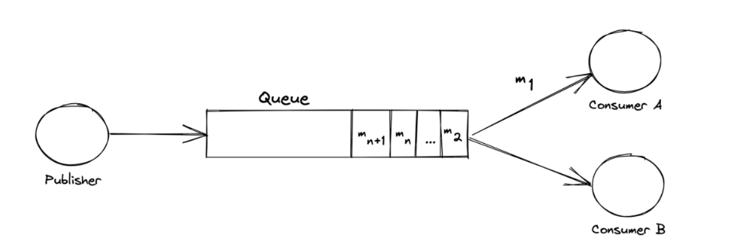
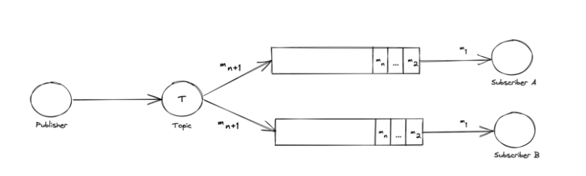

- Message queue
  - Message queue 종류
  - Message queue 차이점
  - Message queue 

---

- [Kafka vs RabbitMQ](https://aws.amazon.com/ko/compare/the-difference-between-rabbitmq-and-kafka/#:~:text=RabbitMQ%20is%20a%20general%2Dpurpose,why%20they%20handle%20messaging%20differently.)
  - kafka
    - 아키텍처
      - RabbitMQ의 생산자는 메시지를 보내고 메시지가 의도한 소비자에게 도착하는지 모니터링
      - 우편물을 받아서 수취인에게 배달하는 우체국
    - 메세지 처리 방식
      - 소비자가 polling 하는 방식
      - 메세지 우선순위 설정 불가. 그냥 순차 처리
      - 로그파일에 append하는 방식이기때문에, 보존기간이 만료될때까지 보관. 그래서 소비자는 해당 기간내에 언제든지 데이터를 다시 처리 가능
    - 성능
      - RabbitMQ보다 메세지 전송속도와 용량이 월등히 우수
      - Kafka는 순차 디스크 I/O를 사용하여 처리량이 높은 메시지를 교환할 수 있으므로 초당 수백만 개의 메시지를 전송
    - 프로토콜
      - TCP를 통한 바이너리 프로토콜을 사용하여 실시간 데이터 파이프라인에서 메시지를 스트리밍
  - RabbitMQ  
    - 아키텍처
      - Kafka의 생산자는 소비자가 메시지를 검색했는지 여부에 관계없이 메시지를 대기열에 게시
      - 생산자가 게시하는 다양한 장르의 메시지를 진열대에 정리하는 도서관. 그 후 소비자는 각 진열대에 진열된 메시지를 읽고 읽은 내용을 기억
    - 메세지 처리 방식
      - 브로커에서 push하여 소비자가 받음
      - 메세지 우선순위설정 가능
      - RabbitMQ 브로커가 메세지를 대상 대기열로 라우팅하고, 소비자가 해당 메세지를 읽어서 브로커에게 확인(ACK) 응답을 보내면, 대기열에서 해당 메세지 삭제
    - 성능
      - 초당 수백만 개의 메시지를 보낼 수 있지만, 그렇게 하려면 브로커가 여러 개 필요. RabbitMQ의 성능은 평균적으로 초당 수천 개의 메시지이며 RabbitMQ의 대기열이 혼잡하면 속도가 느려질 수 있음
    - 프로토콜
      - Advanced Message Queuing Protocol(AMQP)을 지원
      - Simple Text Orientated Messaging Protocol(STOMP) 및 MQTT와 같은 레거시 프로토콜을 지원
  - 위 둘의 유사점?
    - 둘다 확장에 용이
    - 장애에 대한 복원력이 뛰어남
  - 뭘쓰는게좋나?
    - 수신된 데이터를 다시 분석해야 하는 애플리케이션에서는 `kafka`
      - 보존 기간 내에 스트리밍 데이터를 여러 번 처리할 수도 있고 로그 파일을 수집하여 분석할 수도 있음
    - 실시간 데이터 처리를 수행시, 메세지 스트리밍할때 지연시간이 매우 짧기에 스트리밍 데이터를 실시간 분석해야한다면 `kafka`
    - 복잡한 라우팅이 필요하다면 `RabbitMQ`
      - kafka가 어떤부분에서 이런 처리가 어려울지.. 확인필요
    - MQTT나 STOMP와 같은 레거시 프로토콜과 호환되어야 하는 클라이언트 애플리케이션에서는 `RabbitMQ`

--- 

- [message broker vs event broker 어떤걸 선택해야하나](https://medium.com/riskified-technology/message-broker-vs-event-broker-when-to-use-each-one-of-them-15597320a8ba)
  - message broker
    - 서비스나 컴포넌트가 서로 통신하는데 사용. 생산자로부터 받은 메세지를 비동기방식으로 소비자에게 전송하여 애플리케이션 간의 정보교환
    - 대기열에 있는 메세지를 소비하면 바로 제거
    - 대기열의 메시지 처리 순서는 보장되지않고 변경될 수 있음 (이건 이상함..)
    - push 방식 (rabbitMQ)
    - consumer가 메세지 성공처리에 대한 책임이 있으나, 실패처리는 주로 메세지 브로커에서 담당 (rabbitMQ)
  - event broker
    - 이벤트 시퀀스가 저장됨.
    - topic이나 queue에 있는 이벤트들은 불변이며 그들의 순서도 변경될 수 없다 (이건 message broker도 마찬가지일듯)
    - 이벤트가 queue나 topic으로 발행시에 브로커는 다양한 유형의 구독자에게 이벤트를 사용가능하도록 해준다
    - 당연 producer와 consumer 는 서로 알 필요없다
    - consumer(subscriber)가 이벤트를 처리해도, 큐나 토픽에서 이를 지우지 않는다
    - polling 방식(kafka)
    - consumer가 메세지에대한 성공, 실패에 대한 처리를 수행해야함 (kafka)
  - => 정리
    - event broker와 message broker의 큰 차이는 처리량(event broker가 높은 처리량)과 큐에서 데이터 처리시 삭제하느냐 아니냐의 차이인듯함
      - event broker는 topic에서 데이터 처리시 지우지않기때문에 남아있는 데이터를 통해서 새로운 기능을 추가하여 작업을 수행하기 좋음
      - 반면 message broker는 발행하는 시점에 broker에서 어느 큐로 데이터를 발행할지(혹은 브로드캐스트)를 알아야하고 그때 소비하면 끝이므로, 추후 새로운 기능추가시 기존 데이터 활용이 어려움
    - 하지만 Kafka와 RabbitMQ에서 
 

- event bus
- message bus

---

- [message broker vs event broker](https://solace.com/what-is-an-event-broker/#:~:text=They%20both%20support%20various%20qualities,%2Dtime%20publish%2Fsubscribe%20interactions.)
  - They both support various qualities of services such as non-persistent and persistent delivery through the use of queues, but generally speaking message brokers are better at point-to-point and queue-oriented data exchange, while event brokers are better at real-time publish/subscribe interactions.
    - 여기 기준으로면 kafka는 event broker 느낌인데, 굳이 나누는게 의미가 있나 싶음. 말장난 같은느낌..; RabbitMQ는 보통 message broker라고 많이들하는데, pub-sub으로도 동작가능하니.. 뭔가 이부분에 정의를 딱 나누기엔 애매한듯하다..
    - Message Broker는 point-to-point 즉, 특정대상이기에 그 대상에게 전달해주는 의미가 강한듯함. 그래서 특정 대상이 소비하면 끝인느낌.. 반면, Event Broker는 실시간으로 빠르게 이벤트를 전달하는것뿐아니라, 처리한 메세지를 소비하면 끝인 구조가 아니기에 consuming하는 대상이 추가되면 저장되어있는 topic의 메세지를 처음부터 전달받을 수 있음 (요게 맞나..)
      - [kafka는 전통적인 message broker를 대체할수 있다. 하지만, message broker라고 부르진 않는듯함..? ](https://kafka.apache.org/documentation/#uses_messaging)

- [pub-sub vs message-queue](https://www.baeldung.com/pub-sub-vs-message-queues)
  - message queue
    - 메세지 큐는 서비스를 발행하는 것(producer)과, 서비스를 소비하는것(consumer)으로 구성된다
      - 큐를 통해 상호간 통신을 하는것..
    - 통신은 주로 생산자가 발행한것을 소비자가 소비하는 한 방향으로 이루어짐
    - 보통은 queue에서 push 방식으로 소비자에게 전달되기때문에, 여러 소비자 중 하나의 소비자에게만 전달 (여러 소비자가 동일한 데이터를 push 받지못함)
    - 언제쓰는게 좋나?
      - 일을 특정 서비스에게 위임하고싶을떄 사용. (그렇게 함으로써 오직 한번만 일이 실행됨을 보장)
      - 소비자를 수평확장(스케일 아웃)하기 좋기때문에, 마이크로서비스, 클라우드환경이나 서버리스에서 많이사용
        - 큐에 일이 많이 쌓여있으면, 소비자를 늘려서(스케일 아웃) 처리
        - 일이 줄면, 소비자를 줄이면되니 비용을 save하기도 좋음
    - 
  - pub-sub?
    - pub-sub 아키텍처는 publisher가 발행한 메세지를 subscriber(Consumer)가 적어도 한번은 소비하는 구조
    - 즉 여러 구독자(subscriber)는 publsher가 발행한 메세지를 모두 받을 수 있다 (요게 message queue와 다른 핵심)
    - publisher가 message queue 로 바로 전달하는게아닌, topic이 이를 받아서, 구독자 모두에게 발행하게됨  
    -  
  - message queue, pub-sub의 비교
    - 둘다 수평확장(스케일아웃)과 고가용성에 매우 뛰어남
      - 무엇보다 기존의 동기식 통신보다 내구성(durable)이 좋다
        - 예를들어, http 로 비동기로 요청을보내게되면, 해당 인스턴스가 장애시 데이터를 잃어버리게되며 반드시 retry가 필요하다
        - 하지만, MQ를 사용하게되면 살아있는 다른 인스턴스가 이를 consuming하여 처리할것이고 혹은 다운되어있던게 다시 정상화되면 consuming하지 못한 데이터부터 처리를 시작할것..
    - pub-sub과 message queue중에 어떤 아키텍처를 고르나?
      - "모든 소비자가 모든 메시지를 받는 것이 중요한가?" 라는 물음을 통해서 적절한 소비자의 방식을 선택하면됨
  
---

- [Message Brokers vs. Enterprise Service Buses](https://www.baeldung.com/cs/message-broker-vs-esb)
  - 그렇게 중요하진않을듯.. 나중에 필요하면 살펴보자