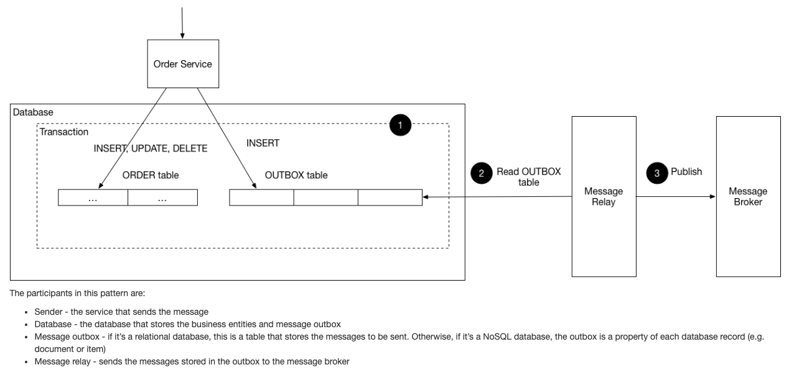

transactional outbox pattern

- 뭐지?
  - 분산환경에서 db와 메세지 브로커 사용시 트랜잭션 완료시 이벤트 발행관련하여 이에 대한 명확한 보장을 위해 필요한 패턴
    - https://microservices.io/patterns/data/transactional-outbox.html
    - 
      - outbox 테이블 생성하여 실제 상태변경에 따른 DB 수정과 같은 작업을 완료하여야 outbox 테이블에 데이터가 들어가게되고, 이를 relay 해주는 작업(하나의 어플리케이션이 될 수도 있으며, outbox 테이블을 주기적으로 조회하고 완료된 대상에 대해서 메세지 발행)을 수행하여, db에 변경된 작업이 온전히 수행된것을 보장한 대상에 대해서 이벤트를 발행(메시지 큐)한다.
        - 이를 통해 메시지 큐와 분산 시스템에서 데이터 일관성을 유지함
  - 이를 통해서 데이터베이스 작업과 메시지 전송을 하나의 트랜잭션으로 묶어 처리할 수 있음
- 구체적으로 어떤 문제가 발생할 수 있길래 만들어진 패턴?
  - 이벤트 발행시 데이터 정합성이 안맞을수도...
    - db 상태변경이 일어났으나 커밋이전에 이벤트를 발행시 커밋에러나면 이벤트는 발행됐지만 롤백되어 작업을 수행하면안된다.. 
    - 모두 정상적으로 동작하였지만, db의 적용이 느릴경우, 이벤트를 컨슘하는쪽에서 관련 데이터를 조회하였을때 여전히 이전의데이터를 보고있을수 있다..
    - [관련 상세 예시](https://blog.gangnamunni.com/post/transactional-outbox/)

- spring 에서는 어떤방식으로 사용할 수 있을까?
  - https://medium.com/@greg.shiny82/%EC%8B%A4%EB%AC%B4-%EA%B4%80%EC%A0%90%EC%97%90%EC%84%9C%EC%9D%98-apache-kafka-%ED%99%9C%EC%9A%A9-023d468f9182
  - https://medium.com/@greg.shiny82/%ED%8A%B8%EB%9E%9C%EC%9E%AD%EC%85%94%EB%84%90-%EC%95%84%EC%9B%83%EB%B0%95%EC%8A%A4-%ED%8C%A8%ED%84%B4%EC%9D%98-%EC%8B%A4%EC%A0%9C-%EA%B5%AC%ED%98%84-%EC%82%AC%EB%A1%80-29cm-0f822fc23edb
    - 모든 이벤트 처리를 트랜잭셔널 아웃박스 패턴으로만 사용하는게 아닌, 장애난 부분만 해당 패턴으로 알아내서 재처리와 같은 작업을 수행하는것도 좋은것 같음
    - 결국 위에서는 `@TransactionalEventListener` 활용하여 outbox 테이블에 기록도하고, 이벤트를 발행하기도 함
      - `@TransactionalEventListener` 는 트랜잭션을 사용하는 대상에 한하여 즉, 트랜잭션 이벤트가 발생하였을때 처리해주는 어노테이션인데, 여기에 셋팅되는 TransactionPhase(after_commit, before_commit 등)에 따라 호출 시점이 결정된다
        - https://docs.spring.io/spring-framework/docs/current/javadoc-api/org/springframework/transaction/event/TransactionalEventListener.html
        - https://docs.spring.io/spring-framework/docs/current/javadoc-api/org/springframework/transaction/event/TransactionPhase.html 
      - outbox 테이블에는 before_commit으로 셋팅하여, 해당 트랜잭션의 커밋 전에 테이블에 기록하는 로직을 수행한다
        - 여기서 테이블에 기록하는 db 작업을 진행할때는 기존에 진행중인 트랜잭션을 사용하게된다
        - 즉, outbox 테이블에 삽입한뒤에 commit 발생시 에러나면, 기존 db작업하는것도 롤백되고, outbox 테이블에 삽입한 데이터도 롤백이된다
        - 이를 통해서 outbox 테이블에 삽인된 데이터는 항상 기존 db작업이 온전히 commit이 완료되었다는것을 보장할 수 있다
      - 이벤트를 발행하는 로직은 after_commit으로 셋팅하여, 해당 트랜잭션 커밋 이후에 kafka와 같은 메세지큐에 이벤트를 발행한다
        - 메세지큐에 이벤트 발행 실패하면?
          - outbox 테이블에서 발행실패한 대상들의 상태를 update(ex. send_fail)하여 배치를 활용하여 outbox 테이블의 재처리해야하는 대상들을 처리
          - 참고로 after_commit 이후에 db 작업을 수행하면 정상적으로 처리 안된다. 아래 내용 참고
            - https://findstar.pe.kr/2022/09/17/points-to-consider-when-using-the-Spring-Events-feature/
              - 위 내용은 after_commit으로 선언된 메서드 내부 DB작업 발생시 동작안하는거에 대한 해결책 제시.. (REQUIRE_NEW 추가 등)
    - spring에서 db 작업시 보통 `@Transactional`을 사용하여 aop 기반으로 트랜잭션을 처리하게되는데, `@Transactional`이 선언된 메서드에서 db작업하고, outbox 테이블에 데이터도 넣고, 이벤트를 발행하
    
