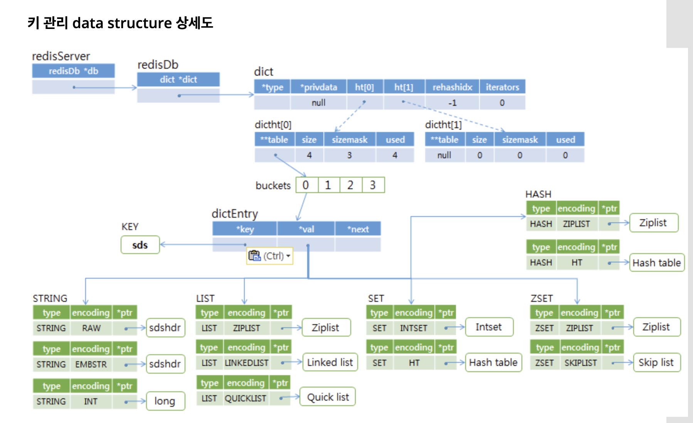

- redis cluster
  - 레디스 버전 3.0 이상에서 클러스터를 사용가능
  - 토폴로지: 메쉬 사용
    - 
    - 모든 노드가 클러스터 구성 정보(슬롯 할당 정보)를 가지고 있음.
      - 클라이언트는 어느 노드든지 접속해서 클러스터 구성 정보(슬롯 할당 정보)를 가져와서 보유하며, 입력되는 키(key)에 따라 해당 노드에 접속해서 처리
        - 클라이언트는 서버와 동일한 hash 함수를 가지고 있으며, 마스터 서버에 접속해서 각 서버에 할당된 슬롯 정보를 가지고 있다. 키가 입력되면 hash 함수를 적용해서 어느 마스터에 저장할지 판단해서 해당 마스터에 저장한다.
      - 일부 노드가 다운되어도 다른 노드에 영향을 주지않지만, 과반수 이상의 노드가 다운되면 레디스 클러스터는 멈추게됨.
        - 만약 하나의 Master와 그와 연계된 Slave 노드가 다운되면..?
  - 키-노드 할당 방식
    - 해시 할당(Hash Assignment)
      - Key에 Hash 함수를 적용해서 노드를 할당
        - 해시 함수는 CRC16 function을 사용
          - [CRC16 설명](https://ko.wikipedia.org/wiki/%EC%88%9C%ED%99%98_%EC%A4%91%EB%B3%B5_%EA%B2%80%EC%82%AC)
          - `HASH_SLOT = CRC16(key) mod 16384`
      - 노드 개수와 무관하고 모든 노드에 일정하게 데이터가 할당
      - 레디스 서버가 10대 있을 경우 입력된 키를 그 중 한 서버로 들어가게 하기 위해서, 입력된 키에 해시 함수(Hash function)을 적용해 1 부터 100까지의 숫자로 만들어서, 1 부터 10까지는 1번 서버에 넣고, 11번 부터 20번까지는 2번 서버에 넣고, 계속 진행해서, 91번 부터 100번까지는 10번 서버에 할당
        - 1 부터 100까지의 숫자를 슬롯(slot)이라 함
        - 모든 서버는 자신이 보유하고 있는 슬롯 정보를 가지고 있으며, cluster nodes 명령으로 각 서버에 할당된 슬롯 정보를 얻을 수 있다
      - 레디스 클러스터는 16384개의 슬롯을 사용
      - 슬롯 번호는 0~16383이고, 이 슬롯을 노드에 할당.
        - ex. 레디스 노드가 3개 일 경우, 1번 노드는 0-5460, 2번 노드는 5461-10922, 3번 노드는 10923-16383 슬롯을 가지게 된다.  
    
  - 레디스 클러스터 목표
    - 1000대의 노드까지 확장할 수 있도록 설계
    - 노드 추가, 삭제 시 레디스 클러스터 전체를 중지할 필요 없고, 키 이동 시에만 해당 키에 대해서만 잠시 멈출 수 있음
  - 클라이언트가 서버에 접근하는 방식 (slot에 저장하는 방식)
    - 하나의 서버(노드)에는 여러개의 slot이 셋팅된다. 노드들은 각 노드들의 slot에 대한 정보들을 가지고있고, 클라이언트는 각 서버에 할당된 slot 정보를 가져올 수 있다. 그리고 셋팅하고자하는 key를 계산하여 어떤 slot으로 가야하는 놈인지를 보고, 해당 slot을 가지고있는 서버로 접근해서 데이터를 저장/조회한다 
  - 클러스터를 구성하기위해서는 레디스 노드는 최소 3개 이상을 지정해야한다
    - 노드추가 순서
      - Step 1 : 레디스 준비, port 7003
      - Step 2 : 노드 추가, add-node
      - Step 3 : Slot 할당, resharding
    - 노드제거 순서
      - Step 1 : Resharding
      - Step 2 : 노드 제거, del-node
  - 고가용성을 위해서는 어떻게 배치하는게좋을까?
    - 총 서버가 3대라면?
      - 하나의 마스터노드에 하나의 슬레이브 노드가
- 용어정리
  - 데이터 파티셔닝(Data Partitioning)
    - 대량의 데이터를 처리하기 위해 DBMS 안에서 분할하는 방식.
    - 하나의 DBMS에서 저장공간을 여러개 두는것..
    - Scale up   ---»   1 Machine   ---»   1 DBMS   ---»   Data Partitioning
  - 데이터 샤딩(Data Sharding)
    - 대량의 데이터를 처리하기 위해 여러개의 DBMS에 분할하는 기술
    - 파티셔닝과 달리 DBMS 내부적으로 저장공간을 쪼개는게 아니라 DBMS밖에서 데이터를 나누는 방식
    - 샤드 수에 따라 DBMS를 여러대 설치필요
    - Scale out   ---»   n Machines/VMs   ---»   n DBMSs   ---»   Data Sharding
  - 토폴로지 Topology
    - 토폴로지(영어: topology, 문화어: 망구성방식)는 컴퓨터 네트워크의 요소들(링크, 노드 등)을 물리적으로 연결해 놓은 것, 또는 그 연결 방식을 말한다.
    - [토폴로지](https://ko.wikipedia.org/wiki/%EB%84%A4%ED%8A%B8%EC%9B%8C%ED%81%AC_%ED%86%A0%ED%8F%B4%EB%A1%9C%EC%A7%80)
    - 단일 장애점(Single point of failure)이 없는 토폴로지: 메쉬(Mesh)   ---»   Redis Cluster
      - 모든것을 관리하는 별도의 마스터 노드를 두지않는 구조
      - 

- [세부내용참고](http://redisgate.kr/redis/cluster/cluster.php)

---

- redis sentinel
  - 마스터와 복제를 감시하고 있다가 마스터가 다운되면 이를 감지해서 관리자의 개입없이 자동으로 복제를 마스터로 올려줌
  - 주요기능
    - 모니터링 Monitoring : 센티널은 레디스 마스터, 복제들을 제대로 동작하는지 지속적으로 감시
    - 자동 장애조치 Automatic Failover : 
      - 센티널은 레디스 마스터가 다운되었을때 복제를 새로운 마스터로 승격시켜줌. 
      - 또한, 복제가 여러대 있을 경우 이 복제들이 새로운 마스터로 부터 데이터를 받을 수 있도록 재구성하고 
      - 다운된 마스터가 재 시작했을때 복제로 전환되어 새로운 마스터 볼 수 있도록 해준다.
    - 알림 Notification : 센티널은 감시하고 있는 레디스 인스턴스들이 failover 되었을 때 Pub/Sub으로 Application(client)에게 알리거나 shell script로 관리자에게 이메일이나 SMS로 알릴 수 있다
  - 장애조치(fail over)
    - SDOWN : Subjectively down(주관적 다운)이라고 합니다. 이는 센티널에서 주기적으로 마스터에 보내는 PING과 INFO 명령의 응답이 3초(down-after-milliseconds 에서 설정한 값) 동안 오지 않으면 주관적 다운으로 인지합니다. 이는 센티널 한 대에서만 판단한 것입니다. 주관적 다운만으로는 장애조치를 진행하지 않습니다.
    - ODOWN : Objectively down(객관적 다운)이라고 합니다. 이는 설정한 quorum 이상의 센티널에서 해당 마스터가 다운되었다고 인지하면 객관적 다운으로 인정하고 장애조치를 진행합니다.
- [세부내용참고](http://redisgate.kr/redis/sentinel/sentinel.php)

---


- cluster vs sentinel
  - https://www.baeldung.com/redis-sentinel-vs-clustering
  - cluster나 sentinel은 redis의 배포전략이다. (레디스를 어떻게 고가용성으로 쓸수 있을까~)
  - cluster와 sentinel의 주된 차이는 샤딩(스케일 아웃) 여부다
    - > The difference is the sharding capabilities, which allow us to scale out capacity almost linearly up to 1000 nodes.
  - basic concept
    - redis 서버는 16개의 database가 있다.
      - 16개의 데이터베이스가 있기에, 같은 key라도 데이터베이스가 다르면 값이 다를 수 있다
    - hash slot은 redis cluster 에서 사용한다
      - redis cluster에서는 16384개의 해시 슬롯을 사용하며, CRC16의 해싱 알고리즘을 사용해서 해시 슬롯에 데이터를 저장한다
      - redis cluster는 1개의 database를 사용한다
        - > Also, given the particularities of this approach, the Redis Cluster doesn't allow multiple logical databases per node. Therefore, only the database zero is available in each node.
      - 모든 키가 동일한 해시 슬롯에 속해야지만 multiple key operations 을 사용할 수 있다
        - 즉, 16384개의 슬롯중에 동일한 곳에 저장되어있는 대상만 multiple key operation을 사용할 수 있으므로, 쉽지않음..
        - >  Redis Cluster has a caveat when it comes to multiple key operations. Those operations are still available, although all the keys involved have to belong to the same hash slot. Otherwise, Redis rejects the request.
    - Hash Tags
      - 이를 활용해서 같은 hash slot에 여러 key들을 넣을 수 있다
      - {} 안에있는 값으로만 hash 계산
        ```
          // 아래 두개는 같은 slot에 저장
          {foo}_my_key
          {foo}_your_key
        ```
    - cluster, sentinel 모두 비동기 복제를 사용
      - redis 복제본이 쓰기를 완료(acknoledge) 할때까지 기다리지않는다
      - 그렇기때문에 복제시 절대로 손실되지않는다는 보장은 할 수 없다
    - 장애조치
      - cluster, sentinel 모두 상태 확인 및 시간 초과를 기반으로 하는 오류 감지기가 존재
    - Master Election
      - sentinel
        - sentinel 인스턴스의 숫자의 과반이 문제가 있다고 여겨지면 적절한 복제본 찾아서 마스터 선출
          - quorum을 지정가능 (quorum 지정값에 따라 장애조치 시작을 결정.. ex. 3개의 센티널 인스턴스가 있고, quorum이 2라면, 2대의 센티널 인스턴스가 마스터 장애를 인지해야 failover 수행 )
      - redis cluster
        - matser가 고장나면 replica가 마스터가된다..(심플한느낌..)
          - 모든 노드(마스터, 복제본 모두)가 서로 통신하고있기때문에, 만약 마스터 노드가 죽으면 선거를 시작하고, 해당 마스터의 적절한 복제본이 선출됨  
      - => 결국 투표 메커니즘이 작동되기때문에, redis 클러스터는 항상 홀수개의 노드를 사용할 것을 권장 (sentinel, redis cluster 모두에게 필요)
    - [Network patition](https://www.baeldung.com/redis-sentinel-vs-clustering#7-network-partition)
      - 네트워크가 분리되어있는 경우, 짝수일때 나타날수 있는 이슈 나옴
      - ex.
        - sentinel
        - 총 4개의 sentinel, quorum 2
        - 네트워크 망은 두개로 분리 : (1)Master Slave / (2)Slave Slave
        - Master가 다운되지않았음에도, (1)과 (2)의 네트워크 문제가 생겼을경우, (2)를 각각 바라보고 있는 센티널 인스턴스들은 Master에 장애가 났다고 인식하여 각각 에러를 보고하고, quourm이 2로 셋팅되어있으므로 둘중에 Master를 선출해버린다. 그렇게되었을때, (1)에도 Master가 있고, (2)에도 Master가 있게된다.. 이런 상황에서 만약 같이 key에 다른 값이 생길수 있고, 치명적인 이슈가 발생하게된다..
      
    - [그림으로 정리](https://www.baeldung.com/redis-sentinel-vs-clustering#redis-sentinel-vs-clustering)
      

      - sentinel은 scale up을 하여야하기때문에, 확장에 제한적.. 중소프로젝트의 경우 괜춘
        - sentinel은 적은 수의 노드가 있으면 되기에 비용에 있어서 좋다 (소수의 좋은서버를 기반으로 Master / Slave 구조로..)
      - redis cluster는 샤딩 기능(scale out)으로 1000개 노드까지 확장 가능하도록 설계
        - 노드를 많이 할 수록 더 많은 처리량과 재해 관련해서도 유리함
        - sentinel 에서 나타나는 네트워크 파티션에 따른 오작동(Master 두개생성..)과 상관없는 구조..?
        - 노드(서버)가 결국 비용과 직결되기때문에 더 많은 비용이 든다
        - 많은 처리량을 수행해야하고 확장이 필요한 대규모 프로젝트에 유리!!

---

- redis server
  - 디스크에 데이터를 저장하는 방법
    - RDB
      - snapshot 개념
    - AOF (append only file)
      - 조회 명령 제외하고 입력/수정/삭제 명령을 디스크에 저장
    - => 대부분의 경우 AOF에 everysec를 선택하는 것이 적합
  - 5 Data Types
    - 레디스는 5개 데이터 타입 중에서 하나만 key-value 방식이고, 다른 4개는 키 하나에 여러 개 값을 관리하는 방식이다. 소트 기능, 필드-값 기능도 있으므로 key-value만 제공하는 다른 key-value 데이터베이스보다 활용도가 높다.
    - 종류
      - Strings 문자열
        - 내부데이터 구조
          - http://redisgate.kr/redis/configuration/internal_string.php
            - SDS 관련 설명 나옴!
      - Lists 리스트
      - Sets 셋
      - SortedSets 소트셋
      - Hashes 해시
  - 성능테스트
    - 서버사양
      - Redis Server : Version 3.0.1
      - OS : CentOS 7
      - H/W Model: HP DL320e Gen8 v2
      - Processor : Intel Xeon E3-1231V3.3 3.4GHz
      - Main Memory: DDR3 8GB RAM
      - Disk 1: SSD 256GB
      - Disk 2: SATA3 1TB
    - 결과
      - SET, INCR, LPUSH 같은 대표적인 명령들이 초당 26만회 정도 처리
      - 1KB 의 데이터를 set하였을때..
        - 94250.71 requests per second <- aof on everysec
  - Key관리 내부구조 (http://redisgate.kr/redis/configuration/internal_key_hashtable.php)
    - 키 관리에 hash table 을 사용
    - 10KB 의 데이터를 set하였을때..
      - 31486.14 requests per second <- aof on everysec
      - 93196.65 requests per second <- aof no
    - 그림으로설명
      - 
        - 문자열을 저장하는데 SDS(Simple Dynamic Strings) 구조체를 사용
          - 
        - dictEntry에는 key의 주소값, 즉 SDS의 주소를 가지고있다.. 이 SDS에는 문자열이 들어있으니 이를 통해서 key가 맞는지 확인한다
        - 또한 dictEntry의 val은 redisObject를 가리키고있는데, redisObject의 type이 STRING, LIST, SET, SORTED SET, HASH 총 5개가 된다.. 
          - 
      - 
- redis module 중에 hibernate를 활용해서 redis 자체적으로 db에 알아서 저장해주는 기능도 있다
  - hibernate 활용
  - xml으로 설정 (connector, data mapping)
  - https://docs.redis.com/latest/modules/redisgears/jvm/recipes/write-behind/

---


