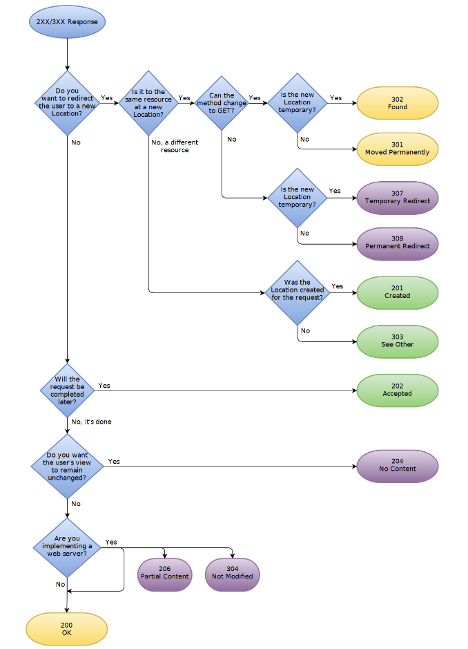

HTTP redirect
- 3xx
  - 3xx는 클라가 다른 url을 찾기 위하여 주는 서버의 응답코드..
  - Location도 같이 넘겨주는데, 클라이언트는 3xx 로 응답이 오면, Location을 확인하여 거기로 넘긴다
    - 304는 Location이 어떻게잡히려나..?
- 301
  - Moved Permanently
    - means that the resource (page) is moved permanently to a new location. The client/browser should not attempt to request the original location but use the new location from now on.
    - The 301 is a permanent redirection. Even if you remove the redirection from the server, your browser continuously redirects the resources to the new domain or HTTPS, because of the hard cache.
  - 메서드 변경 (GET)
  - 캐시 o
    - 특별히 지정하지않으면 만료일이 없다..
  - 사용예시
    - 웹사이트 이전
    - http -> https
- 302
  - Found
    -  means that the resource is temporarily located somewhere else, and the client/browser should continue requesting the original URL.
  - 메서드 변경 (GET)
  - 캐시
    - 기본값은 캐싱안함
  - 사용예시
    - 모바일 전용사이트, 관리페이지 표시
- 303
  - See Other
  - 메서드 변경 (GET)
  - 캐시 
    - 기본값은 캐싱안함
  - 사용예시
    - 로그인 후 원래페이지로 이동하는 경우
- 304
  - Not Modified
- 307
  - Temporary Redirect
  - 기존 요청 메서드 유지 (body 포함)
  - 캐시
    - 기본값은 캐싱안함
- 308
  - Permanent Redirect
  - 기존 요청 메서드 유지 (body 포함)
  - 유의할점..
    - RFC 7538 에 소개된것이 308인데, 이는 2015년부터 도입되엇기때문에 브라우저가 호환되는지를 확인해야함..
      - 윈도우7의 IE11은 작동안한다함.. redirect안되고 그냥 빈페이지 보여준다함..
  - 캐시 o
    - 특별히 지정하지않으면 만료일이 없다..

- http->https redirect 적용이나 예전 도메인에서 새로운 도메인으로 redirect할때 주의할점 (https://dev.to/epranka/clear-the-301-302-redirection-cache-chrome-4dio)
  - 기존 http는 사용하지않는다는 의미이므로 영구적으로 변경이 필요하기때문에 301이 의미가 맞음
  - 하지만, 301로 바로 바꾸지마라!
    - 일단 302로 해놓고 충분히 문제가없다는게 판단되면 301로 변경하라!
  - 만약 301로 배포했는데 리다이렉션되는 페이지에 문제가 생기는 부분이 있다면, 서버쪽에서 수정하고 다시 배포해도 브라우저(클라이언트)가 캐시를 지우지않는 이상 계속 해당 에러를 보게될것이다..!!(최악이다)

- 
  - https://forlater.tistory.com/371

- haproxy 301 redirect without cache
  - https://ypereirareis.github.io/blog/2019/06/04/haproxy-301-redirect-without-cache/ 

- 3xx 관련 설명 굿 : https://www.drlinkcheck.com/blog/http-redirects-301-302-303-307-308
- 301로 영구리다이렉트 되었을 경우 해결방법
  - https://stackoverflow.com/questions/9130422/how-long-do-browsers-cache-http-301s
  - 참고로 301로 영구리다이렉트 했을때, 캐시관련 헤더를 어떻게 셋팅하느냐에 따라 영구 리다이렉트를 막을 수 있긴한데, 그렇게되면 301 쓰지말고 302써라..