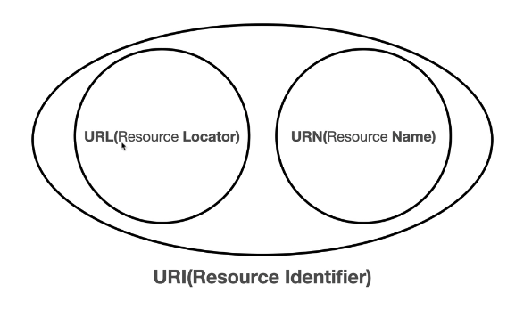
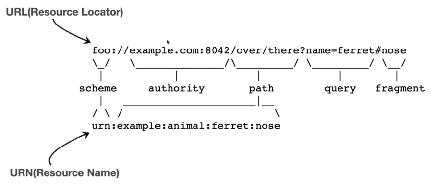
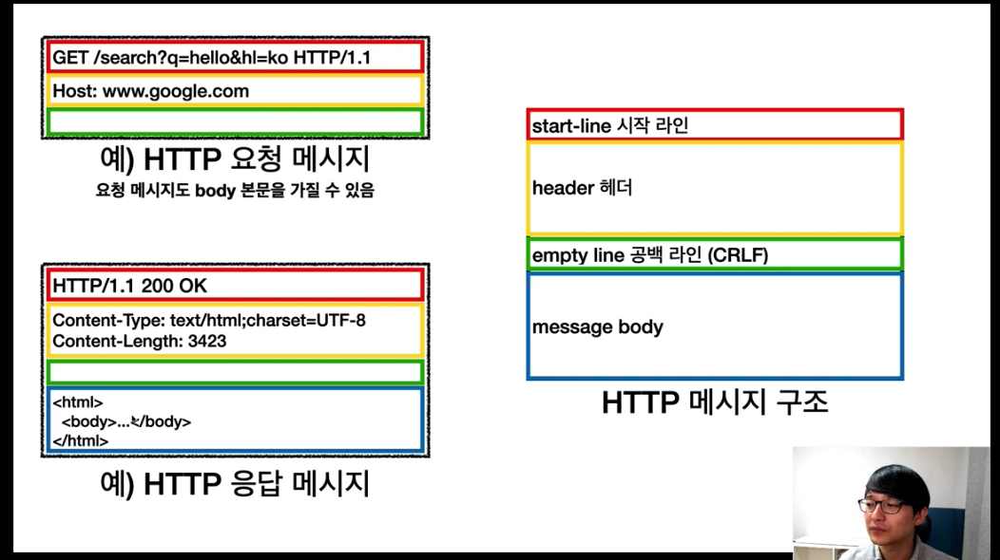
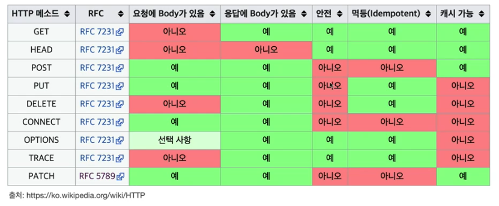
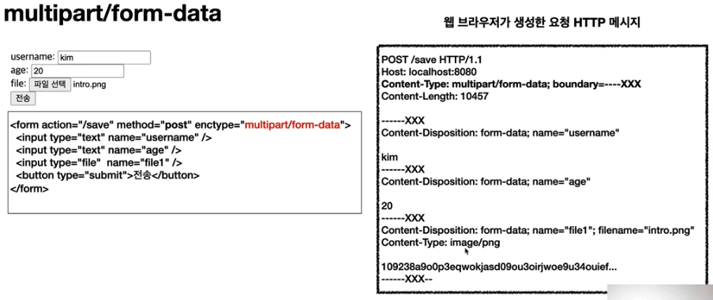

HTTP_김영한

- 인터넷 네트워크
  - IP 프로토콜(인터넷 프로토콜)
    - 지정한 IP로 데이터전달
    - 패킷이라는 통신단위로 데이터전달
    - 여러 노드를 거쳐서 최종적으로 지정한 IP로 전달됨
    - 출발지IP, 목적지IP, 기타.. 가 들어감
    - IP 프로토콜의 한계
      - 비연결성
        - 패킷을 받을 대상이 없거나 서비스 불능상태여도 패킷전송함
      - 비신뢰성
        - 중간에 패킷사라져..
        - 패킷이 순서대로 안가..
      - 프로그램 구분
    - 이런문제를 해결해주는게 TCP 프로토콜!
  - TCP 와 UDP
    - TCP
      - 인터넷프로토콜과 같은 신뢰성이 떨이지는것에 TCP가 보완해주는느낌
      - 출발지 PORT, 목적지 PORT, 전송제어, 순서, 검증정보.. 등등이 기존 인터넷프로토콜에 추가됨
      - 특징
        - 연결지향
          - TCP 3 way handshake (가상연결)
          - 데이터 보내기전에 연결을 확증하는 과정
          
            | A(cli) | B(server) |
            |---|---|
            |sync||
            ||ack+sync|
            |ack||
            - sync: 접속요청
            - ack : 요청수락
            - 요거 이후에 데이터 송수신
        - 데이터 전달 보증
          - 데이터 전송하면 서버에서 데이터 잘받았다고 응답해준다..
        - 순서보장
          - 중간에 순서가 잘 안맞으면 다시 보내달라고 요청
        - 신뢰할수잇는 프로토콜
        - 현재는 대부분 TCP 사용
    - UDP
      - 특징
        - 연결지향 x
        - 데이터전달보증x
        - 순서보장 x
        - 데이터 전달 및 순서가 보장되지않지만, 단순하고 빠름
        - IP프로토콜에 그냥 포트와 체크섬 정도만 추가
        - 애플리케이션레벨에서 추가 작업하기 용이
        - 최근에 뜨고있음.. HTTP3에서 TCP의 복잡함 줄이자고 UDP 사용
  - PORT
    - IP로 많은 패킷들이 넘어오는데, 해당 IP의 어떤 application으로 전달해야할것인지를 구분할수있도록 해준다
    - 요청받은 서버가 응답까지 해줄수 있는이유는, 요청시에 TCP 프로토콜에서 자신의 ip와 port가 무엇인지를 서버에게 전달해주기떄문에, 이를 기반으로 응답해준다!
  - DNS(Domain Name System)
    - 도메인 명을 IP 주소로변환
    - IP는 기억하기가 어렵고 변경도 자주될수있기때문에 DNS를 사용

- URI와 웹 브러아주 요청흐름
  - URI(Uniform Resource Identifier)
    - 단어뜻
      - Uniform : 리소스 식별하는 통일된 방식
      - Resource : 자원, URI로 식별할수있는 모든것(제한없음)
      - Identifier : 다른 항목과 분하는데 필요한 정보
    - URI는 로케이터(locator), 이름(name) 또는 둘다 추가로 분류될수 있다
    - 
    - URL : 리소스의 위치
      - 문법
        - scheme://\[userinfo@\]host\[:port\]\[/path\]\[?query\]\[#fragment\]
        - https://www.google.com:443/search?q=hello&hl=ko
        - scheme
          - 주로 프로토콜 사용
            - 프로토콜은 어떤 방식으로 자원에 접근할 것인가 하는 약속
        - userinfo@
          - 거의안씀.. URL에 사용자 정보 인증해야할때씀
        - path
          - 보통 계층적으로 사용
          - /user/10  //user들중에 10번인놈
        - query
          - key=value 형태
          - ?로 시작, &로 추가가능
          - query parameter, query string으로 불림.. 모두 문자형태
        - fragment
          - html 내부 북마크 등에 사용
          - 서버에 전송하는 정보는아님
    - URN : 리소스의 이름.. 거의안씀..
      - 이름 변경이 안됨..
    - ex)
      - 
  - 웹브라우저의 요청흐름
    1. 웹 브라우저가 HTTP 메세지 생성 (애플리케이션)
       - GET, POST .. 이런것들
    2. SOCKET 라이브러리를 통해 전달 (애플리케이션)
       - 여기서 3 way handshake 를 통해 연결(논리적)이 일어나고, 보낼 데이터(HTTP 메세지포함) 3번으로 전달
    3. TCP/IP 패킷 생성, HTTP 메시지 포함 (OS)
       - 전달받은 데이터에 대상 IP, PORT정보 셋팅하고 나의 IP, PORT도 추가해줌 (즉, TCP/IP 패킷이 생성되고 이 안에 HTTP 메세지있다)
    4. LAN (네트워크 인터페이스)
    5. 인터넷
    6. 서버
       - 전달받은 TCP/IP 패킷에서 HTTP 메세지만 까고 파싱해서 요청에 적절한 작업 수행
       - 응답 패킷 만들어서 TCP/IP 패킷으로 만들어서 응답해줌

- HTTP 기본
  - HyperText Transfer Protocol
    - 본래는 HTML을 위한거였는데 지금은 HTTP 메시지에 모든것을 전송
      - HTML, TEXT, IMAGE, 음성, 영상, 파일, json, xml 등
      - 거의 모든 형태의 데이터 전송 가능
      - 서버 간에 데이터를 주고받을때도 대부분 HTTP 사용
    - HTTP/1.1(TCP) 을 현재 가장 많이 사용
      - HTTP/2(TCP) 와 HTTP/3(UDP) 은 성능개선에 초점이 맞춰져있음
  - 특징
    - 클라이언트<->서버 구조
      - Request <-> Response 구조
      - 클라는 서버에게 요청보내고 응답대기
      - 서버가 요청에 대한 결과를 만들어서 응답
      - 이렇게 나눔으로써 독립적으로 개발가능.. 예를들어 클라이언트는 UI, UX에 집중하고 서버는 비지니스로직에 집중한다. 만약 트래픽이 급속도로 증가하면 서버만 신경쓰면될뿐 클라이언트는 굳이 만질 필요가없다. 즉, 선택과 집중가능
    - 무상태 프로토콜(stateless), 비연결성
      - stateless
        - 서버가 클라이언트의 상태를 보존 x
        - 이를 통해서 클라이언트 요청이 증가할때 서버를 대거 투입가능(scale out)
        - stateful이였다면, 동일한 서버에서 이전의 값을 지니고있어야 다음 작업 진행이 가능하므로 클라이언트가 몰린다고해서 증설한다해도 큰 효과를 볼수없음..(그리고 이전 요청했떤 서버와 같아야함... ) 또는 계속해서 다른서버에 전파를 해주어야하는데 이 또한 구현쉽지않음(사실 캐시같은거쓰면 가능하긴함..)
        - 한계점
          - 로그인과 같은 상태유지해야하는 경우, 브라우저쿠키와 서버세션등을 사용해서 상태유지
            - 그래도 상태유지는 최소한만, 꼭 필요한경우만 사용해야함!
          - stateful보다는 데이터를 많이 보낼수밖에 없음
        - *stateful 이란?
          - 서버가 클라이언트의 상태를 유지하는것 
      - 비연결성
        - 서버가 클라이언트와 연결을 유지하는 자원을 최소한으로 줄일수있음
        - HTTP는 기본이 연결을 유지하지않는 모델
        - 일반적으로 초 단위의 이하의 빠른 속도로 응답
        - 1시간동안 수천명이 서비스를 사용해도 실제 서버에서 동시에 처리하는 요청은 수십개 이하로 매우 작음(당연 다 이벤트같은게 잇으면 짧은시간에 수많은 요청이들어오겟지..)
        - 한계점
          - TCP/IP 연결을 새로 맺어야함.. 3 way handshake
          - 웹 브라우저로 사이트를 요청하면 수많은 자원들(like 자바스크립트,css,이미지 등)이 다운
            - 이는 현재 HTTP 지속연결(Persistent connections)로 문제해결
          - HTTP/2, HTTP/3에서 많은 최적화이루어짐
        - Keep alive를 통해 지속적으로 연결끊고 다시 맺는것을 보완가능.. 즉, 일정시간동안에는 close하지않는다
          - 하지만, 이는 유지하는만큼 연결이 늘어나서 새로운 사용자를 받지 못할수도있음..
          - [keep alive 간단하게 정리](https://kamang-it.tistory.com/entry/Web%EC%84%9C%EB%B2%84%EC%99%80%EC%9D%98-%EC%97%B0%EA%B2%B0%EC%9D%84-%EA%B3%84%EC%86%8D-Keep-Alive)
    - HTTP 메시지
      - 
      - 시작라인
        - 요청메세지
          - start-line=request-line
            - reqeust-line
              - method(HTTP 메서드) SP(공백) request-target SP HTTP-version CRLF(엔터)
              - ex) GET /search?q=hello&hl=ko HTTP/1.1
              - *HTTP 메서드를 통해서 서버가 수행해야할 동작을 지정
                - GET : 조회
                - POST : 요청 내역 처리
                - PUT : update
                - DELETE : 삭제
        - 응답메세지
          - start-line=status-line
            - status-line
              - HTTP-version SP status-code SP reason-phrase CRLF
              - ex) HTTP/1.1 200 OK
              - *HTTP 상태코드 : 요청 성공, 실패를 나타냄
                - 200 : 성공
                - 400 : 클라 요청 오류
                - 500 : 서버내부 오류
              - **이유문구 : 상태코드를 사람이 이해할수있도록 간단하게 설명한 글
      - HTTP 헤더
        - header-field
          - field-name ":" OWS field-value OWS (OWS:띄어쓰기허용. 즉, 해도되고 안해도됨)
          - field-name 은 대소문자 구분x, 당연 value는 구분!
          - HTTP 전송에 필요한 모든 부가정보가 들어있음
          - 메세지 바디의 크기, 압축, 인증, 요청 클라이언트 정보, 서버 애플리케이션 정보, 캐시 관리 정보
          - ex)
            - Host: www.google.com
            - Content-Type: text/html;charset=UTF-8
            - Content-Length: 3423
      - HTTP 메세지 바디
        - 실제 전송할 데이터
        - HTML문서, 이미지, 영상, json 등등 byte로 표현할수있는 모든 데이터
    - 단순함, 확장가능
- HTTP 메서드
  
  - API 설계
    - URI
      - API URI 고민
        - 리소스의미
          - 회원을 등록하고 수정하고 조회하는게 리소스가아님
          - "미네랄을 캐라" 에서 미네랄이 리소스
          - 회원이라는 개념자체가 리소스
        - 리소스를 어떻게 식별하는게 좋을까?
          - 회원을 등록하고, 수정하고, 조죄하는것을 모두 배제
          - 회원이라는 리소스만 식별하면됨.. -> 회원 리소스를 URI에 매핑
      - 리소스식별, URI 계층구조 활용
      - ex
        - 회원 목록 조회 : /members
        - 회원 조회 : /members/{id}
        - 회원 등록 : /members/{id}
        - 회원 수정 : /members/{id}
        - 회원 삭제 : /members/{id}
        - *참고 : 계층 구조상 상위를 컬렉션으로 보고 복수단어 사용권장(member-> members)
    - HTTP 메서드
      - 리소스와 행위를 분리필요!
      - URI는 리소스만 식별하기에 HTTP 메서드를 통해서 행위를 지정해줘야함
      - 리소스는 명사, 행위는 동사
      - 종류
        - GET : 리소스 조회
        - POST : 요청데이터 처리, 주로 등록에 사용
          - ***메시지 바디***를 통해 서버로 요청 데이터 전달
          - 새 리소스 생성하는것 외에, 요청 데이터를 처리하는하는데에도 사용
            - 즉, 단순히 데이터를 생성하거나 변경하는것을 넘어서 프로세스를 처리해야하는경우도 post
            - 그렇기때문에 post의 결과로 새로운 리소스가 생성되지 않을 수도 있음
            - POST /orders/{odrerId}/start-delivery 와 같이 명사만 있는게 아니라, "start-delivery"와 같은 동사도 부득이하게 사용할수있는데(도저히 리소스만으로 만들수가없어서..), 이를 컨트롤 URI라고함
          - 다른 메서드로 처리하기 애매한 경우도 POST
            - 데이터 조회할때 json을 사용해야하는경우.. 
            - 그렇다고 조회할때 그냥 편하게 POST로만 하자고 하면안됨! GET을 사용하면 cache와 같은 작업을 수월하게할수있기때문! 다 그렇게 짜여진 이유가있다..
        - PUT : 리소스를 대체, 해당 리소스가 없으면 생성 (덮어쓰기와 유사)
          - 클라이언트가 리소스를 식별함!(이게 POST와의 차이점임)
            - ex) PUT /members/100 HTTP/1.1 (100번 이란것을 클라이언트가 알고, 지정함)
          - 리소스가 있으면 대체, 없으면 생성 (덮어쓰기)
          - 주의!
            - PUT 으로 전송시 모든 필드를 같이 넘겨주지않으면, 넘기지않은 필드는 없는거로 update가 된다.. 즉, 기존리소스를 완전히 대체!
        - PATCH : 리소스 부분변경
          - PUT에 대한 보완
          - 특정 필드만 전달하면 해당 필드만 update됨
          - PATCH 지원안되면 POST로..ㅎ
        - DELETE : 리소스 삭제
        - HEAD : GET과 동일하지만, 메세지 부분을 제외하고, 상태줄과 헤더만 반환(body 빼고줘)
        - OPTIONS : 대상 리소스에 대한 통신 가능옵션(메서드)을 설명(주로 CORS 에서 사용)
        - CONNECT : 대상 자원으로 식별되는 서버에 대한 터널을 설정
        - TRACE : 대상 리소스에 대한 경로를 따라 메세지 루프백 테스트를 수행   
  - HTTP 메서드의 속성
    - 
    - 안전 
      - 호출해도 리스소를 변경하지않는다
      - GET이나 HEAD 메소드는 안전하다고함
      - 변경이 일어나는 POST, PUT, DELETE.. 는 안전하지않음
    - 멱등
      - 한번 호출하든 두번 호출한든 100번 호출하든 결과가 똑같다
      - GET : 호출하면 항상 같은 결과 조회
      - PUT : 같은 요청을 여러번해도 최종 결과는 같다. update하던, insert하던 덮어쓰기때문에 결과같음
      - DELETE : 삭제하는것이므로 어쨋든 삭제되었기때문에 결과는 여러번 호출해도 같음(이미 삭제했을때에 또 호출해도 데이터 없는것은 같음)
      - POST : 두번 호출하면 결과가 당연 달라짐.. 두번 호출하면 두번 액션이 취해지고 그에 따라 변경이 두번 일어날것임.. 결제 api(post)를 두번 호출하면 중복결제..
      - 멱등하면 자동복구 메커니즘을 사용할수있음!(DELETE 요청 실패시 다시 DELETE함)
      - 지극히 나 하나만 봐야함.. 다른 외부요인으로인해 리소스 변경되었을때 같은 결과값을 주느냐를 생각하진않음
    - 캐시가능
      - 응답결과 리소스를 캐시해서 사용해도되는가?
      - GET, HEAD, POST, PATCH 캐시가능
      - 실제로는 GET,HEAD 정도만 캐시로 사용(웹브라우저가 로컬PC에 저장)
        - POST, PATCH는 본문 내용까지 캐시 키로 고려해야해서 구현이 쉽지않음
        - GET,HEAD는 URL가지고만 캐시 키로 만들기때문에 구현이 용이
- HTTP 메서드 활용
  - 데이터 전달방식은 크게 2가지
    - ***쿼리파라미터***를 통한 데이터 전송
      - GET
      - 주로 정렬 필터(검색어)
    - 메세지 ***바디***를 통한 데이터 전송
      - POST, PUT, PATCH
      - 회원가입, 상품주문, 리소스등록, 리소스 변경

  - 클라 -> 서버 (요청) 4가지 상황
    - 정적데이터 조회
      - 이미지, 정적 테스트 문서
      - GET 사용
      - 정적 데이터는 일반적으로 쿼리파라미터 없이 리소스 경로로 단순하게 조회가능
    - 동적데이터 조회
      - 주로 검색, 게시판 목록에서 정렬, 필터 
      - 조회 조건을 줄여주는 필터, 조회 결과를 정렬하는 정렬 조건에 주로 사용
      - 쿼리파라미터로 GET 사용
    - HTML Form 데이터 전송
      - ***POST일때는*** HTML의 form 태그안의 내용을 submit하게되면, 웹브라우저는 HTTP 메세지를 생성할때, Content-Type을 application/x-www-form-urlencoded, body에 form태그안의 값을 기반으로 key=valuie&key2=value2... 이런식으로 보내게된다
        - urlencoded라는것은 말그래도 url로 넘어가는 데이터를 encoding처리를 한다는것인데, 한글이 넘어가면 %EA%B9.. 이런식으로 인코딩됨
      - ***GET일때는*** HTML의 form 태그 안의 내용을 submit하게되면, 웹브라우저는 HTTP 메세지를 생성할때, body에다가 뭐쓰지않고, URL에 쿼리파라미터로 보낸다
        - ex. GET /save<span style="color:skyblue">?username=kim&age=20</span> HTTP/1.1
      - 파일전송할때는 multipart/form-data 사용
        - 다른 종류의 여러 파일과 폼의 내용 함께 전송가능! 그래서 multipart!
        - 
      - *참고 : HTML form 전송은 GET, POST만 지원
    - HTTP API 데이터 전송
      - 그냥 json 바디에 넣어서 넘기는거.. (HTML 사용 노)
      - 서버 to 서버(백엔드 시스템통신)
      - 앱 클라이언트
      - 웹 클라이언트
        - HTML에서 form대신 자바스크립트를 통한 통신에 사용(AJAX)
      - POST,PUT,PATCH 에서 메시지 바디를 통해 데이터 전송
      - Content-Type: application/json 을 주로 사용(사실상 표준)
  - HTTP API 설계예시
    - 회원 목록 조회 : /members -> GET
    - 회원 등록 : /members/{id} -> POST
      - 보통 등록하면 리소스 URI를 응답으로 넘겨준다..즉, /members/100 이런식으로 넘겨줌..(서버가 결정하는것!)
        - PUT으로 등록을 한다는것은 클라이언트가 리소스를 관리해야함을 의미한다! 왜냐하면 100 이라는 id도 같이 전달해주어야하기때문! 
          - 여기서 클라이언트가 관리하는 리소스 저장소를 store라고하며, 이 예제에서 store는 members가 됨
          - POST기반의 등록을 많이쓰지, 등록으로 PUT은 거의 안씀
        
      - 여기서 members를 컬렉션이라고 함
        - 컬렉션이란
          - 서버가 관리하는 리소스 디렉토리
          - 서버가 리소스의 URI를 생성하고 관리
    - 회원 조회 : /members/{id} -> GET
    - 회원 수정 : /members/{id} -> PATCH, PUT, POST
      - 수정시 이전의 모든 데이터를 가져올수있으면 PUT을 쓰지만, 그렇지않으면 PATCH나 POST를 사용할것(session 활용하면 이전 데이터 다 가져올수있지..)
      
    - 회원 삭제 : /members/{id} -> DELETE
    - *참고하면 좋은 URI 설계 개념
      - 문서
        - 단일개념(파일하나, 객체인스턴스, 데이터베이스 row)
        - ex. /members/100 , /files/star.jpg
      - 컬렉션
        - 서버가 관리하는 리소스 디렉토리
        - 서버가 리소스의 URI를 생성하고 관리
        - ex. 서버에 /members (POST) 로 등록 요청오면, 내부적으로 지금 새로 들어온 ID를 100으로 생성해서 응답해줌
      - 스토어(특별한 경우 아니고서야 거의 안씀..)
        - 클라이언트가 관리하는 자원 저장소
        - 클라이언트가 리소스의 URI를 알고 관리
        - ex. /members/100 (PUT)
      - 컨트롤러 URI
        - 문서, 컬렉션, 스토어로 해결하기 어려운 추가 프로세스 실행
        - 동사를 직접사용
        - members/{id}/upgrade
      - [참고사이트](https://restfulapi.net/resource-naming)
      - 무튼 리소스(미네랄, 명사)를 정하고, 이에 맞는 HTTP 메서드로 정의해보고, HTTP메서드에 적절한게없다면 컨트롤 URI를 사용해라!
- HTTP 상태코드
  - 클라이언트가 보낸 요청의 처리 상태를 응답에서 알려주는기능
  - 종류
    - 1xx(Informational) : 요청이 수신되어 처리중(거의 사용안씀)
    - 2xx(Successful) : 요청 정상 처리
      - 200 : OK
      - 201 : Created
        - header에 Location:"생성된자원의 location" 을 함께 전달
      - 202 : Accepted
        - 요청이 접수되었으나 처리가 완료되지않았음 (잘 사용 x)
        - 배치처리같은곳에서 사용
          - ex. 요청 접수후 1시간 뒤에 배치프로세스 동작
      - 204 : No Content 
        - 서버가 요청을 성공적으로 수행했지만, 응답 페이로드 본문에 보낼 데이터가 없을때 (잘 사용 x)
        - ex. 웹 문자 편집기에서 save 버튼.. 굳이 결과 내용 필요없음.. 그냥 save누르고 같은 화면 유지..
    - 3xx(Redirection) : 요청을 완료하려면 클라이언트(보통 웹브라우저)에서 추가 행동이 필요
      - 웹 브라우저는 3xx 응답의 결과에 Location 헤더가 있으면, Location 위치로 자동이동(리다이렉트)
      - 종류
        - 영구 리다이렉션 : 특정 리소스의 URI가 영구적으로 이동
          - 기존 /members 였는데, /users로 변경된경우.. 즉, 원래 URL 사용x 
          - 301 Moved Permanently
            - POST로 요청을 보냈음에도 리다이렉트시 GET으로 변하고 본문이 제거될수도있음(보통 이렇게 많이쓴다함)
          - 308 Permanent Redirect
            - 301과 매우 비슷하나, POST로 요청보냈으면 POST로 그대로 보냄! 물론 바디내용도 같이
            - 이론상이고, 보통 실무에서 이걸쓰진않음! 왜냐하면 보통 새로운 URL이라면 전달하는 데이터 포맷도 바뀌기때문
        - 일시적인 리다이렉션 : 일시적인 변경
          - 리소스의 URI가 ***일시적으로*** 변경
          - 따라서 검색엔진 등에서 URL을 변경하면안됨
          - PRG : Post/Redirect/Get
            - POST로 주문후에 웹브라우저를 새로고침하면 계속 주문이 이루어져서 문제가 생김.. 이를 막기위해서 PRG 패턴이 나옴
            - POST로 주문 후에 주문 결과화면페이지를 GET으로 리다이렉트
            - 새로고침해도 결과화면페이지를 GET으로 불러옴
          - 302 FOUND
            - 리다이렉트시 요청 메소드가 GET으로 변하고, 본문제거될수있음
          - 307 Temporary Redirect
            - 302와 기능은 같음
            - 리다이렉트시 요청메소드와 본문유지(요청 메소드를 변경하면 안된다)
          - 303 See Other
            - 302와 기능은 같음
            - 리다이렉트시 요청메서드가 GET으로 변경
        - 특수 리다이렉션 : 캐시사용하라고 알려줌
          - 304 Modified
            - 캐시를 목적으로 사용
            - 클라이언트에게 리소스가 수정되지 않았음을 알려준다. 따라서 클라는 로컬 PC에 저장된 캐시를 재사용(캐시로 리다이렉트한다고 생각하면됨)
            - 304 응답은 응답에 메세지 바디를 포함하면안됨(로컬캐시를 사용해야하므로)
    - 4xx(Client Error) : 클라이언트오류.. 잘못된 문법등 서버가 요청 수행못함
      - 클라이언트가 이미 잘못 요청했기때문에 서버가 아예 요청자체를 수행못함..
      - 클라가 재시도 해봤자 안됨
      - 서버가 철저하게 validation해서 4xx 에러를 전달해주어야함
      - 종류
        - 400 Bad Request
          - 클라이언트가 잘못된 요청을 해서 서버가 요청을 처리못함
          - 요청파라미터 잘못되거나, API 스펙안맞을때..
        - 401 Unauthorized
          - 클라이언트가 해당 리소스에 대한 인증이 필요함
          - 401 오류발생시 응답에 WWW-Authenticate 헤더와 함께 인증방법을 설명
          - 참고
            - 인증(Authentication): 본인이 누구인지 확인(로그인)
            - 인가(Authorization): 권한부여(ADMIN 권한처럼 특정 리소스에 접근할수 있는 권한.. 인증이 있어야 인가가 있음)
            - 401이 Unauthorized이지만 인가의 내용이 아니라 인증되지않은것임
        - 403 forbidden
          - 서버가 요청을 이해했지만 승인거부
          - 인증은했으나, 접근권한 없을때
        - 404 Not Found
          - 요청 리소스를 찾을 수 없음
          - 서버에서 해당 리소스가 없다!
          - 또는 클라이언트가 권한이 부족한 리소스에 접근할때 403대신 404를 쓰기도함(아예 없는것처럼..)
    - 5xx(Server Error) : 서버오류, 서버가 정상 요청을 처리하지 못함
      - 서버오류
      - 서버가 복구되면 클라가 재시도했을때 당연 됨
      - 서버 내부에서 비지니스 로직에서 checkedException같은경우 5xx에러를 뱉으면 안된다.. checkedException은 복구가능한, 그리고 예상된 exception이므로 정상적인 프로세스이며 결과를 리턴해줄때 body에 적절한 코드를 뱉어주는게좋음.. 서버 내부적으로 DB가 문제가 잇을때나 nullPointerException과 같은 에러만 5xx에러로 처리할것!
      - 종류
        - 500 Internal Server Error
          - 서버 내부 문제로 발생
          - 애매하면 500 ㅎ
        - 503 Service Unavailabe
          - 서비스 이용불가
          - 서버가 일시적인 과부하 또는 예정된 작업으로 잠시 요청을 처리할수없을때
          - Retry-After 헤더필드를 사용해서 얼마뒤에 복구되는지 보낼수있음
- HTTP 헤더1 - 일반헤더
  - field-name":" OWS field-value OWS (OWS:띄어쓰기허용.. 해도되고안해도되고)
  - field-name 은 대소문자 구분x
  - HTTP 전송에 필요한 모든 부가정보
  - RFC2616(과거)
    - 헤더분류 
      - General 헤더 : 메시지 전체에 적용되는 정보
        - ex. Connection: keep-alive
      - Request 헤더 : 요청정보
        - ex. User-Agent: Mozilla/5.0 (웹브라우저 정보)
      - Response 헤더 : 응답정보
        - ex. Server: Apache
      - Entity 헤더 : 엔티티 바디정보
        -  엔티티본문의 데이터를 해석할 수 있는 정보 제공(데이터유형(html, json), 데이터길이, 압축정보 등)
        - ex. Content-Type: text/html, Content-Length: 3423
    - body
      - 메시지 본문은 엔티티본문을 전달하는데 사용
      - 엔티티 본문은 요청이나 응답에서 전달할 실제 데이터
  - RFC7230(최신)
    - 메시지 본문을 통해 표현 데이터 전달(엔티티라는 개념사라지고 표현으로 변경되었다고 봐도 무방)
    - 메시지 본문 = 페이로드
    - 표현(representation)은 요청이나 응답에서 전달할 실제 데이터
    - 표현 헤더는 표현 데이터를 해석할 수 있는 정보제공
      - 데이터유형(html, json), 데이터 길이, 압축정보 등등
  - 표현(Representation)
    - Content-Type : 표현 데이터의 형식
      - content-Type이 json이면, 리소스를 json형식으로 표현할것이야 라는뜻
      - 미디어타입, 문자 인코딩
    - Content-Encoding : 표현 데이터의 압축 방식
      - 데이터를 전달하는곳(서버)에서 압축후 인코딩 헤더 추가 (ex. gzip)
      - 데이터를 읽는쪽(브라우저)에서 인코딩 헤더의 정보로 압축해제
    - Content-Language : 표현 데이터의 자연언어
      - ex. ko(표현언어가 한국어로 되어잇음을 뜻함), en, en-US
    - Content-Length : 표현데이터의 길이
      - 바이트단위
      - Transfer-Encoding(전송코딩)을 사용하면 Content-Length를 사용하면안됨
    - 표현 헤더는 전송, 응답 둘다 사용
    
  - 협상(콘텐츠 네고시에이션)
    - 클라이언트가 선호하는 표현 요청(서버가 이런 형식으로 응답해주면 좋겟다..! 라고 이야기하는것. 물론, 서버가 주지않을수있다)
    - 협상 헤더는 요청시에만 사용
    - Accept : 클라이언트가 서버에게 원하는 미디어 타입
    - Accept-Charset : 클라이언트가 서버에게 원하는 문자 인코딩
    - Accept-Encoding : 클라이언트가 서버에게 원하는 압축 인코딩
    - Accept-Language : 클라이언트가 서버에게 원하는 자연언어 (ex. ko)
    - 우선순위를 줄수도 있음
      - 우선순위1
        - Quality Values(q) 값 사용
        - 0~1 사이의 값 (클수록 높은 우선순위)
        - 생략하면 1
        - ex. Accept-Language: ko-KR,ko;q=0.9,en-US;q=0.8,en;q=0.7
          - 1순위 : ko-KR (q=1 생략되어있음)
          - 2순위 : ko (q=0.9)
          - 3순위 : en-US (q=0.8)
          - 4순위 : en (q=0.7)
      - 우선순위2
        - 구체적인 것이 우선한다 (우선순위1처럼 quality values도 줄수있음)
        - ex. Accept: text/*,text/plain,text/plain;format=flowed,*/*
          - 1순위 : text/plain;format=flowed
          - 2순위 : text/plain
          - 3순위 : text/*
          - 4순위 : */*
  - 전송방식
    - 단순전송
      - 그냥 고대로 전송해줌
    - 압축전송
      - 서버에서 압축해서 전송해줌
    - 분할전송
      - Transfer-Encoding: chunked
      ```
        HTTP/1.1 200 OK
        Content-Type: text/plain
        Transfer-Encoding: chunked
        //content-Length를 보내면안된다!

        5     //5글자보냄
        Hello
        5
        world
        0      //요게 마지막이란뜻
        \r\n
      ```
    - 범위전송
      - 클라이언트가 범위를 지정해서 보내면 해당 범위만큼 서버가 전달해준다 (이걸쓸까...)
      - Range: bytes=1001-2000
  - 일반정보
    - From: 유저 에이전트의 이메일 정보
      - 일반적으로 잘 사용x
      - 요청에서 사용
    - Referer: 이전 웹 페이지 주소
      - 현재 요청된 페이지의 이전 웹페이지 주소
      - Referer를 사용해서 유입경로분석가능
      - 요청에서 사용
        - A->B로 이동하는 경우 B를 요청할때 헤더에 "Referer: A"를 포함해서 요청
      - 참고 : referer는 단어 referrer의 오타...
    - User-Agent: 유저 에이전트 애플리케이션 정보
      - 통계정보 뽑기 좋음
      - 어떤 브라우저에서 장애 발생하는지 확인하기 좋음 
      - 요청에서 사용
    - Server: 요청을 처리하는 오리진(Origin) 서버의 소프트웨어정보
      - 진짜 요청 처리하는 서버(캐시 서버 말고)
      - 응답에서 사용
    - Date: 메시지가 생성된 날짜
      - 응답에서 사용
  - 특별한 정보
    - Host: 요청한 호스트 정보(도메인)
      - 요청에서 사용
      - 필수
      - 하나의 서버가 여러 도메인을 처리해야할때
    - Location: 페에지 리다이렉션
      - 웹브라우저는 3xx응답 결과에 Location 헤더가 있으면, Location 위치로 자동이동(리다이렉트)
      - 201(Created): 여기서 Location 값은 요청에 의해 생성된 리소스 URI
    - Allow : 허용가능한 HTTP 메서드
      - 주소는 맞으나 HTTP메서드가 맞지않을때, 405(Method Not Allowed) 리턴.. 이와함께 허용가능한 HTTP 메서드를 함께 리턴해주어야! (근데 많이안씀..)
  - 인증
    - Authorization: 클라이언트 인증 정보를 서버에 전달
      - <span style="color:yellow">나중에 시간되면 좀더 찾아볼것</span>
    - WWW-Authenticate: 리소스 접근시 필요한 인증 방법 정의
      - 인증이 안되었을때, 401 Unauthorized 응답을 주면서 인증방법에 대해서 알려주는데 사용됨
  - 쿠키
    - Set-Cookie: 서버에서 클라이언트로 쿠키 전달(응답) 
      - 사용처
        - 사용자 로그인 세션관리
          - 로그인 세션id 값을 서버에 저장하고 이를 클라이언트에게 전달해줌
        - 광고 정보 트래킹
          - 해당 웹브라우저 쓰는 사람이 이런광고를보는구나.. 하는 트래킹
      - 쿠키정보는 항상 서버에 전송
        - 네트워크 트래픽 추가 유발
        - 최소한의 정보만 사용(세션id, 인증토큰-OAuth)
        - 클라이언트 웹브라우저에서 계속 보내지않고 필요할때만 사용할수있도록 해주는것이 웹 스토리지(javascript에서 사용)
      - 주의
        - 보안에 민감한 데이터는 절대 저장x
      - set-Cookie 세부 내용
        - 생명주기
          - Set-Cookie: expires=Sat, 26-Dec-2020 04:39:21 GMT
            - 만료일이 되면 쿠키삭제
          - Set-Cookie: max-age=3600 (3600초임)
            - 0이나 음수를 지정하면 쿠키삭제
          - 세션쿠키: 만료날짜 생략하면 브라우저 종료시까지만 유지
          - 영속쿠키: 만료날짜 입력하면 해당 날짜까지 유지
        - 도메인
          - Set-Cookie: domain=google.com
          - 명시할경우 : 명시한 문서 기준 도메인 + 서브도메인 포함
            - ex. google.com 가능, dev.google.com 도 가능
          - 생략할경우 : 현재 문서 기준 도메인만 적용
            - ex. google.com 가능, dev.google.com 불가
        - 경로
          - Set-Cookie: path=/home
          - 도메인에 추가적으로 필터가능
          - 해당 경로를 포함한 하위경로 페이지만 쿠키접근
          - 일반적으로 path=/ (루트) 로 지정
          - ex) path=/home 지정
            - /home 가능, /home/level1 가능, /home/level1/level2 가능, /hello 불가능
        - 보안
          - Secure
            - 원래 쿠키는 http, https 상관없이 전송하는데, Secure있으면 https에만 적용
          - HttpOnly
            - XSS 공격방지
            - 자바스크립트에서 접근불가(document.cookie)
            - HTTP 전송에만 사용
          - SameSite
            - XSRF 공격방지
            - 요청도메인과 쿠키에 설정된 도메인이 같은 경우만 쿠키전송
    - Cookie: 클라이언트가 서버에서 받은 쿠키를 저장하고, HTTP 요청시 서버로 전달
      - 전송시 브라우저가 알아서 뒤져가지고 Cookie헤더를 사용하여 전달함
- HTTP 헤더2 - 캐시와 조건부 요청
  - 캐시 기본동작
    - 캐시없을때
      - 데이터가 변경되지않아도 계속 네트워크를 통해서 데이터 다운받아야함
      - 인터넷 네트워크는 매우느리기때문에, 사용자입장에서 매우 느리다고 느낌
    - 캐시적용
      - 서버 응답 헤더에 cache-control:max-age=60 으로 넘김
      - 이렇게 되면 60초동안 브라우저의 캐시가 이를 저장함 
      - 브라우저가 서버에 요청하려하기전에 캐시를 먼저뒤지고 캐시에 있고, 유효시간내에 있다면 이를 사용함
      - 네트워크 사용량 줄일수있고 이를 통해 사용자 입장에서 빠르게 처리됨
      - 브라우저 캐시에 유효시간이 초과하면 브라우저는 다시 서버에 요청을 보낸다
        - 만약 응답값이 변하지않았다면, 다시 데이터를 전달받기에(전달받을 데이터가 클수록 안좋겠지..) 좀.. 
      - 캐시 시간초과하였을떄
        - 서버에 다시 요청하게되고 두가지 상황나타남
          - 서버에서 기존 데이터를 변경
            - 당연 다시 데이터 전송받아야함
          - 서버에서 기존 데이터 변경하지않음
            - 다시 데이터 전송할 필요가 없기에, 검증헤더와 조건부 요청을 사용
              1. 브라우저가 서버에 데이터 요청
              2. 서버가 브라우저에 응답할때 cache-control:max-age=60 뿐 아니라, 검증헤더인 Last-Modified:UTC 날짜.. 를 같이 전달
              3. 브라우저는 캐시유효시간(60초)과 Last-Modified를 같이 저장
              4. 유효시간 초과후에 요청을 보낼때 조건부 요청을 보냄(헤더에 if-modified-since:[브라우저에 저장된 Last-Modified값])
              5. 서버는 클라가 요청헤더로 보낸 if-modified-since와 Last-Modified를 비교하여 같으면(서버 데이터가 갱신되지않으면), 304 not modified를 응답을보냄(해당 응답시 HTTP body가 없고 헤더정보만 보냄)
  - 검증헤더와 조건부요청
    - 검증헤더
      - 캐시 데이터와 서버 데이터가 같은지 검증하는 데이터
      - Last-Modified, ETag
    - 조건부 요청헤더
      - 검증 헤더로 조건에 따른 분기
      - If-Modified-Since: Last-Modified 사용하여 전달
        - 데이터 미변경시(If-Modified-Since는 NO이므로 조건불만족)
          - 브라우저 캐시: 2020-11-10 10:00:00 vs 서버 : 2020-11-10 10:00:00
          - 304 Not Modified, 헤더 데이터만 전송(Body 미포함)
            - 3xx.. 너의 캐시로 리다이렉션해라!!!
          - 전송용량 0.1M (헤더 0.1M, 바디1.0M 가정)
        - 데이터 변경시(If-Modified-Since는 YES이므로 조건만족)
          - 브라우저 캐시: 2020-11-10 10:00:00 vs 서버 : 2020-11-10 11:00:00
          - 200 OK, 모든 데이터 전송(BODY 포함)
          - 전송용량 1.1M (헤더 0.1M, 바디1.0M 가정)
        - 단점
          - 1초 미만단위로 캐시조정불가(근데 뭐.. 1초미만으로 할일은없을듯..)
          - 날짜 기반의 로직사용
            - 파일의 날짜기준이라, 날짜는 갱신되었는데, 파일 내용이 변경되지않을 경우에도 다 다운로드함..
          - => 단점개선한게 ETag
      - If-None-Match: ETag 사용하여 전달
        - ETag : Entity Tag
        - 캐시용 데이터에 임의의 고유한 버전 이름을 달아둠
          - ex. ETag:"v1.0", ETag:"a2jiodwodfi3"
        - 데이터 변경되면 이름을 바꿈(Hash사용)
        - 단순하게 ETag 보내서 같으면 유지, 다르면 다시받음
        - Last-Modified와 진행과정은 동일.. 단지 서버에서 ETag를 응답헤더에 넣어준다는것과, 브라우저는 이를 저장함.. 그리고 요청시 If-None-Match에 ETag로 전달받은 값을 보내줌
      - 조건이 만족하면 200 OK
      - 조건이 만족하지않으면 304 Not Modified
  - 캐시와 조건부 (당연히 서버 입장에서 생각해야함.. 서버에서 내려주는 값임..)
    - Cache-Control
      - max-age : 캐시 유효시간, 초단위 (보통 길게잡음)
      - no-cache : 데이터는 캐시해도되지만, 항상 원(origin) 서버에 검증하고 사용해라! (프록시 캐시 서버에서 끝내지않음!)
        - 
      - no-store : 데이터에 민감한 정보가 있으므로 저장하면안됨(메모리에서 사용하고 최대한 빨리삭제)
      - public : 응답이 public 캐시에 저장되어도됨(밑에 참고) 이미지같은거는 public캐시에 저장되어도 괜춘하겟지
      - private : 응답이 해당 사용자만을 위한것.. private 캐시에 저장(기본값). 사용자 정보같은것은당연 private 캐시로
      - s-maxage : 프록시 캐시에만 적용되는 max-age
      - must-revalidate : 
        - 캐시 만료후 최초 조회시 원서버에 검증해야함
        - 원서버 접근 실패시 반드시 오류가 발생해야할때 사용 (504 Gateway Timeout 리턴해줌)
        - must-revalidate는 캐시 유효시간이라면 캐시를 사용

    - 캐시 무효화 (아래 두개 정의할것)
      - Cache-Control: no-cache, no-store, must-revalidate
      - Pragma: no-cache    
  - 프록시 캐시(개념정도만..)
    - 한국에 있는 사용자가 미국에 있는 서버에 데이터를 요청하려면 오래걸린다.. 이를 보완하기위해서 한국내에 프록시 캐시 서버를 둔다(이를 CDN이라고함) 프록시 캐시 서버는 미국에있는 origin 서버에서 미리받아놓든지(혹은 첫번째 유저가 다운받도록.. 그럼 첫번째 유저는 첨에는 느리겠지)해서 한국에 있는 사용자가 해당 프록시로 접근해서 요청을 처리하기때문에 빠르다!
      - 프록시 캐시 서버를 public 캐시(공용으로 사용하니깐) 라고함
      - 사용자의 웹 브라우저는 private 캐시라고함
  

- 추가로 참고하면 좋을 사이트
  - https://www.zerocho.com/category/HTTP/post/5b594dd3c06fa2001b89feb9
  - 간단하게 정리 굿 : https://m-falcon.tistory.com/347