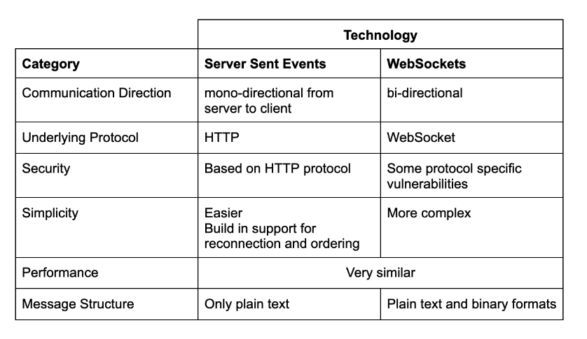

- SSE vs WebSocket
  - 공통점
    - 서버가 클라이언트로에게 실시간으로 어떤 데이터를 전달할 수 있다
    - 둘다 OSI 7계층에 위치하고, TCP에 의존
  - 차이점
    - SSE
      - HTML5 표준
        - > The EventSource API is standardized as part of HTML5 by the WHATWG.
          - https://en.wikipedia.org/wiki/Server-sent_events
          - https://html.spec.whatwg.org/multipage/server-sent-events.html#server-sent-events
        - 새로운 라이브러리 추가나 프로토콜 학습 없이 바로 적용가능
        - MIME type: text/event-stream
      - HTTP 프로토콜사용
      - 서버에서 클라에게 전송하는 단방향
      - HTTP를 통해서 할때 브라우저당 6개까지 가능 (HTTP2는 100개가 기본)
        - > Warning: When not used over HTTP/2, SSE suffers from a limitation to the maximum number of open connections, which can be especially painful when opening multiple tabs, as the limit is per browser and is set to a very low number (6). The issue has been marked as "Won't fix" in Chrome and Firefox. This limit is per browser + domain, which means that you can open 6 SSE connections across all of the tabs to www.example1.com and another 6 SSE connections to www.example2.com (per Stackoverflow). When using HTTP/2, the maximum number of simultaneous HTTP streams is negotiated between the server and the client (defaults to 100).
      - 순수한 텍스트 프로토콜 (UTF-8 인코딩)
        - 바이너리 데이터 사용불가
      - 만료시간이 다되면 브라우저에서 자동으로 서버에 재연결 요청
      - 실시간 처리시 proxy 주의필요
        - proxy서버(ex. nginx)에서 buffer를 채워서 응답하도록 설정되어있다면 실시간으로 데이터 전송 안될 수 있음
        - buffer 기능을 꺼두어야함
      - 자동재연결
        - 연결이 끊킬 경우, 클라이언트가 자동으로 서버에 재접속을 시도
          - 서버측에서 재접속 로직 구현필요없음
      - 사용방법 참고 사이트 (적용시 트러블슈팅도 잘 정리)
        - https://gong-check.github.io/dev-blog/BE/%EC%96%B4%EC%8D%B8%EC%98%A4/sse/sse/
    - WebSocket
      - 처음 연결할때만 HTTP를 활용 (이후는 그냥 TCP 동작 - 로우레벨)
      - websocket 프로토콜 사용
      - 양방향
      - 텍스트, 바이너리 모두 가능
        - 즉, 이미지, 오디오, 파일 등도 전송가능 (다만, 파일 처리에 오버헤드 발생가능)
          - 바이너리 보낼때 base64 인코딩 (원본 데이터보다 33% 증가)
          - TCP 기반 프로토콜이라 네트워크 지연과 TCP 흐름제어 및 혼잡제어 메커니즘 등이 대용량 파일 전송할대 전송속도 제한될수 있음..
      - 웹소켓이 same-oirgin 정책을 강제하지않기때문에, CSRF같은 공격에 취약
        - 그러나 스프링은 same-origin 정책을 적용할수있도록 api가 만들어져있음 (보안강화)
      - 재연결 관련 별도 관리 필요
    - 간단하게 표로 정리
      - 
  - 그래서 무얼선택해야하나?
    - 클라이언트에 지속적인 업데이트 스트림을 푸시하기만 하면 된다면 SSE가 더 적합한 선택. 반면에 이러한 이벤트 중 하나에 어떤 식으로든 클라이언트가 반응해야 하는 경우에는 WebSocket이 더 유용
    - postman에서 SSE, websocket 모두지원가능하여 테스트가능
      - jmeter와 gatling 으로 성능테스트도 가능

  - 참고사이트
    - [차이점 심플하게 설명 굿](https://surviveasdev.tistory.com/entry/%EC%9B%B9%EC%86%8C%EC%BC%93-%EA%B3%BC-SSEServer-Sent-Event-%EC%B0%A8%EC%9D%B4%EC%A0%90-%EC%95%8C%EC%95%84%EB%B3%B4%EA%B3%A0-%EC%82%AC%EC%9A%A9%ED%95%B4%EB%B3%B4%EA%B8%B0)
    - [완전 자세하고 명확한 설명](https://softwaremill.com/sse-vs-websockets-comparing-real-time-communication-protocols/#sse-vs-websockets-comparing-real-time-communication-protocols)

- STOMP (WebSocket subprotocol)
  - 

- SockJS
  - https://velog.io/@koseungbin/WebSocket