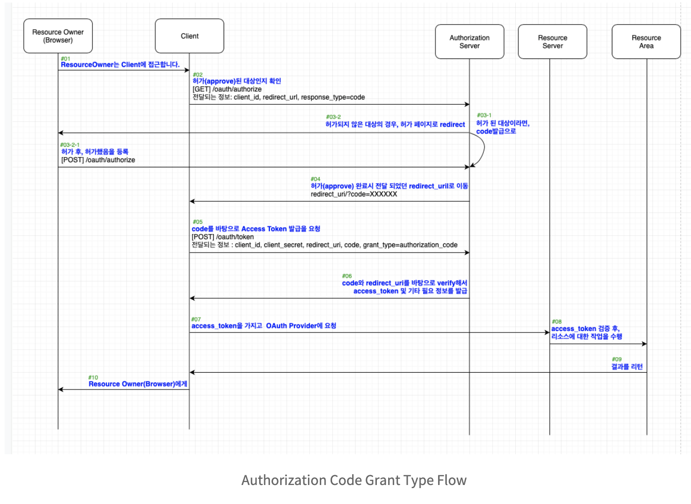
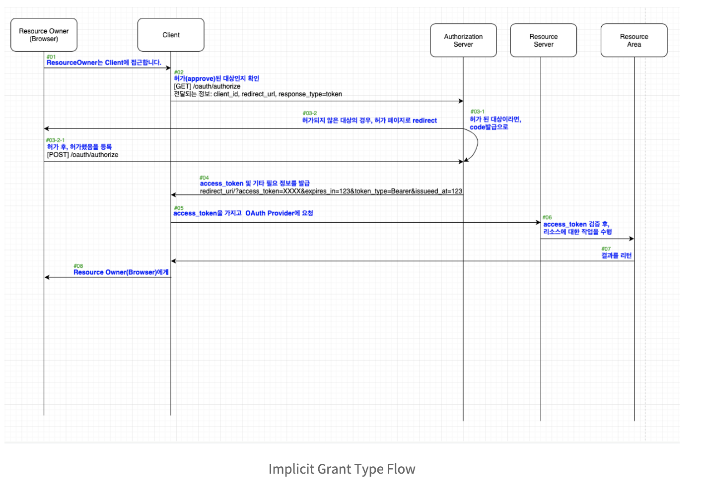
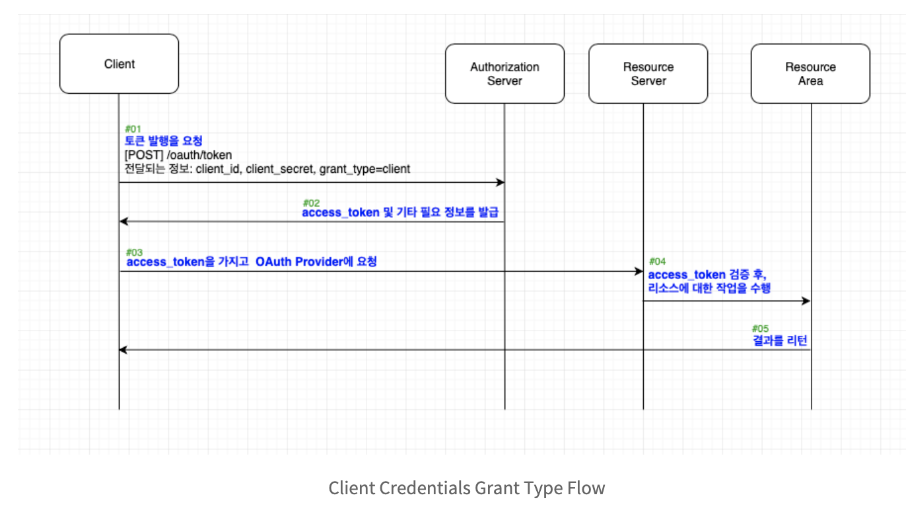
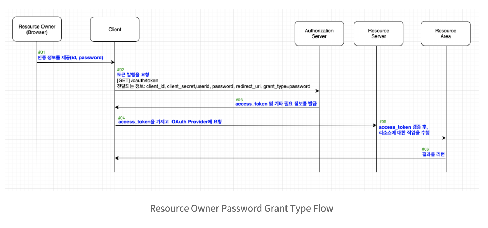
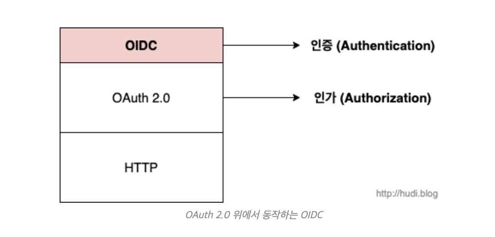

oauth2
- 나오게된 배경
  - 웹 서비스가 발전함에 따라, 서로 다른 서비스들 사이에서 사용자 데이터를 공유하고자 하는 요구가 증가. 예를 들어, 사용자가 페이스북과 같은 소셜 미디어 사이트에서 사진을 업로드하면, 다른 웹 서비스가 그 사진에 접근할 수 있도록 허용하는 것
- 구글, 페이스북, 트위터와 같은 다양한 플랫폼의 특정한 사용자 데이터에 접근하기 위해 제3자 클라이언트(우리의 서비스)가 사용자의 접근 권한을 위임(Delegated Authorization)받을 수 있는 표준 프로토콜이다.
  - [정리굿](https://hudi.blog/oauth-2.0/)
- 인증을 받은 이후에, **OAuth로 인가를 받으면** Access Token이 발급됩니다. 이후 요청하는 모든 건에 대해서는 리소스 서버가 해당 토큰을 바탕으로 인가받은 클라이언트인지를 확인하고 사용 가능한 토큰인 경우 리소스에 대한 요청을 처리하는 것이 기본 프로세스
- oauth2.0은 인가(authorization)를 위한것 (인증을 위해서 사용하지마기엔 단점이많다~ 하단 참고)
- 용어
  - Resource Owner
    - 자원의 주인.. 즉, 사용자
      - 여기서 자원은 사용자의 정보를 이야기한다.. 자원의 주인이기에 이 자원의 주인이 client가 oauth provider로 부터 내 자원을 받을수 있도록 허락해주는지 아닌지를 결정할 수 있는것..
  - Client
    - application.. 
    - authorization Server로 부터 발급된 access token을 사용하여 Resource를 요청하여 가져올 수 있다
  - authorization Server (인가서버)
    - 토큰(정확히는 Access Token이라고 합니다)을 발행하는 곳
    - 인증이 아니라, 인가에서 토큰을 발행해주는 이유는.. 해당 아이디가 어떤 자원까지 접근할수있는지(인가)까지 알아야 해당 토큰이 어디까지 자원을 제공해주면 되는지를 결정할수있기에..
  - Resource Server
    - Access Token을 얻은 Application의 인증받은 요청에 대해서 핸들링 한다
    - Authorization Server로 부터 발급받은 토큰을 확인하거나, 인가받았는지 여부를 확인하는 문지기 역할
    - 주 역할
      - Verifying Access Token : Access Token의 확인
      - Verifying Scope : Scope의 확인(Scope는 각 Client가 가지는 리소스에 대한 권한의 개념)
      - Error Codes and Unauthorizaed Access : 에러코드및 비인가 접근에 대한 처리.

- Grant
  - Authorization Code
    - Authorization Code Grant Type은 Authorization Server에게 토큰을 발행받기 위해서 code값을 요청하고 이 code값을 바탕으로 토큰을 발급받는다!
    - 
    - [공식문서](https://developer.okta.com/blog/2018/04/10/oauth-authorization-code-grant-type)
  - Implicit
    - Authorization Code 와 매우 유사하나, Code를 발행하는 flow가 사라지고, 토큰을 발급해주는 형태가 콜백에 쿼리스트링으로 해준다..
      - 토큰을 쿼리스트링으로 발급해주니.. url에 노출되므로 탈취의 위험이있다..
        - Authorization Code도 Code값이 url에 노출되긴하나, 일회성이기때문에(성공이든 실패든 요청한번하면 폐기) 취약점이 덜하다..
    - 
  - Client Credentials
    - 서비스(Client)는 이미 그 자체만으로도 토큰 발행을 요청할 수 있는 주체가 되어있고 토큰을 요청하기만하면 Authorization Server는 토큰을 발행
    - 사용자(Resource Owner)의 승인(approval) 과정이 생략
      - scope는 어디까지인거지..?
    - 
  - Resource Owner Password Credentials (= Password Credentials)
    - Client Credentials와 매우 유사하나, Resource Owner의 Password (+id)를 함께 제공해주어야 토큰 발행해줌
    - Client 가 Authorization Server에게 Resource Owner의 아이디와 비밀번호를 GET 방식으로 노출되는 위험성도있고, 일단 Client가 ResourceOwner의 Id와 비밀번호를 직접 받게되는것도 좀..
    - 그래서 해당 Grant Type은 Client에 대한 Resource Owner의 100%를 넘어선 1000%쯤의 신뢰도가 바탕이 된다면 사용하시면 되는 방법
    - Resource Owner와 Client의, 일급기밀(password & secret)을 죄다 끌어모아서 토큰발행을 요청하는 방식, 그게 Resource Owner Password Grant Type 
    - 
  - Refresh
    - 혼자 독단으로 토큰을 발행하는 방식은 아님
      - Refresh Token이 발행되는 시점이 최초의 Access Token이 발행되는 시점이기 때문에 최초의 인가를 받아야지만 사용할 수 있는 Grant Type
    - AccessToken은 탈취되면 계속 자원에 접근할수있으니, 이에 대한 주기를 짧게하고 새롭게 발급받도록 해야하는데, 이때 사용하는 토큰이 Refresh Token
      - 새로운 Access Token을 발급받는 방식이 Refresh Grant Type이며 이때 사용되는 토큰이 Refresh Token 
    - **Authorization Code**, **Client Credentials Grant Type**만이, Refresh Token을 발급받을 수 있다
- Grant Type의 정리
  - 그래서 개발하기에도 복잡하고 플로우도 난잡하지만, code라는 1회성의 정보(마치 OTP처럼)로 Access Token을 발행요청하면서, Access Token을 지속적으로 파기해서 탈취시에 대한 방어를 해내며, Refresh Token을 통해서 Access Token의 재발행요청을 할 수 있는 방법…그래서 **Authorization Code Grant Type이 제일 많이 쓰이는 방식**

- 내용출처 (개념설명 매우 굿)
  - https://blinders.tistory.com/63
  - https://blinders.tistory.com/64
  - https://blinders.tistory.com/65

- OpenID Connect?
  - 인증에서사용..
  - OpenID는 2006년 1.0버전을 표준으로 출시되었고, 이후 2007년에 2.0버전이 출시되었다. 그리고 2014년 3세대 OpenID로 OpenID Connect가 등장하게 되었다. 이 포스팅에서는 3세대 OpenID 기술인 OpenID Connect, 줄여서 OIDC
  - OpenID인 OIDC(OpenID Connect)는 사실 OAuth 2.0 위에서 동작하는 얇은 ID 계층이다. OIDC는 사용자 인증을 OAuth 2.0 프로세스를 확장하여 구현
  - 
  - OIDC와 OAuth2.0의 차이
    - OAuth 2.0 프레임워크는 어플리케이션을 승인한 사용자에 대한 정보를 명시적으로 제공하지 않고, 액세스 토큰(Access Token)이라는 형태로 권한을 제공한다. 액세스 토큰은 마치 호텔 키 카드와 같다. 호텔 카드키만으로는 키 카드 소유자가 어떤 객실에 출입할 권한이 있는지 알 수 있지만, 카드키 소유자에 대한 신원 정보는 전혀 알 수 없다.
    - 하지만, OpenID의 주요 목적은 인증(Authentication)이다. OpenID를 사용하면 클라이언트는 ID 토큰을 획득할 수 있다. 이 ID 토큰에는 사용자에 대한 신원 정보가 담겨있다. 액세스 토큰이 호텔 키 카드라면, ID 토큰은 주민등록증이라고 할 수 있다. 주민등록증으로 신원 확인(이름, 사진, 거주지 주소 등)을 확인할 수 있겠지만, 호텔 객실에는 출입할 수 없을 것이다.
    - 정리하자면, OAuth 2.0은 리소스 서버로부터 리소스를 가져오기 위한 액세스 토큰 확보에 목적이 있다면, OpenID Connect는 사용자의 신원 정보가 담긴 ID 토큰 확보에 그 목적이 있다.
  - OIDC는 OAuth 2.0의 스코프로 openid 값이 포함되어 들어오면, 액세스 토큰과 함께 사용자 인증에 대한 정보를 ID Token 이라고 불리는 JWT로 반환 (즉, 인가서버로부터 access token + id token(jwt) 응답받음)
    - 기본적으로 oauth2.0 flow인데, access token 전달받을때 id token을 추가로 받게됨..
      - 근데 이게 왜 보안성 더 이점이 있다고하는거지..?
      - https://openid.net/specs/openid-connect-core-1_0.html#IDToken
      - https://openid.net/specs/openid-connect-core-1_0.html#IDTokenValidation
        - 나중에 기회되면 살펴보자..
  - OIDC 사용이점
    - 그런데, 이상하다. OAuth 2.0은 사용자의 리소스를 리소스 서버로부터 가져오기 위해 사용한다. 이 과정에서 인증 서버를 통해 사용자를 인증하는 과정을 거친다. 사용자의 신원 정보가 필요하면, OAuth 2.0 인가 프로세스를 거쳐 발급된 액세스 토큰을 가지고 사용자 정보 리소스에 접근하면 될 것 이다.
    - 물론 OIDC없이 사용자 프로필 정보를 리소스 서버로부터 가져올 수 있다. 하지만, OIDC 없이 OAuth 2.0 단독으로 사용자 리소스를 가지고 오기 위해서는 OIDC를 사용할 때의 2배의 통신을 해야한다.
    - OAuth 2.0을 단독으로 사용하면, Access Token을 발급 받은 다음 이 토큰을 사용하여 사용자 리소스를 다시 요청하여 받아와야한다. 하지만 OIDC를 사용하면 Access Token과 함께 전달받은 ID Token을 복호화하여 사용자 정보를 가져오면 끝이다.
    - OAuth 2.0 단독으로 사용하여 사용자 정보를 조회할 때 발생한 통신이 1억회라면, OIDC를 사용하면 5천만회로 줄어드는 것이다.
    - => 즉, 트래픽을 적어도 절반이상 줄일 수 있다..
  - 내용출처
    - https://hudi.blog/open-id/

  - 추가 참고
    - https://tecoble.techcourse.co.kr/post/2022-10-24-openID-Oauth/
    - https://6991httam.medium.com/oauth%EB%9E%80-%EA%B7%B8%EB%A6%AC%EA%B3%A0-openid-8c46a65616e6
    - https://www.samsungsds.com/kr/insights/oidc.html
      - OpenId(jwt)는 인가서버에서 엑세스토큰과 함께 client에게 전달받게되는데, OpenId에 Resource Owner에 대한 정보를 갖고있게되므로, 엑세스토큰으로 다시 사용자 정보를 요청할 필요가없다 (OpenId에 없는 정보면.. 요청해야겠지..) 

---

- oauth를 인증을 위해 사용하는것에 대한 문제점
  - OAuth인증을 통해 얻어지는 액세스 토큰은 user 인증 이후에 발급되기 때문에 인증의 증거로써 간주되기 쉬우나 그 액세스 토큰은 Client(user가 아니라 인증을 요구하는 앱)에 대해 불투명하게(opaque) 설계되었기 때문에 user에 대한 어떠한 정보도 말해주지 않는다. 즉, user를 확인할 수단으로 사용할 수 없다.
  - 또한 OAuth를 통해 발급받은 액세스 토큰을 사용하여 보호된 자원(리소스 또는 API)에 접근하는 것을 인증의 증거로 간주하는 경우가 있으나 이것 또한 잘못된 생각이다. 액세스 토큰은 꼭 인증(authentication)이 이루어져야만 얻을 수 있는 것이 아니기 때문이다. 리프레시 토큰이나 Assertion을 통해 액세스 토큰을 인증없이도 발급이 가능하다.
  - 뿐만 아니라 액세스 토큰은 생명 주기가 있다. 토큰이 만료되는 시간이 있다는 말이다. 더 이상 인증이 필요한 user가 존재하지 않아도 액세스 토큰은 만료되지 않았기 때문에 보호된 자원에 접근할 수 있다. 따라서 보호된 자원에 접근은 인증의 증거가 될 수 없다.
  - 이 외에도 액세스 토큰의 탈취 위험성, 액세스 토큰 Injection, audience를 제한하지 않아 다른 client의 액세스토큰으로 우리의 client(naive client)가 인증된 것처럼 위장하는 위험, 유효하지 않은 user정보 Injection이 존재한다.
  - [User Authentication with OAuth 2.0 - OAuth.net](https://oauth.net/articles/authentication/)

---

- spring security와 oauth 설명굿
  - https://velog.io/@tmdgh0221/Spring-Security-%EC%99%80-OAuth-2.0-%EC%99%80-JWT-%EC%9D%98-%EC%BD%9C%EB%9D%BC%EB%B3%B4

