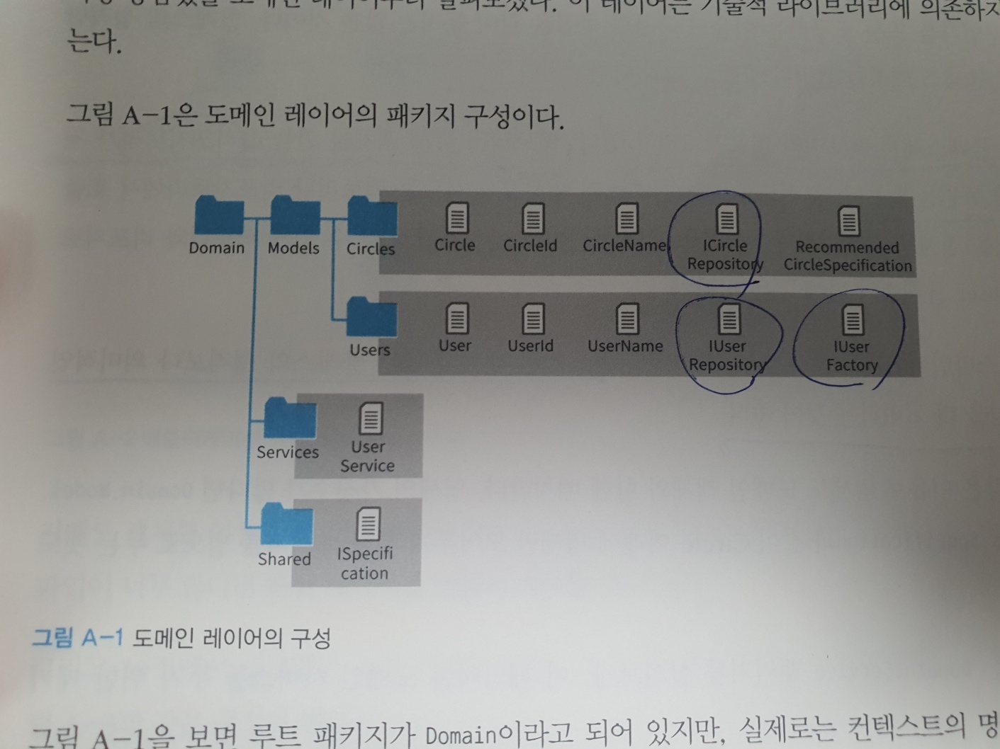
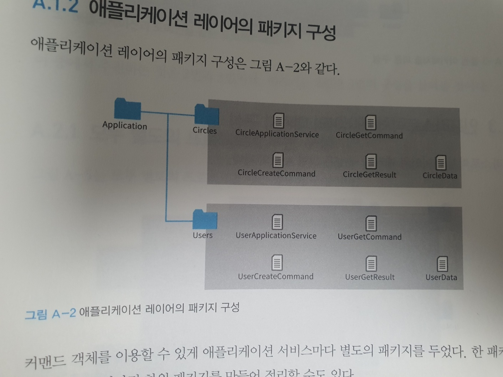
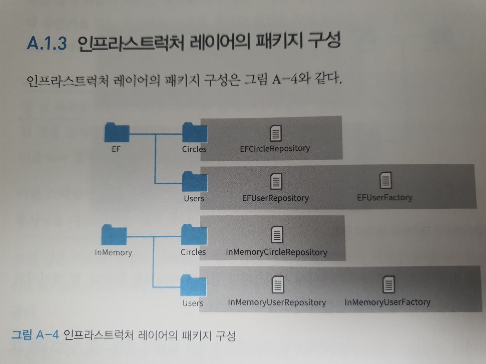

도메인 주도설계 철저입문
- 1장 도메인주도설계란?
  - 도메인 지식에 초점을 맞춘 설계 기법
    - 도메인 : 프로그램이 쓰이는 대상이 되는 분야 (영역)
    - 지식 : 소프트웨어 이용자의 문제 이해
  - 도메인 모델링?
    - 도메인 모델을 만드는 과정
      - 모델 : 현실에서 일어나는 사건이나 개념을 추상화한것
        - 추상 : 공통적인것을 뽑아 파악하는것 (현실의 모든것 반영 X)
      - 즉, 프로그램으로 쓰는 대상에서 일어나는 사건과 개념들 중에 공통적인 것을 뽑아내는것인데, 프로그래밍화 하기위해서는 필요한 정보로 한정해야한다
  - 도메인 객체?
    - 도메인 모델을 소프트웨어 형태의 동작하는 모듈로 나타낸것
    - 도메인 객체의 중요한 점은 진정 이 모델이 이용자 문제해결을 가능하게해주는, 그래서 객체로 만들 필요가 있는지 분별해야한다!
    - 도메인 개념 <-> 도메인 모델 <-> 도메인객체
      - 이렇게 서로 상호작용하며 피드백을 한다
  - 도메인 주도설계에서 패턴이란?
    - 도메인 지식을 설명하기위한것
      - 값 객체
      - 엔티티
      - 도메인 서비스
      - 애그리거트
      - 명세
    - 어플리케이션을 구성하기위한것     
      - 리포지토리
      - 애플리케이션 서비스
      - 팩토리
- 2장 시스템 특유의 값을 나타내기 위한 값 객체
  - 값 객체?
    - 객체이지만, 원시타입처럼 여겨져야한다..
    - 불변객체!  
    - 값의 성질
      - 변하지않는다
        - 장점
          - 병렬처리에서 유리
            - 값이 변하는 상황을 고려하지않아도됨
          - 불변이니 캐싱해서 사용하여 접근성이나 메모리 관리에 이점
        - 단점
          - 일부 값만 바꾸고 싶을때 객체를 아예 새로 생성해야함..
          - 그렇기때문에 특정부분은 상태를 바꿀수있는 전략도 씀
      - 주고받을 수 있다
      - 등가성을 비교할 수 있다.
        - 객체의 속성을 통해 비교한다..(equals 나 hashcode 오버라이딩)
  - 이런 점을 고려하였을때 *불변객체* 기반으로 만들자
  - 값 객체가 되기 위한 기준?
    - 규칙이 존재하는가?
    - 낱개로 다루어야하는가?
    - ex) 성명 이라는 도메인에는 성과 이름이 속성으로 구성될때, 성명은 규칙이 존재하며, 낱개로 다루어야하니깐 값객체가 맞지만, 성명이라는 도메인의 성과 이름은 규칙이 존재한다고 보기 쉽지않고 낱개로 다룰 필요가 없기에(물론, 요구사항에 따라 다를 순 있지만..) 원시타입(String)으로 할수있다
      - 이 책의 필자는 c#을 쓰고있는데, string이 원시타입인듯.. (물론 자바도 String은 원시타입처럼 사용됨..)
  - 값 객체는 *독자적인 행위를 정의할 수 있다*
    - 값 객체는.. 단순한 데이터 구조체가 아니다
    - 객체이므로 행동이 정의가능하고.. 그렇기에 데이터(속성)에 대한 규칙과 같은 행동을 정의할 수 있다
    - 이를 통해서 데이터에 대한 행동을 한곳에 모아두고, 자신만의 규칙을 갖는 도메인 객체가 된다
    - 그리고 값 객체(도메인 객체)에 정의된 내용을 보고 이 도메인 객체가 어떤일을 할 수 있고, 어떤일을 할 수 없는 놈인지도 파악이 가능하다
  - 값 객체를 도입했을때 장점
    - *표현력증가*
      - 무얼하는놈인지에대한 정보를 제공
      - 코드 자체가 문서의 역할
    - 무결성 유지 (integrity 이상한 데이터 들어오는거 막음)
      - 값 객체를 통해서 제약사항을 정의할수있음
      - ex) 이름에 3글자 이상은 에러 
    - 잘못된 대입을 방지
      - 값 객체를 사용하기에 타입검증가능(컴파일러가 잡아줌 - java)
      - ex) User라는 도메인 모델에 UserId와 UserName이 속성으로 가지고있다면, 그냥 String이 아닌, UserId나 UserName 타입을 전달해줘야하니.. 실수줄일수있음
    - 로직이 코드 이곳저곳 흩어지는것을 방지
      - 중복코드를 방지할수있음
      - ex) User의 userName의 3글자 이상으로 정의해야하는 제약사항이 있을때, 도메인 객체에서 이를 정의해놓으면 해당 제약사항의 변경이 있을때 도메인 객체만 고치면된다.. 여기저기 제약사항 로직 만들어놓아서 고칠때 개고생하는 불상사를 막을수있다!

  - 기타 팁
    - 값 객체의 속성을 또 값 객체로 정의할 만한 가치가 있다(혹은 값 객체로 정의할 만한 가치가 잇는 개념)고 구현중에 발견했다면, 그 개념은 도메인 모델로 피드백해야한다!

- 3장 생애주기를 갖는 객체, 엔티티
  - 도메인 객체 중에도 속성이 달라지더라도 같은 대상으로 판단해야하는것들이 있는데, 이때 사용되는것이 엔티티이며, 이 엔티티는 식별자를 통해서 구별된다(식별자가 비교대상)
  - 엔티티와 값 객체 모두 도메인모델을 구현한 도메인 객체이지만, 성질에서 차이가 있다
  - 엔티티의 성질
    - 가변
      - 엔티티는 속성 변화를 위해 객체를 교환하지않는다(속성 변화를 위해 객체를 교환(새로만듦) 하는것은 값 객체)
      - 즉, 속성 변화가능
      - 그러나 필요에 따라 속성을 가변으로 만들 수 있는 객체일뿐이지, 가능한 한 객체는 불변객체로 만드는것이 좋다!
    - 속성이 같아도 구분가능 (속성이 같으면 같은 객체로 보는것이 값 객체! 속성을 통해 구분)
      - 식별자를 통해 가능
    - 동일성(identity)을 통해 구분
      
      - 동일성을 판단할 수단이 필요한데, 이에 식별자가 사용됨
  - 엔티티 판단기준
    - 생애주기를 가지거나 연속성을 가진다면 엔티티로 놓자.
      - 생애주기를 갖는다는것은 객체가 생성해서 없어질때까지 변화를 겪을 수 있는 대상이라는 것이다.
    - 생애주기가 무의미한 객체라면, 불변 객체로 가져가자! 그래야 다루기 복잡해지지않는다..
  - 같은 대상이라도 어떤 환경에 있느냐에따라 값 객체가 될 수 있고, 엔티티가 될 수도있다.
    - ex) 타이어는, 자동차를 구성하는 한 부품으로 다룰때는 값 객체로 다룰수있지만, 타이어 공장에서는 타이어가 언제 만들어졌고 어떤 공정에 있는지 등 엔티티로 다루어야할 대상이다
  - 도메인 객체(값 객체, 엔티티)를 정의할때의 장점
    - 유지보수 시점에 빛을 발함
    - 자기 서술적인 코드
      - 코드를 통해 사용되고있는 도메인의 역할 파악가능 
    - 도메인에 변경사항이 있을 시 코드에 반영하기 쉬움
      - 도메인 객체에 행동이나 규칙을 코드로 작성해두기때문에(응집성 굿), 도메인 모델로 전달된 도메인의 변화를 쉽게 객체까지 전달가능하다
  - 기타 팁
    - 도메인 객체의 유효성 검증은 필요하다. 그러나, 이 도메인 객체를 사용하는 클라이언트도 도메인 객체에 접근하기전에 검증이 필요하다!
    - *다양한 행동이 기술된 객체는 해당 소프트웨어가 어떤 도메인에 관심이있는지, 그 지식을 어떻게 식별하는지를 보여준다.. 그렇기에 개발자들에게 도메인을 이해하는데 좋은 힌트를 준다*
    - 구현시에 애매모호함을 느꼈다면, 도메인 모델링을 다시하자!
    
- 4장 부자연스러움을 해결하는 도메인 서비스
  - 엔티티와 값 객체로만 표현하기 애매한부분(이런 도메인 객체의 메소드에 정의하는게 겁나 이상한 느낌..)을 도메인 서비스를 통해서 해결하자.
  - 서비스란?
    - 소프트웨어 개발에서는 클라이언트를 위해 무언가를 해주는 객체
    - 도메인주도설계에서는 두가지로 나뉨
      - 도메인을 위한 서비스 => 도메인서비스
      - 애플리케이션을 위한 서비스 => 애플리케이션 서비스
  - 도메인서비스
    - 도메인서비스는 값 객체나 엔티티로 구현하기 어색한 행동을 해결해주는 객체
      - 객체의 책임을 명확하게 할 수 있도록 도와주는 역할 같음..
      - 여러개의 도메인 객체를 가로질러 이뤄지는 처리인 경우 사용하기좋음
      - ex) User 클래스에 사용자 이름의 중복을 체크하는것을 User 클래스에 넣어버리면..? 매우 이상.. UserService.exist를 만들어서해결하자..
        - 그런데, 이런 도메인서비스에서 또한 중요한것은 도메인 모델이 나타내고자하는 본질적인내용(ex. 사용자명중복체크, 사용자생성, 사용자 저장)을 다루어야하지, 특정 DB를 다루는 내용이 들어가면안된다! 그렇게되면, 해당 로직을 보고 무슨 역할을 하는지 파악해야하는 시간이 필요하며, 무엇보다 로직이 길어지면 명확하게 알기가 어렵다..(이를 repository를 통해 해결가능)
    - 도메인서비스는 자신의 행동을 바꿀수있는 인스턴스만의 값을 갖지않는다
      - 문장이 정확하게 이해는안감.. 메서드가아닌, 함수라는것인가..?(인풋이 같으면 아웃풋이 항상 같은..?)
  - 도메인 서비스를 남용하면?
    - 도메인 서비스는 *부자연스러운 처리에만 한정*해야한다!
    - 도메인 서비스를 남용하면, 도메인 객체는 자신의 정보(지식)를 전달해줄수 없게된다 (getter, setter만 있음..)
      - 이를 *빈혈 도메인 모델*이라고 한다..
    - 또한 로직이 분리되어서 중복코드가 많이 나타날수있게되고, 이에따라 유지보수에 어려움이 있을 수 있다
    - 일단 애매하면, 도메인객체(엔티티, 값 객체)에 최대한 넣어보자!
  - 도메인서비스 명명 규칙
    - 도메인개념
    - 도메인개념+Service
    - 도메인개념+DomainService
    - ex) 사용자 중복확인과 같이 특정 도메인 객체와 밀접하게 연관된 서비스는 UserService로 정의해놓은 서비스 도메인에 처리를 모아놓을수있다.. 또는, 사용자명 중복을 확인하는일을 별도의 서비스로 독립시켜야한다면, CheckDuplicateUserService와 같이 만들 수도있다.

- 5장 데이터와 관계된 처리를 분리하자 - 리포지토리
  - 왜 필요?
    - 엔티티는 생애주기를 갖는 객체인데, 프로그램의 종료와 함께 객체가 사라지면 안된다. (메모리에 당연 사라지긴하지만, 논리적으로 없어지면 안됨..)
    - 그래서 데이터를 저장하고 복원하는 처리가 필요한데, 이런부분을 추상화한 객체가 리포지토리이다
    - 영속성(퍼시스턴시)을 위해서 필요하다!
  - 리포지토리 책임?
    - 도메인 객체를 저장하고 복원하는 퍼시스턴시
    - 이게 없으면 퍼시스턴시 관련 구현 내용을 세부적으로 살펴보아야하는데, 이렇게 되었을때 뭐를 select해오고 insert하는것 등 세부 쿼리들을 보아야하므로 비지니스 로직을 빠르게 파악하기가 쉽지않다.. 이를 해결하기위해 추상화를 진행하여 리포지토리를 만든다..!
    - 객체의 퍼시스턴시와 관련된 처리를 리포지토리에 맡기면 비지니스 로직을 더욱 순수하게 유지가능
  - 리포지토리는 ***인터페이스로 정의***
    - 리포지토리에서 파라미터나 리턴값에 사용하는 객체들은 도메인객체!!
  - 테스트하기좋다!
    - 리포지토리 테스트용 구현체를 만들어서, Map 과 같은 메모리에 올려놓을 수 있는 객체를 활용하면 DB 셋팅하고, DB 연결하고 등등 테스트하기 버거운게아닌 간단하게 테스트 가능하다..
      - 테스트는.. 너무 수고스러우면 잘 안하게된다..
  - 리포지토리에 정의되는 행동
    - 객체의 저장과 관계된 행위
      - 저장
        - 객체를 저장하기위해서는 저장 대상 객체를 인자로 전달받아야한다! (변경도 포함..)
        - 객체의 식별자 및 수정항목을 인자로 받게 메서드를 정의하지말자..
          - ex. `void updateName(UserId id, UserName name);` 옳지못함..
          - 이렇게 되면 수많은 수정 관련 메서드가 생김..
      - 삭제
    - 저장된 객체의 복원과 관계된 행위
      - 식별자로 검색을 수행하는 메서드
      - 모든 객체를 받아와야하는 메서드
        - 복원되는 객체의 숫자에 따라 컴퓨터 리소스가 바닥날수있으니.. 페이징처리라던지 적절한 조건이 포함되어있는지(인덱스) 확인이 필요
  - 기타 팁
    - 퍼시스턴시를 생각하면 관계형 데이터베이스만 생각하는데, nosql이라든지 하다못해 파일저장도 퍼시스턴시이다.. 그렇기에 리포지토리를 만들때 rdb 관련 기술에 의존해서 만들면 안된다!
    - *리포지토리의 책임은 객체의 퍼시스턴시까지..!*
      - 사용자명 중복확인과 같은 도메인 규칙은 리포지토리 책임에 벗어난다..! 즉, 리포지토리 인터페이스에 `boolean exist(User user)` 이런거 만들지마라..
        - 리포지토리 구현에 따라 동작이 달라질수있는것도 문제..
        - 절대 안되는건 아니지만.. 도메인 규칙이라면 도메인쪽으로 가는게 좋을듯..!
      - *리포지토리에 도메인의 책임을 주면, 도메인을 통해 지식(정보)을 얻을 수 없다..!* 
    - `Optional` 타입은 null이 될수도 잇는 놈이니 null처리해라는것을 알려주는 것!
      - 이를 남용해서 null이 되면 안되는곳에도 optional을 쓰진말자..
    - 참고사항
      - 해당 책에서는 C# ORM을 사용하는데, 해당 ORM 프레임워크에서 사용하는 엔티티는 도메인객체의 엔티티(XXXDataModel 로 명명)와 다르게 적용한다 (spring data jpa는 도메인 객체의 엔티티와 jpa에서의 엔티티는 동일하게 처리된다)    
  
---

- 6장 유스케이스를 구현하기 위한 애플리케이션 서비스
  - 애플리케이션 서비스는 유스케이스를 구현하기 위한 객체
    - 유스케이스?
      - 직역하면 사용 사례
      - 시스템 사용에 대한 시나리오의 집합
      - ex. 시스템에서 사용자 기능을 구현하기위해서는 "사용자 등록하기" 유스케이스와 "사용자 정보 수정하기" 유스케이스가 필요..
    - 도메인 객체를 조합해 실행되는 스크립트와 같다..
    - 도메인 객체는 도메인을 코드로 옮긴것인데, 이를 이용자의 목적에 맞추기위해(애플리케이션의 존재 목적) 도메인 객체의 힘을 하나로 엮어서 제공해주어야하는데, 이를 애플리케이션 서비스가 담당한다(client가 사용할 서비스)
  - 애플리케이션 서비스에서 도메인 객체를 client에게 바로 전달한다면?
    - 도메인 객체의 메서드 호출이 가능
      - 도메인 객체는 어플리케이션 서비스가 client가 되어 호출해야하는데, 어플리케이션 서비스를 사용하는 client도 호출가능해짐..
        - 도메인 객체를 자유롭게 조작하는 코드가 생길수있음 => 에러발생 확률 높아짐
        - 코드 또한 여러곳으로 흩어짐
      - ***도메인객체의 행동을 호출하는 것은 어플리케이션 서비스의 책임***
    - 공개하지않는다면 어떻게 객체의 데이터를 전달?
      - DTO (Data Transfer Object)를 만들어서 데이터를 옮겨넣자
        - DTO에 데이터를 옮겨넣는것은 애플리케이션 서비스에서 수행
        - DTO의 생성자에서 도메인객체를 받아버리자.. 그래야 외부에 공개할 파라미터 추가될 경우 수정이 적다..(DTO만 수정하면되니깐)
        - DTO를 적용하면, 객체를 새로 만들기때문에 DTO가 없는 것보다 상대적으로 성능저하가 있지만, 어지간히 많은 양의 데이터를 옮겨넣지않는 이상 성능저하는 미미한 수준
          - 불필요한 의존을 줄이고 도메인 객체의 변경을 방해받지않는 편익이 크다! (필자와 동의)
        - 이런 DTO가 만들기 번거로울 수 있는데, 이를 위해 DTO 역할을 하는 클래스를 생성하는 도구를 만들자
          - java에서 mapstuct의 mapper가 잇음
  - 애플리케이션 서비스에 도메인 규칙이 있다면?
    - 애플리케이션 서비스는 도메인 객체가 수행하는 테스크를 조율하는데만 전념해야한다
    - 도메인 규칙을 갖게되면, 같은 코드가 여러 곳에 중복되는 현상이 나타난다
      - ex. 사용자 이름 중복확인은 도메인 규칙인데, 이를 애플리케이션 서비스에 갖게되면, 사용자를 등록하거나 수정할때 로직에서 중복확인 규칙이 흩어지게된다. (물론, 메서드로 빼면 되긴하겠지만, 책임을 명확하게 분리해야한다..!)
  - 기타 팁
    - 엔티티, 값 객체, 도메인 서비스 등 도메인 객체를 통해서 해당 프로그램이 사용할 도메인에 대한 관심과 지식을 살펴 볼 수 있고, 어플리케이션 서비스를 통해서 이런 도메인들을 어떻게 사용해서 사용자의 요구를 들어줄지(비지니스 로직)를 알 수 있다
      - 즉, 어플리케이션 서비스는 유스케이스를 코드로 구현한 것
    - 커맨드 객체를 사용해서 client 요청의 파라미터를 전달받자
      - 커맨드 객체란 spring 컨트롤러에서 데이터를 요청받을때 파라미터로 body데이터를 맵핑받는것을 생각하면된다. 즉, 애플리케이션 서비스로 데이터가 넘어올때 이러한 커맨드 객체를 만들어주어서(해당 어플리케이션 서비스를 사용하기 위해 필요한 파라미터를 커맨드 객체로 셋팅해주어서), 불필요하게 어플리케이션 서비스의 메서드를 파라미터 추가시마다 생성해야하는것을 막을 수 있다.
    - 도메인 규칙은 도메인 객체에 구현하고 애플리케이션 서비스는 이 ***도메인 객체를 사용하는 역할만*** 맡는다
    - 프로그램 응집도?
      - 모듈의 책임범위가 얼마나 집중되어 있는지 나타내는 척도
      - 응집도가 높으면 하나의 관심사에 집중하고있다는 의미이므로 모듈의 견고성, 신뢰성, 재사용성, 가독성 측면에서 바람직함!
      - 어떻게 응집도를 확인?
        - LCOM(Lack of Cohesion in Methods)
          - 인스턴스 변수가 메서드에서 모두 사용돼야한다는 관점에서 인스턴스 변수의 갯수와 메서드의 수를 통해 응집도를 계산
          - 즉, 인스턴스 하나가 해당 클래스의 모든 메서드에서 사용되지않았다면 응집도가 낮아진다.. 그리고 분리를 고려해야한다
          - => 무조건 쪼개는게 능사는 아니지만(클래스도 너무 많아지고 한번에 파악하기가 쉽지않을수도있음..), 해당 클래스가 가져야되는 책임이 맞는지 생각해보자!
    - 서비스?
      - 클라이언트를 위해 무언가를 해주는 존재가 서비스
      - 값 객체와 엔티티는 자신을 위한 행동을 갖고있지만, 서비스의 행동은 자신을 위한 것이 아니다!
        - 코드로 의미를 해석해본다면, 값 객체와 엔티티는 자신의 상태값을 바꿀수있지만, 서비스는 자신의 상태값을 바꾸는 역할이 아닌, 비지니스로직을 통해 필요한 값을 도출해서 전달해내는것!
          - 물론, 서비스가 아예 상태값을 가지면 안된다는 의미는 아님!!! 하지만 되도록 안만드는게 좋겠지..
        - 도메인서비스는 도메인을 위한 행동을 하고, 어플리케이션 서비스는 어플리케이션을 통해 필요로하는 행동(애플리케이션 고유의 행동)을 한다
          - ex. 사용자명 중복확인은 도메인의 활동. 즉, 도메인 서비스
        

---

- 7장 소프트웨어의 유연성을 위한 의존 관계 제어
  - OjbectA 클래스는 ObjectB 클래스에 의존된 상태 (A --> B)
  ```java
    class ObjectA {
      private ObjectB objectB;
    }
  ```
  - 인터페이스를 구현한 구현체는 인터페이스에 의존한 상태 (ObjectAImpl는 ObjectAIntf에 의존)
  ```java
    class ObjectAImpl implements ObjectAIntf {

    }
  ```
  - 구체적인 구상 클래스를 의존하는 것이 아닌, 인터페이스와 같은 추상타입을 의존하게 함으로써 의존 관계의 방향을 제어(구현체는 인터페이스를 의존하고, 해당 인터페이스를 사용하는 클래스또한 인터페이스를 의존)하게되면 비지니스로직이 특정 구현에서 해방할수있다!
    - 이것이 "의존관계역전원칙(DIP Dependency Inversion Principle)"이라 하며, 소프트웨어의 유연성을 가져다준다!
      - 의존관계역전원칙
        - 추상화수준이 높은 모듈이 낮은 모듈에 의존해서는 안되며 두 모듈 모두 추상타입에 의존해야한다
          - 추상화 수준이 높은것은 CLINET가 사용하기에 가까이 있는것을 말하고, 추상화 수준이 낮은 모듈은 기술에 매우 의존적인것을 이야기한다
          - ex. UserApplicationService가 UserRepository보다 추상화수준이 높다.. UserRepository는 특정 기술에 의존..
        - 추상타입이 구현의 세부사항에 의존해서는 안된다. 구현의 세부사항이 추상 타입에 의존해야한다..
          - 추상 타입(인터페이스)은 자신을 사용할 클라이언트가 요구하는 정의이다.. 그렇기때문에 주도권을 클라이언트에게 있다..
          - ex. UserApplicationService가 필요한것을 IUserRepository(인터페이스)에 정의하고 이를 구현한 구현체가 UserRepository인 것이지.. UserRepository에 기능이 필요해서 IUserRepository를 수정하는 방향이 아니라는것! 어찌보면 당연한 소리..
  - 추상화 수준이 높은 모듈이 세부 사항에 의존하게되면?
    - 데이터 스토어 변경때문에 비지니스로직 변경되는 사태가 나타남..
  - 이런 의존 관계로 만들었으면 어디에선가 객체를 전달받아야할텐데, 그런 역할을 해주는게 IoC Container
    - IoC Container를 통해 의존관계 주입(Dependency Injection)을 수행한다
      - 생성자 메서드를 통해서 구체적인 객체를 넘기면 생성자 주입!
  - 기타 팁
    - 인터페이스 왜 쓰나?
      - 인터페이스를 사용함으로써 중요도가 높은 추상화 수준이 높은 모듈(비지니스 로직이 담긴 서비스)에 필요한 내용을 정의하여, 필요한 내용을 구체적으로 구현한 저수준의 추상화 모듈에 휘둘리지 않을 수 있다. 즉, 기술의 변경이 필요할때 비지니스 로직을 뜯어고치지않아도 된다! 변경이 없다!
      - 격리시켜 비지니스 로직 테스트하기도 좋고! 그래서 테스트 집중도 좋고!
    - 유연성이 높다
      - => 특정 기술에 의존하지않는다
      - => 언제든 중요소스(ex.비지니스로직)의 변경 없이 기술의 확장이 가능하다!

---

- 8장 소프트웨어 시스템 구성하기
  - 기타 팁
    - singleton 패턴을 사용하는이유?
      - 단순 static 대체가 아님!
      - 인스턴스 개수를 하나로 제한하면서, 일반적인 객체처럼 다루기 위함
        - ~~다형성같은 객체지향 프로그래밍의 장점을 그대로 활용할 수 있음~~
          - => 아직 잘 모르겠음
          - 우리가 직접 싱글톤을 구현하는게아닌, spring과 같이 IoC 컨테이너가 알아서 싱글톤으로 만들어주는것은 생성자를 private으로 놓지않아도되기떄문에 상속이나 다형성의 장점을 누릴수있는데, 위 내용은 정확하게 어떤걸 이야기하는지..
    - controller에서 바인딩되는 객체와 애플리케이션 서비스의 행동을 실행하기위한 커맨드 객체는 엄연히 용도가 다르다! 특별한 이유가 없는 한 이런 식으로 객체를 재사용하지말자!
      - 그래서 ***controller에서 하는 실질적인 역할은 요청들어온 데이터를 비지니스 로직이 필요로 하는 입력데이터로 변환하는 작업이 주다*** (즉, 서비스를 이용하기위한 변환작업)
        - 만약 그 이상의 일을 맡고 있다면, 도메인의 중요한 지식 혹은 로직이 컨트롤러로 유출되지 않았는지 확인이 필요하다!
        - 또한, 컨트롤러가 서비스를 사용하는 client가 되니깐, 컨트롤러에서 validator를 사용하여 검증하는것은 필수적이다! (물론, 서비스에서도 유효성 검사를 해야한다)

---

- 9장 복잡한 객체 생성을 맡길 수 있는 팩토리 패턴
  - 복잡한 객체를 생성하기 위해 복잡한 처리코드가 있으면, 도메인 모델을 나타낸다는 객체의 취지를 불분명하게 만들수 있다. (== 객체 생성절차를 캡슐화하여 로직의 의도를 명확하게 할수있다)
  - 그래서 필요한것이 복잡한 객체를 생성해주는 팩토리 패턴!
    - ***팩토리는 객체의 생성 과정과 관련된 지식이 정리된 객체!***
  - 기타 팁
    - 팩토리의 존재감 인식시키기!
      - 도메인 객체만 보았을때, 팩토리를 사용해서 객체를 생성하는지는 알수 없기에, ***생성하는 도메인 객체와 같은 패키지상에 위치시킨다!***
    - 생성자 메서드가 복잡해지면 팩토리를 고려하자!
      - 생성자 메서드안에서 다른 객체를 생성한다면, 팩토리를 고려해보는게 좋음
        - ***"뭔가 변경이 있을때 코드를 많이 고쳐야하는가?" 이 질문을 해보자!!***
    - 도메인을 표현하는데 도움을 주는 것이 팩토리와 레포지토리 같은것! 도메인과 무관하지않다!! 

---

- 10장 데이터의 무결성 유지하기 (이 책에서 무결성과 정합성이 조금 섞인듯..?)
  - 무결성(integrity)은 있어야할 데이터가 있는것.. (즉 이상한 데이터가 들어오면안된다!)
  - 정합성(consistency)이란 "서로 모순이 없고 일관적"이라는 뜻 (어디서 변경이 일어낫으면, 그 변경이 잘 반영되어야한다..)
  - 무결성 유지를 위해서 유일키 제약을 넣었다고, 그냥 create만 하면안된다.. 이렇게되면 도메인에서 무언가 생성할때의 규칙(제약조건)이 무엇인지 알 수가 없을뿐더러 유일키제약이라는 db에 의존적인 로직이 들어가게된다
    - 즉, 안정망 역할로 사용하는게 좋다
  - 트랜잭션을 사용하자!
    - 데이터 무결성은 특정 기술에 뿌리를 둘 만큼 추상화 수준이 낮은 개념이 아니다! 
    - 따라서 비지니스 로직에는 데이터 무결성을 확보하기 위한 구체적인 구현코드보다는, "이 부분이 무결성을 필요로한다!" 라는 명시적으로 보여주는 코드가 필요
      - => 스프링은 AOP를 활용하여 이런부분을 해결 `@Transactional`  
        - ***요 어노테이션을 보면, 데이터 무결성이 필요한 로직이구나! 라는것을 인지해야함!***
    - db의 트랜잭션은 데이터의 일관성을 유지하기 위해 데이터에 락을 건다. 트랜잭션을 사용할때는 이러한 락의 범위가 너무 커지면 느려지거나 데드락을 유발할 확률이 많으니, dbms의 락 특징도 잘 알아야하고, 적절한 인덱스, 한 트랜잭션에서 너무 많은 쿼리가 수행 되지않도록 잘 살펴야한다
    - 
  - 기타 팁
    - 유닛오브워크(UnitOfWork) 패턴
      - 유닛오브워크는 어떤 객체의 변경사항을 기록하는 객체
      - JPA가 변경사항을 반영해주는것이 이러한 패턴을 구현한것.
      
---

- 11장 애플리케이션 밑바닥부터 만들기
  - 애플리케이션 만드는 과정
    1. 어떤 기능이 필요한가?
    2. 추가할 기능이 결정되면 유스케이스 수립
    3. 애플리케이션에 필요한 지식을 추출해 도메인 객체를 정의
    4. 유스케이스 기반 도메인객체를 활용하여 서비스 구현

---

- 12장 도메인의 규칙을 지키는 애그리거트(aggregate: 집합체)
  - 애그리거트는 *불변 조건을 유지하는 단위*로 꾸려지며, *객체 조작의 질서*를 유지한다
    - 불변조건: 어떤 처리를 수행하는 동안 참을 유지해야하는 명제..
  - 에그리거트는 경계와 루트를 가짐
    - 경계: 에그리거트에 포함되는 대상을 결정하는 경계 (서로 연관된 객체를 감싸는 경계라고 보면됨.. )
      - ex. 사용자 에그리거트는 User가 있고, User내부에 UserId, UserName이 있다. 이 3개를 합쳐 경계를 만들게되면 이것이 에그리거트
    - 루트: 애그리거트에 포함되는 특정한 객체
      - 외부에서는 루트를 통해서 해당 에그리거트에 접근해야한다 (여러 에그리거트가 있을때는, 루트를통해서 서로 접근할수있다!)
        - ex. User에서 UserName을 변경하려면, UserName을 직접 접근하는것이아닌, 루트 에그리거트인 User의 메서드를 통해서 UserName을 변경한다
      - 이를 통해 에그리거트에 포함되는 객체를 외부에 노출하지않음으로써 불변조건을 유지할수있다!
  - 사용자 입장에서 에그리거트를 통하지않고 직접적으로 접근한다면(ex. Circle에서 Member list를 가져와 직접add 하는것) 구체적인 처리내용이 읽히지만, 에그리거트를 통하여 접근한다면(ex. Circle.join 메서드 호출) 좀 더 직관적으로 내용을 볼 수 있다.(구체적인 내용이 외부에서 보인다면, 중복코드의 가능성이있고, 해당 내용이 수정될때 이를 사용한 모든곳을 수정해야한다..)
    - ***객체 지향 프로그래밍에서는 외부에서 내부객체를 직접 다루는 대신, 내부객체를 감싸는 객체에 요청하는 형태! (불변조건유지 + 직관적)***
  - 에그리거트의 경계를 어떻게 정할 것인가?
    - 변경의 단위!
      - 사용자를 변경하면 사용자 에그리거트 내부에서만 변경이 이뤄져야하고, 서클을 변경하면 서클 에그리거트 내부에서만 변경이 이뤄져야한다
      - 즉, 서클 에그리거트에서 사용자 에그리거트를 건드린다면?
        - 리포지토리에 영향이 간다..
        - 에그리거트 단위로 리포지토리가 셋팅되어있는데, 서클 에그리거트에서 사용자 이름을 변경하는 로직을 수행하고 영속성을 위해 저장을 진행한다면, 사용자이름을 저장하는 update 문을 서클 리포지토리에 또한 셋팅해놔야한다..
      - ***=> 에그리거트에 대한 변경은 해당 에그리거트 자신에게만 맡기고, 퍼시스턴시 요청도 에그리거트 단위로 해야한다! 즉, 리포지토리는 에그리거트마다 하나씩!!***
  - 특정 에그리거트가 다른 에그리거트를 포함할때, 인스턴스를 갖는것이아닌, 식별자를 가질수도있다
    - 이렇게되면, 클라이언트가 특정 에그리거트를 통해 직접 다른 에그리거트의 인스턴스를 가져와서 변경하는 실수를 방지할 수 있다
    - 또한 메모리를 절약할 수도 있다.
      - ex. Circle에서 Member의 메서드를 사용하지도 않는 경우, 굳이 객체를 복원해서(데이터를 select해와서) 메모리를 차지하지않고 사용이 필요할때만 객체를 복원하도록 가능!
  - 에그리거트의 크기와 조작의 단위
    - 에그리거트의 크기는 가능한 한 작게 유지!
      - 크기가 크면 클수록 락의 적용 범위도 비례해 커진다! (트랜잭션을 사용하니깐)
      - 또한 처리 실패할 확률이 높아짐
    - 한 트랜잭션에서 여러 에그리거트를 다루는것도 가능한 한 피하도록!
      - 위와 같이 이유!
  - 기타 팁
    - 데메테르의 법칙
      - 객체간의 메서드 호출에 질서를 부여하기 위한 가이드라인
        - 다음 객체의 메서드만 호출가능
          - 객체자신
          - 인자로 전달받은 객체
          - 인스턴스변수
          - 해당 컨텍스트에서 직접 생성한 객체
          - => 이는 결론적으로 속성을 가진놈이 책임져!(담당해!) 와 같음
    - 게터(getter)를 통해서 필드를 공개하게되면, 객체에 구현돼야할 규칙이 외부로 흩어져 중복구현되는일을 막기가 어렵다..
      - 근데 Repository 같은경우, id나 데이터를 가져와야하는 조회나 저장등을 할 수 있는 경우가 있는데, 이때에는 `notification` 객체를 활용한다
        - p260, 261 참고
    - ***리포지토리는 에그리거트마다 하나씩 만든다***
    - 식별자를 직접 대상으로 하는 비지니스 규칙이 아니라면, 식별자는 getter로 공개하는것도 고려해볼만하다!
    
---

- 13장 복잡한 조건을 나타내기 위한 "명세"
  - 객체가 되기 위한 "평가"가 필요한데, 이러한 평가가 단순하지않고 복잡하다면(ex. repo 사용하고 등등) "명세"를 이용한다
    - 도메인 규칙은 중요한 객체가 되기위한 평가요소인데, 이러한 규칙에 다른 도메인객체의 복원이 필요하여 repo를 사용한다하면,
      - 도메인 객체에 repository를 넘겨주던지
      - 어플리케이션 서비스에서 repository를 사용하고, 규칙도 서비스에서 보여줘야한다..
      - => 위 두가지는 모두 바람직하지않다! 이를 위해서 "명세"라는 클래스를 사용하게됨. 즉, 도메인 규칙만(평가) 잘 나타내고 있고 repository를 가져와도 어색하지않은! (결국 분리를 목적으로 하는듯..)
        - 그러나 어쨌든 명세도 도메인객체라면 repository가 옳지않다고 생각된다면, 일급 컬렉션을 이용할것
          - 일급 컬렉션이란 List등의 제네릭 컬렉션 객체 대신 특화된 컬렉션 객체를 이용하는패턴
          - p281, p282 참고
  - 즉, 명세는 어떤 객체가 그 객체의 평가기준을 만족하는지 판정하기 위한 객체!
    - 그래서 명세는 매우 심플함.. 
      - `public boolean isSatisfiedBy(도메인객체)` 이 메서드 하나가지고있음(꼭 그래야만 하는건아니겠지만..)
  - 명세와 리포지토리 조합
    - 리포지토리가 명세를 전달받아, 명세에 정의된 조건과 합치하는 객체를 검색하는 방법
    - 검색에도 중요한 규칙이 필요한 경우 좋음. 그리고 중요한 규칙이 리포지토리 구현체로 빠져나가는것을 막을 수 있음(중복도 나타날수있겠지..)
    - 더블 디스패치로 사용가능
      - Repository(인터페이스)에 제네릭을 사용하는 Specification(인터페이스)를 파라미터로 전달받아서 구현
        - 런타임시에 Repository에 다이나믹 디스패치, Speicifcation에 다이나믹 디스패치가 되므로 더블디스패치..
        - 명세가 추가되거나 변경되어도 로직에 전혀 고칠게없음
    - 성능관련 유의할점!
      - 객체를 모두 복원한 다음에 명세에 맞는 객체만 필터링하는 방법은 데이터 건수가 많지않으면 괜찮지만, 그렇지않다면 매우 느리게된다
      - 이럴때는 명세와 리포지토리를 결합해 사용하는 패턴을 사용하지않는것을 고려해봐야한다..
      - 도메인 설계 중심을 따른다고 성능이 떨어지는것을 고수하면안된다.. 궁극적으로 고객의 문제를 해결해주는것이기때문에, 성능에 이슈가 나는것은 바람직하지않다
  - 기타 팁
    - 도메인 객체에 리포지토리를 가지는것은 도메인 모델을 나타내는데 전념하지 못하게 할 수 있기때문에, 바람직하지않다..
    - 객체를 평가하는 코드가 해당 객체에 너무 많이 들어가있으면 그 객체가 뭘하는지 알아보기가 쉽지않다
      - 그래서 명세같은걸로 규칙을 빼주는게 이해하기도 더 좋다
    - 어떤 객체를 평가하는 수단이 해당 객체에만 잇어야한다는 법이 없기에, "명세"를 통해 외부 객체로 분리하는것도 있는걸 기억하자!
    - 쓰기 작업에서는 도메인 결합을 느슨하게 하기위해 도메인 객체등을 적극적으로 활용하지만, 읽기 작업에서는 그렇지 않은 경우가 있다..
      - ***이에 따라 읽기성능을 위하여, CQS(Command-Query Seperation), CQRS(Command-Query Resposibility Segregation) 사용됨***
        - => 객체의 메서드를 성격에 따라 커맨드(쓰기명령)와 쿼리(읽기 대상내용)로 크게 나눠 다르게 다루는것
        - <span style="color:red">나중에 CQRS 관련 내용 좀더 찾아보고 정리하자</span>

---

- 14장 아키텍처
  - "도메인 주도 설계"에서 아키텍처는 결코 주역이 아니다!
  - 스마트 UI (안티패턴)
    - 공통된 비지니스 로직이 UI로 나타난 형태..
    - 비지니스 로직을 UI에 구현하지마라!
      - UI에 존재하면, 페이지마다 중복되는 로직이 발생할수있다..
      - UI에는 최소한의 로직만 존재하자
  - 도메인 주도 설계가 아키텍처에게서 원하는것은 도메인 객체가 서로 얽힌 레이어를 분리해, 소프트웨어 구현에 필요한 복잡성으로부터 ***도메인 객체를 지켜내는것***이다
    - 아키텍처는 ***코드를 구성하는 원칙***인데, 구현한 코드가 어디에 배치되어야하는지에 대한 답을 제시하여, 무질서하게 흩어지는것을 막아준다
    - 개발자는 아키텍처를 따르므로, 어떤 로직을 어디에 구현할 것인지 고민하지않고 대신에, 도메인을 파악하고 잘 표현하는것에 집중할 수 있게 해준다!
  - 도메인주도 설계와 함께 언급되는 아키텍처
    - 계층형 아키텍처
      - 구성
        - 프레젠테이션 계층(사용자 인터페이스 계층)
          - 사용자 인터페이스와 애플리케이션이 연결되는곳
          - 출력의 표시와 입력의 해석이 주요역할
            - 시스템 사용자가 이해할 수 있게 출력해주고, 사용자의 입력을 어플리케이션 서비스를 사용할 수 있도록 해석
          - 웹프레임워크, CLI 등이 여기에 속함
        - 애플리케이션 계층
          - 애플리케이션 서비스
          - 도메인객체의 직접적인 클라이언트
          - 유스케이스를 구현
          - ***도메인 객체를 조합***해서 기능실행
          - 문제 해결을 위해서 도메인 객체의 과업을 진행하고 관리하는것
          - 다른 서비스와 협조도 가능
          - 도메인 규칙이나 동작을 직접 구현안된다! => 도메인 계층의 역할
        - 도메인 계층
          - 도메인 모델을 표현하는 코드는 다 여기 속함
          - 도메인 객체를 지원하는 팩토리나 리포지토리(인터페이스)도 이 계층에 속함
        - 인프라스트럭처 계층
          - 자신 외의 계층을 지탱하는 기술적 기반에 대한 접근을 제공
          - 애플리케이션을 위한 메시지 송신, 도메인을 위한 퍼시스턴시 제공 모듈 등이 여기에 속함
          - 리포지토리의 구현체들이 여기..
        - => 여기서 핵심은 의존의 방향이 위에서 아래를 향한다는것!(이 방향을 거스를수없다)
          - 여기서 인프라스트럭처에 의존하는 방향이 있는데.. 이에 대해서는 좀더 확인이필요.. 계층형 아키텍처는 DDD에 적합하지않다고 하여 핵사고날만 이야기하는데, 이 책에서 소개해준 내용을 보면 계층형 아키텍처도 DDD로 개발하는데 전혀 문제가 되지않아보임.. (결국 핵사고날과 방법이 같기 때문..)
        - 사진참고 p303
    - 핵사고날 아키텍처
      - 육각형이 모티브인 아키텍처
      - 애플리케이션과 그 외 인터페이스나 저장 매체를 자유롭게 탈착가능하게 하는것
      - 구조
        - 포트와 어댑터가 핵심
        - 도메인을 중심으로 포트를 통해서 데이터가 in 또는 out 된다.
          - 여기서 in이 되는부분을 primary 포트라고 부른다(ex. 계층형의 application service 인터페이스)
          - out 되는 부분은 secondary 포트라고 부른다(ex. 계층형의 repository 인터페이스)
        - 어뎁터는 포트를 통해서 실질적으로 데이터를 in 또는 out 한다
          - primary 포트와 엮여잇는 adpater를 primary adapter라고 한다(ex. 계층형의 controller)
            - 이 어뎁터는 서비스를 사용하기위해서 클라이언트로부터 받은 요청을 전환시켜줌
          - secondary 포트와 엮여있는 adapter를 secondary adapter라고 한다(ex. 계층형의 repository 인터페이스의 구현체)
        - 사진참고 p314
    - 클린 아키텍처
      - 구조
        - 가운데 entity는 비지니스 규칙을 캡슐화한 객체로 보면되는데, 도메인 객체로 보면됨
        - 헥사고날과 목적하는 바가 같으나, 클린 아키텍처에는 콘셉을 실현하기위한 구체적인 구현방식이 명시된다
        - 사진참고 p317
  - 기타 팁
    - 아키텍처는 원칙을 제시해주니, 이를 통해서 너무 많은것을 생각하지말고, 도메인관련한 고민과 생각에 집중하여 사용자의 문제점을 제대로 해결해줄것!

---

- 15장 앞으로의 학습
  - 경량 DDD에 머무르지 말것
    - 경량 DDD는 도메인주도설계에 쓰이는 패턴만 도입하는것
  - 도메인의 본질을 파악하는것이 중요하다! 패턴은 단순히 수단일뿐
  - 도메인 전문가와 모델링하기
    - 개발자는 도메인 전문가의 말만 듣는것이아닌, 도메인 전문가와의 대화에서 시스템에 유용한 개념과 지식을 뽑아내야한다
    - 도메인 전문가와 이야기할때 시스템 용어로 가득채워서 도메인 전문가가 대화할 의지를 상실하게 만들면 안된다
    - 실제 개발하는 개발자와 도메인전문가가 직접 소통할수있어야한다
  - 보편언어
    - 프로젝트내 모든곳에서 사용할 언어
    - 도메인 전문가 뿐아니라, 개발자간의 소통, 코드에서도 이를통해서!
      - 이 또한 다듬어져가야함
    - 코드에서 어떻게사용하는게좋을까?
      - 대화, 문서뿐아니라 코드에서도 사용되어야한다
        - ex) 이름변경하기 => changeName o, updateName x
      - 개발에 치우쳐있는 언어를 사용하게되면, 개발자는 도메인에서 사용되는 언어를 개발에 치우친 언어로 변경해야할뿐아니라, 반대로 이야기나눌때에도 도메인전문가는 바로 이해하지못할 수 있다.. (이게 이런 기능이라고 설명해야하니 힘들다)
  - 컨텍스트의 경계 정하기
    - 이 경계가 넘어가면 보편언어의 의미도 달라질 수 있다
      - 보편 언어를 만들고 비지니스에 대한 이해를 깊게 하다보면, 같은 대상을 가리키는 서로 다른 단어가 있다거나 반대로, 같은 단어가 하나 이상의 의미를 갖는 상황을 마주한다.. 이런 현상이 꼭 단어의 정의가 불분명하기 때문은 아니고, 컨텍스트의 경계위에 있어서 그럴 수 있다.
      - ex) 로그인을 위한 "사용자"와 서클에서 사용되고 있는 "사용자"는 다르다.. 그럴때는 꼭 같은 객체로 욱여넣을 필요없이, 자신의 패키지에 맞는 새로운 클래스를 정의하면된다
    - 시스템 규모가 커지면 통일된 모델을 사용하기어렵다. 서로다른 컨텍스트의 사정에 따라 복잡해진 객체때문에 변경또한 어려워진다.. 
      - 이를 해결하기위해선 모델을 포착하는 방식이 달라지는 지점에서 시스템을 분할한다! 즉, 컨텍스트의 경계를 긋는다!
        - *이게 티링에서 조금씩 해야할 부분인듯..*
  - 컨텍스트 맵
    - 컨텍스트가 분리되면서, 다른 컨텍스트에 대한 영향을 놓칠수있다
      - ex) 로그인의 컨텍스트에서 User의 식별자를 이름이 아닌, email 주소로 변경을하였을때, 해당 내용이 core에 있는 User에게 전파되지 못한상황..
    - 이를 위해서 ***컨텍스트간의 관계를 정의하고 전체도메인을 내려다 볼 수 있는 컨텍스트 맵***을 만들어야한다!
    - 그리고 항상 컨텍스트에서 변경이 필요할때 컨텍스트 맵을 확인하여 인접한 컨텍스트에 미치는 영향이 있는지 확인해야한다!
  - 팀과 팀사이의 가교역할을 하는 "테스트"
    - 현실적으로 여건이 컨텍스트 변경이 필요한 경우에 이와 연결된 컨텍스트를 담당하는 부서에 영향이 갈 수 있다.. 도움을 쉽게 요청했을때 바로바로 오면 좋지만, 제한된 인력으로 도움받기 어려운경우가 있다.
    - 정확하게 어떤 테스트인지는 좀 더 확인이 필요할듯..
      - 테스트 코드도 상당히 도움이 될 수 있을듯

---

- 부록 (C#으로 적용되어있는점 참고,, 자바니깐 패키지를 복수가 아닌 단수로..)
  - 도메인 레이어 패키지 구성
    - 도메인클래스에는 팩토리와 리포지토리가 있다.. 팩토리를 통해 객체를만들고, 리포지토리를 통해 객체의 저장 및 복원을 맡는다
    - 이들 모두를 하나의 패키지에 안에 담게되면, 이를 통해 해당 도메인객체는 팩토리를 통해서 만들어질것이고 리포지토리에서 복원할 것이라는것을 알수있다(후임자나 누군가가 봐도!)
    - 명세는 도메인 패키지 아래 specification 패키지를 만들어서 관리하는것도 좋음
    - 여기서 service는 도메인서비스 관련 내용
      - 이 또한 특정 도메인 패키지 하위로 들어가도 괜춘
    - shared는 공통으로 사용하는것을 위한 패키지
      - 이런부분은 모든곳에서 사용되므로 아예 공통프로젝트로 분리하는것도 좋음
    - 
    
  - 애플리케이션 레이어 패키지 구성
    - 
  - 인프라스트럭처 레이어의 패키지 구성
    - 의존하는 기술 기반으로 패키지 구성하여 하위에 도메인이름으로 패키지를 구분
      - ex. com.abc.jpa.circle, com.abc.jpa.user, com.abc.inmemory.circle, com.abc.inmemory.user
    - 
  - 솔루션 구성
    - 모두 한 프로젝트로 구성
    - 모두 별도의 프로젝트로 구성
      - 도메인 레이어의 재사용을 고려한것..
      - 그러나 도메인 객체의 메서드를 public으로 놔야하기에.. 잘 생각해보자
    - 애플리케이션과 도메인을 같은 프로젝트로 구성
      - 도메인 객체의 메서드를 호출하는 클라이언트를 애플리케이션 서비스로 한정하고 싶을때!
      - <span style="color:red">자바에서는 도메인객체의 접근제어자를 어떻게 사용하는게 좋을까?</span>
  - 기타 팁
    - 패키지를 배치할 때는 클래스의 성격보다 의미적인 유사성을 더 고려하는것이 좋다!


---

- https://www.youtube.com/watch?v=TdyOH1xZpT8

- 풍부한 도메인을 위해서는 도메인의 행위가 중요하다
  - 속성이 중요한것은 data driven..
  - 행위가 먼저 속성이 나중! 
- 엔티티를 만들어가면서, 엔티티끼리 중복되는것들을 값 객체로 빼낼수있다. 그렇게되면 값 객체로 행동도 정의할 수 있기에 도메인을 좀 더 풍부하게 나타낼수있다.
  - ex. 사진1 => 사진2
- 접두어가 비슷해도 묶기 좋음
  - 값 객체 안에 값 객체 있어도 상관없음
  - 값 객체 안에 엔티티 있어도됨
- application service
  - 유스케이스 하나가 애플리케이션 서비스의 메소드 하나라고 보면된다
- DomainEvent.. 찾아보자
- 도메인 서비스는 행위만 갖는다.. 무상태!!