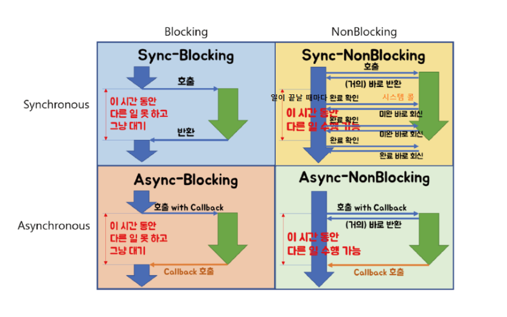

blocking vs nonblocking vs sync vs async

async와 sync의 핵심은 호출된 함수의 결과를 누가 처리하느냐이다
sync는 호출된 함수의 결과를 호출한 함수가 신경씀
async는 호출된 함수의 결과를 호출된 함수가 신경씀

blocking과 non-blocking의 핵심은 호출된 함수가 return을 바로해주냐 아니냐이다
blocking은 호출된 함수가 바로 리턴하지않음 (제어권을 바로 돌려주지않는다)
non-blocking은 호출된 함수가 바로 리턴 (제어권을 바로 돌려준다)

    - sync + blocking
      - socket.read
    - sync + non-blocking
      - 메서드 호출한쪽에서 Future.isDone 으로 계속 결과 확인하는하여 결과 가져오는것
    - async + blocking
      - asnyc + non-blocking에서 실수로 blocking 호출한경우
    - async + non-blocking
      - 메서드 요청하고 바로 리턴받는데, 결과는 별도스레드에서 메서드 호출시 넘겨준 콜백 실행될때..

[참고사이트](https://homoefficio.github.io/2017/02/19/Blocking-NonBlocking-Synchronous-Asynchronous/#about)

---

동기는 요청자가 어떤 요청에 대한 결과를 확인하고 진행. 그래서 요청에 대한 작업이 순차적으로 진행됨
비동기는 요청자가 어떤 요청에 대한 결과를 확인하고 진행하지않음. 결과에 대한 값은 반드시 요청자가 처리하지않는다. 그래서 요청에 작업이 순차적으로 진행됨을 보장하지않는다

blocking은 다른 요청의 작업을 처리하기 위해 현재 작업을 block 하는 것
non-blocking은 다른 요청의 작업을 처리하기 위해 현재 작업을 block 하지 않는 것

동기/비동기가 전체적인 작업에 대한 순차적인 흐름 유무라면, 블로킹/논블로킹은 전체적인 작업의 흐름 자체를 막냐 안 막냐
출처: https://inpa.tistory.com/entry/👩‍💻-동기비동기-블로킹논블로킹-개념-정리 [Inpa Dev 👨‍💻:티스토리]
