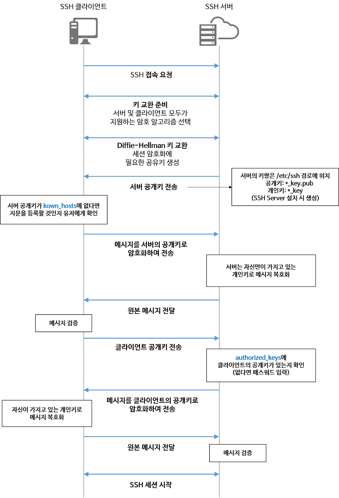

ssh 원리

쉽게 설명 : https://velog.io/@cdspacenoob/base00
설명 굿 : https://it-eldorado.tistory.com/157
나중에 꼭 정리하자

- 
  - [출처](https://gwonbookcase.tistory.com/56#:~:text=SSH%EB%8A%94%20%EA%B8%B0%EB%B3%B8%EC%A0%81%EC%9C%BC%EB%A1%9C%20%EC%82%AC%EC%A0%84,%EC%9B%90%EB%A6%AC%EB%A1%9C%20%EB%A1%9C%EA%B7%B8%EC%9D%B8%ED%95%98%EA%B2%8C%20%EB%90%A9%EB%8B%88%EB%8B%A4.)
    - 사이트 설명 매우 좋음

- [SSH 원리 및 EC2 접속 동작 방법](https://medium.com/@labcloud/ssh-%EC%95%94%ED%98%B8%ED%99%94-%EC%9B%90%EB%A6%AC-%EB%B0%8F-aws-ssh-%EC%A0%91%EC%86%8D-%EC%8B%A4%EC%8A%B5-33a08fa76596)

