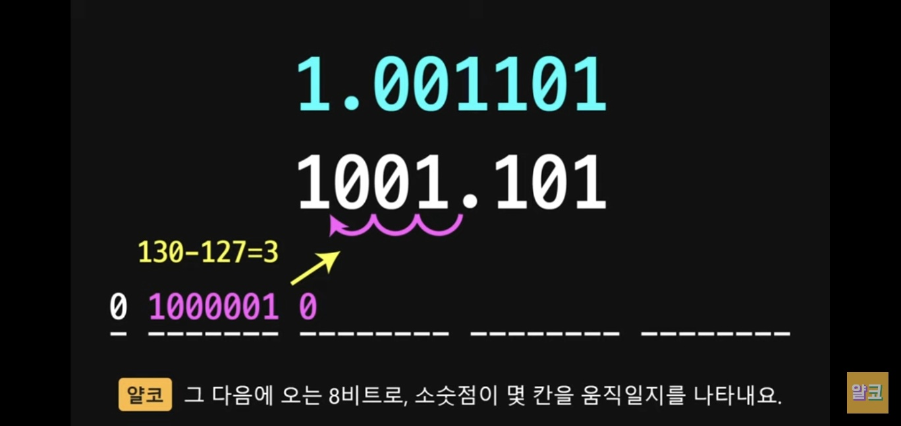
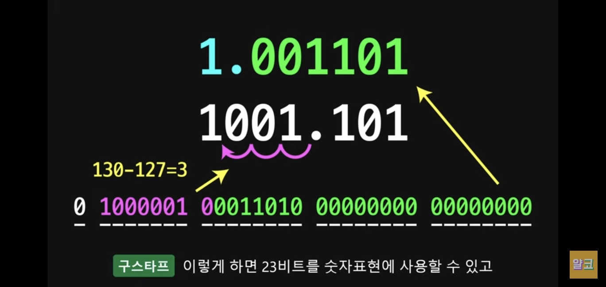

컴퓨터의 실수처리방법

- 부동소수점
  - 메모리에 32비트로 실수값을 저장한다고할때, 고정소수점(정수부와 실수부를 고정으로나눔)은 정수부를 많이쓸때는 실수부에 대한 정확도가 떨어질수있고, 실수부를 많이쓰게되면 정수부를 상대적으로 적게써야하므로 비효율적
  - 이에 대한 해결책으로 부동(Float - 둥둥떠다닌다)소수점이 나오게되었는데, 정수부와 실수부를 이진수로 각각 구한뒤 소수점을 이동시켜(이거때문에 둥둥 떠다닌다고 표현) 1.xxx 형식으로 변경시키는것이다
    - 그래서 아래와같이 구분된다 (32bit 기준)
      - 양수음수 구분 (1bit)
      - 소수점이 몇칸움직이는지 나타냄 (8bit)
      - 그리고 나머지 값들 채워줌 (23bit)
      - 
      - 
  - 이러다보니, 실수부에 계산이 정확하게 떨어지지않는 경우가 있게되었을때(ex. 0.1과 같은..) 23bit를 초과하게되면 나머지는 버리게된다.. 그로인해 실수간에 연산시에 기대하는 값과는 다른 경우가 생길수 있게된다..
    - 어떻게 해결? 
      - 라이브러리를 통해 해결가능(ex. 자바의 BigDecimal)
      - 정수로 변경해서 저장
      - 조금의 오차는 감안하겠다고한다면 double 사용 (8바이트 이므로 float보다 오차가 적으나 메모리 사용 커짐)
      - 문자열로 저장..

- 참고 사이트
  - [얄코설명](https://youtu.be/ZQDsWySjY6g)
    - 실수 계산방식도 잘 설명되어있음
  - [코딩애플설명](https://youtu.be/-GsrYvZoAdA)
    - 간단하게 설명굿
  - [설명깔끔](https://sungjpar.notion.site/9ae2f2d71e764773814c8ca8e228d543)
    