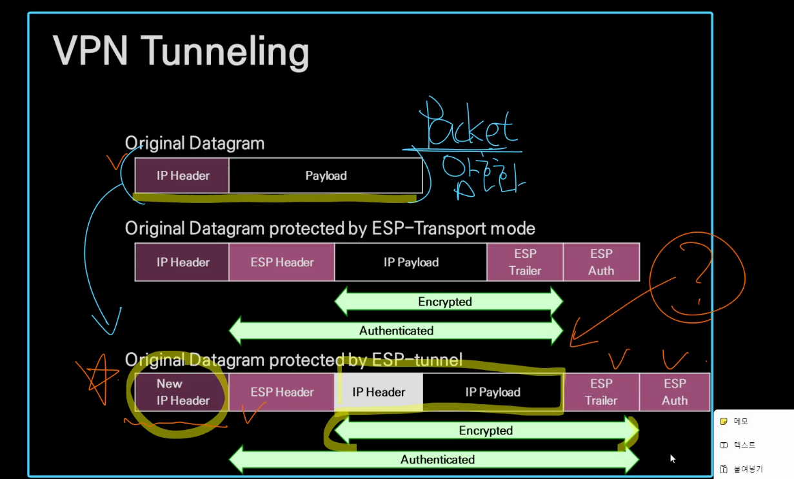
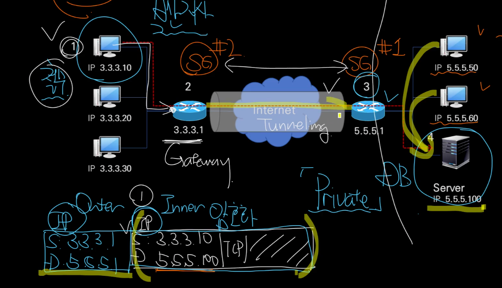
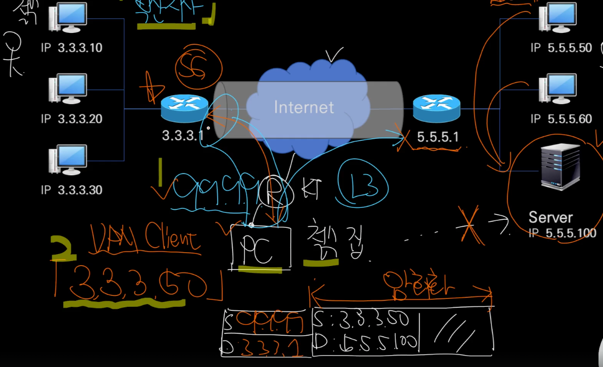

VPN (Virtual Private Network)
- Private Network
  - 물리적 통제 가능한 네트워크 (ex. LAN)
  - 왜 필요하냐..
    - 사설망은 보안과 직결
      - 회사의 중요 DB에 접근해야하는데, 이를 내부에서만 쓰고싶을때..
- 그럼 사실 네트워크를 전세계 모든곳에서 쓸수 잇나? 랜을 전세계에?
  - 불가능! 그래서 나온게 VPN! 가상사설망
    - 오픈된 네트워크인 Internet을 쓰되, 보안성을 확보해서 네트워크를 확장하자!
      - 암호화, 인증
- 물리적으로 모든곳에 랜선으로 연결하기가 어려우니.. 사용하게됨?

- IPSec (IP Security)
  - IPv4, IPv6 모두적용
  - G to G, G to E 모두 지원
    - G는 Gateway (라우터)
    - E는 endpoint (PC)
    - 게이트웨이간 연결하는것을 터널링 이라고함
      - 터널이니 외부에서 안보인다.. 라고생각하면됨
  - IPSec을 지원하는 Gateway는 SG(Secure Gateway)라고 부름
- VPN 터널링
  - 
    - 패킷을 암호화(IP header 포함)하고 새로운 IP header를 만들어놓은거라고 이해하면됨
- VPN G to G (L3 터널링)
  - 
    - 3.3.3.1인 SG가 5.5.5.100인 목적지를 보고 기존 패킷을 통째로 암호화 한뒤, 새로운 IP 헤더를 만든다.
      - 여기서 새롭게 만든 IP 헤더는 출발지가 3.3.3.1이고 목적지가 5.5.5.1 이 된다
      - 그리고 새로운 IP 헤더의 노출은 피할 수 없다
    - 5.5.5.1이 패킷을 받으면 새롭게 만든 IP 헤더는 제거하고 암호화된 패킷을 복호화해서 진짜 목적지로 전달해준다!

- VPN과 재택 (G to E)
  - 
    - 내용
      - 철수는 부산지사 다니고있음
      - 부산지사는 VPN으로 서울 본사의 5.5.5.100의 DB를 접근가능 (G to G)
        - 부산지사 SG: 3.3.3.1
        - 서울지사 SG: 5.5.5.1
      - 철수가 집에서 접근하고자함
        - 철수집 ip는 9.9.9.9
        - vpn client는 3.3.3.50
    - 철수가 본사 5.5.5.100에 어떻게접근?
      - PC에서 VPN client를 사용하면, 3.3.3.50을 받게되고, 이를 통해서 일단 부산지사로 **L3 터널링**
        - 여기서 vpn client가 출발지 3.3.3.50과 목적지 5.5.5.100의 패킷을 암호화하고 새로운 IP헤더를 만든다 (출발지: 9.9.9.9, 목적지: 3.3.3.1)
      - 부산지사 SG가 이를 전달받아서 서울지사 SG 로 전달
        - 여기서 앞서 만든 헤더를 제거하고 암호화된 패킷 복호화하여 어디로 가야할지를 확인한 뒤, 다시 패킷을 암호화. 그리고 새로운 IP 헤더도 만들고 전송 (출발지: 3.3.3.1, 목적지: 5.5.5.1)
      - 서울지사 SG가 최종 목적지 Server로 전송

- VPN?
  - 사설망을 물리적으로 쓰기엔 한계가 있으니 public인 인터넷 네트워크를 기반으로 보안을 추가한 가상사설망이 나오게됨
  - G to G, G to E로 나뉠 수 있는데, 보통 재택근무를위해 Vpn client를 사용하면 G to E가 된다
  - G to E 동작방식은 아래와같음
    - vpn client 실행시켜 SG 로 전송할 ip 받음
    - vpn client가 보내는 패킷을 암호화하고 새로운 IP 헤더 생성 (soruce: 나의 외부, dest: SG)
    - SG로 전송 (L3 터널링)
    - SG에서 복호화하여 어느 서버로 보내야할지 결정
      - 만약 또 다른 SG로 가야한다면 다시 패킷을 재 암호화하여 IP 헤더를 새로 만들어서 다시 전송 (soruce: 출발SG주소, dest:도착SG주소)