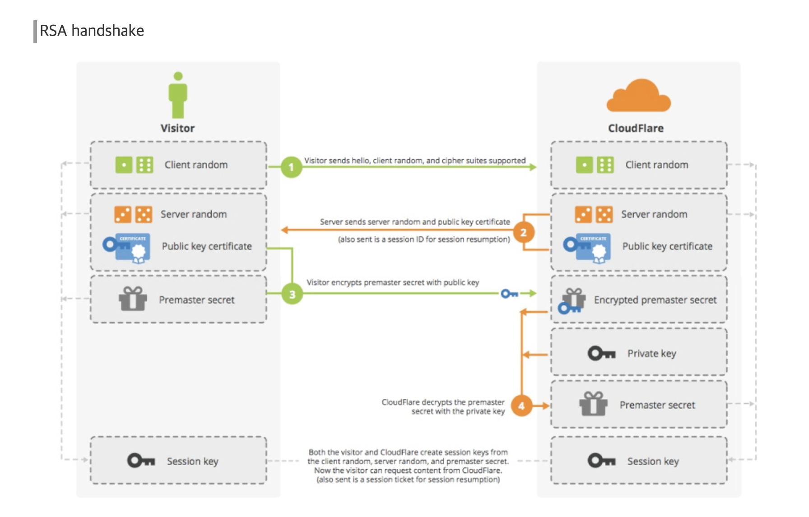
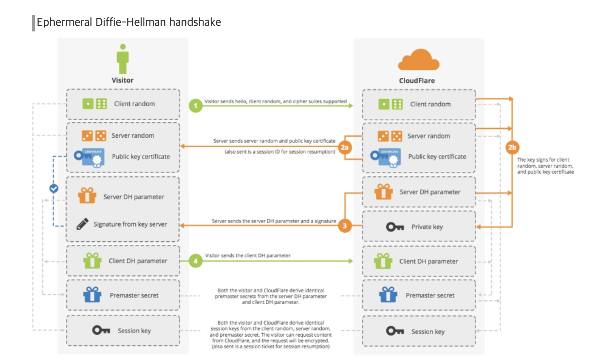
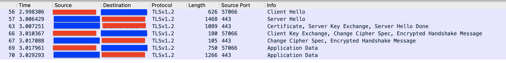

- ssl 정리!
  - ssl 목적
    - 안전한 서버인지 확인
    - 안전한 클라이언트인지 확인
      - 클라이언트가 서버에게 제공할 인증서 필요 (보통은 서버가 발급해주는듯)
    - 데이터전송시 암호화
  - tcp 3-way 핸드쉐이크 끝나고 진행
  - 아래와 같은 과정을 가짐 (tls 1.2v)
    - 
    1. Client Hello (클라이언트 -> 서버)
       - ssl 시작하니 본인 알려주는것인데, 3가지 전달
       - client가 원하는 TLS버전, 자신이 지원하는 cipher list, 자신이 생성한 난수정보
    2. Server Hello (클라이언트 <- 서버)
       - 서버에서 전달하는 인사.. 얘 또한 3가지 전달
       - 자신이 쓰고있는 ssl 버전, 자신이 생성한 난수정보, 클라의 cipher list중 하나 선택하여 전달
    3. Server certificate or Server Key Exchanges (클라이언트 <- 서버)
       - 자신이 가지고 있는 인증서 전송
    4. Certificate Request (클라이언트 <- 서버)
       - 클라이언트랑 마찬가지로 클라이언트에게 요놈이 정상인지 확인하기위해서 인증서를 요청!
       - 이는 옵션임
       - 보통의 naver와 같은 웹사이트의 ssl은 서버가 정상인지 확인하기 위해서 서버의 인증서만 받고 제대로된 인증서인지 확인하는데(브라우저, 즉 클라에서..), 클라이언트의 인증도 필요한 경우 이를 활용 (클라이언트에게 인증서 전달해주는 서비스는 이를 사용한다 보면될듯)
    5. Server hello done (클라이언트 <- 서버)
       - 서버 응답 끝..
    6. Client Certificate (클라이언트 -> 서버)
       - 서버가 Certificate Request를 보냈다면 이를 전달.. Client 인증서 없으면 패스
       - (이를 자바에서 사용하려면 클라이언트 인증서를 keystore에 등록..)
    7. Client key exchange (클라이언트 -> 서버)
       - 클라이언트는 자신이 만든 난수와 서버가 만든난수를 통해 pre-master-secret를 생성
       - pre-master-secret 이 바로 통신할때 사용할 대칭키로 보면되고, 이를 서버에게 전달받은 공개키로 암호화하여 전달
    8. Client verify (클라이언트 -> 서버)
       - 클라이언트 인증서의 무결성에 대해 검증하는부분. client 인증서 없으면 패스
    9. Change cipher spec / finished  (클라이언트 -> 서버)
       - 클라이언트가 협상된 알고리즘과 키를 활용해 Finish메세지를 암호화하여 전송
    10. Change cipher spec / finished (클라이언트 <- 서버)
       - 서버 또한 클라이언트의 메세지를 확인하고 동일하게 Change Cipher Specs 메시지 전송 후 (Finished)메세지를 통해 암호화 된 통신을 사용

- 서버에서 CA에 공개키가 포함된 csr을 전달하여 인증서들을 발급받게된다. 여기 인증서에는 루트ca인증서와 체인된 하위인증서와 서버인증서를 받게된다.
그렇다면, 이런 인증서들은 어쨌든 공개키를 담고있을것이고, 서버에서는 사용할 공개키도 모두 등록해야만 정상적으로 ssl 을 진행할수있을거라 생각할수있다. 맞다! 하지만, 자바에서 이를 일일이 집어넣지는않고, openssl을 활용하여 이 인증서를 조합하여 .p12 확장자로 만들어서,(p12 확장자는 개인키와 인증서 모두를 포함하고있는 인증서 확장자임)
이를 등록해준다! 
이렇게 셋팅이되기때문에 https 요청시 서버는 클라에게 인증서만 전달해주고, 인증서를 통해서 클라는 서버의 공개키를 기반으로 대칭키를 암호화해서 보낼때 서버에서 가지고 있는 개인키로 복호화하여 사용할수있게된다! 
1 way handshake를 설명했지만, client가 서버에 인증서를 전달하는 2 way handshake도 결국 같은방식이다..! (서버에 ca가 등록되어있는 trust manager 에서 클라가 정상적인 인증서인지 확인)
  - [인증서 등록 관련 내용 정리 굿](https://blog.jiniworld.me/96)
  - [springboot에 ssl 등록하는거 설명 굿](https://blog.jiniworld.me/97)

- ssl 2 way handshake
  - https://upload.wikimedia.org/wikipedia/commons/a/ae/SSL_handshake_with_two_way_authentication_with_certificates.svg

- tls 1.2v 와 tls 1.3v는 대칭키 생성 과정이 다르다! 당연 1.3v가 개선
  - [참고사이트](https://cabulous.medium.com/tls-1-2-andtls-1-3-handshake-walkthrough-4cfd0a798164)
- [참고사이트](https://run-it.tistory.com/29)
- [간결하게 잘 나옴](https://cheapsslsecurity.com/p/what-is-2-way-ssl-and-how-does-it-work/)
- [쉽게 정리](https://nuritech.tistory.com/25#:~:text=%EA%B2%80%EC%A6%9D%20%EC%9B%90%EB%A6%AC%EB%8A%94%20%EC%95%84%EB%9E%98%EC%99%80%20%EA%B0%99%EB%8B%A4,%EB%90%9C%20%EC%9D%B8%EC%A6%9D%EC%84%9C%EB%A5%BC%20%EB%B3%B5%ED%98%B8%ED%99%94%20%ED%95%9C%EB%8B%A4.)

- tls1.2 
  - RSA handshake
    - 
      - [출처](https://blog.cloudflare.com/content/images/2014/Sep/ssl_handshake_rsa.jpg)
    
  - Diffie-hellman handshake
    - 
      - [출처](https://blog.cloudflare.com/content/images/2014/Sep/ssl_handshake_diffie_hellman.jpg)
    - 
      - 대략 정리 (세션키 어떻게 만드는지를 중심으로..)
        - Red: client, Blue: server
        - Red -> Blue : Client Hello
          - Red가 Blue에게 자신이 생성한 난수를 전달
          - 현재상태 (키 교환에 필요한 값들만 정리)
            - Red가 가지고있는 값: Client 난수
            - Blue가 가지고있는 값: Client 난수
        - Red <- Blue : Server Hello
          - Blue가 Red 에게 자신이 생성한 난수를 전달
          - 현재상태 (키 교환에 필요한 값들만 정리)
            - Red가 가지고있는 값: Client 난수, Server 난수
            - Blue가 가지고있는 값: Client 난수, Server 난수
        - Red <- Blue : Certificate, Server Key Exchange, Server Hello Done
          - Certificate
            - 인증서전달
          - Server Key Exchange
            - Blue가 Red에게 diffie-hellman 키 교환을 위해 필요한 값들 전달
            - 이때 서버의 private key로 암호화
              - [관련내용](https://crypto.stackexchange.com/questions/47585/tls-does-diffie-hellman-make-private-keys-useless)
          - Server Hello Done
            - Blue가 Server에게 전달할거 다 전달했음을 알려줌
          - 현재상태 (키 교환에 필요한 값들만 정리)
            - Red가 가지고있는 값: Client 난수, Server 난수, pre-master secret key(diffie-hellman 키 교환을 통해 만듦. 이때, 서버(blue)는 아직 갖고있지못한데, 클라(red)로 부터 diffie-hellman 키 교환을 위한 값 전달을 못받았기때문), matser key (client난수, server난수, pre-master secret key 를 기반으로 만들어짐)
            - Blue가 가지고있는 값: Client 난수, Server 난수
        - Red -> Blue : Client Key Exchange, Chnage Cipher Sepc, Encryted Handshake Messgae
          - Client Key Exchange
            - 해당 단계에서 Blue에게로 받은 인증서 검사
            - 서버로 부터 전달받은 diffie-hellman 관련 데이터들을 인증서에서 가져온 서버의 public key로 복호화
            - diffie-hellman 키 교환을 위해 필요한 값 전달
          - 현재상태 (키 교환에 필요한 값들만 정리)
            - Red가 가지고있는 값: Client 난수, Server 난수, pre-master secret key, master key
            - Blue가 가지고있는 값: Client 난수, Server 난수, pre-master secret key, master key
        - Red <- Blue : Chnage Cipher Sepc, Encryted Handshake Messgae
          - 이제 Blue가 가지고있는 master key로 암호화하여 데이터 전송
        
        - 참고
          - Encryted Handshake Messgae (챗gpt답변)
            - SSL/TLS 핸드셰이크의 "Encrypted Handshake Message" 단계는 핸드셰이크 과정을 마무리하는 단계입니다. 이 단계에서, 클라이언트와 서버는 앞서 협상된 암호화 설정(세션 키 포함)을 사용하여 핸드셰이크 메시지를 암호화합니다. 이렇게 암호화된 메시지는 두 당사자가 핸드셰이크 과정에서 합의한 암호화 방식을 성공적으로 적용했음을 확인하는 역할을 합니다. 즉, 이 단계는 양측이 핸드셰이크 중 교환한 모든 정보를 안전하게 암호화했으며, 이제부터 모든 통신이 암호화된 채널을 통해 이루어질 것임을 나타냅니다.
          - Chnage Cipher Sepc (챗gpt답변)
            - "Change Cipher Spec" 단계는 SSL/TLS 핸드셰이크 과정의 일부로, 이 단계에서는 통신 양측이 이전 단계에서 협상한 암호화 방식(암호화 알고리즘, 키, 등)으로 전환하겠다는 의미입니다. 즉, 이 메시지는 실제로 데이터를 암호화하는 데 사용할 암호화 매개변수가 이제부터 적용될 것임을 양측에 알리는 신호로 작동합니다. 이 단계가 완료되면, 통신은 안전한 암호화된 채널을 통해 이루어지게 됩니다.
  - [ssl handshake 종류 및 방법에 대해서 설명 매우 잘되어있음](https://dokydoky.tistory.com/463)
  - [session key 어떻게 만드는지도 잘 나와있음. 좀더 추가로 보면 좋을 bealdung](https://www.baeldung.com/cs/pre-master-shared-secret-private-public-key)

- diffie-hellman key exchange
  - A와 B가 해당 암호화 공식을 사용하면, A만 알고있는 값이 있고 A가 모두에게 보여도 되는 값을 B에게 보내고, B 또한 자신만이 가지고있는 값이 있고 A에게 전달받은 값을 자신만 알고있는 값을 기반으로 만든 값을 A에게 응답해준다.(여기서 B가 A에게 전달하는 값은 모두가 알 수 있다). A와 B는 서로 전달받아 갖게된 값(모두에게 보여진값)과 자신들만이 가지고있는 값을 활용하여 A와 B 둘만이 알 수 있는 secret key를 얻게된다
    - 즉, 너무 신기하게도 둘이 데이터 교환한걸 모두가 볼 수 있는데, 자신만이 가지고있는 값(서로 당연 모름)을 기반으로 생성된 값이 동일해져서 secret key(대칭키)로 사용할 수 있게된것!
  

- 인증서 안에는 인증서의 데이터들을 합쳐서 hashing한 값을 CA가 private key로 암호화(서명)한 데이터가 있다. 클라이언트는 전달받은 해당 CA의 public key로 서명된 데이터를 복호화한뒤, 동일하게 인증서 데이터를 hashing 하여 두 값이 일치하는지 확인하는 과정을 통해서 이 인증서가 해당 CA에서 발급받은게 맞는지 확인을 한다. 
  - 보통 인증서의 구조를 보면, CA chain이 있는데, 이는 보통 중개CA(intermediate ca)를 통해서 인증서가 발급되기떄문.
  - 이런 중개 CA또한 루트 CA로 부터 정상적으로 인증되었는지 확인이 또한 필요한데, 위 과정과 동일
    - 클라이언트는 CA chain에 전달받은 중개 CA 인증서로부터 public key를 가져와서 서버 인증서의 서명을 검증하고, 이 검증이 유효하면 그 상위 CA(ex. root CA)의 public key를 통해 중개 CA 인증서의 서명을 검증한다. (참고로 루트 CA의 public key는 브라우저가 가지고있다..)