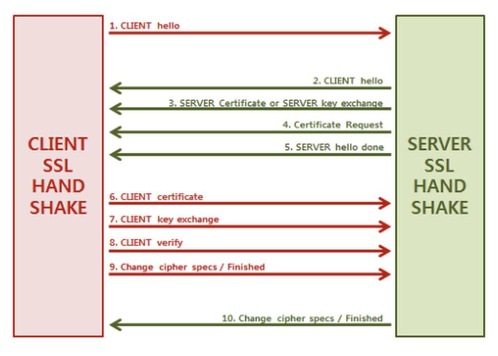

- ssl 정리!
  - ssl 목적
    - 안전한 서버인지 확인
    - 안전한 클라이언트인지 확인
      - 클라이언트가 서버에게 제공할 인증서 필요 (보통은 서버가 발급해주는듯)
    - 데이터전송시 암호화
  - tcp 3-way 핸드쉐이크 끝나고 진행
  - 아래와 같은 과정을 가짐 (tls 1.2v)
    - 
    1. Client Hello (클라이언트 -> 서버)
       - ssl 시작하니 본인 알려주는것인데, 3가지 전달
       - client가 원하는 TLS버전, 자신이 지원하는 cipher list, 자신이 생성한 난수정보
    2. Server Hello (클라이언트 <- 서버)
       - 서버에서 전달하는 인사.. 얘 또한 3가지 전달
       - 자신이 쓰고있는 ssl 버전, 자신이 생성한 난수정보, 클라의 cipher list중 하나 선택하여 전달
    3. Server certificate or Server Key Exchanges (클라이언트 <- 서버)
       - 자신이 가지고 있는 인증서 전송
    4. Certificate Request (클라이언트 <- 서버)
       - 클라이언트랑 마찬가지로 클라이언트에게 요놈이 정상인지 확인하기위해서 인증서를 요청!
       - 이는 옵션임
       - 보통의 naver와 같은 웹사이트의 ssl은 서버가 정상인지 확인하기 위해서 서버의 인증서만 받고 제대로된 인증서인지 확인하는데(브라우저, 즉 클라에서..), 클라이언트의 인증도 필요한 경우 이를 활용 (클라이언트에게 인증서 전달해주는 서비스는 이를 사용한다 보면될듯)
    5. Server hello done (클라이언트 <- 서버)
       - 서버 응답 끝..
    6. Client Certificate (클라이언트 -> 서버)
       - 서버가 Certificate Request를 보냈다면 이를 전달.. Client 인증서 없으면 패스
       - (이를 자바에서 사용하려면 클라이언트 인증서를 keystore에 등록..)
    7. Client key exchange (클라이언트 -> 서버)
       - 클라이언트는 자신이 만든 난수와 서버가 만든난수를 통해 pre-master-secret를 생성
       - pre-master-secret 이 바로 통신할때 사용할 대칭키로 보면되고, 이를 서버에게 전달받은 공개키로 암호화하여 전달
    8. Client verify (클라이언트 -> 서버)
       - 클라이언트 인증서의 무결성에 대해 검증하는부분. client 인증서 없으면 패스
    9. Change cipher spec / finished  (클라이언트 -> 서버)
       - 클라이언트가 협상된 알고리즘과 키를 활용해 Finish메세지를 암호화하여 전송
    10. Change cipher spec / finished (클라이언트 <- 서버)
       - 서버 또한 클라이언트의 메세지를 확인하고 동일하게 Change Cipher Specs 메시지 전송 후 (Finished)메세지를 통해 암호화 된 통신을 사용

- 서버에서 CA에 공개키가 포함된 csr을 전달하여 인증서들을 발급받게된다. 여기 인증서에는 루트ca인증서와 체인된 하위인증서와 서버인증서를 받게된다.
그렇다면, 이런 인증서들은 어쨌든 공개키를 담고있을것이고, 서버에서는 사용할 공개키도 모두 등록해야만 정상적으로 ssl 을 진행할수있을거라 생각할수있다. 맞다! 하지만, 자바에서 이를 일일이 집어넣지는않고, openssl을 활용하여 이 인증서를 조합하여 .p12 확장자로 만들어서,(p12 확장자는 개인키와 인증서 모두를 포함하고있는 인증서 확장자임)
이를 등록해준다! 
이렇게 셋팅이되기때문에 https 요청시 서버는 클라에게 인증서만 전달해주고, 인증서를 통해서 클라는 서버의 공개키를 기반으로 대칭키를 암호화해서 보낼때 개인키로 복호화하여 사용할수있게된다! 
1 way handshake를 설명했지만, client가 서버에 인증서를 전달하는 2 way handshake도 결국 같은방식이다..! (서버에 ca가 등록되어있는 trust manager 에서 클라가 정상적인 인증서인지 확인)
  - [인증서 등록 관련 내용 정리 굿](https://blog.jiniworld.me/96)
  - [springboot에 ssl 등록하는거 설명 굿](https://blog.jiniworld.me/97)

- ssl 2 way handshake
  - https://upload.wikimedia.org/wikipedia/commons/a/ae/SSL_handshake_with_two_way_authentication_with_certificates.svg

- tls 1.2v 와 tls 1.3v는 대칭키 생성 과정이 다르다! 당연 1.3v가 개선
  - [참고사이트](https://cabulous.medium.com/tls-1-2-andtls-1-3-handshake-walkthrough-4cfd0a798164)
- [참고사이트](https://run-it.tistory.com/29)
- [간결하게 잘 나옴](https://cheapsslsecurity.com/p/what-is-2-way-ssl-and-how-does-it-work/)
- [쉽게 정리](https://nuritech.tistory.com/25#:~:text=%EA%B2%80%EC%A6%9D%20%EC%9B%90%EB%A6%AC%EB%8A%94%20%EC%95%84%EB%9E%98%EC%99%80%20%EA%B0%99%EB%8B%A4,%EB%90%9C%20%EC%9D%B8%EC%A6%9D%EC%84%9C%EB%A5%BC%20%EB%B3%B5%ED%98%B8%ED%99%94%20%ED%95%9C%EB%8B%A4.)